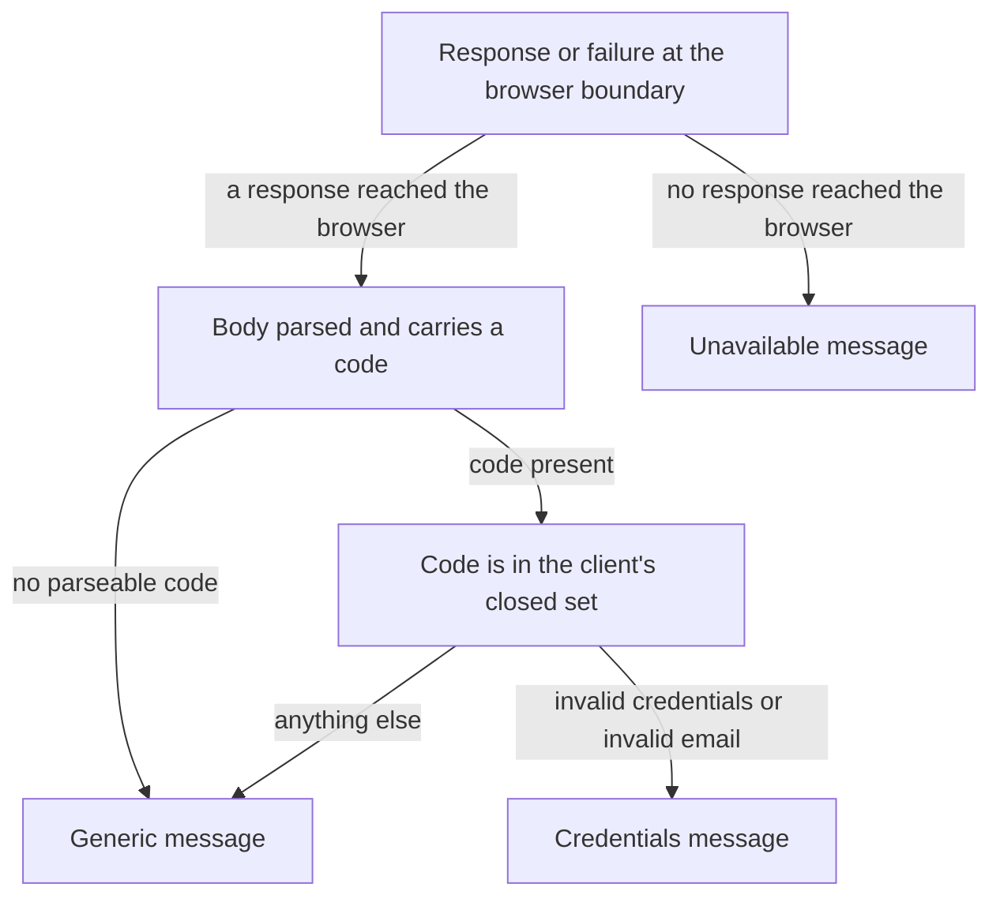

# ADR-023: The browser boundary selects a fixed message from an error code and never renders a backend string

| | |
| --- | --- |
| **Status** | Proposed |
| **Date** | 2026-09-25 |
| **ADR id** | `ADR-023` |
| **Backlog candidate** | None. This record turns `ADR-021` §8 `N2` from a property to be tested into a rule with a named mapping, and it is the recorded mitigation for `R-02` in `docs/architecture-inventory/risk-constraint-gap-register.md` |
| **Category / Impact** | Security & Frontend / medium |
| **Supersedes / Superseded by** | — (supersedes nothing; the platform has never recorded an error-presentation position) |
| **Deciders** | Unassigned — no `CODEOWNERS`, contributing guide or team metadata exists in any of the fourteen clones (`ADR-021` B1) |
| **Base ref of all cited source** | `feature/13652/spec-generation` |
| **Source** | `DO1` — *Common Pacco Login Experience*, work item **13652**, `intents/13652.md`: "no raw backend exception or stack trace reaching the user", and "see a clear non-technical error on invalid credentials or on identity-service failure" |
| **Related** | `ADR-021` (the client boundary, and `N2` which this record makes binding), `ADR-004` (the edge whose error extension makes this necessary), `ADR-006` (the authentication boundary whose failures are being presented), `ADR-022` (the session decision whose expiry message joins this message set) |

## Notation

| Symbol | Meaning |
| --- | --- |
| ✅ | Confirmed current behaviour — observed in source at the cited path and line range |
| 🎯 | Target state — intended design, not in production today |
| ❓ | Needs validation — assumed or inferred, not observed in source |
| `[INFERRED]` | Conclusion drawn from observed evidence rather than stated by it |

## Contents

1. [Context](#1-context)
2. [Decision Drivers](#2-decision-drivers)
3. [Architecture Fit Evaluation](#3-architecture-fit-evaluation)
4. [Options Considered](#4-options-considered)
5. [Decision](#5-decision)
6. [Consequences](#6-consequences)
7. [Compliance Considerations](#7-compliance-considerations)
8. [Non-Functional Requirements & Testing](#8-non-functional-requirements--testing)
9. [Relationship to the implementation pattern catalog](#9-relationship-to-the-implementation-pattern-catalog)
10. [Evidence](#10-evidence)
11. [Follow-Up Actions](#11-follow-up-actions)
12. [Assumptions, Blockers & Open Questions](#assumptions-blockers--open-questions)

---

## 1. Context

Until work item 13652 the Pacco platform had no human users. Every caller was a process, and a
detailed error body was a feature: the more the response said, the easier the integration was to
debug. The moment a browser client exists, the same response is read by a person, and several
properties that were harmless become problems.

What the platform does today, observed rather than assumed:

- ✅ The gateway is configured with `extensions.customErrors.includeExceptionMessage: true` in all
  four configuration files (`ntrada.yml:24-25` and its siblings). A downstream exception message
  reaches the caller.
- ✅ `identity-service` maps **every** mapped failure to **HTTP 400 Bad Request** with a body of
  `{code, reason}` — not 401, not 403, not 500. `ExceptionToResponseMapper` has no branch that
  produces any other status, including its unmatched default.
- ✅ One of those reasons echoes user input: `invalid_email` renders as
  `$"Invalid email: {email}."`, reflecting whatever the caller submitted straight back.
- ✅ Two different failures — an unknown account and a wrong password — deliberately produce the
  **same** `invalid_credentials` code, which is correct and must not be undone by a client that
  differentiates them for the user.
- ✅ The risk register carries `R-02` — *the gateway returns downstream exception messages to the
  browser* — with the disposition "mitigate client-side".

So the client is on the receiving end of a response that may carry an exception message, echoes
submitted input, and signals authentication failure with a status code that ordinarily means
"malformed request". A client written the obvious way — render `reason`, branch on the status —
produces a screen that leaks implementation detail and misreads 400 as a client-side bug.

### 1.1 What this record does *not* cover

- It does **not** change any backend behaviour. `includeExceptionMessage`, the 400 mapping and the
  `reason` strings are all unchanged. Changing them is a `CAP-01` and `CAP-02` decision with
  machine-caller consequences.
- It does **not** define copy for screens beyond the ones in scope. It defines the *rule* by which
  copy is selected, and the initial message set that rule operates on.
- It does **not** cover localisation. No Pacco surface is localised and none is planned here.

---

## 2. Decision Drivers

| # | Driver | Why it decides something here |
| --- | --- | --- |
| D1 | **A backend string must never become user-facing copy.** | The gateway may include an exception message, and one identity reason echoes submitted input. Rendering either turns a response body into an uncontrolled UI surface |
| D2 | **Status codes are not a reliable signal here.** | Every mapped failure is a 400. A client that branches on the status cannot distinguish bad credentials from a malformed request, and would show a "check your input" message for an authentication failure |
| D3 | **Account existence must not be disclosed.** | `identity-service` returns the same code for an unknown account and a wrong password. A client that gave `invalid_email` its own message would undo that at the last hop |
| D4 | **The user still needs to know what to do.** | "Something went wrong" for every failure is safe and useless. The message set must separate "your credentials are wrong" from "the service is unavailable", because those call for different user actions |
| D5 | **The rule must survive new failure modes.** | An unrecognised code must land somewhere safe by construction, not by someone remembering to add a branch |

---

## 3. Architecture Fit Evaluation

| # | Existing component evaluated | Does it own this today? | Can it own it? | Verdict |
| --- | --- | --- | --- | --- |
| F1 | **`Pacco.Web`** (`CAP-17`) | No — it does not exist as running code yet, but `ADR-021` §5 rule 1 gives it the presentation boundary | Yes | ✅ **Correct owner.** Presenting a failure to a person is presentation, and this is the boundary that owns it |
| F2 | **`api-gateway`** (`CAP-02`) — turning `includeExceptionMessage` off | It owns the setting | Technically yes | Rejected here. The setting serves existing machine callers, and flipping it is a platform change with consumers this feature cannot enumerate. Recorded as follow-up action 2 rather than done silently |
| F3 | **`identity-service`** (`CAP-01`) — changing the status codes or the reason strings | It owns both | Yes, but out of scope | The 400-for-everything mapping is consumed by existing callers. Changing it is a contract change, not a login-screen change. Recorded as `Q1` |
| F4 | **A shared frontend error component library** | No such thing exists | Not yet | There is one client and two screens. A library would be a design system by another name, which `ADR-021` §5 rule 7 explicitly declines to create |

**Conclusion.** No new architectural element. A rule on the component `ADR-021` already established.

---

## 4. Options Considered

| # | Option | Assessment |
| --- | --- | --- |
| 1 | **Render the `reason` field, since it is human-readable.** | Rejected. It is the direct path to `R-02`: a downstream exception message, or a reflected email address, appears on screen. Human-readable to an integrator is not the same as safe for a user |
| 2 | **Branch on the HTTP status code.** | Rejected. Every mapped failure is 400, so the branch has one live arm and misdescribes it |
| 3 | **Show one generic message for every failure.** | Rejected. Safe but unusable: a user cannot tell a typo from an outage, and `DO1` requires a clear error on invalid credentials specifically |
| 4 | **Turn off `includeExceptionMessage` at the edge and then trust the body.** | Rejected as the primary mechanism. It is a platform-wide change affecting machine callers, and it would leave the client trusting a response body — which is the habit this record is trying to remove. Worth doing on its own merits, as follow-up action 2 |
| 5 | **Map the `code` field to a fixed, closed message set, defaulting unknown codes to a generic message.** | ✅ **Chosen.** It uses the one field designed to be machine-read, keeps every user-facing string under the client's control, preserves the deliberate non-disclosure in `invalid_credentials`, and fails safe for codes that do not exist yet |

---

## 5. Decision

**`Pacco.Web` selects every user-facing failure message from a fixed, closed set, keyed on the
response's `code` field. The `reason` field and the HTTP status are never rendered, never logged to a
user-visible surface and never attached to telemetry. Any code the client does not recognise, and any
response it cannot parse, resolves to a generic message rather than to anything derived from the
response.**

Six rules follow and are part of the decision:

1. 🎯 **`code` is the only field a failure decision may read.** Not `reason`, not the status, not a
   header, not the response text.
2. 🎯 **`reason` is never rendered.** Not in the page, not in a tooltip, not in a details panel, not
   behind a developer toggle, not in a telemetry property. It may be read by a human debugging a live
   response in the network tab, which is where it belongs.
3. 🎯 **The message set is closed and owned by the client.** Adding a message is a change to the
   client's copy, reviewed as copy. A backend adding a new code does not add a message anywhere.
4. 🎯 **Unknown resolves to generic, by construction.** The mapping's default arm is the generic
   message, so a code the client has never seen is safe without anyone anticipating it.
5. 🎯 **HTTP 400 from this route is an authentication outcome, not a client-side input defect.** The
   client must not present it as "check your input" or as an application error, because
   `identity-service` uses 400 for credential failures by design.
6. 🎯 **Non-disclosure is preserved at the last hop.** `invalid_credentials` and `invalid_email`
   resolve to the **same** message. The client must not help a user discover whether an account
   exists, and must never surface an echoed email address from a reason string.

### 5.1 The initial message set

| Condition | `code` | Message shown |
| --- | --- | --- |
| Wrong password, unknown account, or a value that failed email validation | `invalid_credentials`, `invalid_email` | "The email or password you entered is incorrect." |
| The service is unreachable, the request timed out, or the browser blocked the call | — no response body | "Sign-in is temporarily unavailable. Please try again." |
| Any other code, an unparseable body, or a success body missing a required field | `error`, or anything unrecognised | "Something went wrong. Please try again." |
| The held session has expired (`ADR-022` §5 rule 4) | — no request was made | A session-expired notice, textually distinct from the first row |

### 5.2 The mapping

Every edge terminates in one of three client-owned strings. No path leads to a string that came from
the platform.

---

## 6. Consequences

### 6.1 Positive

1. **`R-02` is mitigated where the register says it should be** — at the client, without a
   platform-wide change.
2. **`ADR-021` `N2` becomes enforceable.** It was a property to test; it is now a rule with a named
   mechanism, so a reviewer can point at a violation instead of arguing about intent.
3. **Reflected input cannot reach the page.** The `invalid_email` reason echoing a submitted address
   is structurally unable to be rendered.
4. **New backend failures degrade gracefully.** A code introduced later shows the generic message
   rather than an empty string, a raw body or a crash.
5. **The non-disclosure property survives the last hop**, which is where such properties usually die.

### 6.2 Negative

1. **Diagnostic detail is lost to the user, deliberately.** A user who reports "something went
   wrong" gives support very little. The client-side correlation identifier on each attempt is the
   compensating mechanism, and it is weaker than a message.
2. **The mapping can drift from the backend.** If `identity-service` renames a code, the client
   silently falls through to generic and nobody is told. Follow-up action 1 exists for this, and it is
   a real cost of decoupling.
3. **Two distinct conditions share one message.** A user who mistypes an email address and one who
   mistypes a password see the same text. That is the intended security property, and it is worse
   usability than the alternative.
4. **The client now owns user-facing security copy** with no writer, no review process and no
   accessibility review behind it, because none exists.

### 6.3 Neutral / follow-on

1. This record makes turning off `includeExceptionMessage` a smaller change later, because no client
   will depend on it.
2. If Pacco is ever localised, the closed message set is the natural translation unit. Nothing here
   prevents that and nothing here provides it.

---

## 7. Compliance Considerations

No API-design standard, error standard or frontend standard exists anywhere in this repository or in
the fourteen clones. Every rule below is quoted from a record that exists.

| Rule | Source | Verbatim rule text | Strength | How this decision conforms |
| --- | --- | --- | --- | --- |
| ADR-021 §8 N2 | `docs/adr/standalone-browser-client-and-browser-caller-edge-contract.md` | "`Pacco.Web` must therefore map every non-success response to a fixed non-technical message and must never render a response body verbatim" | MUST | This record is that requirement expressed as a mechanism, with the mapping named and the default arm fixed |
| ADR-021 §5 rule 1 | same | "`Pacco.Web` owns presentation and nothing else." | MUST | Only presentation changes. No backend status, code or string is altered |
| ADR-004 §2 obl. 1 | `docs/adr/declarative-configuration-driven-api-gateway.md` | "The routing configuration is a reviewed architectural artifact, not an operations file." | MUST | No gateway configuration is changed by this record, including the error extension |
| ADR-004 §2 obl. 3 | same | "Response aggregation or per-client shaping must not be added to this configuration." | MUST NOT | The shaping happens in the client, which is where this obligation directs it |
| ADR-006 §2 | `docs/adr/edge-enforced-authentication-with-fail-open-authorization.md` | "Pacco enforces authentication at the gateway." | MUST | The client presents the outcome of an authentication decision it did not make and does not second-guess |

**External standard cited in this record.** None. The rules here follow from the platform's own
observed behaviour, not from an outside convention — which is deliberate, because importing an
unstated convention is the failure mode `ADR-021` D7 names.

### 7.1 Standards families with no covering content

| Family | Relevant here? | Covering content in `docs/`? | Disposition |
| --- | --- | --- | --- |
| API contracts — error envelope | **Yes** | **None.** The `{code, reason}` shape is a convention in one service, not a recorded standard | This record binds only the client's reading of it. The platform-side question is `Q1` |
| Frontend — user-facing copy and messaging | **Yes** | **None** | This record is the covering content, scoped to failure messages on this client |
| Security & privacy | Yes — non-disclosure and reflected input | `ADR-006`, `ADR-021` | Conformed to, per the table above |
| Observability | Yes, weakly — failure outcomes are counted | None covering browsers | The consuming spec defines failure telemetry carrying an outcome category and no message text |
| Async / eventing, Database, Multi-tenancy, AI governance, Clinical | No | n/a | Out of scope — nothing is published, stored, tenanted, inferred or clinical |
| Deployment & infra | No | `ADR-017`, `ADR-018` | Unaffected |

---

## 8. Non-Functional Requirements & Testing

| # | NFR | Posture set by this decision | How it is verified |
| --- | --- | --- | --- |
| N1 | **No backend string reaches the page** | `reason` is never read for display | Force each failure against the running stack and assert the raw body text appears nowhere in the rendered document, in storage or in telemetry |
| N2 | **Unknown codes are safe** | The default arm is the generic message | Return a fabricated code and assert the generic message is shown and nothing is left blank |
| N3 | **Non-disclosure holds** | Two codes share one message | Sign in with an unknown account and with a known account and a wrong password, and assert the rendered strings are identical |
| N4 | **Reflected input cannot appear** | `invalid_email`'s echoed value is never rendered | Submit a distinctive non-email value and assert it does not appear anywhere in the response-driven UI |
| N5 | **400 is presented as an authentication outcome** | Rule 5 | Assert the invalid-credentials path shows the credentials message rather than an input-format or application-error message |
| N6 | **Transport failures are distinguishable from credential failures** | Two different messages | Stop the identity service and assert the unavailable message, then restart and assert a wrong password produces the credentials message |

---

## 9. Relationship to the implementation pattern catalog

1. **Extends** `patterns/security/edge-enforced-authentication-with-identity-binding.md` (Status:
   `Candidate`) at the caller side. The pattern covers how a failure is produced and says nothing
   about how it is shown to a person.
2. **Relates to** the declarative-edge pattern without changing it: the edge's error extension stays
   as configured, and the mitigation is placed at the consumer.
3. **Pattern Drift:** none. No approved pattern states an error-presentation position.
4. **Pattern Update Proposal:** the security pattern's *Anti-patterns* section should name
   "rendering the error body to a user" explicitly, because it is the default behaviour of nearly
   every HTTP client wrapper and reads as helpful.

---

## 10. Evidence

| # | Claim | Source |
| --- | --- | --- |
| 1 | The edge may include a downstream exception message in its error response | `ntrada.yml:24-25`, `extensions.customErrors.includeExceptionMessage: true`, identical in all four configuration files |
| 2 | Every mapped identity failure is HTTP 400 with `{code, reason}` | `Pacco.Services.Identity.Infrastructure/Exceptions/ExceptionToResponseMapper.cs` — every branch, including the unmatched default, returns `HttpStatusCode.BadRequest` |
| 3 | `invalid_email` echoes the submitted value | `Pacco.Services.Identity.Application/Exceptions/InvalidEmailException.cs`, message `$"Invalid email: {email}."` |
| 4 | Unknown account and wrong password share one code | Both paths raise the invalid-credentials exception in `IdentityService.SignInAsync` |
| 5 | The risk is already recorded with this disposition | `docs/architecture-inventory/risk-constraint-gap-register.md`, `R-02` — mitigate client-side |
| 6 | The requirement this record makes binding | `ADR-021` §8 `N2` |
| 7 | The intent requires it | `intents/13652.md`, `DO1`: "no raw backend exception or stack trace reaching the user" |

### 10.1 Documentation-versus-code conflicts

One, and it is resolved in favour of the code. A reader would reasonably expect a failed sign-in to
return HTTP 401, and nothing in the corpus says otherwise. The source returns 400 for every mapped
failure. Rule 5 exists because of that conflict, and the specification consuming this record states
the same fact rather than quietly assuming 401 somewhere.

---

## 11. Follow-Up Actions

| # | Action | Owner | Trigger |
| --- | --- | --- | --- |
| 1 | Add a contract check that fails when `identity-service` returns a code the client's mapping does not know | Frontend implementer with `CAP-01` owner | First release of the client |
| 2 | Evaluate turning `extensions.customErrors.includeExceptionMessage` off at the edge, once every machine consumer of the message has been identified | Platform owner | Independent of this feature |
| 3 | Revisit the closed message set when a Pacco surface needs a failure message that is not authentication-related | Architecture | The first such surface |
| 4 | If Pacco is ever localised, make the closed message set the translation unit | Product | Localisation is proposed |

---

## Assumptions, Blockers & Open Questions

> [!IMPORTANT]
> This section is the single source of truth for unresolved items. Items marked `[ACTION NOW]` block progress until answered. Items marked `[handled later by <stage>]` are deliberately deferred and must not be re-raised as blockers in this stage.

### Assumptions

| # | Assumption | Rationale | Impact if wrong |
| --- | --- | --- | --- |
| A1 | The gateway forwards the identity service's `{code, reason}` body to the browser rather than replacing it with its own envelope | ⚠️ `NON_BLOCKING_ASSUMPTION`. The sign-in route is declared as a plain downstream proxy with a JSON content type and no response transformation | The client never sees a `code`, every failure falls through to the generic message, and the credentials message never appears. The default arm makes this degrade safely, and the first integration test against the running stack exposes it |
| A2 | The error codes observed in source are the complete set this route can produce | ⚠️ `NON_BLOCKING_ASSUMPTION`. They are every branch of the mapper reachable from sign-in | An unlisted code appears and shows the generic message. Rule 4 makes that the designed outcome rather than a defect |
| A3 | Three user-facing messages plus a session-expired notice are sufficient for the screens in scope | ⚠️ `NON_BLOCKING_ASSUMPTION`. The scope is one form with one submit action | A user is under-informed in a case nobody anticipated. Follow-up action 3 covers the next surface |

### Blockers

| # | Blocker | Impact | Owner | Needed to unblock |
| --- | --- | --- | --- | --- |
| B1 | **[ACTION NOW]** No named owner or reviewer exists for user-facing security copy | Three strings that are the user's entire view of an authentication failure ship with no accountable reviewer | Product with Platform owner | Name a reviewer for the message set |

### Open Questions

| # | Question | Context | Recommendation | Owner |
| --- | --- | --- | --- | --- |
| Q1 | **[handled later by the `CAP-01` owner]** Should `identity-service` return 401 for credential failures instead of 400? | Every mapped failure is 400 today, including authentication ones. It is correct for no caller and merely tolerable for all of them | Leave it for now. It is a contract change with machine consumers, and rule 5 removes the client's exposure to it | `CAP-01` owner |
| Q2 | **[handled later by the platform owner]** Should the edge stop including downstream exception messages? | It is on in all four configurations and serves existing machine callers | Do it once those callers are identified. This record removes the urgency, not the reason | Platform owner |
| Q3 | **[handled later by the wave-1 low-level spec]** Where should the correlation identifier be surfaced to a user reporting a problem? | Without a message, support has only the identifier, and today it is not shown anywhere | Consider showing it in small type beneath the generic message only. Do not show it beside the credentials message, where it would imply a system fault | Product |
