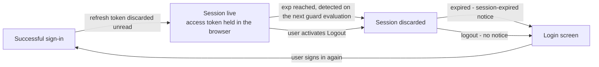

# ADR-022: A Pacco browser session ends at access-token expiry, and the refresh token is not held

| | |
| --- | --- |
| **Status** | Proposed |
| **Date** | 2026-09-25 |
| **ADR id** | `ADR-022` |
| **Backlog candidate** | None. This record answers `Q1` of `docs/adr/standalone-browser-client-and-browser-caller-edge-contract.md`, which that record raised as `[ACTION NOW]`: "How does a Pacco browser session continue past access-token expiry, given the refresh token has no redeemable route at the edge? ... Do not leave it implied." |
| **Category / Impact** | Security & Frontend / medium |
| **Supersedes / Superseded by** | — (supersedes nothing; no session-lifetime decision has ever been recorded) |
| **Deciders** | Unassigned — no `CODEOWNERS`, contributing guide or team metadata exists in any of the fourteen clones (`ADR-021` B1) |
| **Base ref of all cited source** | `feature/13652/spec-generation` |
| **Source** | `DO2` — *Role-Aware Landing Page with Session Protection and Logout*, work item **13652**, `intents/13652.md`: "An already-expired token is handled the same way: the UI clears the session and redirects to Login with a session-expired message." |
| **Related** | `ADR-021` (the client boundary and the logout semantics this record completes), `ADR-007` (the trust root and the revocation position this record does not change), `ADR-006` (authentication enforced at the edge), `ADR-004` (the declarative edge where a refresh route would have to be declared) |

## Notation

| Symbol | Meaning |
| --- | --- |
| ✅ | Confirmed current behaviour — observed in source at the cited path and line range |
| 🎯 | Target state — intended design, not in production today |
| ❓ | Needs validation — assumed or inferred, not observed in source |
| `[INFERRED]` | Conclusion drawn from observed evidence rather than stated by it |

## Contents

1. [Context](#1-context)
2. [Decision Drivers](#2-decision-drivers)
3. [Architecture Fit Evaluation](#3-architecture-fit-evaluation)
4. [Options Considered](#4-options-considered)
5. [Decision](#5-decision)
6. [Consequences](#6-consequences)
7. [Compliance Considerations](#7-compliance-considerations)
8. [Non-Functional Requirements & Testing](#8-non-functional-requirements--testing)
9. [Relationship to the implementation pattern catalog](#9-relationship-to-the-implementation-pattern-catalog)
10. [Evidence](#10-evidence)
11. [Follow-Up Actions](#11-follow-up-actions)
12. [Assumptions, Blockers & Open Questions](#assumptions-blockers--open-questions)

---

## 1. Context

`ADR-021` established `Pacco.Web` as the platform's standalone browser client and fixed how it
reaches the platform, but it deliberately left one question open and marked it `[ACTION NOW]`: what
happens when the access token the browser is holding expires.

The facts that make this a real question rather than a detail:

- ✅ `identity-service` issues an access token with a **60 minute** lifetime
  (`Pacco.Services.Identity.Api/appsettings.json`, `jwt.expiryMinutes: 60`).
- ✅ It also issues a **refresh token** on every successful sign-in. `IdentityService.SignInAsync`
  sets `auth.RefreshToken = await _refreshTokenService.CreateAsync(user.Id)` after the JWT is minted.
- ✅ The refresh token is returned to the caller in `AuthDto`, so the browser receives it whether it
  wants it or not.
- ✅ **No gateway route exists for redeeming it.** None of `ntrada.yml`, `ntrada.docker.yml`,
  `ntrada-async.yml` or `ntrada-async.docker.yml` declares `refresh-tokens/use`,
  `refresh-tokens/revoke` or `access-tokens/revoke`. The identity endpoints exist in the service and
  are unreachable from outside the network.
- ✅ The risk register carries this as `R-10` — *refresh token cannot be redeemed at the edge* —
  with the disposition "accept now, decide later". This record is the "later".

So the browser is handed a credential it has no way to use, and an hour after sign-in its session
stops working. Nothing in the corpus states what should happen at that moment, which means every
implementer would decide it privately and differently.

### 1.1 What this record does *not* cover

- It does **not** decide the access-token lifetime. Sixty minutes is `identity-service`'s existing
  configuration and changing it is a `CAP-01` decision.
- It does **not** add, remove or modify any gateway route. That is `ADR-004` territory and doing it
  here would reverse `ADR-021` §5 rule 5 as a side effect.
- It does **not** change the split trust root or the revocation posture. `ADR-007` still owns both,
  and both are still open.
- It does **not** decide anything about server-side sessions, because Pacco has none.

---

## 2. Decision Drivers

| # | Driver | Why it decides something here |
| --- | --- | --- |
| D1 | **A credential that cannot be used must not be stored.** | The refresh token is unusable from the browser because no edge route redeems it. Holding it in browser storage adds a stealable secret and buys nothing. `R-08` already records credential leakage into storage as a live risk |
| D2 | **The expiry moment must be a designed state, not an error.** | Without a decision, expiry first appears to the user as a failed call with a technical message. `DO2` explicitly requires the session-expired path to end at Login with a session-expired message |
| D3 | **Exposing revocation or refresh at the edge is out of scope by instruction.** | `DO2` targets "0 new logout/revoke gateway routes added and 0 changes to the gateway's JWT validation or revocation behaviour". A refresh route is exactly the kind of change that target forbids |
| D4 | **The client must not invent a token lifetime.** | `AuthDto.Expires` is a `long` produced inside the `Convey.Auth` package, whose source is not in this workspace, so its unit cannot be read. Guessing seconds or milliseconds would produce a session that is either 60 minutes or 60 milliseconds long, and only one of those fails loudly |
| D5 | **Silence is worse than a limited answer.** | An implied session model is the thing `ADR-021` `Q1` asked not to leave behind. A stated, narrow position can be revisited. An unstated one gets copied |

---

## 3. Architecture Fit Evaluation

Nothing new is introduced by this record. It constrains an existing component and closes an open
question, so the evaluation is about which existing owner should carry the rule.

| # | Existing component evaluated | Does it own this today? | Can it own it? | Verdict |
| --- | --- | --- | --- | --- |
| F1 | **`Pacco.Web`** (`CAP-17`) — the browser session holder established by `ADR-021` | Partly. It owns session handling in the browser by `ADR-021` §5 rule 1 | Yes | ✅ **Correct owner.** The session is browser-held, so its lifetime rule belongs where the session lives |
| F2 | **`api-gateway`** (`CAP-02`) | No | Only by adding a refresh route | Rejected. That is precisely the change `DO2` forbids and `ADR-021` §5 rule 5 excludes |
| F3 | **`identity-service`** (`CAP-01`) | It owns issuance and revocation, and already implements both | Not for this question | The service's behaviour is unchanged. What is undecided is what the *browser* does when the token it holds stops being accepted |

**Conclusion.** No new architectural element is required. This is a rule attached to the component
`ADR-021` already created.

---

## 4. Options Considered

| # | Option | Assessment |
| --- | --- | --- |
| 1 | **Route the refresh endpoint at the edge and renew silently in the browser.** | Rejected. It adds a gateway route, which `DO2` targets at zero and `ADR-021` §5 rule 5 excludes. It would also make the browser hold a long-lived credential in storage, worsening `R-08`, and it would raise the revocation question `ADR-007` has open — a refresh token that cannot be revoked at the edge is a worse artifact than an access token that cannot be |
| 2 | **Store the refresh token now, use it later.** | Rejected as the worst of both. The client would carry a stealable secret for an entire release cycle with no code path that reads it. A credential with no consumer is pure liability |
| 3 | **Say nothing and let each wave decide.** | Rejected. This is the state `ADR-021` `Q1` named as unacceptable. Two waves would produce two session models for one client |
| 4 | **End the session at access-token expiry, discard the refresh token unread, and state the limitation.** | ✅ **Chosen.** It is the only option that adds no edge surface, stores no unusable secret, and gives the expiry moment a designed behaviour. Its cost — a user signs in again at most once an hour — is visible, bounded and reversible |
| 5 | **Shorten the access-token lifetime to make the gap smaller.** | Rejected as out of scope. The lifetime is `identity-service` configuration and changing it affects every caller, not only the browser |

---

## 5. Decision

**A Pacco browser session begins at a successful sign-in and ends when the access token expires.
`Pacco.Web` discards the refresh token without storing it, performs no renewal of any kind, and
detects expiry locally from the token's own `exp` claim. No refresh, renewal or revocation route is
added at the edge, and the gateway's JWT validation behaviour is unchanged.**

Five rules follow and are part of the decision:

1. 🎯 **The refresh token is discarded unread.** It is not written to browser storage, not held in
   the session object, and not read into any variable that outlives the sign-in response handler. The
   platform issues it; the browser client declines it.
2. 🎯 **Session expiry is derived from the JWT `exp` claim, not from the response's `expires`
   field.** `exp` is fixed by RFC 7519 as a NumericDate — seconds since epoch — whereas the unit of
   `AuthDto.Expires` originates inside a package with no source in this workspace and cannot be
   verified here. A token whose `exp` claim cannot be parsed is treated as a malformed response and
   no session is written.
3. 🎯 **Expiry is evaluated on every route-guard decision, not only on a timer.** A session that
   expired while a tab was inactive is caught on the next navigation rather than on the next call.
4. 🎯 **The expired path is the logout path plus a message.** The session is discarded, the user
   lands on Login, and a session-expired notice is shown that is textually distinct from the
   invalid-credentials message. No technical detail, status code or token value appears in it.
5. 🎯 **No renewal mechanism is added anywhere.** No background timer, no retry-on-401 renewal, no
   activity-based extension, and no reference to any refresh route in client code. If Pacco later
   wants sessions that outlive an access token, that is a new record that adds a route at the edge
   and decides the revocation question with it — not a client change.

### 5.1 The session lifetime

The two ways a session ends converge on the same discard. Only the message differs, which is why
`Pacco.Web` needs one session-clearing path and not two.

---

## 6. Consequences

### 6.1 Positive

1. **One less stealable credential in the browser.** The refresh token is the longer-lived of the
   two and it never reaches storage. This narrows `R-08` rather than widening it.
2. **The expiry moment has a defined behaviour** instead of surfacing as a failed call with a
   technical message.
3. **`ADR-021` `Q1` is closed** with a stated position, which was what that question asked for.
4. **`R-10` moves from "accept now, decide later" to decided.** The refresh token being
   unredeemable at the edge is no longer an open gap for the browser client — it is a property the
   client is designed around.
5. **The edge is untouched**, so `DO2`'s zero-new-routes target is met by construction rather than
   by discipline.

### 6.2 Negative

1. **A user is signed out at most once an hour**, with no warning, from wherever they are. For the
   two screens in scope there is nothing to lose, but the first Pacco surface that holds unsaved
   user input will feel this sharply, and that surface will need this record revisited.
2. **The platform issues a credential nobody uses.** `identity-service` still mints, stores and
   expires refresh tokens for every browser sign-in. That is wasted work and a small amount of
   pointless data, and this record does not fix it because fixing it means changing `CAP-01`.
3. **Expiry detection is client-side and therefore advisory.** A user can edit their own browser
   state to keep a session object alive past its expiry. The access token stops being accepted by the
   platform when it expires regardless, so nothing is protected by the client's honesty — but no one
   should read rule 3 as an enforcement mechanism.
4. **This record does not make logout safer.** `ADR-021` §5 rule 5's limitation stands unchanged:
   an already-issued token remains acceptable to the gateway and to the domain services until it
   expires. What this record adds is that the window is now known to be at most the token lifetime.

### 6.3 Neutral / follow-on

1. If a future Pacco surface needs sessions longer than the token lifetime, the change is a new
   record covering a refresh route at the edge, and it must settle revocation at the same time — a
   refresh token redeemable at an edge that consults no deny-list is a worse position than today's.
2. Shortening `jwt.expiryMinutes` becomes a user-visible change once a browser client exists. It was
   previously invisible because every caller was a machine.

---

## 7. Compliance Considerations

There is no `docs/standards/` tree in this repository and no frontend, session or token standard
anywhere in the fourteen clones. Every rule below is quoted from a record that exists.

| Rule | Source | Verbatim rule text | Strength | How this decision conforms |
| --- | --- | --- | --- | --- |
| ADR-021 §5 rule 5 | `docs/adr/standalone-browser-client-and-browser-caller-edge-contract.md` | "The already-issued token is not invalidated at the platform level: it remains acceptable to the gateway and to the domain services until it expires." | MUST | This record repeats the limitation rather than softening it, and bounds the exposure window at the token lifetime |
| ADR-021 §5 rule 1 | same | "`Pacco.Web` owns presentation and nothing else." | MUST | The session lifetime rule is a browser-held-state rule. No domain behaviour is added to the client |
| ADR-007 §2 rule 4 | `docs/adr/split-jwt-trust-root-gateway-and-services.md` | "Revocation is consulted at the boundary that enforces authentication." | Open obligation | Unchanged and still open. This record adds no revocation route and claims no revocation behaviour |
| ADR-004 §2 obl. 3 | `docs/adr/declarative-configuration-driven-api-gateway.md` | "Response aggregation or per-client shaping must not be added to this configuration." | MUST NOT | Nothing is added to the edge configuration by this record at all |
| ADR-006 §2 | `docs/adr/edge-enforced-authentication-with-fail-open-authorization.md` | "Pacco enforces authentication at the gateway." | MUST | Expiry is still enforced by the platform when the token is presented. The client's local check is a user-experience decision layered on top, not a substitute |

**External standard cited in this record.** RFC 7519 §4.1.4 defines the `exp` claim as a NumericDate
— "the number of seconds from 1970-01-01T00:00:00Z UTC until the specified UTC date/time". Rule 2
relies on exactly that, which is why expiry is read from `exp` rather than from a field whose unit is
undocumented in this workspace.

### 7.1 Standards families with no covering content

| Family | Relevant here? | Covering content in `docs/`? | Disposition |
| --- | --- | --- | --- |
| Session & token lifetime | **Yes** | **None** before this record | This record is the covering content, scoped to the browser client only |
| API contracts | No — no interface is added or changed | None exists | Out of scope |
| Async / eventing | No | n/a | Out of scope |
| Database | No — nothing is persisted | n/a | Out of scope |
| Security & privacy | Yes | `ADR-006`, `ADR-007`, `ADR-021` | Conformed to, per the table above |
| Observability | Yes, weakly — an expiry-driven sign-out is a signal worth counting | None covering browsers | The consuming spec defines a session-expired telemetry event. No platform rule is available to conform to |
| AI governance | No | n/a | Out of scope |
| Clinical / regulated domain | No | n/a | Out of scope |
| Deployment & infra | No — no deployable changes | `ADR-017`, `ADR-018` | Unaffected |

---

## 8. Non-Functional Requirements & Testing

| # | NFR | Posture set by this decision | How it is verified |
| --- | --- | --- | --- |
| N1 | **The refresh token never reaches storage** | It is discarded inside the response handler | Sign in, then search every browser storage area and the session object for the refresh token value returned on the wire. It must appear nowhere |
| N2 | **Expiry is detected before a call is made** | The route guard evaluates `exp` on every decision | Inject a session whose `exp` is in the past, navigate to the landing route, and assert the redirect happens with zero outbound requests |
| N3 | **No renewal traffic exists** | No timer, no retry-renewal, no refresh route reference | Observe the client from sign-in past the expiry moment and assert no request leaves the browser. Scan the source for any refresh route literal |
| N4 | **A malformed token fails loudly** | An unparseable `exp` is treated as a malformed response | Return a 200 whose access token has no readable `exp` claim and assert no session is written and the generic failure message is shown |
| N5 | **The expired message is distinguishable** | The session-expired notice differs from the invalid-credentials message | Drive both paths and assert the two rendered strings differ |
| N6 | **Residual: the discarded token still works** | Accepted, unchanged from `ADR-021` | Capture a token, let the client discard it, replay it against an authenticated gateway route before its expiry. It will succeed. The test exists to keep the residual visible, not to pass |

No availability or latency target is asserted. None exists for any Pacco component.

---

## 9. Relationship to the implementation pattern catalog

1. **Constrains** `patterns/security/edge-enforced-authentication-with-identity-binding.md` (Status:
   `Candidate`). The pattern describes the enforcement point and says nothing about what a caller does
   when its credential expires. This record supplies the browser caller's half and scopes it to that
   caller only.
2. **Relates to** `ADR-007`'s revocation obligation without discharging it. A session bounded by
   expiry is not a substitute for revocation, and nothing here should be read as closing that gap.
3. **Pattern Drift:** none. Every pattern in the catalog is `Candidate`, and no pattern states a
   session-lifetime position to drift from.
4. **Pattern Update Proposal:** the security pattern should state what a caller is expected to do at
   credential expiry, because the platform now has a caller that is a human being rather than a
   process with a retry loop.

---

## 10. Evidence

| # | Claim | Source |
| --- | --- | --- |
| 1 | Access tokens live for 60 minutes | `Pacco.Services.Identity.Api/appsettings.json`, `jwt.expiryMinutes: 60` |
| 2 | A refresh token is minted on every sign-in | `Pacco.Services.Identity.Application/Services/Identity/IdentityService.cs`, `SignInAsync` sets `auth.RefreshToken` after the JWT is created |
| 3 | The refresh token is returned to the caller | `Pacco.Services.Identity.Application/DTO/AuthDto.cs` carries `AccessToken`, `RefreshToken`, `Role` and `Expires` |
| 4 | No refresh or revoke route exists at the edge | Searched all four gateway configuration files for `refresh-tokens` and `access-tokens`. No match in `ntrada.yml`, `ntrada.docker.yml`, `ntrada-async.yml` or `ntrada-async.docker.yml` |
| 5 | `Expires` originates outside this workspace | `Pacco.Services.Identity.Infrastructure/Auth/JwtProvider.cs` copies `jwt.Expires` from `IJwtHandler.CreateToken`, supplied by the `Convey.Auth` package reference. No source for that package is present |
| 6 | The gap is already on the register | `docs/architecture-inventory/risk-constraint-gap-register.md`, `R-10` — refresh token cannot be redeemed at the edge, disposition "accept now, decide later" |
| 7 | The question this record answers | `ADR-021` ABQ `Q1`, marked `[ACTION NOW]` |

### 10.1 Documentation-versus-code conflicts

None found. The intent, `ADR-021` and the source agree that no redemption route exists. The only
unverifiable item is evidence 5, and rule 2 is written specifically so that nothing depends on it.

---

## 11. Follow-Up Actions

| # | Action | Owner | Trigger |
| --- | --- | --- | --- |
| 1 | Revisit this record before shipping any Pacco browser surface that holds unsaved user input | Architecture | The first such surface is specified |
| 2 | Decide whether `identity-service` should stop minting refresh tokens for browser callers, or whether browser sign-in should be distinguishable at all | `CAP-01` owner | After the first release, once the waste is measurable |
| 3 | If a refresh route is ever proposed at the edge, settle `ADR-007`'s revocation obligation in the same record | Architecture | A refresh route is proposed |
| 4 | Verify the unit of `AuthDto.Expires` against the toolkit's published source, and record it, so a later reader is not blocked by the same gap | Platform owner | Opportunistic |

---

## Assumptions, Blockers & Open Questions

> [!IMPORTANT]
> This section is the single source of truth for unresolved items. Items marked `[ACTION NOW]` block progress until answered. Items marked `[handled later by <stage>]` are deliberately deferred and must not be re-raised as blockers in this stage.

### Assumptions

| # | Assumption | Rationale | Impact if wrong |
| --- | --- | --- | --- |
| A1 | The access token issued to a browser carries a readable, standard `exp` claim | ⚠️ `NON_BLOCKING_ASSUMPTION`. The token is a JWT minted by the platform's own handler with a configured expiry, and `exp` is the standard claim for that value | If `exp` is absent, every sign-in is treated as malformed and no one can sign in. The failure is immediate, total and obvious at the first test, which is why it is not carried as a blocker |
| A2 | A sixty-minute working session is acceptable for the two screens in scope | ⚠️ `NON_BLOCKING_ASSUMPTION`. Neither screen holds user input worth losing | A user loses work on a later surface. Follow-up action 1 exists for exactly that moment |
| A3 | No existing Pacco caller depends on the browser redeeming a refresh token | ⚠️ `NON_BLOCKING_ASSUMPTION`. No browser client has ever existed, so nothing can depend on its behaviour | None available |

### Blockers

| # | Blocker | Impact | Owner | Needed to unblock |
| --- | --- | --- | --- | --- |
| B1 | **[ACTION NOW]** No named owner exists for `Pacco.Web` or for this record's acceptance | A session-lifetime decision with security consequences has no accountable approver | Platform owner | Name an owner for the client and a decider for this record |

### Open Questions

| # | Question | Context | Recommendation | Owner |
| --- | --- | --- | --- | --- |
| Q1 | **[handled later by the record that introduces a refresh route, if one is ever proposed]** Should Pacco sessions ever outlive an access token? | Answered "no" for now by this record. The answer changes the moment a surface holds unsaved work | Revisit with the first such surface, and settle revocation in the same record | Architecture |
| Q2 | **[handled later by the `CAP-01` owner]** Should `identity-service` stop issuing refresh tokens to callers that cannot redeem them? | Every browser sign-in creates a refresh token that is discarded immediately | Leave it. Changing issuance affects every caller to save a small amount of storage | `CAP-01` owner |
| Q3 | **[handled later by the wave-1 low-level spec]** What is the unit of `AuthDto.Expires`? | The field's source is outside this workspace | Do not depend on it. Rule 2 already removes the dependency | Frontend implementer |
