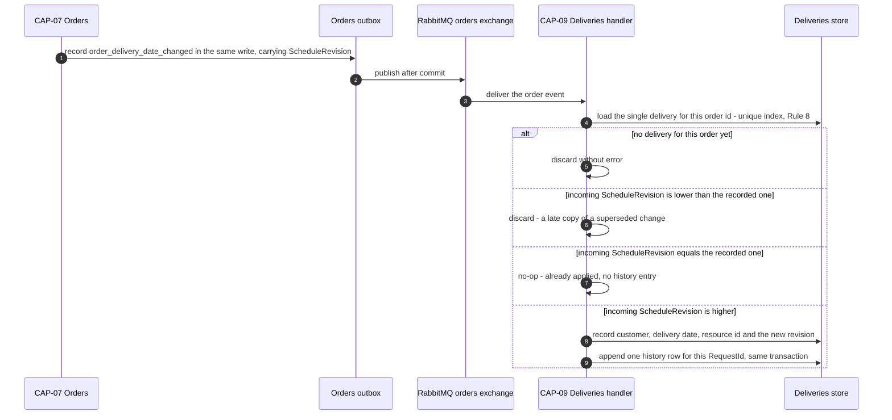

# ADR-026: Deliveries holds an event-carried replica of the order's customer and delivery date, and consumes its first inbound subscription

| | |
| --- | --- |
| **Status** | Proposed |
| **Date** | 2026-10-03 |
| **ADR id** | `ADR-026` |
| **Backlog candidate** | None. `adr-candidates.md` runs to `ADR-CANDIDATE-020` and records no candidate for a deliveries-side replica; the catalog records only that `deliveries-service` subscribes to nothing |
| **Category / Impact** | Integration & Data / high |
| **Supersedes / Superseded by** | — (extends the precedent set by `ADR-009`; supersedes nothing) |
| **Deciders** | Unassigned — no `CODEOWNERS`, contributing guide or team metadata exists in any of the fourteen clones (`ADR-021` B1, `risk-constraint-gap-register.md` `G-01`) |
| **Base ref of all cited source** | `feature/14830/aidlc` |
| **Source** | `DO1` — *Eligible Delivery Schedule & Alternative-Day View*, `DO2` — *Customer Delivery Reschedule Confirmation & Slot Safe-Move*, and `DO3` — *Delivery Instructions & Rescheduling History*, work item **14830**, `intents/14830.md`. `ASM-10`: the order's delivery date remains the authoritative schedule. `ASM-11`: eligibility depends on order status, delivery status and the date being in the future |
| **Non-functional requirements** | `NFR-1` (the customer sees only their own deliveries), `NFR-11` (bounded instruction text, excluded from logs), `NFR-13` (the eligible-delivery read answers from one service's own store), `NFR-15` (message and field naming follows the platform convention) |
| **Infrastructure recommendation applied** | `INF-1` — CAP-09 inbound message consumption, governed by `ADR-013`, delegated to **HLS** |
| **Resolved decision applied** | `AD-3` option **A**, chosen by human, confidence high. Binding and settled — not re-opened here: *"Event-carried replica of the order's customer and delivery date onto CAP-09 following the ADR-009 precedent; CAP-07 explicitly remains the authoritative system of record for the delivery date, consistent with ASM-10."* |
| **Related** | `ADR-009` (the replica precedent, and its never-reconciled gap), `ADR-013` (subscription and handler wiring), `ADR-025` (the resource id this replica carries), `ADR-027` (the revalidation that runs on the replica's read path), `ADR-029` (the ownership guard this replica makes possible), `ADR-030` (the message contracts) |

## Notation

| Symbol | Meaning |
| --- | --- |
| ✅ | Confirmed current behaviour — observed in source at the cited path and line range |
| 🎯 | Target state — intended design, not in production today |
| ❓ | Needs validation — assumed or inferred, not observed in source |
| `[INFERRED]` | Conclusion drawn from observed evidence rather than stated by it |

## Contents

1. [Context](#1-context)
2. [Decision Drivers](#2-decision-drivers)
3. [Architecture Fit Evaluation](#3-architecture-fit-evaluation)
4. [Options Considered](#4-options-considered)
5. [Decision](#5-decision)
6. [Consequences](#6-consequences)
7. [Compliance Considerations](#7-compliance-considerations)
8. [Non-Functional Requirements & Testing](#8-non-functional-requirements--testing)
9. [Relationship to the implementation pattern catalog](#9-relationship-to-the-implementation-pattern-catalog)
10. [Evidence](#10-evidence)
11. [Follow-Up Actions](#11-follow-up-actions)
12. [Assumptions, Blockers & Open Questions](#assumptions-blockers--open-questions)

---

## 1. Context

`DO1` asks for a customer-facing list of that customer's eligible deliveries. CAP-09 cannot answer
one word of that question today.

The `Delivery` aggregate is `{Id, OrderId, Status, Notes, ISet<DeliveryRegistration>}` ✅
(`Deliveries/.../Core/Entities/Delivery.cs`). There is **no customer** on it and **no delivery date**
on it — the component model states both plainly ✅ (`deliveries-service.md` §3.1). So:

- "show me *my* deliveries" has no field to filter on;
- "is this delivery in the future" has no field to compare;
- `GET /deliveries/{deliveryId}` reads the document and returns it to whoever asked, with **no
  authorization check at all** ✅ (`deliveries-service.md` §3.21) — a known gap, not a new one.

CAP-09 also has no inbound integration at all. The catalog records it as a known gap in two
directions at once: *deliveries-service subscribes to nothing and no service publishes a
deliveries-related event it could subscribe to*. Its `OrderId` is accepted unvalidated ✅, so a
delivery can be created against an order identifier that does not exist ✅ — both recorded gaps.

The platform has already decided how to solve the shape of this problem once. `ADR-009` records the
event-carried reference replica: a service that needs another service's fact subscribes to the event
carrying it and keeps a local copy, rather than calling across at read time. `ADR-009` also records
what the platform has *not* solved — the replica is never reconciled. A missed message leaves the
copy permanently wrong, with no detection and no repair path. Adopting the precedent means adopting
that gap, and this record says so rather than discovering it later.

## 2. Decision Drivers

| # | Driver | Where it comes from |
|---|--------|---------------------|
| D1 | The eligible-delivery list must be answerable without a fan-out of synchronous calls | `NFR-13`, `ADR-010` C10 |
| D2 | A customer must never see another customer's delivery, and CAP-09 has no identity to check against | `NFR-1`, `deliveries-service.md` §3.21 |
| D3 | Eligibility needs a date, and the aggregate has none | `ASM-11`, `ASM-19` |
| D4 | The order's delivery date stays authoritative; the delivery-side copy is a copy | `ASM-10` |
| D5 | The platform already has a recorded answer for this shape of problem | `ADR-009` |
| D6 | `DO3` adds instructions and an append-only history, which need the same aggregate open | `ASM-13`, `NFR-11` |

## 3. Architecture Fit Evaluation

Two binding fit verdicts govern this record, both `can_extend_existing_component: true`, both owned
by **CAP-09 Delivery Execution & Tracking**, both confidence high, and all three `new_*_required`
flags false on each.

| Verdict | Dimension | Evolution type | What it fixes here |
|---------|-----------|----------------|--------------------|
| 5 | Delivery-side schedule and ownership replica plus inbound consumption | `service_extension` | Gives CAP-09 the customer and date it does not have |
| 7 | Delivery instructions and append-only rescheduling history | `module_extension` | `DO3` lands on the same aggregate, in the same increment |

The fit argument is that CAP-09 is the single owner of the delivery record and the only service that
can answer a delivery-scoped read. Adding a subscription is a first for this service but not for the
platform — `ADR-013` already records exactly how a Convey subscription and handler are wired, and
eight other services already do it. The extension is therefore *new for the component, routine for
the architecture*.

No new deployable service, no new bounded context and no new runtime component is required, and none
is proposed.

## 4. Options Considered

### Option A — event-carried replica on CAP-09, fed by a new inbound subscription *(chosen; `AD-3` option A, chosen by human)*

CAP-09 subscribes to the order events that carry the customer and the delivery date and keeps both on
its own delivery record.

- **For.** Follows a recorded platform precedent rather than inventing one. The read path stays
  inside one service and one store, which is what `NFR-13` asks for. It gives CAP-09 the customer id
  that `NFR-1` and `ADR-029`'s guard both need, and does so without CAP-09 calling CAP-03.
- **Against.** It inherits `ADR-009`'s unreconciled-replica gap, and it is CAP-09's first inbound
  message path — new wiring, new failure modes, and `ADR-013`'s eight-point registration cost.

### Option B — CAP-09 calls CAP-07 synchronously at read time

**Rejected.** The eligible-delivery list is a list. Answering it this way means one call per delivery
or a new bulk query on CAP-07, and it makes a customer-facing read fail whenever CAP-07 is down. It
is the same coupling `ADR-009` was written to avoid, and it contradicts `NFR-13`.

### Option C — CAP-07 owns the customer-facing eligible-delivery read

**Rejected.** CAP-07 does not hold delivery status, and `ASM-11` makes delivery status part of
eligibility. CAP-07 would have to replicate *from* CAP-09, which is the same decision pointed the
other way, onto the platform's most-coupled aggregate.

### Option D — CAP-17 composes the list in the browser from two reads

**Rejected.** It moves an authorization decision into a client, which is precisely what `NFR-1`
forbids, and it would expose deliveries that the customer is not entitled to see in order to filter
them client-side.

### Option E — a new read-model service for customer-facing delivery views

**Rejected.** The fit verdicts record `new_service_required: false`. A new deployable adds a
Dockerfile, a PM2 entry, a Consul registration, a Fabio route and a pipeline to a platform where
`ADR-018` already records that pipelines do not reliably run tests. The cost is real and the benefit
is a boundary nobody asked for.

## 5. Decision

**CAP-09 keeps a local, event-carried replica of the owning customer, the order's delivery date and
the reserved resource id on its delivery record, fed by its first inbound subscription. CAP-07
remains the system of record for the delivery date.** Ten rules follow.

**Rule 1 — the replica is additive and nullable.** The delivery record gains the owning customer id,
the replicated delivery date, the reserved resource id, the last applied `ScheduleRevision`, and the
delivery instructions. Every one is nullable or empty-by-default, because no migration tooling exists
✅ and every delivery already written has none of them.

Two things the delivery record deliberately does **not** gain:

- **No schedule-lost indicator.** Whether the reservation is still held is read-time state produced by
  `ADR-027` Rule 1 against CAP-04, and `ADR-027` Rule 5 is its single home. A persisted copy would be
  a second answer to the same question with no mechanism keeping it true — the replica has no
  reconciliation (§6.2) — so the stored value would go stale silently and the customer would be told
  a day is lost that is held, or held that is lost. The first revision of this record listed the
  indicator here, and that was a duplicate home.
- **No embedded history array.** Rule 7 moves the rescheduling history to its own collection.

**Rule 2 — the replica is a copy, and is labelled as one.** `ASM-10` is binding: the order's delivery
date is the authoritative schedule. The delivery-side date exists to answer a read; it never
overrides CAP-07, and no write path on CAP-09 may change it except by consuming an order event.

**Rule 3 — the subscription is wired per `ADR-013`, in full.** Subscription registration, handler,
DI registration, and the rest of the eight registration points `ADR-013` enumerates, of which only
one is automatic ✅. A partially wired subscription does not fail the build — it simply never
receives anything, silently.

**Rule 4 — a delivery whose replica has not arrived is not eligible, and that state is counted, not
assumed rare.** If the customer id or the date is absent, the delivery is excluded from the
customer-facing list. It is never defaulted, never guessed from `OrderId`, and never shown "just in
case". `ASM-11`'s eligibility test is evaluated over recorded values only.

Exclusion is the right *answer* and the wrong *steady state*. A customer whose delivery predates this
change sees an empty list and has no way to tell it from having no deliveries. Rule 10 makes that a
rollout step with an exit condition rather than permanent accepted behaviour.

**Rule 5 — ordering is decided by `ScheduleRevision`, never by the delivery date.** The same order
event may be delivered more than once; the platform's outbox runs with `disableTransactions: true` in
at least one service ✅, and re-delivery is a normal RabbitMQ outcome. So:

1. Every `order_delivery_date_changed` carries `ScheduleRevision` — the `Order` aggregate's version
   after the write that produced it (`ADR-030` §5.2 `M4`, `ADR-028` Rule 4). It increases by one on
   every schedule change and never repeats.
2. CAP-09 persists the last applied `ScheduleRevision` on the delivery record (Rule 1).
3. An event whose revision is **lower** than the recorded one is discarded — it is a late copy of an
   already-superseded change.
4. An event whose revision is **equal** to the recorded one is applied idempotently: the result is
   byte-identical to not applying it, and no history entry is appended.
5. An event whose revision is **higher** is applied, and the recorded revision advances to it.

**The delivery date is not an ordering key and must not be used as one.** The first revision of this
record discarded any event carrying a date older than the one recorded. That rule silently drops
every legitimate move backwards in the calendar — a customer rescheduling from the 20th to the 15th
is the ordinary case this feature exists to serve, and under the old rule the replica would keep
showing the 20th forever while CAP-07 held the 15th, with nothing logged and nothing to detect it.
Calendar order and event order are unrelated. `N6` and `N12` exist to keep that rule from coming
back.

**Rule 6 — instruction text is bounded at the edge and excluded from logs.** `NFR-11` is explicit.
The bound is enforced on the write path before persistence, and the instruction field is added to the
property-redaction set rather than relying on nobody ever logging the request body.

**Rule 7 — the rescheduling history is append-only, retained in full, and stored in its own
collection.** `ASM-13` makes it an audit record: entries are added, never edited, never deleted, and
nothing prunes them. It is written to a separate CAP-09 collection keyed by `DeliveryId`, **in the
same transaction as the delivery change that produced it** — `ADR-028` Rule 5 makes a multi-document
transaction available, and it is the same instrument that keeps the domain write and the outbox row
atomic. An entry carries `DeliveryId`, `OrderId`, `RequestId`, `RequestedAt`, `PreviousDate`,
`NewDate`, `Outcome` and the `ScheduleRevision` it was applied at.

Embedding the history in the delivery document was the first revision's choice and it is withdrawn.
`ASM-13` forbids pruning and Mongo caps a document at 16 MB, so an embedded append-only array has a
hard failure at an unknown row count: the delivery eventually stops saving, which takes the *delivery*
down, not the history. A separate collection has no such ceiling, keeps the hot document small on
every read of the customer-facing list, and costs one extra write in a transaction that already
exists. `R-28`'s accepted unbounded growth is accepted in a place where growth is survivable.

`RequestId` is unique per entry: one customer attempt produces exactly one history row however many
times its message is redelivered (Rule 5 clause 4).

**Rule 8 — one active delivery per order, enforced by a unique index.** `OrderId` is unindexed and
not unique on `DeliveryDocument` today ✅, a `StartDelivery` on a failed delivery inserts a *second*
document for the same order ✅, and `GetForOrderAsync` then returns a non-deterministic one of them ✅.
Today that is an internal oddity; once deliveries are listed to customers it is a duplicate row in a
customer-facing list, and once a reschedule writes to "the" delivery it is a write that may land on
either document.

The invariant is decided here rather than deferred: **an order has at most one delivery document.**
Three things follow and all three are required, because any one alone leaves the defect reachable.

1. A **unique index** on `OrderId` in the deliveries collection, which also removes the collection
   scan every `StartDelivery` performs today ✅.
2. `StartDelivery` against an order that already has a delivery **updates that aggregate** instead of
   inserting a second one. A failed delivery is restarted by a state transition on the existing
   document — guarded, and emitting the ordinary state-changed event — which is the shape the
   platform's own design catalogue already records for this defect.
3. Existing duplicate documents are reconciled before the index is created, since the index cannot be
   built over them. That is part of Rule 10's rollout, not a later cleanup.

The customer-facing list, the event handler in Rule 3 and the reschedule write path all resolve "the
delivery for this order" through the same single-result lookup. There is no selection rule to choose
between duplicates, because after this rule there are no duplicates.

**Rule 9 — one reschedule attempt has one outcome, keyed by `RequestId`.** `NFR-7` is satisfied by an
explicit idempotency key carried end to end (`ADR-030` §5.2), not by the inbox decorator. The decorator
de-duplicates *message* redelivery and `R-15` records that it does not cover the HTTP command path at
all, so it cannot be the mechanism for a customer pressing confirm twice. CAP-09 records the outcome
of each `RequestId` with the delivery write; a repeat of a `RequestId` already decided returns the
recorded outcome and performs no second move. CAP-04 does the same for its half (`ADR-028` Rule 8).

**Rule 10 — the replica is populated before the feature is enabled, and readiness is measured.**
Rules 4 and 8 both have a population precondition, and neither is satisfied by deploying and waiting.
Before the customer-facing list and the reschedule path are enabled in an environment:

1. **Backfill or replay** the replica for every active order and delivery whose mapping can be
   established — CAP-07 republishes the current schedule per active order, or a one-off job writes the
   values directly. `ADR-025` `FA1` carries the CAP-07 half and `ADR-024` `FA5` the CAP-04 half.
2. **Reconcile duplicate delivery documents** so Rule 8's unique index can be created.
3. **Publish a readiness metric**: the count of active deliveries still missing a replicated customer
   id, date or resource id, and the count of orders holding more than one delivery document. Both
   must be at their agreed threshold before the feature is switched on, and both stay published
   afterwards — a number that starts rising again is the staleness signal `FA1` asks for, arriving
   from the same instrument.

Orders whose mapping genuinely cannot be established are excluded by Rule 4 and are **counted** by
the readiness metric. Fail-closed exclusion is the correct behaviour for an unmappable record; it is
not the plan for the general population.

### 5.1 The inbound path

### 5.2 What "confirmed" means, and when

The flow is eventually consistent across three services, so "the reschedule succeeded" has to name a
moment. It names this one.

| State | True when | Who sees it | Can it still be lost |
|-------|-----------|-------------|----------------------|
| `accepted` | CAP-09 has proved ownership and eligibility and has dispatched the move | Only CAP-09, internally. **Never reported to the customer as success** | Yes — CAP-04 can still refuse |
| `confirmed` | CAP-04 has committed the day move and its outbox row is in the same transaction (`ADR-028` Rule 5) | **The customer.** This is the completion point | No. The day is held and the event cannot be lost |
| `settled` | CAP-07 holds the new authoritative date and CAP-09's replica has applied the matching `ScheduleRevision` | The delivery read, and operations | No — already durable at `confirmed`; this is convergence, not commitment |

**The completion point is `confirmed`, for every surface.** In the gateway's synchronous mode the
reschedule response returns at that moment, carrying the new day and the `ScheduleRevision` the move
will settle at. In the asynchronous mode `ASM-18` prescribes, the `202 Accepted` plus operation-status
pattern already drawn in `architecture-views.md` §3.2 reports the operation complete at the same
moment, which is why `ADR-030` Rule 9 putting the new messages in `messages.json` is load-bearing
rather than tidy — `operations-service` cannot report an operation it does not bind.

Three consequences, and they are binding on `DO2`, on the UI and on the acceptance tests alike:

- **The UI shows the new day as soon as `confirmed` arrives.** It does not wait for `settled` and it
  does not show a spinner until convergence. The day is held; showing otherwise understates a fact.
- **A delivery read taken between `confirmed` and `settled` may return the old date.** That is the
  one visible artefact of the lag. `ADR-027`'s revalidation detects it — the recorded resource and day
  no longer match the reservation CAP-04 holds — and the read reports it as a pending change rather
  than as a confirmed old date or as a lost schedule. Comparing the replica's `ScheduleRevision` with
  the one returned at `confirmed` is how a client that has both can tell precisely.
- **Acceptance tests assert on `confirmed`.** A test that waits for `settled` before asserting
  success is testing convergence latency, not the feature, and will be flaky for reasons that have
  nothing to do with the reschedule.

## 6. Consequences

### 6.1 Positive

- `DO1`'s list becomes answerable from one service's own store, which is what `NFR-13` asks for and
  what `ADR-010` C10 requires.
- CAP-09 gains the customer id it needs to stop returning any delivery to any caller — the
  precondition for `ADR-029`'s fail-closed guard and for `NFR-1`.
- `DO3`'s instructions and history land on the same aggregate in the same increment, so the delivery
  record is opened once rather than twice.
- The platform's first CAP-09 subscription establishes the inbound path that the recorded gap
  *deliveries-service subscribes to nothing* has described as missing.

### 6.2 Negative

- **The replica is never reconciled.** This is `ADR-009`'s recorded gap, inherited whole. A missed or
  dropped message leaves a delivery permanently showing the wrong date, or permanently invisible to
  its own customer, with no detection, no alert and no repair path. There is no reconciliation job on
  this platform and this record does not create one. Recorded as `R-26`, and `FA1` asks for the
  minimum viable detector rather than the full repair.
- **Deliveries created before this ships have no replica, and Rule 10's backfill is now on the
  critical path.** Rule 4 makes exclusion a correct answer for a record that cannot be mapped; it is
  not a release plan for the whole existing population. Backfilling is extra work in `DO1` that the
  first revision of this record did not carry, and a backfill over CAP-07's data has to be written
  by hand because no migration tooling exists ✅. `R-29` and `ADR-025` `FA1` carry it.
- **The rescheduling history still grows without bound, in a place where that is survivable.**
  `ASM-13` requires full retention and Rule 7 does not cap it. Moving it to its own collection removes
  the 16 MB document ceiling and the risk of an audit row taking the delivery down with it; it does
  not make the growth finite. `R-28` stays open as accepted, with the exposure reduced from *delivery
  write failure* to *collection size*.
- **Rule 7 makes the delivery write a multi-document transaction.** The delivery, the outbox row and
  the history row now commit together, which raises `ADR-028` `FA3` — whether every environment's
  MongoDB is actually a replica set or `mongos` — from a follow-up to a precondition. A standalone
  `mongod` cannot start a transaction, and the failure arrives at runtime on the write path.
- **Eight registration points, one of them automatic.** `ADR-013` records the cost; a missed point
  produces a subscription that silently receives nothing, and the build stays green.
- **Rule 8 is a data change before it is a code change.** The unique index cannot be created while
  duplicate `OrderId` documents exist, so existing duplicates must be reconciled first, by hand, with
  a human deciding which document survives where both carry registrations. That work is unscoped until
  the duplicates are counted — which is what Rule 10's readiness metric exists to do. `R-27` carries
  it, now as a decided invariant with a migration rather than an open list-behaviour question.
- **Rule 8 changes existing `StartDelivery` behaviour.** A `StartDelivery` against an order that
  already has a delivery updates it instead of inserting; any caller relying on the second insert gets
  a different outcome. Nothing in the workspace relies on it and the current behaviour is recorded as
  a defect, but it is a behaviour change on a live path and is recorded here rather than discovered.

### 6.3 Neutral and follow-on

- CAP-09 becomes a subscriber as well as a publisher, which changes its operational profile: it now
  has a queue that can back up, and `ADR-021`'s recorded absence of consumer-lag monitoring now
  applies to it too.
- The `OrderId`-is-unvalidated gap is not closed by this record. It becomes less dangerous, because a
  delivery against a non-existent order never receives a replica and is therefore never listed, but
  the underlying gap stays open as `G-07`. (`G-07` is this gap and only this gap. The undefined
  standard reschedule priority is `G-12` — `ADR-024` §6.3 records the correction.)
- Schedule-lost has exactly one home: `ADR-027` Rule 5, computed at read time. Nothing in CAP-09
  persists it, so there is no cached copy that can disagree with a fresh revalidation. Should a cache
  ever be introduced for latency, a fresh revalidation result always wins over a cached one and a
  cached one is never presented as confirmed — `ADR-027` `FA3` is where that decision belongs.
- The backfill in Rule 10 and the duplicate reconciliation in Rule 8 are one rollout, run once per
  environment in that order: reconcile duplicates, create the index, backfill the replica, read the
  readiness metric, enable the feature. Running them in a different order fails at step two.

## 7. Compliance Considerations

| Obligation | Source | How this record complies |
|------------|--------|--------------------------|
| A service publishes only to its own exchange and subscribes to others' | `ADR-001` C1 | CAP-09 subscribes to the orders exchange. It publishes nothing new here |
| Message compatibility rests on naming convention with no build-time check | `ADR-003`, C2 | Rule 3 wires the subscription explicitly, and `ADR-030` fixes the names. `N7` asserts the name end to end |
| Subscriptions and handlers are wired at every registration point | `ADR-013` | Rule 3 |
| A replica is a copy; the publisher stays the system of record | `ADR-009`, `ASM-10` | Rule 2 |
| Fields are added, never renamed or removed | `ADR-008`, `NFR-17` | Rule 1 |
| Sensitive or free-text payload is excluded from logs | `ADR-021`, `NFR-11` | Rule 6 |
| The customer-facing read is authorized server-side | `ADR-006`, `NFR-1` | This record supplies the customer id; `ADR-029` applies the guard |
| Routing key and queue naming must not diverge | `GAP-6`, `NFR-15` | `ADR-030` Rule 4, verified by `N7` |

## 8. Non-Functional Requirements & Testing

| # | Requirement | NFR | How it is verified |
|---|-------------|-----|--------------------|
| `N1` | A customer's eligible-delivery list contains only deliveries whose replicated customer id matches the caller | `NFR-1` | Two customers, two deliveries. Assert each list contains exactly one |
| `N2` | A delivery with no replicated customer id is excluded from every customer's list | `NFR-1`, Rule 4 | Insert a pre-replica delivery. Assert it appears for nobody |
| `N3` | A delivery with no replicated date is excluded, and is not defaulted to today | `ASM-11`, Rule 4 | Insert a delivery with a null date. Assert exclusion and assert no date was written |
| `N4` | The eligible-delivery read issues no cross-service call | `NFR-13` | Run the read with every outbound client stubbed to throw. Assert success |
| `N5` | Applying the same event twice — same `ScheduleRevision` — leaves the replica byte-identical and appends no second history row | Rule 5.4 | Deliver the event twice. Assert a single unchanged record and exactly one history row |
| `N6` | An event carrying a **lower** `ScheduleRevision` is discarded, and an event carrying a **higher** one is applied **even when its delivery date is earlier in the calendar** | Rule 5.3, 5.5 | Two cases. (a) Apply revision 7, then deliver revision 5. Assert revision 7's values survive. (b) Apply revision 7 for the 20th, then deliver revision 8 for the 15th. Assert the 15th is recorded. Case (b) fails under any date-based staleness rule, which is the point of the test |
| `N7` | For `order_delivery_date_changed`, the routing key CAP-07 publishes and the key CAP-09 binds are the same string, **and** every required `ADR-030` §5.2 `M4` payload field arrives with its value intact | `NFR-15`, `GAP-6`, `GAP-17`, `ADR-030` Rule 8 | One cross-boundary test asserting the key and the deserialised payload together. Remove `ScheduleRevision` from the publisher and assert the test fails |
| `N8` | Instruction text above the bound is rejected at the edge with a named reason | `NFR-11` | Submit over-length text. Assert rejection and assert nothing was persisted |
| `N9` | Instruction text never appears in a log line | `NFR-11` | Capture the log sink across a write. Assert the text is absent |
| `N10` | A rescheduling history entry is never modified or removed by a later reschedule, and lives in its own collection | `ASM-13`, Rule 7 | Reschedule three times. Assert three rows in the history collection in order, all original values intact, and assert the delivery document carries no history array |
| `N11` | An order cannot acquire a second delivery document, and `StartDelivery` on a failed delivery updates the existing aggregate | Rule 8, `R-27` | Attempt a second insert for one `OrderId`. Assert the unique index refuses it. Then `StartDelivery` a failed delivery and assert one document, transitioned, with its state-changed event emitted |
| `N12` | A reschedule from the 20th to the 15th settles at the 15th everywhere | Rule 5.5, `DO2` target | End to end: confirm the move, let both events flow, assert CAP-07's authoritative date, CAP-09's replica and the customer-facing list all read the 15th. **This is the end-to-end form of `N6`(b)** |
| `N13` | The history row and the delivery change commit together or not at all | Rule 7, `ADR-028` Rule 5 | Fail the history write. Assert the delivery change is not visible either |
| `N14` | A repeated `RequestId` produces one outcome, one move and one history row | Rule 9, `NFR-7` | Submit the same reschedule request twice. Assert the second returns the first outcome, and assert one reservation move and one history row |
| `N15` | The readiness metric counts active deliveries missing replica fields and orders holding more than one delivery document, and both are observable before the feature is enabled | Rule 10.3 | Seed known-bad records. Assert the published counts match. Assert the feature gate reads them |
| `N16` | No persisted schedule-lost field exists on the delivery record | Rule 1 | Assert the document shape. A stored indicator is a defect, not an optimisation |

## 9. Relationship to the implementation pattern catalog

Applies two existing patterns and extends one.

- `patterns/integration/event-carried-reference-replica.md` — applied as recorded. The entry should
  gain Rule 5's ordering rule, which it does not currently state, in the form it is stated here:
  ordering is a publisher-supplied monotonic revision, never a domain value that happens to look
  ordered. A replica keyed on a date is the generalisable version of the defect this revision fixed.
- `patterns/integration/transactional-outbox-and-inbox-by-handler-decorator.md` — applied on the
  consuming side, and **its limits are now recorded rather than relied on.** The decorator
  de-duplicates message redelivery; Rule 9's `RequestId` is what covers the HTTP command path the
  decorator does not reach (`R-15`). Whether the decorator is active for CAP-09's configuration is
  `FA3` and still worth knowing — it is a second layer, not the mechanism.
- `patterns/messaging/contract-blind-universal-message-subscription.md` — the pattern this record
  deliberately does not follow for the new path. The subscription is explicit and typed.

## 10. Evidence

| # | Claim | Source |
|---|-------|--------|
| E1 | `Delivery` has no customer and no delivery date | `Deliveries/.../Core/Entities/Delivery.cs`; `deliveries-service.md` §3.1 |
| E2 | `GET /deliveries/{deliveryId}` performs no authorization and returns the document to any caller | `deliveries-service.md` §3.21 |
| E3 | `deliveries-service` subscribes to no external event | Catalog KnownGap *deliveries-service subscribes to nothing and no service publishes a deliveries*; `deliveries-service.md` §3.34 |
| E4 | `OrderId` is accepted unvalidated, so a delivery can exist for a non-existent order | Catalog KnownGaps *Unvalidated OrderId in deliveries-service* and *Delivery can be created against an order identifier that does not exist* |
| E5 | `OrderId` is unindexed and not unique; a restarted delivery inserts a second document and `GetForOrderAsync` is non-deterministic | `deliveries-service.md` §3.6, §3.19 |
| E6 | The event-carried replica is an established platform decision, and is never reconciled | `ADR-009`; `architecture-baseline.md` §11.1 |
| E7 | Adding a handler requires eight registration points, only one of which is automatic | `ADR-013`; `deliveries-service.md` §3.30 |
| E8 | At least one service runs its outbox with `disableTransactions: true` | `Availability/.../Api/appsettings.json:129`; `availability-service.md` §3.14 |
| E9 | Routing-key and queue naming diverge in at least one existing binding | Catalog `GAP-6`; `ADR-003` |
| E10 | No migration framework exists in any repository | `ADR-008`; `architecture-baseline.md` C8 |
| E11 | Restarting a failed delivery by transitioning the existing aggregate — rather than inserting a second document — is the recorded remedy for `E5`, emitting the ordinary state-changed event under its own guard | Platform design catalogue, *Restart for Delivery*; `deliveries-service.md` §3.19 |
| E12 | `Version` is not persisted on `DeliveryDocument`, so the replica has no ordering field today | `deliveries-service.md` §3.6; `ADR-028` §1 |
| E13 | The inbox decorator does not cover the HTTP command path | `R-15`; `patterns/integration/transactional-outbox-and-inbox-by-handler-decorator.md` |

### 10.1 Documentation-versus-code conflicts

None found for this record. `ADR-009` describes the replica pattern accurately, including its gap.

One conflict **internal to this patch** was found and resolved on this revision: the first version of
Rule 1 placed a schedule-lost indicator on the delivery record while `ADR-027` Rule 5 made
schedule-lost read-time state that is reported and never mutated. Two homes, no rule saying which
wins. Rule 1 now records no indicator and `ADR-027` Rule 5 is the single home.

## 11. Follow-Up Actions

**Reading the `By` column.** Each entry carries a calendar date followed by the delivery milestone
that date is derived from. The dates come from the one work-item 14830 wave calendar in
[`../specs/14830/solution-design.md`](../specs/14830/solution-design.md) §5.1, so every record in
`ADR-024`…`ADR-030` resolves the same milestone to the same date. If the wave calendar moves, that
section is the single place to change and these dates move with it; the milestone is what binds.

| # | Action | Owner | By |
|---|--------|-------|-----|
| `FA1` | **[ACTION NOW]** Decide the minimum acceptable detection for a stale replica before this ships. Full reconciliation is out of scope; a count-comparison check or an age alarm on the replicated date is not. Without one, a dropped message is permanently invisible (`R-26`) | Platform architect with the platform owner | **2026-12-05** — before `DO1` ships |
| `FA2` | **[ACTION NOW]** Count the orders that currently hold more than one delivery document, and decide per duplicate which document survives, so Rule 8's unique index can be created. The invariant is **decided** — one active delivery per order — so this is a data-reconciliation task with a known target, not an open design question (`R-27`) | `DO1` implementer with the product owner | **2026-11-21** — before `DO1` reaches a shared environment, since the index must exist before the list is enabled |
| `FA3` | **[handled later by HLS]** Confirm, from CAP-09's configuration, whether the inbox decorator's de-duplication is actually active, and record the answer. Rule 5's idempotence is a handler obligation either way; this decides whether the decorator helps or is decorative | `DO1` implementer | **2026-10-24** — during `DO1` high-level design |
| `FA4` | **[handled later by HLS]** Fix the instruction length bound as a number, and add the instruction field to the redaction set. `NFR-11` requires both; neither value exists yet | `DO3` implementer with the product owner | **2026-10-24** — during `DO3` high-level design |
| `FA5` | **[ACTION NOW]** Add consumer-lag and queue-depth signal for CAP-09's new queue, and outbox depth-and-age signal for CAP-04 and CAP-07 (`R-23`, `INF-4`). `ADR-021` records the platform has none today. Without them the gap between `confirmed` and `settled` (§5.2) is unmeasurable, so nobody can tell a two-second convergence from a stuck queue — and `Rule 10`'s readiness metric has no delivery mechanism either. **Precondition for the shared environment**, not a task timed against it | Platform owner with DevOps | **2026-11-21** — before `DO1` reaches a shared environment |
| `FA6` | **[ACTION NOW]** Build and publish Rule 10's readiness metric — active deliveries missing a replica field, and orders holding more than one delivery document — and agree the threshold each must reach before the feature is enabled per environment. The same instrument doubles as `FA1`'s staleness detector once the feature is live, so it is one piece of work serving two blockers | `DO1` implementer with the platform architect | **2026-11-21** — before `DO1` reaches a shared environment |
| `FA7` | **[handled later by HLS]** Specify the backfill or replay that populates the replica for active orders and deliveries, including the cut-off that decides which records are in scope and how an unmappable record is counted. `ADR-025` `FA1` is the CAP-07 half of the same decision and the two must agree | `DO1` implementer with the platform owner | **2026-11-07** — during `DO1` low-level design |
| `FA8` | **[handled later by HLS]** Size the history collection's growth per `ASM-13`'s full-retention requirement and record the collection-size threshold that triggers a retention conversation. Rule 7 removed the document ceiling, not the growth (`R-28`) | `DO3` implementer | **2026-11-07** — during `DO3` low-level design |

## Assumptions, Blockers & Open Questions

### Assumptions

- **A1 — resolved on this revision.** The event this record consumes is `order_delivery_date_changed`,
  fixed by `ADR-030` §5.2 `M4`: one event carrying `OrderId`, `CustomerId`, the authoritative
  `DeliveryDate`, `ReservedResourceId` and `ScheduleRevision`, published from CAP-07's handler to the
  outbox in the same transaction as the `Order` write. It is no longer an assumption about a contract
  shape; it is a contract, asserted by `N7`.
- **A2 `[INFERRED]`** A delivery exists for an order by the time the customer can see it in the
  eligible list, because `StartDelivery` is what creates the delivery record ✅. A reschedule for an
  order with no delivery record yet is therefore not in `DO1`'s scope.

### Blockers

- **B1 — `FA1` and `FA6` are release blockers, not record blockers.** The decision stands; shipping a
  customer-facing list fed by a replica with no staleness signal is a product risk that needs a named
  owner's acceptance. `FA6`'s readiness metric is the instrument that answers both.
- **B2 — Rule 7's multi-document transaction requires `ADR-028` `FA3` to have been confirmed for the
  environment.** A standalone `mongod` cannot start a transaction, and the delivery write plus history
  row plus outbox row now commit together. The failure is at runtime, on the write path, in whichever
  environment was not checked. Owner: DevOps with the `DO1` implementer, **2026-11-21** — before `DO1`
  reaches a shared environment. `ADR-028` `FA3` is the action.
- **B3 — Rule 8's unique index cannot be created until `FA2`'s duplicates are reconciled.** Index
  creation fails on existing duplicate keys, so the ordering in §6.3 is not advisory. Owner: `DO1`
  implementer, **2026-11-21** — before `DO1` reaches a shared environment.

### Open Questions

- **Q1 — closed on this revision.** The rescheduling history moves out of the delivery document now,
  not after a retention horizon is agreed (Rule 7). `ASM-13` forbids pruning, so the document ceiling
  was a hard failure with an unknown trigger point; the storage decision did not depend on the
  retention decision and did not need to wait for it. `R-28`'s accepted growth now applies to a
  collection. `FA8` sizes it.
- **Q2** Should a delivery read taken between `confirmed` and `settled` (§5.2) show the pending new
  day alongside the old one, or only a pending-change marker? The data is available — `ADR-027`'s
  revalidation knows the reservation's day — and it is a UI decision with a privacy dimension, since
  the pending day is the customer's own. Product owner with the `DO2` implementer, during `DO2`
  high-level design.
