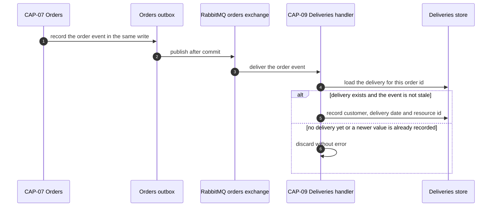

# ADR-026: Deliveries holds an event-carried replica of the order's customer and delivery date, and consumes its first inbound subscription

| | |
| --- | --- |
| **Status** | Proposed |
| **Date** | 2026-10-03 |
| **ADR id** | `ADR-026` |
| **Backlog candidate** | None. `adr-candidates.md` runs to `ADR-CANDIDATE-020` and records no candidate for a deliveries-side replica; the catalog records only that `deliveries-service` subscribes to nothing |
| **Category / Impact** | Integration & Data / high |
| **Supersedes / Superseded by** | — (extends the precedent set by `ADR-009`; supersedes nothing) |
| **Deciders** | Unassigned — no `CODEOWNERS`, contributing guide or team metadata exists in any of the fourteen clones (`ADR-021` B1, `risk-constraint-gap-register.md` `G-01`) |
| **Base ref of all cited source** | `feature/14830/aidlc` |
| **Source** | `DO1` — *Eligible Delivery Schedule & Alternative-Day View*, `DO2` — *Customer Delivery Reschedule Confirmation & Slot Safe-Move*, and `DO3` — *Delivery Instructions & Rescheduling History*, work item **14830**, `intents/14830.md`. `ASM-10`: the order's delivery date remains the authoritative schedule. `ASM-11`: eligibility depends on order status, delivery status and the date being in the future |
| **Non-functional requirements** | `NFR-1` (the customer sees only their own deliveries), `NFR-11` (bounded instruction text, excluded from logs), `NFR-13` (the eligible-delivery read answers from one service's own store), `NFR-15` (message and field naming follows the platform convention) |
| **Infrastructure recommendation applied** | `INF-1` — CAP-09 inbound message consumption, governed by `ADR-013`, delegated to **HLS** |
| **Resolved decision applied** | `AD-3` option **A**, chosen by human, confidence high. Binding and settled — not re-opened here: *"Event-carried replica of the order's customer and delivery date onto CAP-09 following the ADR-009 precedent; CAP-07 explicitly remains the authoritative system of record for the delivery date, consistent with ASM-10."* |
| **Related** | `ADR-009` (the replica precedent, and its never-reconciled gap), `ADR-013` (subscription and handler wiring), `ADR-025` (the resource id this replica carries), `ADR-027` (the revalidation that runs on the replica's read path), `ADR-029` (the ownership guard this replica makes possible), `ADR-030` (the message contracts) |

## Notation

| Symbol | Meaning |
| --- | --- |
| ✅ | Confirmed current behaviour — observed in source at the cited path and line range |
| 🎯 | Target state — intended design, not in production today |
| ❓ | Needs validation — assumed or inferred, not observed in source |
| `[INFERRED]` | Conclusion drawn from observed evidence rather than stated by it |

## Contents

1. [Context](#1-context)
2. [Decision Drivers](#2-decision-drivers)
3. [Architecture Fit Evaluation](#3-architecture-fit-evaluation)
4. [Options Considered](#4-options-considered)
5. [Decision](#5-decision)
6. [Consequences](#6-consequences)
7. [Compliance Considerations](#7-compliance-considerations)
8. [Non-Functional Requirements & Testing](#8-non-functional-requirements--testing)
9. [Relationship to the implementation pattern catalog](#9-relationship-to-the-implementation-pattern-catalog)
10. [Evidence](#10-evidence)
11. [Follow-Up Actions](#11-follow-up-actions)
12. [Assumptions, Blockers & Open Questions](#assumptions-blockers--open-questions)

---

## 1. Context

`DO1` asks for a customer-facing list of that customer's eligible deliveries. CAP-09 cannot answer
one word of that question today.

The `Delivery` aggregate is `{Id, OrderId, Status, Notes, ISet<DeliveryRegistration>}` ✅
(`Deliveries/.../Core/Entities/Delivery.cs`). There is **no customer** on it and **no delivery date**
on it — the component model states both plainly ✅ (`deliveries-service.md` §3.1). So:

- "show me *my* deliveries" has no field to filter on;
- "is this delivery in the future" has no field to compare;
- `GET /deliveries/{deliveryId}` reads the document and returns it to whoever asked, with **no
  authorization check at all** ✅ (`deliveries-service.md` §3.21) — a known gap, not a new one.

CAP-09 also has no inbound integration at all. The catalog records it as a known gap in two
directions at once: *deliveries-service subscribes to nothing and no service publishes a
deliveries-related event it could subscribe to*. Its `OrderId` is accepted unvalidated ✅, so a
delivery can be created against an order identifier that does not exist ✅ — both recorded gaps.

The platform has already decided how to solve the shape of this problem once. `ADR-009` records the
event-carried reference replica: a service that needs another service's fact subscribes to the event
carrying it and keeps a local copy, rather than calling across at read time. `ADR-009` also records
what the platform has *not* solved — the replica is never reconciled. A missed message leaves the
copy permanently wrong, with no detection and no repair path. Adopting the precedent means adopting
that gap, and this record says so rather than discovering it later.

## 2. Decision Drivers

| # | Driver | Where it comes from |
|---|--------|---------------------|
| D1 | The eligible-delivery list must be answerable without a fan-out of synchronous calls | `NFR-13`, `ADR-010` C10 |
| D2 | A customer must never see another customer's delivery, and CAP-09 has no identity to check against | `NFR-1`, `deliveries-service.md` §3.21 |
| D3 | Eligibility needs a date, and the aggregate has none | `ASM-11`, `ASM-19` |
| D4 | The order's delivery date stays authoritative; the delivery-side copy is a copy | `ASM-10` |
| D5 | The platform already has a recorded answer for this shape of problem | `ADR-009` |
| D6 | `DO3` adds instructions and an append-only history, which need the same aggregate open | `ASM-13`, `NFR-11` |

## 3. Architecture Fit Evaluation

Two binding fit verdicts govern this record, both `can_extend_existing_component: true`, both owned
by **CAP-09 Delivery Execution & Tracking**, both confidence high, and all three `new_*_required`
flags false on each.

| Verdict | Dimension | Evolution type | What it fixes here |
|---------|-----------|----------------|--------------------|
| 5 | Delivery-side schedule and ownership replica plus inbound consumption | `service_extension` | Gives CAP-09 the customer and date it does not have |
| 7 | Delivery instructions and append-only rescheduling history | `module_extension` | `DO3` lands on the same aggregate, in the same increment |

The fit argument is that CAP-09 is the single owner of the delivery record and the only service that
can answer a delivery-scoped read. Adding a subscription is a first for this service but not for the
platform — `ADR-013` already records exactly how a Convey subscription and handler are wired, and
eight other services already do it. The extension is therefore *new for the component, routine for
the architecture*.

No new deployable service, no new bounded context and no new runtime component is required, and none
is proposed.

## 4. Options Considered

### Option A — event-carried replica on CAP-09, fed by a new inbound subscription *(chosen; `AD-3` option A, chosen by human)*

CAP-09 subscribes to the order events that carry the customer and the delivery date and keeps both on
its own delivery record.

- **For.** Follows a recorded platform precedent rather than inventing one. The read path stays
  inside one service and one store, which is what `NFR-13` asks for. It gives CAP-09 the customer id
  that `NFR-1` and `ADR-029`'s guard both need, and does so without CAP-09 calling CAP-03.
- **Against.** It inherits `ADR-009`'s unreconciled-replica gap, and it is CAP-09's first inbound
  message path — new wiring, new failure modes, and `ADR-013`'s eight-point registration cost.

### Option B — CAP-09 calls CAP-07 synchronously at read time

**Rejected.** The eligible-delivery list is a list. Answering it this way means one call per delivery
or a new bulk query on CAP-07, and it makes a customer-facing read fail whenever CAP-07 is down. It
is the same coupling `ADR-009` was written to avoid, and it contradicts `NFR-13`.

### Option C — CAP-07 owns the customer-facing eligible-delivery read

**Rejected.** CAP-07 does not hold delivery status, and `ASM-11` makes delivery status part of
eligibility. CAP-07 would have to replicate *from* CAP-09, which is the same decision pointed the
other way, onto the platform's most-coupled aggregate.

### Option D — CAP-17 composes the list in the browser from two reads

**Rejected.** It moves an authorization decision into a client, which is precisely what `NFR-1`
forbids, and it would expose deliveries that the customer is not entitled to see in order to filter
them client-side.

### Option E — a new read-model service for customer-facing delivery views

**Rejected.** The fit verdicts record `new_service_required: false`. A new deployable adds a
Dockerfile, a PM2 entry, a Consul registration, a Fabio route and a pipeline to a platform where
`ADR-018` already records that pipelines do not reliably run tests. The cost is real and the benefit
is a boundary nobody asked for.

## 5. Decision

**CAP-09 keeps a local, event-carried replica of the owning customer, the order's delivery date and
the reserved resource id on its delivery record, fed by its first inbound subscription. CAP-07
remains the system of record for the delivery date.** Seven rules follow.

**Rule 1 — the replica is additive and nullable.** The delivery record gains the owning customer id,
the replicated delivery date, the reserved resource id, the delivery instructions, a schedule-lost
indicator and an append-only rescheduling history. Every one is nullable or empty-by-default, because
no migration tooling exists ✅ and every delivery already written has none of them.

**Rule 2 — the replica is a copy, and is labelled as one.** `ASM-10` is binding: the order's delivery
date is the authoritative schedule. The delivery-side date exists to answer a read; it never
overrides CAP-07, and no write path on CAP-09 may change it except by consuming an order event.

**Rule 3 — the subscription is wired per `ADR-013`, in full.** Subscription registration, handler,
DI registration, and the rest of the eight registration points `ADR-013` enumerates, of which only
one is automatic ✅. A partially wired subscription does not fail the build — it simply never
receives anything, silently.

**Rule 4 — a delivery whose replica has not arrived is not eligible.** If the customer id or the date
is absent, the delivery is excluded from the customer-facing list. It is never defaulted, never
guessed from `OrderId`, and never shown "just in case". `ASM-11`'s eligibility test is evaluated over
recorded values only.

**Rule 5 — handlers are idempotent and ordering-tolerant.** The same order event may be delivered
more than once; the platform's outbox runs with `disableTransactions: true` in at least one service
✅, and re-delivery is a normal RabbitMQ outcome. Applying the same replica value twice must be
indistinguishable from applying it once. An event carrying a delivery date older than the one already
recorded is discarded rather than applied, so that out-of-order delivery cannot roll the schedule
backwards.

**Rule 6 — instruction text is bounded at the edge and excluded from logs.** `NFR-11` is explicit.
The bound is enforced on the write path before persistence, and the instruction field is added to the
property-redaction set rather than relying on nobody ever logging the request body.

**Rule 7 — the rescheduling history is append-only and retained in full.** `ASM-13` makes it an audit
record: entries are added, never edited, never deleted, and nothing prunes them. The consequence —
unbounded growth on a document-embedded collection — is recorded in §6.2 rather than mitigated by a
silent cap.

### 5.1 The inbound path

## 6. Consequences

### 6.1 Positive

- `DO1`'s list becomes answerable from one service's own store, which is what `NFR-13` asks for and
  what `ADR-010` C10 requires.
- CAP-09 gains the customer id it needs to stop returning any delivery to any caller — the
  precondition for `ADR-029`'s fail-closed guard and for `NFR-1`.
- `DO3`'s instructions and history land on the same aggregate in the same increment, so the delivery
  record is opened once rather than twice.
- The platform's first CAP-09 subscription establishes the inbound path that the recorded gap
  *deliveries-service subscribes to nothing* has described as missing.

### 6.2 Negative

- **The replica is never reconciled.** This is `ADR-009`'s recorded gap, inherited whole. A missed or
  dropped message leaves a delivery permanently showing the wrong date, or permanently invisible to
  its own customer, with no detection, no alert and no repair path. There is no reconciliation job on
  this platform and this record does not create one. Recorded as `R-26`, and `FA1` asks for the
  minimum viable detector rather than the full repair.
- **Deliveries created before this ships have no replica and are invisible to the new list.**
  Rule 4 makes that a correct answer rather than a wrong one, but it is a functional limitation of
  the first release and the same no-backfill problem `ADR-025` §6.2 records.
- **The rescheduling history grows without bound.** `ASM-13` requires full retention, the history is
  embedded in the delivery document, and Mongo documents have a hard ceiling. A delivery rescheduled
  pathologically often will eventually fail to save. Recorded as `R-28`.
- **Eight registration points, one of them automatic.** `ADR-013` records the cost; a missed point
  produces a subscription that silently receives nothing, and the build stays green.
- **Duplicate delivery documents for one order are now visible.** A failed-then-restarted delivery
  inserts a second document with the same `OrderId` — `OrderId` is unindexed and not unique ✅, so
  `GetForOrderAsync` returns a non-deterministic one of them. Today that is an internal oddity. Once
  deliveries are listed to customers, it becomes a duplicate row in a customer-facing list. Recorded
  as `R-27`.

### 6.3 Neutral and follow-on

- CAP-09 becomes a subscriber as well as a publisher, which changes its operational profile: it now
  has a queue that can back up, and `ADR-021`'s recorded absence of consumer-lag monitoring now
  applies to it too.
- The `OrderId`-is-unvalidated gap is not closed by this record. It becomes less dangerous, because a
  delivery against a non-existent order never receives a replica and is therefore never listed, but
  the underlying gap stays open as `G-07`.

## 7. Compliance Considerations

| Obligation | Source | How this record complies |
|------------|--------|--------------------------|
| A service publishes only to its own exchange and subscribes to others' | `ADR-001` C1 | CAP-09 subscribes to the orders exchange. It publishes nothing new here |
| Message compatibility rests on naming convention with no build-time check | `ADR-003`, C2 | Rule 3 wires the subscription explicitly, and `ADR-030` fixes the names. `N7` asserts the name end to end |
| Subscriptions and handlers are wired at every registration point | `ADR-013` | Rule 3 |
| A replica is a copy; the publisher stays the system of record | `ADR-009`, `ASM-10` | Rule 2 |
| Fields are added, never renamed or removed | `ADR-008`, `NFR-17` | Rule 1 |
| Sensitive or free-text payload is excluded from logs | `ADR-021`, `NFR-11` | Rule 6 |
| The customer-facing read is authorized server-side | `ADR-006`, `NFR-1` | This record supplies the customer id; `ADR-029` applies the guard |
| Routing key and queue naming must not diverge | `GAP-6`, `NFR-15` | `ADR-030` Rule 4, verified by `N7` |

## 8. Non-Functional Requirements & Testing

| # | Requirement | NFR | How it is verified |
|---|-------------|-----|--------------------|
| `N1` | A customer's eligible-delivery list contains only deliveries whose replicated customer id matches the caller | `NFR-1` | Two customers, two deliveries. Assert each list contains exactly one |
| `N2` | A delivery with no replicated customer id is excluded from every customer's list | `NFR-1`, Rule 4 | Insert a pre-replica delivery. Assert it appears for nobody |
| `N3` | A delivery with no replicated date is excluded, and is not defaulted to today | `ASM-11`, Rule 4 | Insert a delivery with a null date. Assert exclusion and assert no date was written |
| `N4` | The eligible-delivery read issues no cross-service call | `NFR-13` | Run the read with every outbound client stubbed to throw. Assert success |
| `N5` | Applying the same order event twice leaves the replica identical | Rule 5 | Deliver the event twice. Assert a single, unchanged record and no duplicate history entry |
| `N6` | An out-of-order event carrying an older delivery date does not roll the replica backwards | Rule 5 | Deliver newer then older. Assert the newer value survives |
| `N7` | The routing key CAP-07 publishes and the key CAP-09 binds are the same string | `NFR-15`, `GAP-6` | Assert the bound key against the published key in one test, not two |
| `N8` | Instruction text above the bound is rejected at the edge with a named reason | `NFR-11` | Submit over-length text. Assert rejection and assert nothing was persisted |
| `N9` | Instruction text never appears in a log line | `NFR-11` | Capture the log sink across a write. Assert the text is absent |
| `N10` | A rescheduling history entry is never modified or removed by a later reschedule | `ASM-13`, Rule 7 | Reschedule three times. Assert three entries in order, all original values intact |
| `N11` | A delivery whose order has two delivery documents does not produce two list rows | `R-27` | Insert two documents with one `OrderId`. Assert the list behaviour is defined, not incidental |

## 9. Relationship to the implementation pattern catalog

Applies two existing patterns and extends one.

- `patterns/integration/event-carried-reference-replica.md` — applied as recorded. The entry should
  gain the staleness rule from Rule 5, which it does not currently state.
- `patterns/integration/transactional-outbox-and-inbox-by-handler-decorator.md` — applied on the
  consuming side. **The inbox decorator's de-duplication is the mechanism Rule 5 depends on; whether
  it is active for CAP-09's configuration is `FA3`, not an assumption.**
- `patterns/messaging/contract-blind-universal-message-subscription.md` — the pattern this record
  deliberately does not follow for the new path. The subscription is explicit and typed.

## 10. Evidence

| # | Claim | Source |
|---|-------|--------|
| E1 | `Delivery` has no customer and no delivery date | `Deliveries/.../Core/Entities/Delivery.cs`; `deliveries-service.md` §3.1 |
| E2 | `GET /deliveries/{deliveryId}` performs no authorization and returns the document to any caller | `deliveries-service.md` §3.21 |
| E3 | `deliveries-service` subscribes to no external event | Catalog KnownGap *deliveries-service subscribes to nothing and no service publishes a deliveries*; `deliveries-service.md` §3.34 |
| E4 | `OrderId` is accepted unvalidated, so a delivery can exist for a non-existent order | Catalog KnownGaps *Unvalidated OrderId in deliveries-service* and *Delivery can be created against an order identifier that does not exist* |
| E5 | `OrderId` is unindexed and not unique; a restarted delivery inserts a second document and `GetForOrderAsync` is non-deterministic | `deliveries-service.md` §3.6, §3.19 |
| E6 | The event-carried replica is an established platform decision, and is never reconciled | `ADR-009`; `architecture-baseline.md` §11.1 |
| E7 | Adding a handler requires eight registration points, only one of which is automatic | `ADR-013`; `deliveries-service.md` §3.30 |
| E8 | At least one service runs its outbox with `disableTransactions: true` | `Availability/.../Api/appsettings.json:129`; `availability-service.md` §3.14 |
| E9 | Routing-key and queue naming diverge in at least one existing binding | Catalog `GAP-6`; `ADR-003` |
| E10 | No migration framework exists in any repository | `ADR-008`; `architecture-baseline.md` C8 |

### 10.1 Documentation-versus-code conflicts

None found for this record. `ADR-009` describes the replica pattern accurately, including its gap.

## 11. Follow-Up Actions

| # | Action | Owner | By |
|---|--------|-------|-----|
| `FA1` | **[ACTION NOW]** Decide the minimum acceptable detection for a stale replica before this ships. Full reconciliation is out of scope; a count-comparison check or an age alarm on the replicated date is not. Without one, a dropped message is permanently invisible (`R-26`) | Platform architect with the platform owner | Before `DO1` ships |
| `FA2` | **[ACTION NOW]** Decide what the customer-facing list does when one order has two delivery documents — show one, show both, or refuse. Today the answer is "whichever Mongo returns first" (`R-27`) | Product owner with the `DO1` implementer | Before `DO1` ships |
| `FA3` | **[handled later by HLS]** Confirm, from CAP-09's configuration, whether the inbox decorator's de-duplication is actually active, and record the answer. Rule 5's idempotence is a handler obligation either way; this decides whether the decorator helps or is decorative | `DO1` implementer | During `DO1` high-level design |
| `FA4` | **[handled later by HLS]** Fix the instruction length bound as a number, and add the instruction field to the redaction set. `NFR-11` requires both; neither value exists yet | `DO3` implementer with the product owner | During `DO3` high-level design |
| `FA5` | **[handled later by DevOps]** Add consumer-lag and queue-depth signal for CAP-09's new queue. `ADR-021` records that the platform has none today, and this record gives CAP-09 its first queue | Platform owner | Before `DO1` reaches a shared environment |

## Assumptions, Blockers & Open Questions

### Assumptions

- **A1 ❓** CAP-07 publishes an order event carrying the customer id, the delivery date and the
  reserved resource id at the point those values become true. The orders exchange and its published
  events are observed ✅, but that a single event carries all three is a contract shape this record
  requires and `ADR-030` fixes. If it turns out to need two events, Rule 5's staleness rule applies
  per field rather than per message.
- **A2 `[INFERRED]`** A delivery exists for an order by the time the customer can see it in the
  eligible list, because `StartDelivery` is what creates the delivery record ✅. A reschedule for an
  order with no delivery record yet is therefore not in `DO1`'s scope.

### Blockers

- **B1 — `FA1` is a release blocker, not a record blocker.** The decision stands; shipping a
  customer-facing list fed by a replica with no staleness signal is a product risk that needs a named
  owner's acceptance.

### Open Questions

- **Q1** Should the embedded rescheduling history move out of the delivery document once a retention
  horizon is agreed? `ASM-13` forbids pruning, so the only other lever is where it is stored.
  Platform architect, after the first release (`R-28`).
