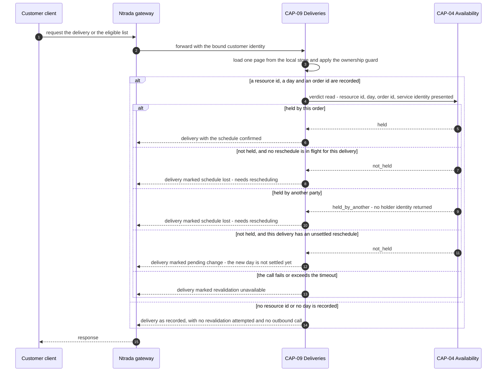

# ADR-027: A delivery read revalidates its reservation against availability, and reports "schedule lost — needs rescheduling" when the day is gone

| | |
| --- | --- |
| **Status** | Proposed |
| **Date** | 2026-10-03 |
| **ADR id** | `ADR-027` |
| **Backlog candidate** | None. `adr-candidates.md` runs to `ADR-CANDIDATE-020` and records no candidate for a deliveries-to-availability read |
| **Category / Impact** | Integration & Reliability / high |
| **Supersedes / Superseded by** | — (extends `ADR-010` from write-gating to a read path; supersedes nothing) |
| **Deciders** | Unassigned — no `CODEOWNERS`, contributing guide or team metadata exists in any of the fourteen clones (`ADR-021` B1, `risk-constraint-gap-register.md` `G-01`) |
| **Base ref of all cited source** | `feature/14830/aidlc` |
| **Source** | `DO1` — *Eligible Delivery Schedule & Alternative-Day View*, work item **14830**, `intents/14830.md`. `ASM-20`, which resolves `OQ-5`: the reservation is revalidated against CAP-04 at delivery read time, and the contract is unchanged. `ASM-16`: a later expropriation is accepted, and the delivery is reported as "schedule lost — needs rescheduling" |
| **Non-functional requirements** | `NFR-20` (**at risk**) — the customer-facing delivery read stays responsive and does not fail because a dependency is slow; `NFR-13` (the read is bounded); `NFR-17` (no contract or persistence break) |
| **Infrastructure recommendation applied** | `INF-3` — CAP-09 outbound synchronous read to CAP-04 and the service-identity certificate it requires, governed by `ADR-010`, delegated to **HLS** |
| **Fit verdict applied** | Verdict 6 — read-time reservation revalidation realized as an `ADR-010` narrow point read against CAP-04, `can_extend_existing_component: true`, confidence **medium** |
| **Related** | `ADR-010` (the narrow synchronous point-read decision this extends), `ADR-026` (the replica whose read path this guards), `ADR-024` (the move that creates the reservation being revalidated), `ADR-025` (the recorded resource id this read is keyed on), `ADR-021` (the observability this needs and does not have) |

## Notation

| Symbol | Meaning |
| --- | --- |
| ✅ | Confirmed current behaviour — observed in source at the cited path and line range |
| 🎯 | Target state — intended design, not in production today |
| ❓ | Needs validation — assumed or inferred, not observed in source |
| `[INFERRED]` | Conclusion drawn from observed evidence rather than stated by it |

## Contents

1. [Context](#1-context)
2. [Decision Drivers](#2-decision-drivers)
3. [Architecture Fit Evaluation](#3-architecture-fit-evaluation)
4. [Options Considered](#4-options-considered)
5. [Decision](#5-decision)
6. [Consequences](#6-consequences)
7. [Compliance Considerations](#7-compliance-considerations)
8. [Non-Functional Requirements & Testing](#8-non-functional-requirements--testing)
9. [Relationship to the implementation pattern catalog](#9-relationship-to-the-implementation-pattern-catalog)
10. [Evidence](#10-evidence)
11. [Follow-Up Actions](#11-follow-up-actions)
12. [Assumptions, Blockers & Open Questions](#assumptions-blockers--open-questions)

---

## 1. Context

`ASM-16` accepts a hard truth: a customer's reserved day can be taken away after the fact. The
platform's reservation model permits a higher-priority reservation to displace a lower-priority one,
and `ASM-14` fixes customer reschedules at one standard, non-expropriating priority — so the customer
is always the one who can be displaced, never the one who displaces.

When that happens, nothing tells the customer. CAP-04 releases the reservation inside its own
aggregate; the release path returns **silently** when nothing matches ✅
(`Availability/.../Core/Entities/Resource.cs`, `ReleaseReservation`), and the delivery record in
CAP-09 goes on showing a date that is no longer held by anybody.

`ASM-20` resolves `OQ-5` by deciding where the truth is re-established: **at delivery read time**,
against CAP-04, with **the contract unchanged**. The delivery read already exists —
`GET /deliveries/{deliveryId}` ✅ — and `DO1` adds the customer-facing eligible list on the same
service. Both read paths must be able to say "this day is no longer yours".

This is new ground for CAP-09 in one specific way: **it has no outbound synchronous call to any
service today.** Its only outbound traffic is the events it publishes. `ADR-010` records the
platform's decision for exactly this situation — a narrow synchronous point read, never an unbounded
collection scan — and it records that such calls carry a service-identity client certificate. CAP-09
does not have one.

## 2. Decision Drivers

| # | Driver | Where it comes from |
|---|--------|---------------------|
| D1 | A displaced reservation must become visible to the customer, not stay silently wrong | `ASM-16` |
| D2 | The revalidation happens at read time, and the delivery contract does not change | `ASM-20`, resolving `OQ-5` |
| D3 | A customer-facing read must not become unavailable because a dependency is | `NFR-20`, recorded **at risk** |
| D4 | Cross-service reads are narrow point reads, never collection scans | `ADR-010` C10 |
| D5 | CAP-09's replicated date is a copy and can be stale; CAP-04 holds the reservation truth | `ADR-026` Rule 2, `ADR-009` |

## 3. Architecture Fit Evaluation

The binding fit verdict is `can_extend_existing_component: true`, realized as an `ADR-010` narrow
point read against CAP-04, **confidence medium** — and the record states why the confidence is
medium rather than high, because that is the useful part.

| Dimension | Verdict | Consequence for this record |
|-----------|---------|-----------------------------|
| Owner | CAP-09 performs the read; CAP-04 answers it | Both are existing services. Neither gains a new responsibility in principle |
| New deployable service | **Not required** | None is proposed |
| New bounded context | **Not required** | None is proposed |
| New runtime component | **Not required** | None is proposed |
| Why confidence is medium | CAP-09 has **no** outbound synchronous client, **no** service-identity certificate, and no recorded timeout or failure policy for one. `ADR-010`'s pattern is proven on the platform but has never been instantiated in this service | Rules 3, 4 and 5 exist to make the missing pieces explicit rather than assumed. `INF-3` carries the certificate work to HLS |

The read itself fits `ADR-010` cleanly: keyed on the resource id recorded by `ADR-025`, it returns
one resource, and the reservation check is a membership test on that resource's own reservation set.
It is a point read by construction, not by discipline.

## 4. Options Considered

### Option A — revalidate at delivery read time with a narrow point read *(chosen; `ASM-20`, which resolves `OQ-5`)*

CAP-09, when serving a delivery read, asks CAP-04 whether the reservation for this delivery's
resource and day is still held. If it is not, the delivery is reported as schedule lost.

- **For.** `ASM-20` decides it. It keeps the delivery contract unchanged, needs no new event, and
  uses a pattern `ADR-010` has already recorded and the platform already runs.
- **Against.** It puts a synchronous dependency on a customer-facing read path in a service that has
  never had one, in a platform with no circuit breaker and no recorded timeout policy.

### Option B — CAP-04 publishes a reservation-released event and CAP-09 updates its replica

**Rejected by `ASM-20`, and recorded here with its own merits.** It would keep the read path
dependency-free, which `NFR-20` would prefer. It is rejected because the release path is silent when
nothing matches ✅ — so the event would not reliably fire in exactly the case that matters — and
because `ADR-009`'s replica gap means a missed event leaves the customer permanently misinformed with
no detection. `ASM-20` chose the path where the answer is computed from the current truth rather than
from a copy that may never have been updated.

### Option C — a scheduled sweep that reconciles reservations in the background

**Rejected.** There is no scheduler, no job host and no reconciliation job anywhere on the platform —
`ADR-009`'s recorded gap is exactly this absence. Introducing one is a new runtime component, which
the fit verdict excludes, and it would still leave a window in which the customer sees a stale day.

### Option D — change the delivery contract to carry a reservation-valid flag computed elsewhere

**Rejected.** `ASM-20` states the contract is unchanged. The existing `GET /deliveries/{deliveryId}`
response is consumed by callers this record cannot enumerate, and `NFR-17` constrains changes to
additive.

## 5. Decision

**When CAP-09 serves a delivery read for a delivery that has a recorded resource id and a replicated
delivery date, it revalidates *that specific reservation's identity* against CAP-04 through a new
narrow authenticated read, and reports "schedule lost — needs rescheduling" when the reservation is
no longer held by this order.** Six rules follow.

**Rule 1 — revalidation asks about one reservation's identity, not about a day's occupancy, and it
does not fetch the resource document.** The call names the resource id, the calendar day and the
order id recorded on the delivery, and CAP-04 answers one question: *is the reservation on that
resource for that day recorded as held by that order?* Three answers are possible — `held`,
`not held`, `held by another` — and they are not collapsed.

Two things this rule rejects, both of which the first revision of this record allowed:

- **Day occupancy is not revalidation.** "Some reservation exists for that day" is true both when the
  customer still holds it and when somebody else expropriated it and booked the same day. Those are
  opposite outcomes — confirmed, and schedule-lost — and the whole purpose of this read is to tell
  them apart. `ASM-16` accepts expropriation precisely *because* this read is supposed to catch it;
  an occupancy check catches nothing. It is checkable only because `ADR-024` Rule 8 records the owner
  on the reservation.
- **The existing `GET /resources/{resourceId}` is not the mechanism.** That endpoint returns the
  resource document, and the resource carries its **entire** reservation history with no bound ✅ —
  exactly the unbounded collection `ADR-010` C10 forbids, and `ADR-024` Option D rejects it on those
  grounds for the alternative-day read. It also discloses every other customer's held days to the
  caller, breaching `NFR-1` on a path that runs on every customer delivery read. Using it here would
  be the same mistake `ADR-024` already declined to make, on a hotter path.

So CAP-04 gains a new narrow read, and its shape is part of this decision:

| Property | Fixed here |
|----------|------------|
| Input | One `ResourceId`, one calendar day, one `OrderId` |
| Output | One verdict — `held`, `not_held`, `held_by_another` — and the day it was asked about. **No** reservation list, **no** priority, **no** other party's identifier |
| Authentication | Service identity, per Rule 6. CAP-04 refuses an unauthenticated caller |
| Batch form | Rule 2's per-distinct-resource variant takes at most one `(day, OrderId)` pair per resource per call, and the number of pairs is bounded by the list's page size. It is not an open query interface |

`held_by_another` is never elaborated to the customer — `ADR-030` Rule 3 forbids disclosing who holds
a day. CAP-09 renders it as schedule-lost, identically to `not_held`; the distinction exists so that
operators can tell expropriation from lapse in the logs.

**Rule 2 — the list read is not N calls, and the list itself is bounded.** For the customer-facing
eligible list, revalidation is performed **per distinct resource**, not per delivery. `ASM-15` fixes
the resource for a given delivery and `ASM-19` bounds the horizon to fourteen days, so the
distinct-resource count for one customer's list is small — but "small" was an inference (`A2`), and
an inference is not a bound.

The bound is therefore explicit: **the eligible-delivery list is paged, with a fixed maximum page
size, and revalidation runs over one page only.** The page size caps the distinct-resource count and
therefore caps the outbound call count per customer read, whatever a customer's delivery volume turns
out to be. A customer holding a hundred open deliveries produces the same bounded burst as a customer
holding three. `FA6` fixes the page-size number; that there is one is decided here.

**Rule 3 — the call has an explicit timeout, a declared value, and a defined response when it
expires, and all three exist before the edge is enabled.** `FA2` fixes the number. What is decided
here is that there **is** one, declared in configuration rather than defaulted; that exceeding it
produces Rule 4's `revalidation_unavailable` state and not an unhandled exception; and that the
timeout budget for a whole list read is the per-call timeout times Rule 2's page bound, which must
itself be inside the customer-facing read's budget. An unconfigured client's default is effectively
unbounded ✅, so "we will set it later" and "there is no timeout" are the same configuration.

**Rule 4 — a failed or timed-out revalidation degrades, it does not fail the read.** `NFR-20` is
recorded at risk precisely because the obvious implementation makes a customer-facing read die when
CAP-04 is slow. The delivery is returned with its recorded values and an explicit
**revalidation-unavailable** indication. The read never returns a *reassuring* answer it could not
verify: unverified is distinct from verified-good and from schedule-lost, and all three are
distinguishable by the caller.

**Rule 5 — schedule lost is a reported state, not a mutation, and this record is its only home.**
CAP-09 does not write to CAP-04, does not delete the delivery, and does not clear the replicated date.
`ASM-16` accepts the expropriation; the customer is told, and the customer reschedules.

**It is not persisted.** The delivery record carries no schedule-lost field — `ADR-026` Rule 1 states
the same thing from the storage side, and the two records agreed to one home on this revision. A
stored copy would be a second answer to a question only CAP-04 can answer, kept true by nothing: the
replica has no reconciliation (`ADR-026` §6.2), so the stored value would drift silently and tell a
customer their day is lost when it is held, or held when it is lost. Every read computes the state
fresh, or reports Rule 4's `revalidation_unavailable`. Those are the only two options.

If a latency measurement later justifies a cache, two things bind it and `FA3` is where the decision
is recorded: a fresh result always wins over a cached one, and a cached result is never presented as
`confirmed` — it degrades to `revalidation_unavailable`, which is exactly Rule 4's existing state.
A cache that can be presented as a confirmed schedule is the persisted indicator again under another
name.

This read also carries the `settled` lag from `ADR-026` §5.2. Between `confirmed` and `settled` the
replica's recorded day is the *old* day while CAP-04 holds the *new* one, so Rule 1 returns
`not_held` for a reservation that was never lost. CAP-09 distinguishes the two by the delivery's
recorded `ScheduleRevision`: where a reschedule is known to be in flight for this delivery and
unsettled, the read reports **pending change**, not schedule-lost. Telling a customer who has just
rescheduled that their schedule is lost would be the worst possible moment to be wrong, and it is the
default outcome if this clause is omitted.

**Rule 6 — the call is authenticated as a service, CAP-04 refuses it otherwise, and both halves are
preconditions for enabling the edge.** `ADR-010` records that cross-service calls carry a
service-identity client certificate. CAP-09 has none. Three things must all be true before this path
is enabled in any environment, and none of them is a follow-up:

1. CAP-09 holds and presents a service-identity client certificate (`INF-3`, `FA4`).
2. CAP-04's new Rule 1 read **refuses** a caller that presents none. A caller-side-only control is not
   a control — it is a convention, and `ADR-029` §1 records what conventions are worth on this
   platform. The read exposes one order's reservation state; unauthenticated, it is an enumeration
   oracle over every order id.
3. Rule 3's timeout is configured and `revalidation_unavailable` is a response state the caller can
   actually receive and render (`FA1`, `FA2`).

Until all three hold, the revalidation edge stays off and deliveries are served from the replica
alone — which is `ADR-026`'s behaviour without this record, and a defined fallback rather than a
broken one. `B1` records the blocker.

### 5.1 The read path

The two schedule-lost branches are rendered identically to the customer and separately in the logs —
`held_by_another` is `ASM-16`'s expropriation actually happening, and `not_held` is a hold that
lapsed. Conflating them, as a day-occupancy check does, loses the one signal that would tell an
operator which of the two the platform is doing to its customers.

## 6. Consequences

### 6.1 Positive

- `ASM-16`'s accepted expropriation stops being an invisible failure. The customer learns that the
  day is gone at the first moment they look.
- The answer is computed from CAP-04's current state rather than from a replica that may never have
  been updated, which is the one place in this feature where the replica's unreconciled gap would
  otherwise be customer-visible and wrong.
- The delivery contract is unchanged, so no existing consumer breaks — `NFR-17` holds. (`ASM-20`'s
  wider claim that the *reservation event* contract is unchanged no longer holds; `ADR-030` `Q2`
  carries that, and it is not this read's doing.)
- Rule 1's verdict read discloses strictly less than the resource point read it replaces: one
  yes/no/other for a day the caller already knows about, instead of every reservation the resource
  holds. The narrower contract is also the more private one.
- `held_by_another` makes expropriation countable. `ASM-16` accepts it as a product decision; nobody
  could previously tell how often it happens, because `ReleaseReservation` leaves no trace ✅.

### 6.2 Negative

- **A customer-facing read now depends on another service's availability.** This is a genuine
  reduction in the independence CAP-09 has today. Rule 4 bounds the damage to a degraded answer
  rather than an error, but the dependency is real and is recorded as `R-21`. `NFR-20` is **at risk**
  for this reason, and it stays at risk until `FA2` fixes a timeout and `N4` proves the degradation.
- **CAP-09 needs a service-identity certificate it does not have.** Until `INF-3` delivers it, this
  path cannot ship. That is `B1`.
- **There is no circuit breaker.** A persistently slow CAP-04 means every delivery read pays the
  timeout. `ADR-010` records that the platform has no breaker, and this record does not add one —
  adding resilience infrastructure is `INF-3`'s territory and `FA4`'s question.
- **There is no consumer-side signal.** `ADR-021` records the platform's observability gaps; a
  revalidation that is failing for every customer looks, from the outside, exactly like a platform
  where nobody is rescheduling.
- **CAP-04 gains a new endpoint, which the first revision of this record said it would not.** Rule 1's
  verdict read is a new route, a new handler and a new authentication requirement on a service whose
  pipeline does not execute tests ✅ (`R-25`). It is additive and breaks nothing, and it is still
  CAP-04 work that `DO1` did not previously carry. The alternative — reading the whole resource
  document — is forbidden by `ADR-010` C10 and breaches `NFR-1`, so there was no cheaper correct
  option, only a cheaper wrong one.
- **Rule 1 cannot be implemented before `ADR-024` Rule 8.** The verdict read answers "held by this
  order", and a reservation records no order today ✅. The two changes ship together or the read
  answers a question CAP-04's data cannot support. `B2` records it.
- **Rule 2's paging changes the customer-facing list contract.** An unpaged list was never specified,
  but a client written against an unbounded response and then given a page is a client that silently
  drops deliveries. The page bound has to be in the contract from the first release, not added when
  the call volume becomes a problem.

### 6.3 Neutral and follow-on

- CAP-04 gains a new narrow verdict endpoint (Rule 1). The existing `GET /resources/{resourceId}`
  contract is untouched and is deliberately **not** used by this path.
- The `AsDaysSinceEpoch` conversion ✅ means CAP-04's reservation dates are days since `0001-01-01`
  with the time of day discarded. The revalidation comparison must be performed in the same day space
  as the reservation is stored in, not in the caller's local date space. `ADR-024` Rule 5 already
  forbids intra-day precision on the write side; `N6` asserts the read side agrees.

## 7. Compliance Considerations

| Obligation | Source | How this record complies |
|------------|--------|--------------------------|
| Cross-service reads are narrow point reads by id, and never return an unbounded collection | `ADR-010` C10 | Rule 1's verdict read returns one verdict. The resource document — which carries the resource's whole unbounded reservation history ✅ — is explicitly not read |
| A caller may not learn another customer's holdings | `NFR-1` | Rule 1's output carries no holder identity; `held_by_another` is a verdict, not a disclosure. Verified by `N11` |
| Cross-service calls carry service identity | `ADR-010`, `ADR-006` | Rule 6.1, and `B1` records that CAP-09 cannot comply yet |
| No unauthenticated surface is added | `NFR-2`, `ADR-006` | Rule 6.2 — the **provider** refuses, not only the caller. Verified by `N7` |
| The delivery contract is unchanged | `NFR-17` | Rule 5 reports within the existing shape; `FA1` fixes how |
| A customer-facing read stays responsive under dependency failure | `NFR-20` | Rule 4, verified by `N4` |
| Service discovery and routing go through the platform's existing mechanism | `ADR-010`, `ADR-016` | The call is resolved the way every other cross-service call is; no direct host is configured |
| Correlation identifiers propagate across the new edge | `ADR-021`, `INF-4` | `N8` |

## 8. Non-Functional Requirements & Testing

| # | Requirement | NFR | How it is verified |
|---|-------------|-----|--------------------|
| `N1` | A delivery whose reservation is still held **by its own order** reads as scheduled | `ASM-16`, Rule 1 | Reserve for this order, read, assert confirmed |
| `N2` | A delivery whose reservation has been released reads as schedule lost, **and a delivery whose day is now held by a different order also reads as schedule lost rather than as confirmed** | `ASM-16`, Rule 1 | Two cases. (a) Release the reservation, read, assert schedule-lost. (b) Release it and immediately reserve the same day for a **different** order, read, assert schedule-lost. Case (b) returns *confirmed* under any day-occupancy check, which is why it is the test that matters |
| `N3` | A customer-facing list revalidates once per distinct resource, not once per delivery, and never more than the page bound | Rule 2, `ADR-010` C10 | Five deliveries on one resource: assert exactly one outbound call. Then a page's worth of deliveries across distinct resources: assert the call count does not exceed the page bound |
| `N4` | When CAP-04 is unreachable or slow, the read still returns, marked revalidation-unavailable | `NFR-20` | Stub the client to time out. Assert a 2xx response and the explicit indication |
| `N5` | An unverified read is never presented as a confirmed schedule | Rule 4 | Same stub. Assert the response is distinguishable from `N1`'s |
| `N6` | Revalidation compares in CAP-04's stored day space, so a non-midnight input cannot produce a false negative | `ADR-024` Rule 5 | Drive the comparison with a timestamped date. Assert the same verdict as the midnight case, or an explicit rejection — never a silent mismatch |
| `N7` | CAP-04 **refuses** a revalidation call carrying no service identity | `NFR-2`, Rule 6.2 | Call the verdict endpoint without the certificate. Assert CAP-04 refuses. Asserting that CAP-09 *sends* one does not satisfy this row |
| `N8` | The correlation identifier on the inbound customer request appears on the outbound revalidation call | `ADR-021`, `INF-4` | Capture the outbound headers. Assert the identifier matches |
| `N9` | A delivery with no recorded resource id makes no outbound call at all | Rule 1 | Read a pre-`ADR-025` delivery. Assert zero calls and a defined response |
| `N10` | The revalidation never reads the resource document, and the verdict response carries no reservation list | Rule 1, `ADR-010` C10 | Seed a resource with 5,000 reservations. Assert the response size is constant and that `GET /resources/{resourceId}` was not called |
| `N11` | A `held_by_another` verdict discloses no holder identity to CAP-09, and nothing about the holder reaches the customer | `NFR-1`, `ADR-030` Rule 3 | Assert the verdict payload and the rendered response contain no other customer's or order's identifier |
| `N12` | A delivery with a confirmed-but-unsettled reschedule reads as **pending change**, not as schedule lost | Rule 5 | Commit the move in CAP-04, suppress the two event legs, read. Assert pending-change. Assert the customer is not told their schedule is lost |
| `N13` | No schedule-lost value is persisted on the delivery record by any read | Rule 5, `ADR-026` Rule 1 | Perform a schedule-lost read. Assert the stored document is byte-identical before and after |
| `N14` | The whole-list revalidation completes inside the customer-facing read budget at the page bound | `NFR-20`, Rule 3 | Full page, each call at the configured timeout. Assert the total is within budget — this is the arithmetic `FA2` and `FA6` must agree on |

## 9. Relationship to the implementation pattern catalog

Applies `patterns/integration/narrow-synchronous-point-read.md`, and extends it in one respect the
catalog entry does not currently cover: **the failure policy for a point read on a customer-facing
path.** The existing entry describes point reads used to gate writes, where failing the operation is
the correct answer. Rule 4 is the read-path counterpart — degrade and label, never fail — and the
pattern entry should gain it so the next read-path caller does not re-derive it.

Also applies `patterns/observability/correlation-and-span-propagation.md` across the new edge (`N8`).

## 10. Evidence

| # | Claim | Source |
|---|-------|--------|
| E1 | `ReleaseReservation` returns silently when nothing matches, so an expropriation leaves no trace at the caller | `Availability/.../Core/Entities/Resource.cs`; `availability-service.md` §3.9 |
| E2 | CAP-04 stores reservation dates as days since `0001-01-01` with the time of day discarded | `AsDaysSinceEpoch`; `availability-service.md` §3.12 |
| E3 | `GET /deliveries/{deliveryId}` exists and reads the delivery document directly | `deliveries-service.md` §3.21; catalog endpoint record |
| E4 | CAP-09 has no outbound synchronous call to any service today | `deliveries-service.md` §3.34; `architecture-views.md` §2.1, where `deliveries` has no outbound synchronous edge |
| E5 | Cross-service point reads are the platform's recorded pattern, and carry a service-identity client certificate | `ADR-010` |
| E6 | The platform has no circuit breaker on cross-service calls | `ADR-010`; `architecture-baseline.md` §11.3 |
| E7 | The platform has no consumer-lag or cross-service call observability | `ADR-021`; `risk-constraint-gap-register.md` |
| E8 | Reservations are displaced by priority, and the customer-reschedule priority is the standard non-expropriating one | `availability-service.md` §3.8; `ASM-14` |
| E9 | `ReservationDto` exposes a reservation's date and priority and no owner, so the existing projection cannot answer "held by this order" | `availability-service.md` §4.5; `architecture-views.md` §5.1 |
| E10 | A reservation has no independent lifetime and cannot be queried without its resource, so a verdict read is a new CAP-04 capability rather than a narrowing of an existing one | `availability-service.md` §3.5 |
| E11 | The resource document carries the resource's entire reservation history with nothing bounding its size | `Resource.cs`; `availability-service.md` §3.1 *Failure modes*; `ADR-024` Option D |

### 10.1 Documentation-versus-code conflicts

None found for this record. One conflict **internal to this patch** was resolved on this revision:
`ADR-026` Rule 1 listed a persisted schedule-lost indicator on the delivery record while Rule 5 here
made schedule-lost a read-time state that is reported and never mutated. `ADR-026` Rule 1 no longer
records the field, and Rule 5 here is the single home.

## 11. Follow-Up Actions

**Reading the `By` column.** Each entry carries a calendar date followed by the delivery milestone
that date is derived from. The dates come from the one work-item 14830 wave calendar in
[`../specs/14830/solution-design.md`](../specs/14830/solution-design.md) §5.1, so every record in
`ADR-024`…`ADR-030` resolves the same milestone to the same date. If the wave calendar moves, that
section is the single place to change and these dates move with it; the milestone is what binds.

| # | Action | Owner | By |
|---|--------|-------|-----|
| `FA1` | **[ACTION NOW]** Fix how `confirmed`, `schedule_lost`, `pending_change` and `revalidation_unavailable` are expressed inside the unchanged delivery contract — four distinguishable states, additively. This is a precondition for Rule 6.3, because a response state the caller cannot receive is the same as not having one | `DO1` implementer with the platform architect | **2026-10-24** — during `DO1` high-level design |
| `FA2` | **[ACTION NOW]** Fix the revalidation timeout as a number, in configuration, together with the whole-list budget it implies at `FA6`'s page bound (`N14`). `NFR-20` cannot be assessed against an unspecified timeout, and the default on an unconfigured client is effectively unbounded. **Precondition for enabling the edge**, per Rule 6.3 | Platform owner with the `DO1` implementer | **2026-11-21** — before `DO1` reaches a shared environment, rather than before it ships |
| `FA3` | **[handled later by HLS]** Rule 5 **decides** that schedule-lost is not persisted. This action remains only to record the two binding constraints if a latency measurement later justifies a cache: a fresh result always wins, and a cached result degrades to `revalidation_unavailable` rather than being presented as confirmed | `DO1` implementer | **2026-10-24** — during `DO1` high-level design |
| `FA4` | **[ACTION NOW]** Issue CAP-09's service-identity client certificate and the configuration to present it, record where it is stored (`INF-3`), **and** implement CAP-04's refusal of an unauthenticated caller on the Rule 1 verdict endpoint. Both halves are preconditions for enabling the path (`B1`, Rule 6) | Platform owner with DevOps and the `DO1` implementer | **2026-11-21** — before `DO1` reaches a shared environment |
| `FA5` | **[ACTION NOW]** Add a success-rate and latency signal for the new CAP-09-to-CAP-04 edge, plus a count of `held_by_another` verdicts, so a persistently failing revalidation is distinguishable from nobody rescheduling and `ASM-16`'s accepted expropriation is measurable rather than assumed rare (`ADR-021`) | Platform owner with DevOps | **2026-11-21** — before `DO1` reaches a shared environment |
| `FA6` | **[ACTION NOW]** Fix the eligible-delivery list's maximum page size as a number (Rule 2), and check it against `FA2`'s timeout so `N14`'s arithmetic closes. The two numbers constrain each other and cannot be chosen separately | `DO1` implementer with the platform architect | **2026-11-07** — during `DO1` low-level design |
| `FA7` | **[handled later by HLS]** Specify the Rule 1 verdict endpoint on CAP-04 — route, request shape, the three verdict values and its refusal behaviour — and add it to the API inventory. It is a new CAP-04 surface that `DO1` did not previously carry | `DO1` implementer | **2026-11-07** — during `DO1` low-level design |

## Assumptions, Blockers & Open Questions

### Assumptions

- **A1 — resolved on this revision, and it resolved against the first version of this record.**
  CAP-04's projection *does* expose reservations — `ReservationDto` carries date and priority ✅ — so
  the question of whether reservations are visible is answered. What that projection cannot do is
  answer *whose* reservation it is: there is no owner on a `Reservation` ✅, so the existing read can
  only establish day occupancy, which Rule 1 rejects as the wrong question. Hence the verdict
  endpoint, and hence `B2`. The assumption was true and insufficient, which is the more useful thing
  to have found out.
- **A2 — replaced by a bound on this revision.** The distinct-resource count for one customer's
  eligible list was inferred small from `ASM-15` and `ASM-19`. Rule 2 now bounds it explicitly with a
  page size (`FA6`) rather than inferring it, because an inference about customer behaviour is not a
  limit on outbound call volume.
- **A3 ❓** CAP-09 can tell a confirmed-but-unsettled reschedule from a lost one at read time, using
  the delivery's recorded `ScheduleRevision` and the revision returned at `confirmed` (`ADR-026`
  §5.2). This holds if the customer's client returns the revision it was given; a client that does not
  cannot distinguish the two and Rule 5's pending-change branch degrades to schedule-lost for it.
  `ADR-026` `Q2` is where the client-side shape is decided.

### Blockers

- **B1 — CAP-09 has no service-identity client certificate, and CAP-04 does not yet refuse callers
  without one.** `ADR-010` requires the certificate and Rule 6 fails closed without it; Rule 6.2
  additionally requires the provider-side refusal, which does not exist. Both halves are `FA4`. This
  path cannot be enabled until they are done, together with `FA1`'s response states and `FA2`'s
  timeout. It blocks the release of `DO1`'s revalidation behaviour, not this decision.
- **B2 — Rule 1 cannot be built before `ADR-024` Rule 8.** The verdict read asks whether a reservation
  is held by a given order, and a reservation records no order today ✅. Owner: `DO1` implementer with
  the `DO2` implementer, **2026-11-07** — during `DO1` low-level design, since the two changes must be
  sequenced across two waves.

### Open Questions

- **Q1** Should a repeatedly failing revalidation open a circuit rather than pay the timeout on every
  read? The platform has no breaker anywhere, so adding one here would be a first. Platform architect,
  after the first release.
