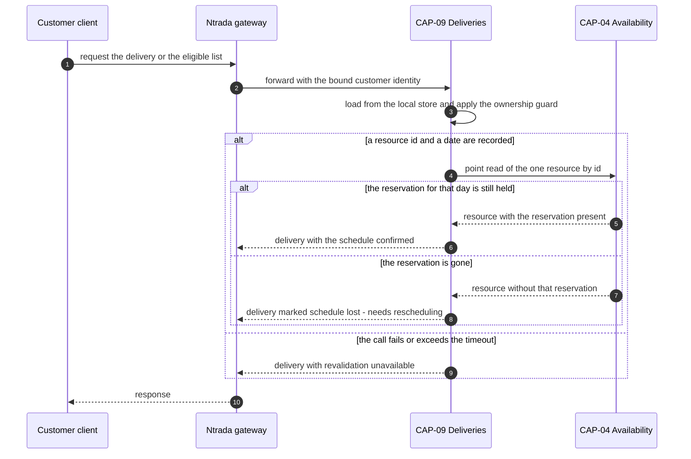

# ADR-027: A delivery read revalidates its reservation against availability, and reports "schedule lost — needs rescheduling" when the day is gone

| | |
| --- | --- |
| **Status** | Proposed |
| **Date** | 2026-10-03 |
| **ADR id** | `ADR-027` |
| **Backlog candidate** | None. `adr-candidates.md` runs to `ADR-CANDIDATE-020` and records no candidate for a deliveries-to-availability read |
| **Category / Impact** | Integration & Reliability / high |
| **Supersedes / Superseded by** | — (extends `ADR-010` from write-gating to a read path; supersedes nothing) |
| **Deciders** | Unassigned — no `CODEOWNERS`, contributing guide or team metadata exists in any of the fourteen clones (`ADR-021` B1, `risk-constraint-gap-register.md` `G-01`) |
| **Base ref of all cited source** | `feature/14830/aidlc` |
| **Source** | `DO1` — *Eligible Delivery Schedule & Alternative-Day View*, work item **14830**, `intents/14830.md`. `ASM-20`, which resolves `OQ-5`: the reservation is revalidated against CAP-04 at delivery read time, and the contract is unchanged. `ASM-16`: a later expropriation is accepted, and the delivery is reported as "schedule lost — needs rescheduling" |
| **Non-functional requirements** | `NFR-20` (**at risk**) — the customer-facing delivery read stays responsive and does not fail because a dependency is slow; `NFR-13` (the read is bounded); `NFR-17` (no contract or persistence break) |
| **Infrastructure recommendation applied** | `INF-3` — CAP-09 outbound synchronous read to CAP-04 and the service-identity certificate it requires, governed by `ADR-010`, delegated to **HLS** |
| **Fit verdict applied** | Verdict 6 — read-time reservation revalidation realized as an `ADR-010` narrow point read against CAP-04, `can_extend_existing_component: true`, confidence **medium** |
| **Related** | `ADR-010` (the narrow synchronous point-read decision this extends), `ADR-026` (the replica whose read path this guards), `ADR-024` (the move that creates the reservation being revalidated), `ADR-025` (the recorded resource id this read is keyed on), `ADR-021` (the observability this needs and does not have) |

## Notation

| Symbol | Meaning |
| --- | --- |
| ✅ | Confirmed current behaviour — observed in source at the cited path and line range |
| 🎯 | Target state — intended design, not in production today |
| ❓ | Needs validation — assumed or inferred, not observed in source |
| `[INFERRED]` | Conclusion drawn from observed evidence rather than stated by it |

## Contents

1. [Context](#1-context)
2. [Decision Drivers](#2-decision-drivers)
3. [Architecture Fit Evaluation](#3-architecture-fit-evaluation)
4. [Options Considered](#4-options-considered)
5. [Decision](#5-decision)
6. [Consequences](#6-consequences)
7. [Compliance Considerations](#7-compliance-considerations)
8. [Non-Functional Requirements & Testing](#8-non-functional-requirements--testing)
9. [Relationship to the implementation pattern catalog](#9-relationship-to-the-implementation-pattern-catalog)
10. [Evidence](#10-evidence)
11. [Follow-Up Actions](#11-follow-up-actions)
12. [Assumptions, Blockers & Open Questions](#assumptions-blockers--open-questions)

---

## 1. Context

`ASM-16` accepts a hard truth: a customer's reserved day can be taken away after the fact. The
platform's reservation model permits a higher-priority reservation to displace a lower-priority one,
and `ASM-14` fixes customer reschedules at one standard, non-expropriating priority — so the customer
is always the one who can be displaced, never the one who displaces.

When that happens, nothing tells the customer. CAP-04 releases the reservation inside its own
aggregate; the release path returns **silently** when nothing matches ✅
(`Availability/.../Core/Entities/Resource.cs`, `ReleaseReservation`), and the delivery record in
CAP-09 goes on showing a date that is no longer held by anybody.

`ASM-20` resolves `OQ-5` by deciding where the truth is re-established: **at delivery read time**,
against CAP-04, with **the contract unchanged**. The delivery read already exists —
`GET /deliveries/{deliveryId}` ✅ — and `DO1` adds the customer-facing eligible list on the same
service. Both read paths must be able to say "this day is no longer yours".

This is new ground for CAP-09 in one specific way: **it has no outbound synchronous call to any
service today.** Its only outbound traffic is the events it publishes. `ADR-010` records the
platform's decision for exactly this situation — a narrow synchronous point read, never an unbounded
collection scan — and it records that such calls carry a service-identity client certificate. CAP-09
does not have one.

## 2. Decision Drivers

| # | Driver | Where it comes from |
|---|--------|---------------------|
| D1 | A displaced reservation must become visible to the customer, not stay silently wrong | `ASM-16` |
| D2 | The revalidation happens at read time, and the delivery contract does not change | `ASM-20`, resolving `OQ-5` |
| D3 | A customer-facing read must not become unavailable because a dependency is | `NFR-20`, recorded **at risk** |
| D4 | Cross-service reads are narrow point reads, never collection scans | `ADR-010` C10 |
| D5 | CAP-09's replicated date is a copy and can be stale; CAP-04 holds the reservation truth | `ADR-026` Rule 2, `ADR-009` |

## 3. Architecture Fit Evaluation

The binding fit verdict is `can_extend_existing_component: true`, realized as an `ADR-010` narrow
point read against CAP-04, **confidence medium** — and the record states why the confidence is
medium rather than high, because that is the useful part.

| Dimension | Verdict | Consequence for this record |
|-----------|---------|-----------------------------|
| Owner | CAP-09 performs the read; CAP-04 answers it | Both are existing services. Neither gains a new responsibility in principle |
| New deployable service | **Not required** | None is proposed |
| New bounded context | **Not required** | None is proposed |
| New runtime component | **Not required** | None is proposed |
| Why confidence is medium | CAP-09 has **no** outbound synchronous client, **no** service-identity certificate, and no recorded timeout or failure policy for one. `ADR-010`'s pattern is proven on the platform but has never been instantiated in this service | Rules 3, 4 and 5 exist to make the missing pieces explicit rather than assumed. `INF-3` carries the certificate work to HLS |

The read itself fits `ADR-010` cleanly: keyed on the resource id recorded by `ADR-025`, it returns
one resource, and the reservation check is a membership test on that resource's own reservation set.
It is a point read by construction, not by discipline.

## 4. Options Considered

### Option A — revalidate at delivery read time with a narrow point read *(chosen; `ASM-20`, which resolves `OQ-5`)*

CAP-09, when serving a delivery read, asks CAP-04 whether the reservation for this delivery's
resource and day is still held. If it is not, the delivery is reported as schedule lost.

- **For.** `ASM-20` decides it. It keeps the delivery contract unchanged, needs no new event, and
  uses a pattern `ADR-010` has already recorded and the platform already runs.
- **Against.** It puts a synchronous dependency on a customer-facing read path in a service that has
  never had one, in a platform with no circuit breaker and no recorded timeout policy.

### Option B — CAP-04 publishes a reservation-released event and CAP-09 updates its replica

**Rejected by `ASM-20`, and recorded here with its own merits.** It would keep the read path
dependency-free, which `NFR-20` would prefer. It is rejected because the release path is silent when
nothing matches ✅ — so the event would not reliably fire in exactly the case that matters — and
because `ADR-009`'s replica gap means a missed event leaves the customer permanently misinformed with
no detection. `ASM-20` chose the path where the answer is computed from the current truth rather than
from a copy that may never have been updated.

### Option C — a scheduled sweep that reconciles reservations in the background

**Rejected.** There is no scheduler, no job host and no reconciliation job anywhere on the platform —
`ADR-009`'s recorded gap is exactly this absence. Introducing one is a new runtime component, which
the fit verdict excludes, and it would still leave a window in which the customer sees a stale day.

### Option D — change the delivery contract to carry a reservation-valid flag computed elsewhere

**Rejected.** `ASM-20` states the contract is unchanged. The existing `GET /deliveries/{deliveryId}`
response is consumed by callers this record cannot enumerate, and `NFR-17` constrains changes to
additive.

## 5. Decision

**When CAP-09 serves a delivery read for a delivery that has a recorded resource id and a replicated
delivery date, it revalidates the reservation against CAP-04 with a narrow point read, and reports
"schedule lost — needs rescheduling" when the reservation is no longer held.** Six rules follow.

**Rule 1 — one point read, keyed on the recorded resource id.** The call fetches one resource by id.
It does not search, does not page, and does not fan out over a delivery list. `ADR-010` C10 is
binding.

**Rule 2 — the list read is not N calls.** For the customer-facing eligible list, revalidation is
performed **per distinct resource**, not per delivery. `ASM-15` fixes the resource for a given
delivery and `ASM-19` bounds the horizon to fourteen days, so the distinct-resource count for one
customer's list is small and bounded. A per-delivery loop would turn one customer read into an
unbounded burst and is forbidden.

**Rule 3 — the call has an explicit timeout, and the timeout is shorter than the caller's patience.**
No value is invented here; `FA2` fixes it. What is decided is that there **is** one, declared in
configuration, and that exceeding it is handled by Rule 4 rather than by an unhandled exception.

**Rule 4 — a failed or timed-out revalidation degrades, it does not fail the read.** `NFR-20` is
recorded at risk precisely because the obvious implementation makes a customer-facing read die when
CAP-04 is slow. The delivery is returned with its recorded values and an explicit
**revalidation-unavailable** indication. The read never returns a *reassuring* answer it could not
verify: unverified is distinct from verified-good and from schedule-lost, and all three are
distinguishable by the caller.

**Rule 5 — schedule lost is a reported state, not a mutation.** CAP-09 does not write to CAP-04, does
not delete the delivery, and does not clear the replicated date. `ASM-16` accepts the expropriation;
the customer is told, and the customer reschedules. Whether the schedule-lost indicator is also
persisted on the delivery record is decided by `FA3`, and if it is, it is a cached observation that
never overrides a fresh read.

**Rule 6 — the call is authenticated as a service, and fails closed if it cannot be.** `ADR-010`
records that cross-service calls carry a service-identity client certificate. CAP-09 has none. Until
it does, this path cannot be enabled — an unauthenticated cross-service read would be a new
unauthenticated surface, which `ADR-006` and `NFR-2` both forbid. `INF-3` carries this to HLS and
`B1` records it as the blocker it is.

### 5.1 The read path

## 6. Consequences

### 6.1 Positive

- `ASM-16`'s accepted expropriation stops being an invisible failure. The customer learns that the
  day is gone at the first moment they look.
- The answer is computed from CAP-04's current state rather than from a replica that may never have
  been updated, which is the one place in this feature where the replica's unreconciled gap would
  otherwise be customer-visible and wrong.
- The delivery contract is unchanged, so no existing consumer breaks — `ASM-20` and `NFR-17` both
  hold.

### 6.2 Negative

- **A customer-facing read now depends on another service's availability.** This is a genuine
  reduction in the independence CAP-09 has today. Rule 4 bounds the damage to a degraded answer
  rather than an error, but the dependency is real and is recorded as `R-21`. `NFR-20` is **at risk**
  for this reason, and it stays at risk until `FA2` fixes a timeout and `N4` proves the degradation.
- **CAP-09 needs a service-identity certificate it does not have.** Until `INF-3` delivers it, this
  path cannot ship. That is `B1`.
- **There is no circuit breaker.** A persistently slow CAP-04 means every delivery read pays the
  timeout. `ADR-010` records that the platform has no breaker, and this record does not add one —
  adding resilience infrastructure is `INF-3`'s territory and `FA4`'s question.
- **There is no consumer-side signal.** `ADR-021` records the platform's observability gaps; a
  revalidation that is failing for every customer looks, from the outside, exactly like a platform
  where nobody is rescheduling.

### 6.3 Neutral and follow-on

- CAP-04 gains a new caller on its existing point-read endpoint. No CAP-04 contract changes.
- The `AsDaysSinceEpoch` conversion ✅ means CAP-04's reservation dates are days since `0001-01-01`
  with the time of day discarded. The revalidation comparison must be performed in the same day space
  as the reservation is stored in, not in the caller's local date space. `ADR-024` Rule 5 already
  forbids intra-day precision on the write side; `N6` asserts the read side agrees.

## 7. Compliance Considerations

| Obligation | Source | How this record complies |
|------------|--------|--------------------------|
| Cross-service reads are narrow point reads by id | `ADR-010` C10 | Rules 1 and 2 |
| Cross-service calls carry service identity | `ADR-010`, `ADR-006` | Rule 6, and `B1` records that CAP-09 cannot comply yet |
| No unauthenticated surface is added | `NFR-2`, `ADR-006` | Rule 6 fails closed |
| The delivery contract is unchanged | `ASM-20`, `NFR-17` | Rule 5 reports within the existing shape; `FA1` fixes how |
| A customer-facing read stays responsive under dependency failure | `NFR-20` | Rule 4, verified by `N4` |
| Service discovery and routing go through the platform's existing mechanism | `ADR-010`, `ADR-016` | The call is resolved the way every other cross-service call is; no direct host is configured |
| Correlation identifiers propagate across the new edge | `ADR-021`, `INF-4` | `N8` |

## 8. Non-Functional Requirements & Testing

| # | Requirement | NFR | How it is verified |
|---|-------------|-----|--------------------|
| `N1` | A delivery whose reservation is still held reads as scheduled | `ASM-16` | Reserve, read, assert confirmed |
| `N2` | A delivery whose reservation has been released reads as schedule lost | `ASM-16` | Reserve, release at a higher priority, read. Assert the schedule-lost state |
| `N3` | A customer-facing list revalidates once per distinct resource, not once per delivery | Rule 2, `ADR-010` C10 | Five deliveries on one resource. Assert exactly one outbound call |
| `N4` | When CAP-04 is unreachable or slow, the read still returns, marked revalidation-unavailable | `NFR-20` | Stub the client to time out. Assert a 2xx response and the explicit indication |
| `N5` | An unverified read is never presented as a confirmed schedule | Rule 4 | Same stub. Assert the response is distinguishable from `N1`'s |
| `N6` | Revalidation compares in CAP-04's stored day space, so a non-midnight input cannot produce a false negative | `ADR-024` Rule 5 | Drive the comparison with a timestamped date. Assert the same verdict as the midnight case, or an explicit rejection — never a silent mismatch |
| `N7` | The revalidation call is rejected if it carries no service identity | `NFR-2`, Rule 6 | Call CAP-04 without the certificate. Assert refusal |
| `N8` | The correlation identifier on the inbound customer request appears on the outbound revalidation call | `ADR-021`, `INF-4` | Capture the outbound headers. Assert the identifier matches |
| `N9` | A delivery with no recorded resource id makes no outbound call at all | Rule 1 | Read a pre-`ADR-025` delivery. Assert zero calls and a defined response |

## 9. Relationship to the implementation pattern catalog

Applies `patterns/integration/narrow-synchronous-point-read.md`, and extends it in one respect the
catalog entry does not currently cover: **the failure policy for a point read on a customer-facing
path.** The existing entry describes point reads used to gate writes, where failing the operation is
the correct answer. Rule 4 is the read-path counterpart — degrade and label, never fail — and the
pattern entry should gain it so the next read-path caller does not re-derive it.

Also applies `patterns/observability/correlation-and-span-propagation.md` across the new edge (`N8`).

## 10. Evidence

| # | Claim | Source |
|---|-------|--------|
| E1 | `ReleaseReservation` returns silently when nothing matches, so an expropriation leaves no trace at the caller | `Availability/.../Core/Entities/Resource.cs`; `availability-service.md` §3.9 |
| E2 | CAP-04 stores reservation dates as days since `0001-01-01` with the time of day discarded | `AsDaysSinceEpoch`; `availability-service.md` §3.12 |
| E3 | `GET /deliveries/{deliveryId}` exists and reads the delivery document directly | `deliveries-service.md` §3.21; catalog endpoint record |
| E4 | CAP-09 has no outbound synchronous call to any service today | `deliveries-service.md` §3.34; `architecture-views.md` §2.1, where `deliveries` has no outbound synchronous edge |
| E5 | Cross-service point reads are the platform's recorded pattern, and carry a service-identity client certificate | `ADR-010` |
| E6 | The platform has no circuit breaker on cross-service calls | `ADR-010`; `architecture-baseline.md` §11.3 |
| E7 | The platform has no consumer-lag or cross-service call observability | `ADR-021`; `risk-constraint-gap-register.md` |
| E8 | Reservations are displaced by priority, and the customer-reschedule priority is the standard non-expropriating one | `availability-service.md` §3.8; `ASM-14` |

### 10.1 Documentation-versus-code conflicts

None found for this record.

## 11. Follow-Up Actions

| # | Action | Owner | By |
|---|--------|-------|-----|
| `FA1` | **[handled later by HLS]** Decide how schedule-lost and revalidation-unavailable are expressed inside the unchanged delivery contract — an additive field is the obvious answer, but the shape is a contract decision | `DO1` implementer with the platform architect | During `DO1` high-level design |
| `FA2` | **[ACTION NOW]** Fix the revalidation timeout as a number, in configuration, before this path is enabled. `NFR-20` cannot be assessed against an unspecified timeout, and the default on an unconfigured client is effectively unbounded | Platform owner with the `DO1` implementer | Before `DO1` ships |
| `FA3` | **[handled later by HLS]** Decide whether the schedule-lost observation is persisted on the delivery record. If it is, Rule 5's precedence rule is binding — a fresh read always wins | `DO1` implementer | During `DO1` high-level design |
| `FA4` | **[handled later by DevOps]** Issue CAP-09's service-identity client certificate and the configuration to present it, and record where it is stored (`INF-3`). Until this exists the path cannot be enabled (`B1`) | Platform owner | Before `DO1` reaches a shared environment |
| `FA5` | **[handled later by DevOps]** Add a success-rate and latency signal for the new CAP-09-to-CAP-04 edge, so a persistently failing revalidation is distinguishable from nobody rescheduling (`ADR-021`) | Platform owner | Before `DO1` reaches a shared environment |

## Assumptions, Blockers & Open Questions

### Assumptions

- **A1 ❓** CAP-04's resource point read returns the resource's reservation set in a form from which
  "is this day held, and at what priority" can be answered. The `Resource` entity holds
  `HashSet<Reservation>` ✅ and the read is a point read by id ✅; that the API projection exposes the
  reservations rather than only the tags is read from the endpoint contract and is not separately
  proven here. If it does not, `FA1` grows a CAP-04-side additive projection and the fit verdict's
  medium confidence is the reason that was anticipated.
- **A2 `[INFERRED]`** The distinct-resource count for one customer's eligible list is small, because
  `ASM-15` fixes one resource per delivery and `ASM-19` bounds the horizon to fourteen days. This
  bounds Rule 2's call count without a hard cap; if a customer can hold many concurrent deliveries on
  many resources, `FA2`'s timeout budget needs revisiting.

### Blockers

- **B1 — CAP-09 has no service-identity client certificate.** `ADR-010` requires one for cross-service
  calls and Rule 6 fails closed without it. This path cannot be enabled until `FA4` is done. It blocks
  the release of `DO1`'s revalidation behaviour, not this decision.

### Open Questions

- **Q1** Should a repeatedly failing revalidation open a circuit rather than pay the timeout on every
  read? The platform has no breaker anywhere, so adding one here would be a first. Platform architect,
  after the first release.
