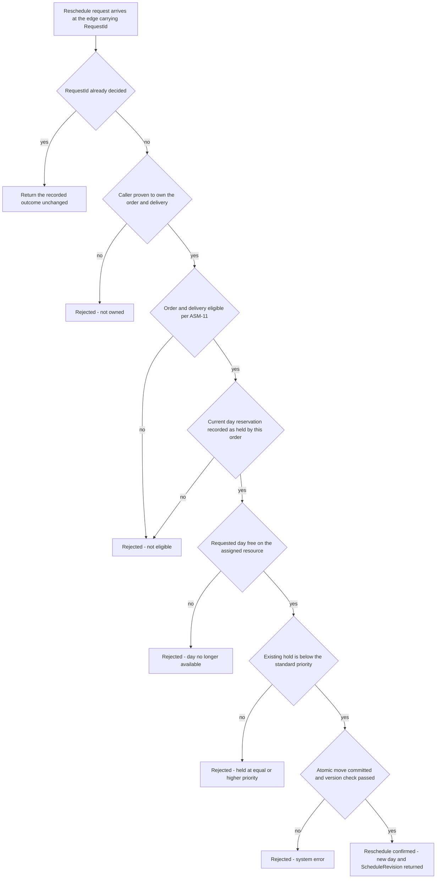

# ADR-030: Reschedule message names, routing keys and the five rejection classes are fixed as contracts, asserted end to end

| | |
| --- | --- |
| **Status** | Proposed |
| **Date** | 2026-10-03 |
| **ADR id** | `ADR-030` |
| **Backlog candidate** | None. `adr-candidates.md` runs to `ADR-CANDIDATE-020` and records no candidate for a rejection vocabulary |
| **Category / Impact** | Integration & Contracts / high |
| **Supersedes / Superseded by** | — (applies `ADR-001`, `ADR-003` and `ADR-013`; supersedes nothing) |
| **Deciders** | Unassigned — no `CODEOWNERS`, contributing guide or team metadata exists in any of the fourteen clones (`ADR-021` B1, `risk-constraint-gap-register.md` `G-01`) |
| **Base ref of all cited source** | `feature/14830/aidlc` |
| **Source** | `DO2` — *Customer Delivery Reschedule Confirmation & Slot Safe-Move*, work item **14830**, `intents/14830.md`. A reschedule either moves the day or is refused for a reason the customer can act on |
| **Non-functional requirements** | `NFR-14` (a rejected reschedule returns a specific, actionable reason, not a generic failure), `NFR-15` (message, routing-key and field naming follows the platform convention), `NFR-7` (a retried reschedule produces one outcome, not two) |
| **Related** | `ADR-001` (service-owned exchanges), `ADR-003` (convention-based message naming and its absent build-time check), `ADR-013` (subscription and handler wiring), `ADR-023` (error and response shape), `ADR-024` (the move that produces these outcomes), `ADR-025` (the reserved resource id this record's payloads carry), `ADR-026` (the consumer of the schedule event fixed by Rule 7), `ADR-029` (the not-owned rejection) |

## Notation

| Symbol | Meaning |
| --- | --- |
| ✅ | Confirmed current behaviour — observed in source at the cited path and line range |
| 🎯 | Target state — intended design, not in production today |
| ❓ | Needs validation — assumed or inferred, not observed in source |
| `[INFERRED]` | Conclusion drawn from observed evidence rather than stated by it |

## Contents

1. [Context](#1-context)
2. [Decision Drivers](#2-decision-drivers)
3. [Architecture Fit Evaluation](#3-architecture-fit-evaluation)
4. [Options Considered](#4-options-considered)
5. [Decision](#5-decision)
6. [Consequences](#6-consequences)
7. [Compliance Considerations](#7-compliance-considerations)
8. [Non-Functional Requirements & Testing](#8-non-functional-requirements--testing)
9. [Relationship to the implementation pattern catalog](#9-relationship-to-the-implementation-pattern-catalog)
10. [Evidence](#10-evidence)
11. [Follow-Up Actions](#11-follow-up-actions)
12. [Assumptions, Blockers & Open Questions](#assumptions-blockers--open-questions)

---

## 1. Context

A reschedule can fail for five genuinely different reasons, and a customer needs a different thing
from each one. The platform's current error vocabulary cannot express any of them.

**Every CAP-09 error is HTTP 400, and the reason field carries the exception message** ✅
(`deliveries-service.md` §3.23). A customer client cannot distinguish "that day just filled up" from
"your order was already completed" from "the database is down", because all three arrive as the same
status with a free-text string shaped by whatever exception happened to be thrown. That string is
also an internal detail leaking to an external caller.

**Message names are matched by convention with nothing checking them.** `ADR-003` records that
compatibility rests on naming convention and that there is no build-time signal when a publisher and
a consumer disagree. The platform already has a worked example: `GAP-6` records a routing-key and
queue-name divergence where the two sides use different casing, and the only symptom is that messages
are never delivered. Nothing fails. Nothing logs. The feature simply does not work.

**The existing message sets have a clear form.** CAP-04's messages are `reserve_resource`,
`release_resource_reservation`, `resource_reserved`, `reservation_canceled`; CAP-09's are
`start_delivery`, `complete_delivery`, `fail_delivery`, `add_delivery_registration`,
`delivery_started`, `delivery_completed`, `delivery_failed`, `order_for_delivery_not_found` ✅. The
convention is clear — snake_case, commands imperative, events past tense — and `DO2` adds to both
sets.

`NFR-14` asks for a specific actionable reason. That is a contract decision, and this record makes
it one rather than leaving it to whatever each handler throws.

**The first revision of this record left the message set itself unfixed, and that was the defect
review found.** `ADR-026` described in detail how CAP-09 *consumes* a schedule change, while no
record said what CAP-07 *publishes* — the name, the routing key, the point in the handler where it
is published, or a single field of its payload. A consumer contract with no producer contract is not
a contract; it is an assumption that the producer will happen to emit what the consumer happens to
read. §5.2 now fixes all four messages, end to end, and Rule 8 asserts the payloads rather than only
the routing keys.

**Today's reservation event cannot carry that flow.** `ResourceReserved` carries `ResourceId`,
`CustomerId` and `DateTime` and nothing else ✅ — it has no `OrderId`. CAP-07 therefore cannot be
told *which order* moved by the events CAP-04 publishes today; it would have to rediscover the order
by matching `(VehicleId, DeliveryDate)`, which is a guess, not a correlation. The move outcome event
in §5.2 carries `OrderId` for exactly this reason, and `ASM-20`'s claim that the reservation event
contract is unchanged in the first release does not survive it (`Q2`).

**New names have to reach the platform's message catalogue or they are invisible to operations.**
`messages.json` is the hand-maintained manifest that `operations-service` reads to build its 80
subscriptions, and `Subscriptions.cs` binds **exactly** the names in that file ✅ (`GAP-15`). The
platform already carries the worked failure: `complete_order_rejected` is published by CAP-07 and
absent from the manifest ✅ (`GAP-25`), so a failed order completion is invisible in the one
component built to surface outcomes. Four new messages arrive with `DO2`. Rule 9 puts them in the
manifest in the same change that introduces them, rather than making this the third instance.

## 2. Decision Drivers

| # | Driver | Where it comes from |
|---|--------|---------------------|
| D1 | A rejected reschedule must tell the customer what to do next | `NFR-14` |
| D2 | Names must follow the established platform convention, and be asserted, because nothing checks them | `NFR-15`, `ADR-003`, `GAP-6` |
| D3 | Internal exception text must not reach an external caller | `deliveries-service.md` §3.23, `ADR-021` |
| D4 | A service publishes only to its own exchange | `ADR-001` C1 |
| D5 | The five outcomes come from decisions already made, not from new design | `ADR-024`, `ADR-029`, `ASM-11`, `ASM-14` |
| D6 | A consumer contract is worthless without the matching producer contract — name, key, publication point and payload | Review of this patch; `ADR-026` Rules 2 to 6 |
| D7 | Correlation must be carried, not inferred: today's `ResourceReserved` has no `OrderId` ✅ | `availability-service.md`; `ADR-025` Rule 1 |
| D8 | A retried reschedule must return the first outcome, not perform a second move | `NFR-7`, `R-15` |
| D9 | A message that is not in `messages.json` is invisible to `operations-service` ✅ | `architecture-views.md` §6 `GAP-15`, `GAP-25` |

## 3. Architecture Fit Evaluation

This record carries no fit verdict of its own; it is the contract surface of the verdicts that govern
`ADR-024`, `ADR-026` and `ADR-029`. The relevant conclusion from those verdicts is that **no new
service, bounded context or runtime component is required**, so every name fixed here belongs to an
existing exchange owned by an existing service.

| Dimension | Verdict | Consequence for this record |
|-----------|---------|-----------------------------|
| Exchange ownership | Unchanged | CAP-04's new messages go on CAP-04's exchange, CAP-09's on CAP-09's. No shared or cross-published exchange |
| Edge exposure | CAP-02 `configuration`, **GOVERNED** | The rejection codes surface through the existing gateway write mode per `ASM-18`. No new edge mechanism |
| Compatibility mechanism | `ADR-003`, convention only | Rule 5's end-to-end assertion is the compensating control, because the architecture provides none |

## 4. Options Considered

### Option A — fix a closed rejection vocabulary and assert names end to end *(chosen)*

Five named rejection classes, a stable code per class, and tests that assert publisher and consumer
agree on every new name.

- **For.** `NFR-14` becomes verifiable rather than aspirational. The `GAP-6` failure mode is caught by
  a test instead of by a customer. Clients can branch on a code without parsing prose.
- **Against.** A closed vocabulary is a contract: adding a sixth class later is a contract change, and
  clients that branch exhaustively must handle an unknown code. Rule 6 addresses that.

### Option B — keep the current shape and improve the exception messages

**Rejected.** It leaves every outcome as HTTP 400 with internal text ✅, so clients must string-match
on exception prose to tell a retryable rejection from a permanent one. That is a contract in the
worst possible form — undeclared, untested, and changing whenever someone rewords a message.

### Option C — map each rejection to a distinct HTTP status code and nothing else

**Rejected.** Three of the five classes are legitimately the same status, and a status code cannot
distinguish "day no longer available" from "held at equal or higher priority" — two outcomes with
different advice for the customer. A code in the body alongside an appropriate status is what
`ADR-023` already establishes.

### Option D — define the vocabulary in a shared contracts package

**Rejected.** `ADR-002` records that the platform has no shared library and has decided against one.
The codes are therefore declared per service and asserted across the boundary by Rule 5, which is the
same trade the platform has already made everywhere else.

## 5. Decision

**The reschedule exposes exactly five rejection classes, each with a stable machine-readable code and
a customer-safe message; the four new messages are fixed here by name, routing key, publication point
and payload; and every new publisher-to-consumer pair is asserted across the boundary on both its
name and its required payload fields.** Nine rules follow.

**Rule 1 — five rejection classes, and only five.**

| Class | What happened | What the customer should do | Retryable |
|-------|---------------|-----------------------------|-----------|
| `day no longer available` | The requested day has no free capacity on the delivery's resource | Pick another day from the offered list | Yes, with a different day |
| `held at equal or higher priority` | The day exists but is held by a reservation this request cannot displace — `ASM-14` fixes customer reschedules at the standard non-expropriating priority | Pick another day | Yes, with a different day |
| `not eligible` | The order or delivery fails `ASM-11` — completed, canceled, failed, or the date is not in the future | Nothing. The delivery can no longer be rescheduled | No |
| `not owned` | The caller is not the owner of the order or delivery, or is not authenticated | Nothing actionable is disclosed — see `ADR-029` Rule 7 | No |
| `system error` | Anything else, including a write conflict exhausting `ADR-028` Rule 6's single retry | Try again shortly | Yes, unchanged |

**Rule 2 — the code is stable, the message is not.** Clients branch on the code. The human-readable
message may be reworded or localized at any time and carries no contract weight. Nothing in any
client may parse the message.

**Rule 3 — no internal detail crosses the boundary.** No exception type, no stack frame, no store
identifier, no other customer's data. In particular `held at equal or higher priority` must not
reveal who holds it or at what priority — that is another party's information. The internal detail is
logged under the correlation identifier instead.

**Rule 4 — new message names follow the existing convention exactly.** snake_case, commands
imperative, events past tense, matching the established CAP-04 and CAP-09 sets ✅. The routing key and
the queue binding use the **same literal string**, written once and referenced, never retyped on each
side — `GAP-6` is a divergence that cost nothing to introduce and is invisible once introduced.

**Rule 5 — every new name pair is asserted across the boundary.** One test per new message asserts
that the string the publisher emits is the string the consumer binds. `ADR-003` records that the
architecture provides no build-time check, so this test is the only control that exists. A test that
checks each side against its own constant proves nothing and does not satisfy this rule.

**Rule 6 — an unrecognized code is handled as a system error by every client.** The vocabulary is
closed today and may grow. A client meeting an unknown code treats it as retryable-unknown and
surfaces a generic message, rather than failing to render a response at all.

**Rule 7 — the four new messages are fixed here, with their payloads, and §5.2 is the contract.** No
later stage chooses these names, and no implementer infers a field. Every field listed as required in
§5.2 is present on every publication; a message missing one is a contract breach, not a sparse
payload. In particular the CAP-07 → CAP-09 schedule event carries `OrderId`, `CustomerId`, the
authoritative `DeliveryDate`, `ReservedResourceId` and the monotonic `ScheduleRevision` — the five
fields `ADR-026`'s consumer rules read — and the CAP-04 move outcome carries `OrderId`, so CAP-07
correlates the move to an order instead of rediscovering it from `(VehicleId, DeliveryDate)`.

**Rule 8 — the cross-boundary assertion covers payload fields, not only the routing key.** Rule 5's
name test is necessary and is not sufficient: `GAP-17` records that `ResourceReserved` is three
independent C# classes in three repositories and that a field added on one side is silently absent on
the other, and `GAP-15` records that the one component seeing every message deserialises none of
them. So for each message in §5.2 a cross-service contract test publishes from the real publisher
type and deserialises into the real consumer type, asserting that every required field arrives with
its value intact. A test asserting routing-key equality alone does not satisfy this rule.

**Rule 9 — a new message is registered in `messages.json` and in `operations-service`'s subscriptions
in the same change that introduces it.** `Subscriptions.cs` binds exactly the names in that file ✅,
so a message absent from it is published into silence for anyone watching an operation — `GAP-25` is
that failure already in production. The four §5.2 names go into the `availability`, `orders` and
`deliveries` blocks of the manifest as part of `DO2`, and `N11` asserts it. This record does not
reopen `GAP-25` itself; it refuses to add a third instance.

### 5.2 The four new messages — names, keys, publication points and payloads

Routing key equals the snake_case serialisation of the type name under the platform's
`conventionsCasing: snakeCase` setting ✅, which is what makes Rule 4's single literal possible. The
publication point column says *where in the handler* the message is written — in every case to the
outbox inside the same transaction as the domain write, per `ADR-028` Rule 5, never after the commit.

| # | Type / routing key | Direction and exchange | Publication point | Required payload |
|---|--------------------|------------------------|-------------------|------------------|
| `M1` | `RescheduleDelivery` / `reschedule_delivery` | CAP-02 edge → CAP-09, `deliveries` exchange in the async gateway mode; the same contract is the HTTP body in the synchronous mode ✅ `ASM-18` | The gateway route, with `customerId` bound from the validated token (`ADR-029` Rule 5) | `DeliveryId`, `CustomerId`, `NewDate` (calendar day, `ADR-024` Rule 5), `RequestId` (the idempotency key, `ADR-028` Rule 8) |
| `M2` | `RescheduleResourceReservation` / `reschedule_resource_reservation` | CAP-09 → CAP-04, `availability` exchange | `RescheduleDeliveryHandler`, after the ownership and eligibility checks pass and before any CAP-09 write | `ResourceId`, `OrderId`, `CustomerId`, `CurrentDate`, `NewDate`, `Priority` (the standard non-expropriating value, `G-12`), `RequestId` |
| `M3` | `ResourceReservationRescheduled` / `resource_reservation_rescheduled`, with rejection `ResourceReservationRescheduleRejected` / `resource_reservation_reschedule_rejected` | CAP-04 → `availability` exchange; consumed by CAP-07 | `RescheduleResourceReservationHandler`, to the outbox in the same transaction as the single `Resource` mutation (`ADR-024` Rule 2) | `ResourceId`, `OrderId`, `CustomerId`, `PreviousDate`, `NewDate`, `RequestId`, `OccurredAt`. The rejection carries the same identifiers plus `Reason`, one of the five Rule 1 codes |
| `M4` | `OrderDeliveryDateChanged` / `order_delivery_date_changed` | CAP-07 → `orders` exchange; consumed by CAP-09 | `ResourceReservationRescheduledHandler` in CAP-07, to the outbox in the same transaction as the `Order` write that sets the new date and increments the version | `OrderId`, `CustomerId`, `DeliveryDate` (authoritative), `ReservedResourceId`, `ScheduleRevision` (the `Order` version after the write, `ADR-028` Rule 4), `RequestId`, `OccurredAt` |

`M4` is the edge recorded as `E4` in [`../specs/14830/solution-design.md`](../specs/14830/solution-design.md) §4.2, and it is the
message `ADR-026` consumes. `ScheduleRevision` is the ordering key `ADR-026` Rule 5 applies: it is the
`Order` aggregate's own monotonically increasing version, so it is defined for every schedule change
including a move backwards in the calendar, which a delivery date is not.

`RequestId` travels unchanged through all four messages. It is the customer's reschedule attempt, and
it is what lets CAP-04 return the first outcome for a redelivered `M2` (`ADR-028` Rule 8) and lets
CAP-09 append exactly one history entry for one attempt (`ADR-026` Rule 7).

### 5.3 Outcome selection

The `MINE` branch is `ADR-024` Rule 4 and `ADR-029` Rule 4: the move releases the current day only if
the reservation on it is *recorded as belonging to this order*, which is what the ownership field
added by `ADR-024` Rule 8 makes checkable. A reservation on the right resource and the right day held
by somebody else means this delivery's schedule was already lost — `not eligible`, with the schedule-lost
state reported by `ADR-027` Rule 5 — and must not be released on this caller's behalf. Before that
field exists, day occupancy was the only available test and it cannot tell the two apart.

## 6. Consequences

### 6.1 Positive

- `NFR-14` becomes testable. Each class has a named code and a test that produces it.
- The customer-facing client can offer the right next step — a different day, or no step at all —
  instead of showing one generic failure for five different situations.
- Rule 5 gives the platform its first assertion against the `GAP-6` class of defect, on the new names
  at least.
- Internal exception text stops being part of the external contract on the new paths ✅.
- §5.2 closes the producer side of `E4`. `ADR-026`'s consumer rules now have a named message with a
  fixed payload to consume, rather than a described behaviour with no counterpart.
- Rule 8 gives the platform its first assertion against the `GAP-17` class of defect — a field present
  on one copy of a message class and absent on another — on the four new messages at least.
- CAP-07 correlates a move by `OrderId` carried on the message, so the `(VehicleId, DeliveryDate)`
  rediscovery that today's `ResourceReserved` would have forced ✅ never has to be written.
- Rule 9 keeps the new messages observable in `operations-service` from the day they ship, which is
  also what makes the asynchronous gateway mode's operation-status confirmation work at all.

### 6.2 Negative

- **The existing CAP-09 error behaviour is unchanged.** Every pre-existing route still returns HTTP
  400 with the exception message ✅. Two error shapes now coexist in one service. This record governs
  the new paths; converging the old ones is `FA3`, and the inconsistency is real until then.
- **A closed vocabulary is a contract to maintain.** A sixth class is a client-visible change. Rule 6
  limits the damage to a degraded message rather than a broken client.
- **Rule 5's assertion covers the new names only.** Existing divergences, including `GAP-6` itself,
  stay open. `R-24` carries them.
- **`not owned` and `not found` are deliberately indistinguishable** (`ADR-029` Rule 7), which means
  a customer who mistypes an identifier is told nothing useful. That is the correct trade and it is
  still a support cost.
- **`M3` is a new event on CAP-04's exchange, so the reservation event contract does change in the
  first release.** `ASM-20` states the opposite. `M3` is additive — `resource_reserved` and
  `reservation_canceled` are untouched and no existing subscriber sees a changed payload — but the
  assumption as written no longer holds and has to be re-validated rather than quietly reinterpreted.
  `Q2` carries it and `E8` in `../specs/14830/solution-design.md` §6.1 escalates it.
- **`M3`'s payload needs an `OrderId` that the `Reservation` value object does not hold today** ✅ —
  it is a `(DateTime, Priority)` pair, and `ReservationDto` exposes only those two ✅. `ADR-024`
  Rule 8 adds the field; until it exists, `M3` cannot be published with a correct `OrderId` and this
  record's contract cannot be met. That ordering is a build dependency, not a preference.
- **Four messages and a contract test per message is real work in `DO2`**, and `R-25` records that
  CAP-04's pipeline does not execute tests at all, so two of the four assertions would be written and
  never run. `FA4` is the precondition, not a nicety.

### 6.3 Neutral and follow-on

- The codes surface through the existing gateway write mode per `ASM-18`; no gateway mechanism changes.
- `day no longer available` and `held at equal or higher priority` are distinct classes even though a
  customer's next step is the same, because operators need to tell capacity exhaustion from priority
  displacement when diagnosing a pattern of complaints.

## 7. Compliance Considerations

| Obligation | Source | How this record complies |
|------------|--------|--------------------------|
| A service publishes only to its own exchange | `ADR-001` C1 | §3; no cross-published exchange |
| Message names follow the convention; no build-time check exists | `ADR-003`, `NFR-15` | Rules 4 and 5 |
| Routing key and queue binding must not diverge | `GAP-6` | Rule 4's single literal, asserted by `N6` |
| A field present on one copy of a message class may be absent on another | `GAP-17` | Rule 8's payload assertion, verified by `N10` |
| A message absent from `messages.json` is bound by nothing in `operations-service` | `GAP-15`, `GAP-25` | Rule 9, verified by `N11` |
| An event is published to the outbox inside the domain transaction, never after the commit | `ADR-028` Rule 5 | §5.2 publication-point column |
| Subscriptions and handlers are wired at every registration point | `ADR-013` | `ADR-026` Rule 3 |
| Error responses follow the platform's response shape | `ADR-023` | Rules 1 and 2 |
| No internal detail, credential or other party's data in an external response | `ADR-021`, `NFR-11` | Rule 3, verified by `N4` and `N5` |
| No new edge mechanism; new routes inherit the existing write mode | `ASM-18` | §6.3 |
| No shared contracts library | `ADR-002` | Option D rejected; Rule 5 compensates |

## 8. Non-Functional Requirements & Testing

| # | Requirement | NFR | How it is verified |
|---|-------------|-----|--------------------|
| `N1` | Each of the five classes is produced by a test that creates its precondition | `NFR-14` | Five tests, five distinct codes. No shared code across two classes |
| `N2` | A full day returns `day no longer available`, and a day held above the request's priority returns `held at equal or higher priority` | `NFR-14` | Build both states explicitly. Assert the two codes differ |
| `N3` | A completed or canceled order returns `not eligible`, and nothing is written | `ASM-11` | Assert the code and assert no reservation call was made |
| `N4` | No rejection response contains an exception type, stack frame or store identifier | Rule 3 | Assert across all five responses |
| `N5` | The `held at equal or higher priority` response discloses nothing about the holder | Rule 3 | Assert the response contains no other party's identifier |
| `N6` | For every new message, the publisher's routing key and the consumer's binding are the same string | `NFR-15`, `GAP-6` | One cross-boundary assertion per message. Each-side-against-its-own-constant does not count |
| `N7` | Every new message name matches the platform's snake_case command and past-tense event convention | `NFR-15`, Rule 4 | Assert the names against the convention, alongside the existing sets |
| `N8` | A client meeting an unrecognized code renders a generic retryable message and does not fail | Rule 6 | Feed a synthetic unknown code to the client. Assert it renders |
| `N9` | A write conflict that exhausts `ADR-028` Rule 6's retry surfaces as `system error`, not as a successful reschedule | `ADR-028`, `NFR-14` | Force a persistent conflict. Assert the code and assert no reservation moved |
| `N10` | For each of `M1`…`M4`, a payload serialised by the real publisher type deserialises into the real consumer type with every required §5.2 field carrying its value | Rule 8, `GAP-17` | Four cross-service contract tests. Drop one required field from the publisher and assert the test fails — a test that still passes is asserting nothing |
| `N11` | Each of the four new routing keys is present in `messages.json` under the right exchange, and `operations-service` binds it | Rule 9, `GAP-25` | Assert the manifest entries and assert the resulting subscription set contains all four |
| `N12` | `M4` carries a `ScheduleRevision` that strictly increases across two successive reschedules of the same order, including one that moves the date earlier in the calendar | Rule 7, `ADR-026` Rule 5 | Reschedule 20th → 15th, then 15th → 18th. Assert both revisions increase and that the second is applied |
| `N13` | `RequestId` arrives unchanged on `M2`, `M3` and `M4` for one customer attempt, and a redelivered `M2` with the same `RequestId` moves nothing a second time | `NFR-7`, `ADR-028` Rule 8 | Trace one attempt across all three messages. Then redeliver `M2` and assert the reservation is unchanged and the same outcome is returned |
| `N14` | `M3` carries the `OrderId` of the moved reservation, and CAP-07's handler selects the order by that field alone | Rule 7, `D7` | Assert the handler never reads `VehicleId` or `DeliveryDate` to find the order |

## 9. Relationship to the implementation pattern catalog

No new pattern. Two existing entries need the rules this record fixes:

- `patterns/messaging/service-owned-exchange-and-convention-named-messages.md` should carry Rule 4's
  single-literal requirement and Rule 5's cross-boundary assertion, since `GAP-6` demonstrates the
  cost of the convention being honoured on only one side.
- `patterns/api/dispatcher-bound-cqrs-endpoints.md` should carry Rules 1 to 3, because the
  everything-is-a-400-with-the-exception-message shape ✅ is currently the de-facto pattern and will
  keep being copied until something records otherwise.
- `patterns/integration/declarative-message-manifest-subscription.md` should carry Rule 9. The pattern
  already describes `operations-service` binding the manifest; what it does not say is that adding a
  message without adding a manifest entry is the normal way this platform loses observability
  (`GAP-25`), and that the entry belongs in the same change as the message.

## 10. Evidence

| # | Claim | Source |
|---|-------|--------|
| E1 | Every CAP-09 error is HTTP 400 and the reason carries the exception message | `deliveries-service.md` §3.23 |
| E2 | CAP-09's message set is snake_case, commands imperative and events past tense | `start_delivery`, `complete_delivery`, `fail_delivery`, `add_delivery_registration`, `delivery_started`, `delivery_completed`, `delivery_failed`, `order_for_delivery_not_found` |
| E3 | CAP-04's message set follows the same convention | `reserve_resource`, `release_resource_reservation`, `resource_reserved`, `reservation_canceled` |
| E4 | Message compatibility rests on naming convention with no build-time signal | `ADR-003` |
| E5 | A routing-key and queue-name divergence already exists on the platform, and its only symptom is undelivered messages | Catalog `GAP-6` |
| E6 | Reservation displacement is decided by priority | `availability-service.md` §3.8; `ASM-14` |
| E7 | The platform has no shared library and has decided against one | `ADR-002` |
| E8 | The platform has an established error and response shape | `ADR-023` |
| E9 | `ResourceReserved` carries `ResourceId`, `CustomerId` and `DateTime` and has no `OrderId`, so CAP-07 cannot correlate a reservation to an order from today's event | `availability-service.md`; `architecture-views.md` §5.1 |
| E10 | `Reservation` is a `(DateTime, Priority)` pair and `ReservationDto` exposes only those two, so no reservation records who holds it | `availability-service.md`; `architecture-views.md` §5.1 |
| E11 | `operations-service` binds exactly the names in `messages.json`, which is hand-maintained; `complete_order_rejected` is published by CAP-07 and absent from the file | `architecture-views.md` §6 `GAP-15`, `GAP-25` |
| E12 | A message class is copied per repository with no shared package — `ResourceReserved` exists three times — so a field added on one side is silently absent on the other | `architecture-views.md` §6 `GAP-17` |
| E13 | Routing keys are the snake_case serialisation of the type name under `conventionsCasing: snakeCase` | `ordermaker-saga-service.md` §`conventionsCasing`; `patterns/integration/service-owned-topic-exchange-messaging.md` |

### 10.1 Documentation-versus-code conflicts

None found for this record. One contract conflict *inside this patch* is recorded instead: `ASM-20`
in `intents/14830.md` states that the reservation event contract is not changed in the first release,
while §5.2 `M3` adds a new event to CAP-04's exchange. The addition is backward compatible for every
existing subscriber; the assumption is still wrong as written. It is escalated rather than edited,
because `intents/14830.md` is a validated intent bundle and this stage does not rewrite one — see
`Q2` and `E8` in `../specs/14830/solution-design.md` §6.1.

## 11. Follow-Up Actions

**Reading the `By` column.** Each entry carries a calendar date followed by the delivery milestone
that date is derived from. The dates come from the one work-item 14830 wave calendar in
[`../specs/14830/solution-design.md`](../specs/14830/solution-design.md) §5.1, so every record in
`ADR-024`…`ADR-030` resolves the same milestone to the same date. If the wave calendar moves, that
section is the single place to change and these dates move with it; the milestone is what binds.

| # | Action | Owner | By |
|---|--------|-------|-----|
| `FA1` | **[handled later by HLS]** Fix the five literal code strings and the customer-facing message for each, and record them where both the service and the client read them from one source | `DO2` implementer with the product owner | **2026-12-08** — during `DO2` high-level design |
| `FA2` | **[handled later by HLS]** Record the single shared literal for each of the four §5.2 routing keys on both the publishing and the binding side, so Rule 4's "written once and referenced" is a fact in the code rather than a rule in a document. The **names and payloads are no longer open** — §5.2 fixes them | `DO2` implementer | **2026-12-08** — during `DO2` high-level design |
| `FA3` | **[ACTION NOW]** Decide whether CAP-09's existing exception-message-as-reason behaviour is corrected in this increment or scheduled separately. It leaks internal detail on live routes today and this record does not change it | Platform owner with the platform architect | **2027-01-30** — before `DO2` ships |
| `FA4` | **[ACTION NOW]** Make CAP-04's pipeline execute its tests, then add `N6`'s name assertion and `N10`'s payload assertion to the pipelines for CAP-04, CAP-07 and CAP-09. These are the only controls against `GAP-6` and `GAP-17` recurring, and `ADR-018` records that CAP-04's pipeline does not run tests at all (`R-25`, `INF-6`) — every assertion added there today is written and never run. This is a **precondition for `DO2` reaching a shared environment**, not a task scheduled near it | Platform owner with DevOps | **2026-12-22** — with `DO2` low-level design, ahead of the **2027-01-16** shared-environment milestone |
| `FA5` | **[handled later by HLS]** Add the four §5.2 routing keys to `Pacco.Services.Operations.Api/messages.json` under the `availability`, `orders` and `deliveries` blocks, in the same change that introduces each message, per Rule 9. The file is hand-maintained (`GAP-17`) and binding is exact (`GAP-15`), so an omission is silent | `DO2` implementer | **2026-12-22** — during `DO2` low-level design |
| `FA6` | **[ACTION NOW]** Re-validate `ASM-20` with the product owner and the platform architect. §5.2 `M3` adds an event to CAP-04's exchange, which `ASM-20` says the first release does not do. The amendment is additive and this record believes it is the right call; the decision to amend a validated assumption is not this stage's to take alone | Platform architect with the product owner | **2026-12-08** — before `DO2` high-level design completes |

## Assumptions, Blockers & Open Questions

### Assumptions

- **A1 ❓** CAP-04 can distinguish "no capacity on that day" from "held at a priority that cannot be
  displaced" at the point of refusal. The reservation model is priority-based ✅ and the two states
  are structurally different, but the current `ReleaseReservation` path returns silently on a
  non-match ✅ rather than reporting why. If the distinction cannot be surfaced without a CAP-04
  contract change, `FA2` carries it.
- **A2 `[INFERRED]`** The customer-facing client branches on a code rather than on prose, because no
  client currently exists for this flow and Rule 2 is being established before one is written. Any
  existing client that parses prose would be relying on behaviour no record has ever guaranteed.
- **A3 ❓** CAP-04 can reject a redelivered `M2` by `RequestId` without a new store. `ADR-028` Rule 8
  places the recorded outcome on the aggregate being written, which keeps it inside the single
  transaction; whether that is where it should live for CAP-04 specifically is `ADR-028` `FA7`, and
  `ADR-028` `B2` records that the answer is owed before implementation starts.

### Blockers

- **B1** §5.2 `M2` and `M3` require an `OrderId` on the reservation, and `Reservation` is a
  `(DateTime, Priority)` pair today ✅. `ADR-024` Rule 8 adds the ownership fields. Until that change
  lands, `M3` cannot carry a correct `OrderId`, `N14` cannot pass, and `E4`'s chain is broken at its
  first hop. Owner: `DO2` implementer, as part of the `ADR-024` Rule 8 change, **2026-12-22** — during
  `DO2` low-level design.

### Open Questions

- **Q1** Should `day no longer available` include the next available day inline, saving the customer a
  second call? `ADR-024` already produces a bounded ascending list, so the data is at hand; it is a
  payload-shape decision with a privacy question attached. Product owner with the platform architect,
  after the first release.
- **Q2** `ASM-20` records that the reservation event contract is not changed in the first release, and
  `M3` changes it by addition. Does `ASM-20` get amended, or does `DO2` ship without `M3` and accept
  that CAP-07 is never told a reservation moved? This record's position is that `ASM-20` is amended:
  there is no correct version of `E3` without a correlated move outcome. `FA6` carries the decision.
