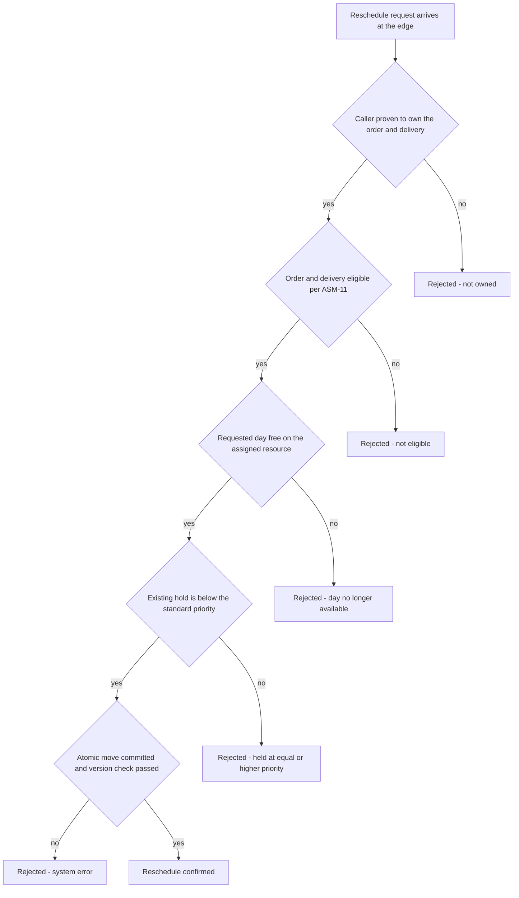

# ADR-030: Reschedule message names, routing keys and the five rejection classes are fixed as contracts, asserted end to end

| | |
| --- | --- |
| **Status** | Proposed |
| **Date** | 2026-10-03 |
| **ADR id** | `ADR-030` |
| **Backlog candidate** | None. `adr-candidates.md` runs to `ADR-CANDIDATE-020` and records no candidate for a rejection vocabulary |
| **Category / Impact** | Integration & Contracts / high |
| **Supersedes / Superseded by** | — (applies `ADR-001`, `ADR-003` and `ADR-013`; supersedes nothing) |
| **Deciders** | Unassigned — no `CODEOWNERS`, contributing guide or team metadata exists in any of the fourteen clones (`ADR-021` B1, `risk-constraint-gap-register.md` `G-01`) |
| **Base ref of all cited source** | `feature/14830/aidlc` |
| **Source** | `DO2` — *Customer Delivery Reschedule Confirmation & Slot Safe-Move*, work item **14830**, `intents/14830.md`. A reschedule either moves the day or is refused for a reason the customer can act on |
| **Non-functional requirements** | `NFR-14` (a rejected reschedule returns a specific, actionable reason, not a generic failure), `NFR-15` (message, routing-key and field naming follows the platform convention) |
| **Related** | `ADR-001` (service-owned exchanges), `ADR-003` (convention-based message naming and its absent build-time check), `ADR-013` (subscription and handler wiring), `ADR-023` (error and response shape), `ADR-024` (the move that produces these outcomes), `ADR-029` (the not-owned rejection) |

## Notation

| Symbol | Meaning |
| --- | --- |
| ✅ | Confirmed current behaviour — observed in source at the cited path and line range |
| 🎯 | Target state — intended design, not in production today |
| ❓ | Needs validation — assumed or inferred, not observed in source |
| `[INFERRED]` | Conclusion drawn from observed evidence rather than stated by it |

## Contents

1. [Context](#1-context)
2. [Decision Drivers](#2-decision-drivers)
3. [Architecture Fit Evaluation](#3-architecture-fit-evaluation)
4. [Options Considered](#4-options-considered)
5. [Decision](#5-decision)
6. [Consequences](#6-consequences)
7. [Compliance Considerations](#7-compliance-considerations)
8. [Non-Functional Requirements & Testing](#8-non-functional-requirements--testing)
9. [Relationship to the implementation pattern catalog](#9-relationship-to-the-implementation-pattern-catalog)
10. [Evidence](#10-evidence)
11. [Follow-Up Actions](#11-follow-up-actions)
12. [Assumptions, Blockers & Open Questions](#assumptions-blockers--open-questions)

---

## 1. Context

A reschedule can fail for five genuinely different reasons, and a customer needs a different thing
from each one. The platform's current error vocabulary cannot express any of them.

**Every CAP-09 error is HTTP 400, and the reason field carries the exception message** ✅
(`deliveries-service.md` §3.23). A customer client cannot distinguish "that day just filled up" from
"your order was already completed" from "the database is down", because all three arrive as the same
status with a free-text string shaped by whatever exception happened to be thrown. That string is
also an internal detail leaking to an external caller.

**Message names are matched by convention with nothing checking them.** `ADR-003` records that
compatibility rests on naming convention and that there is no build-time signal when a publisher and
a consumer disagree. The platform already has a worked example: `GAP-6` records a routing-key and
queue-name divergence where the two sides use different casing, and the only symptom is that messages
are never delivered. Nothing fails. Nothing logs. The feature simply does not work.

**The release leg has form today.** CAP-04's messages are `reserve_resource`,
`release_resource_reservation`, `resource_reserved`, `reservation_canceled`; CAP-09's are
`start_delivery`, `complete_delivery`, `fail_delivery`, `add_delivery_registration`,
`delivery_started`, `delivery_completed`, `delivery_failed`, `order_for_delivery_not_found` ✅. The
convention is clear — snake_case, commands imperative, events past tense — and `DO2` adds to both
sets.

`NFR-14` asks for a specific actionable reason. That is a contract decision, and this record makes
it one rather than leaving it to whatever each handler throws.

## 2. Decision Drivers

| # | Driver | Where it comes from |
|---|--------|---------------------|
| D1 | A rejected reschedule must tell the customer what to do next | `NFR-14` |
| D2 | Names must follow the established platform convention, and be asserted, because nothing checks them | `NFR-15`, `ADR-003`, `GAP-6` |
| D3 | Internal exception text must not reach an external caller | `deliveries-service.md` §3.23, `ADR-021` |
| D4 | A service publishes only to its own exchange | `ADR-001` C1 |
| D5 | The five outcomes come from decisions already made, not from new design | `ADR-024`, `ADR-029`, `ASM-11`, `ASM-14` |

## 3. Architecture Fit Evaluation

This record carries no fit verdict of its own; it is the contract surface of the verdicts that govern
`ADR-024`, `ADR-026` and `ADR-029`. The relevant conclusion from those verdicts is that **no new
service, bounded context or runtime component is required**, so every name fixed here belongs to an
existing exchange owned by an existing service.

| Dimension | Verdict | Consequence for this record |
|-----------|---------|-----------------------------|
| Exchange ownership | Unchanged | CAP-04's new messages go on CAP-04's exchange, CAP-09's on CAP-09's. No shared or cross-published exchange |
| Edge exposure | CAP-02 `configuration`, **GOVERNED** | The rejection codes surface through the existing gateway write mode per `ASM-18`. No new edge mechanism |
| Compatibility mechanism | `ADR-003`, convention only | Rule 5's end-to-end assertion is the compensating control, because the architecture provides none |

## 4. Options Considered

### Option A — fix a closed rejection vocabulary and assert names end to end *(chosen)*

Five named rejection classes, a stable code per class, and tests that assert publisher and consumer
agree on every new name.

- **For.** `NFR-14` becomes verifiable rather than aspirational. The `GAP-6` failure mode is caught by
  a test instead of by a customer. Clients can branch on a code without parsing prose.
- **Against.** A closed vocabulary is a contract: adding a sixth class later is a contract change, and
  clients that branch exhaustively must handle an unknown code. Rule 6 addresses that.

### Option B — keep the current shape and improve the exception messages

**Rejected.** It leaves every outcome as HTTP 400 with internal text ✅, so clients must string-match
on exception prose to tell a retryable rejection from a permanent one. That is a contract in the
worst possible form — undeclared, untested, and changing whenever someone rewords a message.

### Option C — map each rejection to a distinct HTTP status code and nothing else

**Rejected.** Three of the five classes are legitimately the same status, and a status code cannot
distinguish "day no longer available" from "held at equal or higher priority" — two outcomes with
different advice for the customer. A code in the body alongside an appropriate status is what
`ADR-023` already establishes.

### Option D — define the vocabulary in a shared contracts package

**Rejected.** `ADR-002` records that the platform has no shared library and has decided against one.
The codes are therefore declared per service and asserted across the boundary by Rule 5, which is the
same trade the platform has already made everywhere else.

## 5. Decision

**The reschedule exposes exactly five rejection classes, each with a stable machine-readable code and
a customer-safe message; new message names follow the platform's existing convention; and every new
publisher-to-consumer name pair is asserted by a test.** Six rules follow.

**Rule 1 — five rejection classes, and only five.**

| Class | What happened | What the customer should do | Retryable |
|-------|---------------|-----------------------------|-----------|
| `day no longer available` | The requested day has no free capacity on the delivery's resource | Pick another day from the offered list | Yes, with a different day |
| `held at equal or higher priority` | The day exists but is held by a reservation this request cannot displace — `ASM-14` fixes customer reschedules at the standard non-expropriating priority | Pick another day | Yes, with a different day |
| `not eligible` | The order or delivery fails `ASM-11` — completed, canceled, failed, or the date is not in the future | Nothing. The delivery can no longer be rescheduled | No |
| `not owned` | The caller is not the owner of the order or delivery, or is not authenticated | Nothing actionable is disclosed — see `ADR-029` Rule 7 | No |
| `system error` | Anything else, including a write conflict exhausting `ADR-028` Rule 6's single retry | Try again shortly | Yes, unchanged |

**Rule 2 — the code is stable, the message is not.** Clients branch on the code. The human-readable
message may be reworded or localized at any time and carries no contract weight. Nothing in any
client may parse the message.

**Rule 3 — no internal detail crosses the boundary.** No exception type, no stack frame, no store
identifier, no other customer's data. In particular `held at equal or higher priority` must not
reveal who holds it or at what priority — that is another party's information. The internal detail is
logged under the correlation identifier instead.

**Rule 4 — new message names follow the existing convention exactly.** snake_case, commands
imperative, events past tense, matching the established CAP-04 and CAP-09 sets ✅. The routing key and
the queue binding use the **same literal string**, written once and referenced, never retyped on each
side — `GAP-6` is a divergence that cost nothing to introduce and is invisible once introduced.

**Rule 5 — every new name pair is asserted across the boundary.** One test per new message asserts
that the string the publisher emits is the string the consumer binds. `ADR-003` records that the
architecture provides no build-time check, so this test is the only control that exists. A test that
checks each side against its own constant proves nothing and does not satisfy this rule.

**Rule 6 — an unrecognized code is handled as a system error by every client.** The vocabulary is
closed today and may grow. A client meeting an unknown code treats it as retryable-unknown and
surfaces a generic message, rather than failing to render a response at all.

### 5.1 Outcome selection

## 6. Consequences

### 6.1 Positive

- `NFR-14` becomes testable. Each class has a named code and a test that produces it.
- The customer-facing client can offer the right next step — a different day, or no step at all —
  instead of showing one generic failure for five different situations.
- Rule 5 gives the platform its first assertion against the `GAP-6` class of defect, on the new names
  at least.
- Internal exception text stops being part of the external contract on the new paths ✅.

### 6.2 Negative

- **The existing CAP-09 error behaviour is unchanged.** Every pre-existing route still returns HTTP
  400 with the exception message ✅. Two error shapes now coexist in one service. This record governs
  the new paths; converging the old ones is `FA3`, and the inconsistency is real until then.
- **A closed vocabulary is a contract to maintain.** A sixth class is a client-visible change. Rule 6
  limits the damage to a degraded message rather than a broken client.
- **Rule 5's assertion covers the new names only.** Existing divergences, including `GAP-6` itself,
  stay open. `R-24` carries them.
- **`not owned` and `not found` are deliberately indistinguishable** (`ADR-029` Rule 7), which means
  a customer who mistypes an identifier is told nothing useful. That is the correct trade and it is
  still a support cost.

### 6.3 Neutral and follow-on

- The codes surface through the existing gateway write mode per `ASM-18`; no gateway mechanism changes.
- `day no longer available` and `held at equal or higher priority` are distinct classes even though a
  customer's next step is the same, because operators need to tell capacity exhaustion from priority
  displacement when diagnosing a pattern of complaints.

## 7. Compliance Considerations

| Obligation | Source | How this record complies |
|------------|--------|--------------------------|
| A service publishes only to its own exchange | `ADR-001` C1 | §3; no cross-published exchange |
| Message names follow the convention; no build-time check exists | `ADR-003`, `NFR-15` | Rules 4 and 5 |
| Routing key and queue binding must not diverge | `GAP-6` | Rule 4's single literal, asserted by `N6` |
| Subscriptions and handlers are wired at every registration point | `ADR-013` | `ADR-026` Rule 3 |
| Error responses follow the platform's response shape | `ADR-023` | Rules 1 and 2 |
| No internal detail, credential or other party's data in an external response | `ADR-021`, `NFR-11` | Rule 3, verified by `N4` and `N5` |
| No new edge mechanism; new routes inherit the existing write mode | `ASM-18` | §6.3 |
| No shared contracts library | `ADR-002` | Option D rejected; Rule 5 compensates |

## 8. Non-Functional Requirements & Testing

| # | Requirement | NFR | How it is verified |
|---|-------------|-----|--------------------|
| `N1` | Each of the five classes is produced by a test that creates its precondition | `NFR-14` | Five tests, five distinct codes. No shared code across two classes |
| `N2` | A full day returns `day no longer available`, and a day held above the request's priority returns `held at equal or higher priority` | `NFR-14` | Build both states explicitly. Assert the two codes differ |
| `N3` | A completed or canceled order returns `not eligible`, and nothing is written | `ASM-11` | Assert the code and assert no reservation call was made |
| `N4` | No rejection response contains an exception type, stack frame or store identifier | Rule 3 | Assert across all five responses |
| `N5` | The `held at equal or higher priority` response discloses nothing about the holder | Rule 3 | Assert the response contains no other party's identifier |
| `N6` | For every new message, the publisher's routing key and the consumer's binding are the same string | `NFR-15`, `GAP-6` | One cross-boundary assertion per message. Each-side-against-its-own-constant does not count |
| `N7` | Every new message name matches the platform's snake_case command and past-tense event convention | `NFR-15`, Rule 4 | Assert the names against the convention, alongside the existing sets |
| `N8` | A client meeting an unrecognized code renders a generic retryable message and does not fail | Rule 6 | Feed a synthetic unknown code to the client. Assert it renders |
| `N9` | A write conflict that exhausts `ADR-028` Rule 6's retry surfaces as `system error`, not as a successful reschedule | `ADR-028`, `NFR-14` | Force a persistent conflict. Assert the code and assert no reservation moved |

## 9. Relationship to the implementation pattern catalog

No new pattern. Two existing entries need the rules this record fixes:

- `patterns/messaging/service-owned-exchange-and-convention-named-messages.md` should carry Rule 4's
  single-literal requirement and Rule 5's cross-boundary assertion, since `GAP-6` demonstrates the
  cost of the convention being honoured on only one side.
- `patterns/api/dispatcher-bound-cqrs-endpoints.md` should carry Rules 1 to 3, because the
  everything-is-a-400-with-the-exception-message shape ✅ is currently the de-facto pattern and will
  keep being copied until something records otherwise.

## 10. Evidence

| # | Claim | Source |
|---|-------|--------|
| E1 | Every CAP-09 error is HTTP 400 and the reason carries the exception message | `deliveries-service.md` §3.23 |
| E2 | CAP-09's message set is snake_case, commands imperative and events past tense | `start_delivery`, `complete_delivery`, `fail_delivery`, `add_delivery_registration`, `delivery_started`, `delivery_completed`, `delivery_failed`, `order_for_delivery_not_found` |
| E3 | CAP-04's message set follows the same convention | `reserve_resource`, `release_resource_reservation`, `resource_reserved`, `reservation_canceled` |
| E4 | Message compatibility rests on naming convention with no build-time signal | `ADR-003` |
| E5 | A routing-key and queue-name divergence already exists on the platform, and its only symptom is undelivered messages | Catalog `GAP-6` |
| E6 | Reservation displacement is decided by priority | `availability-service.md` §3.8; `ASM-14` |
| E7 | The platform has no shared library and has decided against one | `ADR-002` |
| E8 | The platform has an established error and response shape | `ADR-023` |

### 10.1 Documentation-versus-code conflicts

None found for this record.

## 11. Follow-Up Actions

| # | Action | Owner | By |
|---|--------|-------|-----|
| `FA1` | **[handled later by HLS]** Fix the five literal code strings and the customer-facing message for each, and record them where both the service and the client read them from one source | `DO2` implementer with the product owner | During `DO2` high-level design |
| `FA2` | **[handled later by HLS]** Fix the names of the new reschedule command and event on each exchange, following Rule 4, and record the single literal each side references | `DO2` implementer | During `DO2` high-level design |
| `FA3` | **[ACTION NOW]** Decide whether CAP-09's existing exception-message-as-reason behaviour is corrected in this increment or scheduled separately. It leaks internal detail on live routes today and this record does not change it | Platform owner with the platform architect | Before `DO2` ships |
| `FA4` | **[handled later by DevOps]** Add `N6`'s cross-boundary name assertion to the pipelines for CAP-04 and CAP-09. It is the only control against `GAP-6` recurring, and `ADR-018` records that CAP-04's pipeline does not currently run tests at all (`R-25`) | Platform owner | Before `DO2` reaches a shared environment |

## Assumptions, Blockers & Open Questions

### Assumptions

- **A1 ❓** CAP-04 can distinguish "no capacity on that day" from "held at a priority that cannot be
  displaced" at the point of refusal. The reservation model is priority-based ✅ and the two states
  are structurally different, but the current `ReleaseReservation` path returns silently on a
  non-match ✅ rather than reporting why. If the distinction cannot be surfaced without a CAP-04
  contract change, `FA2` carries it.
- **A2 `[INFERRED]`** The customer-facing client branches on a code rather than on prose, because no
  client currently exists for this flow and Rule 2 is being established before one is written. Any
  existing client that parses prose would be relying on behaviour no record has ever guaranteed.

### Blockers

- None.

### Open Questions

- **Q1** Should `day no longer available` include the next available day inline, saving the customer a
  second call? `ADR-024` already produces a bounded ascending list, so the data is at hand; it is a
  payload-shape decision with a privacy question attached. Product owner with the platform architect,
  after the first release.
