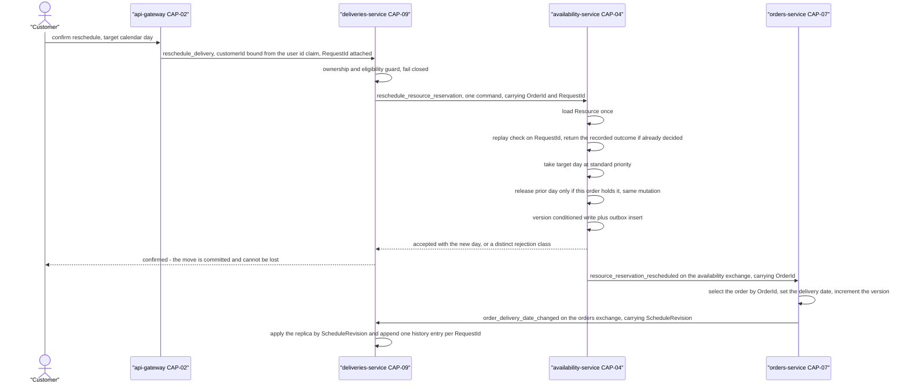

# ADR-024: A delivery reschedule is one atomic same-resource day move inside the Resource aggregate, and alternative days are a bounded ascending read

| | |
| --- | --- |
| **Status** | Proposed |
| **Date** | 2026-10-03 |
| **ADR id** | `ADR-024` |
| **Backlog candidate** | None. `adr-candidates.md` runs to `ADR-CANDIDATE-020` and surfaces no delivery-scheduling candidate; this record is authored directly from the validated intent |
| **Category / Impact** | Domain & Integration / high |
| **Supersedes / Superseded by** | — (supersedes nothing; the platform has never recorded a schedule-change position) |
| **Deciders** | Unassigned — no `CODEOWNERS`, contributing guide or team metadata exists in any of the fourteen clones (`ADR-021` B1, `risk-constraint-gap-register.md` `G-01`) |
| **Base ref of all cited source** | `feature/14830/aidlc` |
| **Source** | `DO2` — *Customer Delivery Reschedule Confirmation & Slot Safe-Move*, and `DO1` — *Eligible Delivery Schedule & Alternative-Day View*, work item **14830**, `intents/14830.md`. Catalog surfaces no delivery-scheduling or reschedule capability of any kind; the nearest named capabilities are CAP-04's *Reserve a resource for a date* and *Release a reservation* |
| **Non-functional requirements** | `NFR-3` (no double-booked slot), `NFR-5` (previous slot released only after the new one is reserved), `NFR-6` (no silent truncation of a submitted slot value), `NFR-19` (bounded alternative-day read), `NFR-14` (distinct rejection reasons), `NFR-17` (additive persistence) |
| **Resolved decision applied** | `AD-1` option **A**, chosen by human, confidence high. Binding and settled — not re-opened here |
| **Related** | `ADR-011` (the one orchestrated process, which this record deliberately does not join), `ADR-010` (the bounded synchronous read rule this query is designed to), `ADR-008` (hand-mapped documents with no migration tooling), `ADR-028` (the version-conditioned write this operation depends on), `ADR-029` (the identity every message of this chain carries, and the ownership check Rule 8's fields make possible), `ADR-030` (the message and rejection-code contracts) |

## Notation

| Symbol | Meaning |
| --- | --- |
| ✅ | Confirmed current behaviour — observed in source at the cited path and line range |
| 🎯 | Target state — intended design, not in production today |
| ❓ | Needs validation — assumed or inferred, not observed in source |
| `[INFERRED]` | Conclusion drawn from observed evidence rather than stated by it |

## Contents

1. [Context](#1-context)
2. [Decision Drivers](#2-decision-drivers)
3. [Architecture Fit Evaluation](#3-architecture-fit-evaluation)
4. [Options Considered](#4-options-considered)
5. [Decision](#5-decision)
6. [Consequences](#6-consequences)
7. [Compliance Considerations](#7-compliance-considerations)
8. [Non-Functional Requirements & Testing](#8-non-functional-requirements--testing)
9. [Relationship to the implementation pattern catalog](#9-relationship-to-the-implementation-pattern-catalog)
10. [Evidence](#10-evidence)
11. [Follow-Up Actions](#11-follow-up-actions)
12. [Assumptions, Blockers & Open Questions](#assumptions-blockers--open-questions)

---

## 1. Context

CAP-04 Resource Availability & Reservation owns a single aggregate. A `Resource` is an id, a
non-empty set of tags and a set of `Reservation` value objects ✅
(`Pacco.Services.Availability/.../Core/Entities/Resource.cs:10-35`). A `Reservation` is a
`(DateTime, Priority)` pair whose `GetHashCode` hashes on the **date alone** while `Equals` compares
date *and* priority ✅ (`Core/ValueObjects/Reservation.cs`), which is what makes the backing
`HashSet<Reservation>` behave as one bucket per calendar day. Collisions are resolved by integer
priority: a strictly higher priority evicts the incumbent, an equal or lower priority is refused with
`cannot_expropriate_reservation` ✅ (`Resource.cs:57-80`).

Two commands mutate that set today, and they are independent of each other: `ReserveResource`
(`ResourceId`, `DateTime`, `Priority`, `CustomerId`) and `ReleaseResourceReservation`
(`ResourceId`, `DateTime`) ✅. Each is routed separately at the edge
(`POST` and `DELETE /availability/resources/{resourceId}/reservations/{dateTime}`) and each is a
separate aggregate load, mutation and whole-document write.

`DO2` requires something the platform has never expressed: **move a held day to another day on the
same resource, releasing the old day only once the new day is held**. Expressed as the two existing
commands, that is a two-step operation with a window in which the customer holds both days, or — if
the second step is lost — neither the one they wanted nor the one they had.

The read half is similarly absent. CAP-04 exposes exactly one point-read of a resource,
`GET /resources/{resourceId}` returning `ResourceDto` ✅, and no day-availability query of any kind.
`DO1` needs a list of bookable alternative days, and `ADR-010`'s Constraint C10 forbids a synchronous
cross-service call that returns an unbounded collection.

### 1.1 What this record does *not* cover

It does not decide who may issue the move (`ADR-029`), what the message is called or which exchange
carries it (`ADR-030`), how the write is made atomic against the outbox (`ADR-028`), or where the
authoritative delivery date lives (`ADR-025` and `ADR-026`; `ASM-10` places it on CAP-07). It does
not introduce intra-day time windows — `ASM-9` defers them — and it does not permit a change of
resource: `ASM-15` fixes the bookable set as the delivery's currently assigned resource.

## 2. Decision Drivers

| # | Driver | Where it comes from |
|---|--------|---------------------|
| D1 | A slot must never be double-booked by concurrent confirmations, and availability must be revalidated at confirmation rather than trusted from a previously loaded list | `NFR-3`, `DO2` target |
| D2 | A failed reschedule must leave both reservations exactly as they were — zero orphaned, zero double-held | `NFR-5`, `ASM-4` |
| D3 | The platform has exactly one orchestrated process — order creation — and adding a second is a recorded architectural change in its own right | `ADR-011` Constraint *Exactly one process on the platform is orchestrated* |
| D4 | A synchronous cross-service read must never return an unbounded collection | `ADR-010` Constraint C10, *Decision: Forbid collection read* |
| D5 | The forward horizon is settled: the next 14 eligible calendar days, ascending | `ASM-19`, `OQ-4` resolved |
| D6 | A customer reschedule reserves at one fixed standard priority, equal for every customer, and is rejected on collision with first-come-wins | `ASM-14`, *Input required recap* answer 1 |
| D7 | A submitted slot value must never be silently truncated or reinterpreted | `NFR-6` |
| D8 | Persistence changes are additive only — no renames, no removals, append-only enum ordinals | `ADR-008`, `NFR-17` |

## 3. Architecture Fit Evaluation

The upstream architecture-validation stage returned two fit verdicts covering this record, both
`can_extend_existing_component: true`, and both are binding here.

| Dimension | Verdict | Consequence for this record |
|-----------|---------|-----------------------------|
| Day-move operation | `evolution_type: service_extension`, owner **CAP-04 Resource Availability & Reservation** — the Resource aggregate already owns reserve, release, integer-priority expropriation and cascade-on-delete | The operation is added to the aggregate that already holds the state. No new owner is proposed |
| Bounded alternative-day query | `evolution_type: component_extension`, owner **CAP-04**, confidence high | An additional query handler and read route on the capability that already owns reservation state |
| New deployable service | **Not required** | None is proposed |
| New bounded context | **Not required** | None is proposed |
| New runtime component | **Not required** | None is proposed |

Because both the prior and the target calendar day live inside the **same** `Resource` aggregate, the
reservation leg of a reschedule is a single-aggregate operation. That is the architectural fact this
record turns into a rule: it needs no distributed transaction, no compensating command and no second
orchestrated process, which is why `ADR-011`'s single-saga constraint survives this feature intact.

## 4. Options Considered

### Option A — one command, one aggregate, one write *(chosen; `AD-1` option A, chosen by human)*

A single `RescheduleResourceReservation` command loads the resource once, takes the new day and
releases the old day inside one aggregate mutation, and writes once.

- **For.** The invariant "never both, never neither" becomes a property of the aggregate rather than
  of a coordinator. Concurrency control is the aggregate's existing version check (`ADR-028`). No new
  process manager, so `ADR-011` is untouched and its unresolved saga-durability and gateway-route
  blockers are not reopened.
- **Against.** CAP-04 acquires a domain operation richer than reserve/release, and the platform ends
  up with two write vocabularies against the same reservation set.

### Option B — sequence the two existing commands from a coordinator

A new process manager issues `ReserveResource`, waits for `resource_reserved`, then issues
`ReleaseResourceReservation`, compensating on failure.

**Rejected.** It contradicts `ADR-011`'s recorded Constraint that exactly one process on the platform
is orchestrated, and it reopens that record's two unresolved blockers — saga state durability (no
persistence is configured, the default is in-memory) and the saga's missing gateway entry point. It
also buys nothing: the two legs are on the *same* aggregate, so the distributed-transaction problem a
coordinator exists to solve does not arise here.

### Option C — let the browser sequence reserve then release

**Rejected.** It places a consistency rule on a caller the platform does not control. A closed tab
between the two calls orphans the old reservation permanently, and the intent's own constraint is
explicit that ownership and eligibility are validated by backend services and not only by the UI.

### Option D — serve alternative days from the existing `GET /resources/{resourceId}`

**Rejected on two counts.** The resource document carries the resource's entire reservation history
with no bound ✅ (`Resource.cs:12-25`; nothing constrains reservation count), so the response is
exactly the unbounded collection `ADR-010` C10 forbids. It also discloses every other customer's
held days to the caller, which no current route does.

### Option E — a new bounded day-availability read on CAP-04 *(chosen for the read half)*

A query that returns **days**, not reservations: at most the next 14 eligible calendar days on one
named resource, ascending.

## 5. Decision

**A customer-initiated delivery reschedule is expressed as one atomic same-resource day move on the
`Resource` aggregate, and alternative days are served by a new bounded, ascending, days-only read on
the same capability.** Eight rules follow and all of them are binding.

**Rule 1 — one command, one aggregate, one write.** The move is the single command
`RescheduleResourceReservation` (`ADR-030` §5.2 `M2`), carrying the resource id, the currently held
day, the target day, the owning customer id, the **order id** and the **request id**, together with
the standard reschedule priority. Its handler loads the `Resource` once, mutates it once and writes
it once under the version-conditioned update of `ADR-028`. There is no second command, no second
write and no coordinator.

This is the **whole** mechanism. The reschedule does not issue `ReserveResource`, does not issue
`ReleaseResourceReservation`, and does not depend on either of those commands being changed.
Hardening the standalone `ReleaseResourceReservation` route — which accepts a release today without
proving the caller holds the reservation ✅ — is a real and separate platform defect; it is recorded
as such in `ADR-029` `FA4` and **is not** part of this flow. Nothing in `DO2` should be blocked on
it, and nothing in `DO2` should be built on it.

**Rule 2 — take before release, inside the same mutation.** The aggregate takes the target day
first. If the target day is held at an equal or higher priority, the aggregate raises
`cannot_expropriate_reservation` and **is not mutated at all** — the prior day stays held, the
version is not incremented and nothing is published. Release of the prior day happens only on the
success path, in the same mutation as the take.

**Rule 3 — one standard priority, never an expropriating one.** A customer reschedule reserves at
the single standard customer-reschedule priority, identical for every customer. It therefore cannot
evict an incumbent, and an ordinary customer booking cannot evict it. First-come wins on collision.

**Rule 4 — release only the reservation this order is recorded as holding.** The prior day is
released only when a reservation exists on the expected resource, on the expected day, **and
recorded as held by the order named in the command**. `ReleaseReservation` returns silently today
when no match is found ✅ (`Resource.cs:82-90`), so the handler must establish the precondition
itself rather than relying on the release call to report it.

The ownership term is what makes this rule mean anything. Day occupancy alone cannot distinguish the
three states that matter:

| Prior day state | What it means | Outcome |
|-----------------|---------------|---------|
| A reservation held by this order | The normal case | Take the new day, release this one, both in the same mutation |
| No reservation at all | The hold lapsed or was cancelled out of band | The move still succeeds and records that nothing was released — `ASM-4`, verified by `N4` |
| A reservation held by **another** party | This delivery's schedule was already lost to someone else | **Refuse.** `ADR-030`'s `not eligible` class, with the schedule-lost state reported by `ADR-027` Rule 5. Releasing it would cancel a stranger's booking on this caller's say-so |

The third row is unreachable without Rule 8's ownership field; before it exists the second and third
rows are the same observation. That is why Rule 8 is binding rather than advisory.

**Rule 5 — reject intra-day precision, never truncate it.** A submitted day whose time component is
not midnight is **refused** with a distinct rejection code. The reservation store cannot hold a time
of day: `AsDaysSinceEpoch` discards it on write ✅
(`Infrastructure/Mongo/Documents/Extensions.cs:40-44`), and CAP-07's `SetDeliveryDate` truncates with
`.Date` without telling the caller ✅ (`Orders/.../Core/Entities/Order.cs:80-83`). `ASM-9` fixes a
bookable slot as a calendar day for this release, which makes refusal — not silent normalisation —
the correct boundary behaviour.

**Rule 6 — the alternative-day read is bounded, ascending and days-only.** It names one resource,
returns at most the next **14** eligible calendar days in ascending date order, and returns calendar
days — not reservations, not priorities, not other customers' holdings. The bound is part of the
contract, not a default the caller may raise.

**Rule 7 — the resource never changes.** Only the calendar day moves. No cross-resource search, no
resource reassignment and no re-tagging scheme may be introduced under this record. Resource tags are
immutable for a resource's life — changing them requires deleting and recreating the resource, which
changes its id and cancels every reservation it holds ✅ (`Resource.cs:92-100`, which raises a
`ReservationCanceled` for every reservation then `ResourceDeleted`).

**Rule 8 — a reservation records who holds it, and collision stays a calendar-day question.** The
`Reservation` value object gains `OrderId` and `CustomerId`, carried through `ReserveResource`, the
move command, the move outcome event and the Mongo document. Today it is a `(DateTime, Priority)`
pair ✅ and `ReservationDto` exposes only those two ✅, so no reservation on this platform records who
it belongs to and no caller can ask. Three things in this patch depend on the answer — Rule 4's
refusal, `ADR-027`'s revalidation, and `ADR-030` `M3`'s `OrderId` — and none of them can be built on
day occupancy.

Two constraints on how the field is added, and they are not optional:

1. **Collision equality does not change.** Two reservations collide when they fall on the same
   calendar day on the same resource, exactly as today. `OrderId` and `CustomerId` are carried data,
   never part of the key, the hash or the collision test. Adding them to equality would let the same
   day be held twice by two different orders — the one invariant this whole record exists to protect.
   Today's equality is date **plus priority** ✅, which already has this shape of hazard; Rule 8 must
   not widen it. `N11` asserts it directly.
2. **The field is additive and nullable.** `ADR-008` records hand-mapped documents with no migration
   tooling, so every reservation written before this change has no owner. A null owner is read as
   *unknown*, never as *mine*: Rule 4's third row applies to it, which fails closed. `ADR-026` §6.3
   carries the backfill that removes the unknowns, and `FA5` carries the CAP-04 half of it.

### 5.1 The move, as a flow

**Where the customer's answer comes from, and what it promises.** The confirmation is returned at the
point CAP-04 commits — step 10, before the two event legs run. `ADR-026` §5.2 defines the three
states this flow passes through and fixes *confirmed* as the completion point for the customer, the
UI and the acceptance tests. What the customer is told at that moment is true and durable: the day is
held, the outbox holds the event, and no later step can take the day away. What has **not** happened
yet is the Order's authoritative date and the delivery replica catching up, and the read path
(`ADR-027`) reports that lag rather than hiding it.

The two legs after the aggregate write are choreographed, not orchestrated — each consumer acts on an
event from the exchange its publisher owns. That is the default `ADR-001` records, and it is why no
second saga appears in this flow. Both legs carry `OrderId`, so CAP-07 selects the order it must
update rather than inferring it from `(VehicleId, DeliveryDate)`; today's `ResourceReserved` carries
no `OrderId` at all ✅, which is why `ADR-030` `M3` is a new event rather than a reused one.

## 6. Consequences

### 6.1 Positive

- The "never both, never neither" guarantee is structural. It holds because the two days are in one
  aggregate, not because a coordinator remembered to compensate.
- `ADR-011`'s single-orchestrated-process constraint survives the feature untouched, and its two
  unresolved blockers stay closed rather than being reopened under schedule pressure.
- Revalidation at confirmation is automatic: the handler reads the aggregate's current state, so a
  day that went away since the customer's list was loaded is refused by the same code path that
  refuses any collision. There is no separate "recheck" step that could be forgotten.
- The alternative-day read is bounded by construction, so `ADR-010` C10 is satisfied at design time
  rather than by a later review.

### 6.2 Negative

- **CAP-04 gains a second write vocabulary for the same state.** `ReserveResource`,
  `ReleaseResourceReservation` and the new move all mutate the same reservation set, and a future
  change to the collision rule must be applied to the move as well. This is the direct cost of
  Option A over Option B and it is accepted.
- **The alternative-day computation reads an unbounded array.** Nothing constrains how many
  reservations a resource accumulates ✅, and Mongo's 16 MB document limit is the only ceiling. The
  read is bounded in its *output*, not in the work it does to produce that output. On a long-lived
  resource the cost grows with the resource's history.
- **Rule 5 makes a previously accepted input an error.** Any caller that today posts a reservation
  with a time component gets a 400 on the new route where the existing route would have accepted and
  quietly discarded it. This is intended; it is recorded here so it is not discovered as a
  regression.
- **Days-since-`0001-01-01` encoding stays.** The stored integer, the in-memory `DateTime` and the
  value published on the bus can be three different representations of the same reservation ✅. This
  record does not fix that; it avoids depending on it by comparing whole days everywhere.
- **Rule 8 changes the reservation document, which the first revision of this record said it would
  not.** Two nullable fields are added to an embedded document in a store with no migration tooling ✅
  (`ADR-008`). Every reservation written before the change reads as owner-unknown, and Rule 4 refuses
  to move those — which is correct and is also a live customer impact until the `FA5` backfill runs.
  The alternative was leaving `ADR-027`'s revalidation unable to tell *held by me* from *held by
  someone else*, which is not an alternative at all.
- **CAP-04 now stores a correlation to an aggregate it does not own.** `OrderId` on a reservation is
  a cross-context identifier with no referential integrity, the same trade `ADR-009` already made for
  the reference replica. CAP-04 must never read or interpret it beyond equality — it is a tag, not a
  relationship — and nothing in CAP-04 may call CAP-07 to resolve it.

### 6.3 Neutral and follow-on

- The standard reschedule priority is an integer whose value nobody has recorded. There is no enum,
  no constant and no documented scale anywhere in the repository ✅. That is **`G-12`**, and it blocks
  implementation rather than this decision. The first revision of this record cited `G-07` for it;
  `G-07` is a different gap entirely — `deliveries-service` accepting an `OrderId` with no validating
  call — and the two were conflated. `G-12` is opened in
  [`../architecture-inventory/risk-constraint-gap-register.md`](../architecture-inventory/risk-constraint-gap-register.md)
  §4 for the priority alone, and `FA1` is its action.
- The move command's name, routing key, exchange and full payload are fixed by `ADR-030` §5.2 `M2`,
  not here. Rule 1 lists the fields it must carry; `ADR-030` is the contract.

## 7. Compliance Considerations

| Obligation | Source | How this record complies |
|------------|--------|--------------------------|
| A synchronous call must not return an unbounded collection | `ADR-010` C10 | Rule 6 — at most 14 days, days-only |
| Exactly one process on the platform is orchestrated | `ADR-011` | Option B rejected; the move is a single-aggregate operation and adds no process manager |
| A service publishes only to its own exchange | `ADR-001` C1 | The move publishes on the `availability` exchange, which CAP-04 owns |
| Persistence changes are additive, enum ordinals append-only | `ADR-008`, `NFR-17` | Rule 8 adds two **nullable** fields to the embedded reservation document and changes no existing field, type or ordinal. No migration runs; absent values are read as unknown and fail closed |
| A caller may not learn another customer's holdings | `NFR-1` | Rule 8's owner fields are never returned by the alternative-day read (`N7`) and are returned by the revalidation read only to a caller proving that order (`ADR-027` Rule 1) |
| The runtime and toolkit baseline is not changed | `ADR-020`, `ADR-002`, `NFR-16` | No new package, no runtime change; the operation is ordinary aggregate code |
| Every rejection carries a distinct customer-readable reason | `NFR-14`, `ADR-023` | Rules 2 and 5 each raise their own code; the full five-class contract is `ADR-030` |
| No cancellation, payment, notification, or vehicle reassignment is introduced | `DO2` scope | Rule 7, and nothing in this record touches those paths |

## 8. Non-Functional Requirements & Testing

Every row is a pass/fail gate. `N4` is the exception noted in its own row.

| # | Requirement | NFR | How it is verified |
|---|-------------|-----|--------------------|
| `N1` | Two concurrent confirmations for the same target day on the same resource produce exactly one holder | `NFR-3` | Issue both against a slowed handler. Assert one success, one `cannot_expropriate_reservation`, and exactly one reservation for that day in the document |
| `N2` | A refused move leaves the prior reservation, the resource version and the published-event stream unchanged | `NFR-5` | Attempt a move onto a day held at equal priority. Assert the prior day is still held, `Version` is unchanged, and no event was enqueued in the outbox |
| `N3` | A successful move leaves exactly one reservation — the new day — and the prior day becomes bookable | `NFR-5`, `DO2` target | Move, then assert the old day is absent from the document and is offered by the alternative-day read |
| `N4` | A move whose prior day is not actually held still succeeds, and records that no release occurred | `ASM-4` | Remove the prior reservation out of band, then move. Assert success and a distinguishable "nothing released" outcome. **This verifies a recorded behaviour, not a prevented failure** |
| `N5` | A target day carrying a non-midnight time component is refused with its own code | `NFR-6` | Submit `T14:30`. Assert a 400 with the intra-day rejection code and **no** change to any reservation |
| `N6` | The alternative-day read never returns more than 14 days, and is ascending | `NFR-19` | Seed a resource with 400 free days ahead. Assert exactly 14 rows, ascending, and that no reservation detail appears in the payload |
| `N7` | The alternative-day read discloses no other customer's holdings | `NFR-1` | Reserve days for another customer. Assert those days are absent from the list and that no customer id appears in the response |
| `N8` | The reschedule reserves at the standard priority and never expropriates | `ASM-14` | Hold the target day at the standard priority as another customer, then move onto it. Assert refusal, not eviction |
| `N9` | Every one of these tests actually executes in the pipeline and fails the build | `NFR-18` | See `R-25` — CAP-04's suite is recorded as compiled and never run. This gate is not satisfied by writing the tests |
| `N10` | A move whose prior day is held by a **different** order is refused, and that reservation is left intact | Rule 4, `NFR-1` | Seed the prior day held by another order. Move. Assert `not eligible`, assert the other order's reservation is still present and unchanged, and assert the target day was not taken |
| `N11` | Two reservations for the same calendar day on the same resource remain impossible after `OrderId` and `CustomerId` are added | Rule 8.1, `NFR-3` | Attempt to reserve the same day for two different orders at the standard priority. Assert the second is refused. Assert the equality and hash of `Reservation` are unchanged by the new fields |
| `N12` | A reservation written before Rule 8 — with no recorded owner — is treated as not-mine, not as mine | Rule 8.2, `ADR-008` | Insert a reservation document with the owner fields absent. Move against it. Assert refusal, not a silent release |
| `N13` | A redelivered move command with a `RequestId` already decided returns the first outcome and mutates nothing | `NFR-7`, `ADR-028` Rule 8 | Deliver the same `M2` twice. Assert one reservation moved, one outcome, identical both times |
| `N14` | The move publishes `resource_reservation_rescheduled` carrying the `OrderId` from the command | `ADR-030` §5.2 `M3` | Assert the outbox row's payload, not only its routing key |

## 9. Relationship to the implementation pattern catalog

This record extends two existing catalog entries and proposes no new one.

- `patterns/domain/aggregate-buffered-domain-events.md` — the move buffers its events on the
  aggregate exactly as `AddReservation` and `ReleaseReservation` do today. Note the existing
  `Delete()` precedent: several buffered events, one version increment ✅.
- `patterns/integration/narrow-synchronous-point-read.md` — the alternative-day read is a *bounded
  list* rather than a point read, which is a widening of that pattern's recorded shape. It is
  admissible only because Rule 6 fixes the bound in the contract. Whoever maintains the catalog
  should record it as a distinct bounded-read variant rather than letting it be read as precedent for
  unbounded collection reads.

## 10. Evidence

| # | Claim | Source |
|---|-------|--------|
| E1 | A reservation is a `(DateTime, Priority)` struct whose hash is the date alone and whose equality is date plus priority | `Core/ValueObjects/Reservation.cs`; `component-internals/availability-service.md` §3.5 |
| E2 | Collisions resolve by strict priority; equal or lower raises `cannot_expropriate_reservation` | `Core/Entities/Resource.cs:57-80`; `availability-service.md` §3.6 |
| E3 | `ReleaseReservation` returns silently when the reservation does not exist | `Core/Entities/Resource.cs:82-90`; `availability-service.md` §3.1 invariant table, marked **SILENT** |
| E4 | Time of day is discarded on write and cannot be stored | `Infrastructure/Mongo/Documents/Extensions.cs:40-44`; `availability-service.md` §3.10 |
| E5 | CAP-07 truncates the delivery date with `.Date` and tells no one | `Orders/.../Core/Entities/Order.cs:80-83`; `component-internals/orders-service.md` §3.11 |
| E6 | The only existing resource read is the whole-resource point read | `GET /resources/{resourceId}` returning `ResourceDto`; `availability-service.md` §4.5 |
| E7 | Nothing bounds how many reservations a resource may hold | `availability-service.md` §3.1, *Failure modes* |
| E8 | Deleting a resource cancels every reservation it holds and changes its id | `Core/Entities/Resource.cs:92-100` |
| E9 | No reservation-priority scale is defined anywhere in the repository | `availability-service.md` §3.5, *Invariants*: "no enum, no constant, no documented scale" |
| E10 | `ReservationDto` exposes the reservation's date and priority and nothing else, so no API can report who holds a day | `availability-service.md` §4.5; `architecture-views.md` §5.1 |
| E11 | `ResourceReserved` carries `ResourceId`, `CustomerId` and `DateTime` and no `OrderId` | `availability-service.md`; `architecture-views.md` §5.1 |
| E12 | A reservation has no independent lifetime and cannot be addressed without its resource | `availability-service.md` §3.5; `architecture-views.md` §5.1 |
| E13 | `ReleaseResourceReservation` is accepted without the caller proving the reservation is theirs | `availability-service.md` §3.1 invariant table; `ADR-029` §1 |

### 10.1 Documentation-versus-code conflicts

None found for this record. The capability inventory, the component model and the source agree on the
reservation rule.

## 11. Follow-Up Actions

**Reading the `By` column.** Each entry carries a calendar date followed by the delivery milestone
that date is derived from. The dates come from the one work-item 14830 wave calendar in
[`../specs/14830/solution-design.md`](../specs/14830/solution-design.md) §5.1, so every record in
`ADR-024`…`ADR-030` resolves the same milestone to the same date. If the wave calendar moves, that
section is the single place to change and these dates move with it; the milestone is what binds.

| # | Action | Owner | By |
|---|--------|-------|-----|
| `FA1` | **[ACTION NOW]** Fix the integer value of the standard customer-reschedule priority and record it as a named constant with its scale. Nothing in the repository defines the scale, so implementation cannot start without it. Tracked as **`G-12`**, not `G-07` | Product owner with the platform architect | **2026-11-24** — before `DO2` high-level design starts |
| `FA2` | **[ACTION NOW]** Decide and record the behaviour when the alternative-day read is asked for a resource that does not exist. The existing point read returns 404 on null; the new read must not return an empty list that reads as "no days available" | Platform architect | **2026-10-24** — with `DO1` high-level design |
| `FA3` | **[handled later by HLS]** Size the alternative-day computation against a resource carrying several years of reservations, and record whether an index or a stored projection is needed | `DO1` implementer | **2026-11-07** — during `DO1` low-level design |
| `FA4` | **[ACTION NOW]** Make CAP-04's test suite execute in its pipeline and block image publication on failure, so `N1`–`N14` are gates rather than files (`R-25`, `INF-6`, `NFR-18`). Every gate in this record and in `ADR-027`, `ADR-028` and `ADR-030` that runs in CAP-04 is unenforced until this is done, so it is a **precondition for `DO2` implementation**, not a task timed against the first image | Owner of `Pacco.Services.Availability` — unassigned, see `G-01` | **2026-12-22** — with `DO2` low-level design, ahead of the **2027-01-16** first-image milestone |
| `FA5` | **[ACTION NOW]** Decide and record how existing reservations acquire Rule 8's owner fields: a backfill joining active orders to their held days, the fail-closed null reading for everything older than a cut-off date, or both. Until this is decided, every reservation predating `DO2` is unmovable by its own customer (`N12`, `R-29`). Pair it with the readiness metric in `ADR-026` `FA6` so the exposure is counted rather than assumed small | Platform owner with the product owner | **2026-12-08** — before `DO2` high-level design completes |
| `FA6` | **[handled later by HLS]** Record whether `ReserveResource` and the order-making saga populate Rule 8's owner fields from day one. The saga publishes `ReserveResource` with an **empty** `CorrelationContext.UserContext` ✅ (`GAP-13`), so the saga path may be unable to supply a customer id even where it can supply an order id | `DO2` implementer | **2026-12-22** — during `DO2` low-level design |

## Assumptions, Blockers & Open Questions

### Assumptions

- **A1 ❓** Convey's dispatcher binds a route value and a request body into one immutable command for
  the new move route the same way it does for the existing reservation routes. How it reconciles a
  route value with an immutable constructor parameter is not provable from this workspace — Convey
  0.4 has no source here.
- **A2 ❓** `outbox.type: "sequential"` and single-consumer queues do not by themselves serialise
  handler execution, so `N1` is a genuine concurrency test rather than a formality. This is the
  conservative reading; it is unproven either way from this workspace.

### Blockers

- **B1 [ACTION NOW]** The standard reschedule priority has no recorded value (`FA1`, **`G-12`**). The
  decision in this record is complete without it; the implementation is not. The priority integer must
  be recorded **before** `DO2` implementation starts, not discovered during it — every rejection in
  `ADR-030` Rule 1's `held at equal or higher priority` class depends on which number this is.

### Open Questions

- **Q1** Should the existing `ReserveResource` and `ReleaseResourceReservation` routes also start
  refusing an intra-day time component, for consistency with Rule 5? Doing so changes an existing
  public contract and is deliberately **not** decided here. Platform architect, when the first
  non-reschedule caller is next touched.
