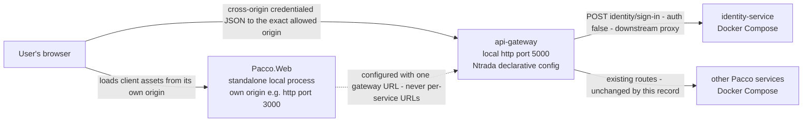
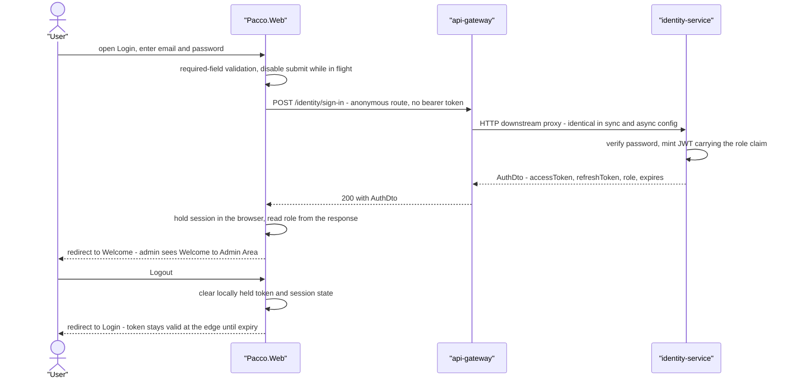

# ADR-021: Pacco.Web as the standalone browser client, and the browser-caller contract at the edge

| | |
| --- | --- |
| **Status** | Proposed |
| **Date** | 2026-09-22 |
| **ADR id** | `ADR-021` |
| **Backlog candidate** | None. This record answers `Q2` of `docs/architecture-inventory/adr-candidates.md` ("Is a client application planned for this platform?"), which that backlog named as the twenty-first candidate that would be needed the moment a client was planned |
| **Category / Impact** | Frontend & Security / high |
| **Supersedes / Superseded by** | — (supersedes nothing; the platform has never recorded a client decision) |
| **Deciders** | Unassigned — no `CODEOWNERS`, contributing guide or team metadata exists in any of the fourteen clones (`ADR-004` B1, `adr-candidates.md` B4) |
| **Base ref of all cited source** | `feature/13652/aidlc` |
| **Source** | `DO1` — *Common Pacco Login Experience*: "no frontend asset or design system exists platform-wide; `Pacco.Web` is an empty single-commit repository absent from every deployment manifest and from all gateway route configurations"; `DO2` — *Role-Aware Landing Page with Session Protection and Logout*. Both from work item **13652**, `intents/13652.md` |
| **Related** | `ADR-004` (the declarative edge this client calls, and its obligation 3), `ADR-006` (authentication enforced at that edge), `ADR-007` (the split trust root and the revocation position this record does not change), `ADR-017` (the Compose stacks this client runs beside), `ADR-018` (repository per component, independent release), `ADR-020` (the runtime baseline this client is deliberately *not* bound to) |

## Notation

| Symbol | Meaning |
| --- | --- |
| ✅ | Confirmed current behaviour — observed in source at the cited path and line range |
| 🎯 | Target state — intended design, not in production today |
| ❓ | Needs validation — assumed or inferred, not observed in source |
| `[INFERRED]` | Conclusion drawn from observed evidence rather than stated by it |

## Contents

1. [Context](#1-context)
2. [Decision Drivers](#2-decision-drivers)
3. [Architecture Fit Evaluation](#3-architecture-fit-evaluation)
4. [Options Considered](#4-options-considered)
5. [Decision](#5-decision)
6. [Consequences](#6-consequences)
7. [Compliance Considerations](#7-compliance-considerations)
8. [Non-Functional Requirements & Testing](#8-non-functional-requirements--testing)
9. [Relationship to the implementation pattern catalog](#9-relationship-to-the-implementation-pattern-catalog)
10. [Evidence](#10-evidence)
11. [Follow-Up Actions](#11-follow-up-actions)
12. [Assumptions, Blockers & Open Questions](#assumptions-blockers--open-questions)

---

## 1. Context

Pacco has run for its whole recorded history without a client. The platform's capability inventory
runs `CAP-01` Identity & Access Management through `CAP-16` Environment & Deployment Definition and
contains **no presentation, browser-client, web-application or design-system capability**
(`docs/architecture-inventory/baselines/capability-baseline.md` §1). The UI inventory proves the
absence exhaustively rather than assuming it: no `package.json`, `angular.json` or `vite.config.*`
anywhere, no `.cshtml` or `.razor`, exactly one `wwwroot` directory in fourteen clones, no authored
stylesheet, no shared component library, no design tokens and no frontend build pipeline
(`docs/architecture-inventory/baselines/ui-inventory.md` §1, §4.2, §5.1, §10). The one browser-facing
surface the platform owns is a **developer test harness** — a static SignalR console served by
`UseStaticFiles()` from inside the `operations-service` image, addressing
`http://localhost:5005/pacco` directly and bypassing the edge entirely, with its whole visual
identity supplied by stock Bootstrap 4.0.0 loaded from a CDN
(`architecture-baseline.md` §7.2, §7.3).

The decision corpus is equally silent, and says so deliberately.
`docs/architecture-inventory/adr-candidates.md` excluded the platform's client/frontend strategy
from the backlog because **no decision was made and none can be reconstructed** — "There is nothing
here with alternatives, trade-offs or lasting impact to record — only an absence" — and carried the
matter as open question `Q2`, which states that if a client is planned "a twenty-first candidate is
needed, and the edge decisions (004, 005, 006, 014) all currently assume a machine caller rather
than a browser".

Work item **13652** ends that absence. `DO1` requires a Login screen and `DO2` a role-aware
Welcome/Landing screen with session protection and logout. Three forces make this an architectural
decision rather than an implementation detail:

1. ✅ **There is no owner to extend.** `Pacco.Web` tracks exactly one commit and exactly one file —
   `README.md`, whose entire content is `# Pacco.Web`. It appears in no deployment manifest and in
   no gateway route table (`repo-summary/Pacco.Web.md`). Whatever owns the client is therefore new
   to the platform's component map.
2. ✅ **The edge's CORS policy is currently incoherent for a browser.** All four gateway
   configurations declare `allowCredentials: true` alongside `allowedOrigins: ['*']`
   (`ntrada.yml:27-41` and the three sibling files) — a combination the CORS protocol forbids.
   `ADR-004` carries this as its open question about whether the edge stays declarative once a
   browser client exists. A browser access path cannot be specified while that stands.
3. ✅ **Logout has no platform mechanism behind it.** `identity-service` owns access-token
   revocation and refresh-token use/revoke, but **none of those three routes has a gateway route in
   any of the four configurations**, and `ADR-007` obligation 4 records that neither the gateway nor
   any domain service consults the revocation store. A logout that actually invalidates a token
   cannot be built without changing the edge or the auth backend.

Two of these three were settled by reviewer decision before this record was written, and are carried
into §5 as binding constraints rather than re-opened here (`intents/13652.md`, *Input required
recap*, items 1 and 2, both `Status: Resolved`).

### 1.1 What this record does *not* cover

This record fixes **where the client lives, how it reaches the platform, and what the edge must
allow it to do**. It does not decide the client's internal framework, module layout, routing library
or state container — those are implementation choices inside the boundary it establishes, and the
platform has no standard to inherit (§7). It does not change the gateway's JWT validation, its
claim gates, or the revocation position (`ADR-006`, `ADR-007` stand untouched). It does not change
`POST /identity/sign-in`, its contract, or `identity-service` in any way. It does not define Dev,
QA, Staging or Production frontend environments — none exist (§5, rule 6).

---

## 2. Decision Drivers

| # | Driver | Why it decides something here |
| --- | --- | --- |
| D1 | **The client's lifecycle must not be coupled to a backend deployable's lifecycle.** | The platform's only precedent — the SignalR harness inside `operations-service` — ships UI inside a backend image, so a UI change requires a backend build, image and release, and the UI cannot be released without releasing the service. `ADR-018` makes per-repository independent release the platform's release model; a client folded into a service image cannot honour it |
| D2 | **The edge must stay the single north-south entry point.** | `ADR-004` §2 and `ADR-006` §2 place routing, authentication, claim gates and identity binding in exactly one place. A browser that addresses services directly — as the SignalR harness does — reproduces the hole `ADR-006` obligation 3 already names |
| D3 | **A credentialed browser origin must be exact.** | The CORS protocol does not permit a wildcard origin together with credentials; leaving the wildcard in place makes the browser path either broken or silently permissive |
| D4 | **The feature must not become a gateway/authentication architecture change.** | `DO2` explicitly holds the existing authentication and authorization backend out of scope. Exposing revocation at the edge would reverse `ADR-007`'s recorded position as a side effect of shipping a login screen |
| D5 | **Only local development exists.** | `ADR-017` records the Compose stacks and PM2 manifests as developer environments with no production orchestration. There is no deployment target to design a frontend pipeline against, and inventing one would be undeliverable architecture |
| D6 | **The boundary must outlive the two screens.** | Login and Welcome are the first two surfaces, not the last. The boundary has to be the one that later carries order, parcel and delivery surfaces without being re-drawn |
| D7 | **Nothing may be invented where the platform is silent.** | No frontend standard, no design system, no accessibility rule and no state-ownership convention exists to cite (§7). Where the platform is silent this record either decides explicitly or records an open question — it does not import an unstated convention |

---

## 3. Architecture Fit Evaluation

The platform's existing components were checked for one that already owns — or could own — a browser
presentation boundary, before any new element was proposed.

| # | Existing component / extension point evaluated | Does it own this today? | Can it own it? | Primary reason it cannot |
| --- | --- | --- | --- | --- |
| F1 | **`operations-service` static-file hosting** (`CAP-11`) — the one repo-owned UI surface, served by `UseStaticFiles()` from the service image | No. It owns a single-purpose SignalR diagnostic console, not a presentation boundary | No | Couples the client's release to a backend deployable's release, violating D1 and `ADR-018`. It would also inherit the harness's hard-coded same-origin addressing, which bypasses the edge and violates D2. The reviewer-resolved architecture answer forbids it directly: the client "is not embedded into an existing backend service image" |
| F2 | **`api-gateway` serving the client's assets** (`CAP-02`) | No. The gateway serves routes, not assets; no `ntrada*.yml` declares a static-asset module | No | `ADR-004` §2 makes the edge a route table interpreted from YAML with no first-party serving code. Making Ntrada a web-asset host stretches the declarative edge into an application host, and the resolved answer forbids it: the client "is not served by Ntrada" |
| F3 | **A backend-for-frontend service** — the option `ADR-004` §2 obligation 3 explicitly preserves | No | Technically yes, but unnecessary | `ADR-004` obligation 3 admits a BFF *only* when a client needs response aggregation or per-client shaping. `DO1` and `DO2` need neither: the client makes exactly one platform call, `POST /identity/sign-in`, and consumes the response as-is. Introducing a BFF would add a deployable, a release and a second edge-adjacent contract to buy nothing this intent needs. The option stays open on `ADR-004`'s terms for the day aggregation is actually required |
| F4 | **`identity-service`** (`CAP-01`) hosting sign-in and landing pages | No | No | It is a bounded context owning users, credentials, roles and refresh tokens. Adding presentation would give a domain service a second, unrelated reason to change and a browser-facing surface it does not otherwise have. Same lifecycle-coupling objection as F1 |
| F5 | **`Pacco` platform repository** (`CAP-16`) carrying the client as another orchestration asset | No | No | `CAP-16` owns environment and deployment *definition* — Compose stacks, PM2 manifests, infrastructure images. It owns no application code and no runtime of its own (`repo-summary/Pacco.md`). A client placed there would have no build of its own and would violate `ADR-018`'s repository-per-component release model |
| F6 | **An existing design system / component library to build the screens on** | No — and the absence is proven, not assumed | Not applicable | `ui-inventory.md` §10: no authored stylesheet anywhere in the platform, no shared component library, no Storybook, no design-system package, no design tokens. The one surface's entire visual identity is stock Bootstrap 4.0.0 from a CDN. There is nothing to extend |

**Conclusion.** No component on the platform owns a presentation boundary, and every extension point
above fails on lifecycle coupling, on an explicit obligation in `ADR-004`, or on the reviewer-resolved
architecture answer. A **new runtime component** is therefore required, and it is the smallest
sufficient one:

- It is **not a new bounded context** — it owns no domain data and no business rule. It is a
  presentation boundary over `CAP-01` and `CAP-02`, and it holds nothing the platform does not
  already own.
- It is **not a new deployable service** at this stage — it has no deployment target, no Compose
  entry, no port allocation in the platform's `5000`–`5009` block and no gateway route. It runs as a
  local process beside the Compose backend. Adding it to Compose later as its own independent
  service is a `CAP-16` configuration change, not a redesign of this boundary.
- It **is expected to remain stable beyond this feature** because it is drawn on the axis that does
  not move: browser-rendered presentation versus server-owned domain behaviour. Every future Pacco
  browser surface — orders, parcels, deliveries, operation status — lands inside it without moving
  the boundary, and every future domain rule lands outside it.

The three remaining capabilities this intent touches need **no** new architectural element:

| Capability | Verdict | Reason |
| --- | --- | --- |
| End-user authentication through the edge | Existing architecture is sufficient | `POST /identity/sign-in` is already an anonymous (`auth: false`) downstream route in **all four** gateway configurations, and `identity-service` already returns `AuthDto` carrying `AccessToken`, `RefreshToken`, `Role` and `Expires`. Both `DO1`'s authentication outcome and `DO2`'s role source exist today. No route, contract, claim or service change |
| Credentialed cross-origin browser access | Extend `CAP-02` at configuration level | `ADR-004` §2 already places CORS in the declarative extension block as cross-cutting edge behaviour configured once. The change is to the policy value, not to the ownership or the mechanism |
| Client-side session lifecycle and logout | Realized inside the new component | No catalogued owner exists for client-held session state, and none is created: the session lives in the browser and dies with it |

---

## 4. Options Considered

Two dimensions of this decision were **settled before option exploration** and are recorded as
constraints, not as choices re-litigated here:

| Settled dimension | Governing source | What it fixes |
| --- | --- | --- |
| Client topology and UI foundation | Reviewer decision, `intents/13652.md` *Input required recap* item 1 (`Status: Resolved`) — an architect-confirmed decision, not a recommendation | `Pacco.Web` is the standalone browser client, not embedded in a backend image and not served by Ntrada; local development only; the approved Pacco style assets are the UI foundation; the browser reaches the platform only through the local gateway; the wildcard origin is replaced by the exact `Pacco.Web` local origin with credentials enabled; no Dev/QA/Staging/Production frontend environments are configured |
| Logout semantics | Reviewer decision, `intents/13652.md` *Input required recap* item 2 (`Status: Resolved`), consistent with `ADR-007` obligation 4 | Logout is a client-side session discard only. No logout or revoke route is added at the edge, and the gateway's JWT validation and revocation behaviour are unchanged |

The dimensions that were **not** settled — which component hosts the client, and how a browser is
allowed through the edge — were explored:

| # | Option | Evaluation | Outcome |
| --- | --- | --- | --- |
| 1 | **Standalone `Pacco.Web` browser client, calling the existing edge directly** | One new runtime component, no new deployable in the platform's manifests, no new edge component, no new contract. The client's release cycle is its own, matching `ADR-018`. The only platform change is a CORS policy value | **Chosen** (§5) |
| 2 | **Serve the client from inside a backend service image**, following the `operations-service` harness precedent | Rejected: it couples a browser client's lifecycle to a backend deployable, contradicting `ADR-018`'s independent per-repository release, and it reproduces the harness's direct same-origin addressing that bypasses the edge (`ADR-006` obligation 3). Forbidden outright by the resolved architecture answer |
| 3 | **Serve the client's assets from the gateway** | Rejected: `ADR-004` §2 fixes the edge as a YAML route table with no first-party serving code. Turning Ntrada into an asset host makes the edge an application host and puts the client's build inside the gateway's release. Forbidden outright by the resolved architecture answer |
| 4 | **Introduce a backend-for-frontend between the client and the services** | Rejected: `ADR-004` §2 obligation 3 admits a BFF only for response aggregation or per-client shaping, and this intent needs neither — the client makes one call and consumes the response unchanged. It would add a tenth-plus deployable, a release and a contract for no benefit. Preserved on `ADR-004`'s existing terms for the day aggregation is genuinely needed |
| 5 | **Let the browser address `identity-service` on port `5004` directly**, as the SignalR harness addresses `operations-service` on `5005` | Rejected: it removes the only place authentication, claim gates and identity binding are enforced (`ADR-006`), publishes a second public door, and leaves every later surface with no edge to grow into. It is the harness's known defect, not a pattern to repeat |
| 6 | **Keep `allowedOrigins: ['*']` and disable `allowCredentials`** | Rejected: it does not fit the intent. `DO1`'s browser path is credentialed, and a wildcard origin says the edge accepts any page on the internet — a weaker security posture recorded in `CAP-02`'s quality signals, adopted deliberately rather than inherited accidentally |
| 7 | **Move CORS out of the YAML into gateway code**, so origins can be computed per environment | Rejected: it gives up the property `ADR-004` was chosen for — that an edge change is a configuration change rather than a build and a release — to solve a problem the platform does not have, since exactly one origin exists |

---

## 5. Decision

**`Pacco.Web` is the Pacco platform's standalone browser client and the single owner of its web
presentation boundary. It runs as its own local process beside the Docker Compose backend, is never
bundled into a backend service image and is never served by the gateway, and reaches the platform
only through the local API Gateway at `http://localhost:5000`. The gateway's declarative CORS
extension replaces `allowedOrigins: ['*']` with the exact `Pacco.Web` local origin while
`allowCredentials` remains `true`. Logout is a client-side session discard: no logout or revocation
route is added at the edge, and the gateway's JWT validation and revocation behaviour are
unchanged.**

Seven rules follow and are part of the decision:

1. 🎯 **`Pacco.Web` owns presentation and nothing else.** It owns the Login page, the Welcome/Landing
   page, authentication and session handling in the browser, role-aware UI behaviour, and every
   future Pacco browser surface. It owns no domain data, no business rule and no persistence. Any
   rule that decides an outcome the platform must stand behind belongs in a service, not here.
2. 🎯 **The client is independently buildable and independently released.** It is not in any backend
   image, not in any backend project or solution, and not on any backend service's release path —
   `ADR-018`'s model applied to the client. A deployment pipeline can be added later without
   redrawing this boundary.
3. 🎯 **The browser reaches the platform only through the edge.** `Pacco.Web` is configured with the
   single local gateway URL `http://localhost:5000` — not with per-service URLs and not with
   container ports. No browser code addresses `identity-service` or any other service directly. This
   is `ADR-006` obligation 3 honoured by the first browser client rather than broken by it.
4. 🎯 **The edge names its browser caller exactly.** The `extensions.cors.allowedOrigins` list in the
   gateway configuration carries the exact `Pacco.Web` local origin — scheme, host and port, for
   example `http://localhost:3000`, matching whichever port `Pacco.Web` actually serves — in place of
   `'*'`, with `allowCredentials: true` retained. This is a change to the platform's public contract
   and is reviewed as one, per `ADR-004` §2 obligation 1. All four configuration files carry an
   identical CORS block today and must stay identical, per `ADR-004` §2 obligation 2 and blocker B2.
5. 🎯 **Logout is a client-side session discard, and its limitation is recorded, not hidden.** On
   logout `Pacco.Web` clears the locally held access token and session state, redirects to Login, and
   stops using the cleared token. An already-expired token takes the same path with a session-expired
   message. **The already-issued token is not invalidated at the platform level: it remains
   acceptable to the gateway and to the domain services until it expires.** This is `ADR-007`
   obligation 4's recorded gap, reached from a new direction and still open — not a new defect and
   not a resolved one.
6. 🎯 **Only the local runtime path is in scope.** The path is
   `Browser → Pacco.Web → local API Gateway (http://localhost:5000) → services in Docker Compose`.
   There are currently no separate Dev, QA, Staging or Production frontend environments, so
   environment-specific origins, gateway URLs, DNS names and deployment targets are **defined later,
   when those environments are introduced**. This record does not pre-decide them.
7. 🎯 **`Pacco.Web` owns the platform's first UI foundation.** The approved Pacco style assets —
   `STYLE_README.md` and `pacco-material-you.css` — are absorbed into `Pacco.Web` as the shared
   visual foundation for the Login and Welcome/Landing screens. They are the platform's first
   authored stylesheet, replacing nothing, because nothing existed. They are scoped to this client
   and are **not** a platform-wide design system: a shared, versioned design system would be a
   separate decision with a separate owner, and this record does not make it.

### 5.1 The local runtime path

`Pacco.Web` serves the client document and its assets from its own local origin. Every platform call
the loaded page makes is a cross-origin credentialed request to `http://localhost:5000`, which is why
rule 4 exists. The dashed edge is configuration, not traffic.

### 5.2 Sign-in, session and logout

The diagram carries the whole of `DO1`'s contract edge to `DO2`. The role claim is **produced** by
`identity-service`, **carried** unchanged through the existing gateway route, and **consumed** by the
landing page inside `Pacco.Web` — one producer, one transport, one consumer, no unowned hop. The
landing page reads the role from the session it holds; it never infers a role from an email address
or a username, and it never treats an unknown role as `admin`.

---

## 6. Consequences

### 6.1 Positive

1. 🎯 The platform gains a named owner for presentation. Every question `architecture-baseline.md`
   §7.3 listed as unanswerable because no frontend existed — how a user authenticates in practice,
   how a token is obtained and held on the client — now has a component to answer it.
2. 🎯 The client's release is independent of every backend release, so a UI change costs no service
   build, no image and no service deployment.
3. 🎯 The edge's first browser consumer is explicit. `CAP-02`'s CORS policy stops being a wildcard
   with an unexamined consumer and becomes a named contract with one.
4. 🎯 `ADR-006` obligation 3 is honoured by the first client rather than eroded by it: unlike the
   SignalR harness, nothing in `Pacco.Web` addresses a service directly.
5. ✅ No backend change ships with this feature. `identity-service` is untouched, the route table is
   untouched apart from one configuration value, and `ADR-006` and `ADR-007` stand as written.

### 6.2 Negative

1. 🎯 **Logout does not revoke.** A token whose browser session was discarded is still accepted by
   the gateway and by all eight domain services until it expires, because only `identity-service`
   consults the revocation store and no gateway route reaches it. This is `ADR-007` obligation 4's
   gap, now reachable by an end user rather than only by a machine caller — it raises the gap's
   exposure without changing its cause.
2. 🎯 **The platform acquires a second runtime technology family.** `ADR-020` pins every existing
   deployable to .NET Core 3.1; a browser client is not a .NET deployable and does not inherit that
   baseline. The platform now has a build it has never had, with no CI pipeline, no lockfile
   convention and no dependency policy to inherit (`ui-inventory.md` §5.1).
3. 🎯 **The CORS origin becomes a per-environment value with no per-environment mechanism.** The
   gateway keeps four configuration files that are identical in their CORS block and are selected by
   `NTRADA_CONFIG`; `ADR-004` blocker B2 records that nobody has stated which file each environment
   loads. An exact origin makes that ambiguity load-bearing where a wildcard hid it — a wrong file
   now breaks the browser instead of silently allowing everything.
4. 🎯 **The style assets are a foundation, not a system.** `STYLE_README.md` and
   `pacco-material-you.css` are owned by one client with no versioning, no distribution mechanism and
   no consumer contract. A second future client would either copy them or force the design-system
   decision this record deliberately does not make.
5. ✅ **The edge's allowed-method list does not cover reads.** `extensions.cors.allowedMethods`
   declares `post`, `put` and `delete` only (`ntrada.yml:31-34` and all three siblings). `DO1` and
   `DO2` need only `POST /identity/sign-in`, so nothing in this feature is blocked — but the first
   browser surface that reads through the edge will need the policy widened. Carried as `Q2`.

### 6.3 Neutral / follow-on

1. ✅ `Pacco.Web` remains absent from `Pacco/compose/services.yml`, from the PM2 manifests and from
   the `5000`–`5009` port block. That is the decision, not an oversight — §5 rule 6.
2. 🎯 If `Pacco.Web` is later added to Compose as its own service, it is a `CAP-16` configuration
   change under `ADR-017`, and this boundary is unaffected.
3. ✅ The refresh token in `AuthDto` still has no redeemable endpoint at the edge — no gateway route
   reaches `POST refresh-tokens/use` in any of the four configurations. The client therefore holds a
   token it cannot redeem. This record does not change that, and the session ends at access-token
   expiry rather than refreshing. Carried as `Q1`.

---

## 7. Compliance Considerations

The writable architecture repository's `docs/` tree holds exactly two kinds of normative material:
the ADR corpus (`docs/adr/`) and the inventory and pattern catalog
(`docs/architecture-inventory/`). **There is no `docs/standards/` tree, no API-design standard, no
event standard, no database standard, no observability standard and no frontend standard anywhere in
this repository or in the fourteen clones.** Every rule cited below is therefore quoted from a real
ADR or pattern file in this corpus; every standards family with no covering content is recorded as an
open question rather than filled from an outside convention.

| Rule | Source | Verbatim rule text | Strength | How this decision conforms |
| --- | --- | --- | --- | --- |
| ADR-004 §2 obl. 1 | `docs/adr/declarative-configuration-driven-api-gateway.md` | "The routing configuration is a reviewed architectural artifact, not an operations file. A change to it changes the platform's public contract and must be reviewed as such." | MUST | §5 rule 4 states the CORS change as a public-contract change requiring the same review as a route change |
| ADR-004 §2 obl. 2 | same | "Each environment must record which configuration file it loads. Nothing in the workspace states this today, and the four files differ in contract, not merely in hostname." | MUST | §6.2 item 3 records that the exact origin makes this ambiguity load-bearing, and `Q3` carries it |
| ADR-004 §2 obl. 3 | same | "Response aggregation or per-client shaping must not be added to this configuration. If a future client needs either, introduce a separate backend-for-frontend service and record that decision rather than stretching this one." | MUST NOT | This client needs neither — it makes one call and consumes the response unchanged (§3 F3, §4 option 4). Nothing is added to the edge but one origin value |
| ADR-006 §2 | `docs/adr/edge-enforced-authentication-with-fail-open-authorization.md` | "Pacco enforces authentication at the gateway. The gateway validates the caller's token, gates routes on claims, and binds the caller's identity into the forwarded request or published message." | MUST | §5 rule 3 routes every browser call through the edge; the client adds no authentication of its own and re-checks nothing the edge decides |
| ADR-006 §2 obl. 3 | same | "The edge must be unavoidable, or the per-route rules are advisory." | MUST | The client is configured with one gateway URL and no service URLs, so it cannot bypass the edge by configuration |
| ADR-007 §2 obl. 4 | `docs/adr/split-jwt-trust-root-gateway-and-services.md` | "Revocation is consulted at the boundary that enforces authentication. Today a revoked token is still accepted by the gateway and by all eight domain services, because only the issuing service checks the revocation store." | Open obligation | This record changes nothing about revocation and adds no revocation route. §5 rule 5 and §6.2 item 1 state the consequence for logout explicitly instead of implying it is solved |
| ADR-018 §2 | `docs/adr/repository-per-service-independent-release.md` | "Repository per service, with independent per-repository release" | MUST | §5 rule 2 — `Pacco.Web` builds and releases from its own repository, on no backend's release path |
| ADR-017 | `docs/adr/compose-and-process-manager-deployment.md` | Composable container stacks and process manifests as the deployment path | MUST | §5 rule 6 — the client runs beside the Compose stack as a local process and changes no stack; a later Compose entry is a `CAP-16` change |
| Pattern | `docs/architecture-inventory/patterns/security/edge-enforced-authentication-with-identity-binding.md` | The edge is where the caller's identity is established and bound | SHOULD | The client never mints, rewrites or asserts identity; it presents what the edge issued |

**External standard cited in this record.** The wildcard-plus-credentials combination is forbidden by
the WHATWG Fetch Standard's CORS protocol, § *CORS protocol and credentials*, which states: "If
credentials mode is 'include', then the `Access-Control-Allow-Origin` response header cannot be
`*`." That clause — not a general statement about wildcards — is the one this record relies on, and
it is why §5 rule 4 replaces the origin rather than relaxing credentials.

### 7.1 Standards families with no covering content

| Family | Relevant here? | Covering content in `docs/`? | Disposition |
| --- | --- | --- | --- |
| API contracts (URI, versioning, error envelope) | Yes — the client consumes one | **None.** No API standard exists | The client consumes an existing route unchanged, so nothing is decided by default. Recorded as `Q4` |
| Async / eventing | No — the client publishes and consumes no message | n/a | Out of scope |
| Database | No — the client owns no data and no store | n/a | Out of scope |
| Multi-tenancy | No — the platform is single-tenant; no tenant identifier exists in any contract | n/a | Out of scope |
| Security & privacy | Yes | `ADR-006`, `ADR-007`, and the two security pattern files | Conformed to, per the table above. Password handling and log redaction on the client have no platform rule — see §8 and `Q4` |
| Observability | Yes — the gateway exposes `Request-ID`, `Resource-ID`, `Trace-ID` and `Total-Count` as CORS `exposedHeaders` | `patterns/observability/correlation-and-span-propagation.md` covers services, not browsers | The client is not required to propagate correlation, and nothing generates a browser-side trace today. Recorded as `Q4` |
| Feature flags & configuration | No — a workspace-wide search found no flag system and no flag keys | n/a | Out of scope |
| Frontend (state ownership, host/shell contract, accessibility) | **Yes** | **None.** No frontend standard exists anywhere in the platform | The most consequential gap this record leaves open. Recorded as `Q4` and in the risk register |
| AI governance | No | n/a | Out of scope |
| Clinical / regulated domain | No — no PHI or regulated data is in scope | n/a | Out of scope |
| Deployment & infra | Yes | `ADR-017`, `ADR-018` | Conformed to, per the table above |

---

## 8. Non-Functional Requirements & Testing

| # | NFR | Posture set by this decision | How it is verified |
| --- | --- | --- | --- |
| N1 | **Credential confidentiality** — `DO1` targets zero password values logged or displayed and zero credentials hard-coded in the client | The password is read from the form, sent once in the sign-in request body, and never written to browser storage, to a log, to a URL or to an analytics sink. No credential is compiled into the client | Sign in with a known password and inspect the browser console, the network tab's request and response, browser storage and the client bundle for the literal value. Grep the built client for any credential literal |
| N2 | **No raw backend error reaches the user** — `DO1` targets zero backend exceptions or stack traces shown | Load-bearing and evidenced: the gateway's `extensions.customErrors.includeExceptionMessage` is `true` in all four configurations, so a downstream exception message *does* reach the browser. `Pacco.Web` must therefore map every non-success response to a fixed non-technical message and must never render a response body verbatim | Force three cases against the running stack — invalid credentials, `identity-service` stopped, and a malformed request — and assert the rendered text is the fixed message in every case, and that the raw body appears nowhere in the DOM |
| N3 | **Session protection** — `DO2` targets zero unauthenticated requests reaching the landing page | The landing page is reachable only with a held session. A direct request without one redirects to Login. An expired token follows the same path with a session-expired message | Request the landing route with no session, with a cleared session after logout, and with an expired token. Assert the redirect in all three, and assert the behaviour is identical after a page reload |
| N4 | **Role fidelity** — `DO2` targets zero unknown-role or normal users shown the admin message | The role comes only from the authenticated identity response, within `identity-service`'s closed lower-cased vocabulary `user` and `admin` (`Role.cs`). An unknown or unsupported role never renders the admin message, and no role is inferred from an email address or a username | Sign in as `admin`, as `user`, and with a token carrying an unrecognised role value. Assert the rendered message in each case, and repeat after a reload and after a logout/login cycle |
| N5 | **Edge access-control posture** | Exactly one origin is allowed, with credentials. A request from any other origin is not granted cross-origin access | With the gateway running, issue a credentialed `POST /identity/sign-in` preflight from the allowed origin and from a different origin, and compare the `Access-Control-Allow-Origin` response headers. Confirm the configuration change is present in **all four** `ntrada*.yml` files |
| N6 | **Revocation exposure (accepted residual risk)** | Explicitly accepted, not mitigated: a discarded session's token remains valid at the edge until expiry | Capture the token from a session, log out, and replay the token against an authenticated gateway route. It will succeed. The test exists to keep the residual risk visible and measured, not to pass |
| N7 | **Duplicate submission** — `DO1` targets zero duplicate submissions accepted while a request is in progress | Submission is disabled for the duration of the in-flight request; the button shows a processing state | Submit repeatedly during a slowed sign-in response and assert exactly one request leaves the browser |
| N8 | **Availability / performance** | **No numeric target is set here, and none is invented.** No availability target, latency budget or error-rate objective is documented for `identity-service`, for the gateway, or for the platform anywhere in the fourteen clones | Recorded as a gap in `risk-constraint-gap-register.md` rather than asserted. A target must be set by the platform owner before any client-side timeout or retry policy can be justified |

Tenant isolation, PII/PHI leakage, event-architecture compliance and database-schema compliance are
**not applicable**: the platform is single-tenant with no tenant identifier in any contract, this
component holds no regulated data, publishes and consumes no message, and owns no schema.

---

## 9. Relationship to the implementation pattern catalog

1. **Constrains** `patterns/integration/declarative-configuration-driven-api-gateway.md`: this record
   adds the edge's first browser consumer without adding any first-party edge code, so the pattern
   holds under a class of caller it had not met. The exact-origin CORS value is the pattern applied,
   not stretched.
2. **Honours** `patterns/security/edge-enforced-authentication-with-identity-binding.md`: the client
   presents what the edge issued and asserts no identity of its own.
3. **Diverges from nothing.** No pattern in the catalog covers presentation, client state or asset
   delivery — `patterns/index.md` has no frontend category.
4. **Pattern Drift:** not reportable. Drift requires an `Approved` pattern to violate, and every
   entry in `patterns/index.md` still carries status `Candidate`.
5. **Pattern Update Proposal:** the catalog has no pattern for *how a browser client reaches this
   platform*. Once `Pacco.Web` exists, the shape it establishes — one configured gateway URL, no
   per-service URLs, no direct service addressing, an exact allowed origin — is worth catalogueing as
   a candidate integration pattern so the second client inherits it rather than re-deciding it.

---

## 10. Evidence

| # | Claim | Notation | Source (path:lines) |
| --- | --- | --- | --- |
| E1 | `Pacco.Web` tracks exactly one file on one commit and contains no source, build, manifest or configuration | ✅ | `git -C hianshul100_Pacco.Web ls-files` → `README.md`; `git log` → one commit; `docs/architecture-inventory/repo-summary/Pacco.Web.md` |
| E2 | `Pacco.Web` appears in no deployment manifest, no clone list and no gateway route table | ✅ | `hianshul100_Pacco/README.md`; `hianshul100_Pacco/compose/services.yml`; `hianshul100_Pacco/prod-services.yml`; all four `ntrada*.yml` |
| E3 | The capability inventory `CAP-01`…`CAP-16` contains no presentation, client or design-system capability | ✅ | `docs/architecture-inventory/baselines/capability-baseline.md` §1 |
| E4 | No authored stylesheet, shared component library, design token set or frontend build pipeline exists platform-wide; the one surface's visual identity is stock Bootstrap 4.0.0 from a CDN | ✅ | `docs/architecture-inventory/baselines/ui-inventory.md` §4.1, §5.1, §10.1–§10.4 |
| E5 | The only repo-owned UI is a static SignalR console served by `UseStaticFiles()` from the `operations-service` image, hard-coded to `http://localhost:5005/pacco`, bypassing the gateway | ✅ | `Pacco.Services.Operations.Api/wwwroot/ui/index.html`, `js/app.js`; `Extensions.cs:88`; `architecture-baseline.md` §7.2 |
| E6 | The ADR corpus excluded the platform's client/frontend strategy because no decision was ever made, and carried it as `Q2` | ✅ | `docs/architecture-inventory/adr-candidates.md`, *Assessed and excluded* item 8 and open question `Q2` |
| E7 | All four gateway configurations declare `allowCredentials: true` with `allowedOrigins: ['*']`, `allowedMethods` of `post`/`put`/`delete`, `allowedHeaders: ['*']` and four `exposedHeaders` | ✅ | `ntrada.yml:27-41`, `ntrada.docker.yml:27-41`, `ntrada-async.yml:27-41`, `ntrada-async.docker.yml:27-41` |
| E8 | `POST /identity/sign-in` is an anonymous (`auth: false`) downstream route to `identity-service/sign-in` in **both** the synchronous and the asynchronous configurations — sign-in is never converted to a message publication | ✅ | `ntrada.yml:264-270`; `ntrada-async.docker.yml:308-314` |
| E9 | `identity-service` sign-in returns `AuthDto` carrying `AccessToken`, `RefreshToken`, `Role` and `Expires` | ✅ | `Pacco.Services.Identity.Application/DTO/AuthDto.cs:3-9`; `Application/Services/Identity/IdentityService.cs:49-79` |
| E10 | The role vocabulary is the closed, lower-cased set `user` and `admin`, validated case-insensitively | ✅ | `Pacco.Services.Identity.Core/Entities/Role.cs` |
| E11 | The three token-management routes — `access-tokens/revoke`, `refresh-tokens/use`, `refresh-tokens/revoke` — have **no** gateway route in any of the four configurations | ✅ | All four `ntrada*.yml` `identity` modules, which declare only `/users/{userId}`, `/me`, `/sign-up` and `/sign-in`; `architecture-views.md` §3.3 *Unknowns*, GAP-21 |
| E12 | The gateway runs on host port `5000` in the Compose stack and loads `ntrada-async.docker.yml` there | ✅ | `hianshul100_Pacco/compose/services.yml:4-13` |
| E13 | The gateway returns downstream exception messages to callers | ✅ | `extensions.customErrors.includeExceptionMessage: true`, `ntrada.yml:24-25` and all three siblings |
| E14 | The gateway validates token lifetime at the edge, so an expired token is rejected there | ✅ | `extensions.jwt.validateLifetime: true`, `ntrada.yml:43-48` and all three siblings |
| E15 | Every existing deployable is pinned to .NET Core 3.1 | ✅ | `ADR-020`; `dotnet: 3.1.100` in all eleven Travis files |

### 10.1 Documentation-versus-code conflicts

1. ✅ **The architecture baseline's §7 input-gap note is stale.** It states that
   `docs/architecture-inventory/baselines/ui-inventory.md` "does not exist in this repository". The
   file exists and is 936 lines. The workspace wins: the note is corrected on this patch and §7 now
   references the inventory.
2. ✅ **The architecture baseline's §11.1 is stale.** It states that no ADR files exist anywhere. The
   corpus `ADR-001`…`ADR-020` exists under `docs/adr/`. The workspace wins: §11.1 is corrected on
   this patch and now lists the corpus including this record.

---

## 11. Follow-Up Actions

| # | Action | Owner | Due | Blocks |
| --- | --- | --- | --- | --- |
| FA1 | Fix the exact local origin `Pacco.Web` will serve on (scheme, host, port) and apply it to `extensions.cors.allowedOrigins` in **all four** `ntrada*.yml` files, replacing `'*'` and keeping `allowCredentials: true` | Platform owner with the `Pacco.Web` implementer | Before `DO1` sign-in is exercised end to end | `DO1`'s browser path — the wrong value fails loud at the browser, so this cannot ship wrong silently |
| FA2 | Confirm which `ntrada*.yml` each environment loads and record it, so an exact origin lands in the file actually in use (`ADR-004` B2) | Platform owner | Before `DO1` sign-in is exercised end to end | Correctness of FA1 |
| FA3 | Confirm whether the gateway library accepts, rejects or silently rewrites `allowedOrigins: ['*']` with `allowCredentials: true` today, and record the observed behaviour. The library is a NuGet reference with no source in this workspace | Platform owner | Before `DO1` sign-in is exercised end to end | Nothing after FA1 lands, but it settles whether the current wildcard posture is live or inert |
| FA4 | Decide whether `Pacco.Web` becomes a Compose service and, if so, add it as its own independent service — never inside a backend container | Platform owner | When a shared local stack is wanted | Nothing today |
| FA5 | Set an availability and latency target for the gateway and `identity-service`, so the client's timeout and retry behaviour can be justified rather than guessed | Platform owner | Before any client timeout or retry policy is written | `N8` |
| FA6 | Decide whether `STYLE_README.md` and `pacco-material-you.css` become a versioned, distributable design system, or stay client-owned assets | Platform architect | When a second client or surface owner appears | Nothing today; forced by a second consumer |
| FA7 | Name an owner for `Pacco.Web` and for `Pacco.APIGateway`, so this record and the CORS change have a reviewer (`adr-candidates.md` B4) | Platform owner | Before this record leaves `Proposed` | This ADR's approval |

---

## Assumptions, Blockers & Open Questions

> [!IMPORTANT]
> This document contains unresolved items that require attention before or during implementation. Review and resolve before merging downstream artifacts. Each item below is tagged **[ACTION NOW]** (a human must decide or confirm it before this work can safely proceed) or **[handled later by <stage>]** (a named later stage owns and will prove it) — read the tags first to see what, if anything, is yours to act on.

### Assumptions

| # | Assumption | Rationale | Impact if Wrong | Validation Path |
| --- | --- | --- | --- | --- |
| A1 | The gateway library applies `extensions.cors.allowedOrigins` as an exact-match origin allow-list and echoes the matched origin with `Access-Control-Allow-Credentials: true` | The configuration key names read that way and the platform has no other CORS mechanism, but the library is a NuGet reference with no source in this workspace — the same limitation `ADR-004` A1 records for the whole configuration dialect | The browser path would fail at the first credentialed request, or would stay permissive after the wildcard is removed. This fails **loud** at the browser, not silently | FA3 — run the gateway with the exact origin and compare `Access-Control-Allow-Origin` for an allowed and a disallowed origin |
| A2 | `Pacco.Web` serving on its own local port constitutes a distinct origin from `http://localhost:5000`, so CORS applies to every platform call | Origin is scheme, host and port; the ports differ by construction | If the client were ever served same-origin, the CORS configuration would be inert and the exact-origin change would not be exercised | Observe an `Origin` header on the sign-in request in the browser network tab |
| A3 | The `AuthDto.Role` value returned by sign-in is the same role the gateway later enforces claim gates on | `identity-service` mints the token and the DTO from the same `user.Role` in one call path (`IdentityService.cs:76`), and the gateway reads the role claim from the token it validates | A user could be shown the admin landing message while the edge refuses the admin routes, or the reverse | Sign in as `admin`, decode the returned token's role claim, and compare it to the `role` field of the response body |
| A4 | The reviewer-resolved answers in `intents/13652.md` are the platform's decision, not a proposal | Both items are marked `Status: Resolved` and were propagated into `DO1` and `DO2` | The client topology and the logout semantics would both be re-opened, and this record's §5 would need rewriting | Confirm with the platform owner before this record leaves `Proposed` |

### Blockers

| # | Blocker | Blocks | Owner | Resolution Path | Target Date |
| --- | --- | --- | --- | --- | --- |
| B1 | **[ACTION NOW]** The exact local origin `Pacco.Web` will serve on has not been fixed. `http://localhost:3000` is the example in the intent, not a committed value | FA1, and with it `DO1`'s end-to-end sign-in | Platform owner with the `Pacco.Web` implementer | Fix the port when the client's local runtime is chosen, then apply it to all four `ntrada*.yml` files in one change | TBD |
| B2 | **[ACTION NOW]** Nobody has stated which gateway configuration each environment loads (`ADR-004` B2, carried here because an exact origin makes it load-bearing where a wildcard hid it) | FA2, and the correctness of FA1 | Platform owner | Read `NTRADA_CONFIG` in each environment and record the answer | TBD |
| B3 | **[ACTION NOW]** No repository has a named owner, so neither this record nor the gateway configuration change has a required reviewer (`adr-candidates.md` B4) | This record leaving `Proposed`; `ADR-004` §2 obligation 1 | Platform owner | Name an owner for `Pacco.Web` and for `Pacco.APIGateway` | TBD |

### Open Questions

| # | Question | Why It Matters | Proposed Answer (if any) | Decision Owner |
| --- | --- | --- | --- | --- |
| Q1 | **[ACTION NOW]** How does a Pacco browser session continue past access-token expiry, given the refresh token has no redeemable route at the edge? | Sign-in returns a refresh token the client cannot redeem, so the session simply ends at expiry and the user signs in again. That is acceptable for two screens and will not be for a working application | Either route `POST refresh-tokens/use` at the edge in a later record, or state that Pacco sessions end at access-token expiry by design. Do not leave it implied | Platform owner |
| Q2 | **[handled later by HLS]** Should `extensions.cors.allowedMethods` be widened beyond `post`, `put` and `delete`? | Read routes are not in the allowed-method list, so the first browser surface that issues a cross-origin `GET` through the edge will be blocked. Nothing in `DO1` or `DO2` needs one | Widen it in the same change that adds the first browser read surface, not speculatively now | Platform architect |
| Q3 | **[ACTION NOW]** Do the four gateway configuration files stay identical in their CORS block, or does each environment get its own origin? | An exact origin is environment-specific by nature, and §5 rule 6 says frontend environments are defined later. Until then, four identical blocks are correct — but nobody has said so | Keep the four blocks identical while exactly one origin exists, and revisit when the first non-local environment is introduced | Platform owner |
| Q4 | **[ACTION NOW]** What frontend standards does this platform hold its client to — state ownership, accessibility, error presentation, client logging and redaction, dependency and lockfile policy? | There are none anywhere in the workspace. `Pacco.Web` will therefore establish conventions by default rather than by decision, and the second surface will inherit whatever the first one happened to do | Write the minimum set as the client is built — accessibility level, error-presentation rule, no-credential-logging rule, dependency policy — and record them where the platform can cite them | Platform architect |
