# Architecture Views

> **Evidence basis:** `docs/architecture-inventory/repo-inventory.md` (read in full) and all thirteen
> files under `docs/architecture-inventory/repo-summary/` — `Pacco.md`, `Pacco.APIGateway.md`,
> `Pacco.Services.Availability.md`, `Pacco.Services.Customers.md`, `Pacco.Services.Deliveries.md`,
> `Pacco.Services.Identity.md`, `Pacco.Services.Operations.md`, `Pacco.Services.OrderMaker.md`,
> `Pacco.Services.Orders.md`, `Pacco.Services.Parcels.md`, `Pacco.Services.Pricing.md`,
> `Pacco.Services.Vehicles.md`, `Pacco.Web.md`.
> `docs/architecture-inventory/human-context-notes.md` **does not exist** in this repository; the
> only human input available to this stage is the orchestrator-supplied approval of the repository
> inventory (`[HOTL Response:repo_inventory] approved`), which confirms the inventory as the
> evidence baseline but adds no technical fact. The curated architecture catalogue for tenant
> `Q5SCXYFS` was queried and returned no Pacco entities, so **no diagram element in this document
> originates from anything other than repository evidence**.
>
> **Confidence legend:** `[confirmed]` = stated in the inventory or a repo summary, generally with a
> cited path · `[inferred]` = reasonable from partial signals, not certain · `[unknown]` =
> insufficient evidence, listed in §6.
>
> **Scope:** observed current state on base ref `feature/12998/aidlc` across thirteen repositories.
> No target state, no modernization proposal. Prose narrative is deliberately minimal — this file
> owns the platform's diagrams, not its written baseline.

**Platform shape in one paragraph, for orientation only:** eleven .NET Core 3.1 deployables — one
Ntrada API gateway and ten Convey-based services — communicating north-south over HTTP through the
gateway and east-west over a RabbitMQ topic exchange per service, with a small set of direct
service-to-service HTTP calls resolved through Fabio. Persistence is one MongoDB logical database
per service. There is no Kubernetes, Helm, or Terraform in the workspace; deployment is Docker
Compose plus PM2 process manifests. All of this is `[confirmed]` — `repo-inventory.md` §1, §3.4.

---

## Table of contents

1. [System Context Diagrams (C1)](#1-system-context-diagrams-c1)
2. [Service Dependency Graph](#2-service-dependency-graph)
3. [Runtime Interaction Flows](#3-runtime-interaction-flows)
4. [Deployment Topology](#4-deployment-topology)
5. [Entity Relationship Views](#5-entity-relationship-views)
6. [Open Questions and Gaps](#6-open-questions-and-gaps)
7. [Assumptions, Blockers & Open Questions](#assumptions-blockers--open-questions)

---

## 1. System Context Diagrams (C1)

Six C1 diagrams are generated, one per bounded context that has sufficient evidence. The
groupings follow the subsystems established in `repo-inventory.md` §4. Inside a grouped context
every service is drawn as its **own node** with its **own edges** — no dependency is attributed to
a context as a whole.

**Two repositories get no C1 diagram, deliberately:**

- `Pacco.Web` — the clone contains exactly one tracked file, `README.md`, on a single commit. There
  is no runtime, no manifest, no configuration, and no reference to it from any other repository.
  **Unverifiable — Missing Source Evidence.** See §6 GAP-1.
- `Pacco` — it owns no deployable and no runtime, so it has no system context. Its content is
  deployment and process definition and is shown in §4 instead. Drawing it in a C1 would mix
  packaging with runtime. `[confirmed]` — `repo-summary/Pacco.md` §2.

**Redis is deliberately absent from the C1 diagrams except where an active runtime use is
evidenced in code** (`identity-service` token revocation, `operations-service` state and SignalR
backplane). Eight services call `AddRedis()` with a key prefix, but registration alone is not
evidence of use — see §6 GAP-9.

### 1.1 Edge and Access — `api-gateway`, `identity-service`

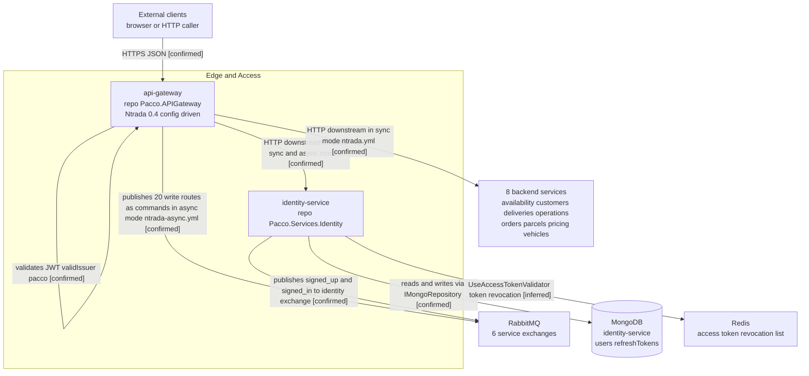

**Evidence references:** `Pacco.APIGateway/src/Pacco.APIGateway/Program.cs` (reads `NTRADA_CONFIG`,
registers `AddNtrada`); the four `ntrada*.yml` route files — `ntrada.yml`, `ntrada.docker.yml`
(sync, every write route is an HTTP `downstream`) and `ntrada-async.yml`, `ntrada-async.docker.yml`
(async, 20 write routes become `exchange` + `routing_key` publishes onto `availability`,
`customers`, `deliveries`, `orders`, `parcels`, `vehicles`);
`Pacco.Services.Identity.Infrastructure/Extensions.cs`
(`AddMongoRepository<UserDocument, Guid>("users")`,
`AddMongoRepository<RefreshTokenDocument, Guid>("refreshTokens")`);
`Pacco.Services.Identity.Infrastructure/Auth/JwtProvider.cs`, `PasswordService.cs`, `Rng.cs`;
`repo-summary/Pacco.APIGateway.md` §7, §8, §10; `repo-summary/Pacco.Services.Identity.md` §6, §7, §8.

**Why the Redis edge is `[inferred]`, not `[confirmed]`:** the only in-repo evidence is the
registration `AddRedis()` (`Pacco.Services.Identity.Infrastructure/Extensions.cs:82`) and the
middleware `UseAccessTokenValidator()` (same file, line 97), plus one call to
`IAccessTokenService.DeactivateAsync(...)` (`Pacco.Services.Identity.Api/Program.cs:59`).
`IAccessTokenService` and its storage backing live in the **Convey.Security** package, not in this
repository, so no source here shows a revocation entry actually being written to Redis. That is a
single registration-level proof, and the same two-proof rule this document applied to demote the
other six services' Redis edges applies here — hence `[inferred]`. See §3.3 for the matching
sequence-diagram note.

**Gaps / unknowns:** the `identity` exchange is **not** among the six the gateway publishes to, so
no command reaches `identity-service` from the edge — yet `Program.cs` calls
`SubscribeCommand<SignUp>()`. Nothing in the workspace publishes `sign_up` as a message. See §6
GAP-4. Which of the four gateway configurations is authoritative per environment is `[unknown]`
(§6 GAP-3). Whether the committed symmetric signing key is live is `[unknown]` (§6 GAP-10).

### 1.2 Order Fulfilment Core — `orders-service`, `parcels-service`, `deliveries-service`

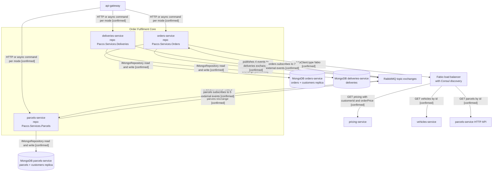

**Evidence references:** `Pacco.Services.Orders.Api/Program.cs` (7 routes);
`Orders.Infrastructure/Services/Clients/{ParcelsServiceClient,PricingServiceClient,VehiclesServiceClient}.cs`;
`Orders.Infrastructure/Extensions.cs` (`AddMongoRepository<OrderDocument, Guid>("orders")` and
`AddMongoRepository<CustomerDocument, Guid>("customers")`);
`Parcels.Infrastructure/Extensions.cs`; `Deliveries.Infrastructure/Extensions.cs`;
`Orders.Application/Events/External/Handlers/` (7 handlers);
`Parcels.Application/Events/External/Handlers/` (5 handlers); `ntrada*.yml` modules `orders`,
`parcels`, `deliveries`; `repo-inventory.md` §3.1, §3.2.

**Gaps / unknowns:** `deliveries-service` has **no inbound edge other than the gateway** — it
subscribes to no external event and no service publishes a `deliveries` command, so the trigger for
`start_delivery` is `[unknown]` (§6 GAP-5). `orders-service` consumes `parcel_deleted` but there is
no handler for `vehicle_deleted`, although `OrderDocument` stores a `VehicleId` — `[confirmed]`
absence, consequence `[inferred]` (§6 GAP-8). `order_delivering` is published with no domain
consumer `[confirmed]`.

### 1.3 Resource and Capacity — `availability-service`, `vehicles-service`

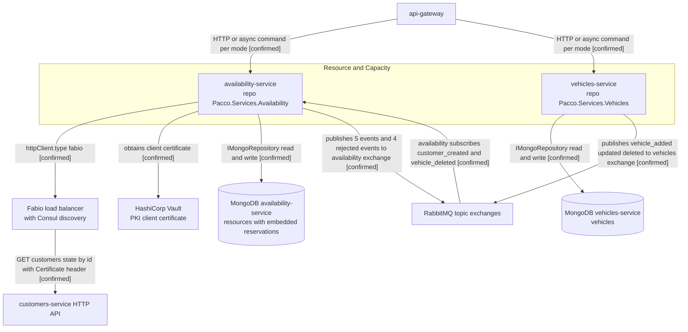

**Evidence references:** `Pacco.Services.Availability.Api/Program.cs` (6 routes);
`Availability.Infrastructure/Services/Clients/CustomersServiceClient.cs` (attaches the Vault-issued
certificate in its constructor); `Availability.Infrastructure/Extensions.cs`
(`AddMongoRepository<ResourceDocument, Guid>("resources")`);
`Availability.Application/Events/External/Handlers/` (`customer_created`, `vehicle_deleted`);
`Vehicles.Infrastructure/Extensions.cs`; `Pacco/docker-images.txt` (Vault PKI roles for
`availability-service` and `customers-service`, common name `pacco.io`);
`repo-summary/Pacco.Services.Availability.md` §5, §6, §7; `repo-summary/Pacco.Services.Vehicles.md` §6.

**Gaps / unknowns:** `vehicles-service` subscribes to **nothing** — no inbound async edge exists
`[confirmed]`. The `availability-service` class names `ReleaseResourceReservation` and
`ReleaseResourceReservationRejected` serialise under `snakeCase` to names that do **not** match the
`release_resource` routing key the gateway publishes or the `messages.json` catalogue entry —
whether the release route binds at all is `[unknown]` (§6 GAP-6).

### 1.4 Customer and Commercial — `customers-service`, `pricing-service`

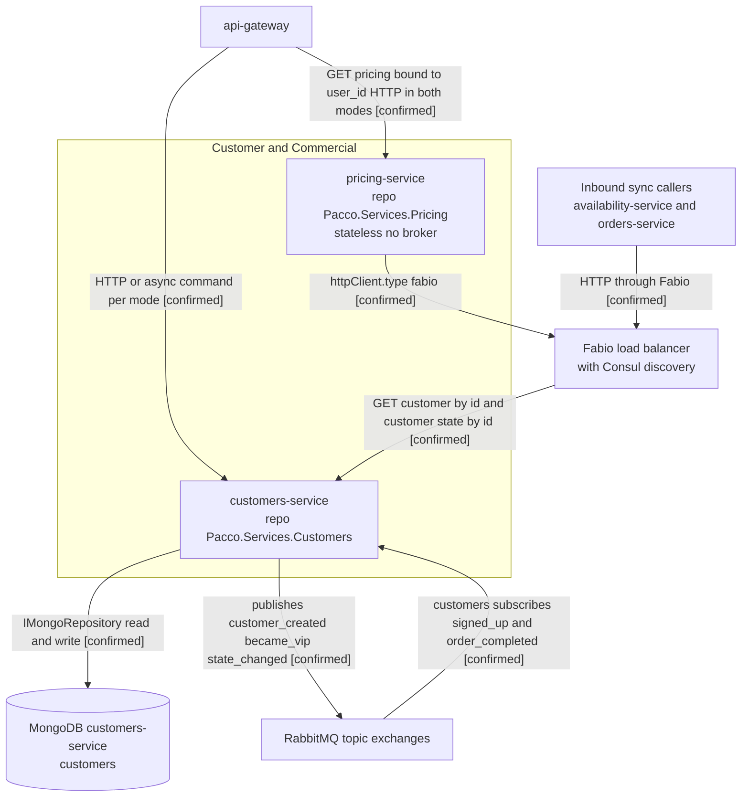

**Evidence references:** `Pacco.Services.Customers.Api/Program.cs` (5 routes);
`Customers.Infrastructure/Extensions.cs` (`AddMongoRepository<CustomerDocument, Guid>("customers")`);
`Customers.Application/Events/External/Handlers/` (`signed_up`, `order_completed`);
`Pacco.Services.Pricing.Api/Services/Clients/CustomersServiceClient.cs`;
`Pacco.Services.Pricing.Api/Queries/Handlers/GetOrderPricingHandler.cs`;
`Pacco.Services.Pricing.Api/Core/Services/CustomerDiscountsService.cs`;
`Customers.Api/appsettings.json` — `security.certificate.acl` grants `availability-service` the
`customers:read` permission with `allowedDomains: ['pacco.io']`; `repo-inventory.md` §3.1.

**Note on the grouping:** `customers-service` and `pricing-service` share **no runtime edge with
each other in the direction the grouping implies** — the only edge is `pricing-service` calling
`customers-service`, which is drawn. `pricing-service` has no database, no broker participation, no
clean-architecture split, and no `LICENSE`, so its membership in this context is `[inferred]`, not
confirmed (`repo-inventory.md` §4 S4 states confidence medium for exactly this reason).

**Gaps / unknowns:** whether the certificate ACL is enforced or advisory is `[unknown]`
(§6 GAP-11). `customer_state_changed` and `customer_became_vip` are published but consumed by no
domain service `[confirmed]` — see §6 GAP-7 and the shared-data discussion in §2.

### 1.5 Order Orchestration — `ordermaker-service`

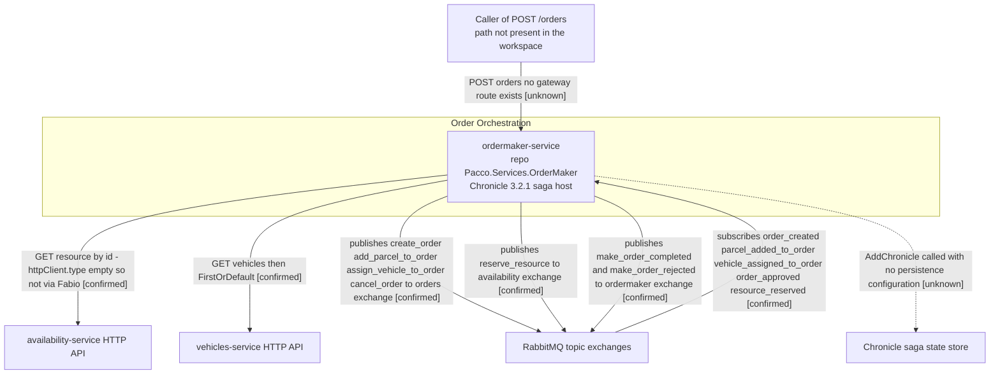

**Evidence references:** `Pacco.Services.OrderMaker/Program.cs` (`GET /`, `POST orders`, `UseApp()`);
`Sagas/AIOrderMakingSaga.cs` (the full choreography, `ResolveId` maps every message to `OrderId`);
`Sagas/AIMakingOrderData.cs`; `Handlers/AIOrderMakingHandler.cs`;
`Services/Clients/{AvailabilityServiceClient,VehiclesServiceClient}.cs`;
`Services/ResourceReservationsService.cs`; `Extensions.cs` (`AddChronicle()` with no persistence,
`AddRedis()`, in-memory command and event dispatchers);
`Pacco.Services.OrderMaker.csproj` (no `Convey.Persistence.MongoDB`, no
`Convey.MessageBrokers.Outbox`, no `Convey.Tracing.Jaeger`, no `Convey.Secrets.Vault`);
`Pacco/compose/services.yml:78-85`; `Pacco/compose/prometheus/prometheus.yml:38-40`.

**`approve_order` is declared but never published.** `Commands/External/ApproveOrder.cs` defines an
`ApproveOrder : ICommand` type, but a repository-wide grep for `ApproveOrder` returns **that file
alone** — `AIOrderMakingSaga.cs` never publishes it. The saga's relationship to order approval runs
in the **opposite** direction: it implements `ISagaAction<OrderApproved>` and *consumes* the inbound
`order_approved` event (line 121). The command is therefore an unused contract, recorded as a gap in
§6 (GAP-24), not a runtime edge. The saga's complete publish set is `CreateOrder` (line 63),
`AddParcelToOrder` (74), `AssignVehicleToOrder` (103), `ReserveResource` (113), `MakeOrderCompleted`
(124) and `CancelOrder` (141, compensation only).

**Two deliberate modelling choices in this diagram.** First, the caller node is drawn as an
**unknown** because there is genuinely no evidenced entry path: `ordermaker-service` appears in no
`ntrada*.yml` module and in neither PM2 manifest, while both Compose stacks start it on port 5015
and **`operations-service`** lists it under `depends_on` (`Pacco/compose/services.yml:51-67`). The
`api-gateway` service block (lines 4-13) has **no** `depends_on` key at all. `depends_on` is a
**container start-ordering** relationship, not a runtime call, so it is not drawn as an edge here —
it belongs to §4. Second,
`Redis` is **not** drawn: `AddRedis()` is registered but no Redis read or write is evidenced in this
repository, and Chronicle is not configured to use it.

**Gaps / unknowns:** how `POST /orders` is invoked (§6 GAP-2); where Chronicle keeps saga state
(§6 GAP-12); whether the receiving services accept the saga's commands, which carry an **empty**
`CorrelationContext.UserContext` (§6 GAP-13).

### 1.6 Operation Observation — `operations-service`

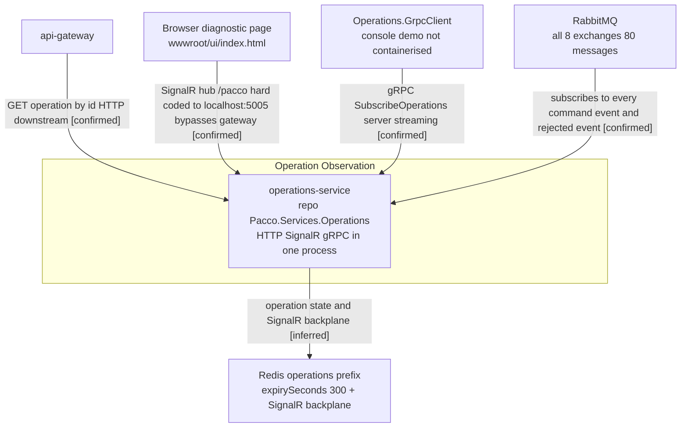

**Evidence references:** `Pacco.Services.Operations.Api/Program.cs` (dispatcher endpoint,
`MapHub<PaccoHub>("/pacco")`, `MapGrpcService<GrpcServiceHost>()`);
`Infrastructure/Subscriptions.cs` (emits a field-less type per message name with
`System.Reflection.Emit` and subscribes reflectively); `messages.json` (8 exchanges, 24 commands,
29 events, 27 rejected events — 80 message names in total);
`Handlers/Generic{Command,Event,RejectedEvent}Handler.cs`;
`Hubs/PaccoHub.cs`; `Operations.proto`; `wwwroot/ui/js/app.js`
(`withUrl('http://localhost:5005/pacco')`, `invoke('initializeAsync', jwt)`); `appsettings.json`
(`requests.expirySeconds: 300`, Redis prefix `operations:`); `Pacco.Services.Operations.Api.csproj`
(`Microsoft.AspNetCore.SignalR.Redis`); `ntrada*.yml` module `operations` (one route only).

**Why the Redis edge is `[inferred]` and the Mongo node is absent.** `appsettings.json` configures
`mongo.database: operations-service`, but **no `AddMongoRepository` call exists anywhere in the
repository** — every other persistent service has one. Redis is configured with a prefix and a
300-second expiry and the SignalR Redis backplane package is referenced, which satisfies the
"exists in configuration" test, but the actual read/write in `Services/OperationsService.cs` was not
read line by line, so the store role is inferred rather than confirmed. MongoDB is omitted from the
diagram entirely because a configured-but-unregistered database is not an evidenced runtime
dependency. See §6 GAP-14.

**Gaps / unknowns:** the wire payload of all 80 subscriptions is `[unknown]` — the emitted types
have no fields, so only message **names** are bound (§6 GAP-15). Whether the SignalR hub or the
gRPC stream scopes results per caller is `[unknown]` (§6 GAP-16) — `GetOperationResponse` carries a
`userId` and `SubscribeOperations` takes no filter argument.

---

## 2. Service Dependency Graph

The platform-level dependency graph is split into **two diagrams by integration mechanism**, because
merging synchronous HTTP with 80 asynchronous messages through one broker node produces an
unreadable graph and blurs which hop is which. Both diagrams together are the service dependency
graph; neither contains a deployment, packaging, or ownership relationship.

### 2.1 Synchronous dependencies — HTTP, Fabio-mediated

Every edge below is proven by a `Convey.HTTP` `IHttpClient` call whose base URL comes from the
`httpClient.services` map in the caller's `appsettings.json`.

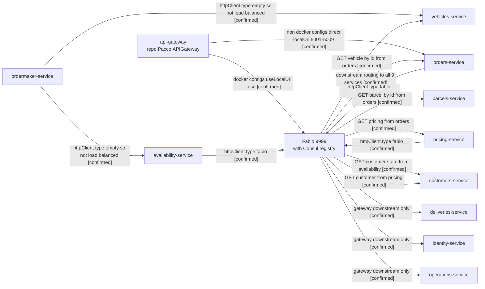

**Reading the graph.** `customers-service` is the most-called service — two inbound service callers
plus the gateway — and calls nothing itself, making it a leaf and a single point of synchronous
dependency for both reservation eligibility and pricing. `orders-service` is the heaviest caller
with three outbound dependencies. `ordermaker-service` is the **only** service whose outbound calls
bypass Fabio (`httpClient.type` is the empty string rather than `fabio`), so its two edges are drawn
direct — this is exactly the kind of subset behaviour that must not be generalised to the group.

### 2.2 Asynchronous dependencies — RabbitMQ topic exchanges

Publishers are drawn to the exchange they own; subscribers are drawn from the exchange they consume.
The mediation hop is preserved deliberately: **no service calls another service asynchronously** —
every async relationship is publisher to exchange to subscriber.

```mermaid
graph LR
    identity["identity-service"]
    customers["customers-service"]
    avail["availability-service"]
    vehicles["vehicles-service"]
    orders["orders-service"]
    parcels["parcels-service"]
    deliveries["deliveries-service"]
    om["ordermaker-service"]
    gw["api-gateway async mode only"]
    ops["operations-service"]

    xid["identity exchange"]
    xcu["customers exchange"]
    xav["availability exchange"]
    xve["vehicles exchange"]
    xor["orders exchange"]
    xpa["parcels exchange"]
    xde["deliveries exchange"]
    xom["ordermaker exchange"]

    gw -->|"20 write routes as commands [confirmed]"| xav
    gw -->|"commands [confirmed]"| xcu
    gw -->|"commands [confirmed]"| xde
    gw -->|"commands [confirmed]"| xor
    gw -->|"commands [confirmed]"| xpa
    gw -->|"commands [confirmed]"| xve
    identity -->|"signed_up signed_in [confirmed]"| xid
    customers -->|"customer_created became_vip state_changed [confirmed]"| xcu
    avail -->|"resource_reserved and 4 more [confirmed]"| xav
    vehicles -->|"vehicle_added updated deleted [confirmed]"| xve
    orders -->|"9 events and 11 rejected events [confirmed]"| xor
    parcels -->|"parcel_added parcel_deleted [confirmed]"| xpa
    deliveries -->|"delivery_started completed failed registration_added [confirmed]"| xde
    om -->|"make_order_completed make_order_rejected [confirmed]"| xom
    om -->|"5 commands onto another service exchange [confirmed]"| xor
    om -->|"reserve_resource onto another service exchange [confirmed]"| xav

    xid -->|"signed_up [confirmed]"| customers
    xcu -->|"customer_created [confirmed]"| avail
    xcu -->|"customer_created [confirmed]"| orders
    xcu -->|"customer_created [confirmed]"| parcels
    xve -->|"vehicle_deleted [confirmed]"| avail
    xav -->|"resource_reserved and reservation_canceled [confirmed]"| orders
    xav -->|"resource_reserved [confirmed]"| om
    xpa -->|"parcel_deleted [confirmed]"| orders
    xor -->|"order_completed [confirmed]"| customers
    xor -->|"order_canceled deleted parcel_added_to_order parcel_deleted_from_order [confirmed]"| parcels
    xor -->|"order_created approved parcel_added_to_order vehicle_assigned_to_order [confirmed]"| om
    xde -->|"delivery_started completed failed [confirmed]"| orders
    xom -->|"all 8 exchanges observed [confirmed]"| ops
    xid -->|"observed [confirmed]"| ops
    xor -->|"observed [confirmed]"| ops
```

To keep the diagram legible only three of the eight `operations-service` observation edges are
drawn. `operations-service` subscribes to **all 80 messages on all 8 exchanges** via
`Infrastructure/Subscriptions.cs` reading `messages.json` — `[confirmed]`; the remaining five edges
are identical in kind and are omitted for readability, not for lack of evidence.

**Message-catalogue totals, counted from `messages.json`** (`Pacco.Services.Operations.Api/messages.json`):
8 exchanges carrying **24 commands, 29 events and 27 rejected events — 80 message names**.
Per exchange: `availability` 4/5/4, `customers` 2/3/2, `deliveries` 4/4/3, `identity` 2/2/2,
`ordermaker` 0/1/1, `orders` 7/9/10, `parcels` 2/2/2, `vehicles` 3/3/3 (commands/events/rejected).

One discrepancy between the catalogue and the code is worth recording: `messages.json` lists **10**
rejected events for `orders-service`, but `Pacco.Services.Orders.Application/Events/Rejected/`
contains **11** classes — the catalogue omits `complete_order_rejected` (`CompleteOrderRejected.cs`).
Two of the 11 are the non-`*Rejected*`-suffixed `OrderForDeliveryNotFound` and
`OrderForReservedVehicleNotFound` variants, both of which *are* present in the catalogue. The
diagram edges above therefore read **11** for what `orders-service` publishes (the code is
authoritative for publishes), while the 27/80 catalogue totals reflect `messages.json` as written —
which is also the exact set `operations-service` binds, so `complete_order_rejected` is published
but **not observed**. See §6 GAP-15.

**Version divergence observed:** every service pins `Convey` `0.4.*` and the gateway pins
`Ntrada 0.4.*`, so **no divergence in the shared framework version was observed** across the
workspace `[confirmed]` — `repo-inventory.md` §1, §3.3. Divergence is instead in the **package set**,
which is materially architectural: `ordermaker-service` alone lacks
`Convey.Persistence.MongoDB`, `Convey.MessageBrokers.Outbox`, `Convey.Tracing.Jaeger`,
`Convey.Secrets.Vault` and `Convey.WebApi.Swagger`; `pricing-service` alone lacks every
`Convey.MessageBrokers.*` package; `deliveries-service` lacks `Convey.WebApi.Security` which
`availability-service` and `customers-service` both have. Exact resolved patch versions are
`[unknown]` — the manifests use floating `0.4.*` ranges and no lock file exists.

**Shared-database topology:** there is **no shared database**. One MongoDB **server** hosts eight
logical databases, one per service, and no service reads another's database `[confirmed]`
(`repo-inventory.md` §3.5). One Redis **server** is partitioned by key prefix
(`availability:`, `customers:`, `deliveries:`, `identity:`, `operations:`, `ordermaker:`, `orders:`,
`parcels:`) `[confirmed]`. **Dual-write is not observed.** What *is* observed, and is the platform's
principal data-coupling risk, is **event-carried state replication of the `customers` collection**:

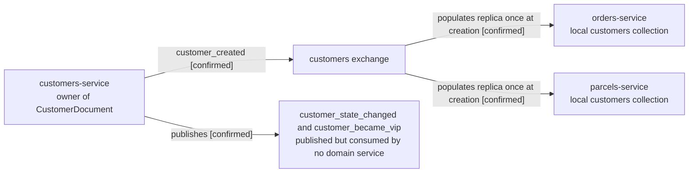

Both replicas are written **once**, from `customer_created`, and never reconciled; the two update
events that would reconcile them have no handler in any repository `[confirmed]`. `pricing-service`
takes the opposite trade-off — it holds no replica and reads customer state live over HTTP on every
call, which makes it the one place on the platform where customer state is always fresh and also the
one place that cannot answer at all while `customers-service` is down `[confirmed]`.

**Evidence references:** `repo-inventory.md` §3.1 (the sync call table with a client-class path per
edge), §3.2 (exchange and subscriber tables derived from `Events/External/Handlers/*.cs`), §3.3
(shared libraries), §3.5 (data stores and the replication table);
`Orders.Infrastructure/Mongo/Documents/CustomerDocument.cs`;
`Parcels.Infrastructure/Mongo/Documents/CustomerDocument.cs`;
`Customers.Infrastructure/Mongo/Documents/CustomerDocument.cs`.

**Gaps:** there is **no first-party shared library and no shared contracts package** in the
workspace `[confirmed]` — `CustomerCreated` exists as four independent C# classes and
`ResourceReserved` as three, and the only binding contract is the `snake_case` name on the wire
(§6 GAP-17). How the Pact file travels between `orders-service` (consumer) and `parcels-service`
(provider) is `[unknown]` — both have a `PACT/` directory and `Pactify` 1.1.0 but no broker
configuration exists in either repository or either `.travis.yml` (§6 GAP-18). No repository
ownership metadata exists anywhere, so no edge in this graph can be routed to a responsible team
(§6 GAP-19).

---

## 3. Runtime Interaction Flows

Five flows are generated. Each preserves **every evidenced hop** — gateway, Fabio, exchange, queue —
and no step is added to make a flow look complete. Where an intermediate step or actor could not be
evidenced it is marked in the diagram and named under **Unknowns** rather than invented.

### 3.1 Synchronous write path — order creation and parcel attachment — [Confidence: partial]

```mermaid
sequenceDiagram
    actor Client
    participant GW as "api-gateway sync config"
    participant FAB as "Fabio 9999"
    participant ORD as "orders-service"
    participant PAR as "parcels-service"
    participant ODB as "MongoDB orders-service"
    participant MQ as "RabbitMQ orders exchange"
    participant OPS as "operations-service"

    Client->>GW: POST /orders with Bearer JWT [confirmed]
    GW->>GW: validate JWT validIssuer pacco [confirmed]
    GW->>FAB: downstream call - docker configs set useLocalUrl false [confirmed]
    FAB->>ORD: POST orders [confirmed]
    ORD->>ORD: dispatch CreateOrder command [confirmed]
    ORD->>ODB: write orders collection via IMongoRepository [confirmed]
    ORD->>MQ: publish order_created OrderId CustomerId via outbox [confirmed]
    ORD-->>FAB: HTTP response [inferred]
    FAB-->>GW: HTTP response [inferred]
    GW-->>Client: downstream result returned in sync mode [confirmed]
    Client->>GW: POST parcel onto order route with Bearer JWT [confirmed]
    GW->>FAB: downstream call [confirmed]
    FAB->>ORD: AddParcelToOrder [confirmed]
    ORD->>FAB: GET parcel by id [confirmed]
    FAB->>PAR: forward parcel lookup [confirmed]
    PAR-->>ORD: parcel [confirmed]
    ORD->>ODB: embed parcel in the order document [confirmed]
    ORD->>MQ: publish parcel_added_to_order OrderId ParcelId [confirmed]
    MQ->>OPS: deliver every orders message to the observer [confirmed]
```

**Evidence:** `Pacco.APIGateway/src/Pacco.APIGateway/ntrada.yml` and `ntrada.docker.yml` (module
`orders`, all seven routes as HTTP `downstream`; `useLocalUrl: false` and `loadBalancer.url:
fabio:9999` in the docker variant); `Pacco.Services.Orders.Api/Program.cs` (route table dispatching
`CreateOrder` and `AddParcelToOrder`); `Orders.Infrastructure/Extensions.cs`
(`AddMongoRepository<OrderDocument, Guid>("orders")`, `AddMessageOutbox(o => o.AddMongo())`);
`Orders.Infrastructure/Services/Clients/ParcelsServiceClient.cs`;
`Orders.Application/Events/` (`OrderCreated` carries `OrderId`, `CustomerId`;
`ParcelAddedToOrder` carries `OrderId`, `ParcelId`); `Operations.Api/Infrastructure/Subscriptions.cs`.

**Assumptions / inferences:** the two `-->>` response hops are drawn as `[inferred]` — the route
table proves the call is a proxied `downstream` in sync mode, but no status code or response body is
recorded in the evidence. Attributing the `GET parcel by id` call to the `AddParcelToOrder` handler
specifically is `[inferred]`: the client class and the outbound edge are `[confirmed]`, the calling
handler is not named in the evidence.

**Unknowns:** which handler issues `GET pricing with customerId and orderPrice` and
`GET vehicle by id` — both edges are `[confirmed]` at the client-class level
(`PricingServiceClient.cs`, `VehiclesServiceClient.cs`) but their position in this sequence is not
evidenced, so they are **not** drawn here. Whether `orders-service` re-validates the caller
independently, or relies entirely on the gateway's `@user_id` rewriting, is `[unknown]`.

### 3.2 Asynchronous write path and outcome observation — resource reservation — [Confidence: partial]

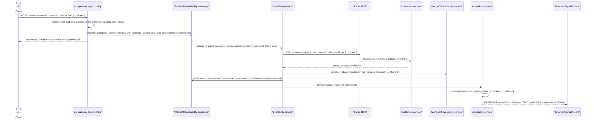

**Evidence:** `ntrada-async.yml` and `ntrada-async.docker.yml` (`exchange: availability`,
`routing_key: reserve_resource`, `bind: customerId: '@user_id'`);
`Pacco.APIGateway/src/Pacco.APIGateway/Infrastructure/CorrelationContextBuilder.cs` and
`SpanContextBuilder.cs` (the `message_context` and `span_context` headers);
`Availability.Api/appsettings.json` (exchange `availability`, queue template
`availability-service/{{exchange}}.{{message}}`, `conventionsCasing: snakeCase`);
`Availability.Infrastructure/Services/Clients/CustomersServiceClient.cs` (certificate attached in
the constructor); `Customers.Api/appsettings.json` (`security.certificate.acl` grants
`availability-service` the `customers:read` permission);
`Availability.Infrastructure/Mongo/Documents/ResourceDocument.cs` with embedded
`ReservationDocument.cs`; `Availability.Application/Events/ResourceReserved` fields;
`Operations.Api/Hubs/PaccoHub.cs` and `wwwroot/ui/js/app.js`
(`withUrl('http://localhost:5005/pacco')`, handlers for `operation_pending` and
`operation_completed`).

**Assumptions / inferences:** none in the drawn steps — every hop is individually evidenced. Note
that `orders-service` and `ordermaker-service` also consume `resource_reserved` `[confirmed]`; they
are omitted from this diagram only because they are separate consumers of the same event, not steps
in this flow.

**Unknowns:** **how the client learns the operation id it must watch for.** The gateway returns no
domain result for this route and nothing in any `ntrada*.yml` hands the caller an operation
identifier, yet `operations-service` is how outcomes become visible. This is the single largest hole
in the async architecture (§6 GAP-20). Also `[unknown]`: whether the `operation_completed` push is
scoped to the requesting user (§6 GAP-16), and whether an operation surviving longer than the
300-second Redis expiry is still observable (§6 GAP-14).

### 3.3 Authentication, registration and session propagation — [Confidence: partial]

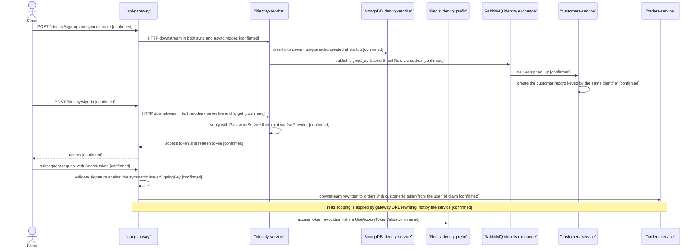

**Evidence:** `ntrada*.yml` module `identity` (all four routes are HTTP `downstream` in **both**
modes; `POST /sign-up`, `POST /sign-in` and `GET /` are the only anonymous routes; `auth` section
with `validIssuer: pacco`, `validateAudience: false`, symmetric `issuerSigningKey`);
`Identity.Infrastructure/Auth/JwtProvider.cs`, `PasswordService.cs`, `Rng.cs`;
`Identity.Infrastructure/Mongo/Extensions.cs` (unique index on `users` at startup);
`Identity.Api/Program.cs` (`UseAccessTokenValidator()`, seven routes);
`Customers.Application/Events/External/Handlers/` (`signed_up` handler);
`ntrada*.yml` `bind`/`@user_id` substitution on `/customers/me`, `/orders`, `/parcels`, `/pricing`.

**Assumptions / inferences:** that the `UserId` minted here becomes the `CustomerId` used platform
wide is stated in `repo-summary/Pacco.Services.Identity.md` §6 as a contractual, not referential,
coupling — treated as `[confirmed]` at the narrative level, `[unknown]` at the field level since no
identifier mapping code was cited.

The final Redis hop is `[inferred]`, not `[confirmed]`, and is drawn outside the request ordering
because no source in this repository shows *when* it happens. The in-repo evidence is exactly three
lines: `AddRedis()` (`Identity.Infrastructure/Extensions.cs:82`), `UseAccessTokenValidator()`
(same file, line 97) and one `IAccessTokenService.DeactivateAsync(...)` call
(`Identity.Api/Program.cs:59`). `IAccessTokenService` and the store it writes to are supplied by the
**Convey.Security** package, which is not part of this workspace — so that Redis is the revocation
backing store is a reasonable reading of the registration, not something the code here proves. This
is the same single-registration situation that led §1.1 and §2 to demote the other six services'
Redis edges, and it is labelled consistently. See §1.1.

**Unknowns:** the three token-management routes — `POST access-tokens/revoke`,
`POST refresh-tokens/use`, `POST refresh-tokens/revoke` — have **no gateway route in any of the four
configurations**, so no external caller can reach them `[confirmed]` and how tokens are refreshed or
revoked in practice is `[unknown]` (§6 GAP-21). `messages.json` declares a `sign_up` command and
`Identity.Api/Program.cs` calls `SubscribeCommand<SignUp>()`, but **no `ntrada-async.yml` route
publishes to the `identity` exchange** and no service publishes `sign_up` — the message path into
this service has no evidenced producer (§6 GAP-4). Whether `identity-service` and the gateway share
one trust root, given the gateway validates with a symmetric key and this service also holds
certificates, is `[unknown]`.

### 3.4 Order-making saga — cross-service orchestration — [Confidence: partial]

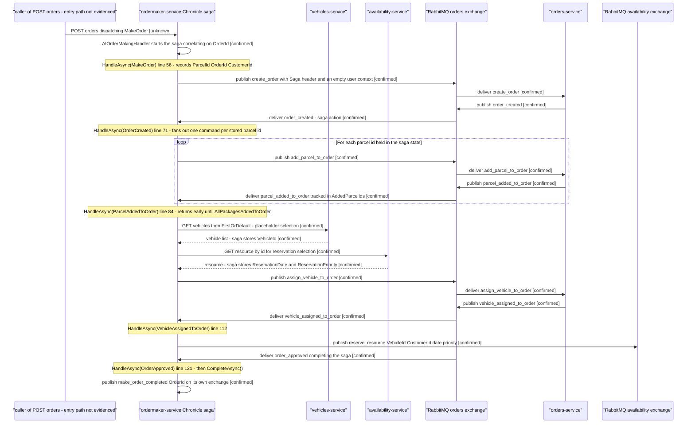

**Evidence:** `Pacco.Services.OrderMaker/Sagas/AIOrderMakingSaga.cs` —
`Saga<AIMakingOrderData>` implementing `ISagaStartAction<MakeOrder>`, `ISagaAction<OrderCreated>`,
`ISagaAction<ParcelAddedToOrder>`, `ISagaAction<VehicleAssignedToOrder>`,
`ISagaAction<OrderApproved>`, with `ResolveId` mapping every message to `OrderId` and
`const string SagaHeader = "Saga"`; `Sagas/AIMakingOrderData.cs` (`OrderId`, `CustomerId`,
`VehicleId`, `ReservationDate`, `ReservationPriority`, `ParcelIds`, `AddedParcelIds`,
`AllPackagesAddedToOrder`); `Handlers/AIOrderMakingHandler.cs`;
`Services/Clients/VehiclesServiceClient.cs` (carries the comment `// typical AI in a startup` above
the `FirstOrDefault()`); `Services/Clients/AvailabilityServiceClient.cs`;
`Services/ResourceReservationsService.cs`; `Pacco.Services.OrderMaker/Program.cs`.

**The ordering above is read directly from the five handler bodies, not inferred.** Each `Note over
OM` names the handler and its line number in `Sagas/AIOrderMakingSaga.cs`, so the sequence can be
checked against the source line by line. Two points that a naive reading of the command list gets
wrong:

- **The two HTTP lookups happen late, not up front.** `GetBestAsync()` on `VehiclesServiceClient`
  (line 93) and `_resourceReservationsService.GetBestAsync(...)` (line 98) are both inside
  `HandleAsync(ParcelAddedToOrder)`, *after* the `if (!Data.AllPackagesAddedToOrder) return;` guard
  at lines 87-90. They therefore run once, after the last parcel is acknowledged — not before
  `create_order`. An earlier revision of this document drew them first; that was wrong.
- **`reserve_resource` is drawn, and its position is evidenced.** It is the sole statement of
  `HandleAsync(VehicleAssignedToOrder)` (line 112-119), publishing onto the **`availability`**
  exchange — hence the separate `MQA` participant. An earlier revision omitted it on the stated
  grounds that its position was unevidenced; the handler body evidences it exactly.

**`approve_order` is not published by this saga, and has no producer anywhere in the workspace.**
`Commands/External/ApproveOrder.cs` declares the type, but a repository-wide grep returns that file
alone — the saga never publishes it, and it implements `ISagaAction<OrderApproved>`, *consuming* the
inbound event rather than triggering it. Nor does any other component produce the command:
`orders-service` **subscribes** to it (`Orders.Infrastructure/Extensions.cs:95`,
`SubscribeCommand<ApproveOrder>()`) and its `ApproveOrderHandler` is what publishes `order_approved`,
but no `ntrada-async.yml` route carries an `approve_order` routing key (the `orders` module publishes
only `create_order`, `delete_order`, `add_parcel_to_order`, `delete_parcel_from_order` and
`assign_vehicle_to_order`) and no service publishes it. **The saga therefore has no evidenced path
to its own terminal state**: it waits on `order_approved`, which only `ApproveOrderHandler` emits,
which only an unproduced command can trigger. This is recorded as an unused-contract gap in §6
(GAP-24) and is a stronger finding than the missing entry point alone.

**Unknowns:** the first message has no evidenced sender — `ordermaker-service` has no module in any
of the four gateway configurations and appears in neither PM2 manifest, while both Compose stacks
run it on port 5015 (§6 GAP-2). Where Chronicle persists the saga state is `[unknown]` (§6 GAP-12).
Whether `orders-service` and `availability-service` accept commands carrying an **empty**
`CorrelationContext.UserContext` is `[unknown]` (§6 GAP-13). This service has **no Jaeger tracing
and no transactional outbox** `[confirmed]`, so neither this sequence nor a failure inside it can be
reconstructed from telemetry, and a crash between a saga step and its publish drops the command
silently.

### 3.5 Delivery lifecycle closing the order — [Confidence: partial]

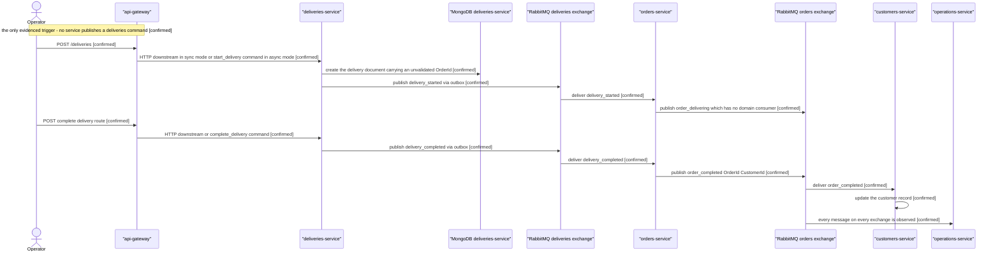

**Evidence:** `Deliveries.Api/Program.cs` (five routes); `ntrada*.yml` module `deliveries`
(`start_delivery`, `fail_delivery`, `complete_delivery`, `add_delivery_registration` routing keys in
the async variants); `Deliveries.Infrastructure/Mongo/Documents/DeliveryDocument.cs` with embedded
`DeliveryRegistrationDocument.cs`; `Orders.Application/Events/External/Handlers/` (handlers for
`delivery_started`, `delivery_completed`, `delivery_failed`);
`Customers.Application/Events/External/Handlers/` (`order_completed` handler);
`repo-inventory.md` §3.2 subscription table.

**Assumptions / inferences:** whether handling `order_completed` is what promotes a customer to VIP
is `[inferred]` — `Customers.Core/Entities/Customer.cs` holds the VIP rule and `customer_became_vip`
is published, but the evidence does not state that this handler is the trigger. The step is
therefore drawn as a neutral "update the customer record".

**Unknowns:** **who or what starts a delivery.** `deliveries-service` subscribes to no external
event and no service publishes a `deliveries` command, so the only entry point in the entire
workspace is a human calling the gateway route — whether an external dispatch system is meant to
drive it is `[unknown]` (§6 GAP-5). `delivery_failed` is published and consumed by `orders-service`
`[confirmed]` but the resulting order state transition is not evidenced and is not drawn.
`order_delivering` reaches no domain consumer `[confirmed]`.

---

## 4. Deployment Topology

Two — and only two — deployment mechanisms exist in the workspace: **Docker Compose** stacks under
`Pacco/compose/`, and **PM2** process manifests at the `Pacco` repository root. There is **no
Kubernetes manifest, no Helm chart, no Terraform, no Kustomize and no cloud-provider template
anywhere in the thirteen repositories** `[confirmed]`. Nothing below is drawn from a hosting
convention or from what a platform of this shape usually runs on.

This section describes **packaging and process placement only**. Container start ordering
`depends_on`, network membership and port publication are deployment facts and are deliberately kept
out of §1 to §3 — none of them is evidence that two components talk to each other at runtime.

### 4.1 Docker Compose topology — [Confidence: confirmed]

```mermaid
graph TD
    subgraph NET["Docker network pacco-network"]
        subgraph INFRA["compose/infrastructure.yml - shared infrastructure"]
            MONGO["mongo - one server, one logical database per service"]
            RABBIT["rabbitmq - built from compose/rabbitmq/Dockerfile"]
            REDIS["redis - one instance partitioned by key prefix"]
            CONSUL["consul - service registry"]
            FABIO["fabio - load balancer on 9999"]
            VAULT["vault - secrets and PKI"]
            JAEGER["jaeger - distributed tracing"]
            SEQ["seq - structured log sink"]
            PROM["prometheus - metrics scraper"]
            GRAF["grafana - metrics dashboards"]
        end
        subgraph SVC["compose/services.yml - eleven deployables"]
            GW["api-gateway on 5000"]
            AV["availability-service on 5001"]
            CU["customers-service on 5002"]
            DEL["deliveries-service on 5003"]
            ID["identity-service on 5004"]
            OPS["operations-service on 5005"]
            ORD["orders-service on 5006"]
            PAR["parcels-service on 5007"]
            PRI["pricing-service on 5008"]
            VEH["vehicles-service on 5009"]
            OM["ordermaker-service on 5015"]
        end
    end
    CLIENT["external client"]
    CLIENT -->|"published port 5000"| GW
    CLIENT -->|"published port 5005 for the SignalR hub"| OPS
    OPS -->|"depends_on - container start ordering only"| OM
    PROM -->|"scrapes the metrics endpoint"| GW
```

**Evidence references**

- `Pacco/compose/infrastructure.yml` — every node in the `INFRA` group, all attached to
  `pacco-network`.
- `Pacco/compose/services.yml` and `Pacco/compose/services-local.yml` — the eleven service
  containers and their published ports; `ordermaker-service` at `services.yml:78-85` and
  `services-local.yml:78-85`; the **`operations-service`** `depends_on` block at `services.yml:51-67`,
  which lists `ordermaker-service` at line 65.
- `Pacco/compose/rabbitmq/Dockerfile` — the broker image, exposing 5672, 15672 and 15692.
- `Pacco/compose/prometheus/prometheus.yml` — scrape targets, all of which are plain **container
  names**: `api-gateway` at lines 10-12 (`targets: ['api-gateway']`) and `ordermaker-service` at
  lines 38-40. No target in this file uses a host-mapped address.
- `Pacco/docker-images.txt:377` — the only occurrence of the
  `docker.for.mac.localhost:5000` scrape target in the workspace. It appears in an embedded sample
  configuration in that text file, **not** in the live `compose/prometheus/prometheus.yml`.
- `Pacco/compose/services.yml` — `NTRADA_CONFIG=ntrada-async.docker.yml` on the gateway container.

**Reading notes and deliberate omissions**

- The `depends_on` arrow runs from **`operations-service`**, not from the gateway. The single
  `depends_on` block in `compose/services.yml` belongs to the `operations-service` definition
  (lines 51-67) and lists eight services including `ordermaker-service`; the `api-gateway` block
  (lines 4-13) has **no `depends_on` key at all**. It is drawn **as a deployment relation and
  labelled as such** — not a runtime call. `api-gateway` has no route to `ordermaker-service` in any
  configuration, so nothing here gives the service an evidenced caller; the GAP-2 conclusion is
  unchanged, but it no longer rests on a gateway `depends_on` that does not exist.
- The client-to-`operations-service` arrow on port 5005 is drawn because the browser code connects
  to that port directly rather than through the gateway `[confirmed]`.
- Only one Prometheus edge is drawn, to the gateway, to keep the diagram legible. Prometheus scrapes
  every service container `[confirmed]` — that is stated here rather than drawn ten more times.
- Per-service arrows into `mongo`, `rabbitmq`, `redis`, `consul`, `fabio`, `vault` and `jaeger` are
  **not** drawn. Which services actually hold a runtime dependency on each is settled in §1 and §2
  from code evidence; repeating it here from network membership would be exactly the inference the
  guardrails forbid.

### 4.2 Compose deployables versus PM2 applications — [Confidence: confirmed]

`Pacco/services.yml` and `Pacco/prod-services.yml` are **PM2 manifests, not Compose files**, despite
the shared filename shape `[confirmed]`. They enumerate **ten** applications. Compose enumerates
**eleven** containers. The difference is `ordermaker-service`.

| Deployable | Compose `compose/services.yml` | PM2 `services.yml` | Port |
|---|---|---|---|
| api-gateway | yes | yes | 5000 |
| availability-service | yes | yes | 5001 |
| customers-service | yes | yes | 5002 |
| deliveries-service | yes | yes | 5003 |
| identity-service | yes | yes | 5004 |
| operations-service | yes | yes | 5005 |
| orders-service | yes | yes | 5006 |
| parcels-service | yes | yes | 5007 |
| pricing-service | yes | yes | 5008 |
| vehicles-service | yes | yes | 5009 |
| **ordermaker-service** | **yes** | **no** | **5015** |

`ordermaker-service` is therefore reachable in a Compose environment and **absent from a PM2
environment** `[confirmed]`. Combined with its absence from all four gateway configurations, the
service is deployed but has no evidenced caller (§6 GAP-2).

### 4.3 Gateway configuration selection — [Confidence: partial]

Four gateway configurations exist and exactly one is active per process, chosen by the
`NTRADA_CONFIG` environment variable `[confirmed]`.

| Configuration | Mode | Service addressing |
|---|---|---|
| `ntrada.yml` | synchronous — all routes proxied `downstream` | `useLocalUrl: true`, localhost 5001 to 5009 |
| `ntrada.docker.yml` | synchronous | `useLocalUrl: false`, via `fabio:9999` |
| `ntrada-async.yml` | asynchronous — 20 write routes published to RabbitMQ | `useLocalUrl: true` |
| `ntrada-async.docker.yml` | asynchronous | `useLocalUrl: false`, via `fabio:9999` |

`Pacco/compose/services.yml` sets `NTRADA_CONFIG=ntrada-async.docker.yml` `[confirmed]`. **No
evidence names the configuration used in any other environment**, and the PM2 manifests do not set
the variable `[confirmed]`, so which configuration is authoritative outside Compose is `[unknown]`
(§6 GAP-3). This matters more than a normal configuration flag: the two modes produce **materially
different architectures** — in synchronous mode a write is a proxied HTTP call that returns a domain
result, and in asynchronous mode the same write becomes a fire-and-forget publish whose outcome is
only observable through `operations-service`.

### 4.4 Documentation-versus-code conflict in the infrastructure runbook

`Pacco/docker-images.txt` documents container images for **SQL Server, PostgreSQL, InfluxDB,
Elasticsearch, Kibana and Logstash**.

- **Documentation claim:** these datastores and the ELK logging stack are part of the platform's
  infrastructure — `Pacco/docker-images.txt`.
- **Code reality:** **no service references any of them.** Every service `appsettings.json` sets
  `influxEnabled: false` and `elk.enabled: false`, every persistence registration is MongoDB, and no
  SQL or Elasticsearch client package appears in any `.csproj` in the workspace `[confirmed]`.
- **Resolution:** the source code is authoritative. These components are **not** drawn in any
  diagram in this document. Whether the runbook records a **Future/Intended State (Not
  Implemented)** or leftovers from an earlier topology cannot be determined from the evidence and is
  recorded as `[unknown]` (§6 GAP-22). The discrepancy is **not** silently reconciled.

The same file contains **Vault unseal key shares and a root token in plaintext**, and a symmetric JWT
`issuerSigningKey` is committed in all four `ntrada*.yml` files and in
`Pacco.Services.Operations.Api/appsettings.json` `[confirmed]`. These are recorded **by path only**;
no secret material is reproduced here. Whether any of it is live is `[unknown]` (§6 GAP-10).

### 4.5 Build and release automation

No CI or CD pipeline definition exists in the orchestration repository `[confirmed]`. Individual
service repositories were not observed to carry a shared pipeline template either. Whether images
are built by hand or by a pipeline outside the workspace is `[unknown]`.

---

## 5. Entity Relationship Views

Persistence evidence is strong: every data-owning service registers its collections explicitly
through `AddMongoRepository<TDocument, TIdentifiable>("<collection>")`, and the document classes are
named in the evidence. These views are therefore generated from **registered collections and
document classes**, not from domain entity names.

Two constraints shape every diagram below.

1. **Each service owns a separate logical database on one shared MongoDB server** `[confirmed]`.
   There are **no cross-database foreign keys**, because MongoDB has none and none is emulated in
   code. Where one service's document holds another service's identifier, that is a **value copied
   over a message or an HTTP response**, not a reference the database enforces. Cross-service links
   are therefore kept out of the diagrams and listed in §5.8 instead.
2. **No schema migration tooling exists anywhere in the workspace** `[confirmed]`. Collections are
   created implicitly on first write. The single exception is `identity-service`, which creates a
   unique index at startup.

### 5.1 availability-service — [Confidence: confirmed]

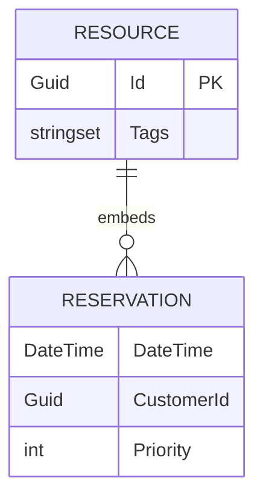

`AddMongoRepository<ResourceDocument, Guid>("resources")`. `ReservationDocument` is an **embedded
document inside `ResourceDocument`**, not a collection of its own `[confirmed]` — reservations have
no independent lifetime and cannot be queried without their resource. `CustomerId` is stored as a
plain value.

### 5.2 customers-service — [Confidence: confirmed]

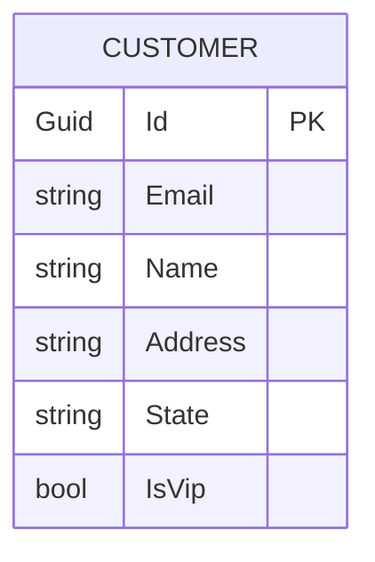

`AddMongoRepository<CustomerDocument, Guid>("customers")`. This is the **owning** copy of customer
data. `Core/Entities/Customer.cs` and `State.cs` hold the state machine; the VIP rule lives here.

### 5.3 orders-service — [Confidence: confirmed]

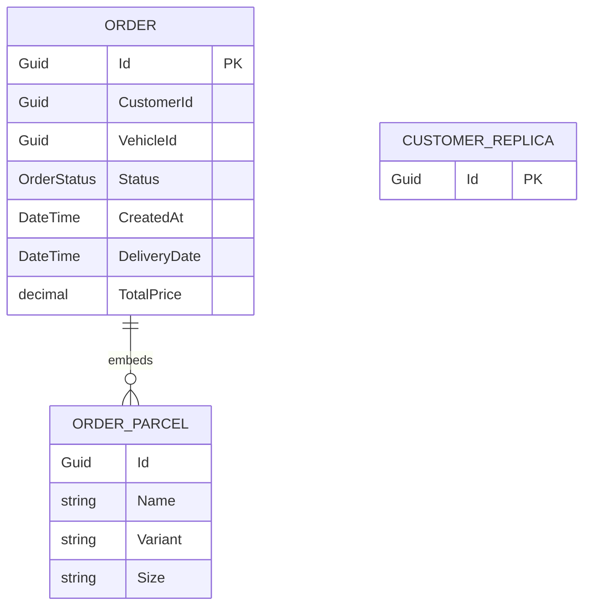

Two collections are registered: `AddMongoRepository<OrderDocument, Guid>("orders")` and
`AddMongoRepository<CustomerDocument, Guid>("customers")` `[confirmed]`. `CUSTOMER_REPLICA` is drawn
as a **standalone entity with no relationship line to `ORDER`**, deliberately: the order document
stores a `CustomerId` value, but nothing joins the two and nothing enforces that the replica
contains a matching row. The replica is populated **only** by the `customer_created` handler and is
never reconciled `[confirmed]` — see §2 and §6 GAP-23.

Parcels are **embedded in the order document** `[confirmed]`, so an order carries its own snapshot of
parcel data separate from the `parcels-service` copy.

Field names and types above are transcribed from
`Orders.Infrastructure/Mongo/Documents/OrderDocument.cs`. Two details matter for anyone reading the
two parcel shapes side by side: the embedded `OrderDocument.Parcel` names its key **`Id`**, not
`ParcelId` — it is the parcel's own identifier copied into the order, and an earlier revision of this
document renamed it — and inside this embedded class `Variant` and `Size` really are **`string`**,
whereas the owning `ParcelDocument` in §5.4 declares them as enums. The snapshot is a
*stringified projection* of the source record, which is part of why the two copies can diverge.
`Status` is the `OrderStatus` enum, and `DeliveryDate` is a nullable `DateTime?` set when a delivery
is scheduled.

### 5.4 parcels-service — [Confidence: confirmed]

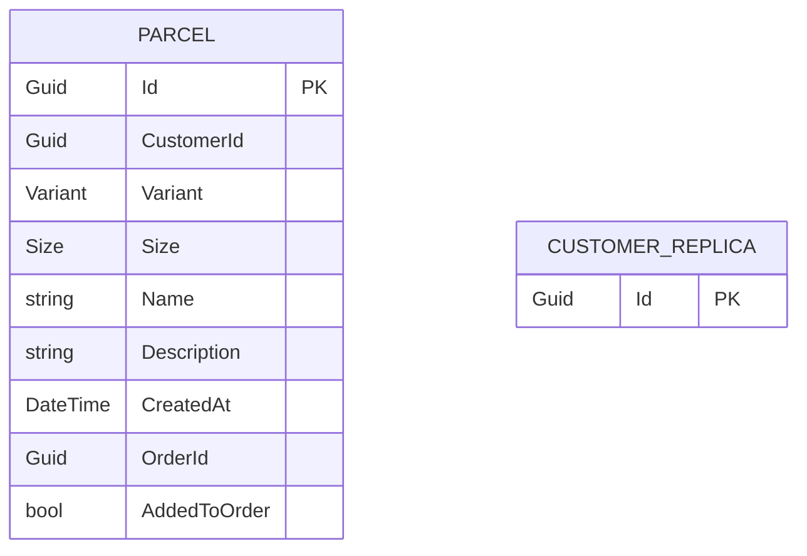

`AddMongoRepository<ParcelDocument, Guid>("parcels")` plus the same
`AddMongoRepository<CustomerDocument, Guid>("customers")` replica `[confirmed]`. `ParcelDocument`
carries an `OrderId` **as a value written when the parcel is attached to an order**; the authoritative
membership list is the embedded array inside the order document in §5.3. The two copies can diverge
and nothing reconciles them `[confirmed]`.

All nine fields are transcribed from
`Parcels.Infrastructure/Mongo/Documents/ParcelDocument.cs`. `Variant` and `Size` are the **enums**
`Pacco.Services.Parcels.Core.Entities.Variant` and `.Size`, not strings — the string forms in the
§5.3 embedded snapshot are a projection made when the parcel is copied into an order. The timestamp
is **`CreatedAt`**; there is no `AddedAt` field, despite an earlier revision of this document naming
one. `OrderId` is nullable (`Guid?`) and is paired with the redundant boolean `AddedToOrder`, so
attachment state is stored **twice in the same document** with no constraint keeping the two in
agreement — a row with `AddedToOrder == true` and a null `OrderId` is representable.

### 5.5 deliveries-service — [Confidence: confirmed]

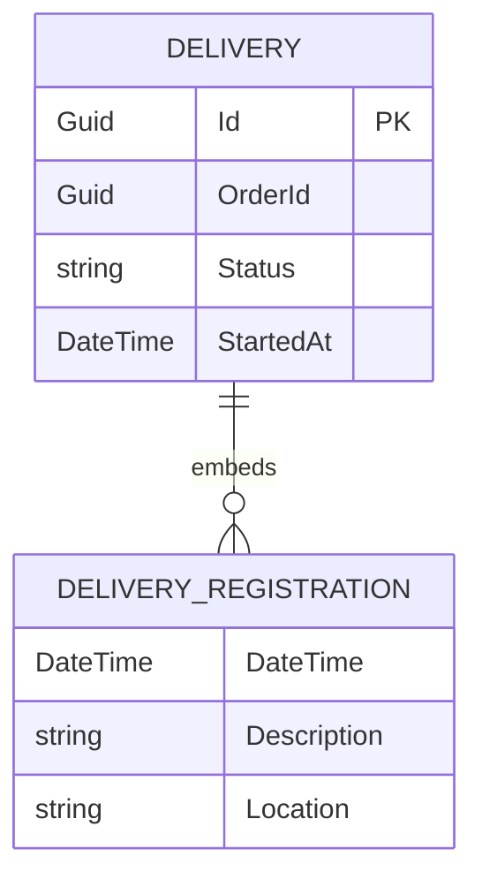

`AddMongoRepository<DeliveryDocument, Guid>("deliveries")` with `DeliveryRegistrationDocument`
embedded `[confirmed]`. `OrderId` is stored **without any validating call** — this service holds no
HTTP client for `orders-service` and subscribes to no external event `[confirmed]`, so a delivery can
be created against an order identifier that does not exist.

### 5.6 identity-service — [Confidence: confirmed]

```mermaid
erDiagram
    USER ||--o{ REFRESH_TOKEN : "issues"
    USER {
        Guid Id PK
        string Email UK
        string Password
        string Role
        DateTime CreatedAt
    }
    REFRESH_TOKEN {
        Guid Id PK
        Guid UserId FK
        string Token
        DateTime CreatedAt
        DateTime RevokedAt
    }
```

Two collections: `AddMongoRepository<UserDocument, Guid>("users")` and
`AddMongoRepository<RefreshTokenDocument, Guid>("refreshTokens")` `[confirmed]`. This is the **only
service-to-service relationship in the workspace backed by an explicit stored identifier plus a
schema constraint**: `RefreshTokenDocument.UserId` points at a user, and
`Identity.Infrastructure/Mongo/Extensions.cs` creates a **unique index on the user email at
startup** — the only schema-shaping code found anywhere `[confirmed]`.

### 5.7 vehicles-service — [Confidence: confirmed]

```mermaid
erDiagram
    VEHICLE {
        Guid Id PK
        string Brand
        string Model
        string Description
        decimal PricePerService
        stringset Variants
    }
```

`AddMongoRepository<VehicleDocument, Guid>("vehicles")` `[confirmed]`. No inbound coupling — no other
service replicates vehicle data; `orders-service` stores only a `VehicleId` value.

`pricing-service` and `ordermaker-service` are **absent from this section on purpose**.
`pricing-service` registers **no data store at all** and computes from its inputs `[confirmed]`.
`ordermaker-service` has **no `Convey.Persistence.MongoDB` package** `[confirmed]`; its saga state is
held by Chronicle with no configured backend (§6 GAP-12). `operations-service` configures
`mongo.database: operations-service` but **never calls `AddMongoRepository`** `[confirmed]`, so it has
no evidenced entity model (§6 GAP-14).

### 5.8 Cross-service identifier links — not database relationships

These are drawn as a table rather than as a diagram, because rendering them as ER relationships would
assert referential integrity that does not exist.

| Identifier | Held by | Owned by | How it gets there | Enforced? |
|---|---|---|---|---|
| `CustomerId` | `resources.reservations`, `orders`, `parcels` | customers-service | HTTP lookup or `customer_created` event | no |
| `VehicleId` | `orders` | vehicles-service | synchronous `GET vehicle by id` at write time | no |
| `OrderId` | `parcels`, `deliveries` | orders-service | command payload | no |
| `ParcelId` | embedded in `orders` | parcels-service | synchronous `GET parcel by id` at write time | no |
| `UserId` as `CustomerId` | every service | identity-service | `signed_up` then `customer_created` | no |

Every row is a **value copy validated once, if at all, at write time** `[confirmed]`. Nothing detects
or repairs later divergence — no service subscribes to a delete event for an identifier it stores,
with the single exception of `parcels-service` handling `order_canceled` and `order_deleted`
`[confirmed]`. Most visibly, `orders-service` stores `VehicleId` but has **no `vehicle_deleted`
handler**, although `availability-service` does `[confirmed]` (§6 GAP-8).

---

## 6. Open Questions and Gaps

Every gap identifier forward-referenced from §1 to §5 is defined here, and every entry below is
mirrored into the final **Assumptions, Blockers & Open Questions** section. A gap is recorded here
when the evidence was **absent or contradictory**, not when it was merely inconvenient — in each case
the alternative was to draw a relationship that the code does not prove, and omission was chosen.

### 6.1 Missing source evidence

| ID | Gap | Classification |
|---|---|---|
| GAP-1 | `Pacco.Web` is an empty repository — no source, no build file, no README beyond the default. The platform's web client cannot be described, so no C1 diagram places a browser client against a front end, and subsystem S7 stays unclassified. | **Unverifiable — Missing Source Evidence** |

### 6.2 Reachability and entry points

| ID | Gap | Evidence | Why it matters |
|---|---|---|---|
| GAP-2 | Nothing evidenced calls `ordermaker-service`. It exposes `POST /orders` and runs on port 5015 in both Compose stacks, but has **no module in any of the four `ntrada*.yml` configurations** and **no entry in either PM2 manifest**. | `ntrada.yml`, `ntrada.docker.yml`, `ntrada-async.yml`, `ntrada-async.docker.yml`; `Pacco/services.yml`; `Pacco/compose/services.yml:78-85` | The saga in §3.4 is the platform's only orchestration, and its trigger is undrawable. Its caller is shown as `[unknown]`. |
| GAP-3 | Which gateway configuration is authoritative per environment. Compose pins `NTRADA_CONFIG=ntrada-async.docker.yml`; nothing sets it elsewhere. | `Pacco/compose/services.yml` | Sync and async modes are **different architectures** for the same 20 write routes — §3.1 and §3.2 are both real, and which one runs is undetermined. |
| GAP-5 | What triggers `start_delivery`. `deliveries-service` subscribes to **no** external event and no service publishes a `deliveries` command. The only evidenced entry point is a caller hitting the gateway route directly. | `Deliveries.Api/Program.cs`; `ntrada-async.yml`; `repo-inventory.md` §3.2 | The order lifecycle in §3.5 has a manual break in the middle of what looks like an automated flow. |
| GAP-21 | Three `identity-service` routes — `POST access-tokens/revoke`, `POST refresh-tokens/use`, `POST refresh-tokens/revoke` — have **no gateway route in any configuration**, so no external caller can reach them. | `Identity.Api/Program.cs`; all four `ntrada*.yml` | Token refresh and revocation, which the service implements, are externally unreachable. |
| GAP-20 | How a client learns the operation id it must observe after an async write. The gateway returns no domain result and no configuration hands back an identifier, yet `operations-service` is the only place outcomes surface. | `ntrada-async*.yml`; `Operations.Api/Hubs/PaccoHub.cs`; `wwwroot/ui/js/app.js` | Without this, async mode has a write path with no evidenced completion path. |

### 6.3 Contract and message-catalogue discrepancies

| ID | Gap | Documentation or catalogue claim | Code reality |
|---|---|---|---|
| GAP-4 | Nothing publishes `sign_up`. `Identity.Api/Program.cs` calls `SubscribeCommand<SignUp>()` and `messages.json` lists the command, but **no gateway route publishes to the `identity` exchange** — the async configurations publish to six exchanges and `identity` is not among them. | The catalogue and the subscription imply a message-driven sign-up path. | Identity routes are HTTP `downstream` in **both** modes. The subscriber has no evidenced producer. Code is authoritative. |
| GAP-6 | `Availability.Application` names the command `ReleaseResourceReservation` and the rejection `ReleaseResourceReservationRejected`, which serialise under `snakeCase` conventions to `release_resource_reservation` and `release_resource_reservation_rejected`. | `messages.json` records `release_resource`, and `ntrada-async.yml` sets `routing_key: release_resource`. | The class names are authoritative for what the service binds. The routing key the gateway publishes and the queue the service binds **do not match**. Recorded, **not reconciled**. |
| GAP-17 | No shared contracts package exists. `CustomerCreated` is **four independent C# classes** in four repositories; `ResourceReserved` is three. Compatibility rests on `messages.json`, which is hand-maintained. | — | A field added on one side is silently absent on the other. This is the mechanism by which GAP-6 became possible. |
| GAP-22 | `Pacco/docker-images.txt` documents SQL Server, PostgreSQL, InfluxDB, Elasticsearch, Kibana and Logstash. | The runbook presents them as platform infrastructure. | **No service uses any of them** — `influxEnabled: false` and `elk.enabled: false` everywhere, every persistence registration is MongoDB. Excluded from all diagrams. Whether this is a **Future/Intended State (Not Implemented)** or a leftover is `[unknown]`. |
| GAP-24 | **`approve_order` has no producer anywhere in the workspace, yet the order-making saga cannot terminate without it.** `OrderMaker/Commands/External/ApproveOrder.cs` declares the command and is referenced by nothing — a workspace-wide grep returns that file alone. `AIOrderMakingSaga.cs` never publishes it; it implements `ISagaAction<OrderApproved>` and consumes the resulting event. | `orders-service` **subscribes** to the command (`Orders.Infrastructure/Extensions.cs:95`) and `ApproveOrderHandler` is the only emitter of `order_approved`. `messages.json` lists `approve_order` under the `orders` exchange. | No `ntrada-async*.yml` route carries an `approve_order` routing key — the `orders` module publishes only `create_order`, `delete_order`, `add_parcel_to_order`, `delete_parcel_from_order` and `assign_vehicle_to_order` — and no service publishes it. The saga blocks at `HandleAsync(OrderApproved)` forever, so §3.4 has **no evidenced path to `CompleteAsync()`**. Recorded, **not reconciled**: whether the trigger is a missing gateway route, a missing operator tool, or **Future/Intended State (Not Implemented)** is `[unknown]`. |
| GAP-25 | The message catalogue under-reports `orders-service` by one rejected event. `messages.json` lists **10** rejected events for the `orders` exchange, but `Orders.Application/Events/Rejected/` contains **11** classes — `complete_order_rejected` (`CompleteOrderRejected.cs`) is absent from the catalogue. | `Pacco.Services.Operations.Api/messages.json` (orders `rejectedEvents`, 10 entries); `Orders.Application/Events/Rejected/` (11 files). | `Operations.Api/Infrastructure/Subscriptions.cs` binds **exactly** the names in `messages.json`, so `complete_order_rejected` is published by `orders-service` and **observed by nothing**. A failed order completion is invisible to the one component that exists to make outcomes visible. This is GAP-17's hand-maintained-catalogue risk materialising a second time, after GAP-6. |

### 6.4 Unconsumed and unreconciled data

| ID | Gap | Evidence | Why it matters |
|---|---|---|---|
| GAP-7 | `customer_state_changed` and `customer_became_vip` are published but consumed by **no domain service** — only by `operations-service`, which observes everything indiscriminately. | `repo-inventory.md` §3.2; `Operations.Api/Infrastructure/Subscriptions.cs` | Either a consumer is missing or these events exist only for observation. Undetermined. |
| GAP-8 | `orders-service` stores `VehicleId` on every order but has **no `vehicle_deleted` handler**, although `availability-service` does. | `Orders.Infrastructure/Mongo/Documents/OrderDocument.cs`; `repo-inventory.md` §3.2 | Orders can hold a vehicle identifier that no longer exists, with no detection path. |
| GAP-23 | The `customers` collection replicated into `orders-service` and `parcels-service` is populated **only** by the `customer_created` handler and is **never reconciled**. No handler for any later customer event exists in either service. | `Orders.Infrastructure/Extensions.cs`; `Parcels.Infrastructure/Extensions.cs`; `repo-inventory.md` §3.2 | Both replicas drift permanently from the owning copy after the first customer change. |

### 6.5 Persistence and state

| ID | Gap | Evidence | Why it matters |
|---|---|---|---|
| GAP-12 | Where the Chronicle saga persists its state. `AddChronicle()` is called with **no persistence configuration** and no `Chronicle.Persistence.*` package is referenced, which implies the in-memory default — but that default is **not confirmed** by anything in the evidence. | `Pacco.Services.OrderMaker/Program.cs`; `Pacco.Services.OrderMaker.csproj` | If in-memory, every in-flight multi-service order is lost on restart and cannot be resumed. |
| GAP-14 | `operations-service` state store. `mongo.database: operations-service` is configured but **`AddMongoRepository` is never called**; Redis is registered under the `operations:` prefix with `requests.expirySeconds: 300`. | `Operations.Api/appsettings.json`; `Operations.Api/Infrastructure/Extensions.cs` | Operation history may be a 5-minute Redis window rather than durable storage. §5 assigns this service no entity model for that reason. |
| GAP-9 | `AddRedis()` is registered in eight services with **no evidenced active runtime use** in six of them. Only `identity-service` token revocation and `operations-service` state plus SignalR backplane have supporting code. | service `Program.cs` and `Extensions.cs` files | Redis is drawn as a runtime edge **only** for those two services. Registration alone is not treated as a dependency. |
| GAP-13 | The saga publishes commands with an **empty `CorrelationContext.UserContext`**. | `Pacco.Services.OrderMaker/Sagas/AIOrderMakingSaga.cs` | Whether downstream services accept, reject, or mis-authorise those commands is undetermined, and saga-originated activity is unattributable. |

### 6.6 Observability and contract testing

| ID | Gap | Evidence | Why it matters |
|---|---|---|---|
| GAP-15 | The wire payloads of all 80 `operations-service` subscriptions are unknown. `Subscriptions.cs` emits **field-less types** at runtime through `AssemblyBuilder.DefineDynamicAssembly` and subscribes reflectively. The 80 is counted directly from `messages.json`: 8 exchanges carrying **24 commands, 29 events and 27 rejected events**. | `Operations.Api/Infrastructure/Subscriptions.cs`; `Operations.Api/messages.json` (availability 4/5/4, customers 2/3/2, deliveries 4/4/3, identity 2/2/2, ordermaker 0/1/1, orders 7/9/10, parcels 2/2/2, vehicles 3/3/3 as commands/events/rejected) | The one component that sees every message deserialises none of their contents, so it cannot be used as a contract oracle. The count also bounds what is observable at all: the binding set is exactly `messages.json`, so anything missing from that file — see GAP-25 — is unobserved. |
| GAP-16 | Whether the SignalR hub or the gRPC `SubscribeOperations` stream scopes results to the requesting caller. | `Operations.Api/Hubs/PaccoHub.cs`; `Operations.proto` | If unscoped, one user observes other users' operation outcomes. Not drawable either way. |
| GAP-18 | How the Pact file travels between `orders-service` as consumer and `parcels-service` as provider. `Pactify` 1.1.0 is referenced on both sides with **no broker configured**. | Orders and Parcels test projects | The contract test cannot fail on a real breaking change unless the file is shared by some out-of-band means. |
| GAP-11 | Whether `security.certificate.acl` is enforced or advisory. `customers-service` declares that `availability-service` holds the `customers:read` permission, and the caller attaches a certificate — but no enforcement middleware was observed. | `Customers.Api/appsettings.json`; `Availability.Infrastructure/Services/Clients/CustomersServiceClient.cs` | The east-west authorisation boundary drawn in §3.2 may not actually be enforced. |

### 6.7 Ownership and secrets

| ID | Gap | Evidence | Why it matters |
|---|---|---|---|
| GAP-10 | Whether the committed secrets are live: Vault unseal key shares and a root token in `Pacco/docker-images.txt`, and a symmetric JWT `issuerSigningKey` in all four `ntrada*.yml` files and in `Pacco.Services.Operations.Api/appsettings.json`. | paths above — **no secret values are reproduced in this document** | If live, the platform's trust root and every issued token are compromised. This cannot be determined from the repositories. |
| GAP-19 | No repository carries ownership metadata — no `CODEOWNERS`, no maintainer file, no team annotation in any of the thirteen repositories. | workspace-wide | There is no evidenced owner to route any question in this section to. |

---

## Assumptions, Blockers & Open Questions

> [!IMPORTANT]
> This document contains unresolved items that require attention before or during implementation. Review and resolve before merging downstream artifacts. Each item below is tagged **[ACTION NOW]** (a human must decide or confirm it before this work can safely proceed) or **[handled later by <stage>]** (a named later stage owns and will prove it) — read the tags first to see what, if anything, is yours to act on.

### Assumptions

| # | Assumption | Rationale | Impact if Wrong | Validation Path |
|---|------------|-----------|-----------------|-----------------|
| A1 | The HTTP responses drawn in §3.1 return the downstream result to the caller. | The route table proves the calls are proxied in sync mode, but no status code or body is recorded in the read evidence. | The sync flow in §3.1 would describe a fire-and-forget where a result is expected, changing how callers must be written. | Run the gateway with `ntrada.yml` and observe one `POST /orders` end to end. |
| A2 | ~~`approve_order` is published by the saga after `vehicle_assigned_to_order` is handled.~~ **RETIRED — the validation was performed and the assumption was false.** `HandleAsync(VehicleAssignedToOrder)` (`AIOrderMakingSaga.cs:112-119`) publishes **`ReserveResource`**, not `ApproveOrder`, and the saga never publishes `ApproveOrder` anywhere. | The assumption was drawn from the *presence of the command class*, not from a publish site — an inference the evidence never supported. Reading the handler body settled it. | It was wrong, and §3.4 has been corrected: the fabricated `approve_order` step is removed and the real `reserve_resource` publish is drawn in its place. | **Closed.** The finding is carried forward as GAP-24 — the command has no producer in the workspace, so the saga has no evidenced route to completion. |
| A3 | Handling `order_completed` is what updates the customer record, and possibly promotes to VIP. | The VIP rule lives in `Customers.Core/Entities/Customer.cs` and `customer_became_vip` is published, but no evidence names the trigger. | The last step of §3.5 attributes a state change to the wrong handler. | Read the `order_completed` handler in `Customers.Application/Events/External/Handlers/`. |
| A4 | The identifier minted as `UserId` by `identity-service` is the same value used as `CustomerId` platform wide. | Stated as a contractual coupling in `repo-summary/Pacco.Services.Identity.md`, with no mapping code cited. | Every `CustomerId` link in §5.8 and every customer-scoped flow would be wrong. | Compare the id assignment in `Identity` sign-up with the `signed_up` handler in `customers-service`. |
| A5 | `pricing-service` belongs to the Customer and Commercial subsystem. | The inventory itself assigns subsystem S4 only **medium** confidence. | §1.4 groups a service with the wrong bounded context. | Confirm ownership with whoever owns the pricing rules once an owner exists — see B5. |
| A6 | Registering `AddRedis()` without evidenced usage means Redis is not an active runtime dependency for that service. | Applying the two-proof infrastructure rule: deployment presence plus code-level usage. Only two services show both. | Six services would have a hidden cache or state dependency missing from every diagram. | Search each service for an injected `IDistributedCache` or Redis client actually being called. |
| A7 | Drawing three of the eight `operations-service` observation edges in §2.2, rather than all eight, does not misrepresent the topology. | `Subscriptions.cs` subscribes reflectively to all 80 messages on all 8 exchanges; drawing every edge made the graph unreadable. | A reader could conclude five exchanges are unobserved. The full scope is stated in prose beside the diagram. | None needed — the reflective subscription is `[confirmed]`. |
| A8 | The `GET pricing` and `GET vehicle by id` calls from `orders-service` belong to some order write path, but not to a step drawn in §3.1. | The client classes and outbound edges are confirmed; their calling handlers are not named in the evidence. | §3.1 is incomplete rather than incorrect — two real hops are missing from the sequence. | Read the constructor injections in the `CreateOrderHandler` and `AssignVehicleToOrderHandler` classes. |
| A9 | Chronicle defaults to in-memory saga state when no persistence is configured. | No `Chronicle.Persistence.*` package is referenced and `AddChronicle()` takes no configuration. Treated as a library default, not as evidence. | GAP-12's severity is misjudged in either direction. | Check the `Chronicle` 3.2.1 package default, or observe whether an in-flight saga survives a restart. |
| A10 | `docker-images.txt` records infrastructure that was never wired up, rather than infrastructure that was removed. | Both readings fit the evidence equally; neither is provable from the repositories. | A future reader may restore or delete the wrong thing. Both readings are stated in §4.4 rather than one being chosen. | Ask an original maintainer, once an owner exists — see B5. |

### Blockers

| # | Blocker | Blocks | Owner | Resolution Path | Target Date |
|---|---------|--------|-------|-----------------|-------------|
| B1 | **[ACTION NOW]** `Pacco.Web` is an empty repository, so the platform's web client cannot be described at all — GAP-1. | The client tier of every C1 diagram, and any downstream work that needs to know what the user-facing application is. | Unassigned — see B5 | Supply the real source location for the web client, or confirm in writing that no web client exists so the repository can be dropped from scope. | To be set by the owner |
| B2 | **[ACTION NOW]** Nothing evidenced calls `ordermaker-service` — no gateway module in any configuration, no PM2 entry — GAP-2. | The entry point of §3.4, the platform's only cross-service orchestration. It is deployed on port 5015 and unreachable through any evidenced path. | Unassigned — see B5 | Name the intended caller, or confirm the service is dormant. Either answer is usable. Ambiguity is not. | To be set by the owner |
| B3 | **[ACTION NOW]** It is undetermined which of the four gateway configurations runs in each environment — GAP-3. | Choosing between §3.1 and §3.2, which describe the same 20 write routes as two materially different architectures. | Unassigned — see B5 | State the `NTRADA_CONFIG` value used in each environment. Compose pins the async docker configuration; everything else is unknown. | To be set by the owner |
| B4 | **[ACTION NOW]** Vault unseal key shares, a Vault root token, and a symmetric JWT signing key are committed in the repositories — GAP-10. Paths are recorded in §4.4 and §6.7; no values are reproduced anywhere in this document. | Any use of these repositories in a shared or production setting. | Unassigned — see B5 | Confirm whether the values are live. If they are, rotate them and purge the history. If they are throwaway local values, say so explicitly in the repository so the next reader does not have to ask. | Immediate if live |
| B5 | **[ACTION NOW]** No repository carries ownership metadata — no `CODEOWNERS`, no maintainer file, no team annotation — GAP-19. | Every other item in this section, because there is no evidenced person or team to route any of them to. | Unassigned by definition | Record an owner per repository. This is the cheapest item here and it unblocks all the others. | To be set by the owner |

### Open Questions

| # | Question | Why It Matters | Proposed Answer (if any) | Decision Owner |
|---|----------|----------------|--------------------------|----------------|
| Q1 | **[ACTION NOW]** What publishes `sign_up`? `identity-service` subscribes to the command, but no gateway route publishes to the `identity` exchange — GAP-4. | A subscriber with no producer is either dead code or a missing route. The two have opposite fixes. | Likely dead code — identity routes are HTTP `downstream` in both modes, so the message path was probably never wired. Unproven. | Unassigned — see B5 |
| Q2 | **[ACTION NOW]** Which name is correct — the `ReleaseResourceReservation` class or the `release_resource` routing key and catalogue entry — GAP-6? | Under `snakeCase` conventions the published routing key and the bound queue do not match, so this route may never be delivered. | None. The code is authoritative for what the service binds, but which side is the intended contract cannot be inferred. | Unassigned — see B5 |
| Q3 | **[ACTION NOW]** How does a client learn the operation id it must watch after an async write — GAP-20? | Async mode has an evidenced write path and no evidenced completion path. | None found in any of the four configurations or in the browser code. | Unassigned — see B5 |
| Q4 | **[ACTION NOW]** Is `security.certificate.acl` enforced, or advisory — GAP-11? | It is the only east-west authorisation boundary in the platform, drawn in §3.2. If it is advisory, that boundary does not exist. | Unknown. The caller attaches a certificate and the callee declares the permission, but no enforcement middleware was observed. | Unassigned — see B5 |
| Q5 | **[handled later by architecture_baseline]** Where does the Chronicle saga persist its state — GAP-12? | If it is in memory, every in-flight multi-service order is lost on restart, with no resume path. | Probably the in-memory default — see A9. Not confirmed. | Unassigned — see B5 |
| Q6 | **[handled later by architecture_baseline]** Is `operations-service` state durable, or a 5-minute Redis window — GAP-14? | Mongo is configured but never registered as a repository, while Redis carries a 300-second expiry. Operation history may simply vanish. | Redis appears to be the real store. Undetermined. | Unassigned — see B5 |
| Q7 | **[handled later by architecture_baseline]** Do the six services that register `AddRedis()` without evidenced usage actually depend on Redis — GAP-9? | Six hidden infrastructure dependencies would be missing from every diagram here. | No. They are omitted under the two-proof rule — see A6. | Unassigned — see B5 |
| Q8 | **[handled later by architecture_baseline]** Do downstream services accept commands carrying an empty `CorrelationContext.UserContext` — GAP-13? | The saga publishes this way. If the services reject them, the orchestration silently fails. If they accept them, saga activity is unattributable. | Unknown. | Unassigned — see B5 |
| Q9 | **[ACTION NOW]** What starts a delivery — GAP-5? | `deliveries-service` subscribes to nothing and no service publishes a `deliveries` command, so the order lifecycle has a manual break in the middle of an otherwise automated flow. | A human or an external system calling the gateway route. That is the only evidenced trigger. | Unassigned — see B5 |
| Q10 | **[handled later by architecture_baseline]** Should `customer_state_changed` and `customer_became_vip` have domain consumers — GAP-7? | Both are published and consumed only by the indiscriminate observer, so either a consumer is missing or the events are observation-only. | Unknown. | Unassigned — see B5 |
| Q11 | **[handled later by architecture_baseline]** Should `orders-service` handle `vehicle_deleted` — GAP-8? | It stores `VehicleId` on every order and has no handler, while `availability-service` does. Orders can hold a dangling identifier with no detection path. | Probably yes, but this is a design decision, not a reading of the code. | Unassigned — see B5 |
| Q12 | **[handled later by architecture_baseline]** Are the `customers` replicas in `orders-service` and `parcels-service` meant to be reconciled — GAP-23? | They are populated only by `customer_created` and never updated, so both drift permanently after the first customer change. | Unknown whether the staleness is accepted or overlooked. | Unassigned — see B5 |
| Q13 | **[handled later by architecture_baseline]** Should the duplicated event contracts be replaced by a shared package — GAP-17? | `CustomerCreated` exists as four independent classes and `ResourceReserved` as three. This duplication is how the GAP-6 mismatch became possible. | A shared contracts package would prevent recurrence, but this is a change, not an observation, and is out of scope for a current-state document. | Unassigned — see B5 |
| Q14 | **[handled later by architecture_baseline]** What are the wire payloads of the 80 messages `operations-service` subscribes to — GAP-15? | The one component that sees every message emits field-less types and deserialises nothing, so it cannot serve as a contract oracle. | The publishers' event classes are the only source. `messages.json` lists names, not fields. | Unassigned — see B5 |
| Q15 | **[handled later by architecture_baseline]** Do the SignalR hub and the gRPC stream scope results per caller — GAP-16? | If not, one user observes another user's operation outcomes. | Unknown. Not drawable either way, so §3.2 records it rather than asserting a boundary. | Unassigned — see B5 |
| Q16 | **[handled later by architecture_baseline]** How does the Pact file travel between `orders-service` and `parcels-service` — GAP-18? | With no broker configured, the contract test cannot fail on a real breaking change unless the file is shared out of band. | No mechanism found in either repository. | Unassigned — see B5 |
| Q17 | **[ACTION NOW]** Are the three unreachable `identity-service` token routes intended to be exposed — GAP-21? | Token refresh and revocation are implemented but have no gateway route in any configuration, so no external caller can reach them. | Either the routes are missing from the gateway or the endpoints are dead. Undetermined. | Unassigned — see B5 |
| Q18 | **[handled later by architecture_baseline]** Do the datastores documented in `docker-images.txt` represent a Future/Intended State, or removed infrastructure — GAP-22? | Six documented components are used by no service. A future reader may restore or delete the wrong thing. | Both readings fit the evidence — see A10. Neither is asserted. The components are excluded from every diagram because the code is authoritative. | Unassigned — see B5 |
| Q19 | **[ACTION NOW]** What is meant to publish `approve_order` — GAP-24? | This is the sharpest reachability hole in the platform. `orders-service` subscribes to the command and `ApproveOrderHandler` is the sole emitter of `order_approved`, which the order-making saga waits on to reach `CompleteAsync()`. No gateway route and no service publishes the command, so the saga as written **cannot terminate**. It compounds GAP-2: the flow has neither an evidenced entry point nor an evidenced exit. | Either a gateway route is missing from all four configurations, or an operator/approval tool exists outside this workspace, or the approval step was never finished. Undetermined from the code. | Unassigned — see B5 |
| Q20 | **[ACTION NOW]** Should `complete_order_rejected` be added to `messages.json` — GAP-25? | `Subscriptions.cs` binds exactly the catalogue, so this rejected event is published by `orders-service` and observed by nothing — a failed order completion is invisible in the one component built to surface outcomes. Unlike GAP-6 this is a pure omission with no naming conflict, so it is cheap to fix. | Almost certainly yes — the other ten orders rejected events are all listed. But the catalogue is hand-maintained (GAP-17) and changing it is a change, not an observation, so it is recorded rather than applied. | Unassigned — see B5 |
