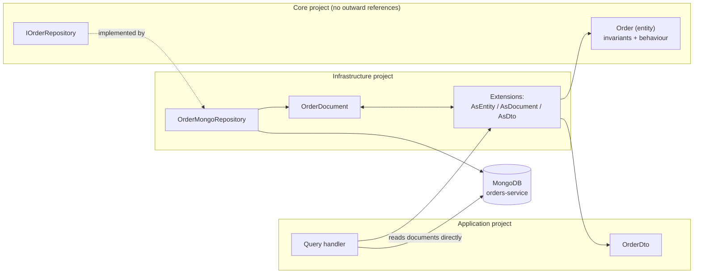

# Pattern: Database Per Service With Document Mapping

## Status

**Candidate.** No approval metadata, ADR, or documented human sign-off exists in the workspace, and
the CAKE catalog for tenant `Q5SCXYFS` holds no governing decision.

## Category

data

## Problem

Two things pull in opposite directions when services own their own data. Sharing a schema across
services makes every deployment a coordination problem and lets one service's query hold a lock that
another service pays for. But giving each service its own store, and then letting the store's shape
leak into the domain model, produces entities whose design is dictated by what the database can index
rather than by what the business does.

## Context

Applies to any service that owns state. In Pacco, eight of eleven deployables have a MongoDB database
named after the service, and each keeps its persistence types in an infrastructure project that the
domain project cannot reference ([[inward-dependency-service-skeleton]]).

`pricing-service` and `ordermaker-service` own no database at all — the first computes from rules, the
second coordinates. That is the pattern working correctly: a service with no state gets no store.

## When to Use

- The service owns a business concept end to end and is the only writer of that concept's data.
- The team wants to change the storage shape — add a field, denormalise a collection, add an index —
  without asking anyone else.
- The domain model has behaviour worth protecting from serialization concerns.
- Data volumes and access patterns differ enough between services that one schema would be a
  compromise for all of them.

## When Not to Use

- The service is stateless. Registering a database "for consistency with the template" adds a
  dependency, a credential, and a startup failure mode for nothing.
- The mapping layer would be a field-for-field copy with no behaviour on either side. At that point
  the indirection is cost without benefit, and persisting the entity directly is honest.
- Queries genuinely need to join across service boundaries. That is a signal the boundary is in the
  wrong place, not a reason to share a database.
- Strong cross-service transactional consistency is a hard requirement. Separate databases cannot
  provide it; see [[transactional-outbox-handler-decorator]] for what is available instead.

## Architecture Summary

Each service is configured with its own logical database on a shared MongoDB server, named for the
service. Collections are registered explicitly at startup, one line per collection, binding a document
type to a collection name.

Three type families are kept apart:

- **Entity** — the domain type, in the core project, with constructor invariants and behaviour.
- **Document** — a flat, settable persistence type in the infrastructure project, implementing the
  framework's `IIdentifiable<TKey>`.
- **DTO** — the shape returned over the wire, in the application project.

A single static `Extensions` class per service holds the conversions between them as extension
methods. Repositories are declared as domain interfaces in the core project and implemented in
infrastructure over the framework's generic repository, so nothing in the domain knows MongoDB exists.

## Structure / Flow

Note the two distinct read paths. Commands go through the repository and get **entities**. Queries
bypass the repository, read **documents** straight off the collection, and map them to **DTOs** —
never materialising an entity at all.

## Key Components

| Component | Responsibility |
|-----------|----------------|
| `Core/Entities/<Name>.cs` | The domain type; constructor enforces invariants, no setters |
| `Core/Repositories/I<Name>Repository.cs` | A domain-shaped interface — methods named for business questions, not for storage operations |
| `Infrastructure/Mongo/Documents/<Name>Document.cs` | Flat persistence shape implementing `IIdentifiable<Guid>`; nested classes for embedded collections |
| `Infrastructure/Mongo/Documents/Extensions.cs` | Every conversion in the service, in one file |
| `Infrastructure/Mongo/Repositories/<Name>MongoRepository.cs` | Implements the domain interface over `IMongoRepository<TDocument, TKey>` |
| `Infrastructure/Mongo/Queries/Handlers/*.cs` | Read-side handlers that query the collection directly |
| `.AddMongo().AddMongoRepository<TDoc, TKey>("collection")` | The registration, one line per collection, in the composition root |

## Data / Event / API Contracts

- **Database name:** the service name — `orders-service`, `parcels-service`, `identity-service`, and so
  on. Eight databases on one MongoDB server, isolated by name only.
- **Collection names:** plural, camelCase, given as a literal string at registration —
  `orders`, `parcels`, `customers`, `resources`, `vehicles`, `deliveries`, `users`, `refreshTokens`.
- **Key type:** `Guid` for every registered repository in the workspace, with the document implementing
  `IIdentifiable<Guid>`.
- **Embedded data:** owned collections are nested types on the document —
  `OrderDocument.Parcel` with `Id`, `Name`, `Variant`, `Size` — stored inline rather than referenced.
- **Repository surface:** domain-shaped. `GetContainingParcelAsync(Guid parcelId)` and
  `GetAsync(Guid vehicleId, DateTime deliveryDate)` name business questions; the LINQ predicate that
  answers them stays in infrastructure.
- **DTO conventions:** enums are flattened to lower-case strings at the DTO boundary
  (`document.Status.ToString().ToLowerInvariant()`), so the wire contract does not depend on enum
  ordering.
- **Seeding** is available (`mongo.seed`) and is `false` in all eight services.

## Naming Conventions

| Element | Convention | Example |
|---------|-----------|---------|
| Database | Service name, kebab-case | `orders-service` |
| Collection | Plural, camelCase, string literal at registration | `refreshTokens` |
| Document type | `<Entity>Document` | `OrderDocument` |
| Repository interface | `I<Entity>Repository`, in core | `IOrderRepository` |
| Repository implementation | `<Entity>MongoRepository`, in infrastructure | `OrderMongoRepository` |
| Conversions | Extension methods `AsEntity()`, `AsDocument()`, `AsDto()` | `document.AsEntity()` |
| Embedded type | Nested class on the document | `OrderDocument.Parcel` |

## Service / Boundary Guidance

- **One writer per collection.** No service in the workspace reads or writes another service's
  database, and nothing should start.
- **Databases are separated by name on a shared server, not by server.** That is an operational
  coupling, not a design one — it is worth knowing that a single MongoDB outage takes all eight
  services' data with it.
- **Keep the mapping in infrastructure.** The core project references nothing outward, so the domain
  type cannot acquire a MongoDB attribute or a serialization concern by accident.
- **A service with no state should have no database.** `pricing-service` and `ordermaker-service`
  correctly have none; `operations-service` configures one and never uses it, which is the mistake to
  avoid.
- **Do not add a repository interface for read-only queries.** The read path here deliberately skips
  it; adding one would force every query through entity materialisation for no gain.

## Security / Compliance Considerations

- Each service authenticates to MongoDB with **its own dynamically issued credential**, leased from
  Vault under a role named for the service and auto-renewed
  ([[vault-issued-dynamic-credentials-and-service-pki]]). The connection string in `appsettings.json`
  is a template with `{{username}}` and `{{password}}` placeholders, so no database password is
  committed for the leased path.
- Per-service credentials mean a compromised service cannot read another service's database even
  though the databases share a server — provided the Vault roles are scoped to a single database
  each, which is configured (`"type": "database"`, `roleName` per service) but not verifiable from the
  repositories.
- The `mongo.connectionString` fallback used when Vault is disabled is an unauthenticated
  `mongodb://localhost:27017`. That is a local-development value; it must not reach a shared
  environment.
- Ownership checks live in handlers, not in the data layer. `GetOrdersHandler` filters by the caller's
  identity before querying, and returns an empty result rather than an error when the caller asks for
  someone else's data. The repository itself applies no filtering — anything that bypasses the handler
  bypasses the check ([[transport-agnostic-caller-context]]).
- No field-level encryption, masking, or retention rule is configured on any collection.

## Observability Considerations

- Queries are not instrumented individually. Jaeger traces cover the HTTP and message paths
  ([[correlation-and-span-propagation]]), so a slow query shows up as a slow handler with no
  attribution to a specific collection or predicate.
- No index is declared anywhere in the eight services. `GetContainingParcelAsync` scans on an embedded
  array field and `GetOrders` can materialise an unbounded collection; neither has a declared index or
  a page limit, and nothing in the repositories records how large these collections are expected to
  get.
- No metric distinguishes database latency from handler latency.

## Failure Handling

- **`GetOrders` has no paging.** It builds `Collection.AsQueryable()`, optionally filters by customer,
  and calls `ToListAsync()`. An admin caller, or an unfiltered call, materialises every order in the
  service into memory.
- Repository `GetAsync` returns `null` when nothing matches, and callers convert that into a domain
  exception (`OrderNotFoundException`) rather than propagating null.
- The mapping layer is total and unguarded: `AsEntity()` dereferences `document.Parcels` with no null
  check, so a document written before that field existed would throw on read. Nothing in the workspace
  performs a schema migration or version check.
- A MongoDB outage fails every affected service's reads and writes simultaneously, since they share a
  server.
- Convey's outbox stores its `inbox` and `outbox` collections in the same per-service database, so
  database availability and message-delivery reliability fail together
  ([[transactional-outbox-handler-decorator]]).

## Trade-offs

| Gain | Cost |
|------|------|
| Each service changes its storage shape without coordinating | Cross-service questions have no query answer; they need a replica or a call |
| The domain model is free of persistence concerns | Three type families and a mapping file per service, mostly mechanical |
| Reads skip the domain model, so queries stay fast and shaped for the caller | Two paths to the same data that can drift apart — a rule enforced in the entity is not enforced on the read path |
| A document store absorbs shape changes without migrations | It also absorbs them silently; there is no schema to tell you a field disappeared |
| Embedding owned collections keeps a read to a single document | An embedded collection has no bound; a document that grows without limit is a latent failure |
| Per-service credentials limit blast radius | Eight logical databases still share one server, so availability blast radius is unchanged |

## Variants

- **Repository for writes, direct collection access for reads** — the shape used here, and the reason
  the query side stays simple.
- **Embedded versus referenced child data.** Orders embed parcels; other relationships are held as
  bare `Guid` references across service boundaries.
- **Database per service on a shared server** (here) versus a separate server or cluster per service.
  The design is the same; the operational isolation is not.
- **No database at all** for stateless services — `pricing-service`, `ordermaker-service`.
- **Local replica of another service's data**, which is a different pattern layered on this one:
  [[event-carried-reference-replica]].

## Anti-patterns

- **Configuring a database a service never uses.** `operations-service` calls `AddMongo()`, configures
  a `operations-service` database, and takes a Vault lease for it, while registering no repository and
  storing nothing there.
- **Unbounded list queries.** No `Skip`/`Take`, no maximum, no default page size on `GetOrders`.
- **Undeclared indexes.** Every query relies on whatever indexes happen to exist on the server.
- **A mapping layer with no invariants on either side.** `CustomerDocument` holds a single `Guid`
  and maps to a `Customer` entity holding a single `Guid` — three types and four methods for one
  field. Justifiable as consistency, but it is worth noticing when the ceremony has no content.
- **Assuming document shape is stable without a version field.** No document type carries a schema
  version, and no migration exists.

## Evidence

- **ADR:** none — no ADR exists in any cloned repository or in the CAKE catalog for tenant
  `Q5SCXYFS`.
- **Repo:** `hianshul100_Pacco.Services.Orders`, `.Parcels`, `.Customers`, `.Availability`,
  `.Vehicles`, `.Deliveries`, `.Identity`, `.Operations`; absent from `.Pricing` and `.OrderMaker`.
- **Service:** eight services with a MongoDB database; `pricing-service` and `ordermaker-service` with
  none; `operations-service` with one configured and unused.
- **File:**
  `hianshul100_Pacco.Services.Orders/src/Pacco.Services.Orders.Infrastructure/Mongo/Repositories/OrderMongoRepository.cs`
  — domain-shaped methods at :20-44;
  `.../Mongo/Documents/OrderDocument.cs:8-26` (flat document, nested `Parcel` at :19-25);
  `.../Mongo/Documents/Extensions.cs:9-59` (`AsEntity`, `AsDocument`, `AsDto`, enum flattening at :39);
  `.../Mongo/Queries/Handlers/GetOrdersHandler.cs:29` (direct collection access), `:33-36` (identity
  filter), `:41` (unbounded `ToListAsync`);
  `.../Infrastructure/Extensions.cs:80-81` (`AddMongoRepository<CustomerDocument, Guid>("customers")`,
  `AddMongoRepository<OrderDocument, Guid>("orders")`);
  `hianshul100_Pacco.Services.Identity/src/.../Extensions.cs:85-86`;
  `hianshul100_Pacco.Services.Availability/src/.../Extensions.cs:90`;
  `hianshul100_Pacco.Services.Parcels/src/.../Extensions.cs:74-75`;
  `hianshul100_Pacco.Services.Vehicles/src/.../Extensions.cs:72`;
  `hianshul100_Pacco.Services.Deliveries/src/.../Extensions.cs:73`;
  `hianshul100_Pacco.Services.Customers/src/.../Extensions.cs:77`.
- **API/Event:** not applicable — this pattern has no external contract; the DTO shapes it produces are
  catalogued in [`../../baselines/api-inventory.md`](../../baselines/api-inventory.md).
- **Deployment/Config:** `mongo.database` and `mongo.seed: false` in each service's `appsettings.json`
  (`Orders` :99-102, `Identity` :100-103, `Availability` :97-100, `Vehicles` :95-98,
  `Deliveries` :95-98, `Customers` :94-97, `Parcels` :95-98, `Operations` :98-101);
  `vault.lease.mongo` block in the same files; `hianshul100_Pacco/compose/mongo-rabbit-redis.yml`
  runs a single `mongo` container for all of them.
- **Notes:** `architecture-baseline.md` §6.1, §6.2, §6.6.

## Related ADRs

None. No ADR, decision record, or RFC exists in the workspace, and the CAKE graph for tenant
`Q5SCXYFS` returned zero nodes.

## Related Patterns

- [[inward-dependency-service-skeleton]] — the project layout that keeps the mapping in infrastructure.
- [[dispatcher-bound-cqrs-endpoints]] — why the read and write paths are separate to begin with.
- [[event-carried-reference-replica]] — how a service gets data it does not own.
- [[transactional-outbox-handler-decorator]] — what shares this database and why it matters.
- [[vault-issued-dynamic-credentials-and-service-pki]] — where the database credential comes from.
- [[aggregate-buffered-domain-events]] — what the entity produces on the way to being saved.
- [[prefix-partitioned-shared-cache]] — the other store, partitioned differently.

## Recommendation

**Adopt.** One database per service, a domain-shaped repository interface in the core project, and a
mapping layer confined to infrastructure is a sound default, and the read-path shortcut — queries
going straight to documents rather than through entities — is a deliberate simplification worth
keeping. Three things need attention before this scales: add paging to every list query, declare the
indexes the repository predicates depend on, and stop configuring databases for services that store
nothing. Be explicit that separate databases on a shared server buy design isolation, not availability
isolation; if the latter is wanted, it has to be bought separately.

## Assumptions, Blockers & Open Questions

> [!IMPORTANT]
> This document contains unresolved items that require attention before or during implementation. Review and resolve before merging downstream artifacts. Each item below is tagged **[ACTION NOW]** (a human must decide or confirm it before this work can safely proceed) or **[handled later by <stage>]** (a named later stage owns and will prove it) — read the tags first to see what, if anything, is yours to act on.

### Assumptions

| # | Assumption | Rationale | Impact if Wrong | Validation Path |
|---|------------|-----------|-----------------|-----------------|
| A1 | Each service's Vault database role grants access only to that service's own database | The roles are named per service and typed `database`, which is how the mechanism is normally scoped. The Vault policies themselves are not in this workspace | Per-service credentials would give no isolation at all — any compromised service could read every other service's data on the shared server | Read the Vault role definitions and confirm each grants privileges on exactly one database |
| A2 | The collections are small enough today that missing indexes and missing paging have not caused a problem | No performance incident is recorded and no index is declared, which is consistent with small data | These are latent rather than theoretical problems; both list queries and the embedded-array predicate degrade sharply once collections grow | Check current document counts per collection and run the two riskiest queries against production-scale data |

### Open Questions

| # | Question | Why It Matters | Proposed Answer (if any) | Decision Owner |
|---|----------|----------------|--------------------------|----------------|
| Q1 | **[ACTION NOW]** What is the maximum expected number of orders per customer, and per service overall? | It decides whether the unbounded list query and the unindexed embedded-array lookup are acceptable, need paging, or need a different document shape | Add paging regardless — an unbounded list endpoint is a hazard even at small scale — and size the indexes once real numbers exist | Product owner for the Pacco platform, with the owner of `orders-service` |
| Q2 | **[handled later by the design stage]** Should document types carry a schema version so that shape changes can be detected on read? | Without one, a field removed or renamed in a future release fails at deserialization on old documents, with nothing to distinguish that from corruption | Add a version field to new document types; back-filling existing ones is a migration in its own right and should be decided separately | Platform architect |
| Q3 | **[ACTION NOW]** Should eight logical databases on one MongoDB server be split, or is a shared availability domain acceptable? | It is the difference between one service's data problem and every service's outage; the current setup gives design isolation but no availability isolation | Acceptable for a development platform, and a decision that should be revisited explicitly rather than inherited if this reaches production | Platform owner / operator for the Pacco runtime |
