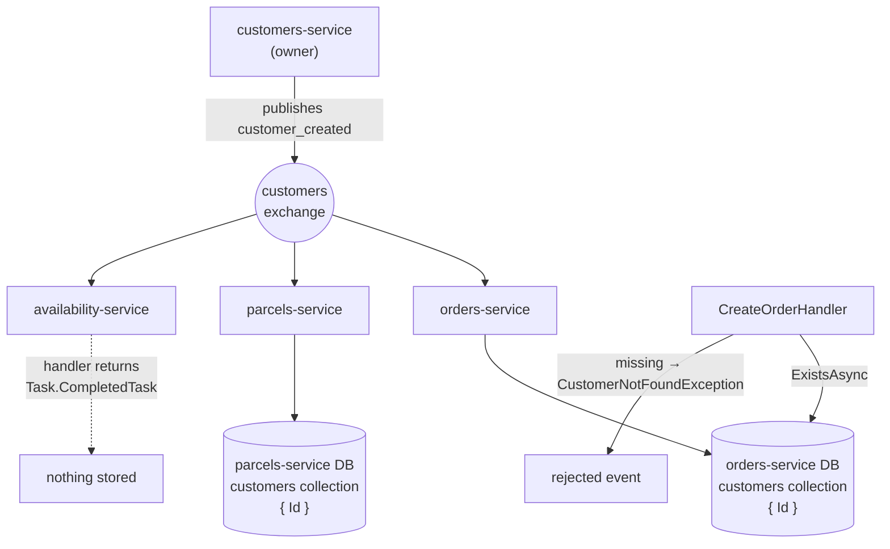

# Pattern: Event-Carried Reference Replica

## Status

**Candidate.** No approval metadata, ADR, or documented human sign-off exists in the workspace, and
the CAKE catalog for tenant `Q5SCXYFS` holds no governing decision.

## Category

data

## Problem

A service needs to know that something exists before it will act — an order cannot be created for a
customer who was never registered. The customer belongs to another service. Calling that service on
every write makes it a dependency of every write: its latency becomes yours, its downtime becomes
yours, and a validation that should take microseconds takes a network round trip.

## Context

Applies where one service must check the existence, or a small stable attribute, of something another
service owns. In Pacco, `customers-service` publishes `customer_created`, and both `orders-service` and
`parcels-service` keep a local `customers` collection populated from that event. `availability-service`
subscribes to the same event and deliberately keeps nothing.

This sits alongside the alternative — asking the owner directly ([[narrow-synchronous-point-read]]) —
and the two are used for different questions in the same platform.

## When to Use

- The consuming service needs an existence check or a small, slow-changing attribute, not the full
  record.
- The check happens on a hot path where a network call would be a real cost.
- Eventual consistency is acceptable for that specific check: acting a moment early or a moment late
  on a newly created reference does not cause harm.
- The owning service already publishes an event that carries what is needed.

## When Not to Use

- The consumer needs data that changes often, or needs it to be current. A replica is by construction
  behind.
- The data is large, or the consumer needs most of the owning service's record. That is a copy of
  someone else's database, not a reference.
- The consumer would make an irreversible or money-moving decision on the replica. Confirm against the
  owner instead.
- The consumer needs to query or report across the replicated data. A replica exists to answer one
  narrow question; growing query surface on it recreates the coupling it was meant to remove.

## Architecture Summary

The owning service publishes a domain event when the referenced thing comes into existence. Each
consuming service declares its own local copy of that event's contract, subscribes to it, and writes a
minimal local record — in Pacco, an entity holding nothing but the identifier.

Command handlers in the consuming service then check the local repository instead of calling the
owner. A missing local record produces a domain exception with the same shape as any other validation
failure ([[rejected-event-failure-contract]]).

Crucially, each consumer decides for itself whether it needs a replica at all. Subscribing to the event
and storing nothing is a valid, and here explicitly documented, choice.

## Structure / Flow

Three consumers, one event, three different answers: two keep a replica, one deliberately does not.

## Key Components

| Component | Responsibility |
|-----------|----------------|
| `Application/Events/External/<Event>.cs` | The consumer's **own** declaration of the event contract, marked `[Contract]` |
| `Application/Events/External/Handlers/<Event>Handler.cs` | Writes the local record; the only writer of the replica |
| `Core/Entities/Customer.cs` | The replica entity — in Pacco, a single `Guid` with a private setter |
| `Core/Repositories/ICustomerRepository.cs` | `ExistsAsync`, `AddAsync`, `DeleteAsync` — existence, not query |
| `Infrastructure/Mongo/Repositories/CustomerMongoRepository.cs` | The local store, registered as its own collection |
| Command handlers | The readers — they check the replica instead of calling the owner |

## Data / Event / API Contracts

- **Source event:** `customer_created` on the `customers` exchange, published by `customers-service`.
- **Consumer-side contract:** each consumer declares its own `CustomerCreated` class carrying only
  `CustomerId`. There is no shared package; the contract is matched by message name and property
  shape, by convention ([[service-owned-topic-exchange-messaging]]).
- **Replica record:** the entity is `Customer(Guid id)` — one field. The document is
  `CustomerDocument : IIdentifiable<Guid>` with one property. Nothing else is copied: no name, no
  email, no address.
- **Local collection:** `customers`, registered in both `orders-service` and `parcels-service`
  alongside their own aggregates' collections.
- **Reader contract:** existence only. `ICustomerRepository` exposes no `GetAsync` returning
  attributes, because there are none to return.
- **Duplicate handling:** the handler checks `ExistsAsync` first and throws
  `CustomerAlreadyAddedException` (orders) or `CustomerAlreadyExistsException` (parcels) on a repeat.

## Naming Conventions

| Element | Convention | Example |
|---------|-----------|---------|
| Consumer-side event location | `Application/Events/External/` | `Events/External/CustomerCreated.cs` |
| Consumer-side handler | `Application/Events/External/Handlers/<Event>Handler.cs` | `CustomerCreatedHandler` |
| Replica entity | The owner's concept name, unqualified | `Customer` |
| Replica collection | Plural, camelCase, same name as in the owning service | `customers` |
| Not-found exception | `<Concept>NotFoundException`, in the core project | `CustomerNotFoundException` |
| Duplicate exception | `<Concept>AlreadyAddedException` / `AlreadyExistsException` | `CustomerAlreadyAddedException` |

## Service / Boundary Guidance

- **The replica is read-only to its owner's semantics.** The consuming service must never mutate it as
  if it owned it, and must never treat it as authoritative when the answer matters.
- **Copy the minimum.** A one-field replica cannot go stale in a way that matters, cannot leak personal
  data, and cannot tempt anyone into querying it. The moment a replica grows a name or an address, it
  becomes a synchronisation problem and a data-protection question.
- **Each consumer decides independently.** `availability-service` subscribes and stores nothing, with a
  comment saying so. That is the pattern being applied correctly, not skipped.
- **The consumer owns its copy of the contract.** Two classes named `CustomerCreated` in two services
  is intentional; a shared contracts package would couple deployments.
- **A replica is not a query surface.** If another team asks to add a field so they can report on it,
  the answer is to ask the owner, not to widen the replica.

## Security / Compliance Considerations

- **Copying only an identifier is the pattern's strongest security property.** No personal data leaves
  `customers-service`, so no consuming service inherits a data-protection obligation it did not sign up
  for. Any proposal to widen the replica should be treated as a privacy decision, not a data-modelling
  one.
- **There is no deletion path.** `ICustomerRepository` declares `DeleteAsync`, but no service
  subscribes to a customer-deleted event — `customers-service` publishes none. If a customer is ever
  erased at the owner, the replicas keep the identifier indefinitely, with nothing to remove it. For an
  identifier alone this is a small exposure; it is still an unhandled erasure obligation.
- Replicas are stored in each consumer's own database under its own Vault-issued credential
  ([[database-per-service-with-document-mapping]]), so the copy does not widen database access.
- The replica is used for existence checks that gate writes. Anything that could add a record to the
  replica — an attacker able to publish onto the `customers` exchange — could make the consuming
  service accept orders for a customer that does not exist. The event's trustworthiness rests entirely
  on broker access control.

## Observability Considerations

- **Replica drift is invisible.** Nothing compares a consumer's `customers` collection against the
  owner's, and no metric counts records on either side. A consumer that missed events would look
  perfectly healthy until a customer was rejected as unknown.
- The failure a user sees is `CustomerNotFoundException` → a rejected event with code
  `customer_not_found`. That is the same code whether the customer genuinely does not exist or the
  replica simply has not caught up — the two cases are indistinguishable from the outside.
- The replicating handler runs inside the normal message pipeline, so it is traced and logged like any
  other handler ([[correlation-and-span-propagation]]).
- No lag measurement exists between the owner's publish and the consumer's write.

## Failure Handling

- **A missed event is permanent.** There is no reconciliation job, no periodic full sync, and no
  backfill. If a consumer is down past the broker's redelivery attempts, that customer is simply
  missing from the replica forever, and every order they attempt is rejected.
- **A duplicate event throws.** The handler checks existence and throws
  `CustomerAlreadyAddedException` rather than treating the write as idempotent. Since the broker
  guarantees at-least-once delivery, a redelivery is expected behaviour, not an error — this handler
  turns a normal occurrence into an exception. What follows depends on the outbox's inbox
  deduplication ([[transactional-outbox-handler-decorator]]), which will usually suppress the
  redelivery before the handler sees it; the handler is nonetheless written as if duplicates were
  faults.
- **Ordering is not guaranteed across exchanges.** An order command that arrives before the
  `customer_created` event has been processed is rejected as unknown-customer, and the caller must
  retry. Nothing detects or explains this race.
- A `null` from the repository becomes a domain exception at the calling handler, which becomes a
  rejected event with a code and reason — the platform's standard failure path.

## Trade-offs

| Gain | Cost |
|------|------|
| Existence checks are local — no network call, no dependency on the owner's availability | The check is against data that is, by definition, slightly behind |
| A one-field replica cannot leak personal data or go meaningfully stale | It also cannot answer anything beyond "does this exist" |
| Each consumer chooses independently whether to replicate | Three services with the same event have three different behaviours, and only a code comment records why |
| No shared contracts package, so consumers deploy independently | Contract compatibility is by convention, verified by nothing |
| The owner does not know or care who replicates | The owner can also change or stop publishing without knowing who breaks |
| Simple to implement — one handler, one entity, one collection | Simple to get subtly wrong: no reconciliation, no deletion, no lag visibility |

## Variants

- **Identifier-only replica** (Pacco's choice) versus **attribute replica** carrying a few fields. The
  first is a reference; the second is a cache with a consistency problem.
- **Subscribe and store nothing** — `availability-service`'s explicit no-op, keeping the subscription
  as a documented placeholder for when the need appears.
- **Do not replicate; call the owner** — [[narrow-synchronous-point-read]], used in the same platform
  where the answer must be current.
- **Replica with reconciliation** — a periodic sync or a replay endpoint to repair drift. Not observed
  in this workspace, and the main thing missing from the implementation here.

## Anti-patterns

- **A replica with no repair path.** No reconciliation, no replay, no backfill; a single missed event
  is unrecoverable without manual intervention.
- **Treating redelivery as an error.** Throwing `CustomerAlreadyAddedException` on a duplicate makes
  normal at-least-once behaviour look like a fault. An idempotent upsert is the correct shape.
- **`DeleteAsync` declared with no publisher for a deletion event.** The interface implies a lifecycle
  the platform does not have.
- **Two exception names for the same condition.** `CustomerAlreadyAddedException` in `orders-service`
  and `CustomerAlreadyExistsException` in `parcels-service` produce two different codes
  (`customer_already_added`, `customer_already_exists`) for the identical situation.
- **Growing the replica field by field** until it mirrors the owner's record. Each addition is small;
  the result is a second copy of someone else's database with no synchronisation guarantees.

## Evidence

- **ADR:** none — no ADR exists in any cloned repository or in the CAKE catalog for tenant
  `Q5SCXYFS`.
- **Repo:** `hianshul100_Pacco.Services.Customers` (owner);
  `hianshul100_Pacco.Services.Orders`, `.Parcels` (replicating consumers);
  `hianshul100_Pacco.Services.Availability` (subscribing, non-replicating consumer).
- **Service:** `customers-service` publishes; `orders-service` and `parcels-service` replicate;
  `availability-service` subscribes and discards.
- **File:**
  `hianshul100_Pacco.Services.Orders/src/Pacco.Services.Orders.Application/Events/External/Handlers/CustomerCreatedHandler.cs:19-24`
  (existence check, throw on duplicate, add);
  `.../Pacco.Services.Orders.Core/Entities/Customer.cs:5-13` (single-field replica entity);
  `.../Pacco.Services.Orders.Infrastructure/Mongo/Documents/CustomerDocument.cs:6-9`;
  `.../Pacco.Services.Orders.Infrastructure/Mongo/Documents/Extensions.cs:52-59` (the mapping);
  `.../Pacco.Services.Orders.Infrastructure/Extensions.cs:80`
  (`AddMongoRepository<CustomerDocument, Guid>("customers")`);
  `hianshul100_Pacco.Services.Parcels/src/Pacco.Services.Parcels.Core/Entities/Customer.cs:5-13`;
  `hianshul100_Pacco.Services.Parcels/src/.../Extensions.cs:74`;
  `hianshul100_Pacco.Services.Availability/src/Pacco.Services.Availability.Application/Events/External/Handlers/CustomerCreatedHandler.cs:8-11`
  — the deliberate no-op, with the comment "Customer data could be saved into custom DB depending on
  the business requirements. Given the asynchronous nature of events, this would result in eventual
  consistency."
- **API/Event:** `customer_created` on the `customers` exchange; consumer-side declarations at
  `Orders/.../Events/External/CustomerCreated.cs`, `Parcels/.../Events/External/CustomerCreated.cs`,
  `Availability/.../Events/External/CustomerCreated.cs`. Exchange topology in
  [`../../baselines/api-inventory.md`](../../baselines/api-inventory.md).
- **Deployment/Config:** no reconciliation job, scheduled task, or replay endpoint appears in any
  `compose/` file, PM2 manifest, or `.travis.yml` in the workspace.
- **Notes:** `architecture-baseline.md` §4.2, §6.3.

## Related ADRs

None. No ADR, decision record, or RFC exists in the workspace, and the CAKE graph for tenant
`Q5SCXYFS` returned zero nodes.

## Related Patterns

- [[narrow-synchronous-point-read]] — the alternative, used where the answer must be current.
- [[service-owned-topic-exchange-messaging]] — how the event travels and why contracts are duplicated.
- [[database-per-service-with-document-mapping]] — where the replica is stored.
- [[rejected-event-failure-contract]] — what a failed existence check becomes.
- [[transactional-outbox-handler-decorator]] — what suppresses most redeliveries before the handler.
- [[aggregate-buffered-domain-events]] — how the owning service produces the event in the first place.

## Recommendation

**Adopt, with reconciliation added.** Keeping a local, identifier-only replica for existence checks is
the right trade in this platform: it removes a synchronous dependency from a hot path and copies
nothing that could go stale in a way that matters. Two rules make it safe to reuse — copy the
identifier and nothing else, and let each consumer decide whether it needs a replica at all (the
explicit no-op in `availability-service` is a good example to point at). What is missing is a repair
path: a single missed event today is permanent and invisible. Add a replay or reconciliation
mechanism, make the replicating handler an idempotent upsert rather than a throw-on-duplicate, and
settle what should happen to replicas when a customer is deleted at the owner.

## Assumptions, Blockers & Open Questions

> [!IMPORTANT]
> This document contains unresolved items that require attention before or during implementation. Review and resolve before merging downstream artifacts. Each item below is tagged **[ACTION NOW]** (a human must decide or confirm it before this work can safely proceed) or **[handled later by <stage>]** (a named later stage owns and will prove it) — read the tags first to see what, if anything, is yours to act on.

### Assumptions

| # | Assumption | Rationale | Impact if Wrong | Validation Path |
|---|------------|-----------|-----------------|-----------------|
| A1 | The consumer-side `CustomerCreated` declarations stay shape-compatible with what `customers-service` publishes | All declarations currently carry only `CustomerId`, and messages are matched by name and property shape. Nothing enforces this — there is no shared package and no contract test | A field renamed at the owner would deserialize to a default value at the consumer, so every new customer would be replicated under an empty identifier and every order they place would be rejected as unknown | Add a contract test between `customers-service` and each replicating consumer, or compare the published and consumed declarations on every change to the owner |
| A2 | Missing a `customer_created` event is rare enough that no repair path has been needed so far | No incident is recorded and no reconciliation exists, which is consistent with a low-volume development platform | Every missed event is a customer who can never place an order, with no alert and no way to find them except by complaint | Compare the document count in `customers-service`'s `customers` collection with the replicas in `orders-service` and `parcels-service` |

### Open Questions

| # | Question | Why It Matters | Proposed Answer (if any) | Decision Owner |
|---|----------|----------------|--------------------------|----------------|
| Q1 | **[ACTION NOW]** What should happen to the replicas when a customer is deleted at the owner? | `DeleteAsync` exists on the replica repository but nothing calls it, and `customers-service` publishes no deletion event. Any erasure obligation is currently unmet in two services | Publish a customer-deleted event and have each replicating consumer remove its record. Decide separately what happens to orders that already reference the customer | Owner of `hianshul100_Pacco.Services.Customers`, with the platform data-protection owner |
| Q2 | **[ACTION NOW]** How should a consumer recover a replica that has missed events? | Today the answer is "it cannot", and nothing detects the condition. This is the single largest gap in the pattern as implemented | Either a replay endpoint on `customers-service` that republishes existing customers, or a periodic reconciliation comparing counts and backfilling gaps | Platform architect, with the owner of `customers-service` |
| Q3 | **[handled later by the design stage]** Should the replicating handler upsert instead of throwing on a duplicate? | Redelivery is normal broker behaviour; treating it as an exception relies on inbox deduplication always catching it first, which is a guarantee that is currently switched off in configuration | Yes — make it an idempotent upsert. The duplicate exceptions add nothing and differ in name between the two services | Owners of `orders-service` and `parcels-service` |
