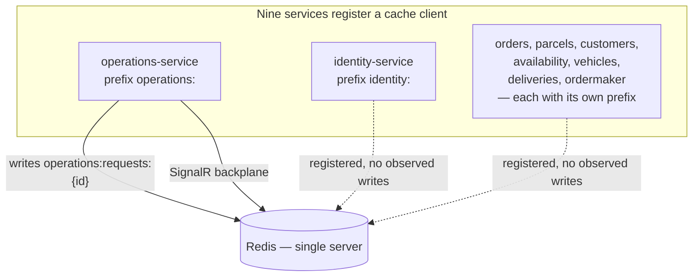

# Pattern: Prefix-Partitioned Shared Cache

## Status

**Candidate.** No approval metadata, ADR, or documented human sign-off exists in the workspace, and
the CAKE catalog for tenant `Q5SCXYFS` holds no governing decision. In this platform the pattern is
best described as **provisioned but almost entirely unused**: nine services register the cache and one
service writes to it.

## Category

data

## Problem

Several services need somewhere fast to put short-lived state — a progress record, a session, a
computed result. Giving each its own cache server multiplies operational cost for data that is
disposable by definition. Sharing one server without any partitioning is worse: two services pick the
same obvious key, one overwrites the other, and the bug appears as data that is wrong rather than data
that is missing.

## Context

Applies where several services want cheap, short-lived, non-authoritative storage and a shared cache
server is acceptable. In Pacco, nine services register a Redis client, each configured with a distinct
key prefix named for the service, all pointing at one Redis instance.

The gap between that provisioning and actual use is the most important thing to know about this
pattern here, and is documented under Evidence and in the open questions rather than smoothed over.

## When to Use

- The data is genuinely disposable: losing it degrades the experience but does not lose a fact.
- The access pattern is key-based lookup with an expiry, not query.
- Several services need this and the operational cost of a cache per service is not justified.
- Every writer can be made to use a prefix that identifies it, so keys cannot collide across services.

## When Not to Use

- The data is a record of something that happened. A cache with an expiry is not a store; see
  [[database-per-service-with-document-mapping]].
- Loss of the cache would take the platform down rather than slow it. That is a dependency, not a
  cache.
- The prefix cannot be enforced. A shared key space with a convention nobody checks will eventually
  collide.
- Nothing in the service actually needs it. Registering a cache client "because the template does" adds
  a runtime dependency and a startup failure mode for nothing — which is what nine of the ten
  registrations in this workspace amount to.

## Architecture Summary

One Redis server serves the whole platform. Each service configures a `redis` section with the shared
connection string and an `instance` value that is the service's short name followed by a colon. The
framework's cache client prepends that prefix to every key the service uses, so each service occupies
a private namespace inside a shared key space.

Application code works against the standard distributed-cache abstraction and never sees the prefix —
it writes a key like `requests:{id}` and the stored key becomes `operations:requests:{id}`.

The same Redis server is also used, by one service, as a SignalR backplane
([[real-time-push-with-shared-backplane]]), so the cache and the notification fan-out share a single
point of failure.

## Structure / Flow

The solid lines are what the source code does. The dotted lines are what the configuration provisions.

## Key Components

| Component | Responsibility |
|-----------|----------------|
| `.AddRedis()` in the composition root | Registers the cache client for the service |
| `redis.connectionString` | The shared server, identical across services |
| `redis.instance` | The service's private namespace — the only thing separating one service's keys from another's |
| `IDistributedCache` | The abstraction application code uses; the prefix is applied beneath it |
| A per-service key builder | The service-local key shape, e.g. a private `GetKey(id)` returning `requests:{id}` |
| `DistributedCacheEntryOptions` | Where the expiry is set, per write |

## Data / Event / API Contracts

- **Prefixes in use**, one per service: `identity:`, `availability:`, `vehicles:`, `operations:`,
  `ordermaker:`, `deliveries:`, `customers:`, `orders:`, `parcels:`. All nine are distinct.
- **Key shape:** `{instance}{local key}` — the only observed local key is `requests:{correlationId}`,
  giving `operations:requests:{correlationId}`.
- **Value encoding:** JSON, via the framework's string-based cache methods.
- **Expiry:** set per write rather than globally. The one observed use sets a **sliding** expiry from
  a service-level setting (`requests.expirySeconds`, configured at 300).
- **Connection:** `localhost` in every committed `appsettings.json`, overridden to the container name
  in the Docker variants. No password, no TLS, no database index selection.

## Naming Conventions

| Element | Convention | Example |
|---------|-----------|---------|
| Instance prefix | Service short name, lower case, trailing colon | `operations:` |
| Local key | Purpose, then identifier, colon-separated | `requests:{correlationId}` |
| Effective key | Prefix concatenated with local key | `operations:requests:8f3c…` |
| Config section | `redis` with `connectionString` and `instance` | — |
| Expiry setting | A service-level section, seconds | `requests.expirySeconds` |

## Service / Boundary Guidance

- **The prefix is the boundary.** It is the only thing preventing one service from reading or
  overwriting another's keys — there is no per-service credential, no ACL, and no separate database
  index. Every service can read every other service's keys if it constructs the string.
- **Never treat a cached value as authoritative.** It can vanish at any time, and in this platform it
  will: there is no persistence configured.
- **Build keys in one place per service.** The single observed implementation has one private
  `GetKey`, which keeps the shape consistent and makes the namespace auditable.
- **Set an expiry on every write.** A cache entry with no expiry is a memory leak in a store with no
  eviction policy configured.
- **Do not register a cache a service does not use.** Nine of the ten registrations here have no
  observed reader or writer.

## Security / Compliance Considerations

- **This is the weakest access boundary in the platform.** Every other shared store is protected by a
  per-service credential issued from Vault; Redis is not. There is no `requirepass`, no user, no ACL,
  and no TLS in any configuration in the workspace. Any process that can reach the port has full
  access to every service's keys.
- **Namespacing is a naming convention, not a security control.** It prevents accidents, not access.
- The one thing actually stored — operation records — contains a user identifier and a failure reason
  copied from an exception message, keyed by a correlation id. Modest, but not nothing.
- The Redis container is not exposed outside the compose network in the observed files, so the current
  exposure is limited to anything already inside it. That is a deployment property, not a property of
  the pattern, and it changes the moment the port is published.
- Sliding expiry means an entry that is read repeatedly never expires. For session-like data that is
  the intent; for anything with a retention obligation it means the retention period is not what the
  configuration appears to say.

## Observability Considerations

- No metric records cache hits, misses, evictions, memory use, or key count for any prefix.
- A cache miss and an expired entry are indistinguishable at the call site — both return null, and the
  one observed caller turns both into `404`.
- Redis operations are not traced; a slow cache read appears as a slow handler
  ([[correlation-and-span-propagation]]).
- Because the same server is the SignalR backplane, a Redis problem shows up as two unrelated-looking
  symptoms — status lookups failing and real-time notifications not arriving — with nothing tying them
  together.
- **The most useful thing to add is a key count per prefix.** It would immediately reveal that nine of
  the ten registered namespaces are empty.

## Failure Handling

- **There is no persistence.** The compose definition runs a stock Redis container with no volume, no
  RDB or AOF configuration, and no replica. A restart empties every namespace.
- **Cache loss has one observed consequence**: in-flight operation records disappear, so status lookups
  return `404` and connected clients are never told what happened to work already in progress
  ([[acknowledge-then-notify-completion]]). Nothing recovers those records.
- **There is no fallback path.** The one caller reads the cache or returns not-found; it does not fall
  back to another store, because there is no other store holding this data.
- **Redis being unavailable is not handled anywhere.** No circuit breaker, no timeout configuration, no
  degraded mode. A connection failure surfaces as an exception from the cache client.
- Sliding expiry makes lifetime depend on read traffic, so the effective retention of an entry is not
  predictable from configuration alone.

## Trade-offs

| Gain | Cost |
|------|------|
| One cache server to run, patch, and watch instead of nine | One failure domain for nine services, and for the notification backplane too |
| Prefixes make each service's namespace obvious and auditable | They provide no isolation whatsoever — any service can read any other's keys |
| The framework applies the prefix, so application code never handles it | The effective key differs from the key in the source, which is a small but real debugging tax |
| Expiry per write allows different lifetimes for different data | Sliding expiry ties lifetime to traffic, so retention is not what configuration suggests |
| Registering the client uniformly keeps services consistent | Nine services carry a runtime dependency and a startup failure mode for a cache they never touch |
| Fast key-based access with no schema | No query surface, no persistence, no recovery |

## Variants

- **Prefix-partitioned shared server** (this pattern) versus a cache instance per service. The first
  trades isolation for operational simplicity.
- **Sliding versus absolute expiry.** Sliding suits progress and session data; absolute suits anything
  with a defined lifetime.
- **Cache as an optimisation** — a miss falls back to the real store — versus **cache as the only
  copy**, which is what the one observed use does. The second is not really caching, and its failure
  mode is data loss rather than a slow request.
- **Shared with a backplane**, as here, versus keeping the notification backplane on a separate
  instance so a cache problem does not also silence notifications.

## Anti-patterns

- **Registering a cache a service never uses.** Nine services call `AddRedis()`; only
  `operations-service` has an observed reader or writer. Two of those calls are in the same builder
  chain in a single service.
- **A shared store with no authentication.** The prefix convention is doing work it cannot do.
- **Using a cache as the sole copy of data users are waiting on.** Operation records exist nowhere
  else.
- **Sharing the cache server with the notification backplane** — one dependency, two unrelated
  outages, no shared symptom.
- **No persistence and no eviction policy configured.** The store will either lose everything on
  restart or fill up; neither has been decided, both have been left to defaults.

## Evidence

- **ADR:** none — no ADR exists in any cloned repository or in the CAKE catalog for tenant
  `Q5SCXYFS`.
- **Repo:** `AddRedis()` in `hianshul100_Pacco.Services.Identity`, `.Availability`, `.Vehicles`,
  `.Operations` (twice), `.OrderMaker`, `.Deliveries`, `.Customers`, `.Orders`, `.Parcels`. Absent
  from `.Pricing` and the gateway.
- **Service:** nine services register a cache client; **one** — `operations-service` — has an observed
  reader or writer.
- **File:**
  `hianshul100_Pacco.Services.Operations/src/Pacco.Services.Operations.Api/Services/OperationsService.cs`
  — the only `IDistributedCache` usage in the workspace: injection at :13-20, read at :26, write with
  sliding expiry at :50-55, key builder at :62;
  `.../Operations.Api/Infrastructure/Extensions.cs:72,75` (`AddRedis()` called twice), `:105-106`
  (the same Redis connection reused as the SignalR backplane);
  registrations at `Identity/.../Extensions.cs:82`, `Availability/.../Extensions.cs:85`,
  `Vehicles/.../Extensions.cs:67`, `OrderMaker/.../Extensions.cs:37`,
  `Deliveries/.../Extensions.cs:69`, `Customers/.../Extensions.cs:73`, `Orders/.../Extensions.cs:76`,
  `Parcels/.../Extensions.cs:70`.
- **Conflict — provisioning versus use:** the configuration in nine services provisions a
  prefix-partitioned cache; the source code shows exactly one service using it. Treating the source as
  authoritative, the platform has one cache user and eight unused registrations. This is recorded
  here rather than reconciled, and the intent behind the eight is an open question below.
- **API/Event:** not applicable — the cache has no external contract. The one endpoint that reads from
  it is catalogued in [`../../baselines/api-inventory.md`](../../baselines/api-inventory.md).
- **Deployment/Config:** `redis.connectionString` and `redis.instance` in each service's
  `appsettings.json` (`Identity` :156-158, `Availability` :153-155, `Vehicles` :151-153,
  `Operations` :145-148, `OrderMaker` :131-133, `Deliveries` :151-153, `Customers` :150-152,
  `Orders` :155-157, `Parcels` :151-153); `operations` also sets `signalR.backplane: redis` at
  :152-154. `hianshul100_Pacco/compose/mongo-rabbit-redis.yml` runs a single `redis` container with
  no volume, no password, and no replica.
- **Notes:** `architecture-baseline.md` §6.4, §10.

## Related ADRs

None. No ADR, decision record, or RFC exists in the workspace, and the CAKE graph for tenant
`Q5SCXYFS` returned zero nodes.

## Related Patterns

- [[acknowledge-then-notify-completion]] — the only observed user of this cache, and what breaks when
  it is lost.
- [[real-time-push-with-shared-backplane]] — the other tenant of the same Redis server.
- [[database-per-service-with-document-mapping]] — the durable store, and the contrast in how access is
  controlled.
- [[vault-issued-dynamic-credentials-and-service-pki]] — the credential mechanism this store does not
  use.
- [[framework-supplied-platform-conventions]] — why nine services register a client none of them needs.

## Recommendation

**Adopt the shape narrowly; remove the unused registrations.** A per-service key prefix over a shared
cache is a reasonable, cheap arrangement, and the mechanics here are right — the prefix comes from
configuration, application code never sees it, and every write carries an expiry. Three things should
change before this is treated as a platform capability. Put authentication on the cache, because the
prefix is a naming convention and is currently the only thing between services. Stop registering the
client in the eight services that never use it, so the dependency graph reflects reality. And do not
let a cache be the only copy of data a user is waiting on — either persist operation records or accept,
explicitly, that a Redis restart loses every operation in flight.

## Assumptions, Blockers & Open Questions

> [!IMPORTANT]
> This document contains unresolved items that require attention before or during implementation. Review and resolve before merging downstream artifacts. Each item below is tagged **[ACTION NOW]** (a human must decide or confirm it before this work can safely proceed) or **[handled later by <stage>]** (a named later stage owns and will prove it) — read the tags first to see what, if anything, is yours to act on.

### Assumptions

| # | Assumption | Rationale | Impact if Wrong | Validation Path |
|---|------------|-----------|-----------------|-----------------|
| A1 | The framework's cache client prepends `redis.instance` to every key, so the stored key is the prefix plus the local key | This is how the setting is named and used, and it is the only thing that would make nine distinct prefixes meaningful. The prefixing happens inside the framework, whose source is not in this workspace | Every service would share one flat key space, and the nine prefixes would give no separation at all — a collision between services would be possible and silent | Write a key from one service and list the actual keys on the Redis server |
| A2 | Nothing outside `operations-service` writes to Redis at runtime | No other service references the cache abstraction anywhere in its source. Framework internals could still use the connection without appearing in service code | The eight "unused" registrations would in fact be load-bearing, and removing them would break something | List keys by prefix on a running Redis server and see which namespaces are non-empty |

### Blockers

| # | Blocker | Blocks | Owner | Resolution Path | Target Date |
|---|---------|--------|-------|-----------------|-------------|
| B1 | **[ACTION NOW]** The shared cache has no authentication, no TLS, and no per-service access control. The key prefix is a naming convention, so any process reaching the port can read or overwrite every service's keys | Treating the prefix as an isolation boundary; any deployment where the Redis port is reachable beyond a trusted network | Platform owner / operator for the Pacco runtime, with the platform security owner | Enable a password or Redis ACL users per service, confirm the port is not published outside the internal network, and add TLS if it crosses a network boundary | TBD |

### Open Questions

| # | Question | Why It Matters | Proposed Answer (if any) | Decision Owner |
|---|----------|----------------|--------------------------|----------------|
| Q1 | **[ACTION NOW]** Why do eight services register a cache client they never use? | Each carries a real runtime dependency and a startup failure mode for a capability none of them exercises, and it makes the dependency graph misleading | Almost certainly copied from a common service template. If so, remove the registration from the services that do not use it | Platform architect, with the owners of the eight services |
| Q2 | **[ACTION NOW]** Should operation records survive a Redis restart? | They are currently the only copy of what a user is waiting on, and a restart loses every one with no notification and no recovery | Either accept the loss explicitly and document it as a limit of the status feature, or move the records to the durable store. Enabling Redis persistence is a third option and the weakest of the three | Product owner for the Pacco platform, with the owner of `operations-service` |
| Q3 | **[handled later by the design stage]** Should the SignalR backplane share the cache server, or run on its own instance? | Sharing means one Redis problem produces two unrelated-looking symptoms at once, which is harder to diagnose than either alone | Acceptable at this scale; worth separating if the notification path ever becomes something users depend on | Platform architect |
| Q4 | **[ACTION NOW]** What eviction policy and memory limit should the shared cache run with? | Neither is configured. Today the store is nearly empty so it does not matter; with real use, the default behaviour on a full instance is not something to discover in production | Set an explicit maximum memory and an eviction policy suited to expiring keys, and add a key-count metric per prefix | Platform owner / operator for the Pacco runtime |
