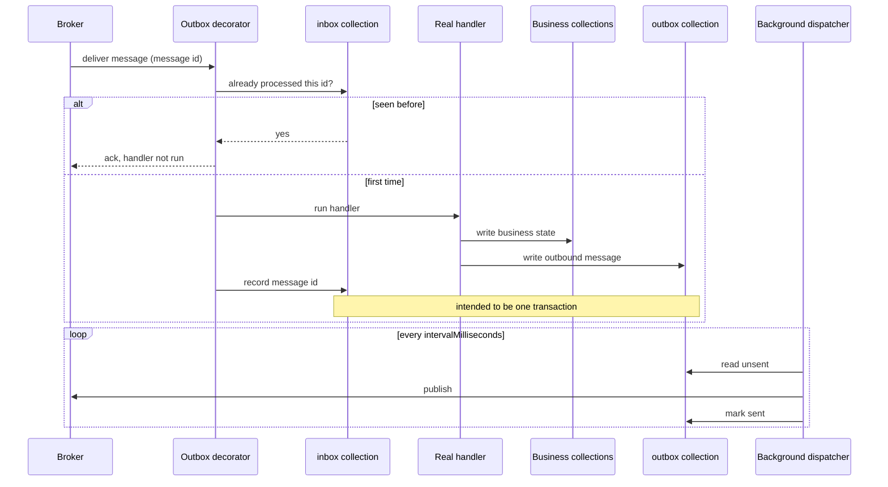

# Pattern: Transactional Outbox and Inbox Behind a Handler Decorator

## Status

**Candidate.** No approval metadata, ADR, or documented human sign-off exists in the workspace, and
the CAKE catalog for tenant `Q5SCXYFS` holds no governing decision. The implementation additionally
runs with the setting that provides its central guarantee switched off, which is recorded as a blocker
below.

## Category

data

## Problem

A handler that changes state and then publishes a message performs two separate operations against two
separate systems. If the process stops between them, the state changed and nobody was told — the order
exists and no downstream service knows. Publishing first inverts the problem: everyone is told about a
change that never happened. There is no ordering of two unrelated writes that is safe.

The mirror problem is on the receiving side. Brokers deliver at least once, so a handler will
eventually see the same message twice and must not apply it twice.

## Context

Applies to every handler in a service that both persists state and emits messages. Seven of Pacco's
eleven services apply it — `identity`, `availability`, `vehicles`, `deliveries`, `customers`, `orders`,
`parcels` — each by decorating **all** of its command and event handlers, without any handler being
written to know about it.

The three services that do not apply it are consistent: `pricing-service` and `ordermaker-service` own
no database, and `operations-service` writes only to a cache.

## When to Use

- A handler both writes state and publishes a message, and losing either one matters.
- The message store can live in the same database as the business state, so both writes can be made
  atomic.
- Handlers are already funnelled through a common abstraction — a command or event handler interface —
  so the behaviour can be added around them rather than inside them.
- At-least-once delivery is the broker's contract and handlers are not otherwise idempotent.

## When Not to Use

- The service holds no state. There is nothing to be atomic with, and the outbox becomes a second
  store with its own failure modes for no gain. Correctly omitted in three Pacco services.
- The database cannot provide a transaction spanning the business write and the message write. Without
  that, the pattern's name is accurate and its guarantee is not — see the blocker below.
- Message delivery latency of a few seconds is unacceptable. A polling dispatcher adds delay by
  construction.
- Handlers are already naturally idempotent and messages are already safe to lose. The machinery is not
  free.

## Architecture Summary

Two open-generic decorators are registered around every command handler and every event handler in the
service. The decorator resolves a message id — the inbound broker message's id, or a fresh one when
there is none — and passes the real handler in as a callback to the message outbox, which is
responsible for wrapping the whole thing.

On the publish side, the service's message broker abstraction checks whether the outbox is enabled and,
if so, writes the outbound message to the outbox collection instead of publishing it directly. A
background dispatcher polls the collection and publishes.

On the receive side, the same message id is recorded in an inbox collection, so a redelivered message
is recognised and its handler is not run again.

Both collections live in the service's own database, alongside its business data
([[database-per-service-with-document-mapping]]).

## Structure / Flow

The dotted guarantee — that the business write, the outbox write, and the inbox record commit together
— is the entire point of the pattern, and is the part currently disabled.

## Key Components

| Component | Responsibility |
|-----------|----------------|
| `Infrastructure/Decorators/OutboxCommandHandlerDecorator<TCommand>` | Wraps every `ICommandHandler<>`; `[Decorator]`, `internal sealed` |
| `Infrastructure/Decorators/OutboxEventHandlerDecorator<TEvent>` | The same for every `IEventHandler<>` |
| `builder.Services.TryDecorate(typeof(ICommandHandler<>), …)` | Registration — two lines, applying to every handler in the service |
| `IMessageOutbox` (Convey) | Owns the transaction, the inbox check, and the outbox write |
| `Infrastructure/Services/MessageBroker` | Chooses outbox versus direct publish on every outbound message |
| `.AddMessageOutbox(o => o.AddMongo())` | Puts both collections in the service's own MongoDB database |
| Background dispatcher (Convey) | Polls the outbox and publishes; not visible in service code |

## Data / Event / API Contracts

- **Collections:** `inbox` and `outbox`, configured by `outbox.inboxCollection` and
  `outbox.outboxCollection`, in the service's own database.
- **Message id:** taken from the inbound broker message properties when present; otherwise
  `Guid.NewGuid().ToString("N")`. This is the deduplication key.
- **Outbox record contents:** the event, plus `originatedMessageId`, a new `messageId`,
  `correlationId`, `spanContext`, the correlation context, and forwarded headers — so a message
  published from the outbox carries the same tracing and identity metadata as one published directly
  ([[correlation-and-span-propagation]]).
- **Configuration**, identical in all seven services:

  | Key | Value | Meaning |
  |-----|-------|---------|
  | `enabled` | `true` | The decorators and the outbox publish path are active |
  | `type` | `sequential` | Dispatch ordering strategy |
  | `expiry` | `3600` | Processed records are retained for an hour |
  | `intervalMilliseconds` | `2000` | The dispatcher polls every two seconds |
  | `disableTransactions` | `true` | **The atomicity guarantee is switched off** |

- **Enablement is read twice**, and differently: the decorator reads `outboxOptions.Enabled` at
  construction and calls the handler directly when false; `MessageBroker` reads `_outbox.Enabled` on
  every publish. Both must agree for the pattern to hold.

## Naming Conventions

| Element | Convention | Example |
|---------|-----------|---------|
| Decorator type | `Outbox<HandlerKind>Decorator<T>` | `OutboxEventHandlerDecorator<TEvent>` |
| Location | `Infrastructure/Decorators/` | — |
| Marker | `[Decorator]` attribute, `internal sealed` | — |
| Collections | `inbox`, `outbox`, lower case | — |
| Config section | `outbox` | `outbox.disableTransactions` |
| Message id format | `Guid` with no separators | `ToString("N")` |

## Service / Boundary Guidance

- **Apply it to every handler or none.** Decorating all handlers uniformly means no handler author has
  to remember. Selective application creates two classes of handler that look identical in source.
- **Handlers must stay unaware.** No handler in the seven services references the outbox; every one is
  written as though it simply saves and publishes. That is what makes the pattern maintainable.
- **The outbox belongs in the service's own database**, not in a shared one. It is part of the
  service's state, and its whole value comes from committing with that state.
- **A stateless service should not have one.** The three services without it are right not to have it.
- The pattern is per-service and gives no cross-service guarantee. Two services' outboxes do not commit
  together, and nothing here makes a multi-service operation atomic — that is what
  [[saga-process-manager]] and compensation are for.

## Security / Compliance Considerations

- **The outbox stores full message payloads at rest**, in the service's database, for the retention
  period (`expiry: 3600`). Anything sensitive in a message is therefore also sensitive in the database,
  in a collection nobody thinks of as business data.
- The `excludeProperties` redaction list applies to logs, not to the outbox
  ([[structured-logging-with-property-redaction]]). A field masked in logs is stored in full here.
- Outbox collections are covered by the same per-service Vault credential as the business collections,
  so access is not widened ([[vault-issued-dynamic-credentials-and-service-pki]]).
- The stored correlation context includes the user context — identity, role, claims — so the outbox
  holds a record of who initiated each message for the retention window.
- No retention policy beyond `expiry` and no encryption at rest is configured for these collections.

## Observability Considerations

- **The pattern is nearly invisible when it works and equally invisible when it does not.** No metric
  counts outbox depth, dispatch latency, unsent messages, or inbox suppressions.
- A backed-up outbox looks exactly like a quiet system: state is being written, no messages are
  flowing, and no error appears anywhere.
- `MessageBroker` logs at trace level when publishing an integration event, before the outbox/direct
  decision — so the log line does not distinguish a message that went to the broker from one that went
  to a collection and may never leave it.
- Because tracing metadata is carried through the outbox record, a message published two seconds later
  by the dispatcher still joins the originating trace.
- **Suggested first metric:** the count of unsent outbox records per service. It is the one number
  that turns a silent failure into a visible one.

## Failure Handling

- **With transactions disabled, the guarantee is best-effort.** The business write and the outbox write
  are separate operations; a failure between them leaves the platform in exactly the state the pattern
  exists to prevent.
- **Dispatch adds latency, not loss.** Under normal operation a message is published up to two seconds
  after the state change. Consumers must tolerate that.
- **A dispatcher that stops leaves state consistent and the platform uninformed.** Records accumulate
  in the outbox; the service continues to accept writes and appears healthy.
- **Records expire after an hour.** If the dispatcher is down longer than `expiry`, retained records
  may be cleaned up. What exactly is removed and whether unsent records are exempt depends on Convey's
  implementation and is not verifiable from these repositories — see the open questions.
- **Inbox deduplication depends on a stable message id.** When an inbound message has none, the
  decorator generates a fresh one, so a redelivery of that message generates a different id and is
  **not** deduplicated. This is the case for anything published without message properties.
- Handler exceptions propagate out of the decorator unchanged, so the platform's normal failure path
  applies ([[rejected-event-failure-contract]]).

## Trade-offs

| Gain | Cost |
|------|------|
| State change and message emission can commit together | Only if transactions are enabled; with them off, the shape remains and the guarantee does not |
| Handlers stay simple and unaware — two registration lines cover the whole service | The behaviour is invisible at the call site; a reader of a handler cannot tell it is wrapped |
| Redeliveries are suppressed without any handler being made idempotent | Only for messages that arrive with a message id |
| The outbox lives with the data, so no distributed transaction is needed | The database now carries message traffic as well as business state, and they fail together |
| Tracing and identity metadata survive the deferral | Full payloads and user context sit at rest in a second place |
| Polling dispatch is simple and needs no coordination | Up to `intervalMilliseconds` of added latency on every message, and no backpressure signal |

## Variants

- **Transactional** (`disableTransactions: false`) versus **best-effort** (`true`, as configured here).
  Same code, materially different guarantee.
- **Outbox only** versus **outbox plus inbox**. Convey's `AddMessageOutbox` provides both; the inbox is
  what makes redelivery safe.
- **Sequential** versus other dispatch strategies, selected by `outbox.type`.
- **Decorator-applied** (here) versus explicitly invoked inside each handler. The decorator is
  strictly better where a handler abstraction already exists.
- **Disabled entirely** — the decorators degrade to a direct call, so the pattern can be switched off
  by configuration without code changes.

## Anti-patterns

- **Naming a component for a guarantee it is configured not to provide.** `disableTransactions: true`
  in all seven services means "transactional outbox" describes the intent, not the behaviour.
- **A generated deduplication key.** Falling back to `Guid.NewGuid()` when the inbound message has no
  id makes deduplication silently ineffective for exactly the messages most likely to be republished.
- **Two independent reads of the enabled flag.** The decorator caches it at construction; the broker
  reads it per publish. Disabling one path without the other yields state written transactionally and
  messages published directly, or the reverse.
- **No visibility into the queue you just created.** An outbox is a queue inside your database; running
  it with no depth metric is running a queue blind.
- **Assuming the outbox makes cross-service operations atomic.** It does not, and the name invites the
  assumption.

## Evidence

- **ADR:** none — no ADR exists in any cloned repository or in the CAKE catalog for tenant
  `Q5SCXYFS`.
- **Repo:** applied in `hianshul100_Pacco.Services.Identity`, `.Availability`, `.Vehicles`,
  `.Deliveries`, `.Customers`, `.Orders`, `.Parcels`; absent from `.Pricing`, `.OrderMaker`,
  `.Operations`.
- **Service:** seven of eleven deployables.
- **File:**
  `hianshul100_Pacco.Services.Orders/src/Pacco.Services.Orders.Infrastructure/Decorators/OutboxCommandHandlerDecorator.cs`
  — `[Decorator] internal sealed` at :10-11, message-id fallback at :27-29, enabled check and outbox
  callback at :32-35;
  `.../Decorators/OutboxEventHandlerDecorator.cs` (same shape for events);
  `.../Infrastructure/Extensions.cs:62-63` (`TryDecorate` registrations), `:73`
  (`.AddMessageOutbox(o => o.AddMongo())`);
  `.../Infrastructure/Services/MessageBroker.cs:76-84` (outbox-versus-direct decision, and the metadata
  carried into the outbox record);
  the same registration pair at `Identity/.../Extensions.cs:67-68,80`,
  `Availability/.../Extensions.cs:67-68,82`, `Vehicles/.../Extensions.cs:53-54,64`,
  `Deliveries/.../Extensions.cs:55-56,66`, `Customers/.../Extensions.cs:59-60,70`,
  `Parcels/.../Extensions.cs:56-57,67`.
- **API/Event:** not applicable — the pattern has no external contract; it changes when messages
  catalogued in [`../../baselines/api-inventory.md`](../../baselines/api-inventory.md) are published,
  not what they contain.
- **Deployment/Config:** the `outbox` block in each service's `appsettings.json` —
  `Orders` :104-112, `Identity` :105-112, `Availability` :102-109, `Vehicles` :100-107,
  `Deliveries` :100-107, `Customers` :99-106, `Parcels` :100-107. All seven carry
  `"disableTransactions": true`. No environment override sets it to `false` in any
  `appsettings.docker.json`, `compose/` file, or PM2 manifest in the workspace.
- **Notes:** `architecture-baseline.md` §6.5, §10.

## Related ADRs

None. No ADR, decision record, or RFC exists in the workspace, and the CAKE graph for tenant
`Q5SCXYFS` returned zero nodes.

## Related Patterns

- [[database-per-service-with-document-mapping]] — the database the outbox shares with business state.
- [[service-owned-topic-exchange-messaging]] — where the dispatched messages go.
- [[correlation-and-span-propagation]] — the metadata carried through the outbox record.
- [[aggregate-buffered-domain-events]] — what produces the events the handler publishes.
- [[event-carried-reference-replica]] — a consumer that relies on inbox deduplication more than it
  realises.
- [[framework-supplied-platform-conventions]] — where the outbox implementation actually lives.
- [[structured-logging-with-property-redaction]] — the redaction that does *not* cover this store.

## Recommendation

**Adopt the shape; fix the configuration before relying on it.** Applying the outbox uniformly through
two decorator registrations, with handlers left entirely unaware, is the right way to add this
behaviour to a service — it cannot be forgotten and it cannot be got wrong per handler. But every
service in this workspace runs with `disableTransactions: true`, which removes the atomicity that is
the pattern's whole reason for existing; today it buys ordered, deferred dispatch and inbox
deduplication, not a guarantee. Before treating this as a reliability control, turn transactions on
(which requires a MongoDB deployment that supports them), add an outbox-depth metric so a stalled
dispatcher is visible, and decide what should happen when an inbound message arrives without a message
id and therefore cannot be deduplicated.

## Assumptions, Blockers & Open Questions

> [!IMPORTANT]
> This document contains unresolved items that require attention before or during implementation. Review and resolve before merging downstream artifacts. Each item below is tagged **[ACTION NOW]** (a human must decide or confirm it before this work can safely proceed) or **[handled later by <stage>]** (a named later stage owns and will prove it) — read the tags first to see what, if anything, is yours to act on.

### Assumptions

| # | Assumption | Rationale | Impact if Wrong | Validation Path |
|---|------------|-----------|-----------------|-----------------|
| A1 | `disableTransactions: true` is set because the single-node MongoDB in the compose files cannot do multi-document transactions, not because atomicity was judged unnecessary | Multi-document transactions need a replica set, and every compose file runs one standalone `mongo` container. The setting is identical in all seven services, which reads as an environment constraint rather than seven independent decisions | If it was a deliberate choice to trade atomicity away, then the risk is accepted rather than outstanding, and the recommendation above is arguing against a settled decision | Ask the platform owner, and check whether any environment outside this workspace runs MongoDB as a replica set with the setting flipped |
| A2 | The background dispatcher publishes reliably enough that outbox depth stays near zero in normal operation | Nothing in the workspace suggests otherwise, but nothing measures it either | A slowly draining outbox would look exactly like a healthy system while messages arrived minutes or hours late, or not at all | Query the `outbox` collection in a running environment for unsent records and their age |

### Blockers

| # | Blocker | Blocks | Owner | Resolution Path | Target Date |
|---|---------|--------|-------|-----------------|-------------|
| B1 | **[ACTION NOW]** Every service runs the outbox with transactions disabled, so the state write and the message write are not atomic — the exact failure the pattern exists to prevent is still possible in all seven services | Any claim that message emission is reliable; any design that depends on "if the state changed, the event was published" | Platform owner / operator for the Pacco runtime, with the platform architect | Run MongoDB as a replica set so multi-document transactions are available, set `disableTransactions: false`, and verify by killing a service between the state write and the dispatch | TBD |

### Open Questions

| # | Question | Why It Matters | Proposed Answer (if any) | Decision Owner |
|---|----------|----------------|--------------------------|----------------|
| Q1 | **[ACTION NOW]** Does the one-hour `expiry` remove unsent outbox records, or only records already dispatched? | If it removes unsent records, an outage longer than an hour silently destroys undelivered messages, which is a far more serious failure than delayed delivery | Almost certainly applies to processed records only, but this is Convey's behaviour and cannot be confirmed from these repositories | Platform architect, by reading the Convey outbox implementation |
| Q2 | **[ACTION NOW]** What should happen when an inbound message arrives with no message id and therefore cannot be deduplicated? | The decorator currently invents an id, which means redeliveries of those messages run the handler again. It is a silent gap in a control everything else assumes works | Reject or log messages published without a message id, and fix the publishers, rather than generating one that cannot serve its purpose | Platform architect, with the owners of the seven services |
| Q3 | **[handled later by the design stage]** Should outbox depth and dispatch age be exported as metrics? | It is the only way a stalled dispatcher becomes visible; today the failure mode is complete silence | Yes — unsent record count and oldest unsent record age, per service, alongside the existing Prometheus metrics | Platform architect |
| Q4 | **[ACTION NOW]** Should message payloads with personal data sit at rest in the outbox for an hour? | The log redaction list deliberately masks fields like `Email` and `Token`; the outbox stores whatever the message carries, unmasked, in the database | Review which messages carry personal data, and either shorten retention for those services or exclude the sensitive fields from the message contracts | Platform data-protection owner, with the platform architect |
