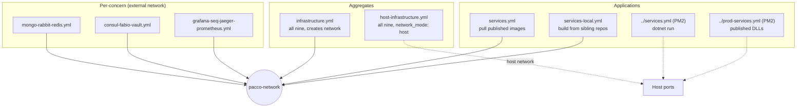

# Pattern: Composable Per-Concern Environment Stacks

## Status

**Candidate.** No approval metadata, ADR, or documented human sign-off exists in the workspace, and
the CAKE catalog for tenant `Q5SCXYFS` holds no governing decision.

## Category

deployment

## Problem

A platform with eleven deployables and nine pieces of supporting infrastructure cannot be run from one
file that everyone shares. One developer wants the datastores but is running the services from an IDE.
Another wants everything. A third is working on tracing and needs only the telemetry backends. A single
monolithic manifest forces all of them to start everything, and a per-developer manifest means nobody's
setup matches anybody else's.

## Context

Applies where a platform's supporting infrastructure is substantial and different people need different
subsets of it. Pacco splits its Docker Compose definitions along concern lines — datastores, service
mesh and secrets, telemetry, application services — plus two aggregate files and two process-manager
manifests for running without containers at all.

## When to Use

- Infrastructure is large enough that "start everything" is expensive.
- Developers routinely need different subsets, and those subsets fall along stable lines.
- Some people run the applications in containers and others run them from a build directory.
- The same set of components must be startable in more than one topology.

## When Not to Use

- Few components, where one file is simpler than eight.
- A real orchestrator is available. Compose files describe a single host; anything with scheduling,
  rolling updates, or multi-host placement needs the orchestrator's own manifests, and maintaining both
  means two descriptions of the same system.
- The composition matters more than the pieces — if components must always start together in a
  particular order, splitting them invites starting them wrong.

## Architecture Summary

Eight Compose files fall into four groups.

**Per-concern files** each declare one slice: `mongo-rabbit-redis.yml` for datastores and the broker,
`consul-fabio-vault.yml` for discovery, routing, and secrets, and
`grafana-seq-jaeger-prometheus.yml` for telemetry. Each attaches to an externally created network named
`pacco-network`, so the slices compose by sharing that network rather than by referencing each other.

**Aggregate files** restate the same components in one place: `infrastructure.yml` declares all nine and
creates the network itself, and `host-infrastructure.yml` declares the same nine with `network_mode:
host` for environments where the container network is in the way.

**Service files** declare the eleven application containers. `services.yml` pulls published images;
`services-local.yml` is otherwise identical but builds each image from the sibling repository's
directory. The only other difference is the gateway's configuration environment variable.

**Process-manager manifests**, in the repository root rather than `compose/`, run the applications
without containers: `services.yml` runs `dotnet run` from each source directory, `prod-services.yml`
runs published DLLs with an explicit port per application.

The composition is by convention: a shared network name, a shared port map, and configuration in each
service that names its dependencies by host.

## Structure / Flow

## Key Components

| File | Declares | Distinguishing property |
|------|----------|------------------------|
| `mongo-rabbit-redis.yml` | MongoDB, RabbitMQ, Redis | Datastores and broker |
| `consul-fabio-vault.yml` | Consul, Fabio, Vault | Discovery, routing, secrets; network `external: true` |
| `grafana-seq-jaeger-prometheus.yml` | Grafana, Prometheus, Jaeger, Seq | Telemetry backends |
| `infrastructure.yml` | All nine | Creates `pacco-network`; the usual entry point |
| `host-infrastructure.yml` | All nine | `network_mode: host` throughout |
| `services.yml` (compose) | 11 application containers | `image:` from a published registry |
| `services-local.yml` | The same 11 | `build:` from `../../<repo>` |
| `services.yml` (root) | 10 applications | Process manager, `dotnet run`, `max_restarts: 3` |
| `prod-services.yml` (root) | 10 applications | Process manager, published DLLs, explicit `ASPNETCORE_URLS` |

## Data / Event / API Contracts

- **Network:** `pacco-network`. Declared `external: true` in the per-concern files — so it must be
  created first — and created by `infrastructure.yml`.
- **Container names** match the registered service names: `orders-service`, `pricing-service`, and so on,
  which is what lets container DNS resolve them ([[registry-mediated-discovery-and-routing]]).
- **Port map:** gateway `5000:80`, services `5001:80` through `5009:80` and `5015:80`. Infrastructure
  keeps its default ports — Mongo 27017, RabbitMQ 5672 with management 15672 and metrics 15692, Redis
  6379, Consul 8500, Fabio 9998/9999, Vault 8200, Prometheus 9090, and the Grafana, Jaeger and Seq UIs.
- **Container environment:** `ASPNETCORE_URLS=http://*:80` and `ASPNETCORE_ENVIRONMENT=docker` are set in
  each service's Dockerfile, which is what selects the `appsettings.docker.json` overlay.
- **Gateway configuration selector:** `NTRADA_CONFIG`. `services.yml` sets
  `ntrada-async.docker.yml`; **`services-local.yml` sets `ntrada.docker`** — a different configuration
  (synchronous rather than asynchronous routes) and without the `.yml` suffix the other three uses carry.
- **Persistence:** volumes are declared for `mongo` and `redis` only. Those for `consul`, `grafana`,
  `prometheus`, `rabbitmq` and `seq` are present but commented out, as are the Mongo root-credential
  environment variables.
- **Process-manager manifests cover ten applications and omit `ordermaker`**, which the Compose files
  include.

## Naming Conventions

| Element | Convention | Example |
|---------|-----------|---------|
| Per-concern file | Component names joined by hyphens, alphabetical within the concern | `mongo-rabbit-redis.yml` |
| Aggregate file | The concern, optionally prefixed by topology | `infrastructure.yml`, `host-infrastructure.yml` |
| Service file | `services.yml`, with a suffix for the variant | `services-local.yml` |
| Container name | The registered service name | `parcels-service` |
| Image name | `devmentors/pacco.services.<name>`, lower case, dot-separated | `devmentors/pacco.services.orders` |
| Process-manager app name | The short service name | `orders`, `api` |
| Network | `pacco-network` | — |

The image naming and the container naming use different separators for the same service — dots in
`pacco.services.orders`, hyphens in `orders-service` — which is a small tax paid every time someone
maps one to the other.

## Service / Boundary Guidance

- **One file per concern, composed by a shared network.** No file references another; the network name
  is the only coupling, which is what makes any subset startable.
- **Keep the aggregate files honest.** `infrastructure.yml` restates all nine components rather than
  including the three per-concern files, because Compose has no include mechanism at this version. That
  duplication is the pattern's main maintenance cost, and it is where drift will appear first.
- **Vary one dimension per variant.** `services.yml` and `services-local.yml` differ only in `image:`
  versus `build:` — except for the gateway's `NTRADA_CONFIG`, which is a second difference that looks
  unintentional.
- **Use container names that match registered service names.** It means a service reached by container
  DNS and a service reached through the registry resolve the same string.
- **The process-manager manifests are a third topology, not a fallback.** They run the same
  applications with no containers at all, which is why every service's default configuration points at
  `localhost` and the Docker overlay redirects to container names.
- **`ordermaker` is in the container files and in neither process-manager manifest.** Whether it is
  meant to run is unresolved and matters, because it is what starts the saga flow
  ([[saga-process-manager]]).

## Security / Compliance Considerations

- **Every service port is published to the host** in both service Compose files, so services are
  reachable without passing through the gateway — which is where all per-route authentication lives
  ([[edge-enforced-authentication-with-identity-binding]]).
- **Every infrastructure management interface is published too**: the RabbitMQ management UI, the
  Consul UI, the Fabio admin port, Grafana, Prometheus, Seq, the Jaeger UI, and Vault. None is behind
  authentication beyond its own defaults.
- **MongoDB runs with no authentication.** The `MONGO_INITDB_ROOT_USERNAME` and
  `MONGO_INITDB_ROOT_PASSWORD` environment variables are present and commented out, so any process that
  can reach port 27017 has full access to all eight service databases.
- **Redis has no password and no TLS.**
- **Vault runs in development mode** with a known root token, in all three files that declare it
  ([[vault-issued-dynamic-credentials-and-service-pki]]).
- **`network_mode: host`** in `host-infrastructure.yml` removes container network isolation entirely for
  all nine infrastructure components.
- **No resource limits** are set on any container, so one runaway process can exhaust the host.

## Observability Considerations

- **The telemetry stack is itself a per-concern file**, so it can be started alone — genuinely useful
  when working on tracing or dashboards.
- **Prometheus and Grafana are built from local directories** (`build: ./prometheus`), so scrape targets
  and dashboards are version-controlled alongside the stack rather than configured by hand.
- **Telemetry persistence is commented out** for Prometheus, Grafana and Seq, so metrics history,
  dashboards and logs are lost on restart — the moment they are most useful
  ([[structured-logging-with-property-redaction]]).
- **RabbitMQ publishes its Prometheus metrics port** (15692), so broker metrics are available; whether
  Prometheus scrapes it is determined by the configuration in `compose/prometheus`.
- **No health checks are declared on any container**, so Compose starts everything at once and a service
  that comes up before its datastore has to survive that on its own.
- **No `depends_on` anywhere**, which is consistent with the composable design — files that do not
  reference each other cannot express ordering — and means startup order is not controlled at all.

## Failure Handling

- **`restart: unless-stopped`** on every container, so a crashed component comes back.
- **`max_restarts: 3`** in both process-manager manifests, which is the opposite policy: give up after
  three attempts rather than restart indefinitely.
- **No health checks and no dependency ordering**, so a service starting before MongoDB or RabbitMQ
  fails and relies on the restart policy to eventually succeed.
- **Missing network:** the per-concern files declare `pacco-network` as external, so starting one before
  the network exists fails immediately with a clear message.
- **Data loss on restart** for every component whose volume is commented out — Consul, RabbitMQ,
  Prometheus, Grafana and Seq. For Consul this is harmless, since services re-register. For RabbitMQ it
  means declared exchanges, queues and any unconsumed messages are lost.

## Trade-offs

| Gain | Cost |
|------|------|
| Any subset of infrastructure can be started alone | Eight files describing overlapping sets of the same nine components |
| Aggregate files give newcomers one command | The aggregates duplicate the per-concern files and can drift from them |
| Two topologies — container network and host network | Both must be kept in step by hand |
| Two service variants — published images and local builds | They have already drifted: the gateway configuration differs |
| Process-manager manifests allow running without containers | A third description of the same eleven applications, and it omits one |
| Compose is simple and needs no cluster | It describes one host, with no scheduling, scaling, or rolling updates |

## Variants

- **Per-concern** versus **aggregate** — the same nine components, restated.
- **Bridge network** (`infrastructure.yml`) versus **host network** (`host-infrastructure.yml`).
- **Published images** (`services.yml`) versus **local builds** (`services-local.yml`).
- **Containers** versus **process manager** — and within that, `dotnet run` from source versus published
  DLLs with explicit ports.
- **`appsettings.json` versus `appsettings.docker.json`**, selected by `ASPNETCORE_ENVIRONMENT=docker`
  in the Dockerfile — the same per-environment substitution seen in the four Ntrada configuration files
  ([[declarative-configuration-driven-api-gateway]]).

## Anti-patterns

- **Eight files describing overlapping subsets with no include mechanism.** Every component is declared
  two or three times, and nothing detects when the copies diverge.
- **Variants that differ in more than the one dimension they name.** `services-local.yml` was meant to
  differ only in `image:` versus `build:` and also changes the gateway's configuration file — a
  difference that will surprise whoever finds it.
- **A configuration value missing its file extension** (`NTRADA_CONFIG=ntrada.docker`) where the other
  three uses include it.
- **Commented-out persistence** on five of nine components, which reads as a decision deferred rather
  than made.
- **Commented-out database credentials**, leaving the platform's primary datastore open.
- **Publishing every management interface to the host** with default or absent authentication.
- **A third deployment description that omits one of the applications** the other two include.
- **No health checks and no start ordering**, leaving correct startup to the restart policy.

## Evidence

- **ADR:** none — no ADR exists in any cloned repository or in the CAKE catalog for tenant `Q5SCXYFS`.
- **Repo:** `hianshul100_Pacco` — the deployment repository; it contains no application code.
- **Service:** all eleven deployables are declared in `compose/services.yml`; ten in the process-manager
  manifests.
- **File:**
  `hianshul100_Pacco/compose/consul-fabio-vault.yml:4-25` (Consul and Fabio), `:27-39` (Vault),
  `:41-44` (`pacco-network`, `external: true`), `:46-48` (commented Consul volume);
  `compose/mongo-rabbit-redis.yml:4-38`;
  `compose/grafana-seq-jaeger-prometheus.yml:4-54` — Grafana, Prometheus, Jaeger, Seq, with volume
  declarations commented out at `:13`, `:24`, `:52`;
  `compose/infrastructure.yml:4-125` — all nine components, `:53-64` MongoDB with credentials commented
  out at `:56-58` and a live `mongo` volume at `:63-64`, `:67-76` Prometheus built from `./prometheus`,
  `:78-89` RabbitMQ publishing 5672/15672/15692 with its volume commented out, `:91-100` Redis with a
  live volume, `:129-131` the network it creates, `:133-147` the volume list with five of seven
  commented out;
  `compose/host-infrastructure.yml:4-104` — the same nine with `network_mode: host`, e.g. Vault at
  `:79-88`;
  `compose/services.yml:1-116` — eleven containers, `image: devmentors/pacco.*`, gateway at `:4-13` with
  `NTRADA_CONFIG=ntrada-async.docker.yml` (`:9`) and `5000:80` (`:11`);
  `compose/services-local.yml` — identical except `build: ../../<repo>` on all eleven and
  **`NTRADA_CONFIG=ntrada.docker`** at `:9`;
  `hianshul100_Pacco/services.yml:1-40+` — the process-manager manifest, `script: dotnet run`,
  `cwd: ../<repo>/src/<project>`, `max_restarts: 3`;
  `hianshul100_Pacco/prod-services.yml:1-40+` — published DLLs under
  `bin/release/netcoreapp3.1/publish` with `ASPNETCORE_URLS: http://*:500x`; neither manifest lists
  `ordermaker`;
  `hianshul100_Pacco.Services.Orders/Dockerfile:9-10` — `ASPNETCORE_URLS http://*:80` and
  `ASPNETCORE_ENVIRONMENT docker`;
  `hianshul100_Pacco/README.md:51-60` — the documented sequence: `docker-compose -f infrastructure.yml
  up -d`, then services individually or `docker-compose -f services-local.yml up`.
- **API/Event:** none — this pattern has no runtime API or message contract.
- **Deployment/Config:** the eight Compose files and two process-manager manifests above;
  `hianshul100_Pacco/scripts/` holds only repository clone and pull helpers, not deployment scripts.
- **Notes:** `architecture-baseline.md` §10.3–§10.4, §11.3. **Conflict — none between documentation and
  source**; the README describes the same files the repository contains. The `NTRADA_CONFIG`
  discrepancy is between two source files, and source is authoritative for both: the two service
  variants **do** select different gateway configurations.

## Related ADRs

None. No ADR, decision record, or RFC exists in the workspace, and the CAKE graph for tenant
`Q5SCXYFS` returned zero nodes.

## Related Patterns

- [[registry-mediated-discovery-and-routing]] — the discovery components this stack declares.
- [[independent-per-repository-release]] — produces the images `services.yml` pulls.
- [[vault-issued-dynamic-credentials-and-service-pki]] — the Vault container declared in three files.
- [[declarative-configuration-driven-api-gateway]] — selected by `NTRADA_CONFIG`.
- [[correlation-and-span-propagation]] — the telemetry backends in the per-concern telemetry file.
- [[edge-enforced-authentication-with-identity-binding]] — undermined by publishing every service port.

## Recommendation

**Adopt for development; do not carry it into a shared environment as it stands.** Splitting
infrastructure by concern behind a shared network is a good developer experience — someone working on
tracing starts four containers rather than twenty — and the README's two-command path keeps that from
costing newcomers anything. Three cautions. The eight files restate the same nine components with no
include mechanism, and they have already drifted once; treat the aggregates as generated from the
per-concern files, or accept the drift knowingly. The security posture is a local-development one
throughout — no database authentication, no Redis password, every management interface published, Vault
in development mode — and none of it should reach a shared host. And Compose describes a single host
with no scheduling or rolling updates; if the platform needs more than one host, that is a different
tool, and running both would mean maintaining a fourth description of the same eleven applications.

## Assumptions, Blockers & Open Questions

> [!IMPORTANT]
> This document contains unresolved items that require attention before or during implementation. Review and resolve before merging downstream artifacts. Each item below is tagged **[ACTION NOW]** (a human must decide or confirm it before this work can safely proceed) or **[handled later by <stage>]** (a named later stage owns and will prove it) — read the tags first to see what, if anything, is yours to act on.

### Assumptions

| # | Assumption | Rationale | Impact if Wrong | Validation Path |
|---|------------|-----------|-----------------|-----------------|
| A1 | These Compose files describe developer environments, not a production deployment | No authentication on the datastores, every management port published, Vault in development mode, no resource limits, and `localhost` addresses throughout | The platform would be running in production with an open database, an unauthenticated registry, and a secret store that loses its contents on restart | Ask the operator what runs the platform outside a developer machine; if the answer is these files, the assumption is wrong |
| A2 | The commented-out volume declarations mean the data is genuinely disposable, rather than being an oversight | Mongo and Redis have live volumes while Consul, RabbitMQ, Prometheus, Grafana and Seq do not, which looks like a distinction someone drew on purpose | Broker state, dashboards, and log and metric history would be lost on every restart without anyone having decided that | Confirm with the operator whether RabbitMQ durability and Seq history are expected to survive a restart |

### Open Questions

| # | Question | Why It Matters | Proposed Answer (if any) | Decision Owner |
|---|----------|----------------|--------------------------|----------------|
| Q1 | **[ACTION NOW]** Should `services-local.yml` set `NTRADA_CONFIG=ntrada.docker` while `services.yml` sets `ntrada-async.docker.yml`? | The two files are meant to differ only in whether images are pulled or built, so anyone running locally gets the synchronous gateway routes and anyone running published images gets the asynchronous ones — a difference in behaviour, not in build method. The value is also missing its `.yml` suffix | Align both on the same configuration unless the difference is deliberate; if it is deliberate, it needs a comment saying so | Platform owner, with the owner of `hianshul100_Pacco` |
| Q2 | **[ACTION NOW]** Should MongoDB run with authentication? | The credential environment variables are present and commented out, so the platform's primary datastore accepts any connection on a published port. Eight service databases sit behind it | Yes, and the credentials should come from Vault, which is already configured to supply per-service database credentials | Platform security owner, with the operator |
| Q3 | **[handled later by the design stage]** Should the aggregate files be generated from the per-concern files rather than hand-maintained? | Nine components are declared two or three times across eight files, and there is no mechanism keeping the copies in step | Generate them, or drop the aggregates and document the three-file sequence instead. Duplication that nothing checks will drift | Owner of `hianshul100_Pacco` |
| Q4 | **[handled later by the design stage]** Should containers declare health checks and start ordering? | Nothing controls startup order, so a service starting before MongoDB or RabbitMQ fails and depends on the restart policy to eventually succeed — noisy, and slow when it matters | Add health checks to the infrastructure containers and `depends_on` with condition in the service files, accepting that this couples the files the pattern deliberately keeps apart | Operator for the Pacco runtime |
| Q5 | **[handled later by the design stage]** Should the process-manager manifests include `ordermaker`? | The Compose files declare it and both process-manager manifests omit it, so what runs depends on how the platform was started — and it is the component that starts the saga flow | Decide whether the service is meant to run at all; the same question is open in the saga pattern and should be answered once | Platform owner |
