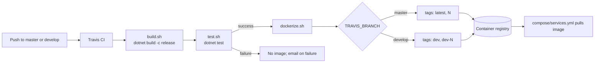

# Pattern: Independent Per-Repository Release

## Status

**Candidate.** No approval metadata, ADR, or documented human sign-off exists in the workspace, and
the CAKE catalog for tenant `Q5SCXYFS` holds no governing decision.

## Category

deployment

## Problem

If eleven deployables share one repository and one pipeline, they share one release. A change to the
pricing rules waits for whatever else is in flight, every deployment carries every service's risk, and
the build takes as long as the slowest project. The independence that motivated splitting the system
into services never reaches the point where it would pay — the moment of shipping.

## Context

Applies where services are genuinely independent at runtime and their teams want to release on their own
cadence. Each Pacco deployable lives in its own repository with its own pipeline, its own container
image, and its own version counter, and nothing coordinates them.

## When to Use

- Services are independently deployable at runtime, with no build-time coupling between them.
- Contracts between services are stable enough that one can move without the others.
- Different services change at genuinely different rates.
- Ownership is per service, so per-service pipelines match how people work.

## When Not to Use

- Services share code that changes often. Without a shared package, a change means an identical edit in
  every repository, and per-repository pipelines make that worse rather than better.
- A change routinely spans several services. Coordinating a release across independent pipelines is
  harder than one pipeline that builds everything.
- Nobody can say what version of the whole platform is deployed, and somebody needs to be able to.

## Architecture Summary

Eleven repositories, each self-contained. Each holds a solution, a `Dockerfile`, a `.travis.yml`, and a
`scripts/` directory with `build.sh`, `test.sh`, `dockerize.sh`, and a `start.sh` for running locally.

The pipeline is the same three steps everywhere. `build.sh` runs `dotnet build -c release`; `test.sh`
runs `dotnet test`; and on success `dockerize.sh` builds the image and pushes it. The pipeline is
restricted to `master` and `develop`, and the branch decides the tags: `master` produces `latest` plus a
bare build number, `develop` produces `dev` plus `dev-<build number>`. Any other branch produces no
tags and pushes an image with an empty tag.

The image is a two-stage build: publish on the SDK image, run on the ASP.NET runtime image, with the
listening port and environment name fixed as environment variables. The container therefore selects its
`appsettings.docker.json` overlay without anything outside the image saying so.

Nothing coordinates the eleven pipelines. Version numbers are per repository, so build 40 of
`orders-service` has no relationship to build 40 of `parcels-service`.

## Structure / Flow

## Key Components

| Component | Responsibility |
|-----------|----------------|
| `.travis.yml` | Pins the SDK version, restricts branches, orders the three steps |
| `scripts/build.sh` | `dotnet build -c release` |
| `scripts/test.sh` | `dotnet test` |
| `scripts/dockerize.sh` | Derives tags from the branch, builds, logs in, pushes |
| `scripts/start.sh` | Runs the service locally with an environment name set |
| `Dockerfile` | Two-stage publish-then-run, fixing port and environment |
| `DOCKER_USERNAME` / `DOCKER_PASSWORD` | Registry credentials, supplied by the CI environment |
| `TRAVIS_BUILD_NUMBER` | The version counter — per repository |

## Data / Event / API Contracts

- **Pipeline definition**, byte-identical in ten of eleven repositories: `language: csharp`,
  `mono: none`, `dist: xenial`, `dotnet: 3.1.100`, `branches.only: [master, develop]`,
  `before_script: chmod -R a+x scripts`, `script: build.sh` then `test.sh`,
  `after_success: dockerize.sh`, and email notification on failure only.
- **`hianshul100_Pacco.Services.Availability` is the exception: its `.travis.yml` omits the
  `./scripts/test.sh` line.** The script exists in the repository; the pipeline does not run it. So one
  service ships images that no automated test gated.
- **Image naming:** `$DOCKER_USERNAME/pacco.services.<name>`, or `pacco.apigateway` for the gateway —
  lower case, dot-separated.
- **Tag scheme:** `master` → `latest` and `$TRAVIS_BUILD_NUMBER`; `develop` → `dev` and
  `dev-$TRAVIS_BUILD_NUMBER`.
- **Container environment:** `ASPNETCORE_URLS=http://*:80` and `ASPNETCORE_ENVIRONMENT=docker` in every
  Dockerfile. The gateway adds `NTRADA_CONFIG=ntrada.docker`, which the Compose files then override.
- **Base images:** `mcr.microsoft.com/dotnet/core/sdk:3.1` to build,
  `mcr.microsoft.com/dotnet/core/aspnet:3.1` to run — floating 3.1 tags, not pinned digests.
- **Environment names in scripts:** `start.sh` sets `local`; the Dockerfile sets `docker`;
  `Parcels/scripts/test.sh` sets `tests` while `Parcels/scripts/start-test.sh` sets `test`. Four names,
  and two of them differ by one letter for closely related purposes.
- **Three repositories have no pipeline at all:** `hianshul100_Pacco` (deployment),
  `hianshul100_Pacco.Web` (a one-line README), and `hianshul100_Pacco.Context` (documentation).

## Naming Conventions

| Element | Convention | Example |
|---------|-----------|---------|
| Repository | `Pacco.Services.<Name>`, PascalCase | `Pacco.Services.Deliveries` |
| Image | `pacco.services.<name>`, lower case, dots | `pacco.services.deliveries` |
| Container name at runtime | `<name>-service`, hyphens | `deliveries-service` |
| Script names | Verb, lower case, `.sh` | `build.sh`, `dockerize.sh` |
| Release tag | `latest` and the build number | `latest`, `137` |
| Pre-release tag | `dev` and `dev-<build number>` | `dev`, `dev-137` |
| Environment name | Lower case, set by whatever starts the process | `local`, `docker`, `tests` |

Three separator conventions for one service — `Pacco.Services.Orders`, `pacco.services.orders`,
`orders-service` — is a small, permanent translation cost paid by anyone moving between a repository, a
registry, and a running container.

## Service / Boundary Guidance

- **One repository, one deployable, one pipeline.** No repository builds two images, and no image is
  built from two repositories.
- **Keep the pipeline definition identical across repositories.** Ten of eleven are byte-identical,
  which means a change to the release process is a mechanical edit rather than eleven decisions. It also
  means the one that differs is invisible unless someone compares them, which is exactly what happened
  with the missing test step.
- **Put the steps in scripts, not in the pipeline definition.** `.travis.yml` names three scripts;
  everything else is in the repository and runs the same way on a developer machine.
- **Let the branch decide the tags.** No manual versioning, no release branches, no tag discipline to
  forget.
- **Fix the runtime environment in the image.** Port and environment name come from the Dockerfile, so
  the same image behaves the same wherever it is started.
- **A change spanning services is a change spanning repositories**, released in whatever order the
  pipelines finish. Contracts have to tolerate a mixed fleet, which is why message contracts here are
  additive and consumers ignore unknown fields
  ([[service-owned-topic-exchange-messaging]]).
- **There is no shared internal package**, so anything common — the caller context types, the message
  broker wrapper, the outbox decorators — is copied into each repository and must be edited in each one
  ([[framework-supplied-platform-conventions]]).

## Security / Compliance Considerations

- **Registry credentials come from CI environment variables** and are not committed, which is correct.
  `docker login -u $DOCKER_USERNAME -p $DOCKER_PASSWORD` does pass the password on the command line,
  where it can appear in process listings and, if the variable is ever unmasked, in build logs.
- **Base images use floating `3.1` tags.** Two builds of the same commit can produce different images,
  and neither the digest nor the patch level is recorded anywhere.
- **.NET Core 3.1 reached end of support in December 2022.** The runtime these images are built on
  receives no security updates, which is the most consequential fact in this pattern and is not
  addressable within it.
- **No image scanning, signing, or provenance** is configured in any pipeline.
- **No dependency audit.** Package references use floating `0.4.*` versions, so a restore can pull a
  different package version than the last build did.
- **`latest` is pushed on every `master` build** and the Compose files pull it without a digest, so what
  a deployment runs depends on when it was started.
- **One service's pipeline runs no tests**, so nothing gates its images.

## Observability Considerations

- **The build number is the only version identifier**, and it does not reach the running service. Every
  service's `app.version` is the literal string `"1"` in configuration, so logs, metrics and traces
  cannot say which build produced them.
- **There is no platform version.** Eleven independent counters, no manifest recording which combination
  is deployed, so "what was running when this broke" has no recorded answer.
- **Failure notification is email-only**, on failure, with success notifications off. There is no build
  dashboard or status metric.
- **`after_success` means a failing test suite blocks the image** — the pipeline's one real gate, and
  the reason the missing test step in one repository matters.
- **No pipeline reports test counts, coverage, or duration** anywhere they can be tracked over time
  ([[layered-service-test-suite]]).

## Failure Handling

- **Build fails:** no test run, no image, an email.
- **Tests fail:** `after_success` does not run, so no image is pushed. This is the whole safety
  mechanism.
- **Push to a branch other than `master` or `develop`:** the pipeline does not run at all.
- **A build somehow reaching `dockerize.sh` from another branch:** `TAG` and `VERSION_TAG` stay empty and
  the script pushes an image with an empty tag. The `case` statement has no default and the script does
  not exit on error.
- **Registry unavailable:** the push fails, the build is marked failed, and the previously pushed
  `latest` remains — so a failed release silently leaves the prior image in place.
- **A contract change released ahead of its consumers:** nothing in the pipeline detects it. The only
  guard is the consumer-driven contract test pair, and it covers one pair of services
  ([[consumer-driven-contract-test-pair]]).

## Trade-offs

| Gain | Cost |
|------|------|
| Any service can ship without waiting for another | No recorded notion of which combination is deployed |
| Pipelines are small, fast, and identical | Eleven copies of the same definition, and one has already diverged |
| Branch-derived tags need no version discipline | The version is a CI counter that never reaches the running service |
| Steps live in scripts, so they run the same locally | Four different environment names across those scripts, two differing by one letter |
| A failing test suite blocks the image | Except in the one repository whose pipeline omits the test step |
| Per-repository ownership matches per-service ownership | Shared code has nowhere to live, so it is copied into every repository |

## Variants

- **Ten repositories with `build → test → dockerize`** versus **`availability-service` with
  `build → dockerize`**. Not a designed variant — a difference of one missing line.
- **`master` → `latest`** versus **`develop` → `dev`**, the same pipeline producing two release channels.
- **Repositories with a pipeline** (eleven deployables) versus **without** (deployment, web,
  documentation).
- **`start.sh` for local runs** versus **`start-async.sh`** (gateway) and **`start-test.sh`** (parcels)
  — the same pattern with a different environment name.

## Anti-patterns

- **A pipeline that skips its own test script** while the script sits in the repository, giving every
  appearance of being run.
- **Floating base-image and package versions**, so the same commit does not reproduce the same image.
- **`latest` in a deployment manifest**, which makes what is running a function of when it was started.
- **A version counter that never reaches the artifact.** `app.version: "1"` in eleven services means the
  platform cannot say what it is running.
- **A `case` with no default in a script that keeps going**, producing an empty-tag push instead of a
  failure.
- **Passing a registry password as a command-line argument.**
- **Building on a runtime that is out of support.**
- **Three naming conventions for one service** across repository, image, and container.

## Evidence

- **ADR:** none — no ADR exists in any cloned repository or in the CAKE catalog for tenant `Q5SCXYFS`.
- **Repo:** eleven repositories with a pipeline; three without.
- **Service:** all eleven deployables.
- **File:**
  `hianshul100_Pacco.Services.Orders/.travis.yml:1-20` — `dotnet: 3.1.100` (`:5`),
  `branches.only: [master, develop]` (`:6-9`), `chmod -R a+x scripts` (`:11`),
  `script: build.sh` then `test.sh` (`:13-14`), `after_success: dockerize.sh` (`:16`), email on failure
  only (`:17-20`); the byte-identical file in `APIGateway`, `Customers`, `Deliveries`, `Identity`,
  `Operations`, `OrderMaker`, `Parcels`, `Pricing`, `Vehicles`;
  **`hianshul100_Pacco.Services.Availability/.travis.yml` — the same file with line 14
  (`- ./scripts/test.sh`) absent**, confirmed by direct comparison against the gateway's copy;
  `hianshul100_Pacco.Services.Orders/scripts/build.sh` (`dotnet build -c release`),
  `scripts/test.sh` (`dotnet test`),
  `scripts/dockerize.sh:5-21` — the branch `case` with no default (`:5-14`),
  `REPOSITORY=$DOCKER_USERNAME/pacco.services.orders` (`:16`), `docker login -u … -p …` (`:18`),
  two tags built and pushed (`:19-21`);
  `hianshul100_Pacco.APIGateway/scripts/dockerize.sh` — the same script with
  `REPOSITORY=$DOCKER_USERNAME/pacco.apigateway`;
  `hianshul100_Pacco.Services.Orders/Dockerfile:1-11` — SDK stage publishing
  `src/Pacco.Services.Orders.Api` (`:1-4`), ASP.NET runtime stage (`:6-8`),
  `ASPNETCORE_URLS http://*:80` and `ASPNETCORE_ENVIRONMENT docker` (`:9-10`), `ENTRYPOINT` (`:11`);
  `hianshul100_Pacco.APIGateway/Dockerfile:11` — additionally `ENV NTRADA_CONFIG ntrada.docker`;
  `hianshul100_Pacco.Services.Orders/scripts/start.sh` — `ASPNETCORE_ENVIRONMENT=local`;
  `hianshul100_Pacco.Services.Parcels/scripts/test.sh` — `ASPNETCORE_ENVIRONMENT=tests`;
  `hianshul100_Pacco.Services.Parcels/scripts/start-test.sh` — `ASPNETCORE_ENVIRONMENT=test`;
  `app.version: "1"` in all ten service `appsettings.json` files.
- **API/Event:** none — this pattern has no runtime API or message contract.
- **Deployment/Config:** `hianshul100_Pacco/compose/services.yml` — `image: devmentors/pacco.*` for all
  eleven containers, no tag specified and therefore `latest`;
  `hianshul100_Pacco/compose/services-local.yml` — `build:` from the sibling repository instead;
  `hianshul100_Pacco` and `hianshul100_Pacco.Web` contain no `.travis.yml`, `Dockerfile`, or build
  scripts.
- **Notes:** `architecture-baseline.md` §10.5, §11.3. **Conflict — none between documentation and
  source.** The missing test step in `availability-service` is a difference between two source files;
  source is authoritative and the pipeline, not the script's presence, determines what runs.

## Related ADRs

None. No ADR, decision record, or RFC exists in the workspace, and the CAKE graph for tenant
`Q5SCXYFS` returned zero nodes.

## Related Patterns

- [[composable-per-concern-environment-stacks]] — consumes the images this pattern publishes.
- [[layered-service-test-suite]] — what `test.sh` runs, and what one pipeline skips.
- [[consumer-driven-contract-test-pair]] — the only cross-repository guard against a contract change.
- [[framework-supplied-platform-conventions]] — why there is no shared package to release.
- [[service-owned-topic-exchange-messaging]] — the contracts that must tolerate a mixed fleet.
- [[registry-mediated-discovery-and-routing]] — why callers survive a callee being redeployed.

## Recommendation

**Adopt.** One repository, one deployable, one pipeline is the right structure for a platform whose
services are independent at runtime, and keeping the steps in scripts rather than in the pipeline
definition means the release process runs the same on a developer machine as in CI. The identical
pipeline across ten repositories is a genuine strength — until it is not, and the eleventh has already
diverged by dropping its test step, which is precisely the sort of thing this structure makes invisible.
Four fixes, in order of value: restore the test step in `availability-service`; stamp the build number
into the running service so telemetry can say what is deployed, replacing `app.version: "1"`; pin base
images and package versions so a commit reproduces an image; and deploy by digest or explicit tag rather
than `latest`. A periodic check that the eleven pipeline definitions still match would have caught the
first of those and will catch the next one.

## Assumptions, Blockers & Open Questions

> [!IMPORTANT]
> This document contains unresolved items that require attention before or during implementation. Review and resolve before merging downstream artifacts. Each item below is tagged **[ACTION NOW]** (a human must decide or confirm it before this work can safely proceed) or **[handled later by <stage>]** (a named later stage owns and will prove it) — read the tags first to see what, if anything, is yours to act on.

### Assumptions

| # | Assumption | Rationale | Impact if Wrong | Validation Path |
|---|------------|-----------|-----------------|-----------------|
| A1 | `DOCKER_USERNAME` and `DOCKER_PASSWORD` are supplied as protected CI variables and are not stored in any repository | They appear only as variable references in `dockerize.sh`, and no value for either is present in the workspace | Registry push credentials would be readable by anyone with repository access, allowing an attacker to publish images the platform then pulls | Check the CI project settings for both variables and confirm they are marked hidden in build output |
| A2 | The registry the images are pushed to is the same one the Compose files pull from | The image names in `dockerize.sh` and in `compose/services.yml` follow the same `pacco.*` scheme | Deployments would be running images from a different account than the pipelines publish to, and pipeline changes would have no effect on what runs | Compare the `DOCKER_USERNAME` value in CI to the account prefix in `compose/services.yml` |

### Open Questions

| # | Question | Why It Matters | Proposed Answer (if any) | Decision Owner |
|---|----------|----------------|--------------------------|----------------|
| Q1 | **[ACTION NOW]** Why does `availability-service` skip its test step, and should it be restored? | Its `.travis.yml` is identical to the other ten except that the `./scripts/test.sh` line is absent, while the script itself is present. The one gate between a failing test and a published image is missing for that service | Restore the line unless there is a documented reason — most likely an accidental deletion nobody noticed, since the pipelines are otherwise byte-identical | Owner of `hianshul100_Pacco.Services.Availability` |
| Q2 | **[ACTION NOW]** Should the build number be stamped into the running service? | `app.version` is the literal `"1"` in all ten services, so no log line, metric, or trace can say which build produced it — and with eleven independent counters there is no platform version either | Yes — write `TRAVIS_BUILD_NUMBER` into the image at build time and read it into `app.version`. Without it, correlating a defect to a release is guesswork | Platform owner |
| Q3 | **[handled later by the design stage]** Should base images and package versions be pinned? | Base images use floating `3.1` tags and packages use floating `0.4.*`, so the same commit does not reproduce the same image, and no digest is recorded | Yes — pin base images by digest and packages by exact version, with a scheduled job to propose updates | Platform owner, with the owners of the eleven repositories |
| Q4 | **[handled later by the design stage]** Should deployments reference a digest or explicit tag rather than `latest`? | `compose/services.yml` specifies no tag, so what a deployment runs depends on when it was started and cannot be reproduced afterwards | Yes — deploy by explicit tag at minimum. This is the same problem as Q2 seen from the deployment side | Operator for the Pacco runtime |
| Q5 | **[handled later by the design stage]** What is the plan for the end-of-support .NET Core 3.1 runtime? | Every image is built on a runtime that stopped receiving security updates in December 2022, and no pipeline scans images or audits dependencies | Plan an upgrade to a supported runtime; it is a per-repository change, which is exactly the kind of change this pattern makes tractable one service at a time | Platform owner |
