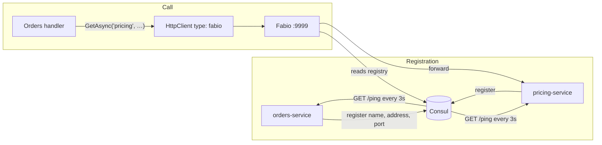

# Pattern: Registry-Mediated Discovery And Routing

## Status

**Candidate.** No approval metadata, ADR, or documented human sign-off exists in the workspace, and
the CAKE catalog for tenant `Q5SCXYFS` holds no governing decision.

## Category

deployment

## Problem

A service that needs to call another has to know where it is. Hard-coding a host and port works until
the callee moves, scales to two instances, or restarts on a different address — and then every caller
needs redeploying. Configuration files postpone the problem rather than solving it: they still contain
addresses, they still go stale, and they still have to be updated in lockstep across repositories that
release independently.

## Context

Applies where services call each other over HTTP and instances are not at fixed addresses. Pacco has
ten services that register themselves with Consul at startup, expose a health endpoint for it to poll,
and address each other by logical service name through a Fabio load balancer that reads the same
registry.

## When to Use

- Services call each other directly over HTTP and instance addresses are not stable.
- More than one instance of a service may exist, and callers should not choose between them.
- A failed instance should stop receiving traffic without anyone intervening.
- Services release independently, so a caller cannot be redeployed every time a callee moves.

## When Not to Use

- The runtime already provides discovery — a container orchestrator with its own service DNS makes this
  layer redundant, and running both means two sources of truth for the same question.
- Every call is asynchronous. Messaging already decouples location; a registry adds nothing.
- One instance per service at a known address, where the registry is machinery around a constant.

## Architecture Summary

Each service declares a `consul` block naming itself, the address and port it can be reached on, and a
health endpoint. At startup it registers under that name; Consul then polls the endpoint every three
seconds and deregisters the instance three intervals after it stops answering.

Callers do not resolve addresses themselves. Each service declares an `httpClient` block with
`type: fabio` and a `services` map from a short local alias to the registered service name. Calling
code asks for `"pricing"`; the client rewrites that to a request through Fabio, which reads the Consul
registry and forwards to a live instance. Three retries are configured on the caller's side.

The result is that no source file and no caller's configuration contains a host or port for another
service — only names.

## Structure / Flow

## Key Components

| Component | Responsibility |
|-----------|----------------|
| `consul` configuration block | Service name, address, port, health endpoint, intervals |
| `AddConsul()` | Registers the service at startup |
| `ping` endpoint | The health signal Consul polls; excluded from logs, traces and metrics |
| Consul | Holds the registry and marks instances unhealthy |
| `fabio` configuration block | Names the load balancer URL and this service's registered name |
| `AddFabio()` | Makes the HTTP client route through Fabio |
| `httpClient.services` map | Local alias → registered service name |
| `httpClient.retries` | Three attempts per call, at the caller |
| `httpClient.requestMasking` | Replaces request content with `*****` in client logs |

## Data / Event / API Contracts

- **Registered name:** `<name>-service` — `orders-service`, `pricing-service`, and so on. Ten services
  register; the gateway does not.
- **Health check:** `pingEnabled: true`, `pingEndpoint: "ping"`, `pingInterval: 3`,
  `removeAfterInterval: 3`. So an instance disappears from the registry roughly nine seconds after it
  stops responding.
- **Consul address:** `http://localhost:8500` in every service.
- **Fabio address:** `http://localhost:9999` in every service; Fabio itself reads Consul at
  `consul:8500` and publishes ports 9998 (admin) and 9999 (traffic).
- **Alias maps actually populated:** `orders-service` → `parcels`, `pricing`, `vehicles`;
  `ordermaker-service` → `availability`, `vehicles`; `availability-service` → `customers`;
  `pricing-service` → `customers`. The other six declare an empty `services: {}` — configured for the
  pattern, calling nobody.
- **`httpClient.type`:** `fabio` in nine services; **empty string in `ordermaker-service`**, which
  declares two service aliases but is not configured to route through Fabio to reach them.
- **Registered address:** `docker.for.win.localhost` in nine services — a Docker Desktop for Windows
  host alias — and `localhost` in `ordermaker-service`. This is a developer-machine address baked into
  configuration, and it is the value Consul hands to callers.
- **Registered port:** the service's own port, `5001` through `5009` and `5015`, as a string.

## Naming Conventions

| Element | Convention | Example |
|---------|-----------|---------|
| Registered service name | `<name>-service`, kebab-case | `deliveries-service` |
| Local alias in `httpClient.services` | Short name, no suffix | `pricing` |
| Health endpoint | `ping`, no leading slash in configuration | `pingEndpoint: "ping"` |
| Fabio traffic port | `9999`; admin on `9998` | — |
| Consul port | `8500` | — |
| Excluded paths | `/`, `/ping`, `/metrics` — the same three everywhere | — |

The alias-to-name indirection is the useful part of the convention: calling code says `"pricing"` and
never learns that the registry calls it `pricing-service`, so a rename is a configuration change in one
file rather than a code change across a repository
([[narrow-synchronous-point-read]]).

## Service / Boundary Guidance

- **Register under a stable logical name, not an instance identifier.** The name is the contract;
  the address behind it is not.
- **Callers address aliases, never hosts.** No observed call site contains a host or port. That is what
  makes the pattern worth its machinery.
- **Keep the health endpoint trivial and unauthenticated.** `ping` is excluded from logging, tracing and
  metrics in every service, which keeps a three-second poll from dominating telemetry.
- **Retry at the caller, three times.** Combined with deregistration, a call that hits a dying instance
  can succeed on the next attempt against a live one.
- **Do not register something that is not reachable at the address it registers.** Nine services
  register `docker.for.win.localhost`, which resolves only on Docker Desktop for Windows. Anywhere else,
  the registry is publishing an address that does not resolve.
- **Asynchronous callers need none of this.** Most inter-service communication here is over RabbitMQ;
  discovery matters only for the handful of synchronous reads
  ([[service-owned-topic-exchange-messaging]]).

## Security / Compliance Considerations

- **Consul is unauthenticated** — no ACL token or gossip encryption is configured, and its UI is
  published on port 8500. Anyone who can reach it can read the registry and register a service.
- **A service can register under any name.** Nothing verifies that the process claiming to be
  `pricing-service` is one, so an attacker with network access could register an instance and receive a
  share of the traffic.
- **Traffic through Fabio is plain HTTP**, so service-to-service calls are unencrypted end to end.
- **The health endpoint is anonymous**, which is correct for a health check and does mean liveness is
  publicly observable.
- **`requestMasking.enabled: true` with `maskTemplate: "*****"`** replaces outgoing request content in
  client-side logs — a useful default given that these calls carry identifiers
  ([[structured-logging-with-property-redaction]]).
- **Consul has no persistent volume** in the compose stack; its declaration is commented out. The
  registry rebuilds from re-registration after a restart, which is the correct behaviour for a registry
  and worth being deliberate about.

## Observability Considerations

- **The registry is the platform's most accurate inventory of what is running**, and nothing exports it
  as a metric. There is no gauge of registered instances per service, so an instance dropping out is
  visible only in the Consul UI.
- **`ping` reports process liveness only.** It does not check the database credential, the broker
  connection, or the cache. A service whose Vault lease has expired keeps answering `ping` and keeps
  receiving traffic ([[vault-issued-dynamic-credentials-and-service-pki]]).
- **Retries are invisible.** Three attempts per call are configured; nothing counts how often the second
  and third are used, which is the signal that would reveal an unstable callee.
- **Fabio's own metrics are not scraped.** The Prometheus configuration in the compose stack does not
  include it, so the component every synchronous call passes through is unmonitored.
- The three excluded paths keep health-check traffic out of logs and traces, at the cost of making a
  failing health check invisible in those same places.

## Failure Handling

- **Instance stops responding:** Consul removes it after roughly nine seconds; Fabio stops routing to
  it. During that window calls can still be routed to a dead instance, and the caller's three retries
  are what cover it.
- **Consul unavailable:** Fabio's registry goes stale. Existing routes may continue to work; new
  registrations do not happen.
- **Fabio unavailable:** every synchronous inter-service call fails. Fabio is a single point of failure
  for east-west traffic, and only one instance is declared.
- **Callee genuinely down:** three retries then failure, surfaced to the caller as an exception.
- **Registered address unresolvable:** the call fails immediately at DNS. This is the failure mode
  `docker.for.win.localhost` produces on any non-Windows host, and nothing in the configuration would
  make the cause obvious.

## Trade-offs

| Gain | Cost |
|------|------|
| No caller contains a host or port for another service | Two more infrastructure components to run, monitor, and secure |
| Failed instances leave the pool without intervention | A nine-second window where traffic still reaches a dead instance |
| Multiple instances balance without caller changes | Fabio is a single point of failure and is deployed singly |
| The alias indirection lets a service be renamed in one file | Two names for one thing — `pricing` and `pricing-service` — that must be kept in step |
| Retries absorb transient failures | Retries are unmeasured, so a chronically failing callee looks healthy |
| The registry is an accurate live inventory | Nothing reads it for monitoring, so the inventory is not used as one |

## Variants

- **`type: fabio`** (nine services) versus **`type: ""`** (`ordermaker-service`), which declares two
  aliases but no routing type.
- **Populated alias map** (four services) versus **empty `services: {}`** (six services) — the pattern
  configured everywhere and exercised in a few places.
- **`localhost` addresses** in the host-mode configuration versus container-network names in the Docker
  variants ([[composable-per-concern-environment-stacks]]).
- **Gateway routing without the registry:** the Ntrada `loadBalancer` block is present in all four
  gateway configurations and **disabled in all four**, so north-south traffic does not use Fabio at all.

## Anti-patterns

- **A developer-machine address in the registry.** `docker.for.win.localhost` is what nine services
  publish to every caller; it resolves on one operating system with one tool installed.
- **A health check that only proves the process is up.** It causes traffic to be routed to instances
  that cannot serve it.
- **An unauthenticated registry that accepts any registration**, on a network where anything can reach
  it.
- **A single load-balancer instance in front of all east-west traffic**, with no second instance
  declared anywhere.
- **Configuring discovery for services that call nobody.** Six services carry an empty `services: {}`,
  which reads as though a call exists somewhere.
- **Leaving `loadBalancer.enabled: false` at the gateway while every service registers with the
  registry the load balancer reads.** Half the platform's traffic bypasses the mechanism the other half
  depends on.

## Evidence

- **ADR:** none — no ADR exists in any cloned repository or in the CAKE catalog for tenant `Q5SCXYFS`.
- **Repo:** all ten service repositories; `hianshul100_Pacco` (infrastructure);
  `hianshul100_Pacco.APIGateway` (the disabled load-balancer configuration).
- **Service:** `availability`, `customers`, `deliveries`, `identity`, `operations`, `ordermaker`,
  `orders`, `parcels`, `pricing`, `vehicles`. Not `api-gateway`.
- **File:**
  `.AddConsul()` and `.AddFabio()` at `Identity` Extensions.cs:76-77, `Availability` :79-80,
  `Vehicles` :61-62, `OrderMaker` :31-32, `Operations` :68-69, `Deliveries` :63-64, `Customers` :67-68,
  `Orders` :70-71, `Parcels` :64-65, `Pricing` :32-33;
  `hianshul100_Pacco.Services.Orders/src/Pacco.Services.Orders.Api/appsettings.json` — `consul` block
  (`service: orders-service`, `address: docker.for.win.localhost`, `port: "5006"`,
  `pingEndpoint: "ping"`, `pingInterval: 3`, `removeAfterInterval: 3`), `fabio` block
  (`url: http://localhost:9999`, `service: orders-service`), and `httpClient` block
  (`type: fabio`, `retries: 3`, `services: { parcels, pricing, vehicles }`,
  `requestMasking.maskTemplate: "*****"`);
  the same three blocks, differing only in name and port, in the other nine services;
  `hianshul100_Pacco.Services.OrderMaker/src/Pacco.Services.OrderMaker/appsettings.json` —
  `consul.address: localhost` and **`httpClient.type: ""`** with a populated `services` map;
  `hianshul100_Pacco.APIGateway/src/Pacco.APIGateway/appsettings.json` — **no `consul` and no `fabio`
  block**;
  `hianshul100_Pacco.APIGateway/src/Pacco.APIGateway/ntrada.yml:18-21` — `useLocalUrl: true`,
  `loadBalancer.enabled: false`, `url: localhost:9999`; `ntrada.docker.yml:18-21` —
  `useLocalUrl: false`, `loadBalancer.enabled: false`, `url: fabio:9999`; the same disabled block at
  `ntrada-async.yml:19-21` and `ntrada-async.docker.yml:19-21`.
- **API/Event:** the `ping` endpoint on every service; the synchronous read paths are listed in
  [`../../baselines/api-inventory.md`](../../baselines/api-inventory.md).
- **Deployment/Config:** `hianshul100_Pacco/compose/consul-fabio-vault.yml:4-25` — `image: consul` on
  port 8500 with its volume declaration commented out (`:12-13`), and `image: fabiolb/fabio` with
  `FABIO_REGISTRY_CONSUL_ADDR=consul:8500` on ports 9998 and 9999.
- **Notes:** `architecture-baseline.md` §10.1–§10.2, §11.3. **Conflict — registered versus routed:** all
  ten services register with Consul and configure Fabio, while the gateway disables its load balancer in
  every configuration variant. Source is treated as authoritative: the registry mediates
  **service-to-service** traffic only, and gateway-to-service traffic **does not** pass through it.

## Related ADRs

None. No ADR, decision record, or RFC exists in the workspace, and the CAKE graph for tenant
`Q5SCXYFS` returned zero nodes.

## Related Patterns

- [[narrow-synchronous-point-read]] — the calls that actually use the alias map.
- [[declarative-configuration-driven-api-gateway]] — the component that opts out of the load balancer.
- [[composable-per-concern-environment-stacks]] — where Consul and Fabio are declared.
- [[service-owned-topic-exchange-messaging]] — the asynchronous path that needs no discovery.
- [[vault-issued-dynamic-credentials-and-service-pki]] — the other startup-time infrastructure
  dependency, and a failure `ping` would not catch.
- [[independent-per-repository-release]] — why callers cannot be redeployed alongside callees.

## Recommendation

**Adopt for service-to-service traffic; fix the registered address first.** Addressing services by
logical name with a registry deciding which instance answers is the right shape for a platform whose
repositories release independently, and the alias indirection keeps callers free of even the registered
names. Four things need attention. The registered `address` is a Docker Desktop for Windows alias in
nine services — outside that environment the registry advertises an address that does not resolve, and
this should be an environment variable, not a literal. `ping` should check the dependencies a service
needs to serve, not just that the process is alive, or the registry will keep sending traffic to
instances that cannot use it. Consul needs authentication before it runs anywhere shared. And the
gateway's disabled `loadBalancer` should be a decision on the record rather than a default nobody
revisited — as it stands, the platform runs discovery for half its traffic.

## Assumptions, Blockers & Open Questions

> [!IMPORTANT]
> This document contains unresolved items that require attention before or during implementation. Review and resolve before merging downstream artifacts. Each item below is tagged **[ACTION NOW]** (a human must decide or confirm it before this work can safely proceed) or **[handled later by <stage>]** (a named later stage owns and will prove it) — read the tags first to see what, if anything, is yours to act on.

### Assumptions

| # | Assumption | Rationale | Impact if Wrong | Validation Path |
|---|------------|-----------|-----------------|-----------------|
| A1 | The `consul.address` value is overridden per environment, most likely through the Vault settings path or an environment variable, rather than being used as committed | `docker.for.win.localhost` cannot work anywhere but Docker Desktop for Windows, and the platform ships Linux container images | Every synchronous inter-service call would fail at name resolution on any other host, with no configuration hinting at why | Check the Vault KV contents for a `consul` override, and read the registered address in a running Consul instance |
| A2 | Fabio picks a healthy instance per request rather than pinning a caller to one | This is the default behaviour of a registry-backed load balancer and the reason the pattern is worth its machinery | A caller could be pinned to a failing instance, and its three retries would all go to the same place | Register two instances of one service, stop one, and observe whether calls continue to succeed |

### Open Questions

| # | Question | Why It Matters | Proposed Answer (if any) | Decision Owner |
|---|----------|----------------|--------------------------|----------------|
| Q1 | **[ACTION NOW]** Should the gateway route through Fabio? | `loadBalancer.enabled: false` in all four gateway configurations, while all ten services register with the registry Fabio reads. So north-south traffic bypasses discovery entirely and reaches services by fixed address | Enable it in the container configuration, where `useLocalUrl` is already false. It is also the change that would let service ports stop being published, which closes a security gap at the same time | Platform owner, with the owner of `hianshul100_Pacco.APIGateway` |
| Q2 | **[ACTION NOW]** Should the `ping` endpoint check dependencies rather than process liveness? | An instance whose database lease has expired or whose broker connection has dropped keeps answering `ping` and keeps receiving traffic for its full lifetime | Yes — check the datastore and the broker. A health check that cannot fail is not a health check | Owners of the ten services, with the operator |
| Q3 | **[handled later by the design stage]** Should Consul require authentication? | It is unauthenticated with its UI published, so anything that can reach it can read the registry and register a service under any name | Yes, before it runs anywhere beyond a developer machine; the ACL system exists for exactly this | Platform security owner, with the operator |
| Q4 | **[handled later by the design stage]** Should Fabio be deployed with more than one instance? | Every synchronous inter-service call passes through it, one container is declared, and its metrics are not scraped | Yes if synchronous calls matter; the alternative is accepting that east-west traffic has a single point of failure | Operator for the Pacco runtime |
| Q5 | **[handled later by the design stage]** Why does `ordermaker-service` declare service aliases with an empty `httpClient.type`? | It is the one service with a populated alias map and no routing type, so it is configured to call two services by a mechanism it has not enabled | Either set `type: fabio` to match the rest, or remove the aliases. Its runtime status is unresolved in any case | Owner of `hianshul100_Pacco.Services.OrderMaker` |
