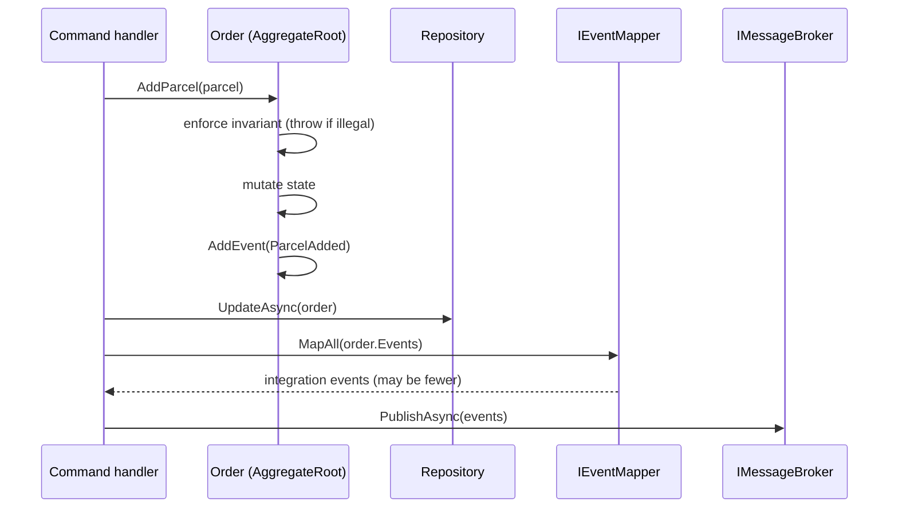

# Pattern: Aggregate-Buffered Domain Events

## Status

**Candidate.** No approval metadata, ADR, or documented human sign-off exists in the workspace, and
the CAKE catalog for tenant `Q5SCXYFS` holds no governing decision.

## Category

domain

## Problem

Two things need to happen when business state changes: the rule must be enforced in one place, and
everyone who cares must be told. Putting the notification inside the entity gives the domain model a
dependency on a broker. Putting the rule inside the handler scatters invariants across every call site
that can reach the aggregate. Neither is acceptable, and the naive compromise — the handler guessing
what changed and publishing accordingly — puts the domain's knowledge of its own transitions into the
caller.

## Context

Applies to services with an aggregate that has states and transitions worth protecting. Six Pacco
services keep an `AggregateRoot` base class with an internal event list; `orders-service` is the
clearest instance, with a five-state order lifecycle where every transition is guarded and every guard
records what happened.

## When to Use

- The entity has invariants — transitions that are legal from some states and not others.
- Other services need to know when those transitions happen.
- The entity should not know that a broker, or any transport, exists.
- The decision about *which* transitions are worth publishing externally belongs to someone other than
  the entity.

## When Not to Use

- The entity is a data holder with no rules. A buffered event list on a bag of properties is ceremony.
- Nothing outside the service reacts to changes. Publishing to nobody is cost without benefit.
- Every state change must be published exactly as it occurred, in order, as the system of record. That
  is event sourcing; this pattern buffers events but stores current state, and conflating the two
  produces a design that satisfies neither.
- The events would be recorded but never dispatched — see the anti-patterns.

## Architecture Summary

An abstract `AggregateRoot` holds a private list of domain events, exposes it read-only, and offers a
protected `AddEvent` and a public `ClearEvents`. Concrete aggregates enforce their invariants in
methods — throwing a domain exception when a transition is illegal — and call `AddEvent` after
mutating state.

The handler then does three things in a fixed order: mutate through the aggregate, persist, and hand
the buffered events to a mapper that converts internal domain events into external integration events.
Only the mapped events are published. The mapper is where the decision "is this worth telling anyone
about?" lives, keeping both the entity and the handler out of that judgement.

## Structure / Flow

The mapping step is a genuine narrowing. `OrderStateChanged` is one domain event that becomes one of
five different integration events depending on the resulting status, and any status the mapper does not
recognise produces nothing.

## Key Components

| Component | Responsibility |
|-----------|----------------|
| `Core/Entities/AggregateRoot.cs` | Private `List<IDomainEvent>`, read-only `Events`, `Id`, `Version`, `protected AddEvent`, `public ClearEvents` |
| `Core/Entities/AggregateId.cs` | A value object wrapping the identifier, so an aggregate id is not an interchangeable `Guid` |
| `Core/Entities/<Aggregate>.cs` | Private setters, guard clauses, `AddEvent` after each successful transition |
| `Core/Events/*.cs` | Internal domain events carrying the aggregate itself |
| `Core/Exceptions/*.cs` | Structured domain exceptions thrown by the guards |
| `Infrastructure/Services/EventMapper.cs` | Domain event → integration event, and the decision to publish nothing |
| `Application/Commands/Handlers/*.cs` | Mutate, persist, map, publish — in that order |

## Data / Event / API Contracts

- **Domain events are internal.** They carry the aggregate (`new OrderStateChanged(order)`,
  `new ParcelAdded(this, parcel)`) and never leave the process.
- **Integration events are the contract**, declared in Application, marked `[Contract]`, and shaped for
  consumers — identifiers and primitives, not entities
  ([[service-owned-topic-exchange-messaging]]).
- **The observed mapping** in `orders-service`:

  | Domain event | Condition | Integration event |
  |--------------|-----------|-------------------|
  | `OrderStateChanged` | status `New` | `OrderCreated` |
  | `OrderStateChanged` | status `Approved` | `OrderApproved` |
  | `OrderStateChanged` | status `Delivering` | `OrderDelivering` |
  | `OrderStateChanged` | status `Completed` | `OrderCompleted` |
  | `OrderStateChanged` | status `Canceled` | `OrderCanceled` |
  | `ParcelAdded` | — | `ParcelAddedToOrder` |
  | `ParcelDeleted` | — | `ParcelDeletedFromOrder` |

- **Guards are expressed as state comparisons**, and readable predicates are exposed for callers that
  need to ask before acting: `CanBeDeleted => Status == OrderStatus.New`,
  `CanAssignVehicle => Status == New || Status == Canceled`, `HasParcels`.
- **A failed guard throws a structured exception** carrying the aggregate id, the current status, and
  the attempted status — enough to build a machine-readable failure code without parsing a message
  ([[rejected-event-failure-contract]]).
- **Creation is a static factory**: `Order.Create(...)` constructs and records the initial event, so a
  constructed-but-unrecorded aggregate is not a state anyone can reach by accident.

## Naming Conventions

| Element | Convention | Example |
|---------|-----------|---------|
| Base class | `AggregateRoot`, in `Core/Entities/` | — |
| Identifier | `AggregateId` value object | `Order(AggregateId id, …)` |
| Domain event | Past tense, no suffix | `ParcelAdded`, `OrderStateChanged` |
| Integration event | Past tense, fully qualified for an outside reader | `ParcelAddedToOrder` |
| Guard predicate | `Can<Action>` / `Has<Thing>` | `CanAssignVehicle` |
| Transition method | Imperative | `Approve()`, `Cancel(reason)`, `SetDelivering()` |
| Factory | `static Create(...)` | `Order.Create(…)` |
| Domain exception | `Cannot<Action>Exception` / `<Thing>NotFoundException` | `CannotChangeOrderStateException` |

## Service / Boundary Guidance

- **The aggregate is the only place state changes.** Every mutation is a method with a guard; no
  property has a public setter.
- **The aggregate must not know about publishing.** It records; something else decides what leaves the
  service. That separation is what allows the mapper to publish fewer events than were recorded.
- **The handler owns the order of operations** — mutate, persist, then publish. Publishing before
  persisting would announce a change that might not survive.
- **Domain events stay in Core; integration events live in Application.** Two different audiences, two
  different lifetimes, two different rates of change.
- **The mapper is the boundary.** It is the right place to decide that an internal transition is nobody
  else's business, and the wrong place for business logic.

## Security / Compliance Considerations

- Integration events carry identifiers rather than entity graphs, so a published event does not leak
  the aggregate's full contents to every subscriber.
- **Free text set by a caller ends up in a published event.** `Cancel(reason)` accepts any string,
  stores it on the aggregate, and the cancellation flows outward. Nothing validates, bounds, or
  sanitises it — and the saga's compensation path supplies a hard-coded developer string
  ([[saga-process-manager]]).
- The aggregate performs no authorization; that check happens in the handler before the aggregate is
  touched ([[transport-agnostic-caller-context]]). The entity is therefore safe to call from anywhere,
  and unprotected if called from somewhere that skipped the check.
- Events published from a handler carry the caller's correlation context, including user identity, into
  the broker and the outbox ([[transactional-outbox-handler-decorator]]).

## Observability Considerations

- **Every meaningful state change is a published event**, so the platform's activity is externally
  visible without any additional instrumentation. That is the pattern's largest observability payoff.
- **What is recorded and not published is invisible.** The mapper's fall-through returns nothing for an
  unrecognised state, with no log line, so a new order status added to the enum but not to the mapper
  would silently stop being announced.
- The domain event list is not persisted. Once mapped and published, the record of what happened exists
  only as broker traffic — there is no local history of transitions.
- `AggregateRoot.Version` exists on every aggregate and is never read or incremented anywhere in the
  workspace.

## Failure Handling

- **Illegal transitions throw before any state changes.** Every guard is checked first, so a rejected
  operation leaves the aggregate untouched and records no event.
- **A domain exception becomes a `400` on the HTTP path and a rejected event on the message path**,
  through two mappers registered in Infrastructure. The entity does not know which.
- **`ClearEvents()` is never called.** Aggregates are reconstructed per request from the database, so
  the buffer starts empty each time and the leak this would otherwise cause does not occur — but
  anything that reused an aggregate instance across operations would republish its earlier events.
- **Persist-then-publish means a crash between the two loses the notification.** That is precisely what
  the outbox exists to prevent, and precisely what it currently does not guarantee, since transactions
  are disabled ([[transactional-outbox-handler-decorator]]).
- **`DeleteParcel` records a `ParcelDeleted` event but never removes the parcel from the aggregate's
  collection.** The event is published, subscribers act, the order is saved — and the parcel is still
  in it. This is a defect in the implementation, not in the pattern, and it is exactly the class of bug
  the pattern is supposed to prevent by keeping mutation and notification adjacent.
- **`SetVehicle` bypasses its own guard.** `CanAssignVehicle` is defined and exposed, and `SetVehicle`
  assigns unconditionally without consulting it — so the invariant is documented on the aggregate and
  enforced, if at all, by callers.

## Trade-offs

| Gain | Cost |
|------|------|
| Invariants live in one place and cannot be bypassed by a caller using the aggregate's API | They can be bypassed by an aggregate method that forgets to check its own guard, as one does |
| The domain model has no transport dependency | The events it records go nowhere until a handler remembers to map and publish them |
| The mapper decides what the outside world sees, independently of what the domain records | A domain event with no mapping disappears silently |
| Every transition produces an event, so the platform is observable by default | Only for transitions the mapper knows about |
| Structured exceptions carry enough data for machine-readable failure codes | Every aggregate needs an exception type per illegal transition |
| Guards are exposed as readable predicates callers can check first | Two sources of truth for the same rule — the predicate and the method — which can and do disagree |

## Variants

- **Buffer and publish after persistence** (this pattern) versus dispatching domain events in-process
  before persistence. The first is safer and slower to react.
- **Broad domain event narrowed by the mapper** — `OrderStateChanged` becoming one of five integration
  events — versus a distinct domain event per transition. The first keeps the aggregate simpler; the
  second removes the mapper's switch statement.
- **Buffered events with current-state storage** (here) versus event sourcing, where the events *are*
  the state. Superficially similar, fundamentally different: nothing in this workspace stores or
  replays a domain event.
- **Static factory for creation** versus recording the creation event in the constructor. The factory
  keeps rehydration from the database free of spurious events, which matters because the same
  constructor is used for both.

## Anti-patterns

- **Recording an event without making the change.** `DeleteParcel` announces a deletion that did not
  happen.
- **A guard predicate that its own mutator ignores.** `CanAssignVehicle` exists; `SetVehicle` does not
  consult it.
- **A silent fall-through in the mapper.** An unmapped state publishes nothing and logs nothing.
- **A `Version` property that nothing maintains.** It implies optimistic concurrency the service does
  not implement, which is worse than not having it — a reader assumes concurrent updates are handled.
- **Publishing before persisting.** Not done here, and the ordering should stay explicit in any reuse.
- **Treating the buffered event list as an audit trail.** It is discarded after publication.

## Evidence

- **ADR:** none — no ADR exists in any cloned repository or in the CAKE catalog for tenant
  `Q5SCXYFS`.
- **Repo:** `AggregateRoot` present in `hianshul100_Pacco.Services.Orders`, `.Parcels`, `.Customers`,
  `.Availability`, `.Vehicles`, `.Deliveries`. Absent from `.Identity`, `.Pricing`, `.Operations`,
  `.OrderMaker`.
- **Service:** six services with aggregates; `orders-service` has the richest lifecycle (five states).
- **File:**
  `hianshul100_Pacco.Services.Orders/src/Pacco.Services.Orders.Core/Entities/AggregateRoot.cs` —
  private event list, read-only `Events`, `Version`, `protected AddEvent`, `ClearEvents`;
  `.../Core/Entities/Order.cs` — guard predicates at :19-21, static factory at :52-58,
  `SetTotalPrice` guards at :62-70, **`SetVehicle` with no guard at :75-78**,
  `AddParcel` at :85-93, **`DeleteParcel` recording without removing at :95-104**,
  `Approve` at :106-116, `Cancel` at :118-128, `Complete` at :130-139, `SetDelivering` at :141-150;
  `.../Pacco.Services.Orders.Infrastructure/Services/EventMapper.cs` — the `OrderStateChanged` switch
  and the `ParcelAdded` / `ParcelDeleted` mappings;
  `.../Pacco.Services.Orders.Application/Commands/Handlers/AddParcelToOrderHandler.cs:45-48` — the
  mutate, persist, map, publish sequence;
  `.../Core/Exceptions/CannotChangeOrderStateException.cs` (structured exception data).
- **API/Event:** the integration events produced by this mapping are catalogued in
  [`../../baselines/api-inventory.md`](../../baselines/api-inventory.md) under the `orders` exchange.
- **Deployment/Config:** not applicable — this pattern is entirely internal to a service and has no
  configuration surface.
- **Notes:** `architecture-baseline.md` §3.1, §4.2, §5.1.

## Related ADRs

None. No ADR, decision record, or RFC exists in the workspace, and the CAKE graph for tenant
`Q5SCXYFS` returned zero nodes.

## Related Patterns

- [[inward-dependency-service-skeleton]] — the layout that keeps the aggregate transport-free.
- [[service-owned-topic-exchange-messaging]] — where the mapped events go.
- [[rejected-event-failure-contract]] — what a failed guard becomes on the message path.
- [[transactional-outbox-handler-decorator]] — what is meant to make persist-then-publish safe.
- [[database-per-service-with-document-mapping]] — how the aggregate is stored and rehydrated.
- [[dispatcher-bound-cqrs-endpoints]] — how a command reaches the handler that drives the aggregate.
- [[saga-process-manager]] — the process that reacts to these events across services.

## Recommendation

**Adopt.** Guards and event recording sitting side by side in the aggregate is the right structure: it
makes the invariant and the announcement one decision rather than two, and the mapper layer means the
domain can record freely while the service publishes deliberately. Two defects in the current
implementation must not be copied — `DeleteParcel` publishes a deletion it never performs, and
`SetVehicle` ignores the `CanAssignVehicle` predicate defined a few lines above it. Both are the exact
failure this pattern is meant to make hard, which is a useful reminder that the structure helps and
does not enforce. Also worth fixing: make the mapper's unmapped-state fall-through log rather than
return silently, and either implement optimistic concurrency using `Version` or remove it.

## Assumptions, Blockers & Open Questions

> [!IMPORTANT]
> This document contains unresolved items that require attention before or during implementation. Review and resolve before merging downstream artifacts. Each item below is tagged **[ACTION NOW]** (a human must decide or confirm it before this work can safely proceed) or **[handled later by <stage>]** (a named later stage owns and will prove it) — read the tags first to see what, if anything, is yours to act on.

### Assumptions

| # | Assumption | Rationale | Impact if Wrong | Validation Path |
|---|------------|-----------|-----------------|-----------------|
| A1 | Aggregates are always freshly loaded per operation, so the buffered event list starts empty and `ClearEvents()` never needing to be called is harmless | Every observed handler loads from the repository, acts, and discards. Nothing caches or reuses an aggregate instance | A reused instance would republish every event from its earlier operations, producing duplicate integration events with no obvious cause | Confirm no aggregate is held in a singleton or cached; add a test that a second operation on a reloaded aggregate publishes only its own events |
| A2 | Concurrent modification of the same aggregate is rare enough that the unused `Version` field has not caused a problem | No incident is recorded and nothing reads the field, which is consistent with low concurrency | Two concurrent updates would silently overwrite each other, since `UpdateAsync` replaces the whole document with no version check | Attempt two concurrent updates to one order and observe whether both are applied or one is lost |

### Blockers

| # | Blocker | Blocks | Owner | Resolution Path | Target Date |
|---|---------|--------|-------|-----------------|-------------|
| B1 | **[ACTION NOW]** `DeleteParcel` publishes a parcel-deleted event but never removes the parcel from the order. Subscribers act on the removal while the order still contains the parcel | Correct behaviour of parcel removal in `orders-service`; any reuse of this aggregate as an example of the pattern | Owner of `hianshul100_Pacco.Services.Orders` | Remove the parcel from the collection before recording the event, and add a test asserting the parcel is gone after the operation | TBD |

### Open Questions

| # | Question | Why It Matters | Proposed Answer (if any) | Decision Owner |
|---|----------|----------------|--------------------------|----------------|
| Q1 | **[ACTION NOW]** Should `SetVehicle` enforce `CanAssignVehicle`, or is the predicate meant purely for callers to check first? | The rule is written on the aggregate but not applied by the method that would break it, so a vehicle can be assigned to an order in any state | Enforce it in the method and throw on violation — a rule stated on the aggregate should be the aggregate's to keep | Owner of `hianshul100_Pacco.Services.Orders`, with the product owner for the Pacco platform |
| Q2 | **[ACTION NOW]** Should the event mapper log when it encounters a state it has no mapping for? | Adding a new order status without updating the mapper would silently stop announcing that transition, and nothing would indicate it | Yes — log at warning. Failing would be worse, since it would break the write for a publishing gap | Owner of `hianshul100_Pacco.Services.Orders` |
| Q3 | **[handled later by the design stage]** Should `Version` be used for optimistic concurrency, or removed? | It currently implies a concurrency control that does not exist, which is more misleading than having no field at all | Implement it — increment on change and check on update — or delete it. Leaving it inert is the one option that should be ruled out | Platform architect, with the owners of the six services with aggregates |
| Q4 | **[ACTION NOW]** Should the cancellation reason accepted by `Cancel` be validated or constrained? | It is caller-supplied free text that is stored on the aggregate, published in an integration event, and shown to the end user | Constrain it to a known set of codes plus optional detail, matching how failures are already coded elsewhere on the platform | Product owner for the Pacco platform, with the owner of `orders-service` |
