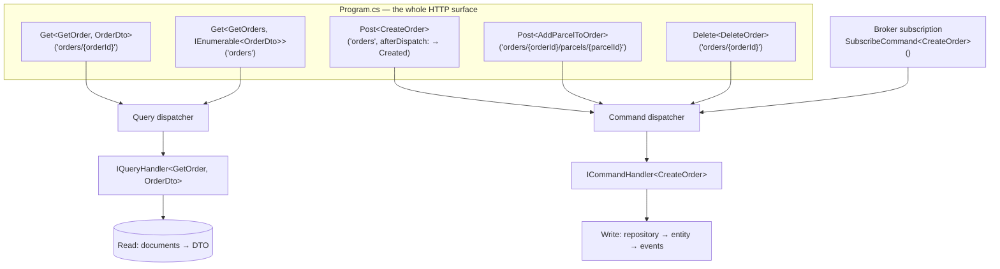

# Pattern: Dispatcher-Bound CQRS Endpoints

## Status

**Candidate.** No approval metadata, ADR, or documented human sign-off exists in the workspace, and
the CAKE catalog for tenant `Q5SCXYFS` holds no governing decision.

## Category

domain

## Problem

A controller is a place where responsibilities accumulate. It starts as a route and a call, then
acquires model binding tweaks, validation, an authorization attribute, a response shape, a try/catch,
and eventually a piece of business logic that was easier to put there than to route properly. Across a
dozen services, controllers drift into a dozen different conventions for the same four operations.

There is also a structural problem: the same command must be reachable from HTTP and from a message
broker. If the HTTP entry point is a controller method, the message path needs a second entry point,
and the two can diverge.

## Context

Applies to services that already express their work as commands and queries. Eight of Pacco's eleven
deployables bind HTTP routes directly to command and query types in `Program.cs`; the platform
contains **no controller classes at all**.

## When to Use

- Every operation is already a command or a query with a handler.
- The same operations must be reachable over HTTP and over a broker without duplicated entry points.
- The team wants the service's entire HTTP surface visible in one screen.
- Endpoints are thin by design — bind, dispatch, respond — with nothing to put in a controller.

## When Not to Use

- Endpoints need per-route behaviour that does not fit the binding model: content negotiation,
  streaming, file upload, complex response shaping.
- The API is the product and its shape must be designed independently of the internal command model.
  Binding routes to command types couples the two.
- The team relies on tooling built around controllers — action filters, model validation attributes,
  convention-based API versioning.
- The routing DSL's behaviour is not understood well enough to reason about status codes and binding.
  It is concise, and concise means implicit.

## Architecture Summary

The host file configures the container with one `AddInfrastructure()` call and the pipeline with one
`UseInfrastructure()` call, then declares the entire HTTP surface as a list of route-to-type bindings.
Each binding names an HTTP method, a route template, and a command or query type. The framework binds
the request into that type — route values, query string, and body — resolves the corresponding handler,
dispatches, and writes a conventional response.

Read and write are handled differently by construction. `Get<TQuery, TResult>` dispatches through a
query dispatcher and serialises the result. `Post<TCommand>` / `Put<TCommand>` / `Delete<TCommand>`
dispatch through a command dispatcher and return no body; a creating endpoint supplies an
`afterDispatch` callback to set the location of the new resource.

The same command types are also bound to broker subscriptions in the same host file, so one type has
one handler reachable by two transports.

## Structure / Flow

The important edge is the one from the broker into the same command dispatcher. HTTP and messaging are
two doors into one room.

## Key Components

| Component | Responsibility |
|-----------|----------------|
| `Program.cs` | Host configuration plus the complete route table; typically under 30 lines |
| `.UseDispatcherEndpoints(...)` | The routing DSL binding routes to command and query types |
| `Get<TQuery, TResult>` | Read path — dispatch, serialise, `404` when the result is null |
| `Post<TCommand>` / `Put<TCommand>` / `Delete<TCommand>` | Write path — dispatch, no response body |
| `afterDispatch` callback | The only place a write endpoint shapes its response |
| `.Get("", …)` | A root endpoint returning the application name, present in every service |
| `Application/Commands/*.cs`, `Application/Queries/*.cs` | The types routes bind to |
| `AddInMemoryQueryDispatcher()`, `AddCommandHandlers()` | Dispatch registration in the composition root |

## Data / Event / API Contracts

- **Route templates carry the identifiers**, and binding fills the matching properties on the type:
  `orders/{orderId}/parcels/{parcelId}` populates `OrderId` and `ParcelId`.
- **Commands are the request contract.** There is no separate request model; the command type *is* the
  API shape, which is also why it can be published onto a broker unchanged.
- **Queries return DTOs**, never entities — `Get<GetOrder, OrderDto>`.
- **Response conventions**, applied by the framework rather than by any code in the service:
  a query returning null yields `404`; a command yields `200` with no body unless `afterDispatch` says
  otherwise; a creating command yields `201` with a `Location` via
  `ctx.Response.Created($"orders/{cmd.OrderId}")`.
- **Errors** never reach the endpoint. `AddErrorHandler<ExceptionToResponseMapper>()` converts domain
  exceptions to `{code, reason}` with `400` ([[rejected-event-failure-contract]]).
- **The identifier is generated by the caller.** `CreateOrder` carries an `OrderId` the client
  supplies, which is what allows the `201` location to be built before the handler has run — and what
  makes the operation naturally idempotent at the identity level.

## Naming Conventions

| Element | Convention | Example |
|---------|-----------|---------|
| Route | Plural resource, lower case, no leading slash | `orders/{orderId}/parcels/{parcelId}` |
| Command | Imperative verb phrase | `AddParcelToOrder`, `AssignVehicleToOrder` |
| Query | `Get<Thing>` singular or plural | `GetOrder`, `GetOrders` |
| Route parameter | camelCase, matching the type's property | `{orderId}` → `OrderId` |
| Result type | `<Thing>Dto` | `OrderDto` |
| Root endpoint | `""` returning `AppOptions.Name` | — |

## Service / Boundary Guidance

- **Keep `Program.cs` as the only place routes are declared.** Its value is that the entire surface is
  readable at once; a second declaration site destroys that.
- **Endpoints must contain no logic.** The single `afterDispatch` callback per creating endpoint is the
  only code in the route table, and it does one thing.
- **One command type, one handler, two transports.** Do not write a separate HTTP-facing model that
  maps onto a command — that reintroduces the duplication this avoids.
- **The public path shape is decided at the gateway, not here.** Services expose `orders/...`; the
  gateway maps `/orders` onto it ([[declarative-configuration-driven-api-gateway]]), so the internal
  route table is free to be plain.
- Services that expose no HTTP surface should not adopt this. `operations-service` uses the plain
  endpoint builder for two endpoints and a hub; `ordermaker-service` exposes nothing but a root
  endpoint.

## Security / Compliance Considerations

- **The route table carries no authorization.** No binding declares a policy, a role, or a claim
  requirement. Every service registers `AddSecurity()` and JWT support, but the endpoint declarations
  themselves are unqualified.
- Enforcement therefore lives in two other places: the gateway, which declares `auth: true` and role
  claims per route ([[edge-enforced-authentication-with-identity-binding]]), and the handlers, which
  compare the caller to the resource owner ([[transport-agnostic-caller-context]]). Reading
  `Program.cs` alone gives no indication of which endpoints are protected.
- **Because service ports are published directly in the deployment files, the gateway is not the only
  way in.** Anything relying on the gateway for authorization is relying on a network boundary that
  the compose definitions do not establish.
- Binding the request body straight onto a command type means every public property of the command is
  settable by the caller. A property intended to be set internally — an identity, a status, a price —
  would be assignable from the request unless the handler overwrites it.
- The root endpoint returns the application name to unauthenticated callers on every service. Minor,
  and deliberate: it doubles as a liveness check ([[registry-mediated-discovery-and-routing]]).

## Observability Considerations

- Logging and tracing wrap the dispatchers, not the endpoints — `AddHandlersLogging()` and the Jaeger
  integration produce a span per handler ([[correlation-and-span-propagation]]). Endpoints add nothing
  and need to add nothing.
- Because the route table is data, the service's HTTP surface can be read from one file without running
  anything — genuinely useful for review and for keeping the gateway configuration honest.
- Swagger documents are generated (`AddWebApiSwaggerDocs()`) from the bound types, so the published
  API description follows the command and query definitions automatically.
- The root and `/ping` paths are excluded from logging and tracing in every service's configuration, so
  health traffic does not drown the signal.

## Failure Handling

- **Binding failures are the framework's.** What happens when a route value cannot be parsed into a
  property is not visible in service code and is not configured anywhere in these repositories.
- **A null query result becomes `404`** by convention; the handler simply returns null.
- **Domain exceptions become `400` with a code and reason** through the registered error handler. No
  endpoint has a try/catch.
- **`202 Accepted` is not produced here.** Asynchronous acceptance happens at the gateway, which
  publishes to the broker without touching the service ([[dual-mode-edge-write]]) — so a service's own
  route table describes only its synchronous surface, and a command's *most common* entry point may not
  appear in it at all.
- There is no per-endpoint timeout, rate limit, or request size limit in any service.

## Trade-offs

| Gain | Cost |
|------|------|
| The entire HTTP surface of a service is one readable list | The list says nothing about authorization, and there is nowhere in it to say anything |
| No controller means no place for logic to accumulate | Also no place for legitimate per-endpoint behaviour, so anything unusual has to leave the DSL |
| One command type serves HTTP and messaging | The API shape and the internal command model are the same thing and cannot evolve separately |
| Response conventions are uniform across every service for free | Those conventions are implicit; a reader must know the DSL to know what a route returns |
| Endpoints are trivially consistent across eight services | The platform is tied to one framework's routing DSL in the most visible file of every service |
| Swagger follows the bound types automatically | Documenting anything the types do not express requires leaving the pattern |

## Variants

- **`UseDispatcherEndpoints`** — the full DSL, used by eight services.
- **`UseEndpoints` with inline handlers** — `operations-service`, which needs a custom lookup and a
  `404`, plus a hub and a gRPC service mapped alongside.
- **Root endpoint only** — `ordermaker-service`, which is message-driven and exposes nothing else.
- **No service host at all** — `api-gateway`, whose entire surface is a YAML file.

## Anti-patterns

- **Authorization that is invisible at the route.** Nothing in the route table indicates whether an
  endpoint is protected; the answer is in two other repositories' worth of configuration and handler
  code.
- **Binding the request body directly onto a type that also carries internal fields.** Every public
  setter is caller-controlled.
- **Relying on a gateway for protection while publishing service ports directly.** The two decisions
  contradict each other, and only one of them is written down.
- **Logic in `afterDispatch`.** The callback exists to shape a response; anything else in it is a
  controller growing back.
- **Duplicating an endpoint's command as a separate request model.** It defeats the single-entry-point
  property that makes this pattern worth having.

## Evidence

- **ADR:** none — no ADR exists in any cloned repository or in the CAKE catalog for tenant
  `Q5SCXYFS`.
- **Repo:** `UseDispatcherEndpoints` in `hianshul100_Pacco.Services.Availability`, `.Customers`,
  `.Deliveries`, `.OrderMaker`, `.Orders`, `.Parcels`, `.Pricing`, `.Vehicles`;
  `UseEndpoints` in `.Operations`; no equivalent in `.Identity`'s pattern of use or in the gateway.
- **Service:** a repository-wide search for `*Controller.cs` across all fourteen cloned repositories
  returns **no files**.
- **File:**
  `hianshul100_Pacco.Services.Orders/src/Pacco.Services.Orders.Api/Program.cs` — the complete route
  table: root endpoint, `Get<GetOrder, OrderDto>("orders/{orderId}")`,
  `Get<GetOrders, IEnumerable<OrderDto>>("orders")`, `Delete<DeleteOrder>("orders/{orderId}")`,
  `Post<CreateOrder>("orders", afterDispatch: (cmd, ctx) => ctx.Response.Created($"orders/{cmd.OrderId}"))`,
  `Post<AddParcelToOrder>("orders/{orderId}/parcels/{parcelId}")`,
  `Delete<DeleteParcelFromOrder>("orders/{orderId}/parcels/{parcelId}")`,
  `Post<AssignVehicleToOrder>("orders/{orderId}/vehicles/{vehicleId}")`;
  `.../Pacco.Services.Orders.Infrastructure/Extensions.cs` — `AddErrorHandler<ExceptionToResponseMapper>()`,
  `AddQueryHandlers()`, `AddInMemoryQueryDispatcher()`, `AddWebApiSwaggerDocs()`, `AddSecurity()`;
  `hianshul100_Pacco.Services.Operations/src/Pacco.Services.Operations.Api/Program.cs:30-48`
  (the inline-handler variant with an explicit `404`).
- **API/Event:** the full per-service route inventory is in
  [`../../baselines/api-inventory.md`](../../baselines/api-inventory.md); the public path shapes are in
  `hianshul100_Pacco.APIGateway/src/Pacco.APIGateway/ntrada.yml`.
- **Deployment/Config:** `hianshul100_Pacco/compose/services.yml` publishes each service's port
  directly (`5001`–`5009`, `5015`), so service routes are reachable without passing through the
  gateway.
- **Notes:** `architecture-baseline.md` §3.3, §4.1, §4.3.

## Related ADRs

None. No ADR, decision record, or RFC exists in the workspace, and the CAKE graph for tenant
`Q5SCXYFS` returned zero nodes.

## Related Patterns

- [[inward-dependency-service-skeleton]] — the layout that keeps handlers thin enough for this to work.
- [[dual-mode-edge-write]] — why many commands never arrive over these routes at all.
- [[declarative-configuration-driven-api-gateway]] — where the public path shape and the auth rules
  live.
- [[rejected-event-failure-contract]] — the other transport the same command types serve.
- [[transport-agnostic-caller-context]] — how a handler learns who is calling, whichever door was used.
- [[database-per-service-with-document-mapping]] — why the query path returns DTOs and not entities.

## Recommendation

**Adopt.** Binding routes directly to command and query types removes a whole class of drift: there is
no controller for logic to collect in, the entire HTTP surface of a service is one readable list, and a
command has exactly one handler whether it arrives over HTTP or over the broker. The main thing to
address is that the route table is silent about authorization — today the answer lives partly in the
gateway configuration and partly in handler code, and the two can disagree without anyone noticing.
Either declare the requirement at the route, or make it structurally impossible to reach a service
except through the gateway. Publishing every service port directly while relying on the gateway for
authorization is the combination to avoid.

## Assumptions, Blockers & Open Questions

> [!IMPORTANT]
> This document contains unresolved items that require attention before or during implementation. Review and resolve before merging downstream artifacts. Each item below is tagged **[ACTION NOW]** (a human must decide or confirm it before this work can safely proceed) or **[handled later by <stage>]** (a named later stage owns and will prove it) — read the tags first to see what, if anything, is yours to act on.

### Assumptions

| # | Assumption | Rationale | Impact if Wrong | Validation Path |
|---|------------|-----------|-----------------|-----------------|
| A1 | The response conventions described here — `404` on a null query result, `200` with no body for a command, `201` via `afterDispatch` — are what the routing DSL actually does | This is the behaviour the code is written to expect, and the `Created` callback only makes sense under it. The DSL's implementation is in the framework, not in this workspace | The documented API behaviour would be wrong, and clients written against it would mishandle responses | Call each endpoint shape once against a running service and record the actual status codes |
| A2 | Binding populates command properties from route values, query string, and body together | It is the only way the observed routes could work — `orders/{orderId}/parcels/{parcelId}` has no body and `POST orders` has no route values | Some endpoints would silently receive commands with default values in fields they depend on | Send a request to a route-parameter-only endpoint and a body-only endpoint and confirm both bind fully |

### Open Questions

| # | Question | Why It Matters | Proposed Answer (if any) | Decision Owner |
|---|----------|----------------|--------------------------|----------------|
| Q1 | **[ACTION NOW]** Are service ports meant to be reachable without going through the gateway? | The gateway is where authorization rules are declared, and every service port is published directly in the deployment files. If both are true, the rules are optional in practice | Almost certainly a local-development convenience. It needs to be settled explicitly, because the entire authorization story depends on the answer | Platform owner / operator for the Pacco runtime, with the platform security owner |
| Q2 | **[ACTION NOW]** Should authorization requirements be visible at the route declaration? | Today an endpoint's protection cannot be determined from the service's own code, which makes review unreliable and drift between gateway and service invisible | Declare the requirement at the route even if the gateway also enforces it — defence in depth, and the route table becomes truthful | Platform architect, with the owners of the eight services |
| Q3 | **[handled later by the design stage]** Should the API shape be allowed to diverge from the internal command model? | Right now they are the same type, which is the source of most of the pattern's value and all of its rigidity. A public API that must stay stable across internal refactoring cannot share a type with the command | Keep them unified while the API is internal; introduce a separate request model only where an external contract genuinely needs to be pinned | Platform architect, with the product owner for the Pacco platform |
