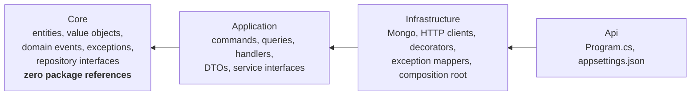

# Pattern: Inward-Dependency Service Skeleton

## Status

**Candidate.** No approval metadata, ADR, or documented human sign-off exists in the workspace, and
the CAKE catalog for tenant `Q5SCXYFS` holds no governing decision.

## Category

domain

## Problem

Business rules written next to the code that talks to a database, a broker, and an HTTP client tend to
absorb all three. A rule ends up depending on a driver type; a driver upgrade becomes a business
change; testing a rule means starting infrastructure. Nothing stops this drift except a boundary that
the compiler enforces, because a boundary maintained by discipline alone erodes on the first deadline.

## Context

Applies to services with enough behaviour to be worth protecting. In Pacco, seven services use a
four-project layout with references pointing strictly inward; three use a single project. Both shapes
are deliberate and the choice tracks how much domain logic the service actually has.

## When to Use

- The service owns business rules with invariants worth enforcing in one place.
- The domain model will outlive the current database, broker, or framework choice.
- Rules should be testable without any infrastructure running.
- More than one person will work in the codebase, so the boundary needs to be checked by something
  other than review.

## When Not to Use

- The service is a thin translator with no rules of its own — a coordinator, an observer, a
  calculator. Four projects for one class is ceremony, and three Pacco services correctly skip it.
- The team is small enough and the service short-lived enough that folders would do. The split has a
  real navigation cost.
- The layers would end up as a pass-through: an application type that only forwards to an
  infrastructure type, which only forwards to a driver. That is a sign the service has no domain.

## Architecture Summary

Four projects in one repository, with project references forming a straight line inward:

```
Api → Infrastructure → Application → Core
```

**Core** holds entities, value objects, domain events, domain exceptions, and repository interfaces.
Its project file declares nothing but a target framework — no package references at all. That is what
makes the boundary real: the domain model cannot reference a driver because the project has no
drivers available.

**Application** holds commands, queries, their handlers, DTOs, service interfaces, and the declarations
of external events the service consumes. It references Core and the framework's abstraction packages.

**Infrastructure** holds every implementation — MongoDB repositories and documents, HTTP clients,
message broker adapters, decorators, exception mappers, and the composition root that registers them
all.

**Api** is the host: a `Program.cs`, configuration files, and nothing else.

## Structure / Flow



Interfaces are declared where they are *used* and implemented where the dependency lives:
`IOrderRepository` in Core, `OrderMongoRepository` in Infrastructure; `IParcelsServiceClient` in
Application, `ParcelsServiceClient` in Infrastructure. Dependencies point inward; control flows
outward at runtime through the container.

## Key Components

| Project | Contains | References |
|---------|----------|-----------|
| `<Service>.Core` | `Entities/`, `ValueObjects/`, `Events/`, `Exceptions/`, `Repositories/` | Nothing |
| `<Service>.Application` | `Commands/`, `Queries/`, `DTO/`, `Events/External/`, `Services/`, `Exceptions/` | Core |
| `<Service>.Infrastructure` | `Mongo/`, `Services/Clients/`, `Decorators/`, `Exceptions/`, `Contexts/`, `Extensions.cs` | Application |
| `<Service>.Api` | `Program.cs`, `appsettings*.json` | Infrastructure |

The composition root is a single `Extensions.cs` in Infrastructure exposing `AddInfrastructure()` and
`UseInfrastructure()` — the only two methods `Program.cs` needs to know.

## Data / Event / API Contracts

- **Core exposes no serializable contract.** Entities are not the wire shape; DTOs in Application are.
- **Application declares consumed external events** in `Events/External/`, one class per event, owned
  by this service rather than shared ([[event-carried-reference-replica]]).
- **Repository interfaces are domain-shaped**, named for business questions, and live in Core —
  `GetContainingParcelAsync(Guid parcelId)`, not `FindByFilter`.
- **Infrastructure never appears in a signature** visible from Application or Core.
- The framework's CQRS abstractions (`ICommandHandler<>`, `IQueryHandler<,>`) are referenced from
  Application, so the *shape* of a handler is framework-dependent even though the rules are not.

## Naming Conventions

| Element | Convention | Example |
|---------|-----------|---------|
| Project | `Pacco.Services.<Service>.<Layer>` | `Pacco.Services.Orders.Core` |
| Namespace | Mirrors the project name and folder | `Pacco.Services.Orders.Core.Entities` |
| Repository interface | `I<Entity>Repository` in Core | `IOrderRepository` |
| Repository implementation | `<Entity><Technology>Repository` in Infrastructure | `OrderMongoRepository` |
| Service client interface | `I<Service>ServiceClient` in Application | `IParcelsServiceClient` |
| Composition root | `Infrastructure/Extensions.cs`, `AddInfrastructure()` / `UseInfrastructure()` | — |
| Single-project variant | `Pacco.Services.<Service>` with the same folder names inside | `Pacco.Services.OrderMaker` |

## Service / Boundary Guidance

- **Keep Core's project file empty.** The moment a package reference appears there, the boundary is
  advisory. Every one of the seven Core projects in this workspace declares only a target framework.
- **Choose the layout by how much domain the service has**, not by consistency. Seven services have
  rules and use four projects; `pricing-service` computes discounts, `operations-service` observes,
  and `ordermaker-service` sequences — all three use one project, and all three are right to.
- **One composition root per service.** All registration lives in `Infrastructure/Extensions.cs`; the
  host file stays declarative.
- **Interfaces belong to the consumer.** Declaring `IParcelsServiceClient` in Application, not
  Infrastructure, is what lets the caller define the shape it needs.
- **The layout is per repository, not shared.** No project is referenced across service repositories,
  and no shared internal library exists ([[framework-supplied-platform-conventions]]).

## Security / Compliance Considerations

- **Authorization checks live in Application handlers, not in Core.** Each handler that touches
  customer-owned data calls a private `ValidateAccessOrFail`, comparing the caller's identity to the
  aggregate's owner ([[transport-agnostic-caller-context]]). The domain entity itself has no notion of
  who is acting.
- That placement is defensible — identity is an application concern, not a business invariant — but it
  means **the boundary does not protect authorization**. Anything that reaches the repository without
  going through a handler bypasses every check. The repository is public, and nothing prevents a future
  handler from being written without the call.
- The same guard is copy-pasted per handler rather than applied uniformly, so a missing one is a silent
  gap. `CreateOrderHandler` has no such check at all — a difference that is invisible unless the files
  are compared.
- Configuration, including anything sensitive, lives only in the Api project; no secret material
  appears in Core, Application, or Infrastructure source.

## Observability Considerations

- **Core is silent by construction.** With no package references it cannot log, which is correct: the
  domain reports through exceptions and events, and something outward decides what to record.
- Logging and tracing are applied in Infrastructure through the framework — `AddHandlersLogging()`,
  Jaeger decorators — so handlers do not contain logging calls
  ([[correlation-and-span-propagation]]).
- The cost is that a domain rule firing is not directly observable. A `CannotChangeOrderStateException`
  is visible where it is mapped, not where it is thrown, so understanding *why* requires reading the
  entity.

## Failure Handling

- **Domain exceptions are declared in Core** and carry structured data rather than message strings —
  `CannotChangeOrderStateException(Id, Status, OrderStatus.Approved)`.
- **They are translated at the edges of Infrastructure**, in two mappers: one to an HTTP response, one
  to a rejected event ([[rejected-event-failure-contract]]). The domain never knows which transport it
  is failing into, which is the main payoff of the layering.
- A missing aggregate surfaces as `null` from the repository and becomes an Application exception at
  the handler.
- **Nothing enforces the direction of dependencies except the project references themselves.** There is
  no architecture test in any repository asserting that Core stays clean, so the guarantee holds only
  as long as nobody adds a package reference.

## Trade-offs

| Gain | Cost |
|------|------|
| The domain model cannot depend on infrastructure — the compiler prevents it | Four projects, four namespaces, and more navigation for every change |
| Rules are testable with no database, broker, or host | Only one of the seven layered services actually has unit tests |
| Storage, transport, and framework can change without touching Core | Application still depends on the framework's handler interfaces, so the isolation is partial |
| Consumers define the interfaces they need | Interface and implementation sit in different projects, which is an extra hop when reading |
| The layout is identical across seven services, so any of them is navigable on sight | Seven copies of the same skeleton with no shared base means seven places to change a convention |
| Small services can opt out cleanly | Two layouts in one platform means "where does this go?" has two answers |

## Variants

- **Four-project layered** — `orders`, `parcels`, `customers`, `availability`, `vehicles`,
  `deliveries`, `identity`.
- **Single project with the same internal folders** — `pricing`, `operations`, `ordermaker`. The
  folder names are preserved (`Core/`, `Services/`, `Commands/`), so the mental model transfers even
  though the compiler is no longer enforcing it.
- **Api as a pure host** versus an Api project containing endpoint definitions. Pacco keeps `Program.cs`
  declarative and the endpoint list in it, with no controllers anywhere
  ([[dispatcher-bound-cqrs-endpoints]]).

## Anti-patterns

- **A package reference in Core.** It converts an enforced boundary into a convention, silently.
- **No architecture test.** The direction of dependencies is load-bearing and nothing asserts it; a
  single added reference would go unnoticed in review.
- **Authorization by copy-paste.** The same private guard method appears in handler after handler; one
  handler omits it, and nothing signals the difference.
- **Layering a service with no domain.** Applied to `pricing-service` or `operations-service`, the
  four-project split would be four projects of plumbing.
- **A shared "common" project across services.** Deliberately absent here, and worth keeping absent —
  it would recreate the coupling the repository split removes.

## Evidence

- **ADR:** none — no ADR exists in any cloned repository or in the CAKE catalog for tenant
  `Q5SCXYFS`.
- **Repo:** four-project layout in `hianshul100_Pacco.Services.Orders`, `.Parcels`, `.Customers`,
  `.Availability`, `.Vehicles`, `.Deliveries`, `.Identity`; single-project layout in `.Pricing`
  (`src/Pacco.Services.Pricing.Api`), `.Operations` (`src/Pacco.Services.Operations.Api` plus a sample
  gRPC client), `.OrderMaker` (`src/Pacco.Services.OrderMaker`).
- **Service:** seven layered, three single-project, plus `api-gateway` which is a host for a
  configuration file and has no domain at all.
- **File:**
  `hianshul100_Pacco.Services.Orders/src/Pacco.Services.Orders.Core/Pacco.Services.Orders.Core.csproj`
  — the whole file is a `TargetFramework` and nothing else;
  `.../Pacco.Services.Orders.Application/Pacco.Services.Orders.Application.csproj:17` (references Core);
  `.../Pacco.Services.Orders.Infrastructure/Pacco.Services.Orders.Infrastructure.csproj:32`
  (references Application);
  `.../Pacco.Services.Orders.Api/Pacco.Services.Orders.Api.csproj:17` (references Infrastructure);
  `.../Pacco.Services.Orders.Infrastructure/Extensions.cs` (the single composition root);
  `.../Pacco.Services.Orders.Core/Entities/Order.cs` (rules with no infrastructure reference);
  `.../Pacco.Services.Orders.Application/Commands/Handlers/AddParcelToOrderHandler.cs:51-58`
  (the per-handler authorization guard), and `Commands/Handlers/CreateOrderHandler.cs` (no such guard);
  `.../Pacco.Services.Orders.Core/Repositories/IOrderRepository.cs` versus
  `.../Pacco.Services.Orders.Infrastructure/Mongo/Repositories/OrderMongoRepository.cs`.
- **API/Event:** not applicable — this pattern shapes internal structure and exposes no contract.
- **Deployment/Config:** every service builds to a single container regardless of project count; see
  each repository's `Dockerfile` and `.travis.yml`, and
  `hianshul100_Pacco/compose/services.yml`.
- **Notes:** `architecture-baseline.md` §3.1, §3.2, §3.4.

## Related ADRs

None. No ADR, decision record, or RFC exists in the workspace, and the CAKE graph for tenant
`Q5SCXYFS` returned zero nodes.

## Related Patterns

- [[dispatcher-bound-cqrs-endpoints]] — what the Api project contains instead of controllers.
- [[aggregate-buffered-domain-events]] — the Core-level pattern this layout protects.
- [[database-per-service-with-document-mapping]] — why documents live in Infrastructure and entities in
  Core.
- [[rejected-event-failure-contract]] — where Core's exceptions are translated.
- [[transport-agnostic-caller-context]] — how identity reaches an Application handler.
- [[framework-supplied-platform-conventions]] — what fills the space a shared library would occupy.
- [[layered-service-test-suite]] — the testing shape this layout is meant to enable.

## Recommendation

**Adopt for services with real domain rules; skip it for services without.** A Core project whose
project file contains nothing but a target framework is the cheapest architectural guarantee available
— the domain model cannot acquire an infrastructure dependency, because there is nothing to acquire.
The discipline of choosing the layout by domain weight is also right, and the three single-project
services are evidence the team applied it rather than following a template. Two additions would make
it hold: an architecture test asserting Core's project references stay empty and the dependency
direction stays inward, and a uniform way to apply the ownership check that is currently copy-pasted
per handler and missing from at least one.

## Assumptions, Blockers & Open Questions

> [!IMPORTANT]
> This document contains unresolved items that require attention before or during implementation. Review and resolve before merging downstream artifacts. Each item below is tagged **[ACTION NOW]** (a human must decide or confirm it before this work can safely proceed) or **[handled later by <stage>]** (a named later stage owns and will prove it) — read the tags first to see what, if anything, is yours to act on.

### Assumptions

| # | Assumption | Rationale | Impact if Wrong | Validation Path |
|---|------------|-----------|-----------------|-----------------|
| A1 | The single-project layout in three services is a deliberate choice matched to how little domain logic they have, not an unfinished migration | All three genuinely have little domain — one calculates, one observes, one sequences — and all three keep the same internal folder names, which suggests the model was applied consciously | If they were meant to be layered, three services are inconsistent with the platform standard rather than a documented exception, and the guidance here would point people the wrong way | Ask the platform architect, or read the commit history of the three repositories for an abandoned split |
| A2 | Nothing outside a command or query handler reaches a repository directly | Every observed call path goes through a handler, and handlers are the only registered consumers of the repository interfaces | The per-handler authorization guards would be bypassable, since the repository applies no filtering of its own | Search each service for repository usage outside `Commands/Handlers` and `Queries/Handlers`, and keep that as an architecture test |

### Open Questions

| # | Question | Why It Matters | Proposed Answer (if any) | Decision Owner |
|---|----------|----------------|--------------------------|----------------|
| Q1 | **[ACTION NOW]** Is the missing ownership check in `CreateOrderHandler` intentional, or an omission? | Every other handler that touches an order compares the caller to the order's customer; this one does not. Either it is safe because creation has no existing owner to check against, or it is a gap | Probably safe by nature — there is no prior owner at creation time — but the customer id on the command is taken from the request and never compared to the authenticated caller, which is worth confirming | Owner of `hianshul100_Pacco.Services.Orders`, with the platform security owner |
| Q2 | **[handled later by the design stage]** Should the dependency direction be enforced by an automated test rather than by project references alone? | The guarantee is currently one careless package reference away from disappearing, with nothing to catch it | Yes — a small architecture test per service asserting Core has no package references and that references point inward | Platform architect |
| Q3 | **[ACTION NOW]** Should the copy-pasted ownership guard become a shared mechanism — a decorator or a policy — rather than a private method per handler? | Repetition is how one handler ends up without it, and that is exactly what appears to have happened | A handler decorator applied uniformly, in the same way the outbox behaviour is applied, would make omission impossible rather than merely unlikely | Platform architect, with the owners of the seven layered services |
