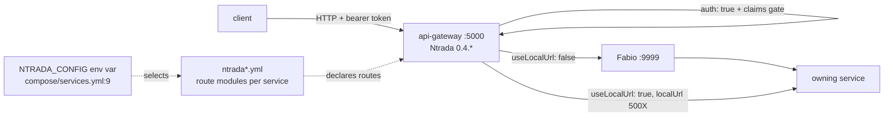

# Pattern: Declarative Configuration-Driven API Gateway

## Status

**Candidate.** No approval metadata, ADR, or documented human sign-off exists in any of the fourteen
cloned repositories, and the CAKE catalog for tenant `Q5SCXYFS` holds no governing decision.

## Category

integration

## Problem

A platform of ten independently deployed services needs one external front door that terminates
authentication, applies route-level authorization, and forwards to the owning service. Writing that
front door as code makes every new route a code change, a build, a test cycle, and a release of a
component that sits on the critical path of every request.

## Context

Applies where the edge's job is routing, authentication, and simple request rewriting — not business
logic, not aggregation, not response transformation. In Pacco the gateway is `api-gateway`, running
**Ntrada** 0.4.\*, published on host port `5000`, fronting nine routed services. Its source tree is
`Program.cs`, a `.csproj`, four `ntrada*.yml` files, four `appsettings*.json`, `certs/`, and four
`Infrastructure/*.cs` correlation and tracing hooks. There is no routing code at all.

## When to Use

- The edge's responsibilities are routing, auth enforcement, and claim checks.
- Route changes should be a configuration review, not a code review of a shared component.
- Downstream services already expose the exact resource shape the client needs.
- One team can own the routing configuration as an artifact in its own right.

## When Not to Use

- The edge must aggregate several downstream calls into one response, or transform payload shapes —
  neither is expressible here.
- Per-client or per-tenant response shaping is needed; a backend-for-frontend written as code fits
  better.
- Strong build-time typing of the edge's request and response contracts is required. This pattern
  gives none: `api-gateway` compiles no message or DTO types whatsoever.

## Architecture Summary

The gateway process is a thin host over a routing engine. All behaviour — which upstream path maps to
which downstream service, which HTTP method, whether a bearer token is required, which claims are
required, and how caller identity is bound into the request — is declared in YAML. Which YAML file is
loaded is selected at runtime by the `NTRADA_CONFIG` environment variable, so the same image behaves
differently per environment without a rebuild.

## Structure / Flow

## Key Components

| Component | Responsibility |
|-----------|----------------|
| `Program.cs` | Starts Ntrada. Contains no routing logic |
| `ntrada.yml`, `ntrada.docker.yml`, `ntrada-async.yml`, `ntrada-async.docker.yml` | The four routing configurations. See [[dual-mode-edge-write]] for the behavioural split between the plain and `-async` families |
| `auth:` block | Maps the logical `role` claim to the full Microsoft claim URI `http://schemas.microsoft.com/ws/2008/06/identity/claims/role` (`ntrada.yml:4-5`) |
| Per-service `modules:` block | Groups routes by owning service; carries the downstream `url` and, in non-`.docker` variants, a `localUrl` |
| `Infrastructure/*.cs` | Four hooks only: correlation-context and tracing wiring |

## Data / Event / API Contracts

- A route declares `upstream`, `method`, `downstream`, and optionally `auth`, `claims`, `bind`, and
  (in async mode) `use`, `exchange`, `payload`, `schema`.
- **Payload contracts at the edge are effectively undeclared.** Exactly one route in
  `ntrada-async.yml` (lines 204–205) names `payload: complete_customer_registration` and
  `schema: complete_customer_registration.schema`, and **neither referenced file is present in the
  repository**. The other nineteen `use: rabbitmq` routes declare no payload and no schema.
- Response bodies are whatever the downstream service returns; the gateway does not reshape them.
- The full edge route inventory is in
  [`../../baselines/api-inventory.md`](../../baselines/api-inventory.md) §2 (sync) and §3 (async).

## Naming Conventions

| Element | Convention | Example |
|---------|-----------|---------|
| Config file | `ntrada[-async][.docker].yml` | `ntrada-async.docker.yml` |
| Module | Plural resource name matching the owning service | `orders`, `parcels`, `availability` |
| Downstream target | `<service>-service/<path>` | `customers-service/customers/@user_id` |
| Local target | `localhost:500X` matching the service's Compose host port | `localhost:5006` for `orders-service` |
| Identity token | `@user_id` | `bind: - customerId:@user_id` |

## Service / Boundary Guidance

- The gateway is the **conventional** front door, not an enforced one. In the Compose topology all
  ten services are also published on host ports `5001`–`5009` and `5015`, so nothing at the network
  layer prevents a client from bypassing it.
- `ordermaker-service` has **no route in any of the four configurations** and is reachable only by
  publishing onto the `ordermaker` exchange.
- Route ownership follows service ownership: a module belongs to the team that owns the service it
  targets, even though all four files live in the gateway repository.
- Keep business rules out of the configuration. Pacco does — the only request-level logic is claim
  checks and `@user_id` binding.

## Security / Compliance Considerations

- Authentication is enforced here and, for any path that does not traverse the gateway, nowhere else
  — the in-service guards fail open. See [[edge-enforced-authentication-with-identity-binding]].
- The gateway validates tokens with a **symmetric** `issuerSigningKey`, while the domain services
  validate with a **certificate** (`jwt.certificate.location: "certs/localhost.cer"`). A token
  accepted by one is not automatically accepted by the other.
- The `issuerSigningKey` is **committed in plaintext** at `ntrada.yml:44`. Anyone holding it can mint
  a token the gateway accepts, including one carrying `role: admin`. Recorded by path only; the value
  is not reproduced here.
- No TLS termination is configured anywhere in the workspace; the gateway serves plain HTTP on `5000`
  and reaches Fabio over HTTP.

## Observability Considerations

- The gateway's `Infrastructure/*.cs` hooks establish the correlation context that then travels with
  every downstream call and every published message — this is the origin point for
  [[correlation-and-span-propagation]].
- The sample Prometheus scrape configuration in `hianshul100_Pacco/docker-images.txt` targets
  `metrics_path: '/metrics-text'` on port `5000` — the gateway only. Whether the Compose-stack
  Prometheus (`compose/prometheus/`) scrapes all eleven deployables was not established.
- Because routing is configuration, a route that is missing produces a 404 with no code path to trace;
  diagnosing it means diffing the loaded YAML, which requires knowing which file `NTRADA_CONFIG`
  selected.

## Failure Handling

- Downstream failures surface as the downstream status code in proxy mode. In command-publication
  mode the caller gets `202 Accepted` regardless — see [[dual-mode-edge-write]] and
  [[acknowledge-then-notify-completion]].
- No circuit breaker, bulkhead, timeout policy, or rate limit is configured at the edge.
- A route pointing at a service that is not registered in Consul fails at the Fabio hop; the gateway
  has no fallback or retry declaration.

## Trade-offs

| Gain | Cost |
|------|------|
| A new route is a YAML change, reviewable by itself | The routing surface has no tests and no compiler; a typo in a downstream name is a runtime 404 |
| One image serves every environment; behaviour is selected by `NTRADA_CONFIG` | The image alone does not tell you how it will behave. Four configurations exist and nothing records which is authoritative |
| No edge code to own, patch, or release | Anything the engine cannot express (aggregation, response transformation) cannot be done at the edge at all |
| Auth and claim gates are visible in one file per environment | Those gates are the platform's only real enforcement point, and they live in an unversioned-contract artifact |

## Variants

- **Proxy vs command publication** — the plain and `-async` configuration families, covered in
  [[dual-mode-edge-write]].
- **Direct vs load-balanced downstream** — `ntrada.yml` sets `useLocalUrl: true` with a
  `localUrl: localhost:500X` per service group (availability `5001` … vehicles `5009`), bypassing
  Fabio; the `.docker.yml` variants set `useLocalUrl: false` and route through
  [[registry-mediated-discovery-and-routing]].
- **Path rewriting as an authorization control** — `downstream: customers-service/customers/@user_id`
  makes it impossible to request another caller's record.

## Anti-patterns

- **Maintaining four configuration files with no record of which one runs where.** This is the single
  largest open architectural question in Pacco: the two families are behaviourally different systems,
  not environment variants.
- **Committing the signing key into the routing configuration.** Present at `ntrada.yml:44`.
- **Publishing every service on a host port while calling the gateway the front door.** Ten
  directly reachable ports make the edge advisory.
- **Declaring a `payload`/`schema` pair whose files are not in the repository.** One route does this;
  the declared contract cannot be read at all.

## Evidence

- **ADR:** none — no ADR exists in any cloned repository or in the CAKE catalog for tenant
  `Q5SCXYFS`.
- **Repo:** `hianshul100_Pacco.APIGateway`; `hianshul100_Pacco` (Compose stacks).
- **Service:** `api-gateway`, fronting `availability-service`, `customers-service`,
  `deliveries-service`, `identity-service`, `operations-service`, `orders-service`,
  `parcels-service`, `pricing-service`, `vehicles-service`.
- **File:** `src/Pacco.APIGateway/Program.cs`; `src/Pacco.APIGateway/ntrada.yml` (auth block lines
  4–5; `useLocalUrl` line 18; load-balancer block lines 19–21; `issuerSigningKey` line 44; admin claim
  gates at lines 137–138, 151–152, 159–160, 180–181; `@user_id` bindings at lines 103, 143, 167);
  `ntrada.docker.yml`, `ntrada-async.yml`, `ntrada-async.docker.yml`;
  `src/Pacco.APIGateway/Pacco.APIGateway.csproj:18` (`Ntrada.Extensions.RabbitMq` 0.4.\*).
- **API/Event:** twenty read routes and twenty write routes in `ntrada-async.yml`; full inventory in
  [`../../baselines/api-inventory.md`](../../baselines/api-inventory.md) §2–§3.
- **Deployment/Config:** `hianshul100_Pacco/compose/services.yml:9`
  (`NTRADA_CONFIG=ntrada-async.docker.yml`), `:11` (`5000:80`).
- **Notes:** `architecture-baseline.md` §3.3 and §4.3.

## Related ADRs

None. No ADR, decision record, or RFC exists in the workspace, and the CAKE graph for tenant
`Q5SCXYFS` returned zero nodes. Supported by code and configuration evidence only.

## Related Patterns

- [[dual-mode-edge-write]] — the behavioural split between the two configuration families.
- [[edge-enforced-authentication-with-identity-binding]] — the auth and `@user_id` mechanics.
- [[registry-mediated-discovery-and-routing]] — what `useLocalUrl: false` routes through.
- [[service-owned-topic-exchange-messaging]] — where async-mode writes land.
- [[dispatcher-bound-cqrs-endpoints]] — the downstream HTTP surface this gateway targets.

## Recommendation

**Adopt for edge routing in this platform**, and treat the routing configuration as a first-class
reviewed artifact rather than an ops file. Two conditions should be attached before any new work
depends on it: record which `ntrada*.yml` each environment loads (this is unresolved and blocks any
write-path impact analysis), and rotate the committed `issuerSigningKey` out of `ntrada.yml`. If a
future feature needs response aggregation or per-client shaping, do **not** stretch this pattern —
introduce a separate backend-for-frontend service and record the decision.

## Assumptions, Blockers & Open Questions

> [!IMPORTANT]
> This document contains unresolved items that require attention before or during implementation. Review and resolve before merging downstream artifacts. Each item below is tagged **[ACTION NOW]** (a human must decide or confirm it before this work can safely proceed) or **[handled later by <stage>]** (a named later stage owns and will prove it) — read the tags first to see what, if anything, is yours to act on.

### Assumptions

| # | Assumption | Rationale | Impact if Wrong | Validation Path |
|---|------------|-----------|-----------------|-----------------|
| A1 | The `role` claim `identity-service` issues is the same claim the gateway checks in its `claims: { role: admin }` gates | Needed to describe the admin gates as effective controls; the mapping at `ntrada.yml:4-5` and the issuer configuration were read separately and never compared against a real token | Admin-only routes either reject every caller or admit every caller, and the platform's only working authorization gate is not working | Decode a token minted by `identity-service` for an admin user and compare the claim name and value against `auth.claims.role` at `ntrada.yml:4-5` |
| A2 | Ntrada converts a request body into a published message using a default rule when no `payload`/`schema` is declared | Nineteen of the twenty `use: rabbitmq` routes declare neither, yet the platform is described as working; the `Ntrada.Extensions.RabbitMq` package source is not in this workspace | The nineteen undeclared routes may publish a different shape than downstream handlers expect, and edge-side writes would fail silently | Read the `Ntrada.Extensions.RabbitMq` 0.4.\* source, or capture a message published by one of those routes off the target exchange |

### Blockers

| # | Blocker | Blocks | Owner | Resolution Path | Target Date |
|---|---------|--------|-------|-----------------|-------------|
| B1 | **[ACTION NOW]** Nobody can say which of the four routing configurations a real environment actually loads. The plain and `-async` families make twenty business writes synchronous or fire-and-forget respectively — they are different systems, not settings | Every impact assessment on a write path; whether `operations-service` is on the critical path; any new edge route | Platform owner / operator for the Pacco runtime (no named individual is recorded in the workspace) | Read the effective `NTRADA_CONFIG` value in each running environment and record, per environment, which `ntrada*.yml` is authoritative | TBD |
| B2 | **[ACTION NOW]** The gateway's JWT signing key is committed in plaintext at `ntrada.yml:44`. Anyone with repository read access can mint a token the gateway accepts, including an admin one | Any security review of the edge; any claim that edge authentication is a real control | Security owner for the Pacco platform (no named individual is recorded) | Confirm whether the committed value is a throwaway development key; if it is not, rotate it, move it to Vault KV, and purge it from git history | TBD |

### Open Questions

| # | Question | Why It Matters | Proposed Answer (if any) | Decision Owner |
|---|----------|----------------|--------------------------|----------------|
| Q1 | **[ACTION NOW]** Should every service keep a publicly published host port when the gateway is meant to be the front door? Ten ports are exposed in the Compose stacks, and nothing in the workspace describes a firewall or ingress in front of them | If the ports are reachable in a real environment, every edge auth gate and `@user_id` binding can be walked around by calling the service directly | Publish only the gateway; keep service ports on the internal network. Cannot confirm the current exposure without the real environment definition | Platform owner / operator for the Pacco runtime |
| Q2 | **[ACTION NOW]** The route at `ntrada-async.yml:204-205` names a `payload` and a `schema` file, and neither file is in the repository. Was the contract lost, or was it never written? | It is the only declared edge payload contract in the platform. If it was lost, the same may have happened elsewhere; if it was never written, the declaration is misleading | No confident reading. The two possibilities are indistinguishable from the repository contents | Owner of `hianshul100_Pacco.APIGateway` (no named individual is recorded) |
