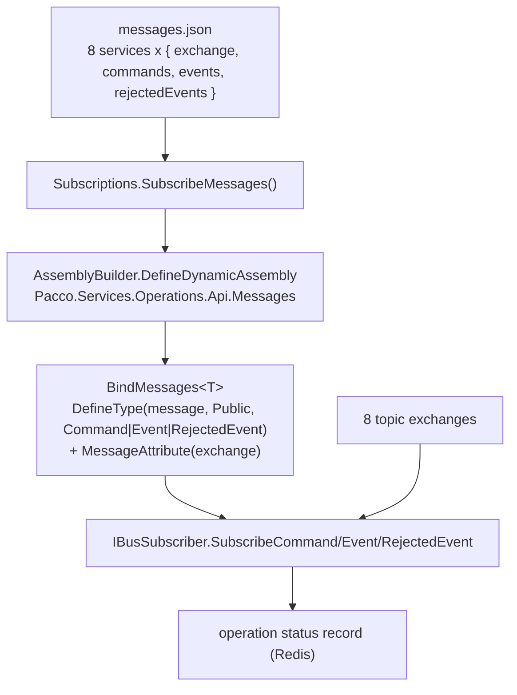

# Pattern: Declarative Message Manifest with Runtime Type Emission

## Status

**Candidate.** No approval metadata, ADR, or documented human sign-off exists in the workspace; the
CAKE catalog for tenant `Q5SCXYFS` holds no governing decision. This is a distinctive, high-leverage
mechanism with exactly one implementation site, which is why the evidence is strong but the
generality is not established.

## Category

integration

## Problem

A component whose job is to observe the *whole* message topology cannot realistically compile a
handler class for every message on the platform. In Pacco that would be roughly 80 types, each of
which would have to be copied from the publishing service and kept in step with it — for a component
that never reads a single field of any of them.

## Context

Applies to cross-cutting observers — status projections, audit trails, message-flow dashboards —
that need to know *that* a message occurred on a given exchange but not what it contains. Pacco's
`operations-service` is the only such component: it subscribes to all eight traffic-carrying
exchanges and projects each observed message into an operation status record keyed by correlation id.

## When to Use

- The observer needs message occurrence and routing metadata, not payload content.
- The set of messages changes as services evolve, and recompiling the observer for each change is not
  acceptable.
- The observable surface should be reviewable as a single list rather than inferred from scattered
  handler classes.

## When Not to Use

- The observer needs any field from the payload. Emitted types are **field-less**; there is nothing
  to deserialise into.
- Message occurrence must be guaranteed rather than best-effort — a message missing from the manifest
  is silently not subscribed at all.
- The platform has a schema registry or a shared contract package, in which case generating real
  typed handlers from it is strictly better.

## Architecture Summary

A JSON manifest declares, per publishing service, the owning `exchange` and three arrays of message
names: `commands`, `events`, `rejectedEvents`. At startup the observer reads the manifest, builds a
dynamic assembly with `System.Reflection.Emit`, and for each declared message name defines a public
type with that name deriving from one of three marker base types (`Command`, `Event`,
`RejectedEvent`). Each emitted type is stamped with a `MessageAttribute` carrying the owning exchange,
then instantiated and handed to the broker's subscription API. The observer's subscription surface is
therefore exactly the manifest's contents.

## Structure / Flow



## Key Components

| Component | Responsibility |
|-----------|----------------|
| `messages.json` | The manifest. Eight top-level keys — `availability-service`, `customers-service`, `deliveries-service`, `identity-service`, `ordermaker-service`, `orders-service`, `parcels-service`, `vehicles-service` — each with `exchange`, `commands`, `events`, `rejectedEvents` |
| `Subscriptions.SubscribeMessages()` | Reads the file, builds the dynamic assembly, iterates the manifest, subscribes |
| `BindMessages<T>()` | Emits one type per message name, applies `MessageAttribute(exchange, null, null, true)`, returns an instance |
| `Types/Command`, `Types/Event`, `Types/RejectedEvent` | The three marker base types the emitted types derive from |
| `Types/ServiceMessages` | The deserialisation target for one manifest entry |

## Data / Event / API Contracts

Manifest shape, verbatim from the first entry:

```json
{
  "availability-service": {
    "exchange": "availability",
    "commands": ["add_resource", "delete_resource", "release_resource", "reserve_resource"],
    "events": ["resource_added", "resource_deleted", "resource_reservation_released",
               "resource_reservation_canceled", "resource_reserved"],
    "rejectedEvents": ["add_resource_rejected", "delete_resource_rejected",
                       "release_resource_rejected", "reserve_resource_rejected"]
  }
}
```

- The manifest declares **names only**. It carries no field definitions, no types, and no version.
- The emitted types have **no members** — `DefineType` adds none and nothing populates them. The
  observer sees that a message arrived on an exchange and nothing more.
- Absence of the file, or an empty file, causes `SubscribeMessages` to return the subscriber
  untouched — the service starts successfully with **zero** subscriptions.

## Naming Conventions

| Element | Convention | Example |
|---------|-----------|---------|
| Manifest file | `messages.json`, at the service's content root | — |
| Manifest key | Deployable service name | `availability-service` |
| `exchange` value | Service short name, matching that service's own `rabbitMq.exchange.name` | `availability` |
| Message name | `snake_case`, matching Convey's routing-key derivation | `resource_reserved` |
| Dynamic assembly | `<ServiceNamespace>.Messages` | `Pacco.Services.Operations.Api.Messages` |

## Service / Boundary Guidance

- The manifest is a **second copy** of the platform's message topology, maintained by the observer
  rather than by the publishers. It can drift from the publishers, and nothing detects drift.
- The observer's observable surface is bounded exactly by this file. A message a service publishes but
  the manifest omits is invisible to the observer and therefore to every async caller relying on it.
- Publishing services do not know the observer exists — the pattern preserves the
  [[service-owned-topic-exchange-messaging]] boundary rather than breaking it.
- Only one component should hold a whole-topology manifest. Two would guarantee divergence.

## Security / Compliance Considerations

- Contract-blindness is, in this narrow case, a privacy property: the observer never deserialises a
  payload, so no personal data from any message enters its process memory or its projection.
- What it does hold is correlation metadata and message names, stored in Redis under the
  `operations:` prefix — see [[prefix-partitioned-shared-cache]].
- `System.Reflection.Emit` requires a runtime that permits dynamic code generation. Environments that
  disable it (ahead-of-time compilation, trimmed deployments, certain hardened hosts) break this
  mechanism at startup rather than at build time.
- Because the file is read from the working directory at startup, an attacker able to write to the
  container filesystem can silently reduce the observer's subscriptions to nothing.

## Observability Considerations

- The manifest doubles as the platform's most readable single-file inventory of message names per
  exchange — it is the closest artifact Pacco has to a message catalogue.
- The observer is the only component that sees the whole topology, which makes it the natural place
  for message-flow metrics; none are currently exported.
- **This component cannot serve as a contract oracle.** It knows names, not shapes. A reader looking
  for payload definitions will not find them here.
- A message silently missing from the manifest produces no error, no log line, and no metric — only a
  gap in the projection.

## Failure Handling

- Missing or empty manifest → zero subscriptions, service starts normally. This is a silent
  degradation, not a startup failure.
- A message name in the manifest that no service publishes → an idle queue; harmless but misleading.
- A message published but absent from the manifest → invisible to the observer and to callers
  depending on it, with no signal anywhere.
- An emitted type whose name collides with another in the same dynamic module would fail at startup;
  the manifest's flat per-service arrays make collisions across services possible in principle,
  because `DefineType` is called with the bare message name and not an exchange-qualified one.

## Trade-offs

| Gain | Cost |
|------|------|
| One component observes ~80 messages with no compiled message classes | The observer cannot read any field of any message, ever |
| The observable surface is one reviewable file | That file is a hand-maintained duplicate of the real topology, with no drift detection |
| Adding a message to the observer is a config change, not a code change | Forgetting to add it is silent, and the consequence lands on async callers, not on the observer |
| No build-time dependency on any publishing service | No build-time signal when a publisher renames a message either |
| Startup cost is a handful of milliseconds of type emission | Requires a runtime that allows dynamic code generation |

## Variants

- **Generated rather than hand-written manifest.** Producing `messages.json` from the publishing
  services' `[Contract]`-marked classes at build time would remove the drift risk while keeping the
  runtime mechanism unchanged. Not implemented in Pacco.
- **Typed observation.** Emitting types *with* fields from a schema source would let the observer
  read payloads; this requires a schema the platform does not have.
- **Startup validation.** Failing to start when the manifest is absent, rather than subscribing to
  nothing, converts the silent degradation into a loud one.

## Anti-patterns

- **Treating the manifest as the platform's contract inventory.** It declares names, not payloads;
  `architecture-views.md` GAP-15 records the same point.
- **Letting the manifest drift.** It is maintained in a different repository from every service that
  publishes the messages it lists.
- **Starting successfully with no subscriptions.** For a component on the async completion path, zero
  subscriptions is an outage that looks like a healthy process.
- **Copying this pattern into a component that needs payload content.** It cannot be extended to do
  that without a schema source.

## Evidence

- **ADR:** none — no ADR exists in any cloned repository or in the CAKE catalog for tenant
  `Q5SCXYFS`.
- **Repo:** `hianshul100_Pacco.Services.Operations`.
- **Service:** `operations-service` (the only implementation site).
- **File:**
  `src/Pacco.Services.Operations.Api/Infrastructure/Subscriptions.cs` — `const string path =
  "messages.json"` and the early return when absent (lines 20–36); `AssemblyBuilder.DefineDynamicAssembly`
  with `AssemblyName("Pacco.Services.Operations.Api.Messages")` (lines 41–43); the per-service loop
  calling `BindMessages<Command>` / `<Event>` / `<Types.RejectedEvent>` (lines 44–51);
  `moduleBuilder.DefineType(message, TypeAttributes.Public, type)` and the
  `CustomAttributeBuilder` applying `MessageAttribute(exchange, null, null, true)` (lines 70–78).
  `src/Pacco.Services.Operations.Api/messages.json` — eight service entries.
- **API/Event:** the eight declared exchanges and their `commands`/`events`/`rejectedEvents` arrays;
  cross-referenced in [`../../baselines/api-inventory.md`](../../baselines/api-inventory.md) §9.5.
- **Deployment/Config:** the manifest ships inside the `devmentors/pacco.services.operations` image;
  no Compose or environment variable overrides its path.
- **Notes:** `architecture-baseline.md` §3.3 (including the verification that
  `find . -name messages.json` returns exactly one path and
  `grep -rln "Reflection.Emit" --include=*.cs` returns exactly one file, both under
  `Pacco.Services.Operations.Api`).

## Related ADRs

None. No ADR, decision record, or RFC exists in the workspace, and the CAKE graph for tenant
`Q5SCXYFS` returned zero nodes.

## Related Patterns

- [[service-owned-topic-exchange-messaging]] — the topology this manifest mirrors.
- [[acknowledge-then-notify-completion]] — what the observer's projection is used for.
- [[rejected-event-failure-contract]] — the third message class the manifest declares.
- [[prefix-partitioned-shared-cache]] — where the projection is stored.
- [[framework-supplied-platform-conventions]] — the absence of a shared contract package that makes
  this mechanism attractive in the first place.

## Recommendation

**Adopt only for genuinely contract-blind observers, and only with the manifest generated rather than
hand-maintained.** The runtime mechanism is sound and cheap; the risk is entirely in the manifest
being a hand-written second copy of the topology in a different repository, with silent failure on
both drift and absence. Two changes would make it safe to build on: generate `messages.json` from the
publishing services' `[Contract]` classes as a build step, and fail startup when the manifest is
missing or empty instead of subscribing to nothing. Do not extend this pattern to any component that
needs payload content — that requires a message schema the platform does not have.

## Assumptions, Blockers & Open Questions

> [!IMPORTANT]
> This document contains unresolved items that require attention before or during implementation. Review and resolve before merging downstream artifacts. Each item below is tagged **[ACTION NOW]** (a human must decide or confirm it before this work can safely proceed) or **[handled later by <stage>]** (a named later stage owns and will prove it) — read the tags first to see what, if anything, is yours to act on.

### Assumptions

| # | Assumption | Rationale | Impact if Wrong | Validation Path |
|---|------------|-----------|-----------------|-----------------|
| A1 | `messages.json` currently lists every message the eight publishing services actually emit | The file is the observer's entire subscription surface, and the platform is described as working; the manifest was not diffed message-by-message against all eight services' event and command classes | Messages missing from the manifest are invisible to the observer, so callers on the asynchronous path would never learn the outcome of those operations | Diff the manifest's arrays against each publishing service's `[Contract]`-marked command, event, and rejected-event classes; automate the diff as a build check |
| A2 | The .NET runtime in every environment permits `System.Reflection.Emit` | The service is deployed as a normal .NET Core 3.1 container image with no trimming or ahead-of-time compilation configured in any Dockerfile | The observer would fail at startup in a hardened or trimmed runtime — a failure mode with no build-time warning | Run the published image in each target environment and confirm the subscriptions are established |

### Open Questions

| # | Question | Why It Matters | Proposed Answer (if any) | Decision Owner |
|---|----------|----------------|--------------------------|----------------|
| Q1 | **[ACTION NOW]** Should the observer start successfully when `messages.json` is missing or empty? Today it does, with zero subscriptions | On the asynchronous write path this component is the caller's only channel for learning an outcome. A healthy-looking process that subscribes to nothing is an outage nobody sees | Fail startup instead. A component whose entire job is subscription should not run with no subscriptions | Owner of `hianshul100_Pacco.Services.Operations` (no named individual is recorded in the workspace) |
| Q2 | **[ACTION NOW]** Who owns keeping the manifest in step with the eight publishing services? It lives in a different repository from every service whose messages it lists | Drift is silent in both directions, and the consequence lands on asynchronous callers rather than on the observer | Generate the manifest from the publishing services at build time so no one has to own it manually | Platform owner for Pacco, with the eight publishing service owners |
