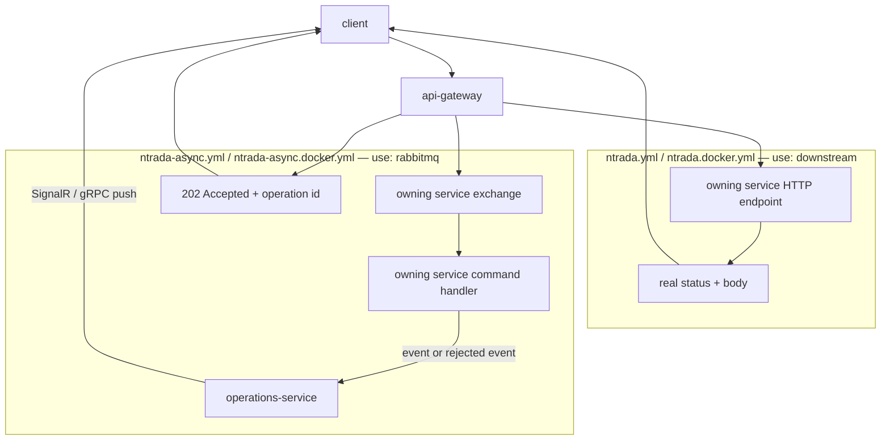

# Pattern: Dual-Mode Edge Write — Proxy or Command Publication

## Status

**Candidate.** No approval metadata, ADR, or documented human sign-off exists in the workspace, and
the CAKE catalog for tenant `Q5SCXYFS` holds no governing decision. This pattern is additionally
carried with a live blocker: nothing records which mode a real environment runs.

## Category

integration

## Problem

A write arriving at the edge can either be proxied to the owning service and answered with that
service's real result, or converted into a message and acknowledged immediately. The first gives the
caller a definite answer and couples availability; the second decouples availability and leaves the
caller without an outcome. Committing the platform to one of these at build time forces the choice
before the operating characteristics of each write are known.

## Context

Applies at a configuration-driven edge ([[declarative-configuration-driven-api-gateway]]) fronting
services that expose both an HTTP command surface and a message-consuming command surface — which
Pacco's services do, because Convey dispatches the same `ICommandHandler<T>` from either transport.
`api-gateway` ships four `ntrada*.yml` files split into two families that differ precisely in this
choice.

## When to Use

- The same command can genuinely be handled either way, because the handler is transport-agnostic.
- The platform needs to move a write from synchronous to asynchronous (or back) without changing any
  service code.
- An out-of-band completion channel exists for the asynchronous case — otherwise the caller is left
  with nothing.

## When Not to Use

- The caller must have the result to continue. Pacco applies this correctly: `identity` is **not**
  among the exchanges the async configuration publishes to, so sign-up and sign-in stay synchronous
  proxies in both families.
- No completion channel exists, or it is not durable. In Pacco the channel is `operations-service`,
  whose state lives only in Redis with a 300-second expiry.
- The two modes would be run simultaneously in the same environment. They are alternatives, not a
  per-route mix within one deployment; mixing them per route is possible but doubles the surface a
  client must understand.

## Architecture Summary

One gateway image, one set of route definitions per family, and a runtime environment variable
choosing between them. In **proxy mode** a write route carries `use: downstream`: the gateway
forwards the request over HTTP to the owning service and returns that service's status and body. In
**command-publication mode** the same route carries `use: rabbitmq` and an `exchange`: the gateway
converts the body into a message, publishes it to the owning service's exchange, and returns
`202 Accepted` with an operation id. Read routes are `use: downstream` in both families.

## Structure / Flow

## Key Components

| Component | Responsibility |
|-----------|----------------|
| `NTRADA_CONFIG` environment variable | Selects the configuration file at process start. `compose/services.yml:9` sets `ntrada-async.docker.yml` |
| `use: downstream` route entry | Proxy mode. Twenty such entries exist in `ntrada-async.yml`, all reads |
| `use: rabbitmq` route entry + `exchange:` | Command-publication mode. Exactly twenty entries in `ntrada-async.yml` |
| `Ntrada.Extensions.RabbitMq` 0.4.\* (`Pacco.APIGateway.csproj:18`) | Performs the body-to-message conversion. Its rule is not observable from this workspace |
| `operations-service` | The completion channel in async mode; see [[acknowledge-then-notify-completion]] |
| Service `ICommandHandler<T>` | Unchanged between modes — the same handler serves both transports |

## Data / Event / API Contracts

- Proxy mode: the contract is the owning service's HTTP endpoint contract, unchanged.
- Command-publication mode: the contract is a message on the owning service's exchange, named by
  Convey's `snakeCase` convention.
- The twenty `use: rabbitmq` routes in `ntrada-async.yml` target six exchanges and are **not evenly
  distributed** — this matters for any per-service impact assessment of a mode switch:

  | Target exchange | `use: rabbitmq` routes | Line of first route |
  |-----------------|------------------------|---------------------|
  | `orders` | 5 | 359 |
  | `availability` | 4 | 120 |
  | `deliveries` | 4 | 243 |
  | `vehicles` | 3 | 508 |
  | `customers` | 2 | 200 |
  | `parcels` | 2 | 446 |
  | **Total** | **20** | — |

- `identity` is deliberately absent from that list.
- Success shape differs by mode: proxy returns the service's own status code; publication returns
  `202 Accepted` plus an operation id.

## Naming Conventions

| Element | Convention |
|---------|-----------|
| Configuration family | plain = proxy, `-async` suffix = command publication |
| Environment suffix | `.docker` = route via Fabio (`useLocalUrl: false`); no suffix = direct `localUrl` |
| Route key | `use: downstream` or `use: rabbitmq` |
| Async target | `exchange: <owning-service-short-name>` |

## Service / Boundary Guidance

- The mode is a **platform-wide** property of the loaded configuration, not a per-service one. A
  service cannot opt out of async mode; it can only be excluded by having no `use: rabbitmq` route,
  which is how `identity-service` stays synchronous.
- Downstream services must be written so the same command handler is correct under both transports.
  Pacco achieves this because Convey dispatches `ICommandHandler<T>` identically from HTTP and from
  the broker — see [[dispatcher-bound-cqrs-endpoints]].
- Whoever owns a write route owns the decision about which mode it is safe in, and must be able to
  point at the completion channel for the async case.

## Security / Compliance Considerations

- The `auth: true` and `claims:` gates apply in both modes — authentication is not weakened by the
  switch.
- The `@user_id` binding is what keeps the async path safe: because the caller's id is substituted
  into the body at the edge, the published command carries the right customer id even though the
  in-service ownership guard will not fire on a message with an empty user context.
- In async mode the message that reaches the handler carries the correlation context but the
  in-service guards `if (identity.IsAuthenticated && …)` may not fire, so **the edge is the only
  authorization gate on twenty business writes**. See
  [[edge-enforced-authentication-with-identity-binding]].

## Observability Considerations

- The mode determines what "the request failed" even means. In proxy mode a failure is an HTTP status
  on the original request and appears in the gateway's own trace. In publication mode the original
  request always succeeds with `202`, and the failure appears later as a rejected event consumed by
  `operations-service`.
- Alerting built for one mode does not carry over to the other: an edge 5xx rate is meaningful in
  proxy mode and near-zero-by-construction in publication mode.
- The `span_context` header keeps a single Jaeger trace continuous across the publication hop, which
  is the only way to connect the `202` to the eventual handler execution.

## Failure Handling

- **Proxy mode:** downstream error → the service's `ExceptionToResponseMapper` produces
  `{ code, reason }` with HTTP 400, returned to the caller directly.
- **Publication mode:** downstream error → the service's `ExceptionToMessageMapper` produces a
  rejected event ([[rejected-event-failure-contract]]), which reaches the caller only if it is
  listening on the completion channel.
- A publish that succeeds but whose handler never runs (service down, queue not drained) is
  indistinguishable at the edge from one that succeeded.
- No retry, circuit breaker, or timeout policy is configured at the edge in either mode.

## Trade-offs

| Gain | Cost |
|------|------|
| Write availability decouples from service availability in publication mode | The caller no longer gets an outcome; a whole completion channel must exist and be reliable |
| The mode can be changed per environment with no code change | The image does not tell you how it behaves; four files exist and none is marked authoritative |
| Load spikes are absorbed by the broker rather than by the service's HTTP thread pool | Backpressure becomes invisible at the edge — the queue grows and the caller sees nothing |
| The same service code serves both transports | Every write handler must be correct without a caller identity, because the message path may not carry one |

## Variants

- **Per-route mode.** `ntrada-async.yml` already mixes both `use:` values in one file (20 reads
  proxied, 20 writes published), so mode is expressible per route, not only per file.
- **Excluded routes.** Keeping a route synchronous in the async family, as `identity` is, is the
  supported way to opt a critical write out.
- **Direct vs load-balanced downstream**, orthogonal to the mode: the `.docker` suffix selects
  whether proxying goes through [[registry-mediated-discovery-and-routing]].

## Anti-patterns

- **Shipping both families with no record of which one runs.** This is Pacco's largest open
  architectural question and it makes every write-path impact analysis conditional.
- **Switching to publication mode without a durable completion channel.** In Pacco the channel's
  state is a Redis cache with a 300-second expiry and no durable store, so a caller who waits longer
  than five minutes never learns the outcome.
- **Assuming `202 Accepted` means "accepted by the service".** It means "published to an exchange".
  Whether any handler ran is unknown at that moment.
- **Reading the platform-wide count of twenty write routes as a per-service figure.** The
  distribution table above is the correct granularity; `architecture-views.md` §2.2 attaches the
  total of 20 to the `availability` edge alone, which declares 4.

## Evidence

- **ADR:** none — no ADR exists in any cloned repository or in the CAKE catalog for tenant
  `Q5SCXYFS`.
- **Repo:** `hianshul100_Pacco.APIGateway`; `hianshul100_Pacco` (Compose stacks).
- **Service:** `api-gateway`; write targets `availability-service`, `customers-service`,
  `deliveries-service`, `orders-service`, `parcels-service`, `vehicles-service`; completion channel
  `operations-service`; deliberately excluded `identity-service`.
- **File:** `src/Pacco.APIGateway/ntrada-async.yml` (exchange targets at lines 120, 200, 243, 359,
  446, 508; the single declared payload/schema pair at 204–205); `ntrada.yml` (`useLocalUrl: true` at
  18, load-balancer block 19–21, per-service `localUrl` at 125, 185, 233, 273, 288, 352, 396, 411,
  455); `src/Pacco.APIGateway/Pacco.APIGateway.csproj:18`.
- **API/Event:** twenty `use: rabbitmq` and twenty `use: downstream` entries in `ntrada-async.yml`;
  full route lists in [`../../baselines/api-inventory.md`](../../baselines/api-inventory.md) §2–§3.
- **Deployment/Config:** `hianshul100_Pacco/compose/services.yml:9`
  (`NTRADA_CONFIG=ntrada-async.docker.yml`) — the only place any environment states its choice.
- **Notes:** `architecture-baseline.md` §4.3, §5.4, §12.3.

## Related ADRs

None. No ADR, decision record, or RFC exists in the workspace, and the CAKE graph for tenant
`Q5SCXYFS` returned zero nodes.

## Related Patterns

- [[declarative-configuration-driven-api-gateway]] — the edge this pattern configures.
- [[acknowledge-then-notify-completion]] — the completion channel publication mode depends on.
- [[rejected-event-failure-contract]] — how a failure reaches the caller in publication mode.
- [[service-owned-topic-exchange-messaging]] — where published commands land.
- [[edge-enforced-authentication-with-identity-binding]] — why the edge gate is load-bearing here.
- [[dispatcher-bound-cqrs-endpoints]] — the transport-agnostic handler that makes both modes possible.

## Recommendation

**Adopt deliberately, per route, and record the choice** — not as a platform-wide toggle between two
undocumented files. Concretely: pick one configuration family as authoritative per environment and
delete or clearly mark the others; for each write, state which mode it runs in and why; and do not
move a write to publication mode until the completion channel is durable enough for that write's
business timeout. Until the authoritative configuration is recorded (B1), treat every statement about
Pacco's write behaviour as conditional on the answer.

## Assumptions, Blockers & Open Questions

> [!IMPORTANT]
> This document contains unresolved items that require attention before or during implementation. Review and resolve before merging downstream artifacts. Each item below is tagged **[ACTION NOW]** (a human must decide or confirm it before this work can safely proceed) or **[handled later by <stage>]** (a named later stage owns and will prove it) — read the tags first to see what, if anything, is yours to act on.

### Assumptions

| # | Assumption | Rationale | Impact if Wrong | Validation Path |
|---|------------|-----------|-----------------|-----------------|
| A1 | A command published by the gateway arrives at the owning service in a shape its `ICommandHandler<T>` can bind | Nineteen of twenty `use: rabbitmq` routes declare no `payload` or `schema`, and the conversion is done by a package whose source is not in this workspace | Twenty business writes would fail silently at the handler, with the caller having already received `202 Accepted` | Publish through one async route in a running environment and observe whether the target service's handler executes and produces the expected event |
| A2 | The two configuration families are alternatives, one per environment, rather than a deliberate mix deployed simultaneously | Both `.docker` and non-`.docker` variants exist for each family, which reads as environment variants of two choices; nothing states otherwise | The platform would have callers seeing different write semantics for the same route depending on which gateway instance answered | Read `NTRADA_CONFIG` on every running gateway instance in every environment |

### Blockers

| # | Blocker | Blocks | Owner | Resolution Path | Target Date |
|---|---------|--------|-------|-----------------|-------------|
| B1 | **[ACTION NOW]** Nobody records which of the four `ntrada*.yml` files a real environment loads. Twenty business writes are either synchronous with a real result code or fire-and-forget with a `202`, and this document cannot say which | Every write-path impact analysis; whether `operations-service` is on the critical path or merely observational; any new write route | Platform owner / operator for the Pacco runtime (no named individual is recorded in the workspace) | Read the effective `NTRADA_CONFIG` in each environment, record the authoritative file per environment, and remove or clearly label the unused ones | TBD |
| B2 | **[ACTION NOW]** In publication mode the caller's only channel for learning an outcome is `operations-service`, whose operation records live in Redis with a 300-second expiry and no durable store. A caller who waits longer, or who is connected when Redis restarts, never learns whether the write succeeded | Any decision to move a write to publication mode; any client built against the async contract | Platform owner for Pacco, with the owner of `operations-service` | Decide whether operation status must be durable; if so, persist it (the service already registers `AddMongo()`) before relying on publication mode for business-critical writes | TBD |

### Open Questions

| # | Question | Why It Matters | Proposed Answer (if any) | Decision Owner |
|---|----------|----------------|--------------------------|----------------|
| Q1 | **[ACTION NOW]** Which writes genuinely need a synchronous result, and which are safe to acknowledge and complete later? Today the answer is decided wholesale by a file name | Getting this wrong either blocks the caller unnecessarily or leaves them without an answer to a question they needed answered | `identity` is already correctly excluded. Order creation, reservation, and delivery writes are the candidates that most need a per-route ruling, because they carry customer-visible outcomes | Platform owner for Pacco, with the owning service teams |
