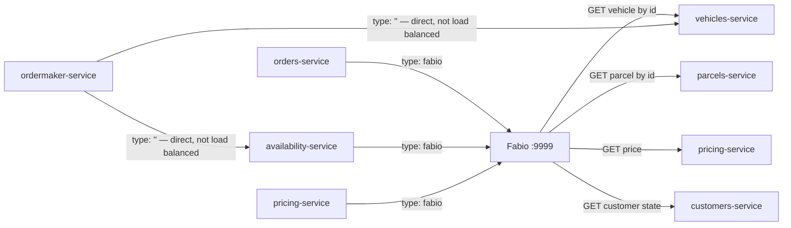

# Pattern: Narrow Synchronous Point-Read Between Services

## Status

**Candidate.** No approval metadata, ADR, or documented human sign-off exists in the workspace; the
CAKE catalog for tenant `Q5SCXYFS` holds no governing decision.

## Category

integration

## Problem

An event-driven platform still has moments where a service must know something *now* — a price
cannot be computed without the customer's standing, a reservation cannot be granted without the
customer's current state. Answering those with events means either replicating everything or
accepting stale data. Answering them with unrestricted synchronous calls rebuilds a distributed
monolith.

## Context

Applies in a platform whose default integration is asynchronous
([[service-owned-topic-exchange-messaging]]) and which needs a small, explicitly bounded synchronous
escape hatch. In Pacco exactly four services make outbound HTTP calls, every one of them a
single-entity `GET`, and no service ever writes to another service over HTTP.

## When to Use

- The caller cannot proceed without the answer inside the current request.
- The data is small, single-entity, and read-only.
- The caller can tolerate the target's availability becoming its own availability.
- The relationship is worth declaring explicitly — because every such call is a documented coupling.

## When Not to Use

- The caller only needs to *know that something happened* — publish and subscribe instead.
- The call would be a write. Pacco has none, deliberately; writes go through the owning service's
  command surface.
- The answer would be fetched repeatedly for the same entity in a loop — that is composition
  chattiness, and the platform has no cache, circuit breaker, or bulkhead to absorb it.
- The data is only needed for an existence check. Use
  [[event-carried-reference-replica]] instead — which is exactly what Pacco does for `CustomerId`.

## Architecture Summary

Each calling service declares its targets in an `httpClient.services` map in `appsettings.json`, as
logical name → service name. A typed client class per target (`IParcelsServiceClient`,
`ICustomerStateProvider`, …) wraps Convey's `IHttpClient`, which resolves the logical name at call
time. When `httpClient.type` is `"fabio"` the call goes through the load balancer
([[registry-mediated-discovery-and-routing]]); when it is empty the call goes direct to the container
DNS name.

## Structure / Flow

## Key Components

| Component | Responsibility |
|-----------|----------------|
| `httpClient.services` map in `appsettings.json` | Declares the caller's complete set of synchronous dependencies — the authoritative list |
| `httpClient.type` | `"fabio"` (load-balanced) or `""` (direct container DNS) |
| `httpClient.retries` | Set to `3` in every calling service |
| Typed service client (`Infrastructure/Services/Clients/*.cs`) | One class per target, wrapping `IHttpClient`; the only place a URL shape is built |
| Client interface in `Application/Services/Clients/` | Keeps the calling handler dependent on an abstraction, not on HTTP |

## Data / Event / API Contracts

The complete observed synchronous surface — four callers, five distinct call targets:

| Caller | Declared targets | `httpClient.type` | Load-balanced |
|--------|------------------|-------------------|---------------|
| `orders-service` | `parcels` → `parcels-service`, `pricing` → `pricing-service`, `vehicles` → `vehicles-service` | `"fabio"` | Yes |
| `availability-service` | `customers` → `customers-service` | `"fabio"` | Yes |
| `pricing-service` | `customers` → `customers-service` | `"fabio"` | Yes |
| `ordermaker-service` | `availability` → `availability-service`, `vehicles` → `vehicles-service` | `""` | **No** |

Every call is a `GET` for one entity. No `POST`, `PUT`, `PATCH`, or `DELETE` between services was
observed. Error responses follow the platform's uniform `{ code, reason }` contract with HTTP 400.
Per-endpoint detail is in [`../../baselines/api-inventory.md`](../../baselines/api-inventory.md) §6.

## Naming Conventions

| Element | Convention | Example |
|---------|-----------|---------|
| Logical target name | Plural resource, matching the target service's short name | `parcels`, `customers` |
| Configured value | Deployable name | `parcels-service` |
| Client interface | `I<Target>ServiceClient` | `IVehiclesServiceClient` |
| Client location | `Application/Services/Clients/` (interface), `Infrastructure/Services/Clients/` (implementation) | — |

## Service / Boundary Guidance

- **`customers-service` is the platform's synchronous leaf.** It is called by two services and calls
  nothing. Every reservation eligibility check and every price calculation has a hard availability
  dependency on it.
- `orders-service` is the heaviest caller, with three outbound dependencies.
- `ordermaker-service` is the **only** service whose outbound HTTP bypasses the load balancer. This
  is a genuine behavioural difference and must not be generalised: "Pacco services call each other
  through Fabio" is true for three of four callers.
- The `httpClient.services` map is the boundary contract. A dependency that is not in that map does
  not exist; adding one is an architectural change, not a code detail.

## Security / Compliance Considerations

- `customers-service` is the one service with `security.certificate.enabled: true`, and its ACL
  grants exactly one caller: `{ "availability-service": { "validIssuer": "localhost", "permissions":
  ["customers:read"] } }`. **`pricing-service` is not in that ACL although it calls
  `customers-service`.** Either a legitimate caller is missing a grant or certificate enforcement is
  not actually in effect; the configuration alone cannot distinguish the two.
- Certificates come from Vault PKI — see [[vault-issued-dynamic-credentials-and-service-pki]].
- No TLS is configured on any inter-service hop; all calls are plain HTTP.
- `ordermaker-service` is the only caller with `httpClient.requestMasking.enabled: true`
  (`maskTemplate: "*****"`), masking outbound request payloads in its own logs.

## Observability Considerations

- Calls are traced by Jaeger and appear as child spans of the caller's request, so a slow synchronous
  dependency is directly visible in the trace.
- The `customers-service` fan-in is the platform's most valuable latency signal: it sits on the
  critical path of both reservation and pricing.
- Direct calls from `ordermaker-service` do not pass through Fabio, so any Fabio-side routing metric
  under-counts the platform's real east-west traffic.
- No per-dependency success-rate or latency metric is exported by the calling services themselves.

## Failure Handling

- `httpClient.retries: 3` is the only resilience control. There is **no circuit breaker, no bulkhead,
  no timeout policy, and no fallback** anywhere in the platform.
- Retrying a `GET` is safe (it is idempotent), which is part of why restricting this pattern to reads
  matters.
- A target that is down turns into a failed command in the caller, which then becomes a rejected
  event on the async path ([[rejected-event-failure-contract]]) or an HTTP 400 on the sync path.
- `ordermaker-service`'s direct calls have no load-balancer failover: a single unhealthy instance is
  not routed around.

## Trade-offs

| Gain | Cost |
|------|------|
| The caller gets a fresh, authoritative answer | The caller's availability becomes the product of its own and the target's |
| The dependency is declared in one readable place per service | The declaration is configuration, so nothing fails at build time if a target is renamed |
| Restricting to point reads keeps the synchronous graph shallow (max depth 2) | Any need for a synchronous write forces either a new pattern or an awkward workaround |
| Logical names allow the transport to change (Fabio or direct) without code changes | The same configuration key produces two different runtime topologies, and only one service uses the second |

## Variants

- **Load-balanced (`type: "fabio"`)** — the majority, three of four callers.
- **Direct (`type: ""`)** — `ordermaker-service` only; resolves the container DNS name and gets no
  load balancing.
- **Replica instead of call** — for existence checks, Pacco substitutes
  [[event-carried-reference-replica]] rather than a synchronous call, which is why `CustomerId`
  validation in `orders-service` is a local lookup.

## Anti-patterns

- **Adding a synchronous write.** Nothing in the platform prevents it, and it would create a
  cross-service transaction boundary the architecture has no answer for.
- **Growing the call depth.** The current graph is at most caller → target; a chain would multiply
  failure probability with no circuit breaker anywhere to contain it.
- **Silently mixing the two `httpClient.type` values.** The behavioural difference between
  `"fabio"` and `""` is invisible in the calling code and only appears in configuration.
- **Treating the synchronous map as the full dependency picture.** It covers HTTP only; the
  asynchronous topology is far larger.

## Evidence

- **ADR:** none — no ADR exists in any cloned repository or in the CAKE catalog for tenant
  `Q5SCXYFS`.
- **Repo:** `hianshul100_Pacco.Services.Orders`, `.Availability`, `.Pricing`, `.OrderMaker`;
  targets `.Parcels`, `.Vehicles`, `.Customers`.
- **Service:** callers `orders-service`, `availability-service`, `pricing-service`,
  `ordermaker-service`; targets `parcels-service`, `pricing-service`, `vehicles-service`,
  `customers-service`, `availability-service`.
- **File:**
  `hianshul100_Pacco.Services.OrderMaker/src/Pacco.Services.OrderMaker/appsettings.json`
  (`"httpClient": { "type": "", "retries": 3, "services": { "availability": "availability-service",
  "vehicles": "vehicles-service" }, "requestMasking": { "enabled": true, "maskTemplate": "*****" } }`);
  `hianshul100_Pacco.Services.Orders/src/Pacco.Services.Orders.Api/appsettings.json`
  (`"type": "fabio"`);
  `hianshul100_Pacco.Services.Orders/src/Pacco.Services.Orders.Infrastructure/Extensions.cs`
  (`.AddHttpClient()`, `.AddFabio()`, and the three `I*ServiceClient` registrations);
  `hianshul100_Pacco.Services.OrderMaker/src/Pacco.Services.OrderMaker/Sagas/AIOrderMakingSaga.cs:93,98`
  (the two direct calls);
  `hianshul100_Pacco.Services.Customers/src/.../appsettings.json` (`security.certificate` ACL).
- **API/Event:** inter-service HTTP call inventory in
  [`../../baselines/api-inventory.md`](../../baselines/api-inventory.md) §6.
- **Deployment/Config:** `hianshul100_Pacco/compose/consul-fabio-vault.yml` and
  `compose/infrastructure.yml` declare single `consul` and `fabio` containers.
- **Notes:** `architecture-baseline.md` §4.1, §8.4, C10.

## Related ADRs

None. No ADR, decision record, or RFC exists in the workspace, and the CAKE graph for tenant
`Q5SCXYFS` returned zero nodes.

## Related Patterns

- [[service-owned-topic-exchange-messaging]] — the asynchronous default this pattern is the exception
  to.
- [[event-carried-reference-replica]] — the alternative for existence checks.
- [[registry-mediated-discovery-and-routing]] — what `type: "fabio"` resolves through.
- [[vault-issued-dynamic-credentials-and-service-pki]] — the certificate identity these calls can
  present.
- [[dispatcher-bound-cqrs-endpoints]] — the endpoint shape being called.

## Recommendation

**Adopt, and keep it narrow.** The value of this pattern in Pacco comes entirely from its
restrictions: reads only, one entity, declared in configuration, depth of one. A new synchronous
dependency should be added only when an event-carried replica genuinely cannot answer the question,
and adding one should be treated as an architecture change with a recorded rationale. Two gaps should
be closed before the surface grows: add a timeout and a circuit breaker to `IHttpClient` usage (three
retries against a hung target is currently the worst case), and reconcile
`customers-service`'s certificate ACL with its actual callers.

## Assumptions, Blockers & Open Questions

> [!IMPORTANT]
> This document contains unresolved items that require attention before or during implementation. Review and resolve before merging downstream artifacts. Each item below is tagged **[ACTION NOW]** (a human must decide or confirm it before this work can safely proceed) or **[handled later by <stage>]** (a named later stage owns and will prove it) — read the tags first to see what, if anything, is yours to act on.

### Assumptions

| # | Assumption | Rationale | Impact if Wrong | Validation Path |
|---|------------|-----------|-----------------|-----------------|
| A1 | The `httpClient.services` map in each service's `appsettings.json` is the complete list of that service's synchronous dependencies | Convey's `IHttpClient` resolves logical names from this map, and no hard-coded external base URL was found in any repository | Undeclared synchronous dependencies would exist, and the availability coupling described here would be understated | Search each service for direct `HttpClient` construction and for absolute URLs, and observe outbound connections from a running service |
| A2 | `httpClient.retries: 3` retries only idempotent `GET` calls, because no service makes a synchronous write | Every observed call target is a single-entity `GET`; no `POST`/`PUT`/`DELETE` between services was found | A retried non-idempotent call would duplicate an effect, and the retry setting would be unsafe rather than harmless | Confirm no service-to-service write exists, and check whether Convey's retry policy distinguishes HTTP methods |

### Open Questions

| # | Question | Why It Matters | Proposed Answer (if any) | Decision Owner |
|---|----------|----------------|--------------------------|----------------|
| Q1 | **[ACTION NOW]** `pricing-service` calls `customers-service` but is not in that service's certificate ACL, which grants `customers:read` only to `availability-service`. Either the grant is missing or certificate checking is not really switched on — and the configuration cannot tell us which | If enforcement is real, price calculation is broken for anyone who hits that path. If it is not real, the platform's one service-identity control is nominal | No confident reading; the two possibilities are indistinguishable from configuration alone | Security owner for the Pacco platform (no named individual is recorded in the workspace) |
| Q2 | **[ACTION NOW]** Why does `ordermaker-service` alone bypass the load balancer, with `httpClient.type` set to an empty string? | It is the only caller with no failover and no load distribution, and it sits inside the platform's only multi-step business process | Most likely an un-updated configuration rather than a decision — every other caller sets `"fabio"`. Not stated anywhere | Owner of `hianshul100_Pacco.Services.OrderMaker` (no named individual is recorded) |
