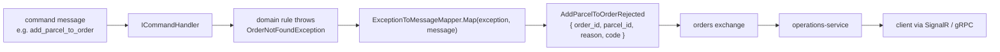

# Pattern: Rejected-Event Failure Contract

## Status

**Candidate.** No approval metadata, ADR, or documented human sign-off exists in the workspace; the
CAKE catalog for tenant `Q5SCXYFS` holds no governing decision.

## Category

integration

## Problem

When a command arrives over a message broker there is no response channel. A handler that throws
loses the failure: the caller already has an acknowledgement, the exception becomes a log line, and
nothing on the wire tells anyone the command did not take effect. Success is observable (a domain
event is published); failure is not.

## Context

Applies wherever commands travel over a broker and the originating caller cannot be answered
in-band — in Pacco that is the twenty edge-published writes ([[dual-mode-edge-write]]) and every
saga-issued command ([[saga-process-manager]]). Every Pacco service that consumes commands
implements this, and `operations-service` treats rejected events as one of the three message classes
it subscribes to.

## When to Use

- Commands arrive over a transport with no reply channel.
- A caller (human or process) needs to distinguish "not done yet" from "will never be done".
- A completion channel already exists that can carry the failure to the caller.

## When Not to Use

- The transport already answers the caller — an HTTP command handler should throw and let the
  error-to-response mapper produce a status code instead.
- The failure is infrastructural rather than a business rejection (broker unreachable, database down).
  Those are not rejections of the command; they are retryable delivery failures and belong to the
  broker's failure handling, which Pacco has not configured.
- No consumer exists for the rejected event. Publishing one nobody reads is worse than a log line,
  because it implies a contract that is not honoured.

## Architecture Summary

Every service registers an `IExceptionToMessageMapper`. When a command handler throws, the framework
calls the mapper with both the exception **and the original message**, and the mapper returns a
rejected-event object, which is published onto the service's own exchange like any other event. The
pairing on both inputs matters: the same exception type maps to different rejected events depending
on which command produced it.

## Structure / Flow



## Key Components

| Component | Responsibility |
|-----------|----------------|
| `ExceptionToMessageMapper : IExceptionToMessageMapper` | One per service, registered via `.AddExceptionToMessageMapper<ExceptionToMessageMapper>()` in `Extensions.cs` |
| `Application/Events/Rejected/*.cs` | The rejected-event classes, each marked `[Contract]` and implementing `IRejectedEvent` |
| `DomainException` / `AppException` base types | Carry a `Code` that becomes the rejected event's machine-readable `code` |
| `operations-service` | Subscribes to every exchange's `rejectedEvents` list and turns them into `operation_rejected` pushes |

## Data / Event / API Contracts

Every rejected event carries at minimum `Reason` (human-readable) and `Code` (machine-readable),
plus the identifiers of the entities the rejected command named. Observed shape from
`Pacco.Services.Orders.Application.Events.Rejected.AddParcelToOrderRejected`:

```csharp
[Contract]
public class AddParcelToOrderRejected : IRejectedEvent
{
    public Guid OrderId { get; }
    public Guid ParcelId { get; }
    public string Reason { get; }
    public string Code { get; }
}
```

On the wire, snake_cased by Convey's conventions: `add_parcel_to_order_rejected` carrying
`order_id`, `parcel_id`, `reason`, `code`.

`operations-service`'s `messages.json` declares the rejected-event names per service alongside
commands and events — for example `availability-service` declares `add_resource_rejected`,
`delete_resource_rejected`, `release_resource_rejected`, `reserve_resource_rejected`.

## Naming Conventions

| Element | Convention | Example |
|---------|-----------|---------|
| Rejected event type | `<CommandName>Rejected` | `ReserveResourceRejected` |
| Wire name | `<command>_rejected` | `reserve_resource_rejected` |
| Location | `Application/Events/Rejected/` (`Events/Rejected/` in single-project services) | — |
| `Code` value | exception's own `Code`, else the exception type name underscored with `_exception` stripped | `order_not_found` |
| Marker | `[Contract]` attribute + `IRejectedEvent` | — |

## Service / Boundary Guidance

- A rejected event is published onto the **rejecting service's own** exchange, not the caller's. The
  caller subscribes; ownership does not move.
- Every command a service accepts should have at least one corresponding rejected event. A command
  with no rejection path is a command whose failures are invisible.
- The rejected event is part of the service's public contract; renaming it breaks the completion
  channel silently, exactly as with any other message.
- Do not leak internal exception detail into `Reason` — it is delivered to clients.

## Security / Compliance Considerations

- `Reason` is caller-visible text derived from an exception message. Pacco's domain exceptions carry
  identifiers and short phrases, but nothing enforces that; an exception message containing a
  customer email or a connection string would be pushed to a connected client verbatim.
- The Serilog `excludeProperties` redaction list (`Email`, `Login`, `Token`, `Password`,
  `ConnectionString`, and others) protects **logs**, not rejected-event payloads.
- Rejected events reveal the existence of entities: `OrderNotFoundException` mapped to
  `AddParcelToOrderRejected` confirms to the caller that a given order id does not exist. Whether the
  completion channel scopes delivery per caller was not established — see
  [[real-time-push-with-shared-backplane]].

## Observability Considerations

- The `code` field is the natural dimension for a failure-rate metric per command; no such metric is
  currently exported by any service.
- Because a rejection is a normal published message, it inherits `message_context` and `span_context`
  and appears in the same Jaeger trace as the command that failed
  ([[correlation-and-span-propagation]]).
- A rejected event is not an error in the log unless the handler also logged one; the
  `AddHandlersLogging()` decorator and `MessageToLogTemplateMapper` are what produce the log side.

## Failure Handling

- This pattern **is** the failure-handling path for business rejections.
- It does not cover infrastructure failures: if the publish of the rejected event itself fails, the
  failure is lost. The outbox ([[transactional-outbox-handler-decorator]]) covers this only where the
  outbox decorator is in play and its atomicity guarantee is intact — in Pacco
  `outbox.disableTransactions: true`, so it is not.
- A mapper that returns `null` for an (exception, message) combination silently produces no rejected
  event. Pacco's mappers have `_ => null` fallbacks on several branches, so some failure paths are
  genuinely silent.

## Trade-offs

| Gain | Cost |
|------|------|
| Asynchronous failures become observable and routable | Every command needs a matching rejected-event type — real duplication across ~20 commands per service |
| `code` gives clients a stable, non-prose failure discriminator | The mapper is a hand-written switch; adding a command without updating it silently loses its failures |
| Failure travels on the same transport, with the same tracing and correlation, as success | The rejected event is only as useful as the completion channel that carries it |
| Domain code stays clean — it throws, the mapper translates | Two mappers must be kept in step per service (`ExceptionToResponseMapper` for HTTP, `ExceptionToMessageMapper` for messages) |

## Variants

- **HTTP twin.** `ExceptionToResponseMapper` performs the same translation for the synchronous
  transport, producing `{ code, reason }` with HTTP 400. Both mappers derive `code` the same way, so
  a client sees the same discriminator on either path.
- **Exception-plus-message dispatch.** Where one exception can arise from several commands, Pacco's
  mappers switch on the message too — `OrderNotFoundException` maps to six different rejected events
  depending on which command was being handled.
- **Cross-service rejection.** `OrderForDeliveryNotFound` and `OrderForReservedVehicleNotFound` are
  rejections of an *event* the service consumed rather than of a command, published so the originating
  service can react.

## Anti-patterns

- **Returning `null` from the mapper as a default.** Present in Pacco (`_ => null` branches); it
  produces a command that fails with no signal at all.
- **Putting the exception's stack trace or raw message in `Reason`.** It is delivered to clients.
- **Publishing rejected events with no consumer.** They then cost contract surface and give nothing.
- **Assuming a rejected event means the command was rejected by business rules.** It only means the
  mapper matched; an infrastructure exception that happens to match a branch produces the same shape.

## Evidence

- **ADR:** none — no ADR exists in any cloned repository or in the CAKE catalog for tenant
  `Q5SCXYFS`.
- **Repo:** `hianshul100_Pacco.Services.Orders`, `.Availability`, `.Customers`, `.Deliveries`,
  `.Identity`, `.Parcels`, `.Vehicles`, `.OrderMaker`, `.Operations`.
- **Service:** all command-consuming services; consumed by `operations-service`.
- **File:**
  `hianshul100_Pacco.Services.Orders/src/Pacco.Services.Orders.Infrastructure/Exceptions/ExceptionToMessageMapper.cs`
  (exception-and-message switch, including the six-way `OrderNotFoundException` branch and the
  `_ => null` fallbacks);
  `.../Pacco.Services.Orders.Application/Events/Rejected/AddParcelToOrderRejected.cs`;
  `.../Pacco.Services.Orders.Infrastructure/Extensions.cs:72`
  (`.AddExceptionToMessageMapper<ExceptionToMessageMapper>()`);
  `.../Pacco.Services.Orders.Infrastructure/Exceptions/ExceptionToResponseMapper.cs` (the HTTP twin,
  including the `Underscore().Replace("_exception", string.Empty)` code derivation).
  Rejected-event directories exist in eight service repositories.
- **API/Event:** `rejectedEvents` arrays in
  `hianshul100_Pacco.Services.Operations/src/Pacco.Services.Operations.Api/messages.json`; per-message
  catalogue in [`../../baselines/api-inventory.md`](../../baselines/api-inventory.md) §9.3.
- **Deployment/Config:** none specific — the pattern is entirely in-process plus the shared broker.
- **Notes:** `architecture-baseline.md` §4.2, §5.4; `api-inventory.md` §7.4 (error contract).

## Related ADRs

None. No ADR, decision record, or RFC exists in the workspace, and the CAKE graph for tenant
`Q5SCXYFS` returned zero nodes.

## Related Patterns

- [[service-owned-topic-exchange-messaging]] — the transport rejected events travel on.
- [[acknowledge-then-notify-completion]] — the channel that carries a rejection to the caller.
- [[dual-mode-edge-write]] — why asynchronous failures need a contract at all.
- [[dispatcher-bound-cqrs-endpoints]] — the HTTP twin of this translation.
- [[aggregate-buffered-domain-events]] — the success-side counterpart.
- [[transactional-outbox-handler-decorator]] — what should make the rejection publish atomic.

## Recommendation

**Adopt for every new command consumed over a broker.** Two hardening changes should accompany
adoption rather than be inherited from the current implementation: make the mapper total, so that no
(exception, message) combination falls through to `null` without an explicit, reviewed decision; and
define `Reason` as a caller-safe string set deliberately by the domain exception, not as whatever
`ex.Message` happens to contain. Keep the `code` derivation rule identical between the HTTP and the
message mapper so clients see one failure vocabulary.

## Assumptions, Blockers & Open Questions

> [!IMPORTANT]
> This document contains unresolved items that require attention before or during implementation. Review and resolve before merging downstream artifacts. Each item below is tagged **[ACTION NOW]** (a human must decide or confirm it before this work can safely proceed) or **[handled later by <stage>]** (a named later stage owns and will prove it) — read the tags first to see what, if anything, is yours to act on.

### Assumptions

| # | Assumption | Rationale | Impact if Wrong | Validation Path |
|---|------------|-----------|-----------------|-----------------|
| A1 | A rejected event published by a service is actually delivered to the original caller | The chain is long — handler, mapper, publish, `operations-service` subscription, SignalR or gRPC push — and no end-to-end test of it exists anywhere in the repositories | Every asynchronous failure would be silently dropped, and callers would see writes hang forever rather than fail | Drive one command to failure end to end in a running environment and confirm the client receives `operation_rejected` |
| A2 | `Reason` strings currently contain no personal data or credential material | Pacco's observed domain exception messages carry identifiers and short phrases, but nothing constrains what an exception message may hold | Personal data would be pushed to connected clients and would sit in the operation record in Redis, outside the log-redaction policy | Review every `DomainException` and `AppException` message string across the ten services against the platform's data-handling rules |

### Open Questions

| # | Question | Why It Matters | Proposed Answer (if any) | Decision Owner |
|---|----------|----------------|--------------------------|----------------|
| Q1 | **[ACTION NOW]** Several mapper branches end in `_ => null`, which means those failures produce no message at all. Is that intentional, and which command failures are allowed to be silent? | A caller waiting on the async path gets nothing — not a success, not a rejection. It is indistinguishable from the service being down | Make the mapper total: every command failure should produce a rejected event, with a generic one as the fallback rather than `null` | Owners of the command-consuming services (no named individual is recorded in the workspace) |
| Q2 | **[ACTION NOW]** Does the completion channel deliver a rejected event only to the caller who issued the command, or to every connected client? | A rejection names entity identifiers and a reason. Broadcasting it would expose one customer's failed operations to everyone connected | The static test page passes a JWT to `initializeAsync` after connecting, which suggests per-caller scoping is intended, but the hub's delivery logic was not established | Security owner for the Pacco platform, with the owner of `operations-service` |
