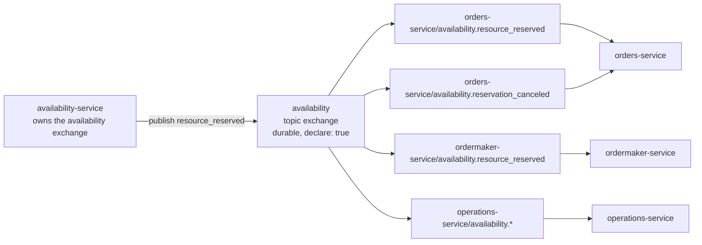

# Pattern: Service-Owned Topic Exchange Messaging

## Status

**Candidate.** No approval metadata, sign-off record, `CODEOWNERS` entry, or ADR exists in any of the
fourteen cloned repositories, and the CAKE knowledge graph for tenant `Q5SCXYFS` returns zero nodes.
Nothing in the workspace records a human having approved this approach, so it is catalogued as
observed practice, not as an endorsed standard.

## Category

integration

## Problem

A set of independently deployed services must react to each other's state changes without any
service holding a reference to, or a runtime dependency on, another service. Point-to-point queues
couple the producer to a known list of consumers; a shared exchange couples every service to every
other service's routing decisions. Neither survives the addition of a new consumer.

## Context

Applies where services are independently deployed and released, where a message broker with topic
routing is already part of the platform, and where the set of interested consumers for a given event
is expected to grow without the publisher being changed. In Pacco this is the primary integration
fabric: roughly 80 distinct messages move across eight topic exchanges that carry traffic
(`identity`, `customers`, `availability`, `vehicles`, `orders`, `parcels`, `deliveries`,
`ordermaker`).

## When to Use

- A publisher's state change is of interest to an unknown or growing set of consumers.
- Consumers must be addable and removable without redeploying or reconfiguring the publisher.
- Each consumer needs independent failure and backlog behaviour for each message type it handles.
- The platform already has a broker; the pattern adds no new infrastructure.

## When Not to Use

- The caller needs an answer inside the current request — use
  [[narrow-synchronous-point-read]] instead.
- The interaction is a targeted instruction to one named service rather than a broadcast fact. Pacco
  does this too, but only from its saga (see Anti-patterns and [[saga-process-manager]]).
- Payload shape must be enforced at build time. This pattern as implemented in Pacco gives no such
  guarantee (see Trade-offs).

## Architecture Summary

Each service declares exactly one topic exchange named after itself, and publishes only to that
exchange. Any service that cares about a message binds its own queue to the owning service's
exchange. The broker is preserved as an explicit hop: a subscriber is never "called by" the
publisher — it consumes from the publisher's exchange, and the publisher has no knowledge that the
subscriber exists.

Queues are named from the template `<subscriber-service>/{{exchange}}.{{message}}`, so every
(subscriber, exchange, message) triple gets its own queue rather than one queue per subscriber.

## Structure / Flow

## Key Components

| Component | Responsibility |
|-----------|----------------|
| `rabbitMq.exchange` section in each service `appsettings.json` | Declares the one exchange the service owns: `{ name: "<service>", type: "topic", declare: true, durable: true, autoDelete: false }` |
| `rabbitMq.queue.template` | `<service>/{{exchange}}.{{message}}` — gives per-message queue isolation on the consuming side |
| `IMessageBroker` (per-service implementation over Convey's `IBusPublisher`) | The single publish path; also stamps correlation and span headers ([[correlation-and-span-propagation]]) |
| `IEventHandler<T>` / `ICommandHandler<T>` implementations | One handler per subscribed message; registered by Convey's `AddRabbitMq()` subscription wiring |
| Locally declared message classes | Each service declares its own copy of every event/command class it publishes or consumes |

## Data / Event / API Contracts

- Routing key and message name are derived from the message **type name**, snake_cased by Convey's
  `snakeCase` conventions: `OrderCreated` → `order_created`, `ResourceReserved` → `resource_reserved`,
  `CustomerStateChanged` → `customer_state_changed`.
- Payload property names are snake_cased on the wire by the same convention.
- Two headers travel with every message: `message_context` (correlation identity, including the
  originating user) and `span_context` (Jaeger trace context).
- **There is no schema registry, no Avro or Protobuf definition for broker messages, and no
  contract-version field.** Compatibility rests entirely on both sides independently declaring
  structurally compatible classes with the same name.
- The complete per-exchange message catalogue is in
  [`../../baselines/api-inventory.md`](../../baselines/api-inventory.md) §9.3 and is not restated
  here.

## Naming Conventions

| Element | Convention | Example |
|---------|-----------|---------|
| Exchange | Service short name, no suffix | `availability`, `orders`, `ordermaker` |
| Message name / routing key | `snake_case` of the C# type name | `resource_reserved` |
| Rejected event | `<command>_rejected` | `reserve_resource_rejected` |
| Queue | `<subscriber>/{{exchange}}.{{message}}` | `orders-service/availability.resource_reserved` |
| Message class location | `Application/Events` (own), `Application/Events/External` (consumed), `Application/Events/Rejected` | — |

## Service / Boundary Guidance

- **One exchange per service, owned by that service.** The exchange name is part of the service's
  public surface; renaming it breaks every subscriber silently.
- **Publish only to your own exchange.** Every Pacco service honours this except
  `ordermaker-service`, which publishes five commands onto the `orders` exchange and
  `reserve_resource` onto the `availability` exchange. That is a deliberate saga mechanism, not a
  licence to generalise.
- A consumer must never assume it is the only consumer, and a publisher must never enumerate its
  consumers.
- Adding a message to an exchange is a compatible change; renaming or removing one is a breaking
  change with no build-time signal.

## Security / Compliance Considerations

- Anyone able to publish onto a service's exchange can drive that service's command handlers. Pacco's
  in-service authorization guards are written `if (identity.IsAuthenticated && …)` and therefore
  **skip** for a message carrying an empty user context, so broker access is effectively equivalent to
  authenticated access — see [[edge-enforced-authentication-with-identity-binding]].
- No broker-side authorization, per-exchange ACL, or vhost partitioning was observed in any
  repository. Whether a real environment restricts publish rights is not determinable from these
  sources.
- Message payloads are not encrypted at rest in the broker and no field-level redaction applies to
  them; the Serilog `excludeProperties` redaction in
  [[structured-logging-with-property-redaction]] covers logs only.

## Observability Considerations

- The per-(subscriber, message) queue naming means queue depth is directly attributable: a growing
  `orders-service/availability.resource_reserved` queue names both the failing consumer and the
  failing message type.
- `span_context` makes a single Jaeger trace span the publish and the consume, so an end-to-end
  request can be followed across the broker hop. This is the platform's only cross-async
  observability mechanism.
- No per-exchange or per-queue metric is exported by the services themselves; broker-side metrics
  would have to come from RabbitMQ's own exporter, which is not configured in
  `hianshul100_Pacco/compose/`.

## Failure Handling

- Convey's transactional inbox deduplicates redelivered messages on the consuming side; see
  [[transactional-outbox-handler-decorator]] for the publishing side.
- Business failures inside a handler are converted into rejected events rather than lost — see
  [[rejected-event-failure-contract]].
- **No dead-letter exchange, retry policy, backoff, or poison-message configuration exists in any
  service.** A handler that throws returns the message to RabbitMQ with no configured failure
  destination, so broker defaults apply. What those defaults are in this deployment was not
  established.
- The per-message queue isolation limits blast radius: a permanently failing message type cannot
  head-of-line-block a service's consumption of a different message type.

## Trade-offs

| Gain | Cost |
|------|------|
| Publisher and subscriber deploy and version independently | No build-time contract; a renamed field breaks the consumer at runtime only |
| New consumers need no publisher change | The publisher cannot know who depends on it, so impact analysis needs a cross-repository search |
| Per-message queues give precise isolation and attribution | Queue count grows as (subscribers × messages), not (subscribers) |
| No shared library to version and release | Every service re-declares every message class it touches — real duplication, ~80 messages wide |
| The broker hop absorbs consumer downtime | End-to-end latency and outcome delivery become asynchronous concerns ([[acknowledge-then-notify-completion]]) |

## Variants

- **Fan-out to a whole-topology observer.** `operations-service` binds to all eight exchanges using a
  declarative manifest rather than compiled handlers — see
  [[declarative-message-manifest-subscription]].
- **Command-over-exchange.** The same transport carries targeted commands rather than broadcast
  facts, used by `api-gateway` in async mode ([[dual-mode-edge-write]]) and by the saga
  ([[saga-process-manager]]).
- **Declared but unused exchange.** `operations-service` declares an `operations` topic exchange in
  its `rabbitMq.exchange` config, so the broker creates it, but the service contains no publish path.
  A reader inspecting a live broker sees nine exchanges where eight carry traffic.

## Anti-patterns

- **Drawing a direct edge from publisher to subscriber.** Collapsing the broker hop produces a
  dependency graph that implies coupling the code does not have, and leads to wrong impact analysis.
- **Publishing onto another service's exchange.** `ordermaker-service` does this deliberately; done
  casually it moves ownership of a service's inbound command surface outside that service.
- **Treating "no subscriber found in the repositories" as "no subscriber exists."** It is only true
  within the cloned scope; a live broker binding is the proof.
- **Relying on the message name as the contract.** The name is stable; the payload is not enforced
  anywhere. `customer_state_changed` and `became_vip` are published with no consumer at all, which
  nothing in the system detects.

## Evidence

- **ADR:** none — no ADR exists in any cloned repository or in the CAKE catalog for tenant
  `Q5SCXYFS`.
- **Repo:** `hianshul100_Pacco.Services.Orders`, `hianshul100_Pacco.Services.Availability`,
  `hianshul100_Pacco.Services.Customers`, `hianshul100_Pacco.Services.Deliveries`,
  `hianshul100_Pacco.Services.Identity`, `hianshul100_Pacco.Services.Parcels`,
  `hianshul100_Pacco.Services.Vehicles`, `hianshul100_Pacco.Services.OrderMaker`,
  `hianshul100_Pacco.Services.Operations`.
- **Service:** all ten `*-service` deployables plus `api-gateway` in async mode.
- **File:** `src/Pacco.Services.Orders.Infrastructure/Extensions.cs:70`
  (`.AddRabbitMq(plugins: p => p.AddJaegerRabbitMqPlugin())`);
  `src/Pacco.Services.Orders.Infrastructure/Services/MessageBroker.cs` (the single publish path);
  `src/Pacco.Services.Orders.Application/Events/` and `.../Events/External/` (locally declared
  message classes); each service's `appsettings.json` `rabbitMq` section.
- **API/Event:** eight traffic-carrying topic exchanges; ~80 messages; catalogue in
  [`../../baselines/api-inventory.md`](../../baselines/api-inventory.md) §9.3; consumer binding
  matrix in §9.4.
- **Deployment/Config:** `hianshul100_Pacco/compose/mongo-rabbit-redis.yml` and
  `compose/infrastructure.yml` declare a **single** RabbitMQ container with no clustering, mirroring,
  or quorum queue configuration.
- **Notes:** `hianshul100_Pacco.Context/docs/architecture-inventory/baselines/architecture-baseline.md`
  §4.2 and §4.5; `repo-inventory.md` §3.2.

## Related ADRs

None. No ADR, decision record, or RFC exists in any of the fourteen cloned repositories
(`architecture-baseline.md` §11.1), and a graph query against the CAKE catalog for tenant
`Q5SCXYFS` returned zero nodes of any type. This pattern is supported by code evidence only.

## Related Patterns

- [[rejected-event-failure-contract]] — how a handler failure on this transport reaches the caller.
- [[transactional-outbox-handler-decorator]] — how a publish is made atomic with the state change it
  reports.
- [[correlation-and-span-propagation]] — the two headers that make this transport traceable.
- [[declarative-message-manifest-subscription]] — subscribing to the whole topology without compiled
  types.
- [[narrow-synchronous-point-read]] — the deliberately small synchronous complement.
- [[event-carried-reference-replica]] — what a subscriber does with a fact it receives.
- [[framework-supplied-platform-conventions]] — why every service's wiring looks identical.

## Recommendation

**Adopt for new event-driven collaboration inside this platform**, because it is already the
platform's dominant integration mechanism and a divergent approach would fragment the topology. Adopt
it with two additions that the current implementation lacks and that a new feature should not
inherit: a declared payload contract for every new message (the platform has none — see
[[declarative-message-manifest-subscription]] and Q9 in `architecture-baseline.md`), and an explicit
dead-letter destination for every new queue. Do **not** extend the cross-exchange publishing
exception beyond `ordermaker-service` without a recorded decision.

## Assumptions, Blockers & Open Questions

> [!IMPORTANT]
> This document contains unresolved items that require attention before or during implementation. Review and resolve before merging downstream artifacts. Each item below is tagged **[ACTION NOW]** (a human must decide or confirm it before this work can safely proceed) or **[handled later by <stage>]** (a named later stage owns and will prove it) — read the tags first to see what, if anything, is yours to act on.

### Assumptions

| # | Assumption | Rationale | Impact if Wrong | Validation Path |
|---|------------|-----------|-----------------|-----------------|
| A1 | A message with no subscriber found in the fourteen cloned repositories genuinely has no consumer anywhere | The clone set is the only evidence available; `customer_state_changed` and `became_vip` have no handler in any repository | Consumers exist outside this scope, so "unconsumed event" findings here are wrong and the topology is larger than described | Inspect queue bindings for the `customers`, `vehicles`, and `deliveries` exchanges on a running broker; a binding with no repository behind it proves an out-of-scope consumer |
| A2 | Both sides of a message agree on payload shape because Convey's `snakeCase` conventions serialise their independently declared classes compatibly | No shared library and no schema registry exists, yet the platform works, so something must be making the shapes line up | Silent data loss on every message whose two declarations have drifted, with no build or runtime error | Capture live messages off each exchange and diff the observed JSON against both the publishing and the consuming service's class definitions |

### Blockers

| # | Blocker | Blocks | Owner | Resolution Path | Target Date |
|---|---------|--------|-------|-----------------|-------------|
| B1 | **[ACTION NOW]** Nobody can say what a message's wire payload actually is. No artifact declares the fields of any of the ~80 messages, so a team adding or changing a message cannot tell what it would break | Any change to an existing message; any specification or implementation work that consumes one | Platform owner for Pacco, working with the owning service teams (no named individual is recorded anywhere in the workspace) | Publish a payload contract per message — either by generating one from the publishing service's class definitions or by capturing live messages from the broker — and check it into a location both publisher and consumer read | TBD |

### Open Questions

| # | Question | Why It Matters | Proposed Answer (if any) | Decision Owner |
|---|----------|----------------|--------------------------|----------------|
| Q1 | **[ACTION NOW]** What should happen to a message whose handler keeps throwing? There is no dead-letter exchange, retry policy, or poison-message configuration anywhere, so the broker's default behaviour decides — and nobody has recorded what that is here | A permanently failing message either loops forever or is dropped. Both are bad, and which one happens today is unknown. Affects all ~80 messages | Add an explicit dead-letter exchange and a bounded retry policy per queue. Not proposing a specific backoff shape without knowing message volumes | Platform owner for Pacco, with the RabbitMQ operator |
| Q2 | **[ACTION NOW]** Should the ban on publishing to another service's exchange be a hard rule, with `ordermaker-service` recorded as a sanctioned exception, or is cross-exchange publishing generally allowed? | Right now the rule is implicit. A new service copying `ordermaker-service` would move command ownership out of the owning service without anyone noticing | Make it a hard rule with `ordermaker-service` as the single recorded exception; commands to another service should otherwise go through that service's own exchange or HTTP surface | Platform owner for Pacco |
