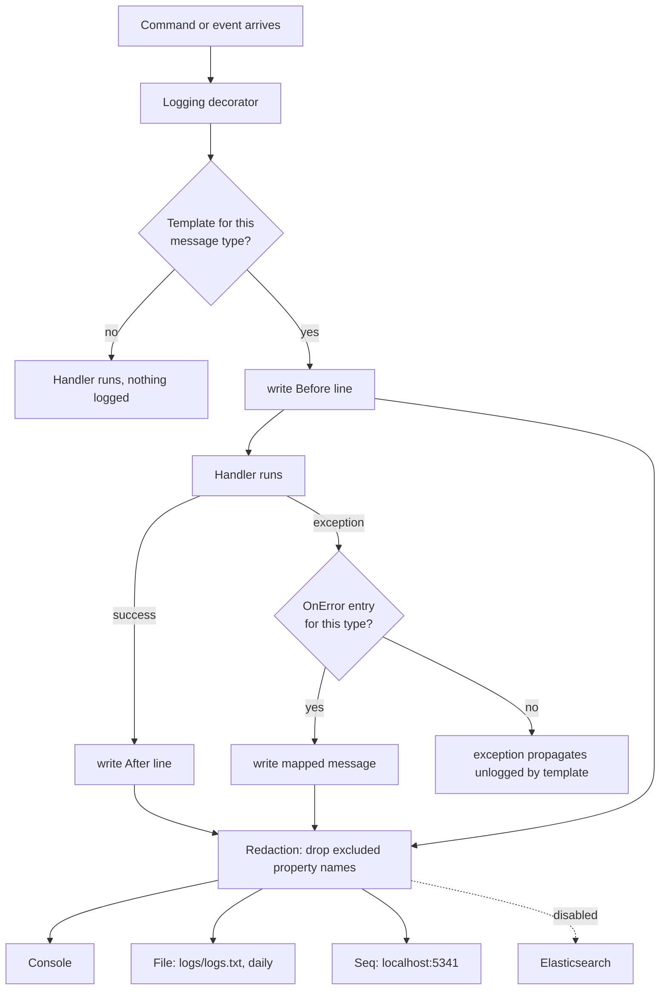

# Pattern: Structured Logging With Property Redaction

## Status

**Candidate.** No approval metadata, ADR, or documented human sign-off exists in the workspace, and
the CAKE catalog for tenant `Q5SCXYFS` holds no governing decision.

## Category

observability

## Problem

Logging inside handlers produces two problems at once. Each author writes their own message in their own
style, so nothing can be searched consistently; and sooner or later somebody logs a whole command object
that happens to contain a password, an email address, or a connection string, and it lands in the log
store forever.

Both problems come from the same place: the decision about what to log is made in a hundred scattered
call sites instead of one.

## Context

Applies wherever handlers process commands and events and the log output is expected to be searchable
and safe. Pacco declares a log template per message type in a single map per service, applies it through
a decorator rather than through in-handler calls, and names the properties that must never be written —
in one list, identical across all eleven deployables.

## When to Use

- Handlers are uniform enough that "before, after, on error" covers what needs recording.
- Log output feeds a structured store where properties are queryable, not just readable.
- The set of sensitive property names is known and stable.
- Consistency across many services matters more than expressiveness in any one handler.

## When Not to Use

- Handlers need to log at points other than entry, exit, and failure. Templates cover the boundaries and
  nothing between them.
- Sensitive data appears in values rather than in named properties. Name-based exclusion cannot see
  inside a free-text field or a generic dictionary.
- One or two services, where a per-message template map costs more than it saves.

## Architecture Summary

Two independent mechanisms that happen to share a configuration block.

**Templates.** Each service defines a `MessageToLogTemplateMapper` — a static dictionary from message
type to a `HandlerLogTemplate` with `Before`, `After`, and an `OnError` map from exception type to
message. `AddHandlersLogging()` registers the mapper as a singleton and asks the toolkit to decorate
every command handler and event handler in the Application assembly. The decorator looks up the
template and writes the structured line; handlers themselves contain no logging code. A message with no
entry in the map produces no log line, because `Map` returns null.

**Redaction and sinks.** A `logger` configuration block per deployable names the minimum level, the HTTP
paths to skip, the property names to exclude from output, and which sinks are on. `UseLogging()` in the
host builder activates it. The excluded-property list is a single flat array of names, applied by the
logging pipeline regardless of which handler produced the property.

## Structure / Flow

## Key Components

| Component | Responsibility |
|-----------|----------------|
| `MessageToLogTemplateMapper` | Maps message type → `HandlerLogTemplate`; returns null when unmapped |
| `HandlerLogTemplate` | `Before`, `After`, and `OnError` (exception type → message) |
| `Logging/Extensions.AddHandlersLogging()` | Registers the mapper and decorates command and event handlers |
| `logger.excludeProperties` | The redaction list — twelve property names |
| `logger.excludePaths` | HTTP paths not logged: `/`, `/ping`, `/metrics` |
| `logger.level` | Minimum level, `information` everywhere |
| Sinks: `console`, `file`, `seq`, `elk` | Where output goes; `elk` is configured and disabled |
| `UseLogging()` | The single activation point, in each host builder |

## Data / Event / API Contracts

- **Redaction list**, identical in all eleven deployables that have one:
  `api_key`, `access_key`, `ApiKey`, `ApiSecret`, `ClientId`, `ClientSecret`, `ConnectionString`,
  `Password`, `Email`, `Login`, `Secret`, `Token`.
- **Excluded paths:** `/`, `/ping`, `/metrics` — the same three excluded from tracing.
- **Sinks:** `console.enabled: true`; `file.enabled: true` at `logs/logs.txt` rolling daily;
  `seq.enabled: true` at `http://localhost:5341` with a committed `apiKey`;
  `elk.enabled: false` at `http://localhost:9200`.
- **`tags: {}`** — an empty map in every service, so no service-level tag is attached to log events.
- **Template properties are named placeholders**, e.g. `"Added a resource with id: {ResourceId}."`,
  `"Reserved a resource with id: {ResourceId} priority: {Priority}, date: {DateTime}."` These become
  structured fields in the sink, which is what makes the output queryable rather than merely readable.
- **Error templates are keyed by exception type**, e.g. `ResourceAlreadyExistsException` →
  `"Resource with id: {ResourceId} already exists."`
- **The gateway's `logger` block is a reduced form:** it has `excludePaths` and the three sinks, but
  **no `level`, no `excludeProperties`, no `elk`, and no `tags`**. The component that handles every
  inbound request, including sign-in, is the one with no redaction list configured.

## Naming Conventions

| Element | Convention | Example |
|---------|-----------|---------|
| Mapper location | `Infrastructure/Logging/MessageToLogTemplateMapper.cs` | — |
| Registration | `AddHandlersLogging()` in `Infrastructure/Logging/Extensions.cs` | — |
| Template placeholders | PascalCase in braces | `{OrderId}`, `{ResourceId}` |
| Template text | Past tense for `After`, present for `Before` | `"Order with id: {OrderId} has been approved."` |
| Log file | `logs/logs.txt`, daily interval | — |
| Excluded property names | Mixed: snake_case *and* PascalCase for the same concept | `api_key` and `ApiKey` both listed |

The excluded-property list carrying both `api_key` and `ApiKey` is a tell: the match is by exact name,
so each casing has to be enumerated. Any variant nobody thought of is not redacted.

## Service / Boundary Guidance

- **Declare templates; do not log in handlers.** No handler in the observed code calls a logger for its
  own message flow. This is what keeps the output uniform and keeps sensitive values out of ad-hoc
  strings.
- **Keep the mapper `internal` and per service.** Message types are the service's own; a shared map
  would couple every service's vocabulary together.
- **Log identifiers, not payloads.** Every observed template interpolates identifiers and small scalars.
  No template writes a whole command object, which is what makes the redaction list a second line of
  defence rather than the first.
- **Exclude the polled paths.** `/`, `/ping`, `/metrics` are hit continuously by Consul and Prometheus
  and would otherwise dominate the log volume.
- **Six of seven layered services adopt the template map; `identity-service` does not** — it references
  `Convey.Logging` but not `Convey.Logging.CQRS`, and has no `Logging/` folder. So the service handling
  credentials is the one whose handlers produce no templated log lines at all.

## Security / Compliance Considerations

- **Redaction is name-based and exact-match.** It catches a property called `Password`; it does not catch
  one called `Pwd`, `NewPassword`, or a password nested inside an object logged under another name.
- **`Email` and `Login` are on the list**, which suggests personal data was consciously considered.
  `UserId` and the claims dictionary are not, and both flow through the correlation context into every
  log event ([[transport-agnostic-caller-context]]).
- **The gateway has no `excludeProperties` list.** It proxies sign-in and sign-up. Whether Ntrada logs
  request bodies by default is not determinable from these repositories, and this is the single most
  important gap in the pattern.
- **The Seq API key is committed** and identical across all eleven deployables. Recorded by path only;
  the value is not reproduced. It grants write access to the log store, and Seq in the compose stack is
  reachable without further authentication.
- **Logs are written to a file inside the container** at `logs/logs.txt` with no volume mount and no
  size cap beyond daily rolling, so they grow until the container is replaced and are then lost.
- **Seq has no persistent volume** in the compose stack — its volume declaration is commented out — so
  the searchable log history does not survive a restart.
- **Error templates interpolate identifiers into messages**, but an exception with no `OnError` entry
  propagates and is logged by whatever generic handler catches it, potentially including its full message
  and stack trace.
- **No retention or deletion policy** is configured for any sink, which matters because the logs contain
  user identifiers.

## Observability Considerations

- **An unmapped message logs nothing.** `Map` returns null for any type absent from the dictionary, and
  the decorator writes no line. Adding a new command without adding a template makes it invisible, and
  nothing warns about the omission.
- **The `OnError` map is per exception type.** An exception type not listed produces no templated error
  line, so failures are logged less consistently than successes.
- **Query handlers are not decorated.** `AddCommandHandlersLogging` and `AddEventHandlersLogging` cover
  commands and events only, so reads produce no log output.
- **`tags: {}` is empty everywhere**, so log events carry no service tag from configuration. Separating
  services in a shared Seq instance relies on whatever the sink adds automatically.
- The correlation id from the propagated context is what ties these lines to a trace, which is the
  reason the output is useful across services at all
  ([[correlation-and-span-propagation]]).
- **Level is `information` in every service**, so debug-level detail is unavailable without a
  configuration change and a restart.

## Failure Handling

- **Unmapped message:** no log line, handler runs normally. Silent.
- **Unmapped exception type:** no templated error line; the exception propagates.
- **Seq unreachable:** the console and file sinks continue. Log delivery to Seq is lossy and unreported.
- **Disk full:** the file sink fails; behaviour beyond that is not determinable from configuration.
- **Excluded property under a different name:** written in full. There is no failure signal — the value
  simply appears in the log.

## Trade-offs

| Gain | Cost |
|------|------|
| Uniform log output across six services with no handler-level logging code | Only three points per message are loggable: before, after, on error |
| One redaction list, applied everywhere, easy to review | Exact-name matching means every casing and synonym must be enumerated |
| Templates make the log vocabulary explicit and reviewable in one file | A new message with no template is silently invisible |
| Structured properties make output queryable, not just readable | Property names become an interface that dashboards depend on |
| Polled paths excluded, so volume stays meaningful | Those paths are also where a failing health check would show |
| Four sinks configurable per environment from one block | Three are on at once in every environment, tripling write cost |

## Variants

- **Templated handler logging** (six layered services) versus **configuration-only logging**
  (`identity-service`, `pricing-service`, `operations-service`, `ordermaker-service`, `api-gateway`) —
  sinks and redaction, no per-message templates.
- **Full `logger` block** (ten deployables) versus the **reduced gateway form** with no `level`, no
  `excludeProperties`, no `elk`, no `tags`.
- **Sink combinations:** console plus file plus Seq enabled, Elasticsearch configured and disabled in
  every service — an option kept warm and never used.

## Anti-patterns

- **A gateway with no redaction list**, sitting in front of the sign-in endpoint.
- **A committed API key for the log store**, shared by eleven deployables.
- **Enumerating both `api_key` and `ApiKey`** to work around exact-name matching, rather than matching
  case-insensitively — the list is only as good as the imagination of whoever wrote it.
- **Log files inside containers with no volume**, so they are unreachable when the container is gone.
- **A log store with persistence commented out.**
- **`tags: {}` in every service** — a configured extension point that nobody filled in, so log events
  carry no service identity from configuration.
- **Adding a message type without a template**, which produces silence rather than a default line.

## Evidence

- **ADR:** none — no ADR exists in any cloned repository or in the CAKE catalog for tenant `Q5SCXYFS`.
- **Repo:** all eleven deployable repositories carry a `logger` block; six carry template mappers.
- **Service:** templates in `availability`, `vehicles`, `deliveries`, `customers`, `orders`, `parcels`.
  Configuration only in `identity`, `pricing`, `operations`, `ordermaker`, `api-gateway`.
- **File:**
  `hianshul100_Pacco.Services.Availability/src/Pacco.Services.Availability.Infrastructure/Logging/MessageToLogTemplateMapper.cs:12-37`
  — the type-to-template dictionary, `AddResource` with an `OnError` entry for
  `ResourceAlreadyExistsException` (`:15-25`), `ReserveResource` with three interpolated properties
  (`:28-29`), a `Before`-only template for the external event `VehicleDeleted` (`:30`), and
  `Map` returning null for unmapped types (`:33-37`);
  `.../Availability.Infrastructure/Logging/Extensions.cs:10-19` — mapper registered as a singleton
  (`:14`), `AddCommandHandlersLogging(assembly)` and `AddEventHandlersLogging(assembly)` (`:17-18`);
  `hianshul100_Pacco.Services.Orders/src/Pacco.Services.Orders.Infrastructure/Logging/MessageToLogTemplateMapper.cs:12-60+`
  — the same shape with templates for `AddParcelToOrder`, `ApproveOrder`, `AssignVehicleToOrder`,
  `CancelOrder`, `CreateOrder`, `DeleteOrder`, `DeleteParcelFromOrder`;
  `AddHandlersLogging()` called at `Availability` Extensions.cs:89, `Vehicles` :71, `Deliveries` :72,
  `Customers` :76, `Orders` :79, `Parcels` :73;
  `Convey.Logging.CQRS` package reference in exactly those six Infrastructure `.csproj` files;
  `UseLogging()` in all eleven host builders, e.g. `Availability.Api/Program.cs:47`,
  `Identity.Api/Program.cs:73`, `Operations.Api/Program.cs:49`;
  `hianshul100_Pacco.Services.Identity` — `Convey.Logging` referenced, **no `Convey.Logging.CQRS`, no
  `Logging/` folder, no template mapper**.
- **API/Event:** none — this pattern has no runtime API or message contract.
- **Deployment/Config:**
  `hianshul100_Pacco.Services.Orders/src/Pacco.Services.Orders.Api/appsettings.json` — `logger` block
  with `level: information`, `excludePaths: ["/", "/ping", "/metrics"]`, the twelve-name
  `excludeProperties` array, `console`/`file`/`seq` enabled, `elk` disabled, `tags: {}`; the identical
  block in nine other services;
  `hianshul100_Pacco.APIGateway/src/Pacco.APIGateway/appsettings.json` — `logger` with `excludePaths`
  and the three sinks only, **no `level`, no `excludeProperties`, no `elk`, no `tags`**;
  `hianshul100_Pacco/compose/grafana-seq-jaeger-prometheus.yml:41-52` — `datalust/seq` with its volume
  declaration commented out.
- **Notes:** `architecture-baseline.md` §9.3, §11.3. **Conflict — none observed** between documentation
  and source for this pattern; the gateway's reduced `logger` block is a difference between components,
  not between a document and the code.

## Related ADRs

None. No ADR, decision record, or RFC exists in the workspace, and the CAKE graph for tenant
`Q5SCXYFS` returned zero nodes.

## Related Patterns

- [[correlation-and-span-propagation]] — supplies the identifier that makes these lines joinable.
- [[transport-agnostic-caller-context]] — the identity and claims that reach log output.
- [[transactional-outbox-handler-decorator]] — the other decorator wrapped around the same handlers.
- [[vault-issued-dynamic-credentials-and-service-pki]] — why `ConnectionString` is on the exclusion list.
- [[framework-supplied-platform-conventions]] — `UseLogging()` as a one-line capability.
- [[edge-enforced-authentication-with-identity-binding]] — the gateway that has no redaction list.

## Recommendation

**Adopt.** Declaring log templates per message type and applying them through a decorator is the right
trade: it removes logging code from handlers, makes the platform's log vocabulary reviewable in one file
per service, and means nobody is tempted to log a whole command object. The templates observed all
interpolate identifiers rather than payloads, which is exactly the discipline the pattern is for. Four
things to fix: add an `excludeProperties` list to the gateway, which sits in front of sign-in and
currently has none; move the Seq API key into Vault; make the redaction match case-insensitively so the
list does not need `api_key` and `ApiKey` as separate entries; and add template maps to
`identity-service`, whose handlers currently log nothing. Consider a build-time check that every message
type has a template, since the failure mode for a missing one is silence.

## Assumptions, Blockers & Open Questions

> [!IMPORTANT]
> This document contains unresolved items that require attention before or during implementation. Review and resolve before merging downstream artifacts. Each item below is tagged **[ACTION NOW]** (a human must decide or confirm it before this work can safely proceed) or **[handled later by <stage>]** (a named later stage owns and will prove it) — read the tags first to see what, if anything, is yours to act on.

### Assumptions

| # | Assumption | Rationale | Impact if Wrong | Validation Path |
|---|------------|-----------|-----------------|-----------------|
| A1 | The `excludeProperties` list is matched by exact property name, not by substring or pattern | The list enumerates both `api_key` and `ApiKey` for the same concept, which is only necessary if matching is exact | A property named `NewPassword` or `UserToken` would be silently written in full while the list gives the impression it is covered | Log a test event with variant property names and inspect what reaches Seq |
| A2 | Log lines written by the templates contain only the interpolated identifiers, not the whole message object | Every template observed across two services interpolates named scalars, and no template references the message itself | Command payloads would reach the log store, and the redaction list would be the only thing standing between a payload and disclosure | Read the remaining four template mappers and check every `Before`, `After`, and `OnError` string |

### Open Questions

| # | Question | Why It Matters | Proposed Answer (if any) | Decision Owner |
|---|----------|----------------|--------------------------|----------------|
| Q1 | **[ACTION NOW]** Does the gateway log request bodies, and should it have an `excludeProperties` list? | Its `logger` block has no redaction list, and it proxies sign-in and sign-up — the two requests that carry passwords | Add the same list the services use, regardless of the answer; it costs nothing and closes the gap | Platform security owner, with the owner of `hianshul100_Pacco.APIGateway` |
| Q2 | **[ACTION NOW]** Should the Seq API key move into Vault? | It is committed identically in eleven deployables and grants write access to the log store | Yes, together with the other committed values; it is part of the same cleanup | Platform security owner |
| Q3 | **[handled later by the design stage]** Should a message type without a log template be a build failure? | A missing template produces silence, not a default line, so a new command can be added and never appear in any log without anyone noticing | Yes — a test that enumerates command and event types in the Application assembly and asserts each has a template entry | Owners of the six services with template maps |
| Q4 | **[handled later by the design stage]** Should `identity-service` have handler log templates? | It is the one layered service without them, and it is the one handling credentials, sign-in attempts, and token revocation — where an audit trail matters most | Yes, with particular care that no template interpolates a credential | Platform security owner, with the owner of `hianshul100_Pacco.Services.Identity` |
| Q5 | **[handled later by the design stage]** What retention applies to logs containing user identifiers? | No sink has a retention setting, Seq has no persistent volume, and log files live inside containers with no mount — so retention is currently "until restart", by accident rather than by choice | Decide a period deliberately and configure it; the current behaviour satisfies neither an audit need nor a data-minimisation one | Platform owner, with the operator |
