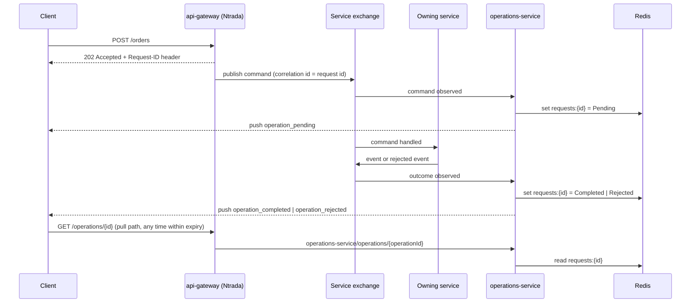

# Pattern: Acknowledge Then Notify Completion

## Status

**Candidate.** No approval metadata, ADR, or documented human sign-off exists in the workspace, and
the CAKE catalog for tenant `Q5SCXYFS` holds no governing decision.

## Category

orchestration

## Problem

When a write is accepted at the edge and handed to a message broker, the caller's HTTP response is
already gone by the time the work actually happens. The caller has been told "accepted" and nothing
more. It has no identifier for what it started, no way to ask whether it succeeded, and no way to be
told when it did. Every asynchronous write turns into a black hole unless something deliberately gives
that work an identity and a visible lifecycle.

## Context

Applies wherever a request is accepted and completed on a different thread, process, or machine than
the one that answered the caller — most sharply where an API gateway publishes straight to a broker
without the owning service being in the request path ([[dual-mode-edge-write]]).

In Pacco a single service, `operations-service`, exists for exactly this purpose. It owns no business
data. It subscribes to every command, event, and rejected event that eight other services declare,
maps each one onto a three-state operation record keyed by the caller's request id, and makes that
record both queryable and pushable.

## When to Use

- Writes are accepted asynchronously and the caller needs more than "accepted".
- A user-facing client must show progress, success, or a specific failure reason.
- The correlation identifier that will key the operation is already generated at the edge and returned
  to the caller. Without that, there is nothing for the caller to ask about.
- The set of messages to observe can be enumerated, or discovered, without changing the observer.

## When Not to Use

- Writes are synchronous and the response already carries the outcome.
- The caller is another service that reacts to events anyway — it should subscribe to the domain event
  it cares about, not poll an operation record.
- Operation history must be durable, auditable, or reportable. This pattern's storage is a cache with
  an expiry, which is the right shape for progress display and the wrong shape for a record of what
  happened.
- No single identifier reliably spans the whole flow. The pattern degrades to silence rather than to
  an error, which is worse than not having it.

## Architecture Summary

A dedicated observer service subscribes to messages across the platform. For each message it reads
the correlation id off the broker message properties, derives an operation state from the message's
kind, and writes a small record — id, user id, name, state, code, reason — into a shared cache under a
namespaced key with a sliding expiry. The same write raises an in-process event that fans the record
out to any live subscriber.

Two read paths exist over that record: a pull path (`GET operations/{operationId}`, exposed through
the gateway) and a push path (real-time delivery to the originating user — see
[[real-time-push-with-shared-backplane]]). Both serve the same record; neither owns it.

## Structure / Flow

The state mapping is by message kind, not by message content:

| Observed message kind | Default state | Handler |
|-----------------------|---------------|---------|
| Command | `Pending` | `GenericCommandHandler<T>` |
| Event | `Completed` | `GenericEventHandler<T>` |
| Rejected event | `Rejected` | `GenericRejectedEventHandler<T>` |

Each default can be overridden by a saga state carried on the message properties
(`messageProperties.GetSagaState()`), which is how a multi-step process can keep an operation
`Pending` across several events instead of completing it on the first one.

## Key Components

| Component | Responsibility |
|-----------|----------------|
| `Handlers/GenericCommandHandler<T>` / `GenericEventHandler<T>` / `GenericRejectedEventHandler<T>` | One open-generic handler per message kind; no per-message code exists anywhere |
| `Services/OperationsService` | The only writer and reader of operation records; raises `OperationUpdated` |
| `DTO/OperationDto` | `Id`, `UserId`, `Name`, `State`, `Code`, `Reason` |
| `Types/OperationState` | `Pending`, `Completed`, `Rejected` — three states, no others |
| `Infrastructure/RequestsOptions` | `ExpirySeconds`, bound from the `requests` configuration section |
| `Queries/GetOperation` + the endpoint in `Program.cs` | The pull path |
| `Services/HubService` | The push path's message shapes |
| `Infrastructure/GrpcServiceHost` | A second push path for non-browser consumers |

## Data / Event / API Contracts

- **Cache record:** JSON-serialised `OperationDto` at key `requests:{correlationId}`, written through
  `IDistributedCache` backed by Redis whose `instance` prefix is `operations:` — so the effective key
  is `operations:requests:{id}`. Sliding expiry of `requests.expirySeconds`, configured at **300**.
- **Pull contract:** `GET operations/{operationId}` returns the `OperationDto` as JSON, or `404` when
  the key is absent or expired. Exposed publicly at `GET /operations/{operationId}` with `auth: true`.
- **Push contract:** three messages — `operation_pending` and `operation_completed` carry `{id, name}`;
  `operation_rejected` carries `{id, name, code, reason}`.
- **gRPC contract:** `Operations.proto` declares `GetOperation(GetOperationRequest)` and a server
  stream `SubscribeOperations(Empty)`, both returning `GetOperationResponse{id, userId, name, state,
  code, reason}` with `state` lower-cased to a string.
- **The join key** is the correlation id the gateway generates (`generateRequestId: true`) and returns
  to the client via the CORS-exposed `Request-ID` header.
- The `code` and `reason` on a rejection are taken straight from the rejected event's own fields — see
  [[rejected-event-failure-contract]].

## Naming Conventions

| Element | Convention | Example |
|---------|-----------|---------|
| Cache key | `requests:{correlationId}`, under the service's Redis `instance` prefix | `operations:requests:8f3c…` |
| Push message | snake_case, `operation_<state>` | `operation_rejected` |
| Handler | `Generic<MessageKind>Handler<T>` | `GenericRejectedEventHandler<T>` |
| Operation name | The correlation context's `Name` when present, otherwise the CLR type name of the message | `CreateOrder` |
| Config section | `requests` | `requests.expirySeconds` |

## Service / Boundary Guidance

- The observer is a **separate deployable that owns no business data**. It must stay that way: the
  moment it interprets a message's payload it has taken on someone else's domain.
- It **reads message metadata only** — correlation id, saga state, message kind, and for rejections
  the two interface-declared fields. It never opens a payload. That is what lets one open-generic
  handler serve roughly eighty message types ([[declarative-message-manifest-subscription]]).
- Owning services must not know the observer exists, and in Pacco they do not.
- The record is a **progress projection, not a source of truth**. The order's real state lives in
  `orders-service`. Anything that needs the truth must ask the owner.
- Do not let clients poll the pull path in a loop as a substitute for the push path; the record is in
  a shared cache and a polling client multiplies load on it.

## Security / Compliance Considerations

- The pull endpoint is exposed at the gateway with `auth: true`, so a token is required — but the
  handler in `Program.cs` looks up the operation by id alone and **does not compare
  `operation.UserId` to the caller's identity**. Any authenticated user who knows or guesses a
  correlation id can read another user's operation record, including the failure `reason`. Correlation
  ids are GUIDs, so this is not trivially enumerable, but it is not an authorization check either.
- The push path *does* filter by user: `HubWrapper.PublishToUserAsync` targets the group
  `users:{userId}`, so a client only receives its own operations. The two read paths therefore apply
  different rules to the same record.
- `operation.UserId` is written as `context?.User?.Id` and falls back to `string.Empty`. Messages
  published without a user context — including everything the saga publishes — produce records owned
  by nobody, which are consequently never pushed to anyone.
- The `SubscribeOperations` gRPC stream carries **every** operation for **every** user, with no
  identity filter and no auth declared on the gRPC endpoint. See [[real-time-push-with-shared-backplane]].
- The `reason` field is free text propagated from an exception message; it reaches an end user
  unmodified. Nothing constrains what a service can put there.

## Observability Considerations

- The correlation id in the operation record is the same id used for tracing, so an operation is
  directly joinable to a Jaeger trace and to log lines ([[correlation-and-span-propagation]]).
- **The most common failure of this pattern is silence.** All three handlers begin
  `if (string.IsNullOrWhiteSpace(correlationId)) { return; }`. A message published without a
  correlation id produces no record, no push, and no log line — the operation simply never appears.
- `TrySetAsync` returns `false` and the handler returns early when the operation has already reached
  `Completed` or `Rejected`. This is deliberate — it stops a late event from resurrecting a finished
  operation — but it is also unlogged, so a genuine out-of-order delivery is indistinguishable from
  normal behaviour.
- No metric exists for operations created, completed, rejected, or dropped for a missing correlation
  id.

## Failure Handling

- **A terminal state is sticky.** Once `Completed` or `Rejected`, further messages on the same
  correlation id are ignored. First terminal outcome wins.
- **An operation that never terminates is indistinguishable from one that expired.** The sliding
  expiry means an untouched record disappears after 300 seconds and the pull path answers `404`. A
  client cannot tell "never existed", "still running but idle", and "finished and expired" apart.
- **A lost cache is a lost operation.** Redis has no configured persistence or replica in this
  workspace; a restart erases every in-flight operation with no recovery path and no notification to
  connected clients.
- **A push is fire-and-forget.** If the client is not connected at the moment of the push, the message
  is gone; the client must fall back to the pull path, and only within the expiry window.
- An unexpected state throws `ArgumentException` inside the message handler; what the broker does with
  that exception is Convey's default behaviour and is not configured anywhere in the repository.

## Trade-offs

| Gain | Cost |
|------|------|
| The caller gets an identity and a lifecycle for asynchronous work | An extra deployable, plus a shared cache, on the critical path of user-visible feedback |
| One open-generic handler covers every message on the platform | The observer knows nothing about what any message means; `Name` is a CLR type name, not a human sentence |
| Owning services need no changes and stay unaware | Correctness depends entirely on discipline the owning services do not know they are keeping — chiefly always publishing with a correlation id |
| A cache with expiry keeps the store small and self-cleaning | There is no operation history; anything older than the expiry never happened |
| Three states are easy to reason about and easy to render | A process with real intermediate steps flattens to `Pending` unless a saga state is supplied |

## Variants

- **Pull only.** A status endpoint with no push. Simplest; costs the client a polling loop.
- **Push only.** Real-time delivery with no queryable record. Fast, but a client that reconnects has
  no way to recover what it missed.
- **Both over one record**, as here — the push is an optimisation and the pull is the fallback.
- **Saga-aware state.** Allowing the publisher to override the derived state, which is what
  `GetSagaState()` enables and what keeps a multi-step process from completing on its first event.
- **Durable operation log.** The same shape backed by a database rather than a cache, when history
  matters. Not observed in this workspace.

## Anti-patterns

- **Dropping work silently when metadata is missing.** Three separate early returns produce no record
  and no log line.
- **Two read paths with two different authorization rules over one record.** The push path filters by
  user; the pull path does not.
- **A cache used as a system of record.** Fine for progress display; the absence of any durable
  operation history should be a conscious choice rather than a consequence.
- **A user id that silently becomes empty string.** It turns "unknown owner" into a real group name
  nobody subscribes to, so the record exists but can never be delivered.
- **Registering infrastructure the service does not use.** `AddMongo()` is called and a
  `mongo.database` of `operations-service` is configured, but no repository or collection is
  registered — the service stores nothing in MongoDB. `AddRedis()` is called twice in the same builder
  chain.

## Evidence

- **ADR:** none — no ADR exists in any cloned repository or in the CAKE catalog for tenant
  `Q5SCXYFS`.
- **Repo:** `hianshul100_Pacco.Services.Operations`; `hianshul100_Pacco.APIGateway`.
- **Service:** `operations-service` (port 5005); `api-gateway` (5000); all eight message-publishing
  services as observed sources.
- **File:**
  `src/Pacco.Services.Operations.Api/Services/OperationsService.cs` — `GetKey` at :62,
  terminal-state guard at :39-42, sliding expiry at :50-55, `OperationUpdated` at :57;
  `Handlers/GenericCommandHandler.cs:32-35` (correlation-id early return), `:40` (`Pending` default);
  `Handlers/GenericEventHandler.cs:40` (`Completed` default);
  `Handlers/GenericRejectedEventHandler.cs:40-42` (`Rejected` default, `Code`/`Reason` passthrough);
  `Program.cs:32-43` (pull endpoint, no owner check);
  `Infrastructure/Extensions.cs:53-58` (open-generic handler registration), `:71-75`
  (`AddMongo()`, duplicated `AddRedis()`);
  `Services/HubService.cs:15-45` (three push message shapes);
  `DTO/OperationDto.cs`; `Types/OperationState.cs`; `Infrastructure/RequestsOptions.cs`;
  `Operations.proto:5-8`; `wwwroot/ui/js/app.js:34-44` (the only observed consumer).
- **API/Event:** `src/Pacco.Services.Operations.Api/appsettings.json:149-151`
  (`requests.expirySeconds: 300`), `:145-148` (`redis.instance: "operations:"`);
  `hianshul100_Pacco.APIGateway/src/Pacco.APIGateway/ntrada.yml:16` (`generateRequestId: true`),
  `:36-40` (`exposedHeaders` including `Request-ID`), `:277-289` (the `operations` module and its
  single route).
- **Deployment/Config:** `hianshul100_Pacco/compose/services.yml` maps `operations-service` to
  `5005:80`; `redis` is a single container in `mongo-rabbit-redis.yml` with no persistence volume or
  replica declared.
- **Notes:** `architecture-baseline.md` §4.4, §5.4, §6.4.

## Related ADRs

None. No ADR, decision record, or RFC exists in the workspace, and the CAKE graph for tenant
`Q5SCXYFS` returned zero nodes.

## Related Patterns

- [[dual-mode-edge-write]] — the accept-and-publish step this pattern exists to compensate for.
- [[real-time-push-with-shared-backplane]] — the push half of the read path.
- [[declarative-message-manifest-subscription]] — how one service subscribes to eighty messages.
- [[rejected-event-failure-contract]] — where `code` and `reason` come from.
- [[correlation-and-span-propagation]] — the identifier everything here is keyed on.
- [[prefix-partitioned-shared-cache]] — the store the record lives in.
- [[saga-process-manager]] — the process whose intermediate states the saga-state override exists for.

## Recommendation

**Adopt.** For any platform that accepts writes asynchronously, giving the work an identity and a
visible lifecycle is not optional, and doing it in a payload-blind observer service is a genuinely
good separation — owning services stay unaware, and one set of generic handlers covers the whole
platform. Three things should be fixed rather than inherited: the pull endpoint should check that the
caller owns the operation, missing correlation ids should be logged instead of silently dropped, and
the choice of a 300-second cache with no persistence should be made deliberately rather than by
default. Treat the record as progress display only; it is not an audit trail and should never be cited
as one.

## Assumptions, Blockers & Open Questions

> [!IMPORTANT]
> This document contains unresolved items that require attention before or during implementation. Review and resolve before merging downstream artifacts. Each item below is tagged **[ACTION NOW]** (a human must decide or confirm it before this work can safely proceed) or **[handled later by <stage>]** (a named later stage owns and will prove it) — read the tags first to see what, if anything, is yours to act on.

### Assumptions

| # | Assumption | Rationale | Impact if Wrong | Validation Path |
|---|------------|-----------|-----------------|-----------------|
| A1 | The correlation id a client receives in the `Request-ID` response header is the same id the operation record is keyed on | The gateway sets `generateRequestId: true` and exposes `Request-ID` through CORS; the observer keys on the broker message's correlation id. The two are joined inside Ntrada, whose source is not in this workspace | Clients would have no usable operation id at all, and both the pull endpoint and the push messages would be unreachable in practice — the pattern would be decorative | Send a request through the gateway, capture the `Request-ID` header, then call `GET /operations/{that id}` and confirm a record comes back |
| A2 | A sliding 300-second expiry is long enough for every operation the platform starts | It is the configured value and no operation is known to run longer, but no timing data exists | Long-running operations would expire while still in flight, so a client polling the pull path would get `404` for work that is still running and would reasonably conclude it failed | Measure the wall-clock duration of the longest real flow — the seven-step order-making process — against the expiry |

### Blockers

| # | Blocker | Blocks | Owner | Resolution Path | Target Date |
|---|---------|--------|-------|-----------------|-------------|
| B1 | **[ACTION NOW]** The status endpoint returns any operation to any authenticated caller who supplies its id — it never checks that the caller owns it. The record carries a failure `reason` copied from an exception | Treating the pull path as safe to expose publicly; any use of this pattern where operation names or failure reasons are sensitive | Owner of `hianshul100_Pacco.Services.Operations`, with the platform security owner | Compare `operation.UserId` to the authenticated caller's id in the endpoint in `Program.cs:32-43` and return `404` on mismatch, matching the filtering the push path already applies | TBD |

### Open Questions

| # | Question | Why It Matters | Proposed Answer (if any) | Decision Owner |
|---|----------|----------------|--------------------------|----------------|
| Q1 | **[ACTION NOW]** Should a message arriving without a correlation id be dropped silently, or logged as a defect? | It is the pattern's single largest blind spot: the operation never appears, the client waits forever, and nothing anywhere records that it happened | Log at warning with the message type, and keep dropping. Failing the message would put a metadata problem into a business message's retry path | Owner of `hianshul100_Pacco.Services.Operations` |
| Q2 | **[handled later by the design stage]** Does the platform need durable operation history, or is a 300-second progress cache the intended scope? | Determines whether the storage choice stays a cache or becomes a database, and whether operations can ever be reported on or audited | Cache-only appears intended — the service registers no repository and stores nothing in MongoDB despite configuring a database. Worth confirming rather than assuming | Product owner for the Pacco platform, with the platform architect |
| Q3 | **[ACTION NOW]** Is `operations-service` configured with MongoDB and a `operations-service` database deliberately, or is that leftover boilerplate? | It reserves a database, adds a Vault dynamic-credential lease, and adds startup dependencies for a store the service never writes to | Most likely copied from the standard service template. If so, removing it drops a real dependency and a real credential lease | Owner of `hianshul100_Pacco.Services.Operations` |
