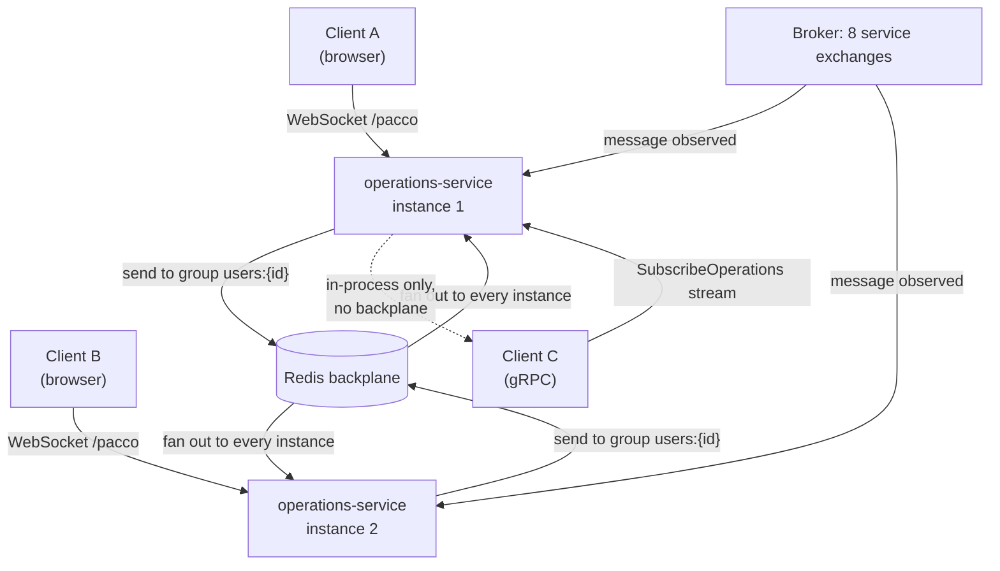
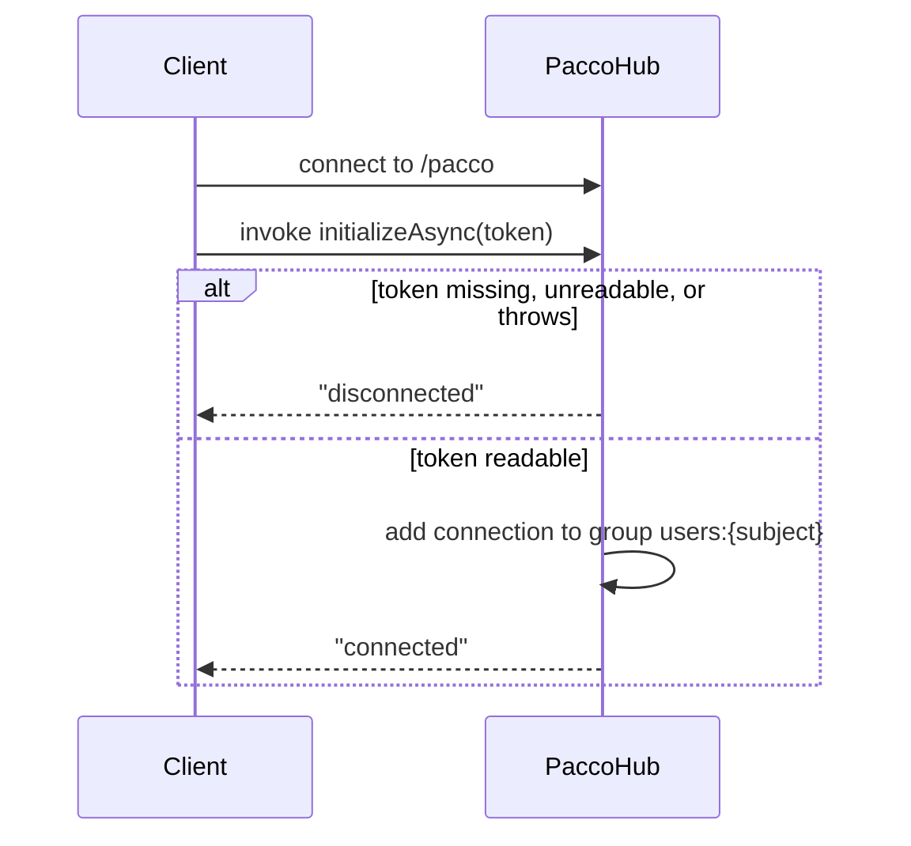

# Pattern: Real-Time Push With a Shared Backplane

## Status

**Candidate.** No approval metadata, ADR, or documented human sign-off exists in the workspace, and
the CAKE catalog for tenant `Q5SCXYFS` holds no governing decision.

## Category

orchestration

## Problem

A connected client holds a socket to exactly one instance of a service. The event it is waiting for
arrives at a different instance — whichever one the broker happened to deliver the message to. Without
something that spans instances, the notification is produced on a machine that has no way to reach the
client, and the client waits for a message that was already delivered to nobody.

## Context

Applies to any push channel in a horizontally scaled service, and specifically to the delivery half of
[[acknowledge-then-notify-completion]]. Pacco has one such channel: `operations-service` hosts a
SignalR hub at `/pacco`, addresses clients by user group, and is configured to route hub messages
through Redis so that any instance can reach any connected client.

## When to Use

- Clients need to be told about something rather than asked for it, and the delay of polling is a real
  cost.
- The service hosting the channel runs, or may run, as more than one instance.
- The recipient can be identified from an authenticated token, so messages can be addressed rather
  than broadcast.
- A pull fallback already exists for clients that were not connected.

## When Not to Use

- The push is the only way to learn the outcome. A dropped socket then loses information permanently.
- Recipients cannot be identified, so every message would go to everyone.
- The channel would carry business data rather than notifications. A push channel is a delivery
  mechanism, not an API.
- The backplane cannot be made available. Configuring it and then losing it fails quietly — messages
  reach some clients and not others, which is harder to diagnose than a channel that is simply down.

## Architecture Summary

A hub endpoint is mapped on the notifying service. Clients connect, then authenticate over the
connection itself by invoking a hub method with a token; on success the connection is added to a group
derived from the token subject, and the client is told it is connected. All outbound messages are sent
to that group name, never to a connection id. The hub is configured with a shared backplane, so a
message published by any instance reaches the client's connection wherever it is held.

Publication is layered: business code calls a small service that knows the three message shapes, which
calls a thin wrapper that is the only code aware of the hub context. Nothing above the wrapper depends
on SignalR.

## Structure / Flow

Connection handshake, as implemented:

## Key Components

| Component | Responsibility |
|-----------|----------------|
| `Hubs/PaccoHub` | The only hub; exposes one client-callable method, `InitializeAsync(token)` |
| `IJwtHandler` (Convey) | Reads the token payload inside the hub; the hub does no validation of its own beyond this |
| `Extensions.ToUserGroup()` | The single place the group name is formed — `users:{userId}`, with the `Guid` overload using `ToString("N")` |
| `Services/IHubWrapper` → `HubWrapper` | The only type that touches `IHubContext<PaccoHub>`; offers send-to-group and send-to-all |
| `Services/IHubService` → `HubService` | Declares the three notification shapes; the only caller of the wrapper |
| `AddSignalR()` in `Infrastructure/Extensions.cs` | Registers the hub and attaches the backplane when `signalR.backplane` is `redis` |
| `Infrastructure/GrpcServiceHost` | A second, parallel push channel for non-browser clients |

## Data / Event / API Contracts

- **Endpoint:** `/pacco`, mapped in `Program.cs` alongside the gRPC service.
- **Client → server:** `initializeAsync(token)` — one method, one argument.
- **Server → client:** `connected` and `disconnected` (no payload); `operation_pending` and
  `operation_completed` carrying `{id, name}`; `operation_rejected` carrying
  `{id, name, code, reason}`.
- **Addressing:** group `users:{userId}`, where `userId` is the token's subject claim.
- **Backplane:** configured by `signalR.backplane`; the string `redis` (case-insensitive) is the only
  value that attaches one, and the Redis connection string is reused from the `redis` section.
- **Parallel gRPC contract:** `SubscribeOperations(Empty)` returns a server stream of
  `GetOperationResponse`; see the boundary caveats below.

## Naming Conventions

| Element | Convention | Example |
|---------|-----------|---------|
| Hub route | Platform short name, lower case | `/pacco` |
| Group | `users:{userId}` | `users:8f3ca0…` |
| Server → client message | snake_case | `operation_completed` |
| Client → server method | camelCase as invoked from JavaScript | `initializeAsync` |
| Config section | `signalR` with a `backplane` key | `signalR.backplane: redis` |

## Service / Boundary Guidance

- **One hub per platform, hosted by the service that already observes the events.** Pacco has exactly
  one; adding a second hub in another service would give clients two sockets to manage and two
  authentication handshakes.
- **Keep SignalR behind a wrapper.** Only `HubWrapper` references `IHubContext`. Everything above it
  is testable without a hub, and the transport could be replaced without touching business code. This
  is worth copying.
- **Address by group, never by connection id.** Connection ids are per-instance and do not survive a
  reconnect; group names derived from user identity do.
- **The push channel is not an API.** It carries an operation id and a name, and the client fetches
  anything more from the owning service. Do not grow payloads on it.
- The publishing service must not assume anyone is listening. Every send is fire-and-forget.

## Security / Compliance Considerations

- **Authentication happens inside the hub, not at the connection.** The hub has no `[Authorize]`
  attribute and the endpoint is not declared with auth; anyone may open the socket, and only the
  subsequent `InitializeAsync` call determines whether they join a group. An un-initialised connection
  sits open in no group, receiving nothing. This is a deliberate-looking design, but it means
  connection count is not gated by authentication.
- **The hub reads the token but the validation depth is not visible here.** `_jwtHandler.GetTokenPayload(token)`
  is Convey's, and the service's `jwt` configuration includes `validateLifetime: true` with
  `validateAudience` and `validateIssuer` both `false`. A failure to parse is caught by a bare `catch`
  that sends `disconnected` and logs nothing.
- **A missing token falls through.** `InitializeAsync` calls `DisconnectAsync()` when the token is
  blank but does not `return`, so execution continues into the `try` and `GetTokenPayload` runs on the
  empty string. The client receives `disconnected` and then, on the exception path, `disconnected`
  again. No group is joined either way, so this is not an authorization hole — but the control flow
  does not say what it means.
- **The group name is the user id, and any authenticated party could name it.** Nothing outside
  `HubWrapper` sends to groups, so this is not currently reachable — but the group namespace is
  guessable by construction.
- **The gRPC channel is unfiltered.** `SubscribeOperations` streams every operation for every user,
  with no identity check and no auth declared. It is not routed through the gateway, but it is served
  on the same host and port as the service's other endpoints. Treat it as an internal, trusted-network
  surface only, and confirm it is not reachable from outside.
- The service's `jwt.issuerSigningKey` is a literal value committed in `appsettings.json`. Recorded
  here by path only, not reproduced; see [[edge-enforced-authentication-with-identity-binding]].

## Observability Considerations

- **Failures on this path are silent by construction.** A send to a group with no members succeeds and
  delivers nothing. A rejected handshake logs nothing. Neither produces a metric.
- No counter exists for connected clients, active groups, messages pushed, or handshake rejections —
  so there is no way to notice that pushes have stopped working.
- Hub sends happen outside the message-handling trace: `HubService` is called from a message handler
  but the push itself carries no correlation id, so a Jaeger trace stops at the handler
  ([[correlation-and-span-propagation]]).
- The operation id inside every pushed payload is the correlation id, so a client-side log line can
  still be joined back to a server trace by hand.

## Failure Handling

- **A push to a disconnected client is lost.** There is no queue, no replay, and no acknowledgement.
  Recovery depends entirely on the pull path in [[acknowledge-then-notify-completion]] and only within
  its expiry window.
- **Reconnection loses group membership.** SignalR reconnects do not replay hub method invocations, so
  a client must call `initializeAsync` again after any reconnect. The observed test-harness client does
  **not** do this — it only invokes on the initial `connection.start()` — so a reconnected harness sits
  in no group and receives nothing while appearing connected.
- **Backplane loss partitions delivery.** If Redis is unavailable, messages published on an instance
  reach only the clients connected to that instance. With one instance running this is invisible;
  under any scale-out it is a silent partial outage.
- **A misconfigured backplane value degrades quietly.** `AddSignalR()` compares `options.Backplane` to
  the literal `redis` and, on anything else, returns with SignalR registered but no backplane attached.
  A typo produces a working single-instance channel and a broken multi-instance one.
- The gRPC stream is a `while (true)` over a blocking `BlockingCollection.Take()`, with no cancellation
  on `context` and no exit path — see the anti-patterns below.

## Trade-offs

| Gain | Cost |
|------|------|
| Clients learn outcomes immediately instead of polling | An always-on connection per client, and a hub that must be reachable and scaled |
| A shared backplane lets any instance reach any client | A new runtime dependency whose failure is silent and partial rather than loud |
| Group addressing survives reconnects and instance moves | Group membership does not — the client must re-authenticate on every reconnect, and nothing reminds it to |
| SignalR is confined behind one wrapper type | An extra layer of indirection for a two-method surface |
| Authenticating inside the hub keeps the transport simple | The socket is open to unauthenticated parties, and connection count is ungated |
| A second gRPC channel serves non-browser consumers | It duplicates the delivery concern with different, weaker rules and no backplane |

## Variants

- **Backplane-optional configuration**, as here: a single configuration key decides whether the channel
  can span instances. Convenient for local development, and a silent hazard in production if the value
  is wrong.
- **Authenticate-in-band** (a hub method takes the token) versus authenticate-at-connect (the token
  travels on the connection and the endpoint carries an authorization policy). Pacco uses the former.
- **Group-addressed** versus broadcast. `HubWrapper` offers both; only the group path is used.
- **A parallel stream for non-browser clients**, as the gRPC surface does. Reasonable in principle;
  here it does not reuse the hub's addressing or its backplane, so the two channels behave differently.

## Anti-patterns

- **A per-call subscription to a singleton's event that is never removed.** `GrpcServiceHost`
  subscribes to `IOperationsService.OperationUpdated` in its constructor and never unsubscribes. Since
  the operations service is a singleton and gRPC service instances are not, every call adds another
  handler and another `BlockingCollection` that is never released.
- **Competing consumers on a broadcast channel.** `SubscribeOperations` calls `_operations.Take()`,
  which removes the item. Two concurrent subscribers therefore split the stream between them rather
  than each receiving every operation.
- **An unbounded loop with no cancellation.** `while (true)` with a blocking `Take()` occupies a thread
  and does not observe `ServerCallContext.CancellationToken`, so it does not stop when the caller
  disconnects.
- **A guard that does not return.** The blank-token branch of `InitializeAsync` falls through into the
  code it was meant to prevent.
- **A bare `catch` with no logging.** Every handshake failure is indistinguishable from every other.
- **A client that authenticates only once.** The bundled harness never re-invokes `initializeAsync`
  after a reconnect, which is exactly the mistake this pattern most often produces in real clients.

## Evidence

- **ADR:** none — no ADR exists in any cloned repository or in the CAKE catalog for tenant
  `Q5SCXYFS`.
- **Repo:** `hianshul100_Pacco.Services.Operations`.
- **Service:** `operations-service` (port 5005). No other service hosts a hub; `SignalR` appears in no
  other repository in the workspace.
- **File:**
  `src/Pacco.Services.Operations.Api/Hubs/PaccoHub.cs` — blank-token fall-through at :20-23, payload
  read at :26, group join at :34-35, bare `catch` at :38-41;
  `Services/HubWrapper.cs:17-21` (the only `IHubContext` reference);
  `Services/HubService.cs:15-45` (the three message shapes);
  `Infrastructure/Extensions.cs:32-33` (`ToUserGroup`), `:95-109` (`AddSignalR` and the literal
  `redis` comparison at :100);
  `Program.cs:44-48` (`MapHub<PaccoHub>("/pacco")` and `MapGrpcService<GrpcServiceHost>()`);
  `Infrastructure/GrpcServiceHost.cs:15` (`BlockingCollection`), `:21` (unremoved event subscription),
  `:36-41` (`while (true)` over `Take()`);
  `wwwroot/ui/js/app.js:6-9` (hub URL), `:19-24` (single `initializeAsync` invocation), `:26-44`
  (the five client-side message handlers).
- **API/Event:** `Operations.proto:5-8`;
  `src/Pacco.Services.Operations.Api/appsettings.json:152-154` (`signalR.backplane: redis`),
  `:145-148` (`redis` connection reused as the backplane), `:32-43` (`jwt` block).
- **Deployment/Config:** `hianshul100_Pacco/compose/services.yml` runs a single
  `operations-service` container (`5005:80`); `mongo-rabbit-redis.yml` runs a single `redis`
  container with no persistence volume or replica. No `ntrada*.yml` declares a route to `/pacco` or
  to the gRPC endpoint, so both are reachable only on the service host and port directly.
- **Notes:** `architecture-baseline.md` §4.4, §7.

## Related ADRs

None. No ADR, decision record, or RFC exists in the workspace, and the CAKE graph for tenant
`Q5SCXYFS` returned zero nodes.

## Related Patterns

- [[acknowledge-then-notify-completion]] — what is pushed, and the pull path that recovers a missed
  push.
- [[prefix-partitioned-shared-cache]] — the Redis instance doing double duty as the backplane.
- [[edge-enforced-authentication-with-identity-binding]] — where the token comes from, and how it is
  handled everywhere else on the platform.
- [[correlation-and-span-propagation]] — the identifier inside every pushed payload, and where the
  trace stops.
- [[registry-mediated-discovery-and-routing]] — why a socket endpoint sits outside the usual routing.

## Recommendation

**Adopt the SignalR half; do not inherit the gRPC half as written.** The hub design is sound in the
places that matter: one hub, group addressing by user identity, a single wrapper type isolating
SignalR from everything else, and a backplane so instances are interchangeable. Four fixes should
happen before this is reused — make the blank-token guard return, log handshake failures, fail startup
when the backplane is configured to an unrecognised value rather than silently running without one,
and require clients to re-authenticate after reconnect (and provide a client that does). The gRPC
stream needs rework regardless of reuse: it leaks a subscription per call, splits its stream between
concurrent subscribers instead of broadcasting, never terminates, and applies no identity filter to a
feed of every user's operations.

## Assumptions, Blockers & Open Questions

> [!IMPORTANT]
> This document contains unresolved items that require attention before or during implementation. Review and resolve before merging downstream artifacts. Each item below is tagged **[ACTION NOW]** (a human must decide or confirm it before this work can safely proceed) or **[handled later by <stage>]** (a named later stage owns and will prove it) — read the tags first to see what, if anything, is yours to act on.

### Assumptions

| # | Assumption | Rationale | Impact if Wrong | Validation Path |
|---|------------|-----------|-----------------|-----------------|
| A1 | The backplane exists because more than one instance of the notifying service is expected to run | It is the reason a backplane is normally added, and the code reads that way. But every deployment file in the workspace runs exactly one instance | The backplane would be unnecessary complexity and an unnecessary runtime dependency, and its silent-failure modes would be risk taken on for nothing | Ask the platform owner whether `operations-service` is ever scaled out, and check any deployment outside this workspace for a replica count above one |
| A2 | Group membership is lost on reconnect, so a client must call `initializeAsync` again | This follows from how hub groups and reconnects work, and the bundled harness does not do it — but no reconnect has been observed here | If membership survived reconnects, the harness would be correct and this would be a non-issue; if it does not, every client written by copying the harness silently stops receiving after its first drop | Connect the harness, kill and restart the service, and check whether an operation notification still arrives without re-invoking `initializeAsync` |

### Blockers

| # | Blocker | Blocks | Owner | Resolution Path | Target Date |
|---|---------|--------|-------|-----------------|-------------|
| B1 | **[ACTION NOW]** The gRPC `SubscribeOperations` stream sends every user's operations — including failure reasons — to any caller that can reach the port, with no identity check and no authorization | Any deployment where the service's port is reachable beyond a trusted network; reuse of the gRPC channel in general | Owner of `hianshul100_Pacco.Services.Operations`, with the platform security owner | Confirm the port is not exposed outside the internal network, then either add an identity filter and authorization to the stream or remove the endpoint if it has no consumer | TBD |

### Open Questions

| # | Question | Why It Matters | Proposed Answer (if any) | Decision Owner |
|---|----------|----------------|--------------------------|----------------|
| Q1 | **[ACTION NOW]** Is the gRPC streaming endpoint actually used by anything? | It has real defects — a leaked subscription per call, a stream split between concurrent subscribers, no termination — and the cheapest fix for an unused endpoint is deletion | The only gRPC client in the workspace is `Pacco.Services.Operations.GrpcClient`, a sample console project, which suggests it is a demonstration rather than a dependency | Owner of `hianshul100_Pacco.Services.Operations` |
| Q2 | **[ACTION NOW]** Should the hub endpoint require authentication to connect, or is authenticating inside the hub the intended design? | It decides whether unauthenticated parties can hold open sockets against the service, which is a resource question as much as a security one | Authenticating in-band looks intentional — it keeps the browser client simple, since browsers cannot set headers on a WebSocket handshake. Worth confirming and writing down rather than leaving as an accident | Platform security owner, with the owner of `operations-service` |
| Q3 | **[handled later by the design stage]** Should a wrong `signalR.backplane` value fail startup instead of silently running without a backplane? | The current behaviour turns a typo into a partial outage that only appears under scale-out and produces no error anywhere | Fail fast on an unrecognised value; accept an explicit `none` for local development | Owner of `hianshul100_Pacco.Services.Operations` |
