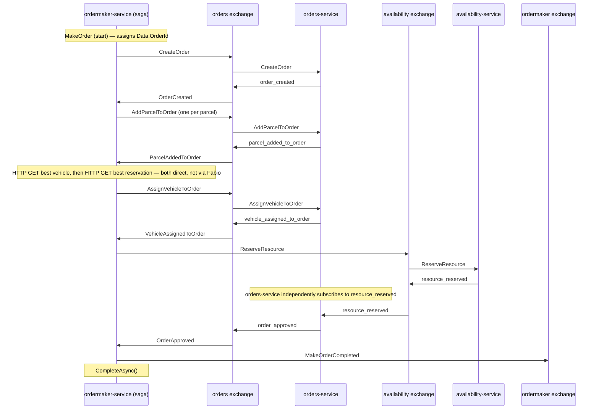

# Pattern: Saga Process Manager for Multi-Service Workflows

## Status

**Candidate.** No approval metadata, ADR, or documented human sign-off exists in the workspace; the
CAKE catalog for tenant `Q5SCXYFS` holds no governing decision. This pattern additionally carries a
live blocker: it is not established that the one service implementing it runs in any environment.

## Category

orchestration

## Problem

A business process that spans four service boundaries — create an order, attach its parcels, choose a
vehicle, reserve a scarce delivery resource — has no owner in a purely choreographed system. No single
service knows the process reached step three, nobody can say whether it is stuck, and there is no place
to put compensation when step four fails after step two succeeded.

## Context

Applies to the small number of processes that are genuinely multi-step, ordered, and long-running, in a
platform whose default is choreography ([[service-owned-topic-exchange-messaging]]). Pacco has exactly
one: `ordermaker-service` runs `AIOrderMakingSaga` using the `Chronicle_` 3.2.1 library, and owns no
aggregate and no domain of its own.

## When to Use

- The process has an identifiable start, an ordered sequence, and a definite completion.
- Several services must act in order, and a later step depends on an earlier step's outcome.
- Someone needs to be able to answer "where is this process right now?".
- Partial completion is a real state that requires compensation, not just a retry.

## When Not to Use

- The collaboration is a single fan-out of one fact to several listeners — choreography is simpler and
  has no coordinator to keep alive.
- The steps are independent and unordered.
- The coordinator would end up holding business rules that belong in an aggregate. A process manager
  sequences; it should not decide.
- Saga state cannot be made durable. An in-memory process manager loses in-flight processes on every
  restart, which is worse than not having one.

## Architecture Summary

A dedicated service hosts a saga type declared as `Saga<TData>` with one `ISagaStartAction<TStart>`
and one `ISagaAction<T>` per subsequent trigger. Each action reads the accumulated saga data, does
whatever synchronous lookups it needs, and publishes the next command **onto the owning service's
exchange**. The saga advances only when it observes the event the previous command produced. When the
terminal event arrives the saga publishes its own completion event and calls `CompleteAsync()`.

The coordinator does not call the participating services directly for writes; it publishes commands
they already accept.

## Structure / Flow

The complete observed sequence, with no hops collapsed:

**Step 6 is the hop most easily lost.** The saga does not approve the order and does not call
`orders-service`. Approval is a side effect of `orders-service` independently subscribing to
`availability`'s `resource_reserved`. The saga learns of it only because it also subscribes to
`order_approved`. Two independent services consuming the same event is what closes the loop; there is
no direct edge between coordinator and `orders-service` at that step.

## Key Components

| Component | Responsibility |
|-----------|----------------|
| `Sagas/AIOrderMakingSaga.cs` | `Saga<AIMakingOrderData>` implementing `ISagaStartAction<MakeOrder>` plus `ISagaAction<OrderCreated>`, `<ParcelAddedToOrder>`, `<VehicleAssignedToOrder>`, `<OrderApproved>` |
| `AIMakingOrderData` | Accumulated process state — order id, customer id, parcel ids, vehicle id |
| `AIOrderMakingHandler` | The bridge from broker subscriptions into `ISagaCoordinator.ProcessAsync` |
| `Commands/External/*.cs` | Locally declared copies of the commands the saga publishes onto other services' exchanges |
| `Chronicle_` 3.2.1, registered by a bare `builder.Services.AddChronicle()` | The saga runtime |
| Typed HTTP clients | The two direct reads the saga performs mid-process |

## Data / Event / API Contracts

- **Entry:** `MakeOrder` on the `ordermaker` exchange.
- **Outbound commands:** five onto the `orders` exchange (`CreateOrder`, `AddParcelToOrder`,
  `AssignVehicleToOrder`, plus `CancelOrder` from compensation), and `ReserveResource` onto the
  `availability` exchange.
- **Terminal events:** `make_order_completed` and `make_order_rejected` on the `ordermaker` exchange.
- **Synchronous reads mid-process:** `_vehiclesServiceClient.GetBestAsync()` and
  `_resourceReservationsService.GetBestAsync(Data.VehicleId)`, both direct HTTP with
  `httpClient.type: ""` — see [[narrow-synchronous-point-read]].
- Every publish passes `messageContext: _accessor.CorrelationContext`, so correlation identity travels
  with the emitted commands.

## Naming Conventions

| Element | Convention | Example |
|---------|-----------|---------|
| Saga type | `<Process>Saga` | `AIOrderMakingSaga` |
| Saga data | `<Process>Data` | `AIMakingOrderData` |
| Externally owned command | `Commands/External/<Command>.cs` | `Commands/External/CreateOrder.cs` |
| Terminal events | `<process>_completed` / `<process>_rejected` | `make_order_completed` |
| Coordinator exchange | Process-manager service short name | `ordermaker` |

## Service / Boundary Guidance

- The coordinator is a **separate deployable** owning no aggregate and no database. It sequences; the
  participating services still own their own rules and their own state.
- It is the platform's **only** sanctioned cross-exchange publisher. That exception is what lets it
  drive other services without them knowing it exists, and it should not be generalised — see
  [[service-owned-topic-exchange-messaging]].
- Participants must not be modified to be saga-aware. In Pacco they are not: `orders-service` handles
  `CreateOrder` identically whether it came from the gateway or from the saga.
- One process, one saga type. Reusing a saga for two processes collapses two lifecycles into one state
  bag.

## Security / Compliance Considerations

- **The saga's commands pass every authorization guard in the platform.** `AIOrderMakingHandler`
  invokes the coordinator with `SagaContext.Empty` on all six of its handler methods, so the emitted
  commands arrive with an empty user context. The guards in `orders-service` and `availability-service`
  are written `if (identity.IsAuthenticated && identity.Id != order.CustomerId && !identity.IsAdmin)`,
  which short-circuits on the first term and never fires. `CreateOrderHandler` has no identity check
  at all — it validates only that the customer exists.
- The mechanism to carry identity exists and is simply not populated on this path:
  `CorrelationContext.UserContext` carries `Id`, `IsAuthenticated`, `Role`, and `Claims`.
- Whether this is a deliberate trusted-internal-caller design or an oversight is not stated anywhere.
- `ordermaker-service` is the only service with `httpClient.requestMasking.enabled: true`, masking
  outbound request payloads in its own logs.

## Observability Considerations

- The saga is the only place in Pacco where "where is this process?" is a well-formed question — but
  answering it requires reading saga state, which has no observed durable store and no query surface.
- `messageContext` propagation means the whole seven-step sequence shares one correlation id, so a
  Jaeger trace can span it end to end ([[correlation-and-span-propagation]]).
- `operations-service` observes the `ordermaker` exchange, so `make_order_completed` and
  `make_order_rejected` reach clients through [[acknowledge-then-notify-completion]].
- No metric for saga starts, completions, compensations, or in-flight count is exported.

## Failure Handling

- `CompensateAsync` is implemented for all five actions, but **only one does real work**:
  `CompensateAsync(ParcelAddedToOrder, …)` publishes `CancelOrder` onto the `orders` exchange with the
  literal reason string `"Because I'm saga"`. The other four are no-ops.
- Compensation coverage is therefore **partial**: a failure after vehicle assignment or after resource
  reservation has no compensating action, so **a reserved resource is not released**. In a platform
  whose central domain idea is scarce, contended availability, that is the most consequential gap in
  this pattern's implementation.
- No timeout, deadline, or stuck-saga detection exists.
- Saga durability is unresolved — see the blockers below.

## Trade-offs

| Gain | Cost |
|------|------|
| One place owns the process, its ordering, and its compensation | A new deployable that must be kept running, and whose failure stops the process rather than degrading it |
| Participants stay unaware of the process and unchanged | The process's real behaviour is not visible from any participant's code |
| Compensation has somewhere to live | Compensation must actually be written; unimplemented `CompensateAsync` methods look identical to implemented ones |
| Sequencing is explicit and readable in one file | Steps that happen *outside* the saga — like step 6's independent approval — are invisible in that file |
| The coordinator owns no data, so it adds no consistency boundary | It also owns no data, so its own state is the one thing with no home |

## Variants

- **Orchestration inside choreography.** Pacco's shape: most collaboration is choreographed and one
  process is orchestrated. This keeps the coordinator count at one.
- **Command-only coordination.** The coordinator publishes commands and never calls participants
  synchronously for writes. Pacco follows this for writes but breaks it for two reads.
- **Externally-closed loop.** Step 6, where a participant independently reacts to another
  participant's event and the coordinator merely observes the result. Powerful but easy to misread as
  a coordinator action.

## Anti-patterns

- **Compensation stubs that do nothing.** Four of five `CompensateAsync` implementations are no-ops,
  which reads as "compensation is handled" and is not.
- **A saga with no durable state.** No `Chronicle.Persistence.*` package is referenced; the service
  registers only `AddRedis()` and configures no MongoDB database.
- **Dead branches left in the coordinator.** `Commands/External/ApproveOrder.cs` declares a command
  nothing publishes, and `AIOrderMakingHandler` forwards `ResourceReserved` to the coordinator while
  the saga implements no `ISagaAction<ResourceReserved>` — so the subscription exists and the message
  is consumed with no action bound to it.
- **A hard-coded compensation reason.** `"Because I'm saga"` reaches the customer-visible order
  cancellation reason field.
- **An entry command with no known publisher.** Nothing in the fourteen repositories publishes
  `MakeOrder`.

## Evidence

- **ADR:** none — no ADR exists in any cloned repository or in the CAKE catalog for tenant
  `Q5SCXYFS`.
- **Repo:** `hianshul100_Pacco.Services.OrderMaker`; participants
  `hianshul100_Pacco.Services.Orders`, `.Availability`, `.Vehicles`, `.Parcels`.
- **Service:** `ordermaker-service` (coordinator); `orders-service`, `availability-service`,
  `vehicles-service`, `parcels-service` (participants).
- **File:** `src/Pacco.Services.OrderMaker/Sagas/AIOrderMakingSaga.cs` — `CreateOrder` publish at :63,
  `AddParcelToOrder` at :74, the two direct HTTP reads at :93 and :98, `AssignVehicleToOrder` at :103,
  `ReserveResource` at :113, `MakeOrderCompleted` at :124, `CompleteAsync()` at :131, the single real
  compensation at :141; `src/Pacco.Services.OrderMaker/Extensions.cs:43`
  (`builder.Services.AddChronicle()`); `Pacco.Services.OrderMaker.csproj:9` (`Chronicle_` 3.2.1);
  `src/Pacco.Services.OrderMaker/Commands/External/ApproveOrder.cs` (declared, never published);
  `hianshul100_Pacco.Services.Orders/src/.../ResourceReservedHandler.cs:26,32,33,35` (step 6).
- **API/Event:** saga message flow in
  [`../../baselines/api-inventory.md`](../../baselines/api-inventory.md) §9.6.
- **Deployment/Config:** `hianshul100_Pacco/compose/services.yml` maps `ordermaker-service` to
  `5015:80`; **`ordermaker` is absent from both PM2 manifests** (`services.yml`,
  `prod-services.yml`), and no `ntrada*.yml` declares a route to it.
- **Notes:** `architecture-baseline.md` §5.1, §5.2, §5.3.

## Related ADRs

None. No ADR, decision record, or RFC exists in the workspace, and the CAKE graph for tenant
`Q5SCXYFS` returned zero nodes.

## Related Patterns

- [[service-owned-topic-exchange-messaging]] — the transport, and the ownership rule this pattern is
  the single exception to.
- [[narrow-synchronous-point-read]] — the two mid-process reads, and why they are unusual here.
- [[rejected-event-failure-contract]] — how a participant's failure becomes observable.
- [[acknowledge-then-notify-completion]] — how the terminal events reach a caller.
- [[correlation-and-span-propagation]] — what carries identity and trace across the seven steps.
- [[aggregate-buffered-domain-events]] — how participants produce the events the saga waits on.

## Recommendation

**Adopt for genuinely multi-step, ordered, compensatable processes — and only after saga state is
made durable.** The structural choices here are good ones: a separate coordinator that owns no
aggregate, commands rather than calls, participants left unaware. Three things in the current
implementation should not be inherited: no persistence package for saga state, four of five
compensation methods empty (leaving a reserved resource unreleased on late failure), and dead
subscription branches. Before building on this pattern, resolve whether `ordermaker-service` runs at
all — the entire pattern's evidence rests on a service with no gateway route, no PM2 entry, and no
known publisher for its entry command.

## Assumptions, Blockers & Open Questions

> [!IMPORTANT]
> This document contains unresolved items that require attention before or during implementation. Review and resolve before merging downstream artifacts. Each item below is tagged **[ACTION NOW]** (a human must decide or confirm it before this work can safely proceed) or **[handled later by <stage>]** (a named later stage owns and will prove it) — read the tags first to see what, if anything, is yours to act on.

### Assumptions

| # | Assumption | Rationale | Impact if Wrong | Validation Path |
|---|------------|-----------|-----------------|-----------------|
| A1 | `Chronicle_` 3.2.1 registered with a bare `AddChronicle()` and no `Chronicle.Persistence.*` package keeps saga state in memory | The absence of a persistence package reference is the only evidence; no observed behaviour confirms it | The durability concern below disappears and the pattern is safer than described — but the reverse, treating it as durable when it is not, silently abandons in-flight orders | Read the `Chronicle_` 3.2.1 default `ISagaStateRepository` registration, or restart `ordermaker-service` mid-saga and observe whether the process resumes |
| A2 | The seven-step sequence described here is the process as intended, not an accident of a half-finished implementation | The code executes this sequence, but the unpublished `ApproveOrder` command and the unbound `ISagaAction<ResourceReserved>` suggest an earlier, different design | The documented flow would describe leftover behaviour rather than a design, and any change based on it would be built on the wrong model | Read the commit history of `AIOrderMakingSaga.cs` and `ResourceReservedHandler.cs` together, or ask the original author |

### Blockers

| # | Blocker | Blocks | Owner | Resolution Path | Target Date |
|---|---------|--------|-------|-----------------|-------------|
| B1 | **[ACTION NOW]** Nobody can say whether `ordermaker-service` runs anywhere. It has no route in any `ntrada*.yml`, is absent from both PM2 manifests, and no code in the fourteen repositories publishes `MakeOrder`, its entry command | Whether this pattern describes live behaviour or dead code; any decision to build another process on it | Platform owner / operator for the Pacco runtime (no named individual is recorded in the workspace) | Confirm whether the service is deployed in any environment and inspect the `ordermaker` exchange on a running broker for a publisher of `MakeOrder`; if it is deployed but unreachable, record it as dead code | TBD |
| B2 | **[ACTION NOW]** If the order-making process fails after the resource is reserved, nothing releases the resource — that compensation step is an empty method. The platform's whole point is scarce, contended delivery capacity | Any use of this pattern for a process that consumes a scarce resource; the reliability of order making itself | Owner of `hianshul100_Pacco.Services.OrderMaker`, with the owner of `availability-service` | Implement the compensating action for `VehicleAssignedToOrder` and `OrderApproved` so a reservation is released, and test it by forcing a failure after step 4 | TBD |

### Open Questions

| # | Question | Why It Matters | Proposed Answer (if any) | Decision Owner |
|---|----------|----------------|--------------------------|----------------|
| Q1 | **[ACTION NOW]** Is it deliberate that the saga's commands carry an empty user context, so every ownership guard in the platform is skipped? | Any command reaching a handler without an authenticated identity bypasses authorization entirely. The saga path does exactly this, and the same failure mode applies to any direct publish onto an exchange | Probably an intentional trusted-internal-caller design — the mechanism to carry identity exists and is simply not populated. But nothing states the intent, and the guard shape makes the same hole available to anyone with broker access | Security owner for the Pacco platform, with the platform owner |
| Q2 | **[ACTION NOW]** Are the unpublished `ApproveOrder` command and the unbound `ISagaAction<ResourceReserved>` dead code, or an unfinished implementation? | If unfinished, the approval step is meant to work differently from the step-6 side effect, and the sequence documented here describes an accident rather than a design | Likely superseded: `orders-service` already approves on `resource_reserved`, so the saga's own approval path became redundant and was left behind | Original author of `ordermaker-service`, or the platform owner |
| Q3 | **[ACTION NOW]** Should the compensating cancellation reason be a hard-coded `"Because I'm saga"`? It reaches the customer-visible order cancellation reason | It is the only text a customer sees explaining why their order was cancelled | Replace with a meaningful reason and code drawn from the failure that triggered compensation | Owner of `hianshul100_Pacco.Services.OrderMaker` |
