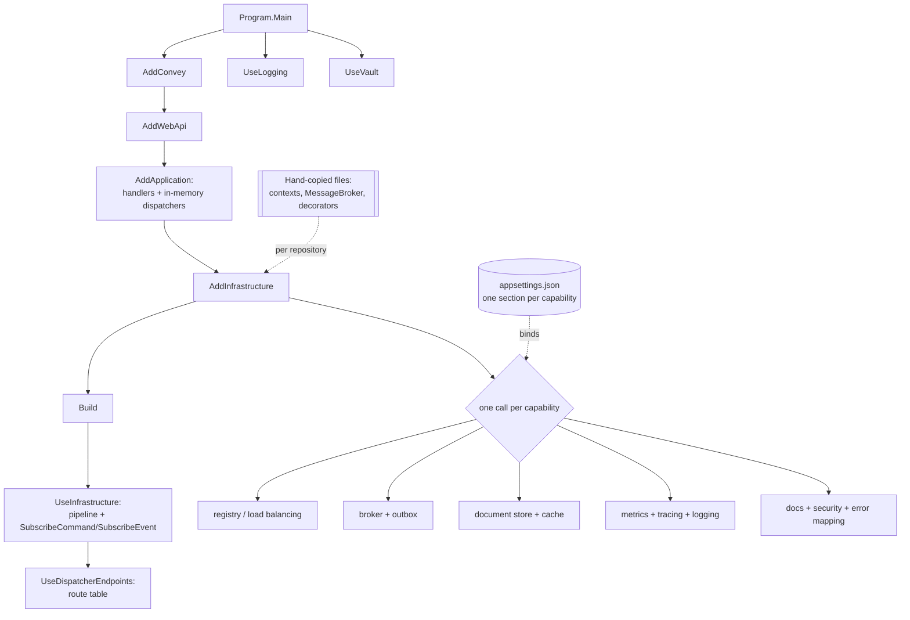

# Pattern: Framework-Supplied Platform Conventions

## Status

**Candidate.** No approval metadata, ADR, or documented human sign-off exists in the workspace, and
the CAKE catalog for tenant `Q5SCXYFS` holds no governing decision.

## Category

other

## Problem

Every service in a microservice platform needs the same dozen cross-cutting capabilities: a database, a
cache, a message broker, service registration, tracing, metrics, structured logging, secret loading,
error mapping, and an HTTP surface. Building each one per service produces a dozen slightly different
implementations. Building them once in a shared internal library produces a lockstep dependency — every
service must upgrade together, and the library becomes the thing nobody dares change.

The third option is to take the capabilities from an external toolkit and let each service compose them
itself. Nothing is shared between services except the toolkit and the habit of using it the same way.

## Context

Applies to a platform where services are released independently and no shared internal library is
wanted. Every Pacco deployable takes its cross-cutting capabilities from one external microservice
toolkit, composed through a single builder. There is no `Pacco.Common`, no shared package, and no
project reference that crosses a repository boundary anywhere in the workspace. What consistency exists
comes from the toolkit's shape and from files copied between repositories by hand.

## When to Use

- Services are released per repository, so a shared library's version coupling would be a real cost
  ([[independent-per-repository-release]]).
- An external toolkit already covers the cross-cutting concerns and its conventions are acceptable as
  the platform's conventions.
- The team is small enough that copying a file between repositories is cheaper than publishing a
  package.

## When Not to Use

- The platform has genuine shared domain concepts — identity semantics, authorization rules, message
  envelopes — that must not drift. Those want a versioned package, not a copy.
- The toolkit is unmaintained or pinned to an unsupported runtime, in which case its conventions become
  a ceiling rather than a floor.
- The number of services makes hand-copying a per-change tax across every repository.

## Architecture Summary

Composition happens in three places, identically in every service.

A **host entry point** chains four builder calls — the toolkit core, the web surface, the application
layer, the infrastructure layer — then `Build()`, and configures the application with an infrastructure
call and a route table. Two further calls, logging and secret loading, attach to the host builder
rather than the service collection, because they must run before the host starts.

An **application extension** registers handlers and in-memory dispatchers, and nothing else. Four lines.

An **infrastructure extension** does the rest: it registers the service's own types by interface,
applies handler decorators, and then chains one call per external capability — registry, load-balancing,
broker, outbox, persistence, cache, metrics, tracing, logging templates, per-collection repositories,
API documentation, and security primitives. A matching application-builder extension wires the request
pipeline and declares the message subscriptions.

The composition is a fluent chain, so a capability's presence or absence in a service is one line, and
the whole cross-cutting configuration of a service can be read in about thirty lines.

Each capability reads its own configuration section from `appsettings.json` by convention, so adding a
capability means one builder call plus one settings block.

What the toolkit does not supply, each service copies. Six or so infrastructure files — the caller
context types, the message-broker wrapper, the handler decorators — exist as near-identical copies in
every layered service, differing only in namespace.

## Structure / Flow

## Key Components

| Component | Responsibility |
|-----------|----------------|
| The toolkit core builder | Entry point; every capability extends it |
| `AddWebApi` / `UseDispatcherEndpoints` | HTTP surface without controllers ([[dispatcher-bound-cqrs-endpoints]]) |
| `AddApplication` | Handlers plus in-memory command and event dispatchers |
| `AddInfrastructure` / `UseInfrastructure` | All external capabilities, plus subscriptions |
| Registry and load-balancing packages | Service registration and east-west routing ([[registry-mediated-discovery-and-routing]]) |
| Broker and outbox packages | Messaging and the outbox decorators ([[transactional-outbox-handler-decorator]]) |
| Persistence and cache packages | Document store and cache ([[database-per-service-with-document-mapping]], [[prefix-partitioned-shared-cache]]) |
| Tracing, metrics and logging packages | Observability ([[correlation-and-span-propagation]], [[structured-logging-with-property-redaction]]) |
| Secrets package | Loads configuration from the secret store before startup ([[vault-issued-dynamic-credentials-and-service-pki]]) |
| Hand-copied infrastructure files | Everything the toolkit does not supply |

## Data / Event / API Contracts

- **Composition order is fixed by the builder:** service registration first, then `Build()`, then
  pipeline configuration, then the route table. Logging and secret loading attach to the host builder
  because they must precede configuration binding.
- **One configuration section per capability**, named after it — the section name is the contract
  between the builder call and `appsettings.json`, so a capability with no section falls back to
  defaults silently.
- **Every package is referenced with a floating minor version** (`0.4.*`) — 267 references across the
  workspace, without exception. Two builds of the same commit can resolve different package versions.
- **26 distinct packages** are in use. A service references between 8 and 20 of them; the count is a
  fair proxy for how much cross-cutting surface that service has.
- **Layered services split composition across two extension files** (application and infrastructure);
  single-project services put everything in one, and their entry point calls `AddInfrastructure`
  directly with no `AddApplication` step.
- **Subscriptions are declared in the pipeline extension**, one line per message type, which makes the
  service's inbound message surface readable in one place ([[declarative-message-manifest-subscription]]).
- **Handler decorators are applied by open generic type** against the handler interfaces, so a decorator
  covers every handler in the assembly without enumeration.
- **Copied files differ only by namespace.** After normalising namespaces, the caller-context factory and
  the message-broker wrapper are byte-identical across all seven layered services; the identity-context
  and application-context types are identical across six of seven, with the seventh differing only by
  the addition of `sealed`.

## Naming Conventions

| Element | Convention | Example |
|---------|-----------|---------|
| Registration extension | `Add<Layer>` returning the builder | `AddApplication`, `AddInfrastructure` |
| Pipeline extension | `Use<Layer>` returning the app builder | `UseInfrastructure` |
| Capability call | `Add<Capability>` / `Use<Capability>` | `AddMongo`, `UseMetrics` |
| Configuration section | Camel-case name of the capability | `mongo`, `rabbitMq`, `jaeger`, `redis` |
| Extension class | `Extensions`, static, one per layer | — |
| Package | `<Toolkit>.<Area>[.<Provider>]` | `…​.Persistence.MongoDB`, `…​.Tracing.Jaeger.RabbitMQ` |
| Version | Floating minor | `0.4.*` |

The `Add…` / `Use…` split is the most useful convention here: `Add` is what exists, `Use` is what runs,
and a reader can answer "is this service traced?" from the `Add` chain alone.

## Service / Boundary Guidance

- **Keep composition in one file per layer.** A service's entire cross-cutting configuration should be
  readable without opening a second file, and it is.
- **Let the application layer register only handlers and dispatchers.** Four lines, no external
  dependencies — which is what keeps the application layer independent of infrastructure
  ([[inward-dependency-service-skeleton]]).
- **Reference only the packages the service uses.** Services do differ here, and the difference is
  meaningful: the one without a database does not reference the persistence package.
- **Do not introduce a shared internal library for cross-cutting code** — that is the decision this
  pattern encodes, and the independent-release model depends on it.
- **Do reconsider it for shared semantics.** The copied caller-context files are not cross-cutting
  plumbing; they define what identity, roles and ownership mean. A change to one of them needs to reach
  seven repositories, and today nothing makes that happen
  ([[transport-agnostic-caller-context]]).
- **Copying is a decision with a maintenance cost, so record where the original lives.** Nothing in any
  repository says these files are copies or which one is canonical.

## Security / Compliance Considerations

- **Floating package versions mean the deployed dependency set is not determined by the commit.** No
  lock file is committed, so a rebuild of an old commit can pull different package versions, and there is
  no record of which versions a given release contained. That defeats dependency auditing.
- **Security primitives come from the toolkit** — token handling, claim access, encryption helpers — so
  a vulnerability in the toolkit is a vulnerability in every deployable at once, resolved only by
  rebuilding all of them.
- **The runtime the toolkit targets is out of support.** The whole platform is pinned to a .NET version
  whose support ended in December 2022, which means no security patches for the framework beneath every
  service ([[independent-per-repository-release]]).
- **Copied security-relevant code drifts silently.** The caller-context files include the ownership and
  role checks; a fix applied to one repository does not reach the other six, and nothing detects the
  divergence.
- **Configuration binds by section name**, so a mistyped or missing section leaves a capability on its
  defaults without an error — including capabilities whose defaults are permissive.

## Observability Considerations

- **Whether a service is observable is one line in its composition chain.** Reading the `Add` chain is
  the fastest way to answer what a service reports, and the fastest way to see a gap — which is how the
  missing tracing and logging registrations in individual services were found
  ([[correlation-and-span-propagation]]).
- **Nothing reports the composed capability set at runtime.** There is no startup log line listing which
  capabilities were registered, so the only source is the source.
- **No dependency inventory exists.** With floating versions and no lock file, nothing can answer which
  package versions are running in any environment.
- **The toolkit supplies the tracing, metrics and logging integrations**, so their conventions — span
  names, metric names, log property names — are the toolkit's, not the platform's, and are not
  documented anywhere in the repositories.

## Failure Handling

- **A missing configuration section** leaves the capability on defaults rather than failing. Quiet, and
  the failure appears later as a connection error or as silence.
- **A capability registered but not used in the pipeline** (`Add` without `Use`) compiles and starts
  normally, and simply does nothing — which is how a registered but unused decorator goes unnoticed.
- **A floating version resolving to a breaking change** surfaces as a build or startup failure with no
  corresponding source change, and no lock file to compare against.
- **A copied file diverging** produces no failure at all. It produces two services that behave
  differently while appearing to share an implementation.
- **The toolkit's error-mapping extension** is what turns domain exceptions into responses and into
  rejection messages, so a service that omits it loses both at once
  ([[rejected-event-failure-contract]]).

## Trade-offs

| Gain | Cost |
|------|------|
| No shared internal library, so no lockstep upgrades | No shared code, so fixes do not propagate |
| A service's cross-cutting configuration reads in one screen | The behaviour behind each line lives in an external package |
| Adding a capability is one call plus one settings block | A missing settings block is silent |
| Consistent conventions across ten deployables without coordination | The conventions are the toolkit's, and undocumented locally |
| Per-repository release stays genuinely independent | Copied files drift with nothing detecting it |
| Floating versions pick up fixes without edits | The deployed dependency set is not reproducible from the commit |

## Variants

- **Layered composition** (application extension plus infrastructure extension) in the seven layered
  services, versus **single-file composition** in the three single-project services, which have no
  application step at all.
- **Capability subsets:** every deployable takes the core, web surface and logging; most take the
  registry, broker, persistence, tracing and metrics; fewer take the cache, outbox or secret store.
- **Copy-based reuse** for the files the toolkit does not supply, with no packaged alternative anywhere
  in the workspace.

## Anti-patterns

- **Floating package versions with no lock file**, across 267 references. This is the single most
  consequential convention in the platform and the least defensible: builds are not reproducible and the
  running dependency set is unknown.
- **Copy-paste reuse of security-relevant code.** Plumbing can be copied; the definition of who a caller
  is and what they own should not be.
- **No marker on copied files** saying they are copies or where the original is.
- **Silent configuration binding**, where an absent section means defaults rather than an error.
- **A capability registered but never used in the pipeline**, which reads as present and does nothing.
- **Depending on an out-of-support runtime** as the base of every deployable.
- **No local documentation of the toolkit's conventions**, so the platform's standards are only
  discoverable by reading an external package's source.

## Evidence

- **ADR:** none — no ADR exists in any cloned repository or in the CAKE catalog for tenant `Q5SCXYFS`.
- **Repo:** all eleven deployable repositories. **No shared internal library exists**: the workspace
  contains only the eleven service repositories plus the platform, context and web repositories, and
  `grep` for a project reference crossing a repository boundary returns **0** matches.
- **Service:** all eleven deployables.
- **File:**
  `hianshul100_Pacco.Services.Orders/src/Pacco.Services.Orders.Api/Program.cs:24-45` — the composition
  chain (`AddConvey().AddWebApi().AddApplication().AddInfrastructure().Build()` at `:26-30`,
  `UseInfrastructure()` at `:32`, the route table at `:33-41`, `UseLogging()` and `UseVault()` at
  `:42-43`);
  `hianshul100_Pacco.Services.Orders/src/Pacco.Services.Orders.Application/Extensions.cs:9-14` — the
  four-line application layer: `AddCommandHandlers`, `AddEventHandlers`,
  `AddInMemoryCommandDispatcher`, `AddInMemoryEventDispatcher`;
  `hianshul100_Pacco.Services.Orders/src/Pacco.Services.Orders.Infrastructure/Extensions.cs:50-63` —
  own-type registrations and the two `TryDecorate` calls on the open generic handler interfaces
  (`:61-62`); `:65-83` — the capability chain: error handler, query handlers, in-memory query
  dispatcher, HTTP client, registry, load balancing, broker with the tracing plugin, outbox, exception
  mapper, document store, cache, metrics, tracing, handler logging, two per-collection repositories,
  API docs, security; `:86-107` — the pipeline and the fourteen `SubscribeCommand`/`SubscribeEvent`
  declarations;
  `hianshul100_Pacco.Services.Pricing/src/Pacco.Services.Pricing.Api/Program.cs:21-34` — the
  single-project variant, with **no `AddApplication` step** (`:23-26`) and a one-route table (`:29-30`);
  package references — `grep -rho 'Include="Convey[^"]*"' --include=*.csproj` gives **26 distinct
  packages** across **267 references**, and `grep` of the version attribute gives **`"0.4.*"` on all 267
  with no exceptions**; the most referenced are the core (24), the CQRS web surface (17), logging (17)
  and queries (17); no `packages.lock.json` exists in any repository;
  copied files — `find -name MessageBroker.cs` gives **7 copies**, byte-identical across all seven after
  namespace normalisation; `AppContextFactory.cs` **7 copies, all identical** after normalisation;
  `IdentityContext.cs` **7 copies, 6 identical**, with
  `hianshul100_Pacco.Services.Availability/src/Pacco.Services.Availability.Infrastructure/Contexts/IdentityContext.cs:7`
  differing from the other six only by `internal sealed class` versus `internal class`; `AppContext.cs`
  the same 6-of-7 split with the same one-word difference; `CorrelationContext.cs` **10 copies**, 6
  identical in the layered services and 4 divergent (Availability by `sealed`, and separate variants in
  the gateway, the operations service and the order-maker).
- **API/Event:** the toolkit supplies the HTTP surface and the messaging surface catalogued in
  [`../../baselines/api-inventory.md`](../../baselines/api-inventory.md) and
  [`../../baselines/architecture-baseline.md`](../../baselines/architecture-baseline.md) §4.2.
- **Deployment/Config:** each capability binds its own `appsettings.json` section; the sections present
  per service are listed in [`../../baselines/architecture-baseline.md`](../../baselines/architecture-baseline.md) §1.3.
- **Notes:** `architecture-baseline.md` §2, §3.1, §11.1. **Conflict — none between documentation and
  source.** The absence of a shared internal library is asserted from source: no such repository,
  package reference, or cross-repository project reference exists.

## Related ADRs

None. No ADR, decision record, or RFC exists in the workspace, and the CAKE graph for tenant
`Q5SCXYFS` returned zero nodes.

## Related Patterns

- [[inward-dependency-service-skeleton]] — the layering this composition assembles.
- [[dispatcher-bound-cqrs-endpoints]] — the HTTP surface the toolkit supplies.
- [[declarative-message-manifest-subscription]] — the subscription list in the pipeline extension.
- [[transactional-outbox-handler-decorator]] — a toolkit capability applied by decorator.
- [[transport-agnostic-caller-context]] — the copied files the toolkit does not supply.
- [[registry-mediated-discovery-and-routing]], [[correlation-and-span-propagation]],
  [[structured-logging-with-property-redaction]], [[vault-issued-dynamic-credentials-and-service-pki]] —
  capabilities composed here.
- [[independent-per-repository-release]] — the release model this pattern exists to preserve.

## Recommendation

**Adopt the composition style; fix the versioning.** Taking cross-cutting capabilities from an external
toolkit rather than a shared internal library is a sound fit for a per-repository release model, and the
execution is good: one file per layer, one line per capability, one settings section per line, and a
service's whole cross-cutting configuration readable in a single screen. Two things need attention and
they are not equal. The floating minor version on all 267 package references, with no lock file, means
no build is reproducible and no environment's dependency set is knowable — that should be pinned. The
copied files are the subtler issue: copying plumbing is a reasonable trade, but the copies include the
types that define identity, roles and ownership, and those have already begun to diverge. The safe split
is to keep composition per repository and move the shared *semantics* into a versioned package, so that
a fix to an ownership check reaches every service that has one.

## Assumptions, Blockers & Open Questions

> [!IMPORTANT]
> This document contains unresolved items that require attention before or during implementation. Review and resolve before merging downstream artifacts. Each item below is tagged **[ACTION NOW]** (a human must decide or confirm it before this work can safely proceed) or **[handled later by <stage>]** (a named later stage owns and will prove it) — read the tags first to see what, if anything, is yours to act on.

### Assumptions

| # | Assumption | Rationale | Impact if Wrong | Validation Path |
|---|------------|-----------|-----------------|-----------------|
| A1 | The absence of a shared internal library is a deliberate choice, not an unfinished extraction | Every repository composes the same way and copies the same files, which is a consistent habit rather than an accident; no partial shared package exists anywhere | If an extraction was planned and abandoned, the copied files are debt with an owner rather than a standing decision, and the fix is different | Ask the platform owner whether a shared package was ever considered or started |
| A2 | The copied infrastructure files originated in one repository and were pasted into the others | They are byte-identical after namespace normalisation, and the only divergence across seven copies is a single `sealed` keyword | If they were written independently, the convergence is coincidental and future divergence is likelier than assumed | Compare the first-commit dates of the copies across repositories |
| A3 | No lock file is committed anywhere, so package resolution is genuinely floating in every build | A search for a committed lock file across all repositories found none, and every version attribute is a floating minor | If restore is locked by some means outside the repositories, reproducibility is better than described here and the pinning question is less urgent | Build the same commit twice a week apart and compare the resolved package versions |

### Blockers

| # | Blocker | Blocking What | Owner / Next Step | Target Resolution |
|---|---------|---------------|-------------------|-------------------|
| B1 | **[ACTION NOW]** All 267 package references use a floating minor version with no committed lock file, so no build is reproducible and no environment's dependency set can be determined | Any dependency audit, any security-patch verification, and any attempt to reproduce a past build. A rebuild of an old commit today may not produce what was deployed then | Platform owner: pin the versions or commit lock files, and decide which. Pinning is the smaller change; lock files preserve the ability to float deliberately | Before the next security review, and before any attempt to reproduce a deployed build |

### Open Questions

| # | Question | Why It Matters | Proposed Answer (if any) | Decision Owner |
|---|----------|----------------|--------------------------|----------------|
| Q1 | **[ACTION NOW]** Should the caller-context types move into a versioned shared package? | Seven copies define identity, roles and ownership; a fix to the ownership checks in one repository reaches none of the others, and the copies have already diverged by one keyword | Yes for these specific types. They are shared semantics, not plumbing, and the argument for copying does not apply to them | Platform owner, with the security owner |
| Q2 | **[handled later by the design stage]** Should copied files carry a marker naming their origin? | Nothing identifies these files as copies or says which repository is canonical, so a reader cannot tell that editing one leaves six behind | Yes — a one-line header naming the source repository, until Q1 removes the need | Platform owner |
| Q3 | **[ACTION NOW]** What is the plan for the out-of-support runtime the toolkit targets? | Every deployable sits on a framework version that stopped receiving security patches in December 2022, and the toolkit version in use is bound to it | Needs a decision and a date. The upgrade is platform-wide and its size should be established before it is scheduled | Platform owner |
| Q4 | **[handled later by the design stage]** Should the toolkit's conventions be documented locally? | Span names, metric names, log property names and configuration section names are the toolkit's, and are discoverable only by reading an external package's source | Yes — a short local reference for the sections and names actually used, kept alongside this catalog | Platform owner |
| Q5 | **[handled later by the design stage]** Should a missing configuration section fail startup rather than fall back to defaults? | Binding is silent, so a mistyped or absent section leaves a capability on defaults with no error — including capabilities whose defaults are permissive | Fail fast for the capabilities a service declares it uses; a registered capability with no settings block is almost always a mistake | Platform owner |
| Q6 | **[handled later by the design stage]** Should the composed capability set be logged at startup? | There is no runtime record of what a service registered, so answering "is this instance traced?" means reading the source of the version that was deployed | Yes — one line at startup listing the registered capabilities makes the gaps found in this catalog visible in operation | Platform owner |
