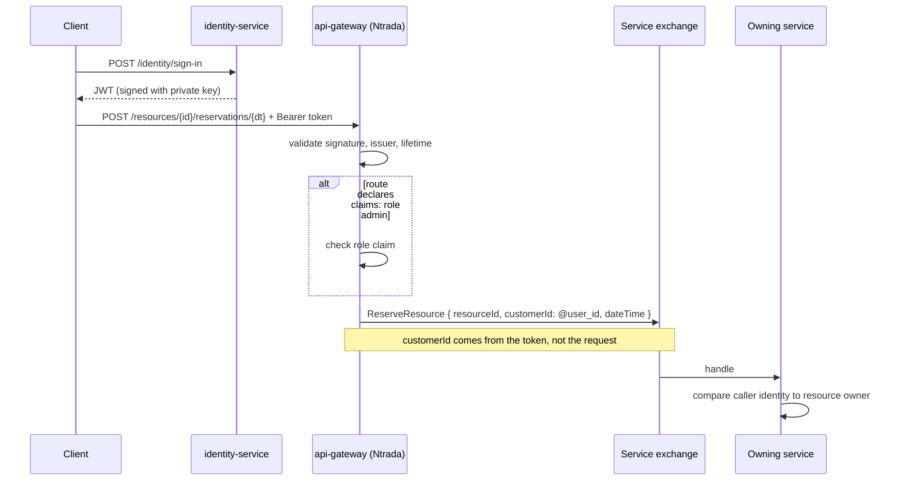

# Pattern: Edge-Enforced Authentication With Identity Binding

## Status

**Candidate.** No approval metadata, ADR, or documented human sign-off exists in the workspace, and
the CAKE catalog for tenant `Q5SCXYFS` holds no governing decision.

## Category

security

## Problem

Two failures follow from letting each service handle authentication for itself. The obvious one is
duplication: a dozen services each parsing a token, each with its own idea of what counts as valid, and
one of them eventually getting it wrong. The subtler one is that a caller can lie about who they are.
If a request body says `customerId`, a service that trusts it has authenticated nobody — the token was
checked and then ignored.

## Context

Applies to any platform with a gateway in front of its services. Pacco issues tokens from a dedicated
`identity-service`, validates them at the Ntrada gateway per route, and — for the routes that need it —
substitutes the authenticated user's identifier into the message the gateway publishes, so the caller
never supplies it.

## When to Use

- All external traffic passes through one entry point that can be trusted to have validated the token.
- Routes differ in what they require — anonymous, authenticated, or a specific role.
- Some operations act on behalf of the caller, so the caller's identity must become part of the request
  rather than being taken from it.
- Services still need to know who is acting, for ownership checks they perform themselves.

## When Not to Use

- Services are reachable without passing through the gateway. Then the gateway is an optimisation, not
  a control, and every rule it declares is advisory.
- The authorization decision needs data the gateway does not have — the resource's owner, its state,
  its relationships. The edge can answer "is this a valid admin?"; it cannot answer "is this the
  person's own order?".
- Tokens must be revocable immediately. Edge validation is signature-based and stateless by design.

## Architecture Summary

A dedicated identity service owns users, credentials, and token issuance, and exposes sign-up,
sign-in, refresh, and revocation. It signs tokens with a private key.

The gateway holds a global `auth` block naming the claim types it understands, and each route declares
its own requirement: nothing (anonymous), `auth: true` (any authenticated caller), or `auth: true` plus
`claims:` (a specific role). Validation happens once, at the edge.

For routes that publish a message, the gateway's `bind` list maps message fields to sources —
route values, or the special `@user_id` token that inserts the authenticated caller's identifier. A
field bound this way cannot be supplied by the caller.

Downstream, each service reconstructs a caller context from what the gateway forwarded and uses it for
ownership checks it makes itself ([[transport-agnostic-caller-context]]).

## Structure / Flow

## Key Components

| Component | Responsibility |
|-----------|----------------|
| `identity-service` | Owns users, hashing, sign-in, sign-up, token issuance, refresh and revocation |
| `certs/localhost.pfx` at the issuer | The private key material — held only by `identity-service` |
| `certs/localhost.cer` at each service | The public certificate for local validation |
| Gateway `auth` block | Enables auth globally-off (`global: false`) and maps friendly claim names to claim types |
| Per-route `auth: true` | Requires an authenticated caller |
| Per-route `claims:` | Requires a specific claim value, e.g. `role: admin` |
| Gateway `bind:` with `@user_id` | Substitutes the authenticated identifier into the published message |
| `allowAnonymousEndpoints` | Per-service list of paths exempt from token requirements |

## Data / Event / API Contracts

- **Token:** a JWT with issuer `pacco`, a subject carrying the user identifier, a role claim, and a
  60-minute lifetime (`jwt.expiryMinutes: 60`).
- **Role claim type:** `http://schemas.microsoft.com/ws/2008/06/identity/claims/role`, mapped at the
  gateway to the short name `role` so routes can write `role: admin`.
- **Validation settings differ between the gateway and the services**, and the difference matters:

  | Setting | Gateway | Services |
  |---------|---------|----------|
  | `validateIssuer` | `true` | `false` |
  | `validateAudience` | `false` | `false` |
  | `validateLifetime` | `true` | `true` |
  | Key material | `issuerSigningKey` (symmetric, committed) | `certs/localhost.cer` (public certificate) |

- **Identity binding:** `bind: - customerId:@user_id` on the reservation route; the caller supplies the
  resource and the date, never the customer.
- **Anonymous surface:** `/sign-in` and `/sign-up` at `identity-service`, plus the root and `/ping`
  endpoints on every service.
- **Revocation surface:** `access-tokens/revoke`, `refresh-tokens/use`, `refresh-tokens/revoke` — all
  at `identity-service`, all returning `204` or a new token.

## Naming Conventions

| Element | Convention | Example |
|---------|-----------|---------|
| Gateway claim alias | Short name mapped to the full claim type in the `auth` block | `role` |
| Route requirement | `auth: true`, optionally with a `claims:` map | `claims: { role: admin }` |
| Identity binding token | `@` prefix, snake_case | `@user_id` |
| Certificate location | `certs/localhost.<ext>` relative to the service | `certs/localhost.cer` |
| Anonymous list | `jwt.allowAnonymousEndpoints`, leading slash | `["/sign-in", "/sign-up"]` |
| Token issuer | Platform name, lower case | `pacco` |

## Service / Boundary Guidance

- **Validate once, at the edge, and let services trust the forwarded context** — but only if the edge
  is genuinely the only way in. That precondition is not currently met here.
- **Bind identity, never accept it.** Any field that identifies the acting user should come from
  `@user_id`. A route that takes a customer identifier from the request body is trusting the caller
  about the one thing the token exists to establish.
- **Keep the private key at the issuer only.** `identity-service` holds the `.pfx`; every other service
  holds the `.cer`. That asymmetry is correct and should be preserved.
- **The gateway answers coarse questions; services answer fine ones.** Role checks at the edge,
  ownership checks in handlers. Neither can do the other's job.
- **Messages published without a caller context skip every ownership guard**, because those guards are
  written to short-circuit when the caller is unauthenticated. Any component publishing directly to an
  exchange must be treated as trusted ([[saga-process-manager]]).

## Security / Compliance Considerations

- **A shared symmetric signing key is committed to source control.** The same literal
  `jwt.issuerSigningKey` value appears in the gateway's `ntrada.yml`, in `identity-service`, and in
  `operations-service`. It is recorded here by path only and its value is not reproduced. Anyone with
  repository access can mint a token the gateway will accept.
- **The certificate password is committed too** (`jwt.certificate.password` in `identity-service`),
  alongside the `.pfx` path.
- **Vault is configured to supply settings** (`vault.kv` with a per-service path), which is the intended
  escape from committed values — but the committed defaults remain in the repository as fallbacks, so a
  Vault outage silently reverts to them rather than failing.
- **The gateway validates the issuer; the services do not.** A service validating a token directly
  accepts one from any issuer with the right key.
- **Services expose their ports directly** in the deployment files, so the gateway's per-route rules
  can be bypassed by addressing a service. Whether that is intended is an open question below, and it
  is the single most consequential uncertainty in this pattern.
- **Token lifetime is 60 minutes with no edge-side revocation check.** Revocation endpoints exist at
  `identity-service`, but the gateway's validation is stateless — a revoked token remains acceptable at
  the edge until it expires, unless a service checks revocation itself.
- **CORS allows all origins with credentials** (`allowedOrigins: '*'`, `allowCredentials: true`), which
  is a permissive combination for a credential-bearing API.

## Observability Considerations

- The gateway generates a request id and a trace id per request and exposes them to clients, so an
  authenticated call can be followed end to end ([[correlation-and-span-propagation]]).
- **Authentication failures are not distinguishable in the platform's telemetry.** No metric counts
  rejected tokens, failed role checks, or anonymous access to protected routes.
- The user identity travels in the forwarded correlation context, so logs and traces can attribute an
  action to a user — and correspondingly, user identifiers appear in log storage.
- `customErrors.includeExceptionMessage: true` at the gateway returns exception text to clients, which
  can disclose more about a failure than intended.

## Failure Handling

- **A missing or invalid token yields a rejection at the gateway** before any service is involved.
- **A valid token with the wrong role** is rejected at the route by the `claims:` check.
- **A service reached directly with no token** produces an unauthenticated caller context, and the
  ownership guards — written as `identity.IsAuthenticated && identity.Id != owner && !identity.IsAdmin`
  — evaluate to false on the first term and allow the operation.
- **`identity-service` being unavailable stops new sign-ins and refreshes** but does not invalidate
  existing tokens, since validation is local to the gateway and the services.
- **A Vault outage falls back to committed configuration** rather than failing, which keeps the platform
  running on values that were meant to be overridden.

## Trade-offs

| Gain | Cost |
|------|------|
| One place validates tokens; services do not each implement it | That place must be unavoidable, and here it is not |
| Route requirements are declarative and reviewable in one file | They are in a different repository from the services they protect, so drift is invisible from either side |
| `@user_id` binding makes identity spoofing structurally impossible on those routes | Only on the routes that use it; the rest still take identifiers from the request |
| Stateless validation scales and needs no shared session store | Revocation cannot take effect until the token expires |
| The private key stays with the issuer | A symmetric key is also configured, and it is committed — the asymmetry is undermined by the fallback |
| Coarse checks at the edge keep services simpler | Fine-grained checks still have to be written per handler, and one is missing |

## Variants

- **Certificate-based validation** at the services versus **symmetric key** validation at the gateway.
  Both are configured; only the certificate path preserves the issuer/verifier asymmetry.
- **Per-route auth** (`global: false` plus per-route `auth: true`) versus global auth with per-route
  exemptions. The first is explicit and easy to under-apply; the second is safe by default and easy to
  over-apply.
- **Identity binding** (`@user_id`) versus trusting a request field. Only the first is authentication.
- **Anonymous endpoint lists** at each service, as a second layer for services reached directly.

## Anti-patterns

- **A signing key in source control.** Shared across three components, and sufficient on its own to
  forge an acceptable token.
- **A certificate password committed next to the certificate path.**
- **Falling back to committed secrets when the secret store is unavailable.** The failure is silent and
  leaves the platform running on the values Vault was introduced to replace.
- **Publishing service ports while relying on the gateway for authorization.** Each decision is
  defensible; together they cancel out.
- **An ownership guard that passes when the caller is unauthenticated.** `identity.IsAuthenticated &&
  …` fails open, so the least authenticated caller gets the most access.
- **`validateIssuer: false` at the services** while the gateway validates it — the weaker path is the
  one that is directly reachable.
- **Wildcard CORS origins with credentials enabled** on a token-bearing API.

## Evidence

- **ADR:** none — no ADR exists in any cloned repository or in the CAKE catalog for tenant
  `Q5SCXYFS`.
- **Repo:** `hianshul100_Pacco.APIGateway` (edge enforcement);
  `hianshul100_Pacco.Services.Identity` (issuance); all ten services (local validation configuration).
- **Service:** `api-gateway` (5000), `identity-service` (5004), and every service configuring a `jwt`
  block.
- **File:**
  `hianshul100_Pacco.APIGateway/src/Pacco.APIGateway/ntrada.yml:1-5` (`auth.enabled: true`,
  `global: false`, role claim type), `:26-40` (CORS), `:41-46` (gateway `jwt` block —
  `issuerSigningKey` at :44, `validateIssuer: true` at :45), `:137-138`, `:151-152`, `:159-160`,
  `:180-181`, `:245-246` (routes requiring `role: admin`);
  `ntrada-async.yml:123-133` (the reservation route with `bind: - customerId:@user_id`);
  `hianshul100_Pacco.Services.Identity/src/Pacco.Services.Identity.Api/Program.cs:33-71` (the full
  identity surface: `sign-in`, `sign-up`, `me` with `AuthenticateUsingJwtAsync`, access-token and
  refresh-token revocation);
  `.../Identity.Api/appsettings.json:32-44` (`certificate.location: certs/localhost.pfx` with a
  committed `password`, `issuerSigningKey`, `expiryMinutes: 60`, `validateIssuer: false`,
  `allowAnonymousEndpoints`);
  the `.cer`-based `jwt` blocks at `Availability` :79-81, `Vehicles` :77-79, `Operations` :32-36,
  `OrderMaker` :71-73, `Deliveries` :77-79, `Customers` :76-78, `Orders` :72-74, `Parcels` :68-70,
  `Pricing` :79;
  `hianshul100_Pacco.Services.Orders/src/Pacco.Services.Orders.Application/Commands/Handlers/AddParcelToOrderHandler.cs:51-58`
  (the fail-open ownership guard).
- **API/Event:** the per-route auth and claims requirements are enumerated in
  [`../../baselines/api-inventory.md`](../../baselines/api-inventory.md).
- **Deployment/Config:** `hianshul100_Pacco/compose/services.yml` publishes every service port
  directly; `vault.kv` per-service settings paths in each `appsettings.json`;
  `hianshul100_Pacco/compose/consul-fabio-vault.yml` runs the Vault container.
- **Notes:** `architecture-baseline.md` §8.1–§8.4, §11.3.

## Related ADRs

None. No ADR, decision record, or RFC exists in the workspace, and the CAKE graph for tenant
`Q5SCXYFS` returned zero nodes.

## Related Patterns

- [[declarative-configuration-driven-api-gateway]] — the file these rules live in.
- [[transport-agnostic-caller-context]] — how a service reconstructs who is calling.
- [[dual-mode-edge-write]] — the publish path where `@user_id` binding happens.
- [[vault-issued-dynamic-credentials-and-service-pki]] — the secret store meant to replace the
  committed values.
- [[dispatcher-bound-cqrs-endpoints]] — the service routes that declare no requirements of their own.
- [[real-time-push-with-shared-backplane]] — a token-consuming surface outside the gateway entirely.

## Recommendation

**Adopt the shape; treat the current configuration as unfinished.** Validating at the edge, keeping the
private key with the issuer, and binding `@user_id` into published messages are all right, and the
binding in particular is the strongest control in the platform — on those routes, impersonation is not
possible regardless of what the caller sends. Four things need resolving before this can be called
enforced: remove the signing key and certificate password from source control and make a Vault failure
fail rather than fall back; make the gateway unavoidable, or accept that per-route rules are advisory;
fix the ownership guards that pass when the caller is unauthenticated; and extend `@user_id` binding to
every route that currently takes a user identifier from the request.

## Assumptions, Blockers & Open Questions

> [!IMPORTANT]
> This document contains unresolved items that require attention before or during implementation. Review and resolve before merging downstream artifacts. Each item below is tagged **[ACTION NOW]** (a human must decide or confirm it before this work can safely proceed) or **[handled later by <stage>]** (a named later stage owns and will prove it) — read the tags first to see what, if anything, is yours to act on.

### Assumptions

| # | Assumption | Rationale | Impact if Wrong | Validation Path |
|---|------------|-----------|-----------------|-----------------|
| A1 | The committed signing key and certificate password are development defaults that Vault overrides in any real environment | Every service configures a Vault settings path, which is exactly the mechanism for replacing them, and the values look like sample data | The platform would be running on a signing key that is public to anyone with repository access, meaning any token can be forged | Check the Vault KV contents for each service and confirm the deployed value differs from the committed one |
| A2 | The role claim value the gateway compares against is the plain string `admin`, matching what `identity-service` puts in the token | The routes are written `role: admin` and the claim type is mapped in the `auth` block; the comparison itself happens inside Ntrada | Admin-only routes would either reject every caller or accept every caller, and neither would be obvious from configuration | Sign in as an admin user and call an admin-only route; then call it as a non-admin |

### Blockers

| # | Blocker | Blocks | Owner | Resolution Path | Target Date |
|---|---------|--------|-------|-----------------|-------------|
| B1 | **[ACTION NOW]** The JWT signing key is a literal value committed in three places in source control, and the certificate password is committed beside the certificate path | Any claim that authentication is enforced; production readiness of the whole platform | Platform security owner, with the platform owner | Rotate the key and certificate, remove both from the repositories and their history, move them into Vault, and make a Vault failure fail startup rather than fall back to a committed default | TBD |
| B2 | **[ACTION NOW]** Ownership guards are written so that an unauthenticated caller passes them — the check begins with `identity.IsAuthenticated &&`, which short-circuits to false and allows the operation | Correct authorization on every service handler that performs an ownership check; the safety of reaching a service without a token | Platform security owner, with the owners of the seven layered services | Invert the guard so an unauthenticated caller is rejected, and apply it uniformly through a decorator rather than a copy-pasted method | TBD |

### Open Questions

| # | Question | Why It Matters | Proposed Answer (if any) | Decision Owner |
|---|----------|----------------|--------------------------|----------------|
| Q1 | **[ACTION NOW]** Are services meant to be reachable without going through the gateway? | Every per-route authentication and role rule lives at the gateway. If services can be addressed directly, none of those rules is enforced | Local-development convenience, almost certainly. It must be settled explicitly, because it determines whether this pattern is a control or a convention | Platform owner / operator for the Pacco runtime, with the platform security owner |
| Q2 | **[ACTION NOW]** Should `@user_id` binding be applied to every route that carries a user identifier? | Only the reservation route binds it today. Any other route taking a customer identifier from the request is trusting the caller about who they are | Yes — audit every route with a user or customer field and bind it from the token. It is the pattern's strongest control and it is barely used | Platform security owner, with the owner of `hianshul100_Pacco.APIGateway` |
| Q3 | **[ACTION NOW]** Should a revoked token be rejected before it expires? | Revocation endpoints exist, but validation is stateless at both the gateway and the services, so a revoked token stays usable for up to an hour | Either shorten the token lifetime substantially, or have the gateway consult a revocation list. Doing neither means revocation does not do what its name suggests | Platform security owner |
| Q4 | **[handled later by the design stage]** Should services validate the token issuer, as the gateway does? | Services are configured with `validateIssuer: false`, so a directly-reached service accepts a token from any issuer holding the key — the weaker setting is on the more exposed path | Set `validateIssuer: true` everywhere; there is no reason for the two paths to differ | Platform security owner |
