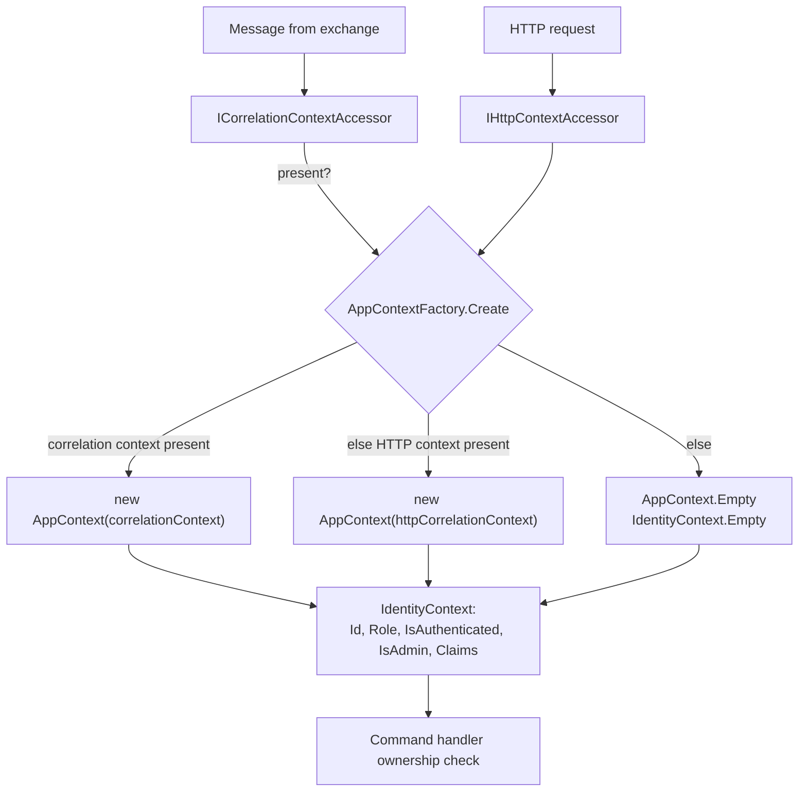

# Pattern: Transport-Agnostic Caller Context

## Status

**Candidate.** No approval metadata, ADR, or documented human sign-off exists in the workspace, and
the CAKE catalog for tenant `Q5SCXYFS` holds no governing decision.

## Category

security

## Problem

A command handler needs to know who is asking. When the command arrived over HTTP the answer sits in
the HTTP context; when the same command arrived from a message queue there is no HTTP context at all,
and the caller's identity — if it survived — is somewhere in the message headers. A handler that reads
the HTTP context directly works on one path and silently sees nobody on the other. Since the ownership
checks are written to allow the operation when nobody is authenticated, "silently sees nobody" is the
dangerous outcome, not the harmless one.

## Context

Applies to services that accept the same command from more than one transport. In Pacco, seven layered
services build a small `IAppContext` from whichever source is present — the forwarded correlation
context on the message path, the HTTP context on the direct path — and hand handlers a uniform view of
the caller regardless of how the command arrived.

## When to Use

- The same handler is reachable over HTTP and over messaging.
- Handlers need the caller's identity for ownership or role decisions.
- Identity travels between services inside message metadata rather than being re-authenticated.
- The application layer should not reference a web framework.

## When Not to Use

- One transport only. The indirection buys nothing.
- The caller's identity should be re-established rather than forwarded — for example across a trust
  boundary, where a propagated claim is only as good as the hop that set it.
- Handlers make no authorization decision at all, in which case the context is dead weight.

## Architecture Summary

Three small classes and one factory, defined per service in the Infrastructure layer, behind an
interface declared in the Application layer.

`CorrelationContext` is the wire shape: a correlation id, span context, trace id, connection id, an
operation name, a timestamp, a resource id, and a nested `UserContext` holding an identifier, an
authenticated flag, a role, and a claims dictionary.

`AppContextFactory` produces an `IAppContext` per resolution. It prefers the message-broker correlation
context if one is present, falling back to the HTTP context, and falling back again to
`AppContext.Empty` when neither is. `IdentityContext` translates the wire shape into something a
handler can use: it parses the identifier into a `Guid` (defaulting to `Guid.Empty` when it will not
parse), normalises nulls, and derives `IsAdmin` from a case-insensitive comparison of the role against
`admin`.

Handlers then write `_appContext.Identity` and never mention HTTP or messaging.

## Structure / Flow

## Key Components

| Component | Layer | Responsibility |
|-----------|-------|----------------|
| `IAppContext` | Application | Two members: `RequestId` and `Identity` |
| `IIdentityContext` | Application | `Id`, `Role`, `IsAuthenticated`, `IsAdmin`, `Claims` |
| `AppContextFactory` | Infrastructure | Picks the source and builds the context |
| `AppContext` | Infrastructure | Holds the request id and identity; exposes `Empty` |
| `IdentityContext` | Infrastructure | Parses and normalises the user fields; exposes `Empty` |
| `CorrelationContext` | Infrastructure | The wire shape, including the nested `UserContext` |

Every one of these is `internal` except the two Application-layer interfaces, so nothing outside the
service can construct or depend on a caller context — the boundary is enforced by accessibility, not by
convention ([[inward-dependency-service-skeleton]]).

## Data / Event / API Contracts

- **Wire shape** (`CorrelationContext`): `CorrelationId`, `SpanContext`, `User`, `ResourceId`,
  `TraceId`, `ConnectionId`, `Name`, `CreatedAt`.
- **Nested user shape** (`CorrelationContext.UserContext`): `Id` (string), `IsAuthenticated` (bool),
  `Role` (string), `Claims` (string-to-string map).
- **Transport header:** the correlation context travels in the message header named by
  `rabbitMq.context.header`, set to `message_context` in every service.
- **Derived values:** `IsAdmin` is not on the wire — it is computed as
  `Role.Equals("admin", InvariantCultureIgnoreCase)`. `Id` is not a `Guid` on the wire either; it is
  parsed, and an unparseable value becomes `Guid.Empty` rather than an error.
- **Empty context:** `RequestId` becomes a fresh `Guid` in `"N"` format and `Identity` becomes
  `IdentityContext.Empty` — `Guid.Empty`, empty role, `IsAuthenticated: false`, `IsAdmin: false`, empty
  claims.
- **Round-trip:** the factory serialises the accessor's correlation context to JSON and deserialises it
  into the service's own `CorrelationContext` type, so the two shapes are coupled by field name only.

## Naming Conventions

| Element | Convention | Example |
|---------|-----------|---------|
| Application interfaces | `IAppContext`, `IIdentityContext` in the Application root | — |
| Infrastructure types | `Contexts/` folder, `internal` | `Infrastructure/Contexts/AppContext.cs` |
| Empty instance | Static `Empty` property on the type itself | `IdentityContext.Empty` |
| Wire type | `CorrelationContext` with a nested `UserContext` | — |
| Header name | snake_case in configuration | `message_context` |
| Admin role value | Lower case, compared case-insensitively | `admin` |

The same six files, with the same names and the same content bar the namespace, appear in each of the
seven layered services. This is copy-and-paste reuse; there is no shared library
([[framework-supplied-platform-conventions]]).

## Service / Boundary Guidance

- **Handlers should depend on `IAppContext` only.** No handler in the observed code references
  `IHttpContextAccessor` or a message-broker accessor directly, which is what makes the same handler
  behave the same on both paths.
- **Keep the context types `internal`.** They are an implementation detail of one service; another
  service's identity view is not this service's business.
- **Treat the forwarded identity as an assertion by the previous hop, not as authentication.** Nothing
  in this pattern verifies a signature. Whoever can publish to the exchange can set the user context to
  anything, so the exchange's access control is the real boundary
  ([[edge-enforced-authentication-with-identity-binding]]).
- **Decide once what an empty context means.** Today it means "unauthenticated", and handler guards
  read `identity.IsAuthenticated && identity.Id != owner && !identity.IsAdmin` — so an empty context
  passes every check. That is a decision worth making on purpose rather than inheriting from the
  short-circuit order of an `&&`.
- **Anything publishing without a context bypasses authorization entirely.** The saga publishes with an
  empty context, so saga-issued commands act with no caller and clear every guard
  ([[saga-process-manager]]).

## Security / Compliance Considerations

- **The identity is forwarded, not verified.** There is no signature over the `message_context` header
  and no re-validation of the original token. A message published directly to an exchange can claim any
  user identifier and the `admin` role, and every handler will believe it.
- **The fail-open guard is the sharp edge.** Because the ownership check begins with
  `identity.IsAuthenticated &&`, a caller with *no* identity is treated more permissively than a caller
  with the wrong one. The safest input to send is nothing at all.
- **An unparseable user identifier becomes `Guid.Empty` silently.** A guard comparing
  `identity.Id != order.CustomerId` then compares against the empty Guid, and no error is raised to say
  the identifier was malformed.
- **`IsAdmin` is derived from a string comparison against `"admin"`.** Role naming is not enforced
  anywhere; a token issued with `Admin`, `administrator`, or `ADMIN` behaves differently across those
  three, and only the first two of those three match.
- **Claims are carried in full through the message header**, so any claim placed in a token — including
  personal data — is written into message metadata and, from there, into whatever stores messages.
- **The nested user context travels in clear text** across RabbitMQ, which is configured without TLS.

## Observability Considerations

- The same `CorrelationContext` carries both the identity and the correlation and span identifiers, so
  a single header ties a user to a trace ([[correlation-and-span-propagation]]).
- `RequestId` falls back to a fresh `Guid` when no context exists, which keeps every log line
  attributable but produces an identifier that correlates with nothing — a locally valid id that leads
  nowhere is easy to mistake for a real trace.
- **Nothing counts empty contexts.** A rise in unauthenticated handler invocations — the exact signal
  that would reveal the fail-open behaviour being exercised — is not measured.
- `Login`, `Email`, and `Token` are on the logger's excluded-property list, but the claims dictionary is
  a generic map and is not covered by name-based exclusion
  ([[structured-logging-with-property-redaction]]).

## Failure Handling

- **No correlation context and no HTTP context:** `AppContext.Empty`. Handlers proceed with an
  unauthenticated caller and, given the guard shape, succeed.
- **Correlation context present but `User` null:** `IdentityContext.Empty`, same outcome.
- **Unparseable user identifier:** `Guid.Empty`, no exception.
- **Null role or null claims:** normalised to an empty string and an empty dictionary, so handlers never
  face a null.
- **Serialisation round-trip failure:** the factory serialises and re-deserialises the correlation
  context; a shape mismatch between the accessor's type and the service's own `CorrelationContext`
  produces nulls rather than an error, degrading to an empty identity.

Every failure mode in this list degrades to "no caller" and none of them is reported.

## Trade-offs

| Gain | Cost |
|------|------|
| Handlers work identically over HTTP and messaging | The two paths differ in whether anyone authenticated, and the abstraction hides that |
| The Application layer never references a web framework | The wire shape is duplicated in seven repositories and can drift silently |
| Null-safe, normalised identity — handlers face no nulls | Malformed input is normalised into valid-looking defaults instead of being rejected |
| `internal` types keep the context out of other services' reach | Also prevents extracting a shared implementation without a real library |
| An `Empty` fallback means the context is always resolvable | "Always resolvable" turns a missing identity into a valid one, and the guards then let it through |
| Claims travel whole, so services can make decisions on any claim | Claims travel whole, so any personal data in a token spreads across the platform |

## Variants

- **Correlation-context-first, HTTP-second** — the observed order, correct for a platform where most
  commands arrive over messaging.
- **Empty fallback** versus rejecting when no context is present. Only the first is implemented.
- **Derived `IsAdmin`** versus checking the claims dictionary at the point of use. The derived flag is
  simpler and hides the role-naming fragility.
- **Per-service duplication** versus a shared package. Duplication is what exists; the files are
  identical apart from namespaces.

## Anti-patterns

- **An ownership guard whose first term is `IsAuthenticated`.** It makes the absence of identity the
  most permissive input. Reject the unauthenticated caller first, then compare ownership.
- **Normalising unparseable input into a valid default.** `Guid.Empty` is a real value that will be
  compared against real owner identifiers.
- **Trusting a forwarded identity across a boundary that is not access-controlled.**
- **Copying six files into seven repositories.** Each copy is a place where the wire shape can drift out
  of step with the others, and nothing detects it.
- **Deriving a role decision from an unconstrained string comparison** with no enumeration of valid
  role values anywhere.

## Evidence

- **ADR:** none — no ADR exists in any cloned repository or in the CAKE catalog for tenant `Q5SCXYFS`.
- **Repo:** `hianshul100_Pacco.Services.Orders`, `.Parcels`, `.Customers`, `.Availability`,
  `.Vehicles`, `.Deliveries`, `.Identity` — the seven layered services.
- **Service:** `orders-service`, `parcels-service`, `customers-service`, `availability-service`,
  `vehicles-service`, `deliveries-service`, `identity-service`.
- **File:**
  `hianshul100_Pacco.Services.Orders/src/Pacco.Services.Orders.Infrastructure/Contexts/AppContextFactory.cs:19-33`
  — correlation context preferred (`:21`), JSON round-trip (`:23-27`), HTTP fallback (`:30`),
  `AppContext.Empty` fallback (`:32`);
  `.../Contexts/AppContext.cs:11-13` (`Empty` = new `Guid` in `"N"` format + `IdentityContext.Empty`),
  `:15-18` (construction from a correlation context, null `User` → `IdentityContext.Empty`), `:26`;
  `.../Contexts/IdentityContext.cs:24-31` — `Guid.TryParse` defaulting to `Guid.Empty` (`:26`), null
  normalisation (`:27`, `:30`), `IsAdmin` derived by case-insensitive comparison to `"admin"` (`:29`),
  `Empty` at `:33`;
  `.../Contexts/CorrelationContext.cs:6-24` — the wire shape and the nested `UserContext` (`:17-23`);
  `.../Pacco.Services.Orders.Application/IAppContext.cs:3-7` — the two-member interface;
  `.../Application/Commands/Handlers/AddParcelToOrderHandler.cs:51-58` — the fail-open ownership guard
  consuming `_appContext.Identity`;
  the same six files, identical apart from namespace, under
  `Pacco.Services.Parcels.Infrastructure/Contexts/`, `…Customers…`, `…Availability…`, `…Vehicles…`,
  `…Deliveries…`, `…Identity…`.
- **API/Event:** the correlation context is carried in the RabbitMQ header named by
  `rabbitMq.context.header` (`message_context`) in every service's `appsettings.json`.
- **Deployment/Config:** `rabbitMq.context.header: "message_context"` and
  `rabbitMq.spanContextHeader: "span_context"` in each service's `appsettings.json`; RabbitMQ is
  configured without TLS in `hianshul100_Pacco/compose/mongo-rabbit-redis.yml`.
- **Notes:** `architecture-baseline.md` §8.3, §11.3.

## Related ADRs

None. No ADR, decision record, or RFC exists in the workspace, and the CAKE graph for tenant
`Q5SCXYFS` returned zero nodes.

## Related Patterns

- [[edge-enforced-authentication-with-identity-binding]] — where the identity in this context comes
  from, and the only place it is actually verified.
- [[correlation-and-span-propagation]] — the same header, carrying the tracing half of the payload.
- [[inward-dependency-service-skeleton]] — why the interfaces are in Application and the types in
  Infrastructure.
- [[saga-process-manager]] — publishes with an empty context, so its commands clear every guard.
- [[dispatcher-bound-cqrs-endpoints]] — the HTTP path that supplies the fallback source.
- [[framework-supplied-platform-conventions]] — the copy-and-paste reuse model these six files follow.

## Recommendation

**Adopt the shape; change the fallback and the guard.** Giving handlers one caller abstraction that
works over both transports is right, and keeping the types `internal` behind an Application-layer
interface is the correct placement. Two things need to change before it is safe. First, the ownership
guards must reject an unauthenticated caller rather than short-circuit past the check — as written, the
least authenticated request gets the most access, and that is a single-character-order bug repeated in
every service. Second, decide explicitly whether a missing context should produce an empty identity or a
rejection, and make anything that legitimately publishes without a caller — the saga, chiefly — say so
through an explicit system identity rather than by having no identity at all. Extracting the six
duplicated files into a shared package would also let both fixes be made once instead of seven times.

## Assumptions, Blockers & Open Questions

> [!IMPORTANT]
> This document contains unresolved items that require attention before or during implementation. Review and resolve before merging downstream artifacts. Each item below is tagged **[ACTION NOW]** (a human must decide or confirm it before this work can safely proceed) or **[handled later by <stage>]** (a named later stage owns and will prove it) — read the tags first to see what, if anything, is yours to act on.

### Assumptions

| # | Assumption | Rationale | Impact if Wrong | Validation Path |
|---|------------|-----------|-----------------|-----------------|
| A1 | The gateway is what populates the user context in the `message_context` header, and services do not set it themselves | The gateway is the only component that validates a token, and the routes that publish messages bind `@user_id` from it | Identity in messages would be coming from an unverified source, and every ownership decision downstream would rest on it | Publish a message through the gateway and inspect the `message_context` header on the queue |
| A2 | The role string issued by `identity-service` is always lower-case `admin` | `IsAdmin` is a case-insensitive comparison against that literal, and the gateway routes are written `role: admin` | Admin checks would pass or fail unpredictably depending on how a user record was created | Read the role values stored in the identity service's user collection and the claim written at sign-in |

### Blockers

| # | Blocker | Blocks | Owner | Resolution Path | Target Date |
|---|---------|--------|-------|-----------------|-------------|
| B1 | **[ACTION NOW]** Ownership guards are written `identity.IsAuthenticated && identity.Id != owner && !identity.IsAdmin`, so a caller with no identity passes every check — and every failure mode in this pattern produces exactly that caller | Correct authorization in all seven layered services; any claim that the empty-context fallback is safe | Platform security owner, with the owners of the seven layered services | Reject an unauthenticated caller first, then compare ownership; apply the corrected guard through one decorator rather than a copy-pasted method in each handler | TBD |

### Open Questions

| # | Question | Why It Matters | Proposed Answer (if any) | Decision Owner |
|---|----------|----------------|--------------------------|----------------|
| Q1 | **[ACTION NOW]** Should a command that arrives with no caller context be rejected instead of running as an empty identity? | Every degradation in this pattern — missing header, null user, unparseable id, shape mismatch — ends at the same empty context, and none of them is reported | Reject by default, and give the saga and any other legitimate context-free publisher an explicit system identity so the difference is visible | Platform security owner, with the platform owner |
| Q2 | **[handled later by the design stage]** Should the six duplicated context files become a shared package? | They are identical across seven repositories, so the guard fix, the role-value fix, and any wire-shape change must each be made seven times and can drift | Yes, once there is somewhere to put it — there is no shared internal library today, which is a prerequisite | Platform owner |
| Q3 | **[handled later by the design stage]** Should an unparseable user identifier be an error rather than `Guid.Empty`? | `Guid.Empty` is a real value that gets compared against real owner identifiers, so malformed input becomes a silent, valid-looking caller | Yes — fail the message and let it go to the error path, rather than continuing with an identity nobody supplied | Owners of the seven layered services |
| Q4 | **[handled later by the design stage]** What is allowed into the claims dictionary that travels in every message header? | Claims are forwarded whole and are not covered by the logger's name-based redaction list, so anything in a token spreads into message metadata and logs | Restrict the forwarded claims to the identifier and the role unless a specific need is documented | Platform security owner |
