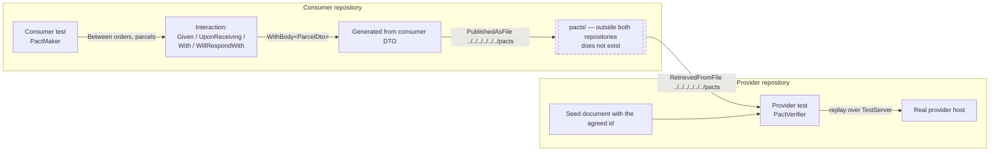

# Pattern: Consumer-Driven Contract Test Pair

## Status

**Candidate.** No approval metadata, ADR, or documented human sign-off exists in the workspace, and
the CAKE catalog for tenant `Q5SCXYFS` holds no governing decision.

## Category

testing

## Problem

When one service calls another over HTTP, the shape of the response is a contract that neither side owns
alone. The caller knows which fields it actually reads; the provider knows what it returns. Nothing
connects the two. The provider renames a field, its own tests pass, and the caller breaks in an
environment where the failure looks like a null reference rather than a broken agreement.

Integration environments catch this late and expensively. What is wanted is a check that fails in the
provider's own build, at the moment the change is made, and that says exactly which consumer expectation
was broken.

## Context

Applies to a synchronous call between two services owned by different teams or released independently.
In Pacco, one such pair is covered: a service that reads item details from another service before
accepting work. The consumer declares what it expects in its own test suite and writes the expectation
out as a file; the provider's test suite reads that file back and replays it against a real instance of
itself.

## When to Use

- Two services are released independently, so a provider change can ship without the consumer's
  knowledge ([[independent-per-repository-release]]).
- The call is synchronous and narrow — a read the caller needs before proceeding
  ([[narrow-synchronous-point-read]]).
- The consumer reads only part of the response, so the real contract is smaller than the payload and
  worth stating.
- The provider is willing to fail its own build on a consumer's expectation.

## When Not to Use

- The interaction is asynchronous. An event contract is better handled at the message-schema level.
- The two services are released together, in which case a shared build already catches the break.
- Nothing carries the expectation file from the consumer's build to the provider's. Without that
  transport the pattern degrades into two tests that appear to agree because the file they disagree
  about does not exist — which is the situation here.

## Architecture Summary

Two test projects in two repositories, joined by a file.

The **consumer** test declares an interaction: a named provider state, a description of the request, the
method and path, and the expected response — status, content type, and a body typed as the DTO the
consumer actually deserialises into. That declaration is written out as a pact file to a relative path.

The **provider** test seeds its database with a document matching the identifier the consumer's
declaration uses, boots itself in a test host, reads the pact file from a relative path, and replays
every interaction in it against itself, asserting that the responses match.

The consumer's declaration is generated from its own DTO type, so the contract tracks the type the
consumer really binds to rather than a hand-written copy. Two options soften the match: casing is
ignored, and values are ignored — the assertion is about structure and field presence, not payload
content.

The joining file is the whole mechanism, and the joining file is where this implementation stops.

## Structure / Flow

## Key Components

| Component | Responsibility |
|-----------|----------------|
| `PactMaker` (consumer side) | Declares the interaction and writes the pact file |
| `PactDefinitionOptions` | `IgnoreCasing = true`, `IgnoreContractValues = true` |
| `WithBody<TDto>()` | Derives the expected body from the consumer's own DTO type |
| `PublishedAsFile(path)` | Writes the pact to a relative directory |
| `PactVerifier` (provider side) | Reads the pact and replays it against a live host |
| `RetrievedFromFile(path)` | Reads the pact from a relative directory |
| `TestServer` over the provider's `Program` | The real provider host under test |
| `MongoDbFixture` | Seeds the document the interaction's provider state assumes |
| The consumer's DTO | The single source of the expected shape |

There is no pact broker. The transport between the two halves is a directory path.

## Data / Event / API Contracts

- **Pact identity** is the pair of participant names given to `Between(consumer, provider)` — short
  service names, lower case, matching the platform's short-name convention rather than the deployable
  names.
- **Provider state** is a short human sentence (`"Existing parcel"`) naming the precondition the provider
  must satisfy. The provider test satisfies it by inserting a document before verifying — but the link
  between the sentence and the insert is by convention only; nothing dispatches on the state name.
- **The interaction** names the request by method and path with the identifier interpolated, and the
  response by content type, status, and body type.
- **The identifier is a hard-coded literal shared by both sides.** The same value appears in the
  consumer's test as a constant and in the provider's seeded document. That constant *is* the coupling
  that makes provider states work here, and it is duplicated across two repositories with nothing
  checking that the two copies agree.
- **Matching is structural.** With values ignored, the assertion is that the response has the fields the
  consumer's DTO has, not that they hold particular data — which is the right choice for a contract test
  and makes the seeded document's field values irrelevant except for the identifier.
- **The consumer DTO is flatter than the provider's document.** The consumer binds enumerated fields as
  strings where the provider stores them as enumerations, and omits fields the provider holds. That
  difference is exactly what a consumer-driven contract is meant to express: the consumer asks for what
  it reads, not for everything that exists.
- **The pact file path** is the same relative string on both sides, resolving from each test's output
  directory up out of the repository.

## Naming Conventions

| Element | Convention | Example |
|---------|-----------|---------|
| Consumer project | `<Service>.PactConsumerTests` | `Pacco.Services.Orders.PactConsumerTests` |
| Provider project | `<Service>.PactProviderTests` | `Pacco.Services.Parcels.PactProviderTests` |
| Folder | `PACT/` inside the test project | — |
| Consumer test class | `<Provider>ApiPactConsumerTests` | `ParcelsApiPactConsumerTests` |
| Provider test class | `<Provider>ApiPactProviderTests` | `ParcelsApiPactProviderTests` |
| Consumer test method | `Given_<state>_<subject>_Should_<outcome>`, pascal case with underscores | `Given_Valid_Parcel_Id_Parcel_Should_Be_Returned` |
| Provider test method | `Pact_Should_Be_Verified` | — |
| Participant names | Short service names, lower case | `orders`, `parcels` |
| Pact directory | `pacts` | — |

The pascal-with-underscores test naming here differs from the lower-snake-case used in the layered suite
([[layered-service-test-suite]]). Two testing conventions exist in one platform.

## Service / Boundary Guidance

- **Put the consumer test in the consumer's repository and the provider test in the provider's.** Both
  sides here do this, and it is what makes the check meaningful: each half fails in its own owner's
  build.
- **Type the expected body from the consumer's own DTO.** Deriving it from the type the consumer really
  deserialises into means the contract cannot drift from the consumer's code without the test noticing.
- **Ignore values, assert structure.** A contract test that asserts on payload content becomes a
  fixture-maintenance exercise.
- **The provider must be able to satisfy the state.** The provider test boots a real host and seeds a
  real database, so verification exercises the actual route and serialiser rather than a stub.
- **Cover the pair, not the platform.** One of several synchronous service-to-service calls is covered
  here; the others have no contract test.
- **The two halves must be joined by something that crosses repositories.** They are not. This is the
  pattern's one structural gap and the reason the implementation currently proves less than it appears
  to ([[independent-per-repository-release]]).

## Security / Compliance Considerations

- **The provider test disables the secret store** (`vault.enabled: false`), which is correct — a
  contract test should not need credentials ([[vault-issued-dynamic-credentials-and-service-pki]]).
- **The provider test's configuration uses an older single-key form** of the secret-store settings than
  the services use, so the test configuration has drifted from the runtime configuration shape. It is
  harmless while the store is disabled and misleading if anyone copies it.
- **The interaction covers an unauthenticated read path.** No contract test declares an authenticated
  interaction, so nothing checks that the provider still requires a token, or that the consumer still
  sends one ([[edge-enforced-authentication-with-identity-binding]]).
- **The provider test writes to a named test database** rather than the service's real one, which keeps
  seeded fixtures out of the operational database.
- **No credential material appears in either test.**

## Observability Considerations

- **A missing pact file is not distinguishable from a passing verification** in the current setup. If the
  directory is absent, the provider test has nothing to verify and reports no failure — a green result
  that means "nothing was checked".
- **Nothing records which pacts exist or which have been verified.** With no broker, there is no place
  that answers "does the provider satisfy its consumers today".
- **The pipeline reports pass or fail by email only**, so a contract break would surface as a build
  failure with no indication that a contract was involved
  ([[independent-per-repository-release]]).
- **The consumer's build produces an artifact — the pact file — that nothing collects.** It is written
  under the build output and discarded with it.

## Failure Handling

- **Provider breaks the contract:** with the pact present, the provider's verification fails in the
  provider's own build. That is the pattern working.
- **Pact file absent:** the provider test verifies nothing. Because the file lives outside both
  repositories and is never published, this is the state today — both tests pass and no contract is
  being checked.
- **Consumer changes its DTO:** the consumer's test regenerates the pact from the new type, so the
  expectation follows the consumer automatically. The provider only learns about it if the file reaches
  it.
- **Provider state unsatisfiable:** if the seeded identifier and the consumer's constant diverge, the
  provider returns not-found and verification fails — correctly, though the message will point at a
  status mismatch rather than at the duplicated constant that caused it.
- **Provider host fails to start:** the failure surfaces in the constructor as a host startup error, not
  as a contract failure.

## Trade-offs

| Gain | Cost |
|------|------|
| A provider change breaks the provider's build, not a downstream environment | Only works if the pact file crosses repositories, which needs a broker or a pipeline step |
| The expectation is generated from the consumer's real DTO | Ties the pact to the consumer's internal type; a rename regenerates the contract silently |
| Structural matching keeps the test about shape, not data | Cannot catch a field whose meaning changed but whose type did not |
| Provider verification runs against a real host and database | Slower than a stub, and needs MongoDB available |
| One small pair is cheap to maintain | Covers one of several synchronous calls, so the assurance is narrow |
| A file-based pact needs no extra infrastructure | A missing file reads as success, which is the worst possible failure mode |

## Variants

- **Consumer half** (declare and publish) versus **provider half** (retrieve and verify) — two different
  test shapes serving one pattern.
- **File-based exchange**, as implemented, versus **broker-based exchange**, which is the same pattern
  with a service instead of a path. Not present here.
- The provider half uses a test host and a seeded database; the consumer half needs neither, and runs
  entirely offline.

## Anti-patterns

- **A pact path that resolves outside both repositories.** The relative path climbs out of the test
  output directory and past the repository root, so it only ever resolves if both repositories happen to
  be cloned side by side *and* the consumer test ran first — which per-repository CI never arranges.
- **No `pacts` directory anywhere.** It exists in neither repository and nowhere in the workspace, so
  the provider currently verifies against nothing.
- **A verification that passes when there is nothing to verify.** The provider test should fail if it
  finds no pact.
- **A shared hard-coded identifier duplicated across two repositories** with nothing asserting the copies
  agree.
- **A provider state named as a sentence but satisfied by an unconditional insert** — the state name is
  decoration until something dispatches on it.
- **Test configuration using an older settings shape** than the runtime configuration it is meant to
  mirror.
- **One covered pair out of several synchronous calls**, which risks reading as "we do contract testing".

## Evidence

- **ADR:** none — no ADR exists in any cloned repository or in the CAKE catalog for tenant `Q5SCXYFS`.
- **Repo:** `hianshul100_Pacco.Services.Orders` (consumer), `hianshul100_Pacco.Services.Parcels`
  (provider).
- **Service:** `orders-service` → `parcels-service`.
- **File:**
  `hianshul100_Pacco.Services.Orders/tests/Pacco.Services.Orders.PactConsumerTests/PACT/ParcelsApiPactConsumerTests.cs:14`
  — the hard-coded identifier constant; `:19-22` — `PactDefinitionOptions { IgnoreCasing = true,
  IgnoreContractValues = true }`; `:23` — `.Between("orders", "parcels")`; `:24-27` — `Given("Existing
  parcel")` and `UponReceiving(...)`; `:28` — the request method and path; `:29-33` —
  `WillRespondWith(...)` with content type, status and `WithBody<ParcelDto>()`; `:34` —
  `PublishedAsFile("../../../../../../pacts")`;
  `hianshul100_Pacco.Services.Orders/src/Pacco.Services.Orders.Application/DTO/ParcelDto.cs:7-10` — the
  consumer's four fields, with the enumerated fields typed as `string`;
  `hianshul100_Pacco.Services.Parcels/tests/Pacco.Services.Parcels.PactProviderTests/PACT/ParcelsApiPactProviderTests.cs:22-29`
  — `InsertAsync(Parcel)` then `PactVerifier.Create(_httpClient).Between("orders",
  "parcels").RetrievedFromFile("../../../../../../pacts").VerifyAsync()`; `:31-38` — the seeded document
  carrying **the same literal identifier** as the consumer's constant, with enumerated field types;
  `:40-48` — the constructor: `MongoDbFixture<ParcelDocument, Guid>("test-parcels-service", "parcels")`,
  `new TestServer(Program.GetWebHostBuilder(new string[0]))`, `AllowSynchronousIO = true`;
  `.../PactProviderTests/appsettings.json` — `vault.enabled: false` with the older flat
  `key: "parcels-service/settings"` field, where the services use the nested settings shape;
  the contract library is referenced in both test projects at the same version.
  **`find . -type d -name pacts` across the workspace returns nothing** — the directory exists in neither
  repository nor at the workspace root.
- **API/Event:** the `GET /parcels/{parcelId}` route, listed in
  [`../../baselines/api-inventory.md`](../../baselines/api-inventory.md); this is the same call described
  in [[narrow-synchronous-point-read]].
- **Deployment/Config:** the provider half needs MongoDB, which `hianshul100_Pacco/compose/*.yml`
  provides locally; the CI environment provides none, and no pipeline step publishes or fetches a pact
  file.
- **Notes:** `architecture-baseline.md` §7.3. **Conflict — none between documentation and source.** The
  gap between what the test declares and what the environment provides is a property of the source and
  the pipeline configuration, both read directly.

## Related ADRs

None. No ADR, decision record, or RFC exists in the workspace, and the CAKE graph for tenant
`Q5SCXYFS` returned zero nodes.

## Related Patterns

- [[narrow-synchronous-point-read]] — the call this contract covers.
- [[layered-service-test-suite]] — the platform's other testing pattern, with a different naming
  convention.
- [[independent-per-repository-release]] — the per-repository pipeline the pact file cannot cross.
- [[database-per-service-with-document-mapping]] — the document the provider seeds.
- [[dispatcher-bound-cqrs-endpoints]] — the route the verification replays against.

## Recommendation

**Adopt the shape; fix the join before relying on it.** The design is right in every part that is
present: the consumer declares what it reads, the expectation is generated from the DTO the consumer
really binds to, matching is structural rather than value-based, and the provider verifies against a
real host with a real database. What is missing is the one thing that makes a contract test a contract
test — a path for the pact file from the consumer's build to the provider's. Today that path climbs out
of both repositories to a directory that does not exist, so the provider test passes by verifying
nothing. Two changes make this real: publish the pact somewhere both pipelines can reach, and make the
provider test fail when it finds no pact. Until then the pair is a well-written demonstration rather
than a check, and it should not be described as coverage. Once it works, the same shape is worth
extending to the platform's other synchronous service-to-service reads.

## Assumptions, Blockers & Open Questions

> [!IMPORTANT]
> This document contains unresolved items that require attention before or during implementation. Review and resolve before merging downstream artifacts. Each item below is tagged **[ACTION NOW]** (a human must decide or confirm it before this work can safely proceed) or **[handled later by <stage>]** (a named later stage owns and will prove it) — read the tags first to see what, if anything, is yours to act on.

### Assumptions

| # | Assumption | Rationale | Impact if Wrong | Validation Path |
|---|------------|-----------|-----------------|-----------------|
| A1 | The pact pair was written as a demonstration of the technique rather than as an enforced check | The file path resolves outside both repositories, nothing publishes the pact, and no pipeline step connects the two halves | If it was meant to be enforced, the platform has believed for some time that a contract is being checked when none is | Ask the owners of the two repositories whether the pact has ever been produced and verified together |
| A2 | The provider's verification reports success rather than an error when the pact directory is absent | Both repositories' test suites are described as passing, and the directory exists nowhere | If it errors instead, the provider's test has been failing whenever it runs, and the pattern's status is different from what is written here | Run the provider test with no pact directory present and record what it reports |

### Blockers

| # | Blocker | Blocking What | Owner / Next Step | Target Resolution |
|---|---------|---------------|-------------------|-------------------|
| B1 | **[ACTION NOW]** The pact file is written to and read from a path outside both repositories, and no `pacts` directory exists anywhere — so the provider currently verifies against nothing | Any claim that the `orders` → `parcels` contract is checked. Both tests pass today without a contract existing | Owner of the two repositories: decide between a pact broker and a pipeline artifact hand-off, then make the provider test fail when no pact is found | Before the contract test is counted as coverage, or before either service's response shape is changed |

### Open Questions

| # | Question | Why It Matters | Proposed Answer (if any) | Decision Owner |
|---|----------|----------------|--------------------------|----------------|
| Q1 | **[ACTION NOW]** Broker or pipeline artifact for carrying the pact between repositories? | This is the choice that decides whether the pattern works at all; the two options differ in infrastructure cost and in whether verification results are queryable afterwards | A broker if more pairs are planned, since it also answers "which consumers does this provider satisfy". A published build artifact if this stays one pair | Platform owner, with the owners of both repositories |
| Q2 | **[ACTION NOW]** Should the provider test fail when it finds no pact file? | Silent success is the worst failure mode a contract test can have — it reports assurance that does not exist | Yes. A verification with nothing to verify should be an error, not a pass | Owner of `hianshul100_Pacco.Services.Parcels` |
| Q3 | **[handled later by the design stage]** Should the other synchronous service-to-service reads get contract tests? | Several services read from others over HTTP before acting; one pair is covered, so a provider change elsewhere still surfaces only in an integration environment | Yes once the transport in Q1 exists — extend to the reads that gate a write, since those are where a break has the widest effect | Platform owner, with the owners of the calling services |
| Q4 | **[handled later by the design stage]** Should the shared identifier be derived rather than duplicated? | The same literal is hard-coded in two repositories, and nothing detects the two copies diverging; the failure would appear as a status mismatch | Carry it in the pact's provider state and have the provider seed from that, so there is one source | Owner of `hianshul100_Pacco.Services.Parcels` |
| Q5 | **[handled later by the design stage]** Should the provider test's configuration be brought in line with the runtime settings shape? | It uses an older single-key form of the secret-store settings; harmless while the store is disabled, misleading as a template | Yes, update it to the shape the services use, keeping the store disabled | Owner of `hianshul100_Pacco.Services.Parcels` |
| Q6 | **[handled later by the design stage]** Should the two test-naming conventions in the platform be reconciled? | The contract tests use pascal case with underscores; the layered suite uses lower snake case. Both read well, but a reader moving between repositories meets two conventions | Pick one and note it where developers will see it; neither is better, and consistency is the whole benefit | Platform owner |
