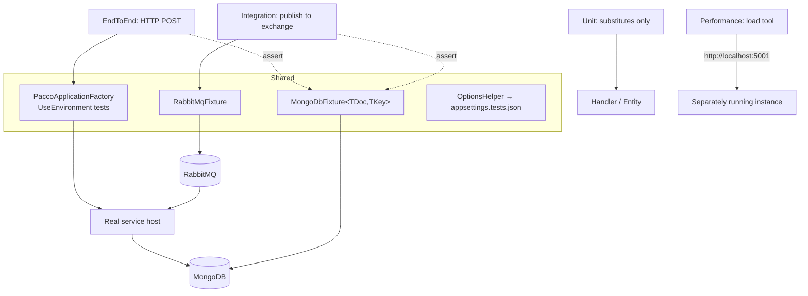

# Pattern: Layered Service Test Suite

## Status

**Candidate.** No approval metadata, ADR, or documented human sign-off exists in the workspace, and
the CAKE catalog for tenant `Q5SCXYFS` holds no governing decision.

## Category

testing

## Problem

A service built in layers can be tested at any of them, and each level answers a different question.
Unit tests say the logic is right and say nothing about whether the service is wired up. End-to-end
tests say the wiring works and are slow and vague about why they failed. Picking one level means
accepting the other's blind spot; mixing them without structure produces a suite where nobody can tell
what a failure means or which tests need infrastructure running.

The particular gap in a message-driven service is that the HTTP path and the message path reach the same
handler by different routes, and testing one proves nothing about the other.

## Context

Applies to services with a layered structure and more than one entry path. One Pacco service —
`availability-service` — has a full suite: unit tests over handlers and entities, integration tests that
publish real messages, end-to-end tests over the HTTP surface, performance tests against a running
instance, and a shared project holding the fixtures the others use.

## When to Use

- The service has real domain logic worth testing in isolation.
- Commands arrive by more than one transport and both paths need proving.
- Infrastructure can be run locally, so tests can use a real database and broker rather than fakes.
- The team wants a failure's level to tell them where to look.

## When Not to Use

- The service is a thin pass-through with no logic of its own. Four levels over a projection is
  ceremony.
- Infrastructure cannot be started in the test environment, which makes the integration and end-to-end
  levels unrunnable and leaves a suite that only pretends to be layered.
- Tests must run in a pipeline that provides no services, which is the situation this platform's CI is
  actually in.

## Architecture Summary

Five projects, named by level.

**Shared** holds the machinery: a web-application factory that boots the real service host under the
`tests` environment name, a generic MongoDB fixture parameterised by document and key type, a RabbitMQ
fixture that publishes and subscribes on real exchanges, and an options helper that reads
`appsettings.tests.json`.

**Unit** substitutes every dependency and exercises handlers and entities directly — arrange with
substitutes, act on the handler, assert on both the thrown exception and the calls the handler made.

**End-to-end** boots the service through the factory, posts to its real route, and asserts on the HTTP
response *and* on the document that reached MongoDB. So one test covers routing, handling, and
persistence.

**Integration** covers the other entry path: it publishes a command to the real exchange, subscribes to
the event the service should emit in response, and completes a `TaskCompletionSource` when the expected
document appears. The assertion is the same as the end-to-end one; only the way in differs.

**Performance** drives a running instance over HTTP with a load tool and asserts on throughput.

The test environment is a configuration overlay: `appsettings.tests.json` disables Consul, Fabio and
Jaeger while leaving MongoDB and RabbitMQ pointed at real local instances. So the service under test is
the real service with its discovery and telemetry turned off.

## Structure / Flow

## Key Components

| Component | Responsibility |
|-----------|----------------|
| `PaccoApplicationFactory<TEntryPoint>` | Boots the real host with `UseEnvironment("tests")` |
| `MongoDbFixture<TEntity, TKey>` | Insert and fetch documents directly, for arranging and asserting |
| `MongoDbFixtureInitializer` | Database setup; present but its call site is commented out |
| `RabbitMqFixture` | Publishes commands and subscribes to events on real exchanges |
| `OptionsHelper` | Binds a configuration section from `appsettings.tests.json` |
| `appsettings.tests.json` | Disables Consul, Fabio and Jaeger; keeps MongoDB and RabbitMQ real |
| xUnit + Shouldly + NSubstitute | Test framework, assertions, substitutes |
| A load-testing package | Drives the performance level |

## Data / Event / API Contracts

- **Test naming:** `given_<condition>_<action>_should_<outcome>` at the unit level;
  `<endpoint>_should_<outcome>` at the end-to-end level. Lower case with underscores throughout, which
  reads as a sentence in the runner output.
- **Structure:** an `Act` expression at the top of the class, `[Fact]` methods next, and an
  `#region Arrange` at the bottom holding fields and the constructor. Arrange is placed last on purpose
  — the tests read as behaviour first, setup second.
- **Assertions are paired:** the unit test asserts the exception type *and* that `UpdateAsync` and
  `ProcessAsync` were called; the end-to-end test asserts the status code, the `Location` header, and
  the persisted document.
- **Integration synchronisation:** `SubscribeAndGet<TMessage, TEntity>` declares the exchange as a
  durable topic, declares a queue named `test_<snake_case_message>`, binds it on the snake-cased message
  name, sets a prefetch of one, and consumes with auto-acknowledgement — returning a
  `TaskCompletionSource` the test awaits.
- **Exchange and routing-key conventions in the fixture mirror the service's** — `snake_case` names,
  durable topic exchanges — so the fixture is exercising the real convention, not a test-only one
  ([[service-owned-topic-exchange-messaging]]).
- **Performance thresholds** are literals in the test: a fixed URL, a three-second duration, and an
  expected request rate asserted against both throughput and success count.
- **Test environment names:** the factory uses `tests`; `scripts/test.sh` in one repository exports
  `tests`; `scripts/start-test.sh` in another exports `test`. Three of four agree.

## Naming Conventions

| Element | Convention | Example |
|---------|-----------|---------|
| Project | `<Service>.Tests.<Level>` | `Pacco.Services.Availability.Tests.Unit` |
| Level names | `Unit`, `Integration`, `EndToEnd`, `Performance`, `Shared` | — |
| Folder inside a level | Mirrors the source layout, or the transport | `Applications/Handlers/`, `Core/Entities/`, `Sync/`, `Async/` |
| Test method | Lower snake case, reads as a sentence | `given_invalid_resource_id_reserve_resource_should_throw_an_exception` |
| Fixture | `<Dependency>Fixture` | `MongoDbFixture`, `RabbitMqFixture` |
| Test queue | `test_<snake_case_message>` | `test_resource_added` |
| Environment | `tests` | — |

The `Sync/` and `Async/` folders are the most useful naming decision here: they say that the axis being
tested is the transport, not the feature.

## Service / Boundary Guidance

- **Put fixtures in a shared project, tests in level projects.** The fixtures are the expensive part and
  the only part worth reusing; keeping them separate stops a level project depending on another level.
- **Test both entry paths against the same assertion.** The end-to-end and integration tests for adding
  a resource assert the identical outcome and differ only in how the command arrives. That is the
  clearest possible statement of what "both paths work" means.
- **Boot the real host, not a stand-in.** The factory starts the service's actual `Program`, so
  registration, decoration and route mapping are all under test — which matters in a platform where the
  HTTP surface is a route table rather than controllers
  ([[dispatcher-bound-cqrs-endpoints]]).
- **Turn off discovery and telemetry, not persistence.** `appsettings.tests.json` disables Consul, Fabio
  and Jaeger — the things that would try to register with infrastructure the test does not need — and
  leaves MongoDB and RabbitMQ real, because those are what the assertions are about.
- **Assert on state, not only on responses.** Every end-to-end and integration test here reads the
  document back from MongoDB.
- **One service has this suite; nine do not.** The pattern is real, well-formed, and applied once
  ([[independent-per-repository-release]]).

## Security / Compliance Considerations

- **Tests run against a real MongoDB and RabbitMQ** at the addresses in `appsettings.tests.json`. Those
  are `localhost` in the committed file, but nothing in the test code prevents pointing them elsewhere,
  and the fixtures insert and delete data directly.
- **`appsettings.tests.json` carries the same committed Seq API key** as every other configuration file
  and leaves the Seq sink enabled, so test runs write to the shared log store.
- **The provider-side test configuration in another repository disables Vault** (`vault.enabled: false`),
  which is the right call — a test should not depend on a secret store
  ([[vault-issued-dynamic-credentials-and-service-pki]]).
- **No test covers authorization.** There is no test that an unauthenticated caller is rejected, no test
  of the ownership guards, and no test of the role checks — which is notable given that those guards
  currently pass when the caller is unauthenticated
  ([[transport-agnostic-caller-context]]).
- **The performance test targets a fixed URL** on `localhost`. Run against a shared environment it would
  be a load generator pointed at someone else's service.

## Observability Considerations

- **The pipeline records nothing about tests.** No coverage threshold is enforced, no test count or
  duration is tracked, and the only signal is pass or fail by email
  ([[independent-per-repository-release]]).
- **Coverage collection is referenced but not configured** — the coverage package appears in the test
  projects with no threshold and no report step, so it produces data nobody reads. Two different versions
  of it are referenced across the five projects.
- **The integration test has no timeout of its own.** It awaits a `TaskCompletionSource` that is
  completed by a message arriving; if the message never arrives, the test hangs until the runner's own
  limit, and the failure says nothing about why.
- **Auto-acknowledgement in the subscribe fixture** means a message is acknowledged before the handler
  callback finishes, so a failing assertion inside the callback cannot be distinguished from a message
  never arriving.
- Test runs write to the same Seq instance as everything else, so test output and real output share a
  log store with no tag separating them — `tags: {}` is empty in the test configuration too
  ([[structured-logging-with-property-redaction]]).

## Failure Handling

- **Infrastructure not running:** the fixtures construct a Mongo client and a RabbitMQ connection in
  their constructors, so the failure surfaces as a connection error during test setup rather than as an
  assertion failure. Clear enough, but it means the whole level fails as one.
- **Message never arrives:** the integration test hangs on its `TaskCompletionSource` until the runner
  times out.
- **Leftover data between runs:** the fixtures insert and dispose, and the database initializer's call
  site is commented out, so tests depend on identifiers being fresh rather than on a clean database.
  Tests generate new `Guid`s, which is what makes that work.
- **Performance test with nothing running:** every request fails and the throughput assertion fails —
  correct, but indistinguishable from a genuine performance regression.
- **CI:** this repository's pipeline does not run `test.sh` at all, so none of these failures is
  reachable from the pipeline.

## Trade-offs

| Gain | Cost |
|------|------|
| A failure's level says where to look | Five projects to maintain for one service |
| Both entry paths proven against the same assertion | The integration level needs a real broker, so it cannot run in this CI |
| Real host, real database, real broker — no wiring goes untested | Slow, and dependent on infrastructure being up |
| Fixtures shared, tests not | The shared project is a coupling point across all four levels |
| Arrange-last structure makes tests read as behaviour | Unconventional; readers expect setup first |
| Performance is a test, so a regression can fail a build | Thresholds are literals in the source and a fixed URL, so they are environment-specific |

## Variants

- **Unit level** with substitutes only, versus **integration and end-to-end** with real infrastructure,
  versus **performance** against a separately running instance.
- **`Sync/` versus `Async/` folders** — the same behaviour reached over HTTP and over messaging.
- **This full suite** (one service) versus **contract tests only** (two services) versus **no tests at
  all** (seven services and the gateway).

## Anti-patterns

- **A suite in one repository and nothing in nine.** The pattern is good; its adoption is the problem.
- **A pipeline that does not run the suite it has.** This repository's `.travis.yml` omits the test step
  while `scripts/test.sh` sits beside it.
- **Coverage collection with no threshold and no report.** It costs build time and changes no decision,
  and it is referenced at two different versions in one solution.
- **Auto-acknowledgement in a test consumer**, which conflates "assertion failed" with "message never
  arrived".
- **No timeout on a test that waits for a message.**
- **Hard-coded performance thresholds and a hard-coded URL** in the test source.
- **A commented-out database initializer**, leaving test isolation to fresh identifiers rather than to a
  clean database.
- **No test of any authorization guard**, in a platform whose guards currently fail open.

## Evidence

- **ADR:** none — no ADR exists in any cloned repository or in the CAKE catalog for tenant `Q5SCXYFS`.
- **Repo:** `hianshul100_Pacco.Services.Availability` — the only repository with a layered suite.
- **Service:** `availability-service`.
- **File:**
  `hianshul100_Pacco.Services.Availability/tests/Pacco.Services.Availability.Tests.Shared/Factories/PaccoApplicationFactory.cs:6-10`
  — `WebApplicationFactory<TEntryPoint>` with `UseEnvironment("tests")` (`:9`);
  `.../Tests.Shared/Fixtures/MongoDbFixture.cs:10-40` — generic over document and key (`:10`), options
  read through `OptionsHelper` (`:22`), **`//InitializeMongo();` commented out** (`:27`), `InsertAsync`
  and `GetAsync` (`:34-40`);
  `.../Tests.Shared/Fixtures/RabbitMqFixture.cs:19-37` (connection from `rabbitMq` options),
  `:39-50` (`PublishAsync` with snake-cased routing key, generated message and correlation ids),
  `:52-89` (`SubscribeAndGet`: durable topic exchange at `:57-61`, queue `test_<snake_case>` at `:63`,
  bind at `:71`, prefetch of one at `:72`, **`autoAck: true`** at `:85`), `:91-94` (the snake-case
  helper);
  `.../Tests.Shared/Helpers/OptionsHelper.cs:7-23` — binds a section from `appsettings.tests.json`
  (`:9`), `optional: true` plus environment variables (`:21-22`);
  `.../Tests.Unit/Applications/Handlers/ReserveResourceHandlerTests.cs:20` (the `Act` expression),
  `:22-29` (exception assertion), `:31-48` (substitute returns at `:36` and `:42`, received-call
  assertions at `:46-47`), `:50-60` (`#region Arrange` with `Substitute.For<…>`);
  `.../Tests.Unit/Core/Entities/CreateResourceTests.cs`;
  `.../Tests.EndToEnd/Sync/AddResourceTests.cs:18` (`IClassFixture<PaccoApplicationFactory<Program>>`),
  `:20-21` (`Act` posting to `resources`), `:23-32` (status code), `:34-45` (`Location` header),
  `:47-59` (**asserting on the persisted document**), `:66-71` (constructor wiring the Mongo fixture and
  the client);
  `.../Tests.Integration/Async/AddResourceTests.cs:16` (`Act` publishing to the exchange), `:18-34`
  (subscribe-then-publish, awaiting the `TaskCompletionSource` at `:29`, same assertions as the
  end-to-end test), `:38` (`private const string Exchange = "availability"`);
  `.../Tests.Performance/PerformanceTests.cs:14-18` (hard-coded `http://localhost:5001`, three-second
  duration, expected rate), `:24-28` (throughput and success-count assertions);
  `.../Tests.EndToEnd/….csproj:20-34` — xUnit, Shouldly, the test SDK, and project references to the Api,
  Infrastructure and Shared projects; NSubstitute and the load-testing package appear in the Unit and
  Performance projects respectively; the coverage package appears at two different versions across the
  five projects;
  `.../src/Pacco.Services.Availability.Api/appsettings.tests.json` — `consul.enabled: false`,
  `fabio.enabled: false`, `jaeger.enabled: false`, Seq sink enabled with the same committed key;
  **`hianshul100_Pacco.Services.Availability/.travis.yml` omits the `./scripts/test.sh` step**;
  `hianshul100_Pacco.Services.Parcels/scripts/test.sh` exports `ASPNETCORE_ENVIRONMENT=tests` while
  `scripts/start-test.sh` exports `test`.
- **API/Event:** the tests exercise the `resources` HTTP route and the `availability` exchange, both
  listed in [`../../baselines/api-inventory.md`](../../baselines/api-inventory.md) and
  [`../../baselines/architecture-baseline.md`](../../baselines/architecture-baseline.md) §4.2.
- **Deployment/Config:** the suite requires MongoDB and RabbitMQ, which
  `hianshul100_Pacco/compose/mongo-rabbit-redis.yml` provides; the CI environment provides neither.
- **Notes:** `architecture-baseline.md` §7.1–§7.2, §11.3. **Conflict — none between documentation and
  source.** The gap between `scripts/test.sh` existing and the pipeline not calling it is a difference
  between two source files; source is authoritative and the pipeline determines what runs.

## Related ADRs

None. No ADR, decision record, or RFC exists in the workspace, and the CAKE graph for tenant
`Q5SCXYFS` returned zero nodes.

## Related Patterns

- [[consumer-driven-contract-test-pair]] — the only other testing pattern in the platform.
- [[independent-per-repository-release]] — runs `test.sh`, except in this repository.
- [[dispatcher-bound-cqrs-endpoints]] — the route table the end-to-end tests prove is wired.
- [[service-owned-topic-exchange-messaging]] — the exchange conventions the fixture reproduces.
- [[inward-dependency-service-skeleton]] — the layering the levels correspond to.
- [[database-per-service-with-document-mapping]] — the documents the fixtures assert on.

## Recommendation

**Adopt, and replicate it.** This is a well-built suite: naming that reads as sentences, arrange placed
last so tests read as behaviour, fixtures shared and levels separate, and — the best decision in it —
end-to-end and integration tests that assert the same outcome and differ only in whether the command
arrived over HTTP or over the broker. That pair is exactly the right way to test a service with two
entry paths. Four things hold it back. It exists in one repository out of ten. The pipeline in that
repository does not run it. It needs MongoDB and RabbitMQ, which the CI environment does not provide, so
only the unit level could run there even if the step were restored. And no test touches authorization,
which is where the platform's known defects are. The most valuable next step is not more levels — it is
the unit level, copied into the other services, running in CI.

## Assumptions, Blockers & Open Questions

> [!IMPORTANT]
> This document contains unresolved items that require attention before or during implementation. Review and resolve before merging downstream artifacts. Each item below is tagged **[ACTION NOW]** (a human must decide or confirm it before this work can safely proceed) or **[handled later by <stage>]** (a named later stage owns and will prove it) — read the tags first to see what, if anything, is yours to act on.

### Assumptions

| # | Assumption | Rationale | Impact if Wrong | Validation Path |
|---|------------|-----------|-----------------|-----------------|
| A1 | `appsettings.tests.json` reaches the test output directory through the referenced Api project, so `OptionsHelper` finds it | No test project copies the file explicitly, and the web SDK copies `appsettings*.json` to output and on to referencing projects | `OptionsHelper` reads with `optional: true`, so a missing file would bind empty options silently, and the fixtures would fail on a null connection string with a misleading message | Run the suite with infrastructure up and confirm the fixtures connect; check for the file in the test project's output directory |
| A2 | The integration and end-to-end levels are expected to be run locally by developers, not in CI | Both need a real MongoDB and RabbitMQ, and the CI configuration starts no services | Those levels would be silently unrunnable everywhere, and the suite would be providing less assurance than its structure suggests | Ask the owner how the suite is run today; check whether any CI job has ever executed the integration level |

### Open Questions

| # | Question | Why It Matters | Proposed Answer (if any) | Decision Owner |
|---|----------|----------------|--------------------------|----------------|
| Q1 | **[ACTION NOW]** Should the other nine services get at least a unit-test level? | One service has tests; nine have none, and the platform's known defects — a delete that does not delete, a guard that ignores its own predicate, ownership checks that pass when unauthenticated — are all in untested services | Yes. Start with the unit level only: it needs no infrastructure, so it runs in CI as it stands, and it is where the known defects would have been caught | Platform owner, with the owners of the nine services |
| Q2 | **[ACTION NOW]** Should CI provide MongoDB and RabbitMQ so the integration and end-to-end levels can run? | Without them, three of four levels are developer-only, and a suite that only runs on someone's machine stops being run | Yes if these levels are meant to gate releases; the compose files already declare what is needed. Otherwise say plainly that they are a local tool | Platform owner, with the operator |
| Q3 | **[handled later by the design stage]** Should the subscribe fixture use manual acknowledgement and a timeout? | With auto-acknowledgement and no timeout, a failing assertion inside the consumer callback and a message that never arrives look identical — the test just hangs | Yes to both; it turns a hang into a failure that says which of the two happened | Owner of `hianshul100_Pacco.Services.Availability` |
| Q4 | **[handled later by the design stage]** Should there be tests for the authorization guards? | Nothing tests that an unauthenticated caller is rejected, an ownership check holds, or a role check works — and the guards are currently written so an unauthenticated caller passes | Yes, and write them before fixing the guards so the fix is demonstrably a fix | Platform security owner, with the owners of the seven layered services |
| Q5 | **[handled later by the design stage]** Should coverage collection be configured or removed? | The package is referenced at two different versions across five projects, with no threshold and no report step, so it costs build time and informs nothing | Either set a threshold and publish a report, or remove it. Referenced-but-unused tooling reads as coverage that exists | Owner of `hianshul100_Pacco.Services.Availability` |
