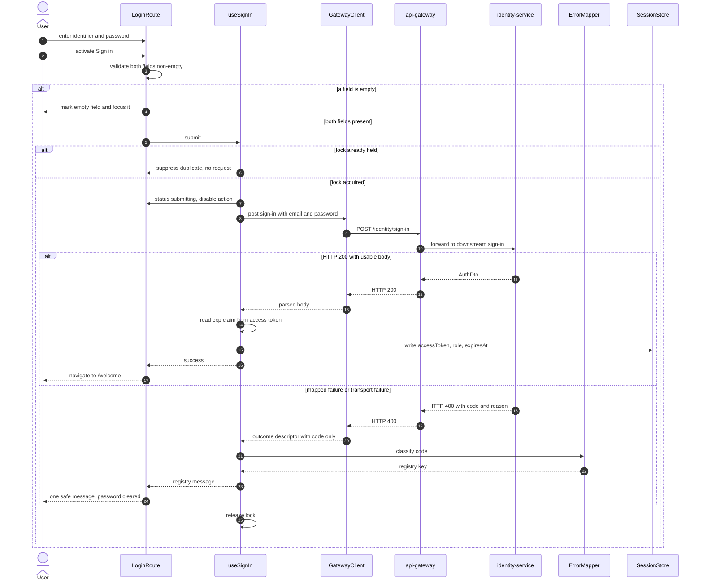

## Table of contents

- [Notation](#notation)
- [§L.1 Document Control](#l1-document-control)
  - [Execution metadata](#execution-metadata)
- [§L.2 Wave Scope](#l2-wave-scope)
  - [§L.2.1 Wave × DO assignment — copied from HL ESD §2.8, not re-derived](#l21-wave--do-assignment--copied-from-hl-esd-28-not-re-derived)
  - [§L.2.2 In scope for wave-1](#l22-in-scope-for-wave-1)
  - [§L.2.3 Out of scope for wave-1](#l23-out-of-scope-for-wave-1)
  - [§L.2.4 Binding Rule Index](#l24-binding-rule-index)
- [§L.3 Delivery Outcome Low-Level Design](#l3-delivery-outcome-low-level-design)
  - [DO1 — Common Pacco Login Experience](#do1--common-pacco-login-experience)
    - [1. Purpose in this wave](#1-purpose-in-this-wave)
    - [2. User-visible behaviour](#2-user-visible-behaviour)
    - [3. Component and module design](#3-component-and-module-design)
    - [4. State, data and configuration design](#4-state-data-and-configuration-design)
    - [5. Execution steps](#5-execution-steps)
    - [6. Interface and contract usage](#6-interface-and-contract-usage)
    - [7. Platform configuration change](#7-platform-configuration-change)
    - [8. Error handling and resilience](#8-error-handling-and-resilience)
    - [9. Security, privacy and observability](#9-security-privacy-and-observability)
    - [10. Deliberate non-goals of this wave](#10-deliberate-non-goals-of-this-wave)
- [§L.4 Canonical State Machine — reference only](#l4-canonical-state-machine--reference-only)
- [§L.5 Build order within the wave](#l5-build-order-within-the-wave)
- [§L.6 Test design](#l6-test-design)
  - [§L.6.1 Levels and what each level is for](#l61-levels-and-what-each-level-is-for)
  - [§L.6.2 Fixture and determinism policy](#l62-fixture-and-determinism-policy)
  - [§L.6.A Testing Automation Requirements — DO1](#l6a-testing-automation-requirements--do1)
    - [§L.6.A.1 E2E scenarios owned by wave-1](#l6a1-e2e-scenarios-owned-by-wave-1)
    - [§L.6.A.2 API-level integration tests](#l6a2-api-level-integration-tests)
    - [§L.6.A.3 UI and component tests](#l6a3-ui-and-component-tests)
    - [§L.6.A.4 Negative and security-behaviour anchors](#l6a4-negative-and-security-behaviour-anchors)
    - [§L.6.A.5 Non-functional test requirements](#l6a5-non-functional-test-requirements)
    - [§L.6.A.6 Coverage obligations](#l6a6-coverage-obligations)
- [§L.7 Non-functional implementation contract](#l7-non-functional-implementation-contract)
  - [§L.7.1 NFR gates carried by wave-1](#l71-nfr-gates-carried-by-wave-1)
  - [§L.7.2 The four minimum client rules](#l72-the-four-minimum-client-rules)
  - [§L.7.3 Business-rule placement](#l73-business-rule-placement)
  - [§L.7.4 FMEA](#l74-fmea)
- [§L.8 Cross-wave contracts and deferrals](#l8-cross-wave-contracts-and-deferrals)
  - [§L.8.1 Shared surfaces — single owner each](#l81-shared-surfaces--single-owner-each)
  - [§L.8.2 Deferred to wave-2 — each with its matching owner](#l82-deferred-to-wave-2--each-with-its-matching-owner)
  - [§L.8.3 What wave-2 must not do with wave-1's output](#l83-what-wave-2-must-not-do-with-wave-1s-output)
  - [§L.8.4 Contract ledger position](#l84-contract-ledger-position)
- [§L.9 Implementation binding](#l9-implementation-binding)
- [§L.10 Architecture conformance](#l10-architecture-conformance)
  - [§L.10.1 Governing decisions honoured](#l101-governing-decisions-honoured)
  - [§L.10.2 Capability placement](#l102-capability-placement)
  - [§L.10.3 Declared exception](#l103-declared-exception)
- [§L.11 Source requirement continuity](#l11-source-requirement-continuity)
  - [§L.11.1 Every raw requirement, traced](#l111-every-raw-requirement-traced)
  - [§L.11.2 Requirement coverage summary for this wave](#l112-requirement-coverage-summary-for-this-wave)
- [§L.12 Visual and runtime contract](#l12-visual-and-runtime-contract)
  - [§L.12.1 Design source inventory](#l121-design-source-inventory)
  - [§L.12.2 Consumed endpoints](#l122-consumed-endpoints)
  - [§L.12.3 Dev runbook](#l123-dev-runbook)
  - [§L.12.4 Reuse versus create](#l124-reuse-versus-create)
  - [§L.12.5 Design-token contract](#l125-design-token-contract)
  - [§L.12.6 UI screen coverage matrix](#l126-ui-screen-coverage-matrix)
- [§L.13 Review Resolution History](#l13-review-resolution-history)
- [Assumptions, Blockers & Open Questions](#assumptions-blockers--open-questions)
  - [Assumptions](#assumptions)
  - [Blockers](#blockers)
  - [Open Questions](#open-questions)

# Low-Level Engineering Solution Design — 13652 · wave-1

**Delivery Outcome owned by this wave: `DO1` — Common Pacco Login Experience.**

This document is the implementation-grade design for wave 1 of work item 13652. It is subordinate to
`docs/specs/13652/SPECIFICATION.md` (the parent HL ESD) and to
`docs/specs/13652/solution-design.md` (the finalized decision record). Where this document and either
of those disagree, they win and the conflict is a defect in this file.

## Notation

| Symbol | Meaning |
|---|---|
| ✅ | Confirmed against source at the cited path |
| 🎯 | Target state — to be built by this wave |
| ⚠️ | Carries a non-blocking assumption or a stated limitation |
| 🚫 | Blocked, forbidden, or a hard zero-target |
| ❓ | Unverified — needs observation, not reasoning |

## §L.1 Document Control

| Field | Value |
|---|---|
| Work item | 13652 |
| Capability slug | `13652` |
| Wave | **wave-1** of 2 |
| Delivery Outcomes owned | `DO1` — Common Pacco Login Experience |
| Parent HL ESD | `docs/specs/13652/SPECIFICATION.md` |
| Decision record | `docs/specs/13652/solution-design.md` |
| Sibling wave | `docs/specs/13652/LOW_LEVEL_SPEC-13652-wave-2.md` (`DO2`) |
| Spec tier | Low-level (implementation-grade) |
| Primary write repository | `Pacco.Web` |
| Configuration repository touched | `Pacco.APIGateway` — one key, four files |
| Contracts root | `docs/specs/13652/contracts/` |
| Contract ledger | `docs/specs/13652/contracts/CONTRACT_LEDGER.md` |
| Owner / reviewer | 🚫 None recorded anywhere in the workspace — ASM-9, blocker `B1` |
| Status | Proposed |

### Execution metadata

```json
{
  "capability_slug": "13652",
  "wave_index": 1,
  "total_waves": 2,
  "do_ids": ["DO1"],
  "spec_tier": "low_level",
  "depends_on_waves": [],
  "provides_to_waves": [2],
  "repositories_written": ["Pacco.Web", "Pacco.APIGateway"],
  "contracts_root": "docs/specs/13652/contracts/",
  "contract_ledger_path": "docs/specs/13652/contracts/CONTRACT_LEDGER.md",
  "new_contract_artifacts_authored": 0,
  "requires_feature_flags": false,
  "requires_incremental_rollout": false,
  "has_agentic_workflow_scope": false,
  "has_data_migration": false,
  "has_ui_scope": true,
  "design_source": "four static attachments, no Figma URL"
}
```

## §L.2 Wave Scope

### §L.2.1 Wave × DO assignment — copied from HL ESD §2.8, not re-derived

| Wave | LL spec file | DO IDs owned | Depends on |
|---|---|---|---|
| wave-1 | `docs/specs/13652/LOW_LEVEL_SPEC-13652-wave-1.md` | `DO1` | — |
| wave-2 | `docs/specs/13652/LOW_LEVEL_SPEC-13652-wave-2.md` | `DO2` | wave-1 |

🚫 This matrix is locked. This wave owns `DO1` and nothing else. It does not implement, restate or
pre-empt any `DO2` behaviour, and it does not renumber or merge waves.

### §L.2.2 In scope for wave-1

1. The `Pacco.Web` application shell — the project, its build, its router and its configuration
   injection point. This is the platform's first frontend build.
2. The `/login` route and its component tree: `LoginRoute`, `LoginCard`, `IdentifierField`,
   `PasswordField`, `FormMessage`, `BrandFrame` (HL §11.2).
3. Required-field validation that blocks submission entirely in the browser (FR-3).
4. The single-in-flight submit lock (FR-4, BR-4).
5. `useSignIn` — the only caller of `identitySignIn` — and the gateway client module (FR-5).
6. The error mapper: the closed message registry and the `code`-keyed selection (FR-8, `ADR-023`).
7. `SessionStore` — the whole module, including the read and clear operations wave-2 consumes
   (FR-7, §L.8.1).
8. `SessionNotice` — the `role="status"` region on `/login` and the `session_expired` entry in the
   message registry, authored here because the registry has exactly one owner (§L.8.1).
9. The root route `/` in its anonymous form.
10. The `extensions.cors.allowedOrigins` change across all four `ntrada*.yml` files (FR-11).
11. The four minimum client rules solution-design §5.3 item 2 obliges this tier to write (§L.7.5).

### §L.2.3 Out of scope for wave-1

| Item | Where it belongs |
|---|---|
| `/welcome`, `RequireSession`, `WelcomeCard`, `TopBar`, `LogoutAction` | wave-2 (`DO2`) |
| The role decision (BR-1) and any role-aware rendering | wave-2 |
| Expiry detection, the expired-session redirect and the `/` → `/welcome` branch | wave-2 |
| Logout | wave-2 |
| Any backend change to `identity-service` | Out of the capability (HL §2.5) |
| Any gateway route, `auth` flag, `jwt` key or `customErrors` value | 🚫 Forbidden — FR-17, C12 |
| A backend-for-frontend, a dashboard, a design system | 🚫 Forbidden — `ADR-021` §3 F3, §5 rule 7 |

### §L.2.4 Binding Rule Index

Every rule this wave is held to, with its source named directly. Reused unchanged by wave-2.

| # | Rule (binding) | Source | Where this wave satisfies it |
|---|---|---|---|
| BRI-1 | The routing configuration is a reviewed architectural artifact; changing it changes the platform's public contract | `ADR-004` §2 obligation 1 | §L.3 item 7, §L.10.1 |
| BRI-2 | Response aggregation or per-client shaping must not be added to the gateway configuration | `ADR-004` §2 obligation 3 | §L.3 item 7 rule 3 |
| BRI-3 | Pacco enforces authentication at the gateway; the edge must be unavoidable | `ADR-006` §2, obligation 3 | §L.3 item 4, §L.12.2 |
| BRI-4 | Revocation is consulted at the boundary that enforces authentication — still open, unchanged | `ADR-007` §2 rule 4 | §L.3 item 7 rule 3, §L.3 item 10 |
| BRI-5 | Infrastructure and applications start separately; every deployable is independently startable | `ADR-017` §2 rules 1 and 3 | §L.12.3 |
| BRI-6 | Repository per component, independent per-repository release | `ADR-018` §2 | §L.9 |
| BRI-7 | `Pacco.Web` owns presentation and nothing else — no domain data, no business rule, no persistence | `ADR-021` §5 rule 1 | §L.7.3 |
| BRI-8 | The client is independently buildable and independently released | `ADR-021` §5 rule 2 | §L.9, §L.12.3 |
| BRI-9 | The browser reaches the platform only through the edge | `ADR-021` §5 rule 3 | §L.3 item 4, E2E-12 |
| BRI-10 | The edge names its browser caller exactly; all four configuration files stay identical | `ADR-021` §5 rule 4 | §L.3 item 7 rule 1 |
| BRI-11 | There are currently no separate Dev, QA, Staging or Production frontend environments; those origins, gateway URLs, DNS names and deployment targets are defined later | `ADR-021` §5 rule 6 | §L.3 item 10, §L.12.3 |
| BRI-12 | `Pacco.Web` owns the platform's first UI foundation — `STYLE_README.md` and `pacco-material-you.css` | `ADR-021` §5 rule 7 | §L.12.4, §L.12.5, `B3` |
| BRI-13 | The refresh token is discarded unread; expiry derives from the JWT `exp` claim | `ADR-022` §5 rules 1 and 2 | §L.3 item 4, §L.3 item 5 steps 13 to 14 |
| BRI-14 | No renewal mechanism is added anywhere | `ADR-022` §5 rule 5 | §L.3 item 10 |
| BRI-15 | `code` is the only field a failure decision may read; `reason` is never rendered | `ADR-023` §5 rules 1 and 2 | §L.3 item 5 step 20, §L.3 item 8 invariant 4 |
| BRI-16 | The message set is closed and owned by the client; unknown resolves to generic by construction | `ADR-023` §5 rules 3 and 4 | §L.3 item 5 steps 21 to 22 |
| BRI-17 | HTTP 400 from this route is an authentication outcome, not a client-side input defect | `ADR-023` §5 rule 5 | §L.3 item 6 |
| BRI-18 | Non-disclosure is preserved at the last hop — `invalid_credentials` and `invalid_email` resolve to the same message | `ADR-023` §5 rule 6 | §L.3 item 6 |
| BRI-19 | A service that stores nothing must not configure a database | `ADR-008` §2 rule 3 | §L.7.3 |
| BRI-20 | The platform runtime baseline pins .NET deployables — `Pacco.Web` is not one | `ADR-020` §2 | §L.10.3 |
## §L.3 Delivery Outcome Low-Level Design

### DO1 — Common Pacco Login Experience

```
DO: DO1

Purpose:
  One Pacco Login screen authenticates both administrators and ordinary users through the
  existing gateway sign-in route and surfaces the outcome safely, exactly once per submission.

Consumes:
  - UI trigger: the user submits the Login form on route /login
  - API: POST /identity/sign-in at the edge http://localhost:5000, existing and anonymous
  - Config: gatewayBaseUrl, injected into the client as the single platform URL
  - Design source: .attachments/02_login-page-ux.png, 01_pacco-logo-1.png, 04_backgroud-img.png

Produces:
  - UI state: BrowserSession carrying accessToken, role and expiresAt, held in the browser
  - UI state: one user-safe message selected from the closed registry owned by this wave
  - UI navigation: redirect to /welcome on a parsed HTTP 200
  - Shared module: SessionStore, the sole writer, reader and clearer of BrowserSession
  - Shared module: the closed message registry, including the session-expired entry wave-2 triggers
  - Platform config: the exact Pacco.Web local origin in extensions.cors.allowedOrigins

Primary Components:
  - Pacco.Web application shell and router
  - LoginRoute, LoginCard, IdentifierField, PasswordField, FormMessage, BrandFrame
  - SessionNotice, the role status region on /login
  - useSignIn, the only caller of identitySignIn
  - GatewayClient, the only module holding gatewayBaseUrl
  - ErrorMapper, the closed code to message registry
  - SessionStore, the only writer of BrowserSession
  - api-gateway, extensions.cors.allowedOrigins only, in all four ntrada files

Primary Contracts:
  - POST /identity/sign-in, operationId identitySignIn. Request SignIn, success AuthDto,
    error body code and reason. Owned by identity-service, consumed unchanged. HL ESD 9.1
  - BrowserSession, the browser-held session shape. Owned by this wave, consumed by wave-2
  - Message registry, the closed user-facing string set. Owned by this wave, consumed by wave-2
  - No new OpenAPI document, event schema or shared DTO is authored by this DO

Depends On:
  - none. This is the first wave and it consumes no sibling wave output

Files:
  - Pacco.Web, module paths not determinable yet, blocked by B2 and ASM-2
  - Pacco.APIGateway/src/Pacco.APIGateway/ntrada.yml lines 27-41
  - Pacco.APIGateway/src/Pacco.APIGateway/ntrada.docker.yml lines 27-41
  - Pacco.APIGateway/src/Pacco.APIGateway/ntrada-async.yml lines 27-41
  - Pacco.APIGateway/src/Pacco.APIGateway/ntrada-async.docker.yml lines 27-41

Implements:
  - FR-1, FR-2, FR-3, FR-4, FR-5, FR-6, FR-7, FR-8, FR-9, FR-10, FR-11
  - BR-2 (at the write only), BR-4, BR-5, BR-8
  - AC-1 to AC-16, and AC-28 jointly with wave-2
  - Constraints C1, C3, C4, C5, C6, C8, C9, C10, C12
  - NFR gates N1, N2, N7, the AC-15 and AC-16 half of N5, and the N8 measurement

External Systems:
  - api-gateway, Ntrada declarative edge, local host port 5000, Docker Compose
  - identity-service, reached only through the edge, never addressed directly, Docker Compose
  - The user browser, the execution host for every component above

Tests:
  - Unit: error-mapper selection per code, session write and read shape, exp claim parsing,
    submit-lock acquire and release, required-field validation
  - Integration: useSignIn against an intercepted edge for success, mapped failure, malformed
    body and transport failure. E2E-12 against the running gateway and identity-service
  - Failure: E2E-3 wrong password, E2E-4 unknown email, E2E-5 empty fields, E2E-6 five rapid
    activations, E2E-7 identity-service stopped, plus the malformed-200 and blocked-preflight cases
```

#### 1. Purpose in this wave

`DO1` delivers the platform's first authenticated entry point. Everything wave-2 renders depends on
the session this wave writes, so the wave's real deliverable is not the screen — it is the
**session-producing path** plus the three safety properties `DO1` is measured on: no raw backend text
reaches a user, no password value is logged or displayed, and no second request leaves the browser
while one is in flight.

#### 2. User-visible behaviour

What a person sees and can do on `/login`. The mechanism that produces it is item 5, and is not
restated here.

| Situation | What the user sees |
|---|---|
| Arrives at the client | The Login screen, centred sign-in card over the brand background, Pacco mark, heading `Sign in`, subheading `Use your Pacco account to continue.` |
| Reads the form | One field labelled `Email or Username` with helper text `Enter your email address or username.`, one masked field labelled `Password` with helper text `Enter your password.`, a reveal control, a primary `Sign in` action, and a `Need help?` link |
| Submits with a field empty | A required-field message against each empty field, focus on the first empty one, nothing happens on the network |
| Submits a filled form | The `Sign in` control becomes disabled and shows its processing label; the fields become read-only |
| Presses `Sign in` again while it is processing | Nothing. The control does not respond and no second attempt is made |
| Gets the password or the email wrong | One message: "The email or password you entered is incorrect." The email keeps its value, the password box is emptied, the control works again |
| Signs in while the service is down or the network fails | One message: "Sign-in is temporarily unavailable. Please try again." The screen stays usable |
| Gets a response the client cannot use | One message: "Something went wrong. Please try again." The user stays on `/login` |
| Signs in successfully | The Login screen is replaced — the browser moves to `/welcome` |
| Reveals the password | The characters become visible for as long as the reveal control is active. ⚠️ This is the user's own explicit request and is not the "displayed" that C3 forbids |

🚫 There is no control, field, link or query parameter anywhere on this screen by which a user can
declare or select a user type (FR-1, C1). The single-screen property is structural — it holds because
the control does not exist, not because a rule forbids using it.

🚫 No backend string ever appears. The four strings above are the whole user-facing failure
vocabulary, and they are owned by the client (BRI-15, BRI-16).

#### 3. Component and module design

| Module | Responsibility | Owns state | Talks to |
|---|---|---|---|
| `AppShell` | Mounts the router, reads client configuration once, renders `BrandFrame` around the active route | No | Router |
| `Router` | Two entries in this wave: `/login`, and `/` resolving to `/login` | No | `AppShell` |
| `LoginRoute` | Route composition. Owns the two field values. Triggers the redirect on success | **Yes** — field values | `useSignIn`, `LoginCard` |
| `LoginCard` | Presentational card — heading, subheading, fields, action, help link. Fully controlled | No | — |
| `IdentifierField` | The identifier input, its visible `<label>`, its helper text and its error slot | No — controlled | `LoginRoute` |
| `PasswordField` | The masked input and the reveal toggle | **Yes** — the local reveal boolean only | `LoginRoute` |
| `FormMessage` | Renders exactly one registry message, or nothing | No | `LoginRoute` |
| `SessionNotice` | The `role="status"` region on `/login`. Renders a notice keyed by a redirect reason | No | `Router` |
| `useSignIn` | The **only** caller of `identitySignIn`. Owns `{ status, message, correlationId }` with `status ∈ {idle, submitting}` | **Yes** | `GatewayClient`, `ErrorMapper`, `SessionStore` |
| `GatewayClient` | The **only** module that holds `gatewayBaseUrl` and the only one that performs a network call | No | The edge |
| `ErrorMapper` | Pure function from an outcome descriptor to one registry key. No I/O | No | — |
| `SessionStore` | The **only** writer, reader and clearer of `BrowserSession` | **Yes** | — |
| `Telemetry` | Emits the six `login.*` events. Carries no credential, no token and no `reason` | No | — |
| `BrandFrame` | Logo, tagline, right rail, footer. Static and decorative | No | — |

**Boundary rules that the module table exists to enforce.**

1. 🚫 `gatewayBaseUrl` appears in `GatewayClient` and nowhere else. No component builds a URL.
2. 🚫 `SessionStore.write()` is called from `useSignIn` and from nowhere else, and only with a parsed
   HTTP 200 body (HL §10.1 invalid transition 1).
3. 🚫 The password value exists in `PasswordField`'s controlled input, in `LoginRoute`'s field state,
   and in one request body. It is never passed to `SessionStore`, `Telemetry`, `ErrorMapper` or any
   logging call (FR-10, C3).
4. 🚫 `ErrorMapper` receives an outcome descriptor carrying the `code` string and nothing else. It
   never receives the response body, so it structurally cannot leak `reason` (BRI-15).
5. `SessionStore` is authored in full by this wave — including `read()`, `clear()` and `isLive()` —
   because a shared contract has exactly one owner (§L.8.1). Wave-2 calls them and extends nothing.

#### 4. State, data and configuration design

**`BrowserSession`** — the only structure this capability creates. It lives in the browser and in no
database (HL §8.1).

| Field | Type | Source | Written by | Rule |
|---|---|---|---|---|
| `accessToken` | string | `AuthDto.accessToken` | `SessionStore.write()` | Bearer secret. Never logged, never in a URL, never rendered |
| `role` | string | `AuthDto.role`, lower-cased on write | `SessionStore.write()` | Stored as received after lower-casing. Never normalised into the closed vocabulary — an unrecognised value is stored unrecognised (BR-2) |
| `expiresAt` | number, seconds since epoch | The access token's `exp` claim, RFC 7519 | `SessionStore.write()` | Used to decide liveness. Never used to grant anything (DD-5) |
| `expiresRaw` | number, optional | `AuthDto.expires` | `SessionStore.write()` | ⚠️ Diagnostics only. Its unit is unverified (ASM-6) and no logic reads it |

🚫 `refreshToken` is **not** a field. It is never assigned to a variable that outlives the response
handler (BRI-13, `ADR-022` §5 rule 1).

**Login form state** — `{ identifier, password }`, owned by `LoginRoute`, cleared per HL §11.2. The
password is cleared when the request settles on any failure path (FR-9).

**Configuration.** Exactly one key is injected into the client.

| Key | Value today | Injected how | Rule |
|---|---|---|---|
| `gatewayBaseUrl` | `http://localhost:5000` | Build-or-runtime configuration, read once by `AppShell` | 🚫 Never hard-coded at a call site. 🚫 No per-service URL and no container port exists anywhere in source or configuration (FR-5, AC-6) |
| `signInTimeoutMs` | ❓ Not set by any platform source | Same channel | ⚠️ A value is required for EF-4 to be reachable, and **no availability or latency target exists for any Pacco component** (ASM-8, solution-design `G-03`). The value is therefore a named configuration key with a provisional default, never a literal at the call site, so that a platform owner can set it without a client change. It is **not** presented as an SLO. Carried as `Q3` |

🚫 No other configuration key is introduced. There is no environment matrix, no second origin and no
second gateway URL (BRI-11, HL §15 rule 11).

**Storage medium.** ❓ Which browser storage the session occupies cannot be fixed here: it follows the
framework and router decision that `B2` blocks. What **is** fixed and binding regardless of the
choice: the session is reachable only through `SessionStore`, the refresh token is in no storage key,
and the password is in no storage key (FR-7, FR-10, AC-8, AC-14).

#### 5. Execution steps

🎯 This item is the single home of the step-by-step flow for `DO1`. No other item, table or diagram in
this document restates it.

**Execution — happy path, empty form to `/welcome` (FR-2 to FR-7, HL §5.5).**

1. The browser loads the client. `AppShell` reads `gatewayBaseUrl` once and hands it to `GatewayClient`.
2. `Router` resolves the requested path. `/` and `/login` both render `LoginRoute`. Canonical FSM state: `anonymous`.
3. `LoginRoute` renders `LoginCard` inside `BrandFrame` and emits `login.viewed`. `useSignIn.status` is `idle`.
4. The user types into `IdentifierField` and `PasswordField`. `LoginRoute` holds both values. Typing clears any message `FormMessage` is showing.
5. The user activates `Sign in`, or presses Enter inside either field.
6. `LoginRoute` validates: each of the two values must be non-empty after trimming. This is the only validation the client performs (FR-3). ⚠️ No email-shape check runs in the browser — the identifier may legitimately be a username, and the shape ruling belongs to `identity-service` (FR-3, HL §9.1).
7. If either value is empty, `LoginRoute` marks the empty fields, moves focus to the first one, emits `login.validation_blocked` and **stops**. No request is made. FSM stays `anonymous`.
8. `useSignIn` attempts the submit lock. If `status` is already `submitting`, it emits `login.duplicate_suppressed` and returns without a request (FR-4, BR-4, AC-4). Otherwise it sets `status = submitting`.
9. `LoginRoute` re-renders: the action is disabled with its processing label and `aria-busy`, both fields become read-only. FSM: `anonymous` → `authenticating`. `login.submitted` is emitted, carrying no field value.
10. `useSignIn` generates a correlation id and calls `GatewayClient.post('/identity/sign-in', { email, password })` — the identifier goes into `email` verbatim, untrimmed of case and unmodified (HL §9.1). The request carries no credentials mode and no cookie (DD-12).
11. The edge matches the anonymous `sign-in` route and forwards to `identity-service`. No token is required and none is sent (BRI-3, BRI-9).
12. On HTTP 200, `useSignIn` parses `AuthDto` and asserts `accessToken` and `role` are both present, non-empty strings. If either is missing, the outcome is re-classified as `malformed` and execution continues at step 19 (EF-6).
13. `useSignIn` decodes the access token's payload segment and reads the `exp` claim as an integer count of seconds since epoch. **This decode is not a signature verification and grants nothing** (DD-5, BRI-13). If `exp` is absent or not an integer, the outcome is re-classified as `malformed` and execution continues at step 19.
14. `useSignIn` calls `SessionStore.write({ accessToken, role: role.toLowerCase(), expiresAt: exp, expiresRaw: expires })`. 🚫 `refreshToken` is read from the parsed body by no statement at all (BRI-13).
15. FSM: `authenticating` → `authenticated`. `login.succeeded` is emitted, carrying the correlation id and no token, no role and no field value.
16. `useSignIn` releases the lock — `status` returns to `idle` — and reports success to `LoginRoute`.
17. `LoginRoute` clears both field values from component state and navigates to `/welcome`.
18. ✅ `/welcome` is rendered by wave-2. Wave-1's obligation ends at the navigation call and at the session being readable through `SessionStore.read()`.

**Execution — failure paths, continuing from step 12 (FR-8, HL §5.7, `ADR-023`).**

19. `useSignIn` classifies the outcome into exactly one bucket, by this precedence: transport failure or timeout; then HTTP 400 with a parsed `code`; then HTTP 400 without a usable `code`; then any other status; then malformed 200.
20. `useSignIn` builds an outcome descriptor carrying the bucket and, for the HTTP 400 bucket, the `code` string only. 🚫 `reason` is not copied into the descriptor, so the mapper cannot receive it (BRI-15).
21. `ErrorMapper` returns one registry key from the closed set. `invalid_credentials` and `invalid_email` both map to `credentials`; every other value, including one the client has never seen, maps to `generic`; transport and timeout map to `unavailable` (BR-5, BRI-16, BRI-18).
22. 🚫 If the registry has no entry for a key, the mapper returns `generic`. It never returns the backend string as a fallback (`ADR-023` §5 rule 4).
23. `useSignIn` sets `message` to the registry string, emits `login.failed` with the bucket and the correlation id — never the `reason` and never a field value — and releases the lock. FSM: `authenticating` → `anonymous`.
24. `LoginRoute` re-enables the action and the fields, clears the password value, keeps the identifier value, renders the single message through `FormMessage` as `role="alert"`, and moves focus to it (FR-9, AC-13).
25. ✅ The screen is usable. The user may correct the password and submit again, which re-enters at step 5.

**Execution — arriving at `/login` with a redirect reason (the wave-2 seam).**

26. `Router` inspects the redirect reason accompanying the navigation. It is a key, never a message.
27. If the reason is `session_expired`, `SessionNotice` renders the `session_expired` registry entry into its `role="status"` region, textually distinct from the three failure strings (`ADR-023` §5.1).
28. 🚫 `SessionNotice` and `FormMessage` are different regions with different ARIA roles. A session notice never occupies the submission-failure slot, and a submission failure never silences a session notice.
29. Wave-1 owns the region, the registry entry and the reason vocabulary. ✅ Wave-2 owns only the act of navigating with `session_expired` set (§L.8.1).



#### 6. Interface and contract usage

**`POST /identity/sign-in` — consumed unchanged.** No request field, no response field, no status code and
no error code is added, removed or renamed by this wave.

| Aspect | Value | Source |
|---|---|---|
| Edge path | `/identity/sign-in` | `ntrada.yml:263-269` |
| Method | `POST` | Same |
| Auth | `auth: false` — anonymous at the edge | Same |
| Downstream | `identity-service/sign-in` | Same |
| operationId | `identitySignIn` | ⚠️ Provisional. The platform publishes no OpenAPI document, so this id exists for traceability inside spec-pack `13652` only (HL §9.1, ASM-5) |
| Request | `{ email: string, password: string }` | `SignIn` command |
| Success | `200` with `AuthDto { accessToken, refreshToken, role, expires }` | `AuthDto.cs` |
| Failure | `400` with `{ code, reason }` for **every** mapped failure, including wrong credentials | Convey exception-to-response mapping |
| Idempotency | ❓ Not idempotent. Each call mints a new refresh token server-side | `IdentityService.SignInAsync` |

⚠️ **Wrong credentials return 400, not 401.** Any client branch written as `if (status === 401)` is
dead code against this platform. `DO1` branches on the response `code`, never on a guessed status
(HL §9.1, `Q1`).

**Known `code` values and their fixed treatment.**

| `code` | Backend origin | Registry key | Message |
|---|---|---|---|
| `invalid_credentials` | `InvalidCredentialsException` — unknown email **or** wrong password | `credentials` | "The email or password you entered is incorrect." |
| `invalid_email` | `InvalidEmailException` — identifier fails the server-side email regex | `credentials` | "The email or password you entered is incorrect." |
| any other value | Any other mapped exception | `generic` | "Something went wrong. Please try again." |

🎯 `invalid_credentials` and `invalid_email` deliberately collapse to one message. Distinguishing them
would tell an attacker whether an address is registered, and `identity-service` already refuses to
distinguish unknown-email from wrong-password (BR-5, HL §12.4).

**Contract artifacts.** 🚫 This wave authors no OpenAPI document, no event schema and no shared DTO.
The consumed shape is owned by `identity-service`; `BrowserSession` and the message registry are
browser-internal and cross no service boundary. `CONTRACT_LEDGER.md` therefore records a `none` row
for wave-1 (HL §9.X).

#### 7. Platform configuration change

One change is made outside `Pacco.Web`, and it is a value substitution inside an existing block.

| File | Lines | Before | After |
|---|---|---|---|
| `src/Pacco.APIGateway/ntrada.yml` | 27-41 | `allowedOrigins: ['*']` | `allowedOrigins: ['<exact Pacco.Web local origin>']` |
| `src/Pacco.APIGateway/ntrada.docker.yml` | 27-41 | `allowedOrigins: ['*']` | Same |
| `src/Pacco.APIGateway/ntrada-async.yml` | 27-41 | `allowedOrigins: ['*']` | Same |
| `src/Pacco.APIGateway/ntrada-async.docker.yml` | 27-41 | `allowedOrigins: ['*']` | Same |

Binding rules for this edit:

1. ✅ All four files change together. The block is byte-identical across them today and must stay so; a partial edit makes behaviour depend on which config a runtime happens to load (FR-11, AC-15).
2. 🚫 `allowCredentials: true` is not touched. `allowedMethods`, `allowedHeaders` and `exposedHeaders` are not touched.
3. 🚫 No route is added, removed or reordered. No `auth:` flag changes. No JWT validation or revocation behaviour changes anywhere (BRI-4, `ADR-021` rule 6).
4. ❓ The exact origin string is not knowable yet — it is the port `Pacco.Web` actually listens on, and `B2` blocks that. The implementer sets it from the chosen dev-server port and records it in all four files. 🚫 A wildcard must not survive as a stand-in.
5. ⚠️ This hardens the config against a combination the Fetch Standard forbids. It is **not** a functional precondition for sign-in, which runs outside credentials mode (DD-12). Sign-in working against a wildcard config is therefore not evidence the change was made — the four-file diff is (AC-15).

#### 8. Error handling and resilience

| Condition | Detected where | Classification | What the user gets | FSM result |
|---|---|---|---|---|
| Either field empty on submit | `LoginRoute` | Not an error path — blocked before the network | Per-field required message, focus on the first empty field | stays `anonymous` |
| Wrong password | `useSignIn`, HTTP 400 `invalid_credentials` | `credentials` | "The email or password you entered is incorrect." | `authenticating` → `anonymous` |
| Unknown email | `useSignIn`, HTTP 400 `invalid_credentials` | `credentials` | Same string — deliberately indistinguishable | `authenticating` → `anonymous` |
| Identifier fails the server email regex | `useSignIn`, HTTP 400 `invalid_email` | `credentials` | Same string | `authenticating` → `anonymous` |
| `identity-service` stopped, gateway returns a downstream failure | `useSignIn`, non-400 status | `unavailable` | "Sign-in is temporarily unavailable. Please try again." | `authenticating` → `anonymous` |
| Network unreachable, DNS failure, connection reset | `GatewayClient`, thrown | `unavailable` | Same string | `authenticating` → `anonymous` |
| Request exceeds `signInTimeoutMs` | `GatewayClient`, abort | `unavailable` | Same string | `authenticating` → `anonymous` |
| HTTP 400 with an unrecognised or absent `code` | `ErrorMapper` fallback | `generic` | "Something went wrong. Please try again." | `authenticating` → `anonymous` |
| HTTP 200 whose body is not JSON, or lacks `accessToken` or `role` | `useSignIn` step 12 | `generic` | Same string | `authenticating` → `anonymous` |
| HTTP 200 whose access token has no readable `exp` | `useSignIn` step 13 | `generic` | Same string | `authenticating` → `anonymous` |
| CORS preflight blocked by the browser | `GatewayClient`, thrown as a transport failure | `unavailable` | "Sign-in is temporarily unavailable. Please try again." | `authenticating` → `anonymous` |

**Invariants that hold on every row above.**

1. 🚫 `SessionStore.write()` is not reached on any row. A session exists only after a parsed, complete HTTP 200 (HL §10.1 invalid transition 1).
2. ✅ The submit lock is released on every row, including the thrown ones — the release is in the settle path, not in the success branch. A path that leaves the lock held makes the screen permanently dead and is a defect against FR-8 and BR-4.
3. 🚫 Exactly one message is shown. A previous message is replaced, never stacked (`ADR-023` §5 rule 5).
4. 🚫 No `reason`, exception text, status line, stack frame, header or URL fragment from the platform reaches the DOM or the console on any row (FR-10, C3, BRI-15).
5. ⚠️ `customErrors.includeExceptionMessage: true` remains set at the edge and is out of scope to change. The client's protection is that it structurally never renders backend text, not that the text stopped arriving (HL §12.6 `R-05`).

**Resilience posture — deliberately thin.**

- 🚫 No retry, no backoff and no circuit breaker in the client. Sign-in is non-idempotent (each call mints a refresh token), and no availability target exists to justify a retry budget (solution-design §5.3 item 3, ASM-8).
- 🚫 No client-side lockout, rate limit or attempt counter. None exists server-side either, and inventing one in the browser would be trivially bypassable security theatre (HL §12.6 `R-03`, `B5`).
- ✅ The only resilience mechanism is the timeout, and it exists so EF-4 has a bounded worst case — not as a latency promise.

#### 9. Security, privacy and observability

**Credential handling (FR-10, C3, target: 0 password values logged or displayed).**

| Rule | How it is enforced structurally |
|---|---|
| The password is never logged | `Telemetry` accepts a fixed event shape with no free-form payload; the field state object is never passed to it |
| The password is never persisted | `SessionStore.write()` takes four named arguments, none of which is the password |
| The password is never in a URL | The only call is a `POST` with a body |
| The password is rendered masked | `PasswordField` is a masked input; the reveal toggle is the user's own explicit action and is per-render, never sticky across a navigation |
| No credential is hard-coded | 🚫 No identifier, password, token or seeded account value appears in client source, fixtures shipped to the browser, or configuration. Test credentials live in the test harness only (AC-7, HL §15 rule 6) |

**Token handling.** The access token is a bearer secret. It is written by `SessionStore`, read only by
code that needs to attach it, and rendered nowhere. 🚫 It is never logged, never placed in a URL,
never emitted in telemetry. The refresh token is discarded unread and therefore cannot leak from the
browser at all (BRI-13).

**Authorisation reality.** 🚫 Nothing this wave builds authorises anything. The token is validated by
the gateway on protected routes and by no browser code. The `exp` read in step 13 is a presentation
input (DD-5, BRI-13, HL §12.1).

**Telemetry — the six `login.*` events (HL §11.2).**

| Event | Emitted at | Payload |
|---|---|---|
| `login.viewed` | Execution step 3 | route only |
| `login.validation_blocked` | Execution step 7 | which fields were empty, as booleans |
| `login.submitted` | Execution step 9 | correlation id |
| `login.duplicate_suppressed` | Execution step 8 | correlation id of the in-flight request |
| `login.succeeded` | Execution step 15 | correlation id |
| `login.failed` | Execution step 23 | correlation id and the classification bucket |

🚫 No event carries an identifier value, a password, a token, a role or a backend `reason`. The
classification bucket is one of four client-owned words, not a backend string (HL §12.5).

⚠️ The correlation id is generated in the browser and is **not** propagated to the edge as a header —
Ntrada is not configured to accept or forward one, and adding a header is an edge change this wave is
forbidden to make. It therefore correlates browser events to each other, not browser events to server
logs. Carried as `Q4` (HL §13.4 observability; 🚫 not an `N1`–`N8` register row).

#### 10. Deliberate non-goals of this wave

These are not omissions. Each is a decision recorded upstream and restated here so no implementer
"completes" the wave by adding one.

| Not built | Why | Source |
|---|---|---|
| A separate Admin login screen or any user-type control | The single-screen property is the DO's point | FR-1, C1 |
| Any client-side email or username format validation | The shape ruling belongs to `identity-service` | FR-3, HL §9.1 |
| "Remember me", token renewal, silent refresh, or any refresh-token use | The refresh token is discarded unread and there is no renewal mechanism anywhere | `ADR-022` rules 1 and 5, BRI-13 |
| A new gateway route of any kind, including a logout or revoke route | Edge routes are out of scope for this capability | BRI-4, `ADR-021` rule 6 |
| Any change to JWT validation, revocation or the deny-list | Same | BRI-4, `ADR-007` |
| Serving `Pacco.Web` from Ntrada, or bundling it into a backend image | It is a standalone browser client | `ADR-021` rules 1 and 2, BRI-8 |
| A Dockerfile, Compose entry, or deployment manifest for `Pacco.Web` | Local dev is the only supported runtime today | BRI-8, `ADR-021` rule 2 |
| Dev, QA, Staging or Production origins, URLs, DNS names or targets | Those environments do not exist yet | BRI-11, HL §15 rule 11 |
| A design-token contract or Figma binding | 🚫 No Figma URL exists for this capability | ASM-3, §L.12 |
| Any dashboard widget, navigation tree or business feature | The post-login surface is deliberately minimal | C7, HL §2.6 |
| A `.NET` deployable for the client | `ADR-020` §2 pins .NET for platform deployables; the browser client is deliberately not one | BRI-20, `ARCHITECTURE_ALIGNMENT_EXCEPTION-03` |

## §L.4 Canonical State Machine — reference only

🚫 This wave does **not** declare a state machine. The single canonical FSM for capability `13652`
lives in HL ESD §10.1 and is the only authority. No low-level spec in this batch adds a state, renames
a state, or redefines a transition.

What wave-1 is responsible for, expressed against that canonical FSM:

| Canonical state | Wave-1 responsibility |
|---|---|
| `anonymous` | ✅ Owns it. `/login` is its rendering, and `/` in its anonymous form resolves to it |
| `authenticating` | ✅ Owns it entirely. It exists for exactly the duration of the submit lock |
| `authenticated` | ⚠️ **Enters** it by writing the session, then hands off. Wave-2 owns everything rendered while in it |
| `session-expired` | 🚫 Does not enter it. Wave-2 detects expiry and enters it. Wave-1 owns only the `/login` notice region and registry entry the transition lands on |

| Canonical transition | Wave-1 role |
|---|---|
| `anonymous` → `authenticating` | Triggered at Execution step 9 |
| `authenticating` → `authenticated` | Triggered at Execution step 15, only after a parsed, complete HTTP 200 |
| `authenticating` → `anonymous` | Triggered at Execution step 23, on every failure bucket without exception |
| `authenticated` → `anonymous` | Not triggered by this wave. Wave-2 owns logout |
| `authenticated` → `session-expired` | Not triggered by this wave |
| `session-expired` → `anonymous` | Not triggered by this wave. Wave-1 renders the destination |

🚫 Invalid transition 1 from HL §10.1 — "a session may not be written from any state other than
`authenticating`, and only on a parsed HTTP 200" — is the single most load-bearing rule in this wave.
`SessionStore.write()` has exactly one call site for that reason.

## §L.5 Build order within the wave

Implementation sequence. This is a work-ordering aid, not a runtime narrative — the runtime flow is
§L.3 item 5 and is not repeated.

| Step | Build | Unblocks | Done when |
|---|---|---|---|
| 1 | Resolve `B2` — framework, router, build tool, dev-server port | Everything | The port is known, so the CORS origin string is known |
| 2 | App shell, router, configuration injection of `gatewayBaseUrl` | 3, 5 | The client boots and `/` resolves to `/login` |
| 3 | `SessionStore` in full — `write`, `read`, `clear`, `isLive` | 6, and all of wave-2 | Unit tests cover write shape, `exp` parsing, clear, and liveness at, before and after `expiresAt` |
| 4 | `ErrorMapper` and the closed message registry, including `session_expired` | 6, and wave-2's expiry notice | Every known code, an unknown code, an absent code, and each transport bucket map to the right key |
| 5 | `BrandFrame`, `LoginCard`, `IdentifierField`, `PasswordField`, `FormMessage`, `SessionNotice` | 6 | The screen renders and matches the design source, with labels, helper text and focus order |
| 6 | `GatewayClient` and `useSignIn` — lock, call, classify, write, navigate | 7 | Integration tests pass against an intercepted edge for all outcome buckets |
| 7 | The four-file `allowedOrigins` change | E2E | `git diff` shows the identical substitution in all four files and nothing else |
| 8 | Telemetry emission at the six points | — | Every event fires once, with no credential, token, role or `reason` in any payload |

⚠️ Step 1 is a real dependency, not a formality: the exact CORS origin cannot be written until the
dev-server port is chosen, and `B2` is unresolved at authoring time.

## §L.6 Test design

### §L.6.1 Levels and what each level is for

| Level | Scope in wave-1 | Runs against |
|---|---|---|
| Unit | `ErrorMapper`, `SessionStore`, `exp` parsing, submit-lock state, required-field validation | Nothing external |
| Component | `LoginCard` and its fields — labels, helper text, error slots, disabled and busy states, reveal toggle | Rendered DOM, no network |
| Integration | `useSignIn` + `GatewayClient` across every outcome bucket | An intercepted edge at the HTTP boundary |
| End-to-end | The `/login` screen through the real gateway to the real `identity-service` | Docker Compose backend + `Pacco.Web` as its own local process |
| Non-functional | Accessibility, responsive, security-behaviour, resilience | Rendered DOM or the running stack |

### §L.6.2 Fixture and determinism policy

- ✅ Unit, component and integration tests use fabricated tokens. A fabricated JWT needs only a
  decodable payload with an `exp` claim — 🚫 no test signs a token, because no browser code verifies one.
- ✅ Expiry-sensitive assertions pin the clock. 🚫 No test computes an expectation from `Date.now()`
  at assertion time.
- ✅ E2E tests use seeded `identity-service` accounts supplied by the harness. 🚫 No credential is
  hard-coded in client source, in a fixture shipped to the browser, or in configuration (AC-7).
- 🚫 No test asserts on a backend `reason` string. Asserting that `reason` is **absent** from the DOM
  and from every telemetry payload is required; asserting its contents would couple the suite to text
  the client must never read.
- ⚠️ An E2E run needs the gateway on `http://localhost:5000` and `identity-service` reachable behind
  it. Where the stack is unavailable, the affected rows in §L.6.A are reported as **not run**, never
  as passed.

### §L.6.A Testing Automation Requirements — DO1

🎯 This section is the executable test contract handed to the downstream Testing Agent for wave-1. A
scenario listed here is owned by this wave; it is a defect if it is not automated.

#### §L.6.A.1 E2E scenarios owned by wave-1

Distributed from HL §14.A. Wave-1 owns **6** of the 13 scenarios.

| ID | Scenario | Preconditions | Steps | Expected result | Traces |
|---|---|---|---|---|---|
| E2E-3 | Wrong password shows one safe message | Seeded account exists. Stack running | Open `/login`. Enter the seeded identifier and a wrong password. Submit | Message "The email or password you entered is incorrect." is shown once. Identifier retained, password cleared, action re-enabled. 🚫 No `reason`, no stack frame, no status text in the DOM or console. Still on `/login` | FR-8, FR-9, AC-9, AC-13, EF-1 |
| E2E-4 | Unknown email is indistinguishable from a wrong password | Address not registered | Open `/login`. Enter an unregistered address and any password. Submit | The **same** string as E2E-3, character for character. 🚫 Nothing indicates whether the address exists | FR-8, BR-5, AC-10 |
| E2E-5 | Empty fields block submission | — | Open `/login`. Submit with both fields empty. Then fill only the identifier and submit again | Required-field messages appear against the empty fields, focus lands on the first one, and 🚫 **zero** network requests are recorded on either attempt | FR-3, AC-3 |
| E2E-6 | Five rapid activations produce one request | Seeded account exists | Open `/login`. Fill valid credentials. Activate `Sign in` five times within 500 ms | Exactly **one** `POST /identity/sign-in` is recorded. The action is disabled and busy after the first. One navigation to `/welcome` | FR-4, BR-4, AC-4 |
| E2E-7 | `identity-service` stopped leaves the screen usable | Gateway up, `identity-service` container stopped | Open `/login`. Submit valid credentials | Message "Sign-in is temporarily unavailable. Please try again." The screen stays interactive, the action is re-enabled, and a retry after restarting the service succeeds. 🚫 No raw error text anywhere | FR-8, AC-11, EF-3, EF-4 |
| E2E-12 | Full sign-in round trip against the live stack | Full Compose stack up. `Pacco.Web` running as its own local process | Open `/login` at the `Pacco.Web` origin. Submit seeded valid credentials | HTTP 200 observed at the edge, session written, redirect to `/welcome`. 🚫 No request goes to any port other than 5000. 🚫 No password value appears in any log or console output | FR-1, FR-5, FR-6, FR-7, AC-1, AC-6, AC-7, AC-8 |

🚫 **Not owned here.** E2E-1, E2E-2, E2E-8, E2E-9, E2E-10, E2E-11 and E2E-13 belong to wave-2 (HL §14.A).
E2E-1, E2E-2 and E2E-11 stitch across both waves; wave-2 carries them and must run them against
**wave-1's real sign-in path**, never against a stubbed session (§L.8.3).

#### §L.6.A.2 API-level integration tests

Driven through `useSignIn` at the HTTP boundary.

| # | Case | Assert |
|---|---|---|
| 1 | HTTP 200 with a complete `AuthDto` | Session written with `accessToken`, lower-cased `role`, `expiresAt` from `exp`. Success reported |
| 2 | HTTP 200 with `role` in mixed case | Stored `role` is lower-cased. 🚫 The value is not mapped into the closed vocabulary |
| 3 | HTTP 200 with an unrecognised `role` value | Stored verbatim after lower-casing. 🚫 Not rewritten, not rejected, not defaulted (BR-2) |
| 4 | HTTP 400 `{code: "invalid_credentials"}` | `credentials` message. 🚫 No session written |
| 5 | HTTP 400 `{code: "invalid_email"}` | The same `credentials` message |
| 6 | HTTP 400 with an unknown `code` | `generic` message. 🚫 The unknown code string never reaches the DOM |
| 7 | HTTP 400 with no `code` field | `generic` message |
| 8 | HTTP 400 whose `reason` carries exception-looking text | `generic` or `credentials` message only. 🚫 The `reason` substring appears nowhere in the DOM, console or telemetry |
| 9 | HTTP 500 from the edge | `unavailable` message |
| 10 | Transport rejection | `unavailable` message. Lock released |
| 11 | Response exceeding `signInTimeoutMs` | Request aborted. `unavailable` message. Lock released |
| 12 | HTTP 200 with a body missing `accessToken`, or missing `role`, or with a token carrying no `exp` | `generic` message. 🚫 No session written on any of the three |

✅ 12 API-level tests, matching the HL §14.A API coverage expectation.

#### §L.6.A.3 UI and component tests

| Group | Tests | Assert |
|---|---|---|
| Rendering | 6 | Heading `Sign in`, subheading, both labels, both helper strings, primary action, `Need help?` link, brand frame elements — all present and matching HL §11.3 verbatim |
| Validation | 4 | Empty identifier, empty password, both empty, whitespace-only input each block submission and mark the right field |
| Submit lock | 4 | Action disabled and `aria-busy` while submitting; fields read-only; a second activation is a no-op; everything restored on settle |
| Messaging | 5 | One message at a time; a new outcome replaces the previous; the message region is `role="alert"` and receives focus; typing clears it; `SessionNotice` is a separate `role="status"` region that a form message does not displace |
| Password field | 3 | Masked by default; reveal shows and re-masks; the value is cleared on every failure outcome |
| Session notice | 2 | With reason `session_expired` the notice renders the registry entry; with no reason nothing renders |
| Accessibility wiring | 2 | `aria-describedby` links helper and error text to each input; `aria-invalid` is set only on fields that failed validation |

✅ 26 UI-level tests, matching the HL §14.A UI coverage expectation.

#### §L.6.A.4 Negative and security-behaviour anchors

| # | Anchor | Assert |
|---|---|---|
| NEG-1 | No backend text escapes | Across every failure case in §L.6.A.2, the DOM, console and telemetry contain none of: `reason`, exception type names, stack frames, status lines, or the downstream URL |
| NEG-2 | No password value escapes | Across every case, no telemetry payload, no storage key, no URL and no log line contains the submitted password |
| NEG-3 | No credential is embedded | A source and configuration scan of the client finds no identifier, password, token or seeded-account literal |
| NEG-4 | No session on a failure path | Every non-200 and every malformed-200 case leaves `SessionStore.read()` empty |
| NEG-5 | No refresh token retained | After a successful sign-in, `refreshToken` is absent from every storage key, from the session object, and from every telemetry payload |
| NEG-6 | **Canonical invalid transition 1** — 🚫 no session is written from any state other than `authenticating`, and only from a parsed HTTP 200 | A source check confirms `SessionStore.write()` has exactly **one** call site, inside the success branch of `useSignIn`. A behavioural test drives every non-200 and every malformed-200 path and asserts the store stays empty (HL §10.1 invalid transition 1) |
| NEG-7 | **Canonical invalid transition 5, at the write** — 🚫 the session `role` is sourced from `AuthDto.role` and from nothing else | A source check confirms the only expression assigned to the session `role` is the lower-cased `AuthDto.role`, and an integration test with an identifier whose local part is `admin` and a response carrying `role: "user"` asserts the **stored** role is `user` — the identifier reaches no field of the written session. ⚠️ This is the write-side half only; the AC-19 **rendering** half is wave-2's (HL §19, FR-13) and is specified in wave-2 §L.6.A.4 |

#### §L.6.A.5 Non-functional test requirements

| Area | Requirement | Traces |
|---|---|---|
| Accessibility | Automated WCAG 2.1 AA scan of `/login` with zero violations. Keyboard-only traversal reaches every control in the documented order. Both message regions announce | HL §14.A accessibility row, HL §11.2. ⚠️ Accessibility carries **no** `N` identifier — `ADR-021` §8's register is `N1`–`N8` and holds no accessibility row, so none is invented here |
| Responsive | `/login` renders without horizontal scroll or clipping at 320 px, at the 768 px breakpoint, and at 200% zoom | HL §14.A responsive row. ⚠️ Likewise carries no `N` identifier |
| Security behaviour | NEG-1 to NEG-7 above run as a named suite, not as incidental assertions | N1, N2 |
| Resilience | E2E-7 plus the timeout and transport cases confirm the screen never becomes permanently unusable and the lock is never left held | FR-8, HL §14.A resilience row |
| Edge configuration — four-file byte identity | ✅ A check asserts the `extensions.cors.allowedOrigins` block is byte-identical across all four `ntrada*.yml` files, that `allowedOrigins` holds **exactly one** entry, that the entry is the exact `Pacco.Web` origin — scheme, host and port — and 🚫 that no `'*'` remains in any of them, with `allowCredentials: true`, `allowedMethods`, `allowedHeaders` and `exposedHeaders` unchanged from the base ref | N5, FR-11, AC-15, BR-8 |
| Edge configuration — allowed-origin browser check | ✅ Against the **running** gateway, issue the sign-in preflight and request from the `Pacco.Web` origin and assert the browser accepts the response and that `Access-Control-Allow-Origin` echoes that exact origin | N5, FR-11, AC-16, `ADR-021` §8 `N5` |
| Edge configuration — disallowed-origin browser check | ✅ Issue the **same** preflight and request from a different origin — a second local port is sufficient, since a browser treats it as a distinct origin (BR-8) — and assert the browser **rejects** it: `Access-Control-Allow-Origin` is absent or does not match, and the response is unreadable to the page. ⚠️ Compare the two responses' `Access-Control-Allow-Origin` headers directly; a wildcard config passes the allowed-origin check on its own, so 🚫 the allowed-origin check alone is **not** evidence the change was made | N5, FR-11, AC-16, `ADR-021` §8 `N5` |
| Performance | 🚫 **No test.** No latency or availability target exists for any Pacco component; an invented threshold would be a fabricated requirement | ASM-8, `G-03` |
| `N8` observation | ⚠️ **Measurement only.** A run records that the six `login.*` events fired with the correct payload shape, and records the sign-in round-trip time. 🚫 There is no pass or fail threshold to gate against, and none is invented | N8, ASM-8, `B1` |

#### §L.6.A.6 Coverage obligations

| Target | Value | Applies to |
|---|---|---|
| FR automation | 100% of FR-1 to FR-11 have at least one automated test in this section | All |
| Branch coverage | 100% on `ErrorMapper` | Every bucket and the fallback |
| Line coverage | 100% on `SessionStore` | Including `read`, `clear` and `isLive`, which only wave-2 calls |
| Overall coverage | ≥ 80% of wave-1 client code | — |
| Manual only | Screen-reader pass on `/login`; visual comparison against `02_login-page-ux.png` | Not automatable, explicitly excluded from the automated gate |

**Per-FR counted obligations.** 🎯 The `Obligation` column below is HL §19's own wording for the DO1
rows, reproduced without change. The `Discharged by` column is this wave's mapping onto it, and 🚫 a
row is not discharged until **every** counted item in its obligation has a named owner.

| FR | Obligation (HL §19, verbatim) | Discharged by |
|---|---|---|
| FR-1 | 1 UI test for the single-screen control set, plus E2E-1 and E2E-2 as the two-audience proof | The UI rendering group's single-screen control-set test. ⚠️ E2E-1 and E2E-2 are **wave-2's** rows in HL §14.A and are marked cross-wave there, driven through **this** wave's real `/login`. 🚫 They are not re-declared here, and 🚫 E2E-12 does not substitute for them — it proves one audience, not two |
| FR-2 | 3 UI tests — masked by default, reveal toggle, value absent from every other DOM node | Password-field group, all three cases, with E2E-12 exercising the reveal toggle in the browser |
| FR-3 | 3 UI tests, one per empty combination, each asserting zero network calls | Validation group — identifier empty, password empty, both empty — each asserting zero network calls. E2E-5 is the browser proof |
| FR-4 | 2 tests — 1 for exactly-one-request under five activations, 1 for lock release on a failed request | Submit-lock group, both cases. E2E-6 is the browser proof |
| FR-5 | 1 network assertion on the single contacted origin, plus 1 source scan for stray hosts and ports | API 1 (the single contacted origin is the gateway at `http://localhost:5000`) **and** API 10 / the source scan for stray hosts and ports |
| FR-6 | 1 secret scan over source and 1 over the built bundle | The AC-7 no-hard-coded-credential scan, run over source **and** over the built bundle. ⚠️ Both runs are required; 🚫 a source-only scan does not discharge the row |
| FR-7 | 2 tests — success parse and stored session shape, refresh token absent from every storage key | `SessionStore` unit group — the success parse and stored shape, and the assertion that `refreshToken` appears under no storage key |
| FR-8 | 7 tests — 3 error codes, 2 malformed-body cases, 2 transport cases | API 4 to 9 plus the malformed-body units, with E2E-3, E2E-4 and E2E-7 as the browser proof |
| FR-9 | 1 test covering post-failure control state and a successful retry in the same page session | The messaging group's post-failure-then-retry case, asserting the controls are re-enabled and the second attempt succeeds without a reload |
| FR-10 | 1 capture run over console, storage and telemetry, plus 1 review of every logging call site | NEG-1, NEG-2, NEG-3 (the capture run) **and** the §L.3 item 9 call-site review |
| FR-11 | 1 four-file byte-identity diff, plus 2 cross-origin browser checks — allowed origin and disallowed origin | The three edge-configuration rows in §L.6.A.5: the byte-identity diff, the allowed-origin check **and** the disallowed-origin check. ⚠️ The disallowed-origin half is AC-16's second clause; 🚫 the allowed-origin check alone does not discharge the row |

## §L.7 Non-functional implementation contract

### §L.7.1 NFR gates carried by wave-1

🎯 The register below is `ADR-021` §8's `N1`–`N8`, taken through HL §8.3 **without renumbering**.
🚫 No `N` identifier is reassigned, added or reused for anything else in this document; the wave's own
negative anchors are `NEG-1`–`NEG-7` precisely so the two spaces cannot be confused.

| NFR (HL §8.3) | Gate | How wave-1 implements it | Verified by |
|---|---|---|---|
| **N1** | Credential confidentiality — 🚫 no password logged or displayed, 🚫 no credential compiled into the client | Fixed telemetry event shapes with no free-form payload; `SessionStore.write()` takes four named non-credential arguments; the password is passed to no sink; 🚫 no identifier, password, token or seeded-account literal in source, in a browser-shipped fixture, or in configuration | NEG-2, NEG-3, NEG-5; the secret scan over source **and** the built bundle; FR-6, FR-10, AC-7, AC-14 |
| **N2** | No raw backend error reaches the user — every non-success outcome maps to a fixed message and 🚫 the body is never rendered | `ErrorMapper` receives a `code` string and nothing else; the registry is closed; the fallback is `generic` | NEG-1; API tests 4 to 9 and 12; E2E-3, E2E-4, E2E-7; FR-8, AC-9 to AC-12 |
| **N5** | Edge access-control posture — ✅ exactly one origin is allowed and the change is present in all four files | The four-file `allowedOrigins` substitution, made once and identically (§L.3 item 7) | The three edge-configuration rows in §L.6.A.5 — the byte-identity diff (AC-15) and **both** cross-origin browser checks (AC-16). ⚠️ `N5` is a **shared** gate: wave-2 carries its FR-17 half — the single-changed-key diff review (AC-24) and the no-`Origin` machine-caller regression (AC-25) |
| **N7** | Duplicate submission — submission is disabled for the duration of the in-flight request | The submit lock acquired at Execution step 8 and released in the settle path on every outcome | Submit-lock component group; E2E-6; FR-4, AC-4, AC-5 |
| **N8** | Availability / performance — ❓ **no numeric target is set, and none is invented here** | The six `login.*` events at the six Execution points, plus a recorded sign-in round-trip time | ⚠️ **Not a gate.** §L.6.A.5 `N8` observation row records a timing so a threshold can be attached once an owner sets one (ASM-8, `B1`) |
| N3 | Session protection | 🚫 Not carried by this wave. Owned by wave-2 (FR-14, FR-15) | wave-2 §L.7.1 |
| N4 | Role fidelity | 🚫 Not carried by this wave. Owned by wave-2 (FR-12, FR-13) | wave-2 §L.7.1 |
| N6 | Revocation exposure — accepted residual risk, **measured not gated** | ⚠️ Wave-1 issues and stores the token the measurement replays, and owns nothing else of it | wave-2 §L.6.A.1 **E2E-13** |

🚫 No NFR in HL §8.3 is left uncarried across the batch: `N1`, `N2`, `N7` and the `N8` measurement here,
`N5` jointly, and `N3`, `N4` and `N6` in wave-2. ⚠️ Accessibility and responsive behaviour are required
by HL §14.A but are **not** rows of the `N1`–`N8` register, so they are traced to §14.A and 🚫 given no
`N` identifier.

### §L.7.2 The four minimum client rules

Required by solution-design §5.3 item 2. These are the whole frontend rule set for this capability —
🚫 nothing beyond these four is imposed on the client.

1. **Accessibility level.** WCAG 2.1 AA is the bar for every screen this capability delivers. A control without a programmatic name, or a state change a screen reader cannot perceive, fails the wave.
2. **Error presentation.** The client renders only strings from its own closed registry. A backend message, code, status line or exception text is never displayed, and the registry's fallback is a generic string — never the backend value (`ADR-023` §5 rules 1 to 4).
3. **No credential logging.** No password value, access token or refresh token is written to a log, a telemetry payload, a URL, an analytics sink or a persisted storage key. The refresh token is additionally never read at all.
4. **Dependency policy.** Prefer the framework's own primitives. A third-party dependency is justified only where the platform has no alternative, and 🚫 **no** dependency is added for authentication, session handling, JWT parsing-for-trust, or error presentation — those are this capability's own logic and must be readable in this repository.

🚫 Per solution-design §5.3 item 3, this wave adds **no client retry policy** and **no latency budget**.
The single timeout value exists as a named configuration key so EF-4 is reachable, and it is not
presented as a service-level objective (§L.3 item 4, `Q3`).

### §L.7.3 Business-rule placement

Required by solution-design §5.3 item 1. The client holds no business rule.

| Decision | Decided by | Client's part |
|---|---|---|
| Are these credentials valid | `identity-service` | Sends them, reads the outcome |
| Is this identifier a well-formed email | `identity-service` regex | 🚫 None. No format check in the browser |
| What role does this user have | `identity-service`, issued in the token | Stores the value as received, lower-cased |
| Is this request authorised | The gateway, on protected routes | 🚫 None |
| Is this token still valid | The gateway, by signature and expiry | Reads `exp` for presentation only, grants nothing |

### §L.7.4 FMEA

| ID | Failure mode | Effect | Cause | Detection | Mitigation |
|---|---|---|---|---|---|
| — | — | — | — | — | — |

⚠️ Intentionally empty. HL ESD §12.6 already carries the residual-risk register `R-01` to `R-14` with
dispositions, and no failure mode specific to this wave's implementation exists outside it. Duplicating
that register here would create a second place for the same risks to drift.

## §L.8 Cross-wave contracts and deferrals

### §L.8.1 Shared surfaces — single owner each

Every surface both waves touch has exactly one owner. The owner authors it in full, including the
parts only the other wave calls. 🚫 The consuming wave extends nothing and redeclares nothing.

| Shared surface | Owner | Authored by the owner | Consumed by |
|---|---|---|---|
| `SessionStore` module | **wave-1** | `write()`, `read()`, `clear()`, `isLive(now)` — all four, in this wave | wave-2 calls `read`, `clear`, `isLive` |
| `BrowserSession` shape | **wave-1** | `accessToken`, `role`, `expiresAt`, `expiresRaw` (§L.3 item 4) | wave-2 reads `role` and `expiresAt` |
| Closed message registry | **wave-1** | All four entries, including `session_expired` | wave-2 triggers `session_expired` |
| `ErrorMapper` | **wave-1** | Classification of every bucket plus the `generic` fallback | wave-2 reuses it unchanged for any boundary error it surfaces |
| `SessionNotice` region on `/login` | **wave-1** | The `role="status"` region and the redirect-reason vocabulary | wave-2 navigates with a reason set |
| App shell, router, `BrandFrame`, config injection | **wave-1** | The shell and the two-entry router | wave-2 adds its own route entries to the existing router |
| `GatewayClient` | **wave-1** | The only holder of `gatewayBaseUrl` | wave-2 makes no gateway call at all |
| Route `/` | **wave-1** authors the anonymous resolution | `/` → `/login` when no live session | ⚠️ wave-2 **owns** the `/` → `/welcome` branch and adds it |
| Four-file `allowedOrigins` change | **wave-1** | The whole edit, in all four files | wave-2 verifies it, changes nothing (FR-17) |
| Canonical FSM | **HL ESD §10.1** | Neither wave declares it | Both waves reference it |

⚠️ Route `/` is the one surface with split ownership, and the split is deliberate: wave-1 cannot write
a `/welcome` branch to a route that does not exist yet, and wave-2 must not rewrite wave-1's anonymous
resolution. The seam is a single conditional wave-2 adds — 🚫 not a re-implementation.

### §L.8.2 Deferred to wave-2 — each with its matching owner

Everything wave-1 stops short of, and the exact section in the sibling spec that picks it up. 🚫 There
is no deferral in this document without a named destination authored in this same batch.

| ID | Deferred by wave-1 | Why wave-1 stops here | Addressed in |
|---|---|---|---|
| DEF-1 | Rendering anything at `/welcome` | Wave-1's obligation ends at the navigation call | wave-2 §L.3 item 2 and item 5 |
| DEF-2 | The role decision and the two landing messages | The role is stored, never interpreted, by wave-1 | wave-2 §L.3 item 5 |
| DEF-3 | The route guard `RequireSession` | No protected route exists in wave-1 | wave-2 §L.3 item 3 |
| DEF-4 | Detecting expiry and entering `session-expired` | Wave-1 supplies `expiresAt` and `isLive`, and evaluates neither | wave-2 §L.3 item 5 |
| DEF-5 | Logout — clearing the session and returning to `/login` | No authenticated surface exists in wave-1 to log out from | wave-2 §L.3 item 5 |
| DEF-6 | The `/` → `/welcome` branch for a live session | `/welcome` does not exist in wave-1 | wave-2 §L.8.1 |
| DEF-7 | Triggering the `session_expired` notice wave-1 built | Wave-1 owns the surface, wave-2 owns the trigger | wave-2 §L.3 item 5 |
| DEF-8 | Verifying the four-file CORS diff end to end (FR-17) | The check belongs with the wave that runs the full stitched journey | wave-2 §L.6.A |
| DEF-9 | E2E-1, E2E-2, E2E-8, E2E-9, E2E-10, E2E-11, E2E-13 | Each requires the landing page | wave-2 §L.6.A.1 |
| DEF-10 | NFR gates `N3` and `N4`, the `N6` post-logout replay measurement, and the FR-17 half of `N5` | Each is measured on a wave-2 surface, or — for `N6` — on a token this wave issued but does not replay | wave-2 §L.7.1, §L.6.A.1 E2E-13, §L.6.A.4 |

### §L.8.3 What wave-2 must not do with wave-1's output

🚫 Wave-2 may not be signed off against a stubbed session alone. E2E-1, E2E-2 and E2E-11 cross the
wave boundary and must be driven through wave-1's **real** `/login` screen, its real `useSignIn` call
to the real edge, and the real `SessionStore.write()` (HL §14.A cross-wave integration map).

| Cross-wave edge | Driven against | Carried by |
|---|---|---|
| Sign-in produces a session the guard accepts | Wave-1's real sign-in path, not a fabricated store entry | wave-2 |
| The stored `role` drives the landing message | The real `role` returned by `identity-service` for a seeded admin and a seeded user | wave-2 |
| Logout returns to a `/login` that still works | Wave-1's real `/login` route | wave-2 |
| The exact-origin CORS config permits the real browser journey | Wave-1's real four-file change | wave-2 |

✅ Unit and component tests of wave-2 may fabricate a session. Only the four rows above are barred
from doing so.

### §L.8.4 Contract ledger position

🚫 Wave-1 authors no contract artifact. `docs/specs/13652/contracts/openapi/`, `events/` and `dto/`
are seeded and remain empty of specifications, and `CONTRACT_LEDGER.md` carries a `none` row for this
wave. ⚠️ If implementation reveals that a shared contract artifact is genuinely required, that is a
**blocker to raise**, not an artifact to author quietly — the HL position is that this round changes no
service contract (HL §9.X).

## §L.9 Implementation binding

```yaml
# esd-binding v1
capability_slug: "13652"
wave_index: 1
total_waves: 2
do_ids: ["DO1"]

primary_write_repo: "Pacco.Web"
secondary_write_repos:
  - "Pacco.APIGateway"

components:
  - name: "Pacco.Web"
    role: "standalone browser client — the app shell, router, /login route tree, SessionStore, ErrorMapper, GatewayClient, Telemetry"
    repo: "Pacco.Web"
    path: "."
    present_in_workspace: true
    state: "repository present and empty of source — it contains only README.md and no build manifest"
    module_paths_determinable: false
    module_paths_blocked_by: "B2 — the frontend framework, router and build tool are not chosen, so no conventional source directory exists to name yet"
    change_kind: "new source in an existing empty repository"

  - name: "api-gateway"
    role: "Ntrada declarative edge — CORS allowed-origins value only"
    repo: "Pacco.APIGateway"
    path: "src/Pacco.APIGateway"
    present_in_workspace: true
    files:
      - path: "src/Pacco.APIGateway/ntrada.yml"
        lines: "27-41"
        change_kind: "modify — extensions.cors.allowedOrigins value"
      - path: "src/Pacco.APIGateway/ntrada.docker.yml"
        lines: "27-41"
        change_kind: "modify — extensions.cors.allowedOrigins value"
      - path: "src/Pacco.APIGateway/ntrada-async.yml"
        lines: "27-41"
        change_kind: "modify — extensions.cors.allowedOrigins value"
      - path: "src/Pacco.APIGateway/ntrada-async.docker.yml"
        lines: "27-41"
        change_kind: "modify — extensions.cors.allowedOrigins value"

  - name: "identity-service"
    role: "sign-in provider — consumed unchanged through the edge"
    repo: "Pacco.Services.Identity"
    path: "src/Pacco.Services.Identity.Application"
    present_in_workspace: true
    change_kind: "none — read for contract fidelity only"
    read_only_evidence:
      - "src/Pacco.Services.Identity.Application/DTO/AuthDto.cs"
      - "src/Pacco.Services.Identity.Core/Entities/Role.cs"
      - "src/Pacco.Services.Identity.Application/Services/IdentityService.cs"

consumed_contracts:
  - operation_id: "identitySignIn"
    method: "POST"
    edge_path: "/identity/sign-in"
    declared_at: "src/Pacco.APIGateway/ntrada.yml:263-269"
    auth_at_edge: false
    owner: "identity-service"
    change_kind: "none"

authored_contracts: []

contracts_root: "docs/specs/13652/contracts/"
contract_ledger_path: "docs/specs/13652/contracts/CONTRACT_LEDGER.md"

unresolved_paths:
  - component: "Pacco.Web"
    detail: "module and file layout inside the repository"
    blocker: "B2"
    assumption: "ASM-2"
    consequence: "the implementer fixes the layout when the framework is chosen. The repository itself is resolved and present — only the internal layout is open"

forbidden_writes:
  - "any ntrada route entry, auth flag, or downstream binding"
  - "any gateway JWT validation or revocation behaviour"
  - "any file under Pacco.Services.Identity"
  - "any docker-compose file"
  - "docs/specs/13652/SPECIFICATION.md"
  - "docs/specs/13652/solution-design.md"
  - "any file under docs/adr/"
```

⚠️ `Pacco.Web` is present in the workspace and is therefore **resolved** as a component. What is open
is the internal module layout, which is a consequence of `B2` and is recorded as an unresolved *path*,
not an unresolved component. 🚫 No URL is invented anywhere in this binding.

## §L.10 Architecture conformance

### §L.10.1 Governing decisions honoured

| Decision | Obligation on wave-1 | How it is met |
|---|---|---|
| `ADR-004` | All north-south traffic crosses the declarative edge | `GatewayClient` is the only network caller and holds only `gatewayBaseUrl`. 🚫 No service port appears anywhere |
| `ADR-006` | Authentication is enforced at the edge, per route | The client changes no `auth:` flag and adds no route. Sign-in stays anonymous as already declared |
| `ADR-007` | The gateway's JWT trust root is untouched | 🚫 No validation, revocation or deny-list behaviour changes. No browser code verifies a signature |
| `ADR-017` | Contract changes are declared before use | 🚫 No contract changes. The `none` ledger row is the declaration |
| `ADR-018` | Service ownership boundaries hold | `identity-service` is read for fidelity and modified by nothing |
| `ADR-021` | Standalone browser client, browser-caller edge contract | Rules 1, 2, 3, 4, 6, 7 are each bound in §L.2.4 and implemented in §L.3 items 3, 7 and 10 |
| `ADR-022` | Session bounded by access-token expiry | Rules 1 and 2 land in wave-1: refresh token discarded unread, expiry from `exp`. Rule 5 — no renewal mechanism — holds as an absence |
| `ADR-023` | Browser-boundary error presentation | Rules 1 to 6 implemented by the closed registry, the descriptor boundary, the `generic` fallback and the single-message rule |
| `ADR-008` rule 3 | Configuration is injected, not embedded | `gatewayBaseUrl` is the one injected key and appears at no call site |

### §L.10.2 Capability placement

`DO1` establishes `CAP-17 Web Presentation & Browser Session`, owned by `Pacco.Web`. It consumes
`CAP-01 Identity & Access Management` through `CAP-02 Edge Routing & Access Enforcement` and changes
neither. ⚠️ It touches `CAP-16 Environment & Deployment Definition` only through the CORS value — 🚫 no
manifest, image or Compose entry is added (BRI-8).

### §L.10.3 Declared exception

⚠️ `ADR-020` §2 pins the platform runtime baseline to .NET for deployables. `Pacco.Web` is a browser
client and is deliberately **not** a .NET deployable. This is recorded upstream as
`ARCHITECTURE_ALIGNMENT_EXCEPTION-03` and is a stated decision, not drift (HL §12.6, BRI-20). 🚫 No
attempt is made in this wave to bring the client under that baseline.

## §L.11 Source requirement continuity

### §L.11.1 Every raw requirement, traced

Each clause of the `DO1` statement in `intents/13652.md`, mapped to where this document delivers it.
🚫 No clause is dropped, softened or reinterpreted.

| Raw clause | Delivered by |
|---|---|
| One common Pacco login screen for both Admin and normal users | §L.3 item 2, FR-1 |
| Enter Email/Username and Password | §L.3 item 3, FR-2 |
| Required-field validation when either field is empty | §L.3 item 5 steps 6 to 7, FR-3 |
| Processing state, duplicate submissions prevented | §L.3 item 5 steps 8 to 9, FR-4 |
| Authenticated against the existing identity-service sign-in through the declarative gateway | §L.3 items 5 and 6, FR-5 |
| Redirected to the landing page on success | §L.3 item 5 step 17, FR-7 |
| Clear non-technical error on invalid credentials or service failure | §L.3 items 5 and 8, FR-8 |
| Never asking the user to declare their user type | §L.3 item 2, the structural note, FR-1 |
| Outcomes surfaced safely and exactly once per submission | §L.3 item 8 invariants 2 and 3 |
| Empty fields block submission with visible validation | E2E-5 |
| Valid credentials authenticate and redirect | E2E-12 |
| Invalid credentials show a clear error | E2E-3, E2E-4 |
| identity-service failure leaves the screen usable rather than broken | E2E-7 |
| Full sign-in round trip against the running identity-service through the gateway | E2E-12 |
| No password value logged or displayed | §L.3 item 9, NEG-2 |
| No credentials hard-coded in the frontend | §L.3 item 9, NEG-3 |
| No raw backend exception or stack trace reaching the user | §L.3 item 8 invariant 4, NEG-1 |
| A session is written only from a parsed HTTP 200, and its role only from `AuthDto.role` | §L.3 item 5 step 15, NEG-6, NEG-7 |
| Pacco.Web is the standalone browser client, not embedded and not served by Ntrada | §L.3 item 10, §L.9, BRI-8 |
| Independently buildable, pipeline addable later | §L.9 `change_kind`, §L.12.3 |
| Local dev only — own local process alongside the Compose backend | §L.12.3, BRI-8 |
| Configured with the local gateway URL, not individual service URLs | §L.3 item 4, AC-6 |
| Browser never calls the individual Docker services directly | E2E-12 port assertion |
| Exact Pacco.Web local origin replaces the wildcard while allowCredentials is enabled | §L.3 item 7, FR-11 |
| No Dev, QA, Staging or Production environments configured here | §L.3 item 10, BRI-11 |

⚠️ **One clause is delivered differently from its literal wording.** The raw statement names
`STYLE_README.md` and `pacco-material-you.css` as the UI foundation. 🚫 Neither file exists anywhere in
this workspace — no style asset and no design system is present platform-wide. This is carried
upstream as `B3` and as `BLOCKING_FOR_LLD` at HL §19.A row 26, and it is **not** silently substituted:
§L.12 grounds the visual contract in the four supplied reference images instead, and `B3` is restated
in this document's blockers so the intended foundation can still be supplied.

### §L.11.2 Requirement coverage summary for this wave

| Artifact | Range owned by wave-1 | Count |
|---|---|---|
| Functional requirements | FR-1 to FR-11 | 11 |
| Business rules | BR-2 (write-side only), BR-4, BR-5, BR-8 | 4 |
| Acceptance criteria | AC-1 to AC-16, and AC-28 jointly | 17 |
| Constraints | C1, C3, C4, C5, C6, C8, C9, C10, C12 | 9 |
| E2E scenarios | E2E-3, 4, 5, 6, 7, 12 | 6 |
| Negative and security anchors | NEG-1 to NEG-7 | 7 |
| NFR gates (HL §8.3 register) | N1, N2, N7, N8 owned; N5 shared with wave-2 | 4 + 1 |
| Binding rules | BRI-1 to BRI-20 | 20 |

🚫 Nothing in FR-12 to FR-19 is implemented, partially implemented, or stubbed here.

## §L.12 Visual and runtime contract

### §L.12.1 Design source inventory

🚫 **No Figma file, Figma URL or node id exists for capability `13652`.** The design source is four
static reference images supplied with the ticket. They live at the workspace root under
`.attachments/` — ⚠️ outside every repository, so they are read at implementation time and are not
committed by this wave.

Every supplied image is claimed. 🚫 None is left unassigned.

| # | File | What it shows | Claimed by | Used for |
|---|---|---|---|---|
| 1 | `.attachments/01_pacco-logo-1.png` | Blue isometric cube mark, navy "Pacco" wordmark, "DELIVERING TOMORROW" line | **wave-1** authors the shared brand mark; wave-2 reuses it | The mark in `BrandFrame`, in the login card, in wave-2's top bar and welcome card |
| 2 | `.attachments/02_login-page-ux.png` | The complete Login screen | **wave-1** | The whole `/login` screen |
| 3 | `.attachments/03_welcome-page-ux.png` | The complete Welcome screen | **wave-2** | 🚫 Not implemented here. Wave-1 reads it only to confirm the shared shell and mark stay consistent |
| 4 | `.attachments/04_backgroud-img.png` | Bright office interior — white wall, sheer curtain, window with skyline, plant, light wood floor | **wave-1** authors it into `BrandFrame`; wave-2 inherits the frame | The backdrop behind both screens |

**What image 2 fixes for `/login`.** Read directly from the reference, not inferred.

| Region | Content |
|---|---|
| Top left | Pacco mark with wordmark |
| Top right | "Smarter operations" over "for a brighter tomorrow." |
| Left rail | "Everything in flow." with "Manage. Ship. Track. Grow with Pacco." beneath |
| Centre card | White rounded card over the backdrop: mark, "Sign in", "Use your Pacco account to continue.", the two fields, the primary action, the help link |
| Identifier field | Label "Email or Username", envelope glyph, placeholder `name@company.com`, helper "Enter your email address or username." |
| Password field | Label "Password", lock glyph, masked value, eye reveal control, helper "Enter your password." |
| Primary action | Full-width blue "Sign in" |
| Below the action | "Need help?" |
| Right rail | "Goods", "People", "Possibilities" |
| Footer | "A more connected business, one delivery at a time." over "PEOPLE • PRODUCTS • PROGRESS" |
| Bottom left | "Built for what's next." |

⚠️ The reference images are the **layout and copy** source. 🚫 They are not a token source — see §L.12.5.

### §L.12.2 Consumed endpoints

| Endpoint | Method | Base | Auth | CORS relevance |
|---|---|---|---|---|
| `/identity/sign-in` | `POST` | `gatewayBaseUrl` = `http://localhost:5000` | Anonymous at the edge | ✅ Browser-consumed, cross-origin in local dev |

**CORS policy for this browser-consumed API.**

- Today: `allowedOrigins: ['*']` with `allowCredentials: true`, byte-identical at lines 27-41 of all four `ntrada*.yml` files.
- After this wave: the exact `Pacco.Web` local origin replaces `'*'` in all four files. `allowCredentials: true` is unchanged.
- ❓ The origin string is the dev-server port, unknown until `B2` resolves (`B4`).
- ⚠️ The sign-in request itself runs **outside** credentials mode — no cookie, no `credentials: 'include'`. The exact-origin change is therefore a policy hardening against a combination the Fetch Standard forbids, not a functional precondition for sign-in (DD-12). 🚫 A working sign-in is not evidence the change landed; the four-file diff is.
- 🚫 No preflight-affecting header is added by the client beyond `Content-Type: application/json`, and no custom header is introduced — adding one would require an edge change this wave is forbidden to make.

### §L.12.3 Dev runbook

The only supported runtime today is local development.

| # | Step | Detail |
|---|---|---|
| 1 | Start the backend | `docker compose up` in the Pacco backend stack. This brings up the gateway and `identity-service` |
| 2 | Confirm the edge | The gateway answers on `http://localhost:5000`. Host port 5000 maps to container port 80 |
| 3 | Confirm identity | `identity-service` is reachable **through** the gateway. ⚠️ Its own host port 5004 exists but 🚫 the browser must never call it |
| 4 | Configure the client | Set `gatewayBaseUrl` to `http://localhost:5000` in the client's configuration channel. 🚫 No service URL, no container port |
| 5 | Start the client | Run `Pacco.Web` as its **own local process**, separate from Compose. 🚫 Not inside a backend container, 🚫 not served by Ntrada |
| 6 | Align the CORS origin | Whatever origin the dev server actually reports must be the exact string in all four `ntrada*.yml` files. Restart the gateway after changing it |
| 7 | Verify | Open `/login` at the client origin and complete a sign-in with a seeded account |

⚠️ `NTRADA_CONFIG` selects which gateway config a container loads — `ntrada-async.docker.yml` in the
Compose setup. All four files are changed identically so this selection cannot change behaviour.

🚫 There is no build, release, deploy, image or pipeline step here, and 🚫 no Dev, QA, Staging or
Production target. Those are defined when those environments are introduced (BRI-8, BRI-11).

### §L.12.4 Reuse versus create

| Element | Reuse or create | Basis |
|---|---|---|
| Pacco brand mark and wordmark | **Reuse** the supplied asset | `.attachments/01_pacco-logo-1.png` |
| Background image | **Reuse** the supplied asset | `.attachments/04_backgroud-img.png` |
| App shell and router | **Create** | 🚫 No client exists — the repository holds only a README |
| Card, text input, masked input, primary button, helper text, inline error, status region | **Create** | 🚫 No design system, component library or style asset exists platform-wide (ASM-3, `B3`) |
| Colour, type scale, spacing, radii | ❓ **unknown — verify at implementation** | Approximated from the reference images unless `B3` is resolved with the real style assets |
| Envelope, lock, eye glyphs | ❓ **unknown — verify at implementation** | The images show glyphs but supply no icon asset or named icon set |
| Form state, validation, submit lock | **Create** | Capability-owned logic; 🚫 no dependency is added for it (§L.7.2 rule 4) |
| HTTP client | **Reuse** the platform's built-in fetch primitive | 🚫 No dependency justified |
| JWT `exp` read | **Create**, a few lines of payload decoding | 🚫 No JWT library — nothing here verifies a signature, and a verification library would invite misuse |

### §L.12.5 Design-token contract

🚫 **Omitted deliberately, and the omission is stated rather than silent.** A design-token contract is
required only when a Figma URL is present; 🚫 no Figma file or URL exists for this capability, so there
is no node id to bind to and 🚫 the node-id column is absent from every table in this section. The four
static images carry no extractable token set.

⚠️ The intended foundation — `STYLE_README.md` and `pacco-material-you.css` — is named in the source
ticket but 🚫 exists nowhere in this workspace (`B3`, HL §19.A row 26, `BLOCKING_FOR_LLD`). Until it is
supplied, the implementer approximates from the reference images and records what was approximated, so
a later token pass has a list to reconcile. 🚫 A fabricated token file must not be committed as if it
were the approved foundation.

### §L.12.6 UI screen coverage matrix

| Screen | Route | Wave | Reference image | Components | States covered |
|---|---|---|---|---|---|
| Login | `/login` | **1** | `02_login-page-ux.png` | `LoginRoute`, `LoginCard`, `IdentifierField`, `PasswordField`, `FormMessage`, `SessionNotice`, `BrandFrame` | idle, validation-blocked, submitting, credentials-failed, unavailable, generic-failure, session-expired-notice |
| Root redirect | `/` | **1** anonymous branch, **2** authenticated branch | — | `Router` | anonymous → `/login` |
| Welcome | `/welcome` | **2** | `03_welcome-page-ux.png` | 🚫 None in this wave | 🚫 None in this wave |

✅ Every route in HL §11.2 is claimed by a wave, and every state of the wave-1 screens has a covering
test in §L.6.A.3.

## §L.13 Review Resolution History

⚠️ Append-only. One row per review round, `Round` strictly increasing. 🚫 No existing row is edited or
removed. ⚠️ **Numbering note.** The house convention names this section `§L.11`; that identifier is
already taken here by *Source requirement continuity*, so it is carried as `§L.13` rather than
creating a duplicate section number — precisely the class of identifier collision round 1 flagged.

| Round | Reviewer | Date (UTC) | Comment summary | Resolution | Spec section(s) touched | Status |
|---|---|---|---|---|---|---|
| 1 | `esd-generation-internal` | 2026-09-25 | Identifier bookkeeping fails in ways that change what gets built and tested: several `E2E-` trace columns cite requirements the HL ESD assigns elsewhere; BR-1 is cited for field validation that FR-3 owns; `AC-5`, `AC-11` and `AC-14` stand in for `AC-4`, `AC-13` and `AC-7`; `C11` stands in for `C7`; and the negative anchors `N-1`–`N-5` collide with the `N1`–`N8` non-functional register that `ADR-021` §8 owns and HL §8.3 traces, which this wave then renumbers. Two counted obligations are missing: AC-16's second clause — the **disallowed-origin** cross-origin check, HL §19 counting two browser checks for FR-11 — and negative tests for HL §10.1's canonical invalid transitions. Anchor `N-7` asserted only that the `Pacco.Web` origin is present in `allowedOrigins`, which admits an allow-list that BR-8 forbids | All accepted. Every E2E trace column realigned to HL §14.A and §19; the BR-1, AC and C mis-citations corrected against the HL ESD. The negative and security anchors renamed `N-n` → `NEG-n` so `N1`–`N8` means only `ADR-021` §8's register, and §L.7.1 rebuilt to reproduce that register through HL §8.3 **without renumbering**, marking `N5` as a gate shared with wave-2 and `N8` as a measurement rather than a gate. The missing obligations added: §L.6.A.5 now carries three edge-configuration rows — the four-file byte-identity diff, the **allowed-origin** browser check and the **disallowed-origin** browser check — and §L.6.A.4 gained NEG-6 and NEG-7 for HL §10.1 invalid transitions 1 and 5 at the write. The BR-8 hole closed: the CORS assertion now requires `allowedOrigins` to hold **exactly one** entry, the exact `Pacco.Web` origin, with no `'*'` remaining | §L.3 (`Implements` block, field validation, error handling), §L.6.A.1, §L.6.A.4, §L.6.A.5, §L.6.A.6, §L.7.1, §L.11.2, ABQ `Q4` | Resolved |

## Assumptions, Blockers & Open Questions

> [!IMPORTANT]
> This section records what this wave assumed, what is genuinely blocked, and what still needs an
> answer. Blockers and questions are each marked either **[ACTION NOW]** — someone must act before
> this wave can be implemented — or **[handled later by \<stage\>]**, naming the stage that owns it.

### Assumptions

| ID | Assumption | Why we made it | What happens if it is wrong |
|---|---|---|---|
| A1 | The identifier the user types goes into the request's `email` field unchanged, whether it looks like an email or a username | The sign-in command has one identifier field and `identity-service` decides what is acceptable | A username-only login would fail server-side with `invalid_email`, which the client already maps to the same safe message — no client change needed, but the product expectation would need revisiting |
| A2 | The access token is a JWT whose payload carries an `exp` claim in seconds since epoch | The platform issues JWTs and the gateway validates them on expiry | Expiry could not be read, so a malformed-token path would trigger and no session would be written. Wave-2's whole expiry behaviour would need a different source |
| A3 | `AuthDto.expires` is retained for diagnostics only and no logic reads it | Its unit is not verified anywhere in the platform source | Nothing breaks — it is deliberately unused |
| A4 | Every mapped sign-in failure arrives as HTTP 400 with a `code`, as the platform's exception mapping produces today | Confirmed in the identity-service exception mapping | The mapper's fallback already catches any other shape and returns the generic message, so the user is still safe |
| A5 | Seeded accounts for a normal user and an admin can be provided to the E2E harness | The scenarios require real tokens from the real service | E2E-12 and wave-2's role scenarios could not run, and would be reported as not run rather than passed |
| A6 | The browser may hold the session for the tab or window lifetime without a platform rule being broken | No platform rule addresses browser storage | The storage medium changes, but `SessionStore` is the only access point, so the change is contained |
| A7 | Telemetry has somewhere to go, even if only the browser console in local dev | No analytics sink is defined for the platform | The events still fire with the correct shape; only their destination changes |
| A8 | The reference images are the authoritative layout and copy source for `/login` | They are the only design artefact supplied | Layout and copy would need re-deriving from whatever replaces them |
| A9 | The four `ntrada*.yml` files remain byte-identical in their CORS block at implementation time | Verified identical at authoring time | The edit becomes four separate decisions rather than one, and the identical-value check in §L.6.A.5 would need to be re-specified |

### Blockers

| ID | Blocker | Who needs to act | Status |
|---|---|---|---|
| B1 | **[ACTION NOW]** No named owner exists for `Pacco.Web` — no team, no on-call, no reviewer. The repository is empty and unclaimed | Engineering leadership | Open. Implementation can start, but there is nobody to approve or maintain it |
| B2 | **[ACTION NOW]** The frontend framework, router, build tool and dev-server port are not chosen. Until they are, no module path can be named and the exact CORS origin string cannot be written | Architecture, with the implementing team | Open. This gates §L.5 step 1 and therefore the whole wave |
| B3 | **[ACTION NOW]** The style assets the source ticket names as the UI foundation — `STYLE_README.md` and `pacco-material-you.css` — do not exist anywhere in this workspace, and no design system exists platform-wide | Design or Architecture | Open. §L.12.4 and §L.12.5 record the approximation path, but the approved foundation is still missing |
| B4 | **[ACTION NOW]** The exact `Pacco.Web` local origin cannot be written into the four gateway configs until B2 fixes the port. A wildcard must not be left in place as a stand-in | Follows directly from B2 | Open |

### Open Questions

| ID | Question | Why it matters | Owner |
|---|---|---|---|
| Q1 | Should the client ever branch on HTTP 401 for sign-in? | It must not — wrong credentials arrive as HTTP 400 on this platform, so a 401 branch would be dead code. Recording it prevents an implementer from adding one out of habit | **[ACTION NOW]** Answered here: no. Implementers should treat this as settled |
| Q2 | What exact wording should the session-expired notice use? | `ADR-023` requires it to be textually distinct from the three failure strings, but no source fixes the wording. Wave-1 owns the registry entry, so the string has to exist before wave-2 can trigger it | **[ACTION NOW]** Product or Design. Until answered, the implementer uses a plain distinct sentence and flags it for review rather than reusing a failure string |
| Q3 | What value should the sign-in request timeout take? | A timeout is needed for the unavailable path to be reachable, but no availability or latency target exists for any Pacco component, so any number would be invented. It is therefore a named configuration key with a provisional default rather than a hard-coded literal | **[handled later by the implementation stage]**, with a platform owner setting the value. It must never be presented as a service-level objective |
| Q4 | Should the browser's correlation id be propagated to the gateway as a header? | It would let a browser failure be tied to a server log entry. Doing it needs an edge configuration change, which this capability is forbidden to make | **[handled later by a gateway or observability change]**, outside this capability |
| Q5 | Which browser storage should hold the session? | It affects how long a session survives a reload or a new tab, and it is a security-relevant choice. It cannot be decided before B2 | **[handled later by the implementation stage]**, constrained by the rules already fixed here: one access point, no refresh token, no password |
| Q6 | Should the reveal control persist its state across navigations? | It briefly puts a password on screen at the user's request. The reference image shows the control but not its persistence behaviour | **[ACTION NOW]** Answered here as a safe default: it does not persist. Confirm with Design if the intent was otherwise |

---

**End of low-level specification — capability `13652`, wave 1 of 2, `DO1`.**


