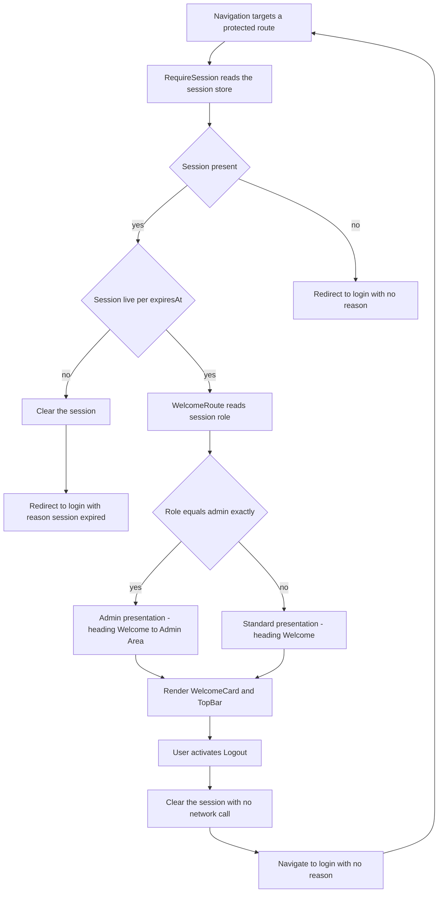

## Table of contents

- [Notation](#notation)
- [§L.1 Document control](#l1-document-control)
- [§L.2 Scope](#l2-scope)
  - [§L.2.1 Wave and Delivery Outcome matrix](#l21-wave-and-delivery-outcome-matrix)
  - [§L.2.2 In scope for wave-2](#l22-in-scope-for-wave-2)
  - [§L.2.3 Out of scope for wave-2](#l23-out-of-scope-for-wave-2)
  - [§L.2.4 Binding Rule Index](#l24-binding-rule-index)
- [§L.3 Delivery Outcome Low-Level Design](#l3-delivery-outcome-low-level-design)
  - [DO2 — Role-Aware Landing Page with Session Protection and Logout](#do2--role-aware-landing-page-with-session-protection-and-logout)
    - [1. Purpose in this wave](#1-purpose-in-this-wave)
    - [2. User-visible behaviour](#2-user-visible-behaviour)
    - [3. Component and module design](#3-component-and-module-design)
    - [4. State, data and configuration design](#4-state-data-and-configuration-design)
    - [5. Execution steps](#5-execution-steps)
    - [6. Interface and contract usage](#6-interface-and-contract-usage)
    - [7. Platform configuration change](#7-platform-configuration-change)
    - [8. Error handling and resilience](#8-error-handling-and-resilience)
    - [9. Security, privacy and observability](#9-security-privacy-and-observability)
    - [10. Deliberate non-goals of this wave](#10-deliberate-non-goals-of-this-wave)
- [§L.4 Canonical State Machine — reference only](#l4-canonical-state-machine--reference-only)
- [§L.5 Build order within the wave](#l5-build-order-within-the-wave)
- [§L.6 Test design](#l6-test-design)
  - [§L.6.1 Levels and what each level is for](#l61-levels-and-what-each-level-is-for)
  - [§L.6.2 Fixture and determinism policy](#l62-fixture-and-determinism-policy)
  - [§L.6.A Testing Automation Requirements — DO2](#l6a-testing-automation-requirements--do2)
    - [§L.6.A.1 E2E scenarios owned by wave-2](#l6a1-e2e-scenarios-owned-by-wave-2)
    - [§L.6.A.2 Cross-wave integration tests](#l6a2-cross-wave-integration-tests)
    - [§L.6.A.3 Unit and component tests](#l6a3-unit-and-component-tests)
    - [§L.6.A.4 Negative, security-behaviour and conformance anchors](#l6a4-negative-security-behaviour-and-conformance-anchors)
    - [§L.6.A.5 Regression carried forward from wave-1](#l6a5-regression-carried-forward-from-wave-1)
    - [§L.6.A.6 Non-functional test requirements](#l6a6-non-functional-test-requirements)
    - [§L.6.A.7 Coverage obligations](#l6a7-coverage-obligations)
- [§L.7 Non-functional implementation contract](#l7-non-functional-implementation-contract)
  - [§L.7.1 NFR gates carried by wave-2](#l71-nfr-gates-carried-by-wave-2)
  - [§L.7.2 The four minimum client rules](#l72-the-four-minimum-client-rules)
  - [§L.7.3 Business-rule placement](#l73-business-rule-placement)
  - [§L.7.4 FMEA](#l74-fmea)
- [§L.8 Cross-wave contracts and deferrals](#l8-cross-wave-contracts-and-deferrals)
  - [§L.8.1 Shared surfaces — consumed, never redeclared](#l81-shared-surfaces--consumed-never-redeclared)
  - [§L.8.2 Addressed here — every wave-1 deferral, closed](#l82-addressed-here--every-wave-1-deferral-closed)
  - [§L.8.3 Cross-wave edges that may not be stubbed](#l83-cross-wave-edges-that-may-not-be-stubbed)
  - [§L.8.4 Deferrals from wave-2](#l84-deferrals-from-wave-2)
  - [§L.8.5 Contract ledger position](#l85-contract-ledger-position)
- [§L.9 Implementation binding](#l9-implementation-binding)
- [§L.10 Architecture conformance](#l10-architecture-conformance)
  - [§L.10.1 Governing decisions honoured](#l101-governing-decisions-honoured)
  - [§L.10.2 Capability placement](#l102-capability-placement)
  - [§L.10.3 Declared exception](#l103-declared-exception)
- [§L.11 Source requirement continuity](#l11-source-requirement-continuity)
  - [§L.11.1 Every raw requirement, traced](#l111-every-raw-requirement-traced)
  - [§L.11.2 Requirement coverage summary for this wave](#l112-requirement-coverage-summary-for-this-wave)
- [§L.12 Visual and runtime contract](#l12-visual-and-runtime-contract)
  - [§L.12.1 Design source inventory](#l121-design-source-inventory)
  - [§L.12.2 Consumed endpoints](#l122-consumed-endpoints)
  - [§L.12.3 Dev runbook](#l123-dev-runbook)
  - [§L.12.4 Reuse versus create](#l124-reuse-versus-create)
  - [§L.12.5 Design-token contract](#l125-design-token-contract)
  - [§L.12.6 UI screen coverage matrix](#l126-ui-screen-coverage-matrix)
- [§L.13 Review Resolution History](#l13-review-resolution-history)
- [Assumptions, Blockers & Open Questions](#assumptions-blockers--open-questions)
  - [Assumptions](#assumptions)
  - [Blockers](#blockers)
  - [Open Questions](#open-questions)

# Low-Level Engineering Specification — Capability `13652`, Wave 2 of 2

**Parent:** `docs/specs/13652/SPECIFICATION.md` (high-level ESD)
**Decision record:** `docs/specs/13652/solution-design.md`
**Sibling wave:** `docs/specs/13652/LOW_LEVEL_SPEC-13652-wave-1.md` (`DO1`)
**Delivery Outcome owned by this wave:** `DO2` — Role-Aware Landing Page with Session Protection and Logout

## Notation

| Symbol | Meaning |
|---|---|
| ✅ | Confirmed against platform source, configuration, or a governing decision |
| 🎯 | A binding obligation on the implementer of this wave |
| ⚠️ | A caveat that changes how something must be read or tested |
| 🚫 | Explicitly forbidden, or deliberately absent |
| ❓ | Not determinable at authoring time — carried as a blocker or question |

## §L.1 Document control

| Field | Value |
|---|---|
| Capability slug | `13652` |
| Wave | 2 of 2 |
| Delivery Outcomes | `DO2` |
| Parent high-level ESD | `docs/specs/13652/SPECIFICATION.md` |
| Sibling wave specs | wave-1 — `LOW_LEVEL_SPEC-13652-wave-1.md` (`DO1`) |
| Depends on | ✅ wave-1. This wave consumes wave-1's session, message registry and app shell |
| Provides to | 🚫 Nothing. This is the terminating wave of the capability |
| Contracts root | `docs/specs/13652/contracts/` |
| Contract ledger | `docs/specs/13652/contracts/CONTRACT_LEDGER.md` |
| Primary write repository | `Pacco.Web` |
| Other repositories written | 🚫 None. This wave changes no file outside `Pacco.Web` |
| Owner | 🚫 None named — `Pacco.Web` is unclaimed (ASM-9, `B1`) |

```json
{
  "capability_slug": "13652",
  "wave_index": 2,
  "total_waves": 2,
  "do_ids": ["DO2"],
  "spec_tier": "low_level",
  "depends_on_waves": [1],
  "provides_to_waves": [],
  "repositories_written": ["Pacco.Web"],
  "contracts_root": "docs/specs/13652/contracts/",
  "contract_ledger_path": "docs/specs/13652/contracts/CONTRACT_LEDGER.md",
  "new_contract_artifacts_authored": 0,
  "requires_feature_flags": false,
  "requires_incremental_rollout": false,
  "has_agentic_workflow_scope": false,
  "has_data_migration": false,
  "has_ui_scope": true,
  "design_source": "four static attachments, no Figma URL",
  "terminating_wave": true
}
```

## §L.2 Scope

### §L.2.1 Wave and Delivery Outcome matrix

Copied verbatim from HL ESD §2.8. 🚫 Locked — no renumbering, no reassignment, no merging.

| Wave | Delivery Outcomes | Low-level spec |
|---|---|---|
| wave-1 | `DO1` | `docs/specs/13652/LOW_LEVEL_SPEC-13652-wave-1.md` |
| wave-2 | `DO2` | `docs/specs/13652/LOW_LEVEL_SPEC-13652-wave-2.md` |

### §L.2.2 In scope for wave-2

1. The `/welcome` route and its component tree — `WelcomeRoute`, `TopBar`, `WelcomeCard`, `LogoutAction`.
2. `RequireSession`, the client-side route guard protecting `/welcome` (FR-14).
3. The role decision and the two landing messages — "Welcome to Admin Area" for `admin`, "Welcome" for `user`, and the non-Admin message for every other value (FR-12, BR-1, BR-2).
4. The role chip shown on the landing card, driven by the same decision as the message.
4a. The landing page's **control inventory** — the role-aware message, the Pacco identity, the role indicator and the `Logout` control, and 🚫 nothing else, with 🚫 zero network requests on the route (FR-18, C7).
5. Expiry detection on every guard decision, using wave-1's `SessionStore.isLive()` (FR-15, `ADR-022` rule 3).
6. The `authenticated` → `session-expired` → `anonymous` path, ending at `/login` with the `session_expired` reason set (FR-15, BR-6).
7. Logout — a client-side session discard, ending at `/login` (FR-16, BR-7).
8. The `/` → `/welcome` branch for a live session, added to the router wave-1 built (HL §11.2 routes; the guard obligation it re-enters is FR-14). ⚠️ 🚫 It is **not** FR-18 — FR-18 is the landing page's control inventory, carried at §L.6.A.3.
9. Verification that wave-1's four-file `allowedOrigins` change is present and that 🚫 no gateway route, `auth:` flag, JWT validation or revocation behaviour changed (FR-17).
10. Verification that 🚫 no token-renewal mechanism exists anywhere in the client (FR-19).
11. The stitched end-to-end journeys that cross both waves — E2E-1, E2E-2, E2E-9, E2E-10 and E2E-11 — driven against wave-1's real sign-in path, together with `X-5`, the `DO2` operational verification journey HL §17 names (HL §14.A cross-wave integration map).
12. The `N6` post-logout token-replay **measurement**, E2E-13 — the instrument HL §12.6 relies on to disposition `R-03` as measured rather than asserted.

### §L.2.3 Out of scope for wave-2

| Not in this wave | Where it lives |
|---|---|
| The `/login` screen, its fields, validation and submit lock | wave-1 |
| `useSignIn`, `GatewayClient`, and any network call at all | wave-1. 🚫 This wave makes **zero** gateway requests |
| `SessionStore` — the module, all four of its functions | wave-1 owns and authors it. This wave calls `read`, `clear`, `isLive` |
| The message registry, including the `session_expired` entry | wave-1 owns it. This wave triggers the entry |
| `SessionNotice`, the `role="status"` region on `/login` | wave-1 owns it |
| The four-file `allowedOrigins` edit | wave-1 makes it. This wave only verifies it |
| Any new gateway route, including a logout or revoke route | 🚫 Nowhere. Explicitly forbidden by the capability |
| Any change to JWT validation, revocation, or the deny-list | 🚫 Nowhere. Explicitly forbidden |
| Server-side session invalidation of any kind | 🚫 Nowhere. Stated limitation, §L.3 item 9 |
| Dashboard widgets, navigation trees, business functionality | 🚫 Nowhere. C7 forbids it |
| A design-token contract | 🚫 Nowhere. No Figma URL exists — §L.12.5 |

### §L.2.4 Binding Rule Index

🎯 The same index both waves of this batch are bound by, established once in Step 0 of this batch.
Reproduced here so this document stands alone. 🚫 Neither wave may reinterpret a row.

| ID | Rule | Source | Where wave-2 applies it |
|---|---|---|---|
| BRI-1 | The routing configuration is a reviewed architectural artifact; changing it changes the platform's public contract | `ADR-004` §2 obligation 1 | §L.3 item 8 — 🚫 no routing change made or needed |
| BRI-2 | Response aggregation or per-client shaping must not be added to the gateway configuration | `ADR-004` §2 obligation 3 | §L.3 item 8 |
| BRI-3 | Pacco enforces authentication at the gateway; the edge must be unavoidable | `ADR-006` §2, obligation 3 | §L.3 item 3 — the guard is presentational, never an authorisation boundary |
| BRI-4 | Revocation is consulted at the boundary that enforces authentication — still open, unchanged | `ADR-007` §2 rule 4 | §L.3 item 9, and residual risk `R-03` |
| BRI-5 | Infrastructure and applications start separately; every deployable is independently startable | `ADR-017` §2 rules 1 and 3 | §L.12.3 |
| BRI-6 | Repository per component, independent per-repository release | `ADR-018` §2 | §L.9 — the only repository written is `Pacco.Web` |
| BRI-7 | `Pacco.Web` owns presentation and nothing else — no domain data, no business rule, no persistence | `ADR-021` §5 rule 1 | §L.7.3 — the role **decision** is presentation; the role **claim** is identity-service's |
| BRI-8 | The client is independently buildable and independently released | `ADR-021` §5 rule 2 | §L.9, §L.12.3 |
| BRI-9 | The browser reaches the platform only through the edge | `ADR-021` §5 rule 3 | Trivially held — 🚫 this wave makes no request at all |
| BRI-10 | The edge names its browser caller exactly; all four configuration files stay identical | `ADR-021` §5 rule 4 | §L.6.A.4 — verified, not changed |
| BRI-11 | There are currently no separate Dev, QA, Staging or Production frontend environments; those origins, gateway URLs, DNS names and deployment targets are defined later | `ADR-021` §5 rule 6 | §L.3 item 10, §L.12.3 |
| BRI-12 | `Pacco.Web` owns the platform's first UI foundation — `STYLE_README.md` and `pacco-material-you.css` | `ADR-021` §5 rule 7 | 🚫 `BLOCKING_FOR_LLD` — neither asset exists. `B3`, §L.12.4 |
| BRI-13 | The refresh token is discarded unread; expiry derives from the JWT `exp` claim | `ADR-022` §5 rules 1 and 2 | §L.3 item 4 — the guard reads `expiresAt`, which came from `exp` |
| BRI-14 | No renewal mechanism is added anywhere | `ADR-022` §5 rule 5 | §L.3 item 10, FR-19, §L.6.A.4 |
| BRI-15 | `code` is the only field a failure decision may read; `reason` is never rendered | `ADR-023` §5 rules 1 and 2 | §L.3 item 8 — this wave surfaces no backend outcome at all |
| BRI-16 | The message set is closed and owned by the client; unknown resolves to generic by construction | `ADR-023` §5 rules 3 and 4 | §L.3 item 5 step 14 — the `session_expired` entry is triggered, never composed |
| BRI-17 | HTTP 400 from this route is an authentication outcome, not a client-side input defect | `ADR-023` §5 rule 5 | Not exercised by this wave |
| BRI-18 | Non-disclosure is preserved at the last hop — `invalid_credentials` and `invalid_email` resolve to the same message | `ADR-023` §5 rule 6 | Not exercised by this wave |
| BRI-19 | A service that stores nothing must not configure a database | `ADR-008` §2 rule 3 | §L.7.3 — the client persists nothing server-side |
| BRI-20 | The platform runtime baseline pins .NET deployables — `Pacco.Web` is not one | `ADR-020` §2 | §L.10.3 |

## §L.3 Delivery Outcome Low-Level Design

### DO2 — Role-Aware Landing Page with Session Protection and Logout

```
DO: DO2

Purpose:
  An authenticated user reaches a deliberately simple landing page whose message is decided solely
  by the identity role in the session, cannot reach it without a live session, and can end the
  browser session and return to Login.

Consumes:
  - Session: BrowserSession from wave-1's SessionStore, read through read() and isLive()
  - Message registry: wave-1's closed registry, specifically the session_expired entry
  - App shell and router: wave-1's shell, BrandFrame and router, extended with two entries
  - Gateway configuration: wave-1's four-file allowedOrigins change, read for verification only
  - Design source: .attachments/03_welcome-page-ux.png, 01_pacco-logo-1.png, 04_backgroud-img.png

Produces:
  - UI route: /welcome, protected, rendering one of two landing messages
  - UI behaviour: redirect to /login for any unauthenticated or expired access attempt
  - UI behaviour: logout, a client-side session discard ending at /login
  - UI navigation: the / to /welcome branch for a live session
  - Verification evidence: FR-17 and FR-19 conformance checks, and the N6 post-logout replay measurement
  - Nothing else. This is the terminating wave and it produces no surface for a later wave

Primary Components:
  - RequireSession, the client-side route guard
  - WelcomeRoute, the protected route composition
  - TopBar, the brand mark and the logout control
  - WelcomeCard, the mark, the landing message, the supporting line and the role chip
  - LogoutAction, the control that discards the session
  - RoleDecision, the pure function from a stored role value to a landing presentation

Primary Contracts:
  - BrowserSession, consumed. Owned by wave-1, redeclared by nothing here
  - SessionStore read, clear and isLive, consumed. Owned and authored by wave-1
  - Message registry session_expired entry, consumed. Owned by wave-1
  - No API is called. No OpenAPI document, event schema or shared DTO is authored or consumed

Depends On:
  - wave-1 (DO1) for the session, the registry, the shell and the router

Files:
  - Pacco.Web, module paths not determinable yet, blocked by B2 and ASM-2
  - No file outside Pacco.Web is modified by this wave

Implements:
  - FR-12, FR-13, FR-14, FR-15, FR-16, FR-17, FR-18, FR-19
  - BR-1, BR-2, BR-3, BR-6, BR-7
  - AC-17 to AC-27, and AC-28 jointly with wave-1
  - Constraints C2, C7, C11
  - NFR gates N3 and N4, the N6 measurement, the FR-17 half of N5, and
    N1 and N2 re-applied to this wave's screens

External Systems:
  - identity-service, indirectly. Its issued role claim decides the landing message,
    but this wave never calls it
  - api-gateway, indirectly. Its configuration is verified unchanged, never modified
  - The user browser, the execution host for every component above

Tests:
  - Unit: the nine-case parameterised role decision required by HL §19 - admin, Admin, ADMIN,
    user, empty string, whitespace, null, administrator, superuser. Guard decision for live,
    expired and absent sessions. Logout clears the store
  - Integration: E2E-1 and E2E-2 driven through wave-1's real sign-in path. The / branch for a
    live and for an absent session
  - Failure: E2E-8 direct /welcome with no session, E2E-11 expired session, E2E-10 logout,
    plus back-navigation after logout and after expiry
  - Measurement: E2E-13, the post-logout token replay that records R-03
```

#### 1. Purpose in this wave

`DO2` closes the capability. Its deliverable is a **decision** and a **boundary**: the landing message
is decided only by the role claim `identity-service` issued, and the post-login surface is not
reachable without a live session. The three numbers this DO is measured on — 0 unknown-role or normal
users shown "Welcome to Admin Area", 0 unauthenticated requests reaching the landing page, 0 new
logout or revoke gateway routes — are all properties of that decision and that boundary.

#### 2. User-visible behaviour

What a person sees on `/welcome` and around it. The mechanism is item 5 and is not restated here.

| Situation | What the user sees |
|---|---|
| Signs in as an admin | The Welcome screen: top bar with the Pacco mark and an outlined `Logout` control, a centred card with the large cube mark and "Pacco", the heading **"Welcome to Admin Area"** with "Admin Area" emphasised, "You are signed in successfully.", an `Admin` chip with a shield glyph, a divider, and "Use the navigation to continue." |
| Signs in as a normal user | The same screen with the heading **"Welcome"** and the role chip showing `User`. 🚫 The word "Admin" appears nowhere |
| Signs in with a role the client does not recognise | The same screen as a normal user — heading "Welcome". 🚫 Never the Admin message, under any circumstance (BR-1, BR-2) |
| Opens `/welcome` directly with no session | 🚫 Never sees the landing page, not even briefly. The browser is at `/login` |
| Reloads `/welcome` with a live session | The same screen, with the same message. Role is re-read from the session, never remembered from the last render |
| Reloads `/welcome` after the token has expired | `/login`, with the session-expired notice in the status region — textually distinct from the sign-in failure messages |
| Activates `Logout` | `/login`, with no notice. The session is gone |
| Presses Back after logging out | `/login`. 🚫 The landing page does not return |
| Opens `/` with a live session | `/welcome` |
| Opens `/` with no session | `/login` |

🚫 There is no dashboard widget, no navigation menu, no data table, no business action and no link to
one. "Use the navigation to continue." is static copy from the reference image, 🚫 not a promise of a
navigation component in this capability (C7).

⚠️ The role chip and the heading are rendered from **one** decision. They cannot disagree, because a
design where two elements independently interpret the role is a design where one of them can be wrong.

#### 3. Component and module design

| Module | Responsibility | Owns state | Talks to |
|---|---|---|---|
| `RequireSession` | The guard. On every attempt to render a protected route, asks `SessionStore` whether a live session exists and either renders the child or redirects | No | `SessionStore`, `Router` |
| `WelcomeRoute` | Route composition. Reads the session once per render, calls `RoleDecision`, renders `TopBar` and `WelcomeCard` | No | `SessionStore`, `RoleDecision` |
| `RoleDecision` | Pure function: a stored role string in, one of two presentations out. No I/O, no storage access, no side effect | No | — |
| `TopBar` | The brand mark and `LogoutAction` | No | — |
| `WelcomeCard` | Presentational — mark, heading, supporting line, role chip, divider, closing line. Fully driven by props | No | — |
| `LogoutAction` | The control. Calls `SessionStore.clear()`, then navigates to `/login` | No | `SessionStore`, `Router` |
| `Telemetry` | Emits the four `landing.*` events | No | — |

**Boundary rules that this table exists to enforce.**

1. 🚫 `RoleDecision` is the **only** place a role value is interpreted. No component contains a role comparison, and 🚫 no component reads `session.role` to decide its own rendering.
2. 🚫 `RoleDecision` is written as an explicit allow-list: the Admin presentation is returned **only** when the value equals `admin` exactly, after lower-casing. Every other input — `user`, an unrecognised value, an empty string, an absent field — returns the non-Admin presentation. 🚫 It must **never** be written as `role !== 'user'`, which would hand Admin to every unknown value (HL §15, BR-1, C2).
3. 🚫 `RoleDecision` receives the role string and nothing else. It is not given the identifier, the email, the token or the session object, so it structurally **cannot** infer a user type from a username or an email address (C2).
4. 🚫 No module in this wave makes a network call, holds `gatewayBaseUrl`, or imports `GatewayClient`. The guard's decision is local and instantaneous.
5. ✅ `SessionStore` is imported and called. 🚫 It is not extended, wrapped, re-exported with new behaviour, or duplicated — wave-1 authored all four of its functions precisely so this wave adds none (§L.8.1).
6. ✅ `RequireSession` wraps `/welcome` and is written so that a protected route **cannot** be added without it — the protected routes are declared as a group, not one at a time.

#### 4. State, data and configuration design

**State read, never created.** 🚫 This wave introduces no new persisted structure and no new
configuration key. It reads exactly three things from wave-1's `SessionStore`.

| Read | Via | Used for | Rule |
|---|---|---|---|
| Presence of a session | `SessionStore.read()` | The guard's first test | 🚫 A session object that exists but is not live is treated as absent |
| `expiresAt` liveness | `SessionStore.isLive(now)` | The guard's second test | Compared against the current time on **every** guard decision, never cached, never evaluated once at mount (`ADR-022` §5 rule 3) |
| `role` | `SessionStore.read().role` | `RoleDecision` input | Read as stored — already lower-cased by wave-1. 🚫 Not re-normalised, not mapped, not defaulted |

**Component state.** `WelcomeRoute` holds none. It derives everything from the session on each render,
which is what makes the reload behaviour correct by construction rather than by a refresh mechanism.

**Configuration.** 🚫 None. This wave adds no key, reads no URL and has no environment-dependent value.
`gatewayBaseUrl` stays exclusively wave-1's (§L.9).

**The role vocabulary.** ✅ `identity-service` defines a closed, lower-cased vocabulary of exactly
`user` and `admin`. The client's handling of it is deliberately asymmetric:

| Value | Stored as | Landing presentation |
|---|---|---|
| `admin`, in any casing | `admin` | Admin — heading "Welcome to Admin Area", chip `Admin` |
| `user`, in any casing | `user` | Standard — heading "Welcome", chip `User` |
| Any other non-empty value | Verbatim, lower-cased | Standard. ⚠️ The chip shows the standard label, 🚫 **not** the unrecognised value — rendering an arbitrary server string into the UI would reopen the backend-text boundary `ADR-023` closes |
| Empty or absent | Empty or absent | Standard |

🎯 The asymmetry is the security property. An unknown role is a value the platform did not promise;
treating it as the lower-privilege presentation is the only safe reading, and it is why the
implementation is an allow-list rather than a negation.

#### 5. Execution steps

🎯 This item is the single home of the step-by-step flow for `DO2`. No other item, table or diagram in
this document restates it.

**Execution — any attempt to render a protected route (FR-14, FR-15, HL §5.5).**

1. Navigation targets a protected route. This covers all of it: the redirect after sign-in, a typed URL, a bookmark, a reload, and a Back or Forward traversal. 🚫 There is no path to `/welcome` that skips this step.
2. `RequireSession` calls `SessionStore.read()`.
3. If nothing is returned, the decision is **deny with reason none**. Continue at step 8.
4. `RequireSession` calls `SessionStore.isLive(now)`, which compares the session's `expiresAt` against the current time. ⚠️ This runs on **every** decision — 🚫 it is not cached, not memoised, and not computed once at mount (`ADR-022` §5 rule 3).
5. If the session is not live, the decision is **deny with reason `session_expired`**. Continue at step 7.
6. Otherwise the decision is **allow**. Continue at step 10.
7. 🚫 Before redirecting on expiry, `RequireSession` calls `SessionStore.clear()`. The expired path is the logout path plus a message — an expired session is never left in storage (`ADR-022` §5 rule 4, BR-6). FSM: `authenticated` → `session-expired`.
8. `RequireSession` redirects to `/login`, passing the reason as a key — `session_expired`, or nothing when the session was simply absent. 🚫 A message string is never passed; the string belongs to wave-1's registry (BRI-16).
9. Wave-1's `SessionNotice` renders the `session_expired` entry when the reason is set, and renders nothing when it is not. `landing.blocked_unauthenticated` or `landing.session_expired` is emitted. FSM: `session-expired` → `anonymous`, or stays `anonymous`. 🚫 The protected route's component tree is never constructed, so nothing is rendered and flashed.
10. `WelcomeRoute` renders. It reads the session once and emits `landing.viewed`.
11. `WelcomeRoute` passes `session.role` — and only that — to `RoleDecision`.
12. `RoleDecision` lower-cases the value and compares it to the single literal `admin`. On an exact match it returns the Admin presentation; 🚫 on **every** other input, including an unrecognised value, an empty string and an absent field, it returns the standard presentation (BR-1, C2).
13. `WelcomeCard` renders the heading, the supporting line and the role chip from that one presentation object. `TopBar` renders the mark and `LogoutAction`.
14. ✅ Rendering is complete. FSM stays `authenticated`.

**Execution — logout (FR-16, BR-7).**

15. The user activates `LogoutAction`.
16. `LogoutAction` calls `SessionStore.clear()`, which removes the session and every value derived from it from browser storage and from memory.
17. 🚫 No network request is made. There is no logout endpoint, no revoke call and no gateway route to call — and none is added (BRI-4, FR-17).
18. `LogoutAction` emits `landing.logout`, carrying no token and no role, and navigates to `/login` with 🚫 no reason set — a deliberate logout is not an error and gets no notice.
19. FSM: `authenticated` → `anonymous`.
20. Any subsequent attempt to reach `/welcome`, including a Back traversal, re-enters at step 1 and is denied at step 3. 🚫 There is no cached render to return to, because step 9 never built one.
21. ⚠️ The access token issued before logout remains cryptographically valid until its `exp`. The gateway and the domain services will still accept it if it is presented by something other than this client. This is a stated limitation, not a defect — see item 9.

**Execution — the root route (HL §11.2, re-entering the FR-14 guard).**

22. Navigation targets `/`.
23. The router applies the same two tests as steps 2 and 4 — a session exists and it is live.
24. If both hold, the browser goes to `/welcome`, which re-enters at step 1 and is allowed.
25. Otherwise the browser goes to `/login`, wave-1's anonymous resolution, unchanged.
26. ⚠️ Wave-2 adds **only** the live-session branch. 🚫 It does not rewrite, move or re-implement wave-1's anonymous resolution (§L.8.1).

**Execution — the conformance checks this wave carries (FR-17, FR-19).**

27. Assert that all four `ntrada*.yml` files contain the same exact `Pacco.Web` origin in `extensions.cors.allowedOrigins` and that 🚫 no `'*'` remains in any of them.
28. Assert that the gateway route set is unchanged — 🚫 no route added, removed or reordered, no `auth:` flag altered, and specifically 🚫 no logout or revoke route anywhere.
29. Assert that no JWT validation, revocation or deny-list behaviour changed.
30. Assert that the client contains no token-renewal mechanism: 🚫 no refresh call, no silent re-authentication, no timer that extends `expiresAt`, and no read of `refreshToken` anywhere (FR-19, BRI-14).



#### 6. Interface and contract usage

🚫 **This wave calls no API.** It consumes no endpoint, sends no request, and holds no base URL. The
only contracts it uses are the three browser-internal surfaces wave-1 owns.

| Surface | Owner | How wave-2 uses it | Forbidden |
|---|---|---|---|
| `SessionStore.read()` | wave-1 | Guard test 1, role read | 🚫 Extending, wrapping or duplicating the module |
| `SessionStore.isLive(now)` | wave-1 | Guard test 2, on every decision | 🚫 Caching its result across decisions |
| `SessionStore.clear()` | wave-1 | Logout and the expiry path | 🚫 Clearing selectively — it removes the whole session |
| `BrowserSession` shape | wave-1 | Reads `role` and, indirectly, `expiresAt` | 🚫 Adding a field, 🚫 reading `expiresRaw` for any decision, 🚫 looking for `refreshToken` |
| Message registry `session_expired` | wave-1 | Triggered by key | 🚫 Composing, overriding or localising the string here |
| Canonical FSM | HL §10.1 | Referenced | 🚫 Adding or renaming a state |

⚠️ **The role claim is a contract, and it is `identity-service`'s.** The client reads the value the
token carried. 🚫 It does not ask the platform what the value means, does not map it, and does not
treat the absence of a match as a reason to guess.

**Contract artifacts.** 🚫 This wave authors no OpenAPI document, event schema or shared DTO.
`CONTRACT_LEDGER.md` carries a `none` row for wave-2 (HL §9.X).

#### 7. Platform configuration change

🚫 **None.** This wave modifies no file outside `Pacco.Web`.

| File class | Wave-2 action |
|---|---|
| `ntrada*.yml` | ✅ Read and asserted unchanged beyond wave-1's CORS value. 🚫 Not edited |
| `docker-compose*.yml` | 🚫 Not read for change, not edited |
| Any `identity-service` file | 🚫 Not edited |
| Any ADR, the HL ESD, the solution design | 🚫 Not edited |

🎯 The absence of a configuration change is itself a deliverable. `DO2`'s target includes **0 new
logout or revoke gateway routes** and **0 changes to the gateway's JWT validation or revocation
behaviour** — a `git diff` of `Pacco.APIGateway` attributable to this wave must be empty (FR-17, AC-24).

#### 8. Error handling and resilience

⚠️ This wave has no network boundary, so it has no error mapping. What it has instead is a set of
**degenerate inputs**, each with one defined outcome and no failure message.

| Condition | Detected where | Outcome | FSM result |
|---|---|---|---|
| No session at all | Execution step 3 | Redirect to `/login`, no notice | stays `anonymous` |
| Session object present but `expiresAt` already passed | Execution step 5 | Clear, then redirect with `session_expired` | `authenticated` → `session-expired` → `anonymous` |
| Session object present but `expiresAt` missing or unreadable | Execution step 4, `isLive` returns false | Treated exactly as expired — cleared and redirected | Same as above |
| Session present, `role` is `admin` | Execution step 12 | Admin presentation | stays `authenticated` |
| Session present, `role` is `user` | Execution step 12 | Standard presentation | stays `authenticated` |
| Session present, `role` is an unrecognised string | Execution step 12 | 🚫 Standard presentation. Never Admin | stays `authenticated` |
| Session present, `role` is empty, null or absent | Execution step 12 | 🚫 Standard presentation. Never Admin | stays `authenticated` |
| Storage read throws | `SessionStore.read()` | Treated as no session — redirect to `/login`. 🚫 The thrown value is never rendered | stays `anonymous` |
| Back traversal after logout | Execution step 20 | Denied at step 3, redirect to `/login` | stays `anonymous` |
| Back traversal after expiry | Execution step 20 | Denied at step 3 — the session was cleared at step 7 | stays `anonymous` |

**Invariants that hold on every row above.**

1. 🚫 The protected component tree is never constructed on a deny. There is no flash of the landing page, because rendering happens after the decision, not alongside it (AC-20).
2. ✅ Every deny path that involves an existing session clears it first. 🚫 A denied-but-retained session cannot exist.
3. 🚫 No row produces an Admin presentation except the exact `admin` match. This is the single most load-bearing rule in this wave.
4. 🚫 No backend text, exception, storage error or role value reaches the DOM. The role chip renders a client-owned label, not the stored string.
5. ✅ Every deny ends at a `/login` screen that is fully functional, because wave-1 owns it and it is not conditioned on how the user arrived.

**Resilience posture.**

- 🚫 No retry, no fallback rendering and no degraded mode. Every input above has exactly one defined outcome; there is nothing to recover from.
- 🚫 No token renewal, no silent refresh, no session extension and no "keep me signed in" timer. The session ends when `exp` says it ends (`ADR-022` §5 rule 5, FR-19).
- ⚠️ The guard's correctness depends on the browser clock. A clock skewed far into the past would keep a session live past its real expiry **in the UI only** — the gateway would still reject the token on any protected call. Recorded as `A5`, and it is a presentational risk, not an authorisation one (DD-5).

#### 9. Security, privacy and observability

**What the guard is, and what it is not.**

| Claim | True |
|---|---|
| The guard stops a normal user from seeing the landing page without signing in | ✅ Yes |
| The guard stops a determined user from rendering the landing markup with devtools | 🚫 No, and it is not trying to |
| The guard protects data | 🚫 No. 🎯 The landing page displays **no domain data** — a mark, two static lines, and a role label. There is nothing behind it to protect (C7, FR-18, HL §12.1) |
| The guard is an authorisation boundary | 🚫 No. The gateway is, and it is untouched (BRI-3, `ADR-006`) |

🎯 This is why the landing page must stay empty of business functionality. The moment a widget fetches
real data, a presentational guard would be load-bearing for a protection it cannot provide.

**The stated logout limitation — carried verbatim, not softened.**

> Client-side logout does not invalidate the already-issued token at the platform level. It only ends
> the browser session, so the token stays acceptable to the gateway and the domain services until it
> expires.

⚠️ This is a **decision**, resolved in `intents/13652.md` item 2, fixed as constraint `C11`, and
recorded as residual risk `R-03`. 🎯 It is **measured, not merely asserted**: E2E-13 (§L.6.A.1) replays
the captured token after logout and records that the edge still accepts it, which is the evidence
HL §12.6 relies on and which HL blocker `B5` requires before `DO2` ships.
The alternative — exposing `identity-service` revocation at the edge and having the gateway consult a
deny-list — is a gateway and authentication architecture change that this capability is explicitly
forbidden to make (BRI-4, `ADR-007`). 🚫 The implementer must not "improve" logout by adding a revoke
call. The exposure window is bounded by `jwt.expiryMinutes: 60`.

**Role handling.** 🚫 The role is never inferred from the username, the email address, the identifier
the user typed, a URL parameter, a storage key the user can edit meaningfully, or any client-side
heuristic. It comes from the token claim `identity-service` issued and from nowhere else (C2, FR-13, AC-19).

**Credential handling.** 🚫 This wave touches no password — it is out of the session by construction —
and it neither logs nor renders the access token. `SessionStore.clear()` removes the token rather than
blanking a field that still holds it (FR-16, AC-22).

**Telemetry — the four `landing.*` events (HL §11.2).**

| Event | Emitted at | Payload |
|---|---|---|
| `landing.viewed` | Execution step 10 | ⚠️ Two client-owned fields and nothing else: `presentation`, one of the words `admin` or `standard`; and `roleRecognised`, a boolean that is `false` whenever the stored role is outside the closed `{user, admin}` vocabulary — including absent, empty and whitespace. 🚫 Never the raw stored role string |
| `landing.blocked_unauthenticated` | Execution step 9, reason absent | route only |
| `landing.session_expired` | Execution step 9, reason `session_expired` | route only |
| `landing.logout` | Execution step 18 | route only |

🚫 No event carries a token, an identifier, an email, an `expiresAt` value or a raw role string.

🎯 **Why `roleRecognised` exists.** HL §13.4 says "Any occurrence of `landing.viewed` with a `role`
outside `{user, admin}` is a BR-1 boundary event worth an alert even though the render is correct by
design." ⚠️ A payload carrying only the decided presentation cannot distinguish `user` from
`administrator` — both render `standard` — so that alert could never fire. The boolean makes the
boundary event observable while 🚫 still never emitting the server-supplied string, so the `N1`
credential-and-raw-value rule and NEG-7 both continue to hold. 🚫 Do not "simplify" it away.

#### 10. Deliberate non-goals of this wave

| Not built | Why | Source |
|---|---|---|
| Any dashboard widget, navigation menu, data table or business action | The landing page is deliberately minimal; "Use the navigation to continue." is static copy | FR-18, C7, HL §2.6 |
| A logout or revoke gateway route | Logout is a client-side discard only | FR-17, BRI-4 |
| Any change to JWT validation, revocation or the deny-list | Same | FR-17, `ADR-007` |
| Server-side session invalidation of any kind | Same, and the limitation is stated rather than worked around | item 9, `R-03` |
| Token renewal, silent refresh, or session extension | The session is bounded by `exp` and there is no renewal mechanism anywhere | FR-19, BRI-14 |
| Re-normalising or mapping an unrecognised role into the closed vocabulary | An unknown value is stored and treated as unknown | BR-1, BR-2 |
| A second role decision anywhere in the tree | One decision drives both the heading and the chip | item 3 rule 1 |
| A server-side route guard or any authorisation check in the browser | The gateway is the authorisation boundary | BRI-3 |
| Any network call at all | This wave consumes nothing over HTTP | item 6 |
| A design-token contract or Figma binding | 🚫 No Figma URL exists for this capability | ASM-3, §L.12.5 |
| Dev, QA, Staging or Production origins, URLs, DNS names or targets | Those environments do not exist yet | BRI-11 |

## §L.4 Canonical State Machine — reference only

🚫 This wave does **not** declare a state machine. The single canonical FSM for capability `13652`
lives in HL ESD §10.1 and is the only authority. 🚫 No state is added, renamed or redefined here, and
🚫 wave-1 declares none either.

| Canonical state | Wave-2 responsibility |
|---|---|
| `anonymous` | ⚠️ Lands the user back in it on every deny, logout and expiry. 🚫 Does not render it — wave-1 owns `/login` |
| `authenticating` | 🚫 Never entered or observed by this wave |
| `authenticated` | ✅ Owns everything rendered while in it — `/welcome` and its whole component tree |
| `session-expired` | ✅ Owns entering it and leaving it. It is a transient state: detected at Execution step 5, cleared at step 7, left at step 8 |

| Canonical transition | Wave-2 role |
|---|---|
| `anonymous` → `authenticating` | Not triggered by this wave |
| `authenticating` → `authenticated` | Not triggered by this wave. Wave-2 begins where it lands |
| `authenticating` → `anonymous` | Not triggered by this wave |
| `authenticated` → `anonymous` | ✅ Triggered by logout, Execution steps 16 to 19 |
| `authenticated` → `session-expired` | ✅ Triggered by the guard, Execution steps 5 and 7 |
| `session-expired` → `anonymous` | ✅ Triggered immediately after, Execution step 8. 🚫 The user never sits in `session-expired` |

⚠️ **`session-expired` is not a renderable destination in this wave.** HL §10.1 lists it as a state and
lists `session-expired` → `anonymous` as a valid transition; this wave resolves the two in a single
navigation, which is why steps 7, 8 and 9 are one uninterrupted sequence with no screen between them.
🚫 That sequencing is a wave-2 implementation choice, **not** a quotation from HL §10.1 and 🚫 not one
of its numbered invalid transitions.

🎯 **The two HL §10.1 invalid transitions this wave owns as required negative tests.** HL §10.1 states
that each invalid transition is a required negative test in §14; wave-2 carries numbers 4 and 5:

| HL §10.1 invalid transition | Wave-2's negative test |
|---|---|
| 4 — `authenticated` → `authenticated` with a **mutated role**. The role is written once at sign-in and is never rewritten while a session lives | §L.6.A.4 NEG-8 |
| 5 — any transition into `authenticated` where the session role was sourced from anything **other than** `AuthDto.role` (FR-13) | §L.6.A.4 NEG-9, with the write-side half at wave-1 §L.6.A.4 NEG-7 |

🚫 Transitions 1, 2 and 3 are wave-1's (§L.6.A.4 NEG-6 there, and its submit-lock group).

## §L.5 Build order within the wave

Implementation sequence. This is a work-ordering aid, not a runtime narrative — the runtime flow is
§L.3 item 5 and is not repeated.

| Step | Build | Unblocks | Done when |
|---|---|---|---|
| 0 | ✅ Wave-1 merged, with `SessionStore` complete — `write`, `read`, `clear`, `isLive` — and the registry carrying `session_expired` | Everything | Wave-1's unit suite passes, including the `read`, `clear` and `isLive` tests it wrote for this wave's benefit |
| 1 | `RoleDecision` as a pure allow-list function | 3 | Unit tests cover `admin`, `Admin`, `user`, an unrecognised value, an empty string and an absent field |
| 2 | `RequireSession` and the protected-route grouping | 3, 5 | Unit tests cover live, expired, absent and throwing-storage cases, and confirm 🚫 no child render on a deny |
| 3 | `WelcomeRoute`, `TopBar`, `WelcomeCard`, the role chip | 4 | The screen renders and matches `03_welcome-page-ux.png` for both presentations |
| 4 | `LogoutAction` | 5 | Unit test confirms `clear()` then navigate, and 🚫 zero network requests |
| 5 | The `/` live-session branch | 6 | Both branches resolve correctly, and wave-1's anonymous resolution is textually unchanged |
| 6 | Telemetry at the four points | 7 | Every event fires once with no token, identifier or raw role in any payload |
| 7 | The FR-17 and FR-19 conformance checks | E2E | Assertions run as a named suite, not as manual inspection |
| 8 | The stitched E2E journeys | — | E2E-1, E2E-2, E2E-9, E2E-10 and E2E-11 pass against wave-1's real sign-in path, `X-5` completes the HL §17 verification journey, and E2E-13 records its `R-03` reading |

⚠️ Step 0 is a hard gate, not a courtesy. 🚫 Wave-2 must not begin by writing its own session helper
"until wave-1 lands" — that would create a second owner for a shared contract and the two would drift
(§L.8.1).

## §L.6 Test design

### §L.6.1 Levels and what each level is for

| Level | Scope in wave-2 | Runs against |
|---|---|---|
| Unit | `RoleDecision`, `RequireSession` decisions, logout clear-then-navigate, the `/` branch | Nothing external |
| Component | `WelcomeCard`, `TopBar`, the role chip, both presentations | Rendered DOM, no network |
| Integration | Guard plus route plus store, end to end inside the client | A real `SessionStore` with a fabricated session |
| End-to-end | The full journey from `/login` through sign-in to `/welcome`, logout and back | Docker Compose backend + `Pacco.Web` as its own local process |
| Non-functional | Accessibility, responsive, security-behaviour, conformance | Rendered DOM or the repository |

### §L.6.2 Fixture and determinism policy

- ✅ Unit, component and integration tests may fabricate a session **through wave-1's `SessionStore.write()`**, never by writing a storage key directly. Bypassing the owner would test a shape that the real code never produces.
- ✅ Expiry tests pin the clock. 🚫 No test constructs an "expired" session by sleeping.
- ✅ A fabricated token needs only a decodable payload with an `exp` claim. 🚫 No test signs one — nothing in the client verifies a signature.
- 🚫 The rows in §L.8.3 may **not** use a fabricated session. They must be driven through wave-1's real `/login` screen and real sign-in call.
- ✅ E2E tests use seeded `identity-service` accounts for a `user` and an `admin`, supplied by the harness. 🚫 No credential is hard-coded in client source or configuration.
- ⚠️ **Unrecognised roles are exercised below the E2E level, and that is deliberate.** `Role.cs` is a closed vocabulary, so ❓ `identity-service` may not permit seeding an out-of-vocabulary account at all — see `Q2`. HL §19 accordingly places the unrecognised, empty, whitespace and absent cases inside FR-12's **9 parameterised role cases**, which run at the component level against `SessionStore.write()`. 🚫 No E2E row in HL §14.A covers an unknown role, so 🚫 this wave does not invent one. If `Q2` resolves such that seeding becomes possible, the case is added as a **wave-local `X-` row**, 🚫 never under a reused `E2E-` id.
- ✅ E2E-13 is the only row that uses a captured token outside the client. It is a **measurement** of `R-03`, with its expected outcome — acceptance of the replay — recorded rather than gated.

### §L.6.A Testing Automation Requirements — DO2

🎯 This section is the executable test contract handed to the downstream Testing Agent for wave-2. A
scenario listed here is owned by this wave; it is a defect if it is not automated.

#### §L.6.A.1 E2E scenarios owned by wave-2

Distributed from HL §14.A. Wave-2 owns **7** of the 13 scenarios.

🚫 **Identifier rule.** Every `E2E-n` below is HL §14.A's row `n`, with HL's scenario and HL's expected
outcome. 🚫 No id is reassigned to a different scenario, and 🚫 no scenario this wave invents is given an
`E2E-` id — wave-local composites use the `X-` space in §L.6.A.2.

| ID | Scenario (HL §14.A) | Cross-wave | Preconditions | Steps | Expected result | Traces |
|---|---|---|---|---|---|---|
| E2E-1 | Ordinary user signs in with valid credentials | ✅ **Yes** — must run through wave-1's real `/login` | Seeded `user` account. Full stack running | Open `/login`. Sign in as the ordinary user | Redirect to `/welcome`; the heading reads exactly "Welcome"; the role chip shows the ordinary role. 🚫 The word "Admin" appears nowhere in the DOM. 🚫 The session was produced by the real sign-in call, not fabricated | FR-12, BR-1, AC-18, AC-28 |
| E2E-2 | Administrator signs in with valid credentials | ✅ **Yes** — same requirement | Seeded `admin` account. Full stack running | Open `/login`. Sign in as the administrator | Redirect to `/welcome`; the heading reads exactly "Welcome to Admin Area"; the `Admin` chip and "You are signed in successfully." render | FR-12, BR-1, AC-17, AC-28 |
| E2E-8 | Direct navigation to `/welcome` with no session | 🚫 No | No session in the browser | Navigate directly to `/welcome`, then repeat by reload and by back-navigation | The browser ends at `/login`. 🚫 No landing-page element is ever present in the DOM, not even transiently | FR-14, AC-20 |
| E2E-9 | Reload `/welcome` with a live session | ✅ **Yes** — the session must be a real one | Signed in through wave-1's real sign-in path, session still live | Reload `/welcome` | The **same** role-aware heading and chip. 🚫 No re-authentication. 🚫 Zero network requests on the route | FR-12, FR-14, FR-18, AC-26 |
| E2E-10 | Logout from `/welcome` | ✅ **Yes** — the return destination must be wave-1's real `/login` | Signed in through the real sign-in path | Activate `Logout`. Then press Back. Then sign in again | The session store is cleared and the browser is at `/login`. 🚫 **Zero** outbound requests are issued by the logout. The previously held token string is absent from every browser storage area. Back does not restore `/welcome`. The second sign-in succeeds normally | FR-16, BR-7, AC-22, AC-23 |
| E2E-11 | Navigate to `/welcome` with an expired session | ✅ **Yes** — HL §14.A requires it against a real session | A session produced by a real sign-in whose `expiresAt` has been pinned into the past | Navigate to `/welcome` | The browser ends at `/login` with the session-expired notice in the status region, textually **distinct** from the EF-1 invalid-credentials string. 🚫 The session is gone from storage | FR-15, BR-6, AC-21 |
| E2E-13 | **`N6` — post-logout token replay.** The `R-03` measurement | ✅ **Yes** — the token must be a real one | Signed in through the real sign-in path against the running stack | Capture the access token from the live session. Activate `Logout`. Replay that token as a bearer credential against any gateway route marked `auth: true` | ⚠️ **The replay is expected to be accepted.** Assert that it succeeds and record the result as the measurement of accepted risk `R-03` — 🚫 **never** as a failing test. A **rejection** means the platform's revocation posture changed underneath this capability: raise it, and treat HL §12.6 and `ADR-021` §5 rule 5 as invalidated (HL §8.3, §13.6). ⚠️ The replay runs **outside** the client with a token the test captured, so it asserts nothing about `Pacco.Web`'s own behaviour — FR-16, AC-22 and E2E-10 separately prove the client sends nothing after logout | `N6`, `R-03`, `C11`, HL §12.6, HL §13.6, HL blocker `B5` |

🚫 **Not owned here.** E2E-3, E2E-4, E2E-5, E2E-6, E2E-7 and E2E-12 belong to wave-1 (HL §14.A). ✅ All
thirteen §14.A scenarios are owned across the batch — 6 in wave-1 and 7 here, with no scenario
unclaimed and none claimed twice.

⚠️ **The unknown-role scenario is not an E2E row.** HL §14.A has no E2E scenario for it; HL §19 places
it inside FR-12's **9 parameterised role cases**, which are component-level. It is carried at
§L.6.A.3 and at §L.6.A.4 NEG-1, 🚫 not under a reused `E2E-` id.

#### §L.6.A.2 Cross-wave integration tests

🚫 Wave-2 may **not** be signed off against a stubbed session alone. Each row below is driven against
wave-1's **real** surface (HL §14.A cross-wave integration map).

| # | Edge | Driven against | Assert |
|---|---|---|---|
| X-1 | Sign-in produces a session the guard accepts | Wave-1's real `/login`, real `useSignIn`, real gateway call | The guard allows `/welcome` immediately after a real sign-in, with 🚫 no fabricated store write anywhere in the test |
| X-2 | The stored `role` drives the landing message | The real `role` returned by `identity-service` for a seeded admin and a seeded user | The admin run shows the Admin message, the user run shows the standard one, from the real claim |
| X-3 | Logout returns to a `/login` that still works | Wave-1's real `/login` route | After logout, the real login form accepts input and a second real sign-in succeeds |
| X-4 | The exact-origin CORS config permits the real browser journey | Wave-1's real four-file change, with the gateway restarted | The full journey completes from the `Pacco.Web` origin with 🚫 no CORS error in the console |
| X-5 | **The `DO2` operational verification journey (HL §17).** "The role-aware message and the redirect behave identically on reload and after logout against live `identity-service` tokens" | Both seeded accounts, wave-1's real sign-in, the running stack | Sign in as admin → reload `/welcome` → log out → attempt `/welcome` → sign in as the ordinary user → reload → log out → attempt `/welcome`. Each message matches its account on the first render **and** the reload; each post-logout attempt lands on `/login`; 🚫 no state leaks between the two sessions. ⚠️ This is the stitched composite of E2E-2, E2E-9 and E2E-10 named in HL §17 — it is carried under a wave-local `X-` id precisely so 🚫 no HL §14.A `E2E-` identifier is reused for it |
| X-6 | **The FR-17 machine-caller regression (AC-25).** A non-browser caller of `POST /identity/sign-in` that sends **no** `Origin` header still succeeds after the wildcard is replaced | The running gateway with wave-1's exact-origin config loaded | Issue the sign-in request from a non-browser client — `curl` or an HTTP client — with 🚫 no `Origin` header at all, and assert the response is byte-for-byte the outcome it produced against the base ref. ⚠️ This is the detection mechanism assumption `A12` names for the regression HL §9.1 warns about: CORS is a browser-enforced policy, so a machine caller must be unaffected, and if it is not, the change did more than it was allowed to do | FR-17, AC-25, `N5`, HL §14.A regression anchors, HL §9.1 |

#### §L.6.A.3 Unit and component tests

| Group | Tests | Assert |
|---|---|---|
| `RoleDecision` | **9** | 🎯 The exact nine cases HL §19 counts for FR-12, each asserting the **exact rendered heading** and 🚫 not merely the decision: `admin` → "Welcome to Admin Area"; `Admin` → "Welcome to Admin Area"; `ADMIN` → "Welcome to Admin Area"; `user` → "Welcome"; `""` → "Welcome"; a whitespace-only string → "Welcome"; `null` → "Welcome"; `administrator` → "Welcome"; `superuser` → "Welcome". ⚠️ `administrator` and `superuser` are the two cases that prove the match is an **exact** one after lower-casing and 🚫 not a prefix or substring match. 🎯 100% branch coverage |
| Guard decision | 5 | Live session allows; expired denies with reason `session_expired`; absent denies with no reason; unreadable `expiresAt` denies as expired; a throwing store denies as absent |
| Guard side effects | 3 | The expiry deny calls `clear()` before redirecting; the absent deny calls no clear; 🚫 the child component is never constructed on any deny |
| Guard liveness re-evaluation | 2 | `isLive` is consulted on a second navigation to the same route; 🚫 its result is not reused from the first decision |
| Logout | 3 | `clear()` is called **before** the navigation; navigation is to `/login` with no reason; 🚫 zero network calls are made (FR-16, AC-22) |
| Root route | 2 | A live session resolves `/` to `/welcome`; no session resolves `/` to `/login` unchanged from wave-1 |
| `WelcomeCard` rendering | 5 | Admin heading and chip; standard heading and chip; the supporting line; the divider and closing line; the mark |
| `TopBar` rendering | 2 | The brand mark renders; the `Logout` control renders with its accessible name and exit glyph |
| **Landing control inventory** | **1** | 🎯 The FR-18 / AC-26 obligation, counted by HL §19 as "1 control-inventory test asserting zero network calls on the route". With a live session, `/welcome` renders **exactly** the role-aware message, the Pacco identity mark and the `Logout` control — and 🚫 no dashboard widget, 🚫 no data table, 🚫 no chart, 🚫 no navigation control pointing at a business feature. The same test asserts **zero** network calls for the whole lifetime of the route, mount through unmount (FR-18, AC-26, C7) |
| Single decision source | 1 | The heading and the chip always agree, asserted across all **nine** `RoleDecision` inputs |
| Accessibility wiring | 2 | `Logout` is reachable and operable by keyboard with a programmatic name; the landing heading is the page's `h1` and focus lands in the document correctly after the redirect |

#### §L.6.A.4 Negative, security-behaviour and conformance anchors

| # | Anchor | Assert | Traces |
|---|---|---|---|
| NEG-1 | Never Admin by default | Across every non-`admin` input, the string "Admin Area" is absent from the DOM. 🎯 This is the DO's headline target — 0 unknown-role or normal users shown the Admin message | FR-12, BR-1, `N3` |
| NEG-2 | Never a negation | A source check confirms 🚫 no `role !== 'user'`, `role != 'user'` or equivalent negation drives a presentation decision anywhere in the client | BR-2, `N3` |
| NEG-3 | Never inferred — **source review** | A source review of **every** read of the role value confirms 🚫 no presentation decision reads an identifier, email, username, URL parameter, or any storage key other than the session store. `RoleDecision`'s signature takes one string | FR-13, AC-19, `N3` |
| NEG-4 | Never inferred — **behavioural** | 🎯 The second half of HL §19's FR-13 obligation, and 🚫 not substitutable by NEG-3. A session is written through `SessionStore.write()` for an account whose **email begins `admin@`** while its `AuthDto.role` is `user`. `/welcome` must render exactly "Welcome" and the standard chip; 🚫 the string "Admin Area" must be absent from the DOM. ⚠️ A source review cannot prove this — only executing the render can | FR-13, AC-19, `N3` |
| NEG-5 | No unauthenticated render | Across every deny path, no landing-page element is present in the DOM at any point, including transiently | FR-14, AC-20, `N4` |
| NEG-6 | No session survives a deny or a logout | After every logout and every expiry deny, 🚫 no storage key holds the token, the role or `expiresAt` | FR-15, FR-16, AC-22, AC-23, `N4` |
| NEG-7 | No raw role rendered | With an unrecognised role, the raw string appears in neither the DOM nor any telemetry payload. ⚠️ `landing.viewed` carries the derived `roleRecognised` boolean instead — see §L.3 | BR-2, `N1`, `N3` |
| NEG-8 | **Canonical invalid transition 4** — 🚫 the role is never mutated while a session lives | A source check confirms 🚫 no wave-2 module calls `SessionStore.write()` at all — the write has exactly one call site, in wave-1's `useSignIn`. A behavioural test signs in, then drives every wave-2 interaction (reload, back-navigation, guard re-evaluation, root-route resolution) and asserts the stored `role` is byte-identical before and after each one (HL §10.1 invalid transition 4) | HL §10.1, FR-13, `N3` |
| NEG-9 | **Canonical invalid transition 5, at the render** — 🚫 the rendered presentation is sourced from the stored session role and nothing else | A test writes a session whose `role` came from `AuthDto.role`, then plants a conflicting role value in a different storage key, in a URL query parameter and in the email local-part. The rendered heading must follow the **session** value in all three cases (HL §10.1 invalid transition 5). ⚠️ The write-side half is wave-1 §L.6.A.4 NEG-7 | HL §10.1, FR-13, AC-19 |
| NEG-10 | **FR-17 conformance (AC-24)** | A full diff of all four `ntrada*.yml` files against the base ref asserts a **single changed key**. 🚫 Zero gateway routes added, removed or reordered. 🚫 Zero `auth:` flags changed. 🚫 Zero logout or revoke routes. 🚫 Zero changes to the `jwt` block, to JWT validation or to revocation. 🚫 Zero `customErrors` values changed. ✅ All four files hold `extensions.cors.allowedOrigins` with **exactly one** entry — the exact `Pacco.Web` local origin — and 🚫 no `'*'` remaining anywhere. ⚠️ **Exactly one**, not "contains": BR-8 forbids an allow-list, so a file that merely *includes* the origin alongside another entry **fails** this anchor | FR-17, AC-24, BR-8, `N5` |
| NEG-11 | **FR-17 machine-caller regression (AC-25)** | 🎯 The second half of HL §19's FR-17 obligation. `POST /identity/sign-in` issued from a non-browser client sending 🚫 **no** `Origin` header **still succeeds** against the changed configuration, with the same status and body shape it produced against the base ref. ⚠️ CORS is browser-enforced; a machine caller that starts failing means the change reached past `allowedOrigins`. Driven as §L.6.A.2 X-6 | FR-17, AC-25, `N5` |
| NEG-12 | **FR-19 conformance — source scan (AC-27, first half)** | A source scan finds 🚫 zero references to `refresh-tokens/use` or any other refresh route, 🚫 no silent re-authentication, 🚫 no timer that extends `expiresAt`, and 🚫 no read of `refreshToken` anywhere in the client | FR-19, AC-27 |
| NEG-13 | **FR-19 observation run (AC-27, second half)** | 🎯 HL §19 counts FR-19 as a source scan **plus** "1 observation run from sign-in past the expiry moment", and 🚫 the scan alone does not discharge it. A long-running test signs in through wave-1's real path against a session pinned to expire shortly, observes continuously from the moment of sign-in until **after** the expiry moment, and asserts: 🚫 zero outbound requests of any kind in that window, 🚫 no background timer scheduled, and `expiresAt` byte-identical at the end. The guard's post-expiry deny then fires on the next navigation, 🚫 not on a timer | FR-19, AC-27 |
| NEG-14 | No network from this wave | 🚫 No module in wave-2 imports `GatewayClient` or performs a request. ⚠️ NEG-13's observation run is the runtime counterpart of this static check | FR-18, FR-19, `N4` |

#### §L.6.A.5 Regression carried forward from wave-1

🎯 Wave-2 is the terminating wave, so it carries wave-1's suite forward. A wave-2 change that breaks a
wave-1 guarantee is a wave-2 defect.

| Carried | Why it can regress here |
|---|---|
| E2E-3, E2E-4, E2E-5, E2E-6, E2E-7, E2E-12 | Wave-2 adds router entries and a redirect target; a mistake there can break `/login` itself |
| Wave-1 unit suite for `SessionStore` | Wave-2 is its first external caller. A wrong call pattern surfaces here |
| Wave-1 unit suite for `ErrorMapper` and the registry | Wave-2 adds a consumer of the `session_expired` entry |
| Wave-1's NEG-1 to NEG-5 security anchors | Re-run unchanged, so the batch's safety properties are verified together at the end |
| The four-file CORS assertion | Re-run as NEG-10, now against a restarted gateway and a real browser journey, with the machine-caller regression NEG-11 alongside it |

#### §L.6.A.6 Non-functional test requirements

⚠️ **The `N` column below is `ADR-021` §8's `N1`–`N8` register, read through HL §8.3 — 🚫 not a
wave-local renumbering.** Where a row carries no `N` identifier, that is because HL §8.3 assigns it
none, 🚫 not because one was dropped.

| Area | Requirement | Traces |
|---|---|---|
| Role fidelity | NEG-1, NEG-2, NEG-3, NEG-4, NEG-7, NEG-8 and NEG-9 run as a named suite, together with the nine `RoleDecision` cases | **`N3`** |
| Guard integrity | NEG-5, NEG-6 and NEG-14 run as a named suite, with E2E-8 and E2E-11 as the browser proof | **`N4`** |
| Edge access-control posture — FR-17 half | NEG-10 (single changed key, exactly one origin, no `'*'`) plus NEG-11 (machine caller with no `Origin` header still succeeds) | **`N5`**, shared with wave-1, which owns the FR-11 / AC-15 / AC-16 half |
| Post-logout token replay | E2E-13, run once per release against the live stack | **`N6`** — ⚠️ **measurement, not a gate** (HL §8.3). The expected reading is *accepted*, and it is filed as the evidence for `R-03` in HL §12.6 |
| Credential confidentiality | Re-run of wave-1's NEG-2, NEG-3 and NEG-5 against this wave's screens, plus NEG-7 | `N1`, re-applied |
| No raw backend or storage text in the DOM | Re-run of wave-1's error-presentation anchor against `/welcome` and against the expiry notice | `N2`, re-applied |
| Duplicate submission | 🚫 **Not carried here.** `N7` is wave-1's, at the sign-in control. This wave has no submitting control | `N7` — wave-1 |
| Observability | ⚠️ Measurement only, 🚫 no threshold. A run records that the four `landing.*` events fired with the correct payload shape, including `roleRecognised` | `N8` — ⚠️ not a gate (HL §8.3) |
| Accessibility | Automated WCAG 2.1 AA scan of `/welcome` with zero violations. Keyboard-only traversal reaches the `Logout` control. The heading structure is correct and focus is managed across the redirect | ⚠️ **No `N` identifier.** HL §8.3's register has none for accessibility; this row is held by §L.7.2 rule 1 and by AC-28 |
| Responsive | `/welcome` renders without horizontal scroll or clipping at 320 px, at the 768 px breakpoint, and at 200% zoom | ⚠️ **No `N` identifier**, for the same reason. Held by the HL §16 visual contract |
| Performance | 🚫 **No test.** No latency or availability target exists for any Pacco component, and this wave makes no network call at all | ASM-8, `G-03` |

#### §L.6.A.7 Coverage obligations

| Target | Value | Applies to |
|---|---|---|
| FR automation | 100% of FR-12 to FR-19 have at least one automated test in this section | All |
| Branch coverage | 100% on `RoleDecision` | Every input class including the fallback |
| Line coverage | 100% on `RequireSession` | Every decision and side effect |
| Overall coverage | ≥ 80% of wave-2 client code | — |
| Manual only | Screen-reader pass on `/welcome`; visual comparison against `03_welcome-page-ux.png` | Not automatable, explicitly excluded from the automated gate |

**Per-FR counted obligations.** 🎯 The `Obligation` column below is HL §19's own wording for the DO2
rows, reproduced without change. The `Discharged by` column is this wave's mapping onto it, and 🚫 a
row is not discharged until **every** counted item in its obligation has a named owner.

| FR | Obligation (HL §19, verbatim) | Discharged by |
|---|---|---|
| FR-12 | 9 parameterised role cases asserting the exact heading | §L.6.A.3 `RoleDecision` group — all **9** cases, each asserting the exact rendered heading. E2E-1 and E2E-2 are the browser proof of two of them and 🚫 do not substitute for any |
| FR-13 | 1 `admin@`-prefixed account test, plus 1 source review of every role read | NEG-4 (the behavioural `admin@`-with-role-`user` render) **and** NEG-3 (the source review). ⚠️ Both are required; 🚫 neither alone discharges the row |
| FR-14 | 3 guard tests — direct navigation, reload, back-navigation | §L.6.A.3 guard-decision and guard-side-effect groups, with E2E-8 driving all three modes in the browser |
| FR-15 | 2 tests — expiry evaluation and the distinct session-expired notice | §L.6.A.3 guard-decision expiry case, plus the notice-distinctness assertion in E2E-11 against wave-1's `session_expired` registry entry |
| FR-16 | 3 tests — zero outbound requests, empty storage afterwards, no restore from history | §L.6.A.3 logout group (zero requests, `clear()` before navigation) and E2E-10 (empty storage, Back does not restore `/welcome`) |
| FR-17 | 1 full-diff review asserting a single changed key, plus 1 machine-caller regression call with no `Origin` header | NEG-10 (full diff, single changed key, exactly one origin) **and** NEG-11 / X-6 (machine caller, no `Origin`) |
| FR-18 | 1 control-inventory test asserting zero network calls on the route | §L.6.A.3 landing control-inventory group, with E2E-9 re-asserting zero network calls on a real reload |
| FR-19 | 1 source scan for refresh-route references, plus 1 observation run from sign-in past the expiry moment | NEG-12 (source scan) **and** NEG-13 (observation run). ⚠️ The scan alone was the gap; 🚫 a static check cannot prove no timer fired |

⚠️ **E2E-13 appears in no row above, and deliberately so.** HL §19 records that it "binds to no FR row
… it measures the platform-level limitation recorded as `R-03`". It is traced through `N6` in HL §8.3
and through HL §13.6, 🚫 not through this table.

## §L.7 Non-functional implementation contract

### §L.7.1 NFR gates carried by wave-2

🎯 The register below is `ADR-021` §8's `N1`–`N8`, taken through HL §8.3 **without renumbering**. 🚫 No
`N` identifier is invented here, reassigned here, or used here for anything other than the row HL §8.3
gives it. ⚠️ The negative and conformance anchors in §L.6 use the separate `NEG-` space precisely so
the two can never be confused.

| NFR | Gate (HL §8.3) | How wave-2 implements it | Verified by |
|---|---|---|---|
| **`N3`** | Role fidelity — the landing message always matches the authenticated identity role | One pure allow-list `RoleDecision`, matching `admin` exactly after lower-casing, driving both the heading and the chip. 🚫 No negation, 🚫 no inference, 🚫 no second decision | §L.6.A.3 nine `RoleDecision` cases; §L.6.A.4 NEG-1, NEG-2, NEG-3, NEG-4, NEG-7, NEG-8, NEG-9; E2E-1, E2E-2 |
| **`N4`** | Guard integrity — the post-login surface is never reachable unauthenticated, and an expired session is treated as none | `RequireSession` decides before the child tree is constructed, on every navigation including Back; `isLive` is consulted on every decision and 🚫 never cached, then clear-then-redirect-with-notice | §L.6.A.3 guard-decision, guard-side-effect and liveness groups; §L.6.A.4 NEG-5, NEG-6, NEG-14; E2E-8, E2E-11 |
| **`N5`** | Edge access-control posture — the gateway accepts the browser origin and nothing wider, with 🚫 no other gateway behaviour changed | ⚠️ **Shared gate.** Wave-1 owns the FR-11 half (the four-file change, AC-15, AC-16). Wave-2 owns the **FR-17 half**: proving the diff touched a single key and that a machine caller is unaffected | §L.6.A.4 NEG-10, NEG-11; §L.6.A.2 X-6 |
| **`N6`** | Post-logout token replay | ⚠️ **Measurement, not a gate** (HL §8.3). 🚫 Nothing in this wave implements it — the client cannot revoke a token, and `ADR-021` §5 rule 5 forbids trying. The wave **measures** the residual behaviour instead | §L.6.A.1 **E2E-13**, filed as the evidence for `R-03` in HL §12.6 and HL §13.6, and as the standing answer to blocker `B5` |
| `N1` | Credential confidentiality — 🚫 no credential value logged, persisted or displayed | Re-applied. Fixed telemetry shapes carrying 🚫 no token and 🚫 no raw role — only the derived `roleRecognised` boolean; `clear()` removes rather than blanks | §L.6.A.6 credential-confidentiality row; §L.6.A.4 NEG-7 |
| `N2` | 🚫 No raw backend or storage text reaches the DOM | Re-applied. 🚫 No backend outcome is surfaced at all here; the role chip renders a client-owned label, and the one notice comes from wave-1's registry by key | §L.6.A.6 no-raw-text row |
| `N7` | Duplicate submission suppressed at the submitting control | 🚫 **Not carried.** `N7` lives at wave-1's sign-in control. This wave has 🚫 no submitting control and 🚫 no request to duplicate | Wave-1 §L.7.1 |
| `N8` | Observability | The four `landing.*` events, with the `roleRecognised` boolean that makes HL §13.4's out-of-vocabulary alert able to fire | ⚠️ **Measurement only** — HL §8.3 sets 🚫 no target and calls it "not a gate" |

✅ With `N3`, `N4` and the `N6` measurement carried here, the `N5` halves split across the two waves,
`N7` in wave-1, and `N1`, `N2`, `N8` re-applied in both, 🚫 no row in HL §8.3's eight-entry register is
left uncarried across the batch.

⚠️ **Accessibility and responsive behaviour carry no `N` identifier.** HL §8.3's register has none for
them. They are gated all the same — by §L.7.2 rule 1, by AC-28 and by the HL §16 visual contract — and
their tests are listed in §L.6.A.6. 🚫 Assigning them an `N` number here would have invented a ninth
and tenth entry in a register this tier does not own.

### §L.7.2 The four minimum client rules

The same four rules established in wave-1 §L.7.2, applied to this wave's surfaces. 🚫 Nothing beyond
these four is imposed on the client.

1. **Accessibility level.** WCAG 2.1 AA on `/welcome` as on `/login`. The `Logout` control must have a programmatic name — an icon alone is not one — and the redirect must not strand focus.
2. **Error presentation.** 🚫 This wave surfaces no backend outcome. Its one user-facing notice is wave-1's `session_expired` registry entry, triggered by key. 🚫 A storage error, a role string or any other raw value is never rendered.
3. **No credential logging.** 🚫 No token, no role string and no `expiresAt` in any telemetry payload, log line or URL. The refresh token is not read, because it was never stored.
4. **Dependency policy.** 🚫 **No** dependency is added for the guard, the role decision, session handling or routing-with-authorisation. These are ten-line decisions whose correctness is the point of this wave, and they must be readable in this repository.

🚫 Per solution-design §5.3 item 3, this wave adds no retry policy and no latency budget. It also adds
no timeout, because 🚫 it makes no request.

### §L.7.3 Business-rule placement

The client holds no business rule. ⚠️ The role **decision** is a presentation decision — which of two
static headings to render — 🚫 not an authorisation decision.

| Decision | Decided by | Client's part |
|---|---|---|
| What role does this user have | `identity-service`, issued as a token claim | Reads the stored value, unchanged |
| Which heading corresponds to that role | ✅ The client, `RoleDecision` — this is presentation | Owns it, in one place |
| May this user access a protected resource | The gateway, on protected routes | 🚫 None. The guard grants nothing |
| Is this token still valid | The gateway, by signature and expiry | Reads `expiresAt` for presentation only |
| May this session be revoked | 🚫 Nobody, today. The gateway consults no deny-list | 🚫 None. Stated limitation, §L.3 item 9 |

### §L.7.4 FMEA

| ID | Failure mode | Effect | Cause | Detection | Mitigation |
|---|---|---|---|---|---|
| — | — | — | — | — | — |

⚠️ Intentionally empty. HL ESD §12.6 already carries the residual-risk register `R-01` to `R-14` with
dispositions, including `R-03` for the unrevoked token. Duplicating that register here would create a
second place for the same risks to drift.

## §L.8 Cross-wave contracts and deferrals

### §L.8.1 Shared surfaces — consumed, never redeclared

The same ownership table both waves are bound by. 🚫 Wave-2 owns none of these except where marked.

| Shared surface | Owner | Wave-2's use |
|---|---|---|
| `SessionStore` module | wave-1 | ✅ Calls `read`, `clear`, `isLive`. 🚫 Adds nothing, wraps nothing |
| `BrowserSession` shape | wave-1 | ✅ Reads `role`. 🚫 Adds no field |
| Closed message registry | wave-1 | ✅ Triggers `session_expired` by key. 🚫 Adds no entry |
| `ErrorMapper` | wave-1 | 🚫 Not used — this wave has no boundary error to map |
| `SessionNotice` on `/login` | wave-1 | ✅ Navigates with the reason set. 🚫 Does not render it |
| App shell, router, `BrandFrame`, config injection | wave-1 | ✅ Adds route entries to the existing router. 🚫 Does not replace the shell |
| `GatewayClient` | wave-1 | 🚫 Not imported. This wave makes no request |
| Route `/` | **split** — wave-1 the anonymous branch, **wave-2** the `/welcome` branch | ✅ Wave-2 adds one conditional. 🚫 It does not rewrite wave-1's resolution |
| Four-file `allowedOrigins` change | wave-1 | ✅ Verified as NEG-10, with the machine-caller regression NEG-11 alongside it. 🚫 Not modified |
| `RequireSession`, `WelcomeRoute`, `TopBar`, `WelcomeCard`, `LogoutAction`, `RoleDecision` | **wave-2** | ✅ Authored in full here. 🚫 Wave-1 declares none of them |
| Canonical FSM | HL §10.1 | Referenced by both. Declared by neither |

### §L.8.2 Addressed here — every wave-1 deferral, closed

🎯 Each row is a promise wave-1 made. 🚫 None is left open.

| Wave-1 ID | What wave-1 deferred | Addressed here in | How it is closed |
|---|---|---|---|
| DEF-1 | Rendering anything at `/welcome` | §L.3 item 2, §L.3 item 5 steps 10 to 14 | `WelcomeRoute`, `TopBar` and `WelcomeCard` render the screen from `03_welcome-page-ux.png` |
| DEF-2 | The role decision and the two landing messages | §L.3 item 5 step 12, §L.3 item 3 rules 1 to 3 | `RoleDecision`, a pure allow-list matching `admin` exactly |
| DEF-3 | The route guard `RequireSession` | §L.3 item 3, §L.3 item 5 steps 1 to 9 | The guard decides before the child tree is constructed, on every navigation |
| DEF-4 | Detecting expiry and entering `session-expired` | §L.3 item 5 steps 4, 5 and 7 | `isLive` on every decision, then clear before redirect |
| DEF-5 | Logout — clearing the session and returning to `/login` | §L.3 item 5 steps 15 to 21 | `clear()` then navigate, with 🚫 zero network calls |
| DEF-6 | The `/` → `/welcome` branch for a live session | §L.3 item 5 steps 22 to 26 | One conditional added to wave-1's router entry |
| DEF-7 | Triggering the `session_expired` notice wave-1 built | §L.3 item 5 steps 8 and 9 | The reason key is passed on redirect; wave-1's `SessionNotice` renders it |
| DEF-8 | Verifying the four-file CORS diff end to end | §L.6.A.4 NEG-10 and NEG-11, §L.6.A.2 X-4 and X-6 | Asserted as a named conformance check with the BR-8 exactly-one-origin assertion, exercised by the real browser journey, and regression-checked from a machine caller sending no `Origin` header |
| DEF-9 | E2E-1, E2E-2, E2E-8, E2E-9, E2E-10, E2E-11, E2E-13 | §L.6.A.1 | All seven authored under their HL §14.A scenarios, with the cross-wave rows marked and constrained |
| DEF-10 | NFR gates `N3` and `N4`, the `N6` replay measurement, and the FR-17 half of `N5` | §L.7.1 | `N3` and `N4` carried as gates with named verifying suites; `N6` carried as **E2E-13**, a measurement rather than a gate; the FR-17 half of `N5` carried as NEG-10 and NEG-11 |

### §L.8.3 Cross-wave edges that may not be stubbed

🚫 Wave-2 may not be signed off against a fabricated session alone. These six edges must run against
wave-1's real surface, or against the real running stack (HL §14.A).

| Edge | Test | Real surface required |
|---|---|---|
| Sign-in produces a session the guard accepts | X-1, E2E-1, E2E-2 | Wave-1's `/login`, `useSignIn` and the real gateway call |
| The stored `role` drives the landing message | X-2, E2E-1, E2E-2 | The real claim from `identity-service` for both seeded accounts |
| Logout returns to a `/login` that still works | X-3, E2E-10 | Wave-1's real `/login` route |
| The exact-origin CORS config permits the real journey | X-4 | Wave-1's real four-file change, gateway restarted |
| The `DO2` operational verification journey (HL §17) | X-5 | Both seeded accounts, the full stack, wave-1's real sign-in |
| A machine caller is unaffected by the origin change | X-6, NEG-11 | The running gateway with the changed configuration loaded |
| The `R-03` post-logout replay measurement | E2E-13 | A token issued by the real `identity-service`, replayed against the running gateway |

✅ Unit and component tests may fabricate a session through `SessionStore.write()`. 🚫 Only the rows
above are barred from doing so.

### §L.8.4 Deferrals from wave-2

🚫 **None.** This is the terminating wave of capability `13652`. There is no later wave in this
batch to defer to, and 🚫 nothing in `DO2` is left to a future one. Everything outside this
capability's scope is recorded as a deliberate non-goal in §L.3 item 10, as a blocker, or as an open
question — 🚫 never as a deferral to an unnamed future.

### §L.8.5 Contract ledger position

🚫 Wave-2 authors no contract artifact and consumes no API. `docs/specs/13652/contracts/openapi/`,
`events/` and `dto/` remain empty of specifications, and `CONTRACT_LEDGER.md` carries a `none` row for
this wave. ⚠️ If implementation reveals that a shared contract artifact is genuinely required, that is
a **blocker to raise**, not an artifact to author quietly (HL §9.X).

## §L.9 Implementation binding

```yaml
# esd-binding v1
capability_slug: "13652"
wave_index: 2
total_waves: 2
do_ids: ["DO2"]

primary_write_repo: "Pacco.Web"
secondary_write_repos: []

components:
  - name: "Pacco.Web"
    role: "standalone browser client — RequireSession, WelcomeRoute, TopBar, WelcomeCard, LogoutAction, RoleDecision"
    repo: "Pacco.Web"
    path: "."
    present_in_workspace: true
    state: "repository present. Wave-1 introduces the first source into it. Wave-2 extends that source"
    module_paths_determinable: false
    module_paths_blocked_by: "B2 — the frontend framework, router and build tool are not chosen, and wave-1 fixes the layout when they are"
    change_kind: "new modules added to wave-1 source, plus two router entries"

  - name: "api-gateway"
    role: "Ntrada declarative edge — verified unchanged"
    repo: "Pacco.APIGateway"
    path: "src/Pacco.APIGateway"
    present_in_workspace: true
    change_kind: "none — read only, for the FR-17 conformance assertion"
    read_only_evidence:
      - "src/Pacco.APIGateway/ntrada.yml"
      - "src/Pacco.APIGateway/ntrada.docker.yml"
      - "src/Pacco.APIGateway/ntrada-async.yml"
      - "src/Pacco.APIGateway/ntrada-async.docker.yml"

  - name: "identity-service"
    role: "issuer of the role claim the landing message depends on"
    repo: "Pacco.Services.Identity"
    path: "src/Pacco.Services.Identity.Core"
    present_in_workspace: true
    change_kind: "none — read for role-vocabulary fidelity only"
    read_only_evidence:
      - "src/Pacco.Services.Identity.Core/Entities/Role.cs"

consumed_contracts: []

consumed_wave_surfaces:
  - surface: "SessionStore read, clear, isLive"
    owner_wave: 1
    change_kind: "none — called, not extended"
  - surface: "BrowserSession shape"
    owner_wave: 1
    change_kind: "none — role read only"
  - surface: "message registry session_expired entry"
    owner_wave: 1
    change_kind: "none — triggered by key"
  - surface: "app shell, router, BrandFrame"
    owner_wave: 1
    change_kind: "extend — two route entries added"

authored_contracts: []

contracts_root: "docs/specs/13652/contracts/"
contract_ledger_path: "docs/specs/13652/contracts/CONTRACT_LEDGER.md"

unresolved_paths:
  - component: "Pacco.Web"
    detail: "module and file layout inside the repository"
    blocker: "B2"
    assumption: "ASM-2"
    consequence: "wave-1 fixes the layout when the framework is chosen. Wave-2 follows it. The repository itself is resolved and present — only the internal layout is open"

forbidden_writes:
  - "every file under Pacco.APIGateway"
  - "every file under Pacco.Services.Identity"
  - "any docker-compose file"
  - "docs/specs/13652/SPECIFICATION.md"
  - "docs/specs/13652/solution-design.md"
  - "docs/specs/13652/LOW_LEVEL_SPEC-13652-wave-1.md"
  - "any file under docs/adr/"
```

⚠️ `Pacco.Web` is present in the workspace and is therefore **resolved** as a component. What is open
is the internal module layout, a consequence of `B2`, recorded as an unresolved *path* rather than an
unresolved component. 🚫 No URL is invented anywhere in this binding.

## §L.10 Architecture conformance

### §L.10.1 Governing decisions honoured

| Decision | Obligation on wave-2 | How it is met |
|---|---|---|
| `ADR-004` | The routing configuration is a reviewed architectural artifact | 🚫 Not touched. NEG-7 asserts it |
| `ADR-006` | Authentication is enforced at the edge | The client guard is presentational and 🚫 grants nothing. 🚫 No `auth:` flag changes |
| `ADR-007` | The gateway's JWT trust root and revocation posture are untouched | 🚫 No revoke route, 🚫 no deny-list change. The consequence is stated as a limitation, not engineered around |
| `ADR-017` | Contract changes are declared before use | 🚫 No contract changes. The `none` ledger row is the declaration |
| `ADR-018` | Service ownership boundaries hold | Only `Pacco.Web` is written |
| `ADR-021` | Standalone browser client, browser-caller edge contract | Rules 1, 2, 3, 6 hold. Rule 4 is verified, not changed |
| `ADR-022` | Session bounded by access-token expiry | Rule 3 — expiry evaluated on every guard decision. Rule 4 — the expired path is the logout path plus a message. Rule 5 — 🚫 no renewal mechanism, asserted as NEG-12 statically and NEG-13 by observation |
| `ADR-023` | Browser-boundary error presentation | Held trivially: 🚫 this wave surfaces no backend outcome, and its one notice comes from wave-1's closed registry |
| `ADR-008` rule 3 | Configuration is injected, not embedded | 🚫 This wave adds no configuration at all |

### §L.10.2 Capability placement

`DO2` completes `CAP-17 Web Presentation & Browser Session`, owned by `Pacco.Web`. It consumes the role
claim originating in `CAP-01 Identity & Access Management` without calling it, and 🚫 changes nothing
in `CAP-02 Edge Routing & Access Enforcement` or `CAP-16 Environment & Deployment Definition`.

⚠️ `ADR-020` is deliberately **not** inherited by this capability — see §L.10.3.

### §L.10.3 Declared exception

⚠️ `ADR-020` §2 pins the platform runtime baseline to .NET for deployables. `Pacco.Web` is a browser
client and is deliberately **not** a .NET deployable. This is recorded upstream as
`ARCHITECTURE_ALIGNMENT_EXCEPTION-03` and is a stated decision, not drift (HL §12.6, BRI-20). 🚫 No
attempt is made in this wave to bring the client under that baseline.

## §L.11 Source requirement continuity

### §L.11.1 Every raw requirement, traced

Each clause of the `DO2` statement in `intents/13652.md`, mapped to where this document delivers it.
🚫 No clause is dropped, softened or reinterpreted.

| Raw clause | Delivered by |
|---|---|
| An authenticated user is taken to an intentionally simple landing page | §L.3 item 2, FR-12 |
| User type determined solely from the authenticated identity role | §L.3 item 3 rules 1 to 3, §L.3 item 5 steps 11 to 12 |
| Within identity-service's closed lower-cased vocabulary of `user` and `admin` | §L.3 item 4, the role-vocabulary table |
| Never inferring Admin from username or email address | §L.3 item 3 rule 3, NEG-3 and NEG-4, C2 |
| Never defaulting an unknown or unsupported role to Admin | §L.3 item 3 rule 2, NEG-1, NEG-2, BR-2 |
| "Welcome to Admin Area" for Admin users | §L.3 item 2, FR-12, E2E-2 |
| "Welcome" for normal users | §L.3 item 2, FR-12, E2E-1 |
| Blocked and redirected back to Login when requested without an authenticated session | §L.3 item 5 steps 1 to 9, FR-14, E2E-8 |
| Log out and be returned to the login experience | §L.3 item 5 steps 15 to 21, FR-16, E2E-10 |
| No dashboard widgets or business functionality introduced | §L.3 item 10, C7, FR-18, the §L.6.A.3 control-inventory group |
| Landing message always matching the authenticated identity role | `N3`, §L.7.1 |
| Post-login surface never reachable unauthenticated | `N4`, §L.7.1 |
| An unknown or unsupported role does not show the Admin message | The FR-12 nine-case group, NEG-1. ⚠️ Not an E2E row — see the §L.6.2 caveat and `Q2` |
| A direct landing-page request without a session redirects to Login | E2E-8, FR-14, AC-20 |
| Logout clears the locally held access token and session state | §L.3 item 5 step 16, NEG-6, AC-23 |
| That cleared token no longer used by the UI | NEG-6, NEG-14 — 🚫 the store holds nothing and this wave makes no request |
| Role-aware message and redirect behave identically on reload and after logout | X-5 (the HL §17 stitched journey), with E2E-9 and E2E-10 as its component rows |
| Against live identity-service tokens | E2E-1, E2E-2, X-5, and §L.8.3 |
| Logout is a client-side session discard only | §L.3 item 5 step 17, BR-7 |
| No new logout/revoke gateway route added by this feature | FR-17, NEG-10 |
| No change to the gateway's JWT validation or revocation behaviour | FR-17, NEG-10 |
| Token-revocation endpoints remain unexposed; the gateway continues not to consult the deny-list | §L.3 item 9, BRI-4. ⚠️ **Measured**, not merely asserted, by E2E-13 |
| An already-expired token is handled the same way, with a session-expired message | §L.3 item 5 steps 5 to 9, FR-15, BR-6, E2E-11 |
| Stated limitation — client-side logout does not invalidate the token at the platform level | §L.3 item 9, quoted verbatim, with `R-03` measured by E2E-13 |

⚠️ **One clause is delivered differently from its literal wording.** The source ticket names
`STYLE_README.md` and `pacco-material-you.css` as the UI foundation for both screens. 🚫 Neither file
exists anywhere in this workspace. This is carried upstream as `B3` and as `BLOCKING_FOR_LLD` at HL
§19.A row 26, and it is 🚫 not silently substituted: §L.12 grounds the visual contract in the supplied
reference images instead, and `B3` is restated in this document's blockers.

### §L.11.2 Requirement coverage summary for this wave

| Artifact | Range owned by wave-2 | Count |
|---|---|---|
| Functional requirements | FR-12 to FR-19 | 8 |
| Business rules | BR-1, BR-2, BR-3, BR-6, BR-7 | 5 |
| Acceptance criteria | AC-17 to AC-27, and AC-28 jointly | 12 |
| Constraints | C2, C7, C11 | 3 |
| E2E scenarios (HL §14.A ids, HL §14.A scenarios) | E2E-1, 2, 8, 9, 10, 11, 13 | 7 |
| Cross-wave integration edges (wave-local `X-` space) | X-1 to X-6 | 6 |
| Negative, security and conformance anchors (wave-local `NEG-` space) | NEG-1 to NEG-14 | 14 |
| NFR gates (the `ADR-021` §8 / HL §8.3 register) | `N3` and `N4` owned as gates; the `N6` measurement owned; the FR-17 half of `N5` owned; `N1`, `N2`, `N8` re-applied; `N7` is wave-1's | 2 + 1 + ½ |
| Binding rules | BRI-1 to BRI-20 | 20 |

🚫 Nothing in FR-1 to FR-11 is re-implemented here. ✅ Across the batch, FR-1 to FR-19, BR-1 to BR-8,
AC-1 to AC-28, C1 to C12 and E2E-1 to E2E-13 are each owned by exactly one wave, except AC-28, which
is jointly verified, and BR-1 and BR-2, whose write-side halves sit in wave-1.

⚠️ **On identifier spaces.** `FR-`, `BR-`, `AC-`, `C`, `E2E-` and `R-` are the HL ESD's, and `N1`–`N8`
is `ADR-021` §8's. 🚫 This document creates no identifier in any of them and renumbers none of them.
The only identifiers it creates are the wave-local `X-` and `NEG-` ones, which exist in no other tier.

## §L.12 Visual and runtime contract

### §L.12.1 Design source inventory

🚫 **No Figma file, Figma URL or node id exists for capability `13652`.** The design source is four
static reference images supplied with the ticket, at the workspace root under `.attachments/` —
⚠️ outside every repository, so they are read at implementation time and are not committed by this wave.

Every supplied image is claimed across the batch. 🚫 None is left unassigned.

| # | File | What it shows | Claimed by | Wave-2's use |
|---|---|---|---|---|
| 1 | `.attachments/01_pacco-logo-1.png` | Blue isometric cube mark, navy "Pacco" wordmark, "DELIVERING TOMORROW" line | wave-1 authors the shared mark | ✅ Reused in `TopBar` and, at large size, in `WelcomeCard` |
| 2 | `.attachments/02_login-page-ux.png` | The complete Login screen | wave-1 | 🚫 Not implemented here. Read only to confirm the shared shell stays consistent |
| 3 | `.attachments/03_welcome-page-ux.png` | The complete Welcome screen | **wave-2** | ✅ The whole `/welcome` screen |
| 4 | `.attachments/04_backgroud-img.png` | Bright office interior — white wall, sheer curtain, window with skyline, plant, light wood floor | wave-1 authors it into `BrandFrame` | ✅ Inherited as the backdrop. 🚫 Not re-declared |

**What image 3 fixes for `/welcome`.** Read directly from the reference, not inferred.

| Region | Content |
|---|---|
| Top bar, left | The Pacco mark |
| Top bar, right | An outlined `Logout` control with an exit glyph |
| Card, top | The large cube mark above the "Pacco" wordmark |
| Card, heading | "Welcome to Admin Area", with "Admin Area" in the brand blue. ⚠️ For a non-admin this is "Welcome", and 🚫 the emphasis span is then absent rather than empty |
| Card, supporting line | "You are signed in successfully." |
| Card, chip | A blue chip with a shield glyph reading `Admin`. ⚠️ For a non-admin the chip reads `User` |
| Card, divider | A horizontal rule below the chip |
| Card, closing line | "Use the navigation to continue." ⚠️ Static copy. 🚫 Not a promise of a navigation component |

⚠️ The reference image shows the **admin** variant only. 🚫 The standard variant is not a second design
source — it is the same layout with two substituted strings, and no element is added or removed.

### §L.12.2 Consumed endpoints

🚫 **None.** This wave calls no API, holds no base URL and issues no request.

**CORS relevance.** ⚠️ Because nothing here is browser-consumed, this wave introduces 🚫 no CORS
requirement. It **verifies** wave-1's policy rather than depending on it:

- ✅ All four `ntrada*.yml` files must hold **exactly one** entry in `extensions.cors.allowedOrigins` — the exact `Pacco.Web` origin — with 🚫 no `'*'` remaining and 🚫 no second entry, because BR-8 forbids an allow-list (NEG-10).
- ✅ `allowCredentials: true` is unchanged.
- 🚫 No route, `auth:` flag, downstream binding, JWT validation or revocation behaviour changed.
- ⚠️ The verification runs against the real config, not a copy, and a restarted gateway — a config file edited but never reloaded is not a passing result.

### §L.12.3 Dev runbook

The only supported runtime today is local development. The stack is wave-1's; wave-2 adds no step to
starting it.

| # | Step | Detail |
|---|---|---|
| 1 | Start the backend | `docker compose up` in the Pacco backend stack — gateway and `identity-service` |
| 2 | Confirm the edge | The gateway answers on `http://localhost:5000`, host 5000 mapped to container 80 |
| 3 | Start the client | Run `Pacco.Web` as its **own local process**. 🚫 Not inside a backend container, 🚫 not served by Ntrada |
| 4 | Confirm the CORS origin | The client's actual origin is the exact string in all four `ntrada*.yml` files, and the gateway has been restarted since it was set |
| 5 | Sign in as the seeded admin | `/welcome` shows "Welcome to Admin Area" and the `Admin` chip |
| 6 | Reload `/welcome` | The same message. Role re-read from the session |
| 7 | Log out | `/login`, with 🚫 no network request recorded for the logout itself |
| 8 | Press Back | 🚫 `/welcome` does not return. The browser stays at `/login` |
| 9 | Sign in as the seeded normal user | `/welcome` shows "Welcome" and the `User` chip. 🚫 "Admin" appears nowhere |
| 10 | Verify expiry | With a session past its `expiresAt`, reload `/welcome` and confirm the redirect to `/login` with the session-expired notice |

⚠️ Step 10 needs a short-lived token or a pinned clock. `jwt.expiryMinutes: 60` makes waiting
impractical — 🚫 do not verify expiry by waiting an hour and calling it a test.

🚫 There is no build, release, deploy, image or pipeline step here, and 🚫 no Dev, QA, Staging or
Production target. Those are defined when those environments are introduced (BRI-11).

### §L.12.4 Reuse versus create

| Element | Reuse or create | Basis |
|---|---|---|
| Pacco brand mark and wordmark | **Reuse** the supplied asset | `.attachments/01_pacco-logo-1.png` |
| Background image and `BrandFrame` | **Reuse** wave-1's | Same frame, so the two screens cannot drift |
| App shell, router, configuration | **Reuse** wave-1's | 🚫 Two route entries added, nothing replaced |
| `SessionStore`, message registry | **Reuse** wave-1's, unmodified | §L.8.1 |
| Top bar, outlined button, card, chip, divider | **Create** | 🚫 No design system, component library or style asset exists platform-wide (ASM-3, `B3`) |
| Colour, type scale, spacing, radii | ❓ **unknown — verify at implementation** | Approximated from the reference images unless `B3` is resolved. ✅ Must match whatever wave-1 approximated — 🚫 the two screens must not diverge |
| Shield glyph on the chip, exit glyph on `Logout` | ❓ **unknown — verify at implementation** | The image shows glyphs but supplies no icon asset or named icon set |
| Route guard, role decision, logout | **Create** | Capability-owned logic; 🚫 no dependency is added for it (§L.7.2 rule 4) |

### §L.12.5 Design-token contract

🚫 **Omitted deliberately, and the omission is stated rather than silent.** A design-token contract is
required only when a Figma URL is present; 🚫 no Figma file or URL exists for this capability, so there
is no node id to bind to and 🚫 the node-id column is absent from every table in this section. The four
static images carry no extractable token set.

⚠️ The intended foundation — `STYLE_README.md` and `pacco-material-you.css` — is named in the source
ticket but 🚫 exists nowhere in this workspace (`B3`, HL §19.A row 26, `BLOCKING_FOR_LLD`). Until it is
supplied, the implementer follows whatever wave-1 approximated and records the same reconciliation
list. 🚫 A fabricated token file must not be committed as if it were the approved foundation, and
🚫 wave-2 must not start a second approximation of its own.

### §L.12.6 UI screen coverage matrix

| Screen | Route | Wave | Reference image | Components | States covered |
|---|---|---|---|---|---|
| Welcome | `/welcome` | **2** | `03_welcome-page-ux.png` | `RequireSession`, `WelcomeRoute`, `TopBar`, `WelcomeCard`, `LogoutAction` | admin presentation, standard presentation, unknown-role presentation (all nine FR-12 cases), denied-no-session, denied-expired, post-logout |
| Root redirect | `/` | 1 anonymous branch, **2** authenticated branch | — | `Router` | live session → `/welcome`; no session → `/login` |
| Login | `/login` | 1 | `02_login-page-ux.png` | 🚫 None in this wave | ⚠️ Wave-2 lands on it and triggers its `session_expired` notice, but renders none of it |

✅ Every route in HL §11.2 is claimed by a wave, and every state of the wave-2 screens has a covering
test in §L.6.A.3 or §L.6.A.1.

⚠️ **`R-03` is measured, not merely recorded.** HL §12.6 dispositions `R-03` — an access token stays
valid after logout — as accepted, bounded by `jwt.expiryMinutes: 60`. 🚫 That disposition is not
self-evidencing: without a run, nobody knows whether the platform's posture still matches it. E2E-13
is that run, and its reading is filed against `R-03` and against HL blocker `B5` each release.

## §L.13 Review Resolution History

⚠️ Append-only. One row per review round, `Round` strictly increasing. 🚫 No existing row is edited or
removed. ⚠️ **Numbering note.** The house convention names this section `§L.11`; that identifier is
already taken here by *Source requirement continuity*, so it is carried as `§L.13` rather than
creating a duplicate section number — precisely the class of identifier collision round 1 flagged.

| Round | Reviewer | Date (UTC) | Comment summary | Resolution | Spec section(s) touched | Status |
|---|---|---|---|---|---|---|
| 1 | `esd-generation-internal` | 2026-09-25 | The design is sound but the bookkeeping fails in ways that change what gets built: six of thirteen `E2E-` ids denote different scenarios from HL §14.A; FR-13 to FR-18 are shifted by one; BR-1/BR-3 and BR-6/BR-7 are transposed; `C11` stands in for `C7`; the `N1`–`N8` register that `ADR-021` §8 owns is renumbered; §L.6.A.7 claims its rows are "carried verbatim" from HL §14.A and §19 when all eight differ; a quotation attributed to HL §10.1 does not appear there. Eight counted obligations are missing: the AC-16 disallowed-origin check, the AC-25 machine-caller regression, the E2E-13 `N6` replay measurement, the AC-26 control inventory, the AC-27 observation run, three of FR-12's nine role cases, the AC-19 behavioural test, and negative tests for canonical invalid transitions 4 and 5. Three HL premises are contradicted without disclosure: HL §13.4's alert cannot fire under this wave's telemetry, `R-03` is unmeasured, and anchor `N-7` admits an allow-list that BR-8 forbids | All accepted. Every `E2E-` id restored to its HL §14.A scenario, with wave-local composites moved to a new `X-` space (X-5 the HL §17 journey, X-6 the machine-caller regression) so 🚫 no HL id is reused. All FR, BR, AC and C citations realigned to the HL ESD. The negative/conformance anchors renamed `N-n` → `NEG-n`, freeing `N1`–`N8` to mean only `ADR-021` §8's register, which §L.7.1 now reproduces through HL §8.3 without renumbering — including `N6` as a **measurement** bound to E2E-13 and `N5` as a gate shared with wave-1. §L.6.A.7 replaced with HL §19's verbatim obligation wording plus an explicit discharge mapping. The fabricated HL §10.1 quotation deleted and replaced with the real invalid transitions 4 and 5, bound to NEG-8 and NEG-9. The eight missing obligations added: FR-12 raised from 6 to 9 role cases; NEG-4 the AC-19 behavioural `admin@`-with-role-`user` render; a landing control-inventory group for AC-26; NEG-11 the AC-25 no-`Origin` regression; NEG-13 the AC-27 observation run; and E2E-13 the post-logout replay measurement. The three contradictions closed: `landing.viewed` gained a derived `roleRecognised` boolean so HL §13.4's alert can fire without emitting a raw role; `R-03` is now measured by E2E-13; and NEG-10 asserts **exactly one** origin entry, so BR-8's no-allow-list rule holds | §L.2.2, §L.2.3, §L.3 (DO2 block, items 2, 3, 5, 8, 9, telemetry, non-goals), §L.4, §L.6.2, §L.6.A.1 to §L.6.A.7, §L.7.1, §L.8.1, §L.8.2, §L.8.3, §L.10.1, §L.11.1, §L.11.2, §L.12.2, §L.12.6, ABQ `A6`, `A7`, `Q2` | Resolved |

## Assumptions, Blockers & Open Questions

> [!IMPORTANT]
> This section records what this wave assumed, what is genuinely blocked, and what still needs an
> answer. Blockers and questions are each marked either **[ACTION NOW]** — someone must act before
> this wave can be implemented — or **[handled later by \<stage\>]**, naming the stage that owns it.

### Assumptions

| ID | Assumption | Why we made it | What happens if it is wrong |
|---|---|---|---|
| A1 | Wave-1 ships `SessionStore` complete, with `read`, `clear` and `isLive` working, before wave-2 starts | Shared contracts have one owner, and wave-1 is that owner | Wave-2 would be tempted to write its own session helper, creating two owners of one contract that would then drift. The correct response is to wait, not to duplicate |
| A2 | The role value in the session is already lower-cased by wave-1 | Wave-1's write path lower-cases it | The role decision would need to lower-case defensively. Harmless either way, since it compares against a single lower-case literal |
| A3 | Seeded accounts exist for both a `user` and an `admin` | Both landing messages need real tokens to be verified | E2E-1, E2E-2 and E2E-13 could not run, and would be reported as not run rather than passed |
| A4 | The landing page will stay free of domain data for as long as this design holds | The guard is presentational, and that is only safe because there is nothing behind it | The presentational guard would become load-bearing for a protection it cannot provide, and the design would need a real authorisation boundary |
| A5 | The browser clock is roughly correct | Expiry is decided by comparing `expiresAt` to the current time | A badly skewed clock could show the landing page past the real expiry. The gateway would still reject the token on any protected call, so this is a presentation issue, not an access one |
| A6 | Clearing the session removes it from storage rather than blanking it | `SessionStore.clear()` is wave-1's, specified to remove | A blanked-but-present key would leave a token recoverable after logout. NEG-6 is written to catch exactly this |
| A7 | Back and Forward traversals re-run the guard rather than restoring a cached render | This is standard client-router behaviour | A restored cached render would show the landing page after logout. E2E-10's Back step exists to catch it |
| A8 | The reference image's admin variant plus two substituted strings fully describes the standard variant | It is the only landing-page artefact supplied | The standard variant would need its own design, which would have to be requested |

### Blockers

| ID | Blocker | Who needs to act | Status |
|---|---|---|---|
| B1 | **[ACTION NOW]** No named owner exists for `Pacco.Web` — no team, no on-call, no reviewer | Engineering leadership | Open. Implementation can start, but there is nobody to approve or maintain it |
| B2 | **[ACTION NOW]** The frontend framework, router and build tool are not chosen. Wave-2's guard and routing are written directly against the router, so its shape matters here as much as in wave-1 | Architecture, with the implementing team | Open. Wave-1 resolves it first; wave-2 inherits the answer |
| B3 | **[ACTION NOW]** The style assets the source ticket names as the UI foundation — `STYLE_README.md` and `pacco-material-you.css` — do not exist anywhere in this workspace | Design or Architecture | Open. §L.12.4 and §L.12.5 record the approximation path, but the approved foundation is still missing |
| B4 | **[handled later by a platform security review]** The access token stays valid after logout, because the gateway consults no revocation deny-list. This is an accepted consequence of the logout decision, bounded by a 60-minute expiry, not a defect to fix in this wave. ⚠️ Tracked upstream as HL blocker `B5` and residual risk `R-03` | Product and Architecture already decided this. It is listed so it is not quietly re-litigated during implementation | Accepted, not open |

### Open Questions

| ID | Question | Why it matters | Owner |
|---|---|---|---|
| Q1 | What exact wording should the session-expired notice use? | `ADR-023` requires it to be textually distinct from the three sign-in failure strings, but no source fixes the wording. Wave-1 owns the registry entry; wave-2 triggers it, so both waves are waiting on the same answer | **[ACTION NOW]** Product or Design. Same question as wave-1's `Q2` — one answer settles both |
| Q2 | Can `identity-service` seed an account whose role is outside `user` and `admin`? | The unknown-role cases in FR-12's nine-case set prove that such a role never shows the Admin message. They run at the component level because HL §14.A has 🚫 no E2E row for an unknown role and `Role.cs` is a closed vocabulary. The answer decides only whether a **browser-level** confirmation is additionally possible | **[ACTION NOW]** The platform or identity owner. Until answered, §L.6.2 records the position: the component cases stand on their own, and 🚫 no HL §14.A `E2E-` id is reused to house a browser variant |
| Q3 | Should the role chip ever show a value other than `Admin` or `User`? | Rendering an unrecognised server-supplied string into the UI would reopen the boundary `ADR-023` closes | **[ACTION NOW]** Answered here as the safe default: no — the chip shows the standard label for every non-admin value. Confirm with Design if the intent was otherwise |
| Q4 | Should the landing page ever gain real content? | The guard is presentational and is only adequate because the page holds no domain data | **[handled later by whichever capability adds content]**, which must bring a real authorisation boundary with it |
| Q5 | Should logout be confirmed before it happens? | It is a single-click action that ends the session, and the reference image shows no confirmation step | **[ACTION NOW]** Answered here from the reference image: no confirmation. Flagged so it is a decision rather than an omission |

---

**End of low-level specification — capability `13652`, wave 2 of 2, `DO2`. Terminating wave.**


