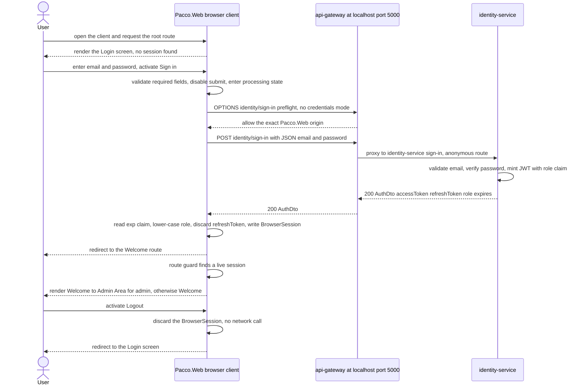
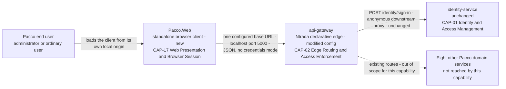
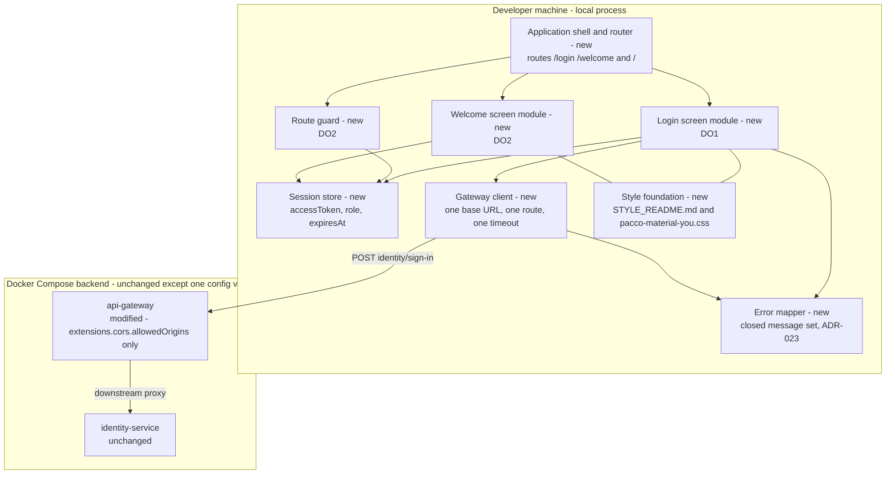
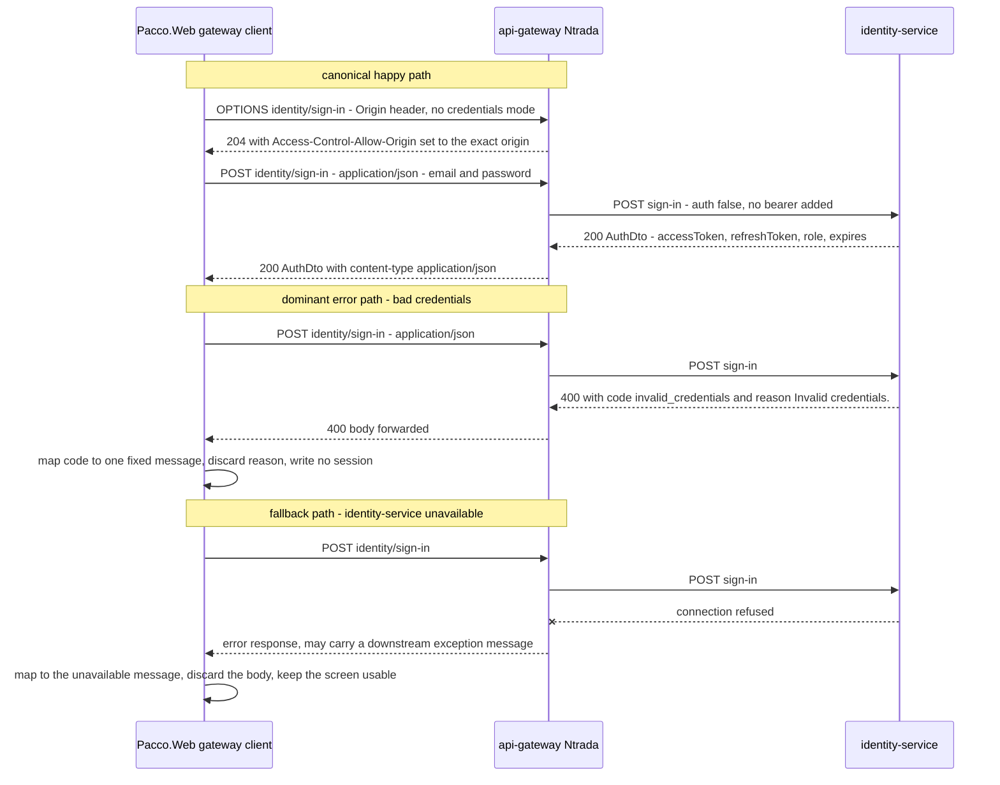
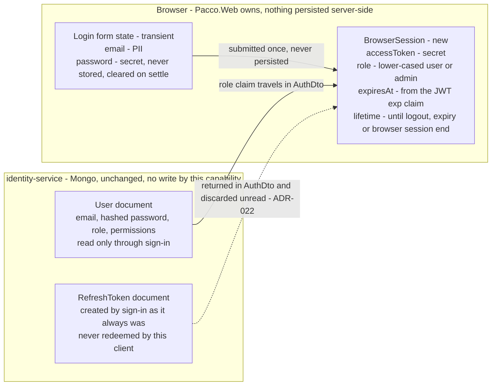
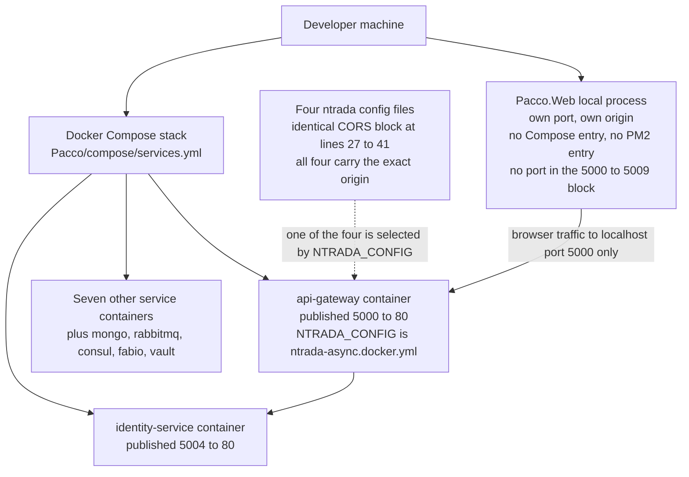

## Table of contents

- [Notation](#notation)
- [§1. Document Control](#1-document-control)
- [§1.A Stakeholders & Accountability](#1a-stakeholders--accountability)
- [§2. Scope](#2-scope)
  - [§2.1 Purpose](#21-purpose)
  - [§2.2 Background](#22-background)
  - [§2.3 Delivery Outcomes (DOs)](#23-delivery-outcomes-dos)
  - [§2.4 In Scope](#24-in-scope)
  - [§2.5 Out of Scope](#25-out-of-scope)
  - [§2.6 Constraints](#26-constraints)
  - [§2.7 Capability slice classification (MANDATORY)](#27-capability-slice-classification-mandatory)
  - [§2.8 Wave × Delivery Outcome Matrix](#28-wave--delivery-outcome-matrix)
- [§3. Intent](#3-intent)
- [§4. Delivery Outcomes](#4-delivery-outcomes)
  - [DO: DO1 — Common Pacco Login Experience](#do-do1--common-pacco-login-experience)
  - [DO: DO2 — Role-Aware Landing Page with Session Protection and Logout](#do-do2--role-aware-landing-page-with-session-protection-and-logout)
- [§5. Capability Overview](#5-capability-overview)
  - [§5.1 Summary](#51-summary)
  - [§5.2 Assumptions](#52-assumptions)
  - [§5.3 Preconditions](#53-preconditions)
  - [§5.4 Postconditions](#54-postconditions)
  - [§5.5 Main Workflow](#55-main-workflow)
  - [§5.6 Alternative Flows](#56-alternative-flows)
  - [§5.7 Exception Flows](#57-exception-flows)
  - [§5.8 System-Level Design](#58-system-level-design)
    - [§5.8.1 Impacted Components](#581-impacted-components)
    - [§5.8.A System Context View](#58a-system-context-view)
    - [§5.8.B Container / Service View](#58b-container--service-view)
    - [§5.8.C Integration View](#58c-integration-view)
    - [§5.8.D Data View](#58d-data-view)
    - [§5.8.E Deployment / Operational View](#58e-deployment--operational-view)
    - [§5.8.2 End-to-End Flow](#582-end-to-end-flow)
    - [§5.8.3 Architecture Impact and ADR Linkage](#583-architecture-impact-and-adr-linkage)
    - [§5.8.4 Design Decisions and Trade-offs](#584-design-decisions-and-trade-offs)
  - [§5.9 Implementation binding (machine-readable)](#59-implementation-binding-machine-readable)
- [§6. Functional Requirements](#6-functional-requirements)
- [§7. Business Rules](#7-business-rules)
- [§8. Data Specification](#8-data-specification)
  - [§8.1 Entities in scope](#81-entities-in-scope)
  - [§8.2 `BrowserSession` fields](#82-browsersession-fields)
  - [§8.3 Non-functional requirement traceability](#83-non-functional-requirement-traceability)
  - [§8.4 Consistency, locking, audit and retention](#84-consistency-locking-audit-and-retention)
- [§9. Interface Specification](#9-interface-specification)
  - [§9.1 `signIn` — the only interface in scope](#91-signin--the-only-interface-in-scope)
  - [§9.2 Operations in scope that bind to no interface](#92-operations-in-scope-that-bind-to-no-interface)
  - [§9.X Capability Contracts Location](#9x-capability-contracts-location)
- [§10. Workflow Specification](#10-workflow-specification)
  - [§10.1 Canonical state machine](#101-canonical-state-machine)
- [§11. UX Specification](#11-ux-specification)
  - [§11.1 Design grounding](#111-design-grounding)
  - [§11.2 Routes and screens](#112-routes-and-screens)
    - [`/login` — Login](#login--login)
    - [`/welcome` — Welcome / Landing](#welcome--welcome--landing)
  - [§11.3 Copy](#113-copy)
- [§12. Security Specification](#12-security-specification)
  - [§12.1 Authentication and authorization](#121-authentication-and-authorization)
  - [§12.2 The CORS change — the only platform-side edit](#122-the-cors-change--the-only-platform-side-edit)
  - [§12.3 Secrets and credential handling](#123-secrets-and-credential-handling)
  - [§12.4 Input handling and output safety](#124-input-handling-and-output-safety)
  - [§12.5 Audit and traceability](#125-audit-and-traceability)
  - [§12.6 Residual risks carried, not closed](#126-residual-risks-carried-not-closed)
- [§13. Operational Specification](#13-operational-specification)
  - [§13.1 Runtime topology](#131-runtime-topology)
  - [§13.2 Configuration](#132-configuration)
  - [§13.3 Deployment, rollout and rollback](#133-deployment-rollout-and-rollback)
  - [§13.4 Observability](#134-observability)
  - [§13.5 Ownership and support](#135-ownership-and-support)
  - [§13.6 Operator note — what logout does and does not do](#136-operator-note--what-logout-does-and-does-not-do)
- [§14. Test Specification](#14-test-specification)
  - [§14.A Test Strategy & Coverage Plan](#14a-test-strategy--coverage-plan)
    - [E2E scenarios](#e2e-scenarios)
    - [Cross-wave integration map](#cross-wave-integration-map)
    - [API coverage expectations](#api-coverage-expectations)
    - [UI coverage expectations](#ui-coverage-expectations)
    - [Negative and regression scope](#negative-and-regression-scope)
    - [Non-functional test requirements](#non-functional-test-requirements)
    - [Coverage targets](#coverage-targets)
- [§15. Agent Instructions](#15-agent-instructions)
- [§16. Acceptance Criteria](#16-acceptance-criteria)
- [§17. Outcome Validation](#17-outcome-validation)
  - [DO1 — Common Pacco Login Experience](#do1--common-pacco-login-experience)
  - [DO2 — Role-Aware Landing Page with Session Protection and Logout](#do2--role-aware-landing-page-with-session-protection-and-logout)
  - [Field signals after release](#field-signals-after-release)
- [§19. Traceability Matrix](#19-traceability-matrix)
- [§19.A Reference Conformance Summary](#19a-reference-conformance-summary)
- [§19.B Review Resolution History](#19b-review-resolution-history)
- [Assumptions, Blockers & Open Questions](#assumptions-blockers--open-questions)
  - [Assumptions](#assumptions)
  - [Blockers](#blockers)
  - [Open Questions](#open-questions)

# 13652 — Execution Specification Document

## Notation

| Symbol | Meaning |
| --- | --- |
| ✅ | Confirmed current behaviour — observed in source at the cited path |
| 🎯 | Target state — intended design, not implemented today |
| ❓ | Needs validation — assumed or inferred, not observed in source |
| 🚫 | `BLOCKING_FOR_LLD` — low-level spec generation must not proceed until resolved |
| ⚠️ | `NON_BLOCKING_ASSUMPTION` — carried forward with a validation path |

---

## §1. Document Control

- **Spec ID**: ESD-13652-v1
- **Capability Name**: Pacco Web Login and Role-Aware Welcome Landing (CAP-17 Web Presentation & Browser Session)
- **Intent ID**: INT-13652-v1
- **Version**: 1.0
- **Status**: Draft
- **Author**: AI Generated for Review
- **Reviewers**: Product, Architecture, Engineering, QA, DevOps, Security
- **Date (UTC)**: 2026-09-25
- **Branch**: `feature/13652/spec-generation`
- **Related ADRs**: `ADR-021` (governing — `Pacco.Web` as the standalone browser client and the browser-caller contract at the edge), `ADR-004` (declarative configuration-driven API gateway), `ADR-006` (edge-enforced authentication), `ADR-007` (split JWT trust root), `ADR-017` (compose and process-manager deployment), `ADR-018` (repository per service, independent release), `ADR-020` (.NET Core 3.1 runtime baseline — scoped out for this client, see §19.A), `ADR-022` (new — browser session bounded by access-token expiry), `ADR-023` (new — browser-boundary error presentation contract)
- **Primary inputs**: `intents/13652.md`, `docs/specs/13652/solution-design.md`, `docs/adr/standalone-browser-client-and-browser-caller-edge-contract.md`, `docs/architecture-inventory/risk-constraint-gap-register.md`, and the source repositories `Pacco.Services.Identity`, `Pacco.APIGateway`, `Pacco`, `Pacco.Web`

## §1.A Stakeholders & Accountability

No `CODEOWNERS` file, contributing guide, maintainer list or team metadata exists in any of the
fourteen cloned repositories, so no role-holder can be named without fabricating one. Every cell
below is therefore left empty and carried as `B1` in the ABQ section (🚫 `BLOCKING_FOR_LLD`). This is
the same gap `ADR-004` records as its blocker B1 and the risk register records as `R-12`.

| Role | Name / Team | Accountability |
|------|-------------|----------------|
| Product Owner |  | scope and priority decisions |
| Engineering Lead |  | architecture choices and delivery |
| Security Reviewer |  | threat model and controls sign-off |
| Privacy / Compliance |  | data-handling, PII boundaries, retention |
| SRE / Operations |  | rollout, runbook, on-call coverage |
| QA Lead |  | test strategy and acceptance gates |

## §2. Scope

### §2.1 Purpose

Pacco has no end-user entry point. Every one of the platform's forty-one gateway routes is reachable
only by a machine caller holding a JWT obtained out of band, and the single piece of browser-rendered
markup anywhere in the workspace is a SignalR developer harness served from inside the
`operations-service` container. This capability gives Pacco its first authenticated human entry
point: one Login screen used by administrators and ordinary users alike, and one deliberately simple
Welcome/Landing screen whose message is decided by the authenticated identity role and by nothing
else. It is delivered in `Pacco.Web`, the standalone browser client established by `ADR-021`, and it
consumes the existing `POST /identity/sign-in` route through the existing API Gateway without
changing any service, route, contract or claim.

### §2.2 Background

Four facts from the current platform shape every decision in this document.

1. ✅ **`Pacco.Web` is empty.** The clone tracks exactly one file, `README.md`, containing the single
   line `# Pacco.Web`, on one commit `b3bf026 Initial commit`. There is no `src/`, no `package.json`,
   no `Dockerfile` and no build. Nothing can be extended here — everything is authored from zero.
2. ✅ **Sign-in already works, anonymously, at the edge.** `POST /identity/sign-in` is declared with
   `auth: false` and `use: downstream` in all four gateway configurations, proxying to
   `identity-service/sign-in`, which returns `AuthDto` carrying `AccessToken`, `RefreshToken`, `Role`
   and `Expires`. Both the authentication outcome DO1 needs and the role claim DO2 needs exist today
   (`Pacco.APIGateway/src/Pacco.APIGateway/ntrada.yml:263-269`,
   `Pacco.Services.Identity/src/Pacco.Services.Identity.Application/DTO/AuthDto.cs`).
3. ✅ **The edge's CORS policy allows every origin.** `extensions.cors` declares
   `allowedOrigins: ['*']` together with `allowCredentials: true`, byte-identically at lines 27-41 of
   `ntrada.yml`, `ntrada.docker.yml`, `ntrada-async.yml` and `ntrada-async.docker.yml`. This
   capability's one browser call does **not** run in credentials mode (DD-12), so the wildcard would
   function for it as it stands; what it would also do is grant every origin on the internet
   cross-origin read access to the edge. `ADR-021` §5 rule 4 replaces the wildcard with the exact
   `Pacco.Web` local origin while keeping `allowCredentials: true`. The change is therefore a
   **policy hardening** — the edge names its one browser caller instead of naming none — and it is
   also what makes the configuration internally consistent should a credentialed call ever be added,
   since the WHATWG Fetch Standard forbids a wildcard `Access-Control-Allow-Origin` on a credentialed
   request. See §12.2.
4. ✅ **Token revocation is not reachable from the edge.** No gateway configuration declares a route
   for `access-tokens/revoke`, `refresh-tokens/use` or `refresh-tokens/revoke`, and `ADR-007`
   obligation 4 records that the gateway does not consult the revocation store. A logout that
   genuinely invalidates a token cannot be built without changing the edge, which the reviewer
   decision placed out of scope.

### §2.3 Delivery Outcomes (DOs)

Both DO statements below are reproduced from `intents/13652.md`. Full per-DO index and expansion is
in §4.

- **DO1 — Common Pacco Login Experience.** One common Pacco login screen for administrators and
  ordinary users, with required-field validation, a processing state that prevents duplicate
  submissions, authentication against `identity-service` through the declarative API Gateway,
  redirect to the landing page on success, and a clear non-technical error on invalid credentials or
  service failure. *Metric:* authentication outcomes surfaced safely and exactly once per submission.
  *Target:* 0 raw backend exceptions or stack traces shown to users; 0 password values logged or
  displayed; 0 duplicate login submissions accepted while a request is in progress. *Priority:* 1.
  *Dependencies:* none. *Produces for DO2:* the authenticated session and identity role claim.
  *Complexity:* high.
- **DO2 — Role-Aware Landing Page with Session Protection and Logout.** An intentionally simple
  landing page whose message is determined solely from the authenticated identity role within
  `identity-service`'s closed lower-cased vocabulary of `user` and `admin`, a guard that redirects an
  unauthenticated request back to Login, and a client-side logout that returns the user to Login.
  *Metric:* landing message matches the authenticated identity role. *Target:* 0 unknown-role or
  normal users shown "Welcome to Admin Area"; 0 unauthenticated requests reaching the landing page;
  0 new logout/revoke gateway routes added and 0 changes to the gateway's JWT validation or
  revocation behaviour. *Priority:* 2. *Dependencies:* DO1. *Consumes from DO1:* the authenticated
  session and identity role claim. *Complexity:* medium.

### §2.4 In Scope

- A Login screen in `Pacco.Web` with Email/Username and Password entry, required-field validation, an
  in-flight processing state, and single-submission enforcement.
- Authentication against the **existing** `POST /identity/sign-in` route through the local API
  Gateway at `http://localhost:5000`, consumed unchanged.
- A browser-held session carrying the access token, the identity role and the session expiry.
- A Welcome/Landing screen rendering "Welcome to Admin Area" for `admin` and "Welcome" for `user`.
- A client-side route guard that redirects any unauthenticated or expired request for the landing
  route back to Login.
- Client-side logout: clear the held session, redirect to Login, never reuse the cleared token.
- A closed, user-safe error message set that never renders a backend response body verbatim.
- One configuration change at the edge: replacing `allowedOrigins: ['*']` with the exact `Pacco.Web`
  local origin in **all four** `ntrada*.yml` files, `allowCredentials: true` retained.
- `Pacco.Web` running as its own local process beside the Docker Compose backend, independently
  buildable.

### §2.5 Out of Scope

- Separate Admin and normal-user login screens, and any UI control that asks the user to declare a
  user type.
- User registration, account creation, password recovery and password reset. `POST /identity/sign-up`
  exists at the edge and is deliberately not consumed by this capability.
- Role management or any change to a user's role.
- Dashboard widgets or any business functionality after the landing page.
- Any change to the existing Pacco authentication or authorization backend: no new gateway route, no
  change to the gateway's JWT validation or revocation behaviour, no change to `identity-service`.
- Exposing `access-tokens/revoke`, `refresh-tokens/use` or `refresh-tokens/revoke` at the edge.
- Token renewal or silent session extension.
- A backend-for-frontend service, and any response aggregation or per-client shaping at the edge —
  `ADR-004` §2 obligation 3 forbids the latter in this configuration and requires a separate recorded
  decision for the former.
- A platform-wide design system. The style assets are scoped to this client per `ADR-021` §5 rule 7.
- Dev, QA, Staging and Production frontend environments. None exist; their origins, gateway URLs, DNS
  names and deployment targets are defined when those environments are introduced.
- Turning `includeExceptionMessage` off at the edge. That setting affects every existing machine
  caller and is governed by `ADR-004`; the mitigation here is client-side only.

### §2.6 Constraints

| # | Constraint | Type | Source |
|---|-----------|------|--------|
| C1 | One common Login UI for both roles, and the UI must never ask the user to select whether they are Admin or a normal user | Product | Raw ticket, Constraints & Guardrails |
| C2 | User type is determined from the authenticated identity role only — never inferred from username or email address, and an unknown or unsupported role must never default to Admin | Security / correctness | Raw ticket; `Role.cs` closed vocabulary |
| C3 | Password values must not be logged or displayed | Security | Raw ticket |
| C4 | Login credentials must not be hard-coded in the frontend | Security | Raw ticket |
| C5 | Duplicate login submissions must be prevented while a request is in progress | Correctness | Raw ticket |
| C6 | Raw backend exceptions or stack traces must not be shown to users | Security | Raw ticket; gateway `includeExceptionMessage: true` |
| C7 | The landing page must remain intentionally simple — no dashboard, no business functionality | Product | Raw ticket |
| C8 | The browser reaches the platform only through the edge at `http://localhost:5000`, never a service directly | Architecture | `ADR-021` §5 rule 3; `ADR-006` obligation 3 |
| C9 | `Pacco.Web` is never bundled into a backend service image and is never served by Ntrada | Architecture | `ADR-021` §5 rules 1 and 2 |
| C10 | The CORS change must be applied identically to all four `ntrada*.yml` files | Operability | `ADR-021` §5 rule 4; `ADR-004` §2 obligation 2 |
| C11 | Logout is a client-side session discard only; the already-issued token stays valid at the platform level until it expires, and that limitation must be stated to reviewers | Architecture / security | `ADR-021` §5 rule 5; `ADR-007` obligation 4 |
| C12 | The edge's routing configuration is a reviewed architectural artifact — the CORS change is a public-contract change and must be reviewed as one | Governance | `ADR-004` §2 obligation 1 |

### §2.7 Capability slice classification (MANDATORY)

**Slice type: Business capability slice.** The deliverable is user-facing business behaviour — a
login experience and a role-aware landing experience. It carries one unavoidable technical-foundation
side effect (it is the platform's first browser client), and that side effect is *already owned* by
`ADR-021` rather than being decided here; this ESD consumes that boundary instead of redrawing it.

| Dimension | Value |
|---|---|
| **Owned capabilities** | `CAP-17` Web Presentation & Browser Session — Login screen, Welcome/Landing screen, browser session custody, role-aware UI behaviour |
| **Impacted capabilities** | `CAP-02` Edge Routing & Access Enforcement — one declarative CORS value changes; no route, claim or auth rule changes. `CAP-16` Environment & Deployment Definition — one additional local process beside the Compose stack |
| **Unchanged capabilities consumed as-is** | `CAP-01` Identity & Access Management — `POST /identity/sign-in` and the `user`/`admin` role vocabulary are consumed without modification |
| **Upstream dependencies** | `identity-service` (authentication outcome and role claim), `api-gateway` (the only transport) |
| **Downstream dependencies** | None. No Pacco service consumes anything this capability produces |
| **Repositories in scope** | `Pacco.Web` (implementation, all new code), `Pacco.APIGateway` (four-line configuration change), `Pacco.Context` (this spec pack, `ADR-022`, `ADR-023`, platform map) |
| **Services / modules in scope** | `Pacco.Web` — Login module, Welcome module, session module, gateway client module, error-mapping module. `api-gateway` — `extensions.cors.allowedOrigins` only |
| **APIs in scope** | `POST /identity/sign-in` at the edge (consumed unchanged, no contract change) |
| **UI routes / screens in scope** | `/login` (Login screen), `/welcome` (Welcome/Landing screen), `/` (session-aware redirect) |
| **Entities / tables in scope** | None persisted by this capability. `identity-service`'s `users` collection is read through sign-in and never written. The only new data structure is the browser-held `BrowserSession`, which lives in the browser and in no database — see §8 |
| **Explicitly outside the boundary** | Every other gateway route, every other service, every Mongo collection, every RabbitMQ exchange |

### §2.8 Wave × Delivery Outcome Matrix

This HL ESD is the single source of truth for which wave owns which Delivery Outcome. The wave
grouping below is the orchestrator-derived plan copied verbatim; it is not re-derived here and must
not be merged, reordered or renumbered by any low-level wave spec.

| Wave | LL Spec File (target path) | DO IDs owned (verbatim from §2.3) | Primary deliverables (one-line summary) | Depends on prior waves |
|------|----------------------------|------------------------------------|-----------------------------------------|------------------------|
| wave-1 | `docs/specs/13652/LOW_LEVEL_SPEC-13652-wave-1.md` | DO1 | The `Pacco.Web` application shell, the Login screen with validation, in-flight single-submission control and the user-safe error mapping, the gateway-only sign-in client, the browser session write path, and the exact-origin CORS change across all four `ntrada*.yml` files | — |
| wave-2 | `docs/specs/13652/LOW_LEVEL_SPEC-13652-wave-2.md` | DO2 | The Welcome/Landing screen with the closed-vocabulary role message, the unauthenticated and expired-session route guard, and client-side logout | wave-1 (§L.8.2 carry rules apply — wave-2 consumes the browser session and role claim produced by DO1) |

If a downstream LL wave file would need to contradict this matrix, that is a `BLOCKING_FOR_LLD`
condition: this HL ESD must be revised first, never the LL.

## §3. Intent

Pacco needs one login screen that serves administrators and ordinary users through the same
authentication flow, and a landing page that greets the signed-in user according to their role
without introducing any further business functionality. The actors are the ordinary Pacco user and
the Pacco administrator, both authenticating against the existing `identity-service` through the
existing declarative API Gateway; the implementing actor is `Pacco.Web`, the standalone browser
client. Success means an administrator signing in sees "Welcome to Admin Area", an ordinary user sees
"Welcome", an unknown or unsupported role never sees the administrator message, the landing route is
unreachable without a session, logout returns the user to Login, and no password value, backend
exception message or stack trace is ever displayed or logged along the way. Every workspace gap this
intent depends on — the unfixed local origin, the undecided client technology, the absent style
assets, the unverified gateway CORS behaviour — is recorded once in the Assumptions, Blockers & Open
Questions section at the end of this document and nowhere else.

## §4. Delivery Outcomes

### DO: DO1 — Common Pacco Login Experience

```
DO: DO1

Purpose:
  One Pacco Login screen authenticates both administrators and ordinary users through the
  existing gateway sign-in route and surfaces the outcome safely, exactly once per submission.

Consumes:
  - UI trigger: user submits the Login form
  - API: POST /identity/sign-in at the edge http://localhost:5000 (existing, anonymous)
  - Config: the local API Gateway base URL, supplied as client configuration

Produces:
  - UI state: the browser-held BrowserSession carrying accessToken, role and expiresAt
  - UI state: a user-safe authentication error message drawn from a closed set
  - UI navigation: redirect to the /welcome route on success
  - Platform config: the exact Pacco.Web local origin in extensions.cors.allowedOrigins

Primary Components:
  - Pacco.Web — application shell, Login screen, gateway client, error mapper, session writer
  - api-gateway — extensions.cors.allowedOrigins only, in all four ntrada*.yml files

Primary Contracts:
  - POST /identity/sign-in — request SignIn, success AuthDto, error {code, reason}
    Owned by identity-service, consumed unchanged. See §9.
  - No new contract artifact is authored by this DO.

Depends On:
  - none

Files:
  - Pacco.Web — paths not determinable yet, the client source layout follows the framework decision (ABQ B2)
  - Pacco.APIGateway/src/Pacco.APIGateway/ntrada.yml lines 27-41
  - Pacco.APIGateway/src/Pacco.APIGateway/ntrada.docker.yml lines 27-41
  - Pacco.APIGateway/src/Pacco.APIGateway/ntrada-async.yml lines 27-41
  - Pacco.APIGateway/src/Pacco.APIGateway/ntrada-async.docker.yml lines 27-41
```

**Success metric.** Authentication outcomes surfaced safely and exactly once per submission.
**Targets.** 0 raw backend exceptions or stack traces shown to users · 0 password values logged or
displayed · 0 duplicate login submissions accepted while a request is in progress.

**Design narrative.** The Login screen is a single form with two fields and one submit control. There
is no role selector, no second screen and no branch on the entered value — C1 and C2 are satisfied
structurally, by the absence of the control, not by a rule that could be got wrong. Required-field
validation runs entirely in the browser and blocks submission before any network call, so an empty
form never reaches the edge. The submit control transitions to a disabled processing state on the
first submission and stays there until the request settles, which is the whole of C5: the control is
the lock.

The request goes to one configured URL and one route. `Pacco.Web` holds the gateway base URL
`http://localhost:5000` and no per-service URL, so no browser code can address `identity-service`
directly even by accident (`ADR-021` §5 rule 3). Because the request is cross-origin and carries
`Content-Type: application/json`, the browser issues a preflight first. That call is **not** made in
credentials mode (DD-12): the route is anonymous, no cookie is sent, and the session lives in the
browser rather than in a `Set-Cookie`. Narrowing the allow-list to the one exact origin is therefore
a policy hardening rather than a functional precondition for this DO — see §12.2.

The error path is the load-bearing part of this DO. ✅ `identity-service` maps **every** mapped
exception to HTTP **400 Bad Request** with a body of `{code, reason}` — it never returns 401 for bad
credentials (`Pacco.Services.Identity.Infrastructure/Exceptions/ExceptionToResponseMapper.cs`). ✅ The
gateway sets `extensions.customErrors.includeExceptionMessage: true`, so a downstream exception
message travels to the browser verbatim. ✅ `InvalidEmailException` builds its message as
`$"Invalid email: {email}."`, echoing the submitted value straight back into `reason`. A client that
renders `reason` therefore leaks internal vocabulary and reflects user input into the DOM. `DO1`'s
zero-raw-exception target is met only by mapping the response `code` to a fixed message from a closed
set and never rendering the body — the rule recorded as `ADR-023`.

### DO: DO2 — Role-Aware Landing Page with Session Protection and Logout

```
DO: DO2

Purpose:
  The landing page greets the signed-in user according to the authenticated identity role only,
  is unreachable without a session, and can be left by a client-side logout.

Consumes:
  - UI state: the BrowserSession produced by DO1 — accessToken, role, expiresAt
  - UI trigger: navigation to /welcome, and the Logout control

Produces:
  - UI state: the rendered role-aware message, Welcome to Admin Area or Welcome
  - UI navigation: redirect to /login when no session, when the session has expired, and on logout
  - UI state: the session-expired notice on the Login screen

Primary Components:
  - Pacco.Web — Welcome screen, route guard, session reader, session discard

Primary Contracts:
  - None. This DO calls no API. It reads the session DO1 produced and calls nothing at the edge.
  - Role vocabulary: user and admin, owned by
    Pacco.Services.Identity.Core/Entities/Role.cs. See §7 BR-4.

Depends On:
  - DO1

Files:
  - Pacco.Web — paths not determinable yet, the client source layout follows the framework decision (ABQ B2)
```

**Success metric.** The landing message matches the authenticated identity role.
**Targets.** 0 unknown-role or normal users shown "Welcome to Admin Area" · 0 unauthenticated
requests reaching the landing page · 0 new logout/revoke gateway routes added and 0 changes to the
gateway's JWT validation or revocation behaviour.

**Design narrative.** The landing page has exactly one decision to make and it makes it from one
input. ✅ `Role.cs` defines a closed vocabulary — `User = "user"`, `Admin = "admin"` — and
`IsValid(string)` lower-cases before comparing and rejects null, empty and whitespace. ✅ `User.cs`
lower-cases the role on construction, so the value in `AuthDto.Role` is already lower case. The
landing page compares the session role to the literal `admin` after lower-casing, shows "Welcome to
Admin Area" only on an exact match, and shows "Welcome" in every other case including an absent,
empty or unrecognised value. The default is non-admin by construction: there is no branch in which an
unknown value can reach the administrator message. That is C2 and the `R-06` mitigation.

The route guard is client-side. This is worth saying plainly rather than implying it: the landing
page calls no API, so there is no server-side authorization decision available to protect it, and a
determined user can read the page's markup regardless. The guard prevents the *unauthenticated
experience* — a user without a session is sent to Login rather than shown an empty greeting — and it
protects no data, because the page holds none. That boundary is stated in §12 rather than dressed up
as an access control.

Logout clears the browser-held session, redirects to Login, and stops using the token. It issues no
network call. ✅ No `ntrada*.yml` declares a route for `access-tokens/revoke`, `refresh-tokens/use`
or `refresh-tokens/revoke`, and ✅ `ADR-007` obligation 4 records that the gateway does not consult
the revocation store. The consequence is stated once here and repeated in §12: **the already-issued
token is not invalidated at the platform level — it remains acceptable to the gateway and to the
domain services until it expires.** This is the accepted residual risk `R-03`, accepted by explicit
reviewer decision, not an oversight.

## §5. Capability Overview

### §5.1 Summary

`Pacco.Web` is authored from an empty repository as a standalone browser client that serves its own
document and assets from its own local origin and holds no server-side state. It exposes two routes —
`/login` and `/welcome` — plus a session-aware redirect at `/`. It is configured with exactly one
platform address, the local API Gateway at `http://localhost:5000`, and with no per-service URL, so
the only platform call it can make is through the edge. For this capability it makes exactly one such
call: `POST /identity/sign-in`, the existing anonymous downstream route.

The client's internal shape is four concerns. A **gateway client** owns the single HTTP call and the
timeout that bounds it. An **error mapper** turns any non-success outcome into one of four fixed
user-facing strings, keyed on the `code` field of the `{code, reason}` body and never on `reason`
itself. A **session store** holds the access token, the lower-cased role and the session expiry for
the lifetime of the browsing session and discards them on logout, on expiry and on browser close. A
**route guard** reads the session store and decides whether `/welcome` renders or redirects. Nothing
else in the client makes an authorization decision, because nothing else has a decision to make.

Three properties of the existing platform drive the design more than anything in the requirement
text. First, `identity-service` returns **HTTP 400** with `{code, reason}` for every mapped failure
including bad credentials — there is no 401 to key on, so the client must key on `code`. Second, the
gateway forwards downstream exception messages verbatim, so the response body is untrusted output and
must never be rendered. Third, the refresh token in `AuthDto` has no redeemable route at the edge, so
the session simply ends at access-token expiry and the client must detect that locally rather than
learn it from a rejected call. The first two are settled by `ADR-023`, the third by `ADR-022`.

### §5.2 Assumptions

| # | Assumption | Classification |
|---|-----------|----------------|
| ASM-1 | The exact `Pacco.Web` local origin — scheme, host and port — is not fixed anywhere in the workspace or in `ADR-021`. `http://localhost:3000` appears in `ADR-021` §5 rule 4 as an illustrative example, not a decision. Until the value is fixed, neither the four `ntrada*.yml` edits nor the client's dev-server binding can be written | 🚫 `BLOCKING_FOR_LLD` |
| ASM-2 | No frontend technology, framework, package manager, bundler, test runner or module layout is decided for `Pacco.Web` anywhere in the workspace. `ADR-021` deliberately does not choose one, and the UI inventory proves an exhaustive absence of any frontend build across all fourteen repositories. Module paths in §4 and §5.9 stay unresolved until it is chosen | 🚫 `BLOCKING_FOR_LLD` |
| ASM-3 | The approved style assets `STYLE_README.md` and `pacco-material-you.css` named by `ADR-021` §5 rule 7 and by DO1 do not exist in any of the fourteen repositories — a workspace-wide filename search returns nothing. The UI foundation they are supposed to supply cannot be grounded until they are provided | 🚫 `BLOCKING_FOR_LLD` |
| ASM-4 | Ntrada's `extensions.cors` is assumed to behave as an exact-match origin allow-list that echoes the matched origin in `Access-Control-Allow-Origin`, and to answer the `OPTIONS` preflight that a JSON `POST` triggers. Ntrada is a NuGet reference and its source is not in the workspace, so this is read from the key names, not proven from code. The same gap applies to today's wildcard value | ⚠️ `NON_BLOCKING_ASSUMPTION` |
| ASM-5 | `extensions.cors.allowedMethods` lists `post`, `put` and `delete` and omits `get`. This capability issues only a `POST` through the edge, so the omission does not affect DO1 or DO2. It is assumed that the preflight for that `POST` succeeds without `get` or `options` being listed | ⚠️ `NON_BLOCKING_ASSUMPTION` |
| ASM-6 | `AuthDto.Expires` is a `long` produced by `Convey.Auth`'s `IJwtHandler`, whose source is not in the workspace, so its unit — seconds or milliseconds since epoch — cannot be verified here. The design does not depend on it: session expiry is read from the JWT's standard `exp` claim, whose unit RFC 7519 fixes as seconds since epoch. `expires` is carried in the session for diagnostics only | ⚠️ `NON_BLOCKING_ASSUMPTION` |
| ASM-7 | The local Docker Compose stack loads `ntrada-async.docker.yml` — `NTRADA_CONFIG` is set to that value at `Pacco/compose/services.yml:4-13`. Which file each *other* environment loads is unrecorded, which is why the CORS change is applied to all four rather than to the one believed to be live | ⚠️ `NON_BLOCKING_ASSUMPTION` |
| ASM-8 | No availability, latency or error-rate target exists for any Pacco component anywhere in the workspace. The client's sign-in timeout is therefore a usability choice with no platform SLO behind it, and §13 names a provisional value rather than deriving one | ⚠️ `NON_BLOCKING_ASSUMPTION` |
| ASM-9 | No role-holder can be named for any row of §1.A, because no `CODEOWNERS`, contributing guide or team metadata exists in any repository. Every accountability assignment in §13 and §14 therefore names a role, not a person | 🚫 `BLOCKING_FOR_LLD` |
| ASM-10 | `identity-service` accepts an email address in the `email` field of `SignIn` and validates it against `EmailRegex`, rejecting anything else with `invalid_email`. The Login screen's field is labelled "Email or Username" in the approved design, but the service supports no username form. The screen therefore accepts one input and submits it as `email`, and a non-email value fails with the same user-safe message as bad credentials | ⚠️ `NON_BLOCKING_ASSUMPTION` |
| ASM-11 | Exactly one `Pacco.Web` origin exists at a time in the local development topology, and it is distinct from the gateway origin. Both properties are load-bearing for the CORS model: if the client were ever served from the gateway's own origin the allow-list entry would be unnecessary, and if more than one client origin existed the single-entry model in §5.8.E would not survive. Neither shape is planned, and `ADR-021` §5 rule 2 forbids the same-origin case | ⚠️ `NON_BLOCKING_ASSUMPTION` |

Every ASM above also appears as a row in the Assumptions, Blockers & Open Questions section at the
end of this document. Each 🚫 item additionally appears there as a Blocker.

### §5.3 Preconditions

1. The Pacco backend is running through Docker Compose, with `api-gateway` published on host port
   5000 (`Pacco/compose/services.yml:4-13`) and `identity-service` reachable behind it.
2. At least one user record exists in `identity-service` with role `admin` and at least one with role
   `user`, created out of band through `POST /identity/sign-up`.
3. The exact `Pacco.Web` local origin is fixed (ASM-1) and present in
   `extensions.cors.allowedOrigins` of the `ntrada*.yml` file the running gateway loads — and, per
   C10, of the other three as well.
4. `Pacco.Web` is running as its own local process, serving from that origin, configured with the
   gateway base URL and with no per-service URL.

### §5.4 Postconditions

1. **On successful sign-in:** the browser holds a `BrowserSession` containing the access token, the
   lower-cased role and the session expiry, and the user is on `/welcome` seeing the message that
   matches their role. No server-side state changed beyond what `identity-service` already does on
   sign-in — it issues a refresh token and publishes a `SignedIn` message, exactly as it does for any
   other caller.
2. **On failed sign-in:** no session exists, the Login screen is intact and usable, the email field
   retains its value, the password field is cleared, and one user-safe message is displayed.
3. **On logout:** no session exists in the browser, the user is on `/login`, and the discarded access
   token is never sent again by this client. ⚠️ The token itself remains valid at the platform level
   until it expires — see §12.
4. **On expiry:** no session exists, the user is on `/login`, and a session-expired notice is shown.

### §5.5 Main Workflow

1. The user opens `Pacco.Web` at its local origin. The root route finds no session and renders
   `/login`.
2. The user enters an email address and a password. The password field is masked, with an optional
   reveal toggle.
3. The user activates **Sign in**. The client validates both fields as non-empty. If either is empty,
   the submission is blocked, the offending field is marked, and no network call is made.
4. The client disables the submit control and enters the processing state. Any further activation of
   the control is ignored until the request settles — one submission is in flight at a time.
5. The client issues `POST http://localhost:5000/identity/sign-in` with
   `Content-Type: application/json` and body `{"email": "...", "password": "..."}`, **not** in
   credentials mode (DD-12). The browser first issues the `OPTIONS` preflight that the JSON content
   type triggers, which the edge answers from its exact-origin allow-list.
6. The gateway matches the anonymous `identity` route and proxies to `identity-service/sign-in`
   without adding or validating a token.
7. `identity-service` validates the email against `EmailRegex`, loads the user, verifies the password,
   mints a JWT carrying the role claim, creates a refresh token, publishes `SignedIn`, and returns
   `AuthDto`.
8. The client receives HTTP 200 with `{accessToken, refreshToken, role, expires}`. It reads the `exp`
   claim from the access token for session timing, lower-cases `role`, **discards `refreshToken`
   without storing it** (`ADR-022`), and writes the `BrowserSession`.
9. The client navigates to `/welcome`.
10. The route guard finds a live session and renders the landing page. The page compares the session
    role to `admin` and renders "Welcome to Admin Area", or "Welcome" for every other value.
11. The user activates **Logout**. The client discards the session and navigates to `/login`. No
    network call is made.



### §5.6 Alternative Flows

| # | Trigger | Behaviour |
|---|---------|-----------|
| AF-1 | The user submits with one or both fields empty | Submission is blocked in the browser, the empty field is marked with a visible message and programmatically associated with the field, focus moves to the first offending field, and no request is sent |
| AF-2 | The user activates Sign in repeatedly while a request is in flight | The second and subsequent activations are ignored. Exactly one request reaches the edge per user-initiated submission |
| AF-3 | The user navigates directly to `/welcome` with no session | The guard redirects to `/login` before the landing page renders |
| AF-4 | The user reloads `/welcome` with a live session | The session survives the reload and the same role-aware message renders. A session that does not survive reload fails AC-20 and E2E-9 |
| AF-5 | The session role is absent, empty, or a value outside `user` and `admin` | "Welcome" renders. The administrator message is unreachable |
| AF-6 | The user presses the browser Back control after logout | The guard finds no session and `/login` renders. The landing page is not restored from history in a signed-out state |
| AF-7 | The user opens the client with an expired session already held | The guard treats it as no session, discards it, and renders `/login` with the session-expired notice |

### §5.7 Exception Flows

| # | Condition | Observable response | User-facing message |
|---|-----------|--------------------|---------------------|
| EF-1 | Wrong password, or an email with no matching user | HTTP 400, `{"code": "invalid_credentials", "reason": "Invalid credentials."}` | "The email or password you entered is incorrect." |
| EF-2 | The submitted value is not a valid email address | HTTP 400, `{"code": "invalid_email", "reason": "Invalid email: <submitted value>."}` — ⚠️ the body echoes the submitted value | The same message as EF-1. The two are deliberately indistinguishable to the user, matching `identity-service`'s own non-disclosure behaviour |
| EF-3 | `identity-service` is stopped, or the gateway cannot reach it | Gateway error response, shape not fixed by `identity-service`; ⚠️ may carry a downstream exception message because `includeExceptionMessage` is `true` | "Sign-in is temporarily unavailable. Please try again." |
| EF-4 | The request exceeds the client timeout, or the network fails | No HTTP response | "Sign-in is temporarily unavailable. Please try again." |
| EF-5 | The response is HTTP 200 but the body is missing `accessToken` or `role`, or is not valid JSON | Malformed success | "Something went wrong. Please try again." — no session is written |
| EF-6 | The CORS preflight is refused, so the browser blocks the call | No readable response; the failure is visible only in the browser console | "Sign-in is temporarily unavailable. Please try again." — and §13 names this as the first thing to check, because it is the expected symptom of ASM-1 and `R-05` going wrong |
| EF-7 | Any other non-success status or unmapped `code` | Any | "Something went wrong. Please try again." |

In every row the client renders only the message in the last column. The `reason` field, the HTTP
status, any stack trace and any raw body are never displayed and never written to browser storage or
to a telemetry payload. Diagnostics go to the browser console only, with the request body redacted.

### §5.8 System-Level Design

#### §5.8.1 Impacted Components

| Component | Classification | Repository | What changes |
|---|---|---|---|
| `Pacco.Web` | **new** — the entire component | `Pacco.Web` | Everything. Application shell, `/login` and `/welcome` routes, gateway client, error mapper, session store, route guard, and the first authored stylesheet. The repository holds one file today |
| `api-gateway` | **existing-modified** — configuration only | `Pacco.APIGateway` | One value in `extensions.cors.allowedOrigins`, at lines 27-41 of each of `ntrada.yml`, `ntrada.docker.yml`, `ntrada-async.yml` and `ntrada-async.docker.yml`. `allowCredentials`, `allowedMethods`, `allowedHeaders`, `exposedHeaders`, every route, every claim rule, the JWT block and `customErrors` are untouched |
| `identity-service` | **existing-unchanged** | `Pacco.Services.Identity` | Nothing. `POST /sign-in`, `AuthDto`, `Role`, the exception mapper and the revocation endpoints are all consumed or ignored as they stand |
| Compose stack | **existing-unchanged** | `Pacco` | Nothing. `Pacco.Web` takes no Compose entry, no PM2 entry and no port in the 5000–5009 block — `ADR-021` §5 rule 2 makes that absence the decided state, not an omission |
| `docs/adr` | **new records** | `Pacco.Context` | `ADR-022` and `ADR-023` |
| `docs/architecture-inventory/architecture-views.md` | **existing-modified** — minimal | `Pacco.Context` | Cross-references from §3.6 and §4.6 to this ESD and to the two new ADRs. No node, edge or diagram is restructured |
| Data stores | **none** | — | No collection, table, index or migration anywhere |
| External systems | **none** | — | This capability integrates with no system outside the Pacco platform. See §5.8.C |

#### §5.8.A System Context View



The context has exactly three participants and one new edge. `Pacco.Web` is the only new box. The
edge from the browser to the gateway is new **as a browser edge** — the route it uses has existed
since the platform was built, but it has never had a browser caller, which is why the CORS posture
has to change before the edge can be used at all. There is no fourth participant: this capability
integrates with **no external system**, no third-party identity provider, no payment or messaging
counterparty, and no system outside the Pacco platform boundary. The dashed edge is drawn only to
show what this capability deliberately does not touch. What the view does **not** cover: the eight
domain services behind the gateway, the RabbitMQ exchanges, Consul, Fabio and Vault — none is reached
by DO1 or DO2, and none changes.

#### §5.8.B Container / Service View



Every box inside `local` is new — the repository is empty. Only `gw2` is modified, and only by one
list value. `id2` is drawn to show where the authentication decision is actually made, not because it
changes. Two structural properties matter for review. The **gateway client is the only module that
can reach the network**, which is how `ADR-021` §5 rule 3 is enforced structurally rather than by
convention. The **session store is the only module that holds the token**, which is how C3 and the
`R-08` mitigation are enforced: no other module can log or display what it cannot read.

#### §5.8.C Integration View

This capability has exactly one integration: the browser to the platform edge. There is no message,
no queue, no webhook and no external counterparty. The contract is `POST /identity/sign-in`, owned by
`identity-service`, versionless (the platform publishes no API version for it), and consumed without
modification — the change classification is **no change**, neither additive nor breaking.



Three details are load-bearing and each is read from source, not assumed. ✅ The route is declared
`auth: false` in both the synchronous and the asynchronous gateway configurations
(`ntrada.yml:263-269` and `ntrada-async.docker.yml:308-314`), so the gateway's sync-versus-async mode
does not gate this capability. ✅ Failures arrive as **400**, not 401 —
`ExceptionToResponseMapper.cs` maps `DomainException`, `AppException` and the unmatched default all
to `HttpStatusCode.BadRequest`. ✅ The route sets `responseHeaders.content-type: application/json`,
so the client can rely on a JSON content type on the success path.

#### §5.8.D Data View



**Ownership.** This capability owns no persisted data. `identity-service` remains the sole write
authority for `User` and `RefreshToken`, and this capability performs no write to either beyond what
`SignInAsync` already does for every caller. There is no schema addition, no migration, no index and
no transaction boundary to define — a point worth stating plainly rather than filling with invented
structure.

**Classification and handling.** The email address is **PII**. The password is a **credential** and
is handled as a write-only value: it is held in form state for the duration of one submission, sent
once, and cleared when the request settles. It is never persisted, never placed in a URL, never
written to browser storage, and never included in a log line or telemetry payload (C3). The access
token is a **bearer secret** and is held only in the session store. `identity-service` already
excludes `Password`, `Email`, `ConnectionString` and `Secret` from its structured logs
(`appsettings.json` `logger.excludeProperties`) and masks outbound HTTP request bodies with
`*****` — the client is required to match that posture, not to rely on it.

**Retention and consistency.** The `BrowserSession` is retained until logout, expiry or the end of
the browsing session, whichever comes first, and is then discarded. There is no cross-store
consistency problem to solve, because there is exactly one store and it is the browser's. The one
consistency fact that must be stated is the one that is *not* solved: 🚫 a discarded session does not
discard the token at the platform level — see §12.

#### §5.8.E Deployment / Operational View



**Rollout.** There is nothing to roll out. `Pacco.Web` has no deployment target, no pipeline and no
environment beyond a developer's machine, and that is the decided state (`ADR-021` §5 rule 6), not a
gap in this spec. The backend is unchanged apart from one configuration value, and that value takes
effect on a gateway restart.

**Rollback.** Two independent reversals, neither of which touches the other. The client is a local
process — stopping it removes the capability entirely, with no platform residue, because nothing
outside the browser holds its state. The edge change is a single-value revert in four files followed
by a gateway restart; reverting restores `allowedOrigins: ['*']`, which restores the platform's
behaviour for every existing machine caller exactly. Machine callers are unaffected by the change in
either direction — CORS is a browser-enforced protocol and a server-to-server caller ignores it — so
the blast radius of the forward change and of the rollback is limited to browsers.

**Observability.** ⚠️ There is no metric, log or trace for this capability at the platform level, and
none is created by it: the client emits nothing to a backend, and the one call it makes is already
covered by the gateway's existing correlation-identifier stamping. The client-side telemetry this
capability does define is listed in §11 and is local to the browser.

**Operational ownership.** 🚫 Unassigned — see §1.A and ABQ `B1`.

#### §5.8.2 End-to-End Flow

A user opens `Pacco.Web` at its own local origin (§5.8.E). The application shell renders `/login`
(§5.8.B). The user submits credentials; the gateway client — the only module with network reach —
issues one cross-origin `POST` to `http://localhost:5000/identity/sign-in` — not in credentials mode
(DD-12) — which the system context (§5.8.A) shows as the single platform edge this capability uses.
The browser preflights that call because of its JSON content type, and the edge answers it because
the exact `Pacco.Web` origin now appears in `extensions.cors.allowedOrigins` — the one configuration
change this capability makes, and the one place the edge names its browser caller. The gateway
proxies anonymously to `identity-service` (§5.8.C), which authenticates and returns `AuthDto`.

The client writes a `BrowserSession` from that response (§5.8.D): it keeps the access token, keeps
the lower-cased role, derives the session expiry from the token's `exp` claim, and discards the
refresh token unread because no route exists to redeem it. Nothing is persisted anywhere on the
platform. The shell navigates to `/welcome`; the route guard reads the session store and admits the
render. The landing page compares the session role to `admin` and renders one of two fixed messages.
Logout discards the session and returns to `/login` with no network call at all — which is why the
deployment view (§5.8.E) shows no new route and no new edge for it, and why the data view records the
token's continued validity at the platform level as an unsolved consistency fact rather than a
handled one.

#### §5.8.3 Architecture Impact and ADR Linkage

**Impact classification: additive at the component level, configuration modification at the edge, no
change to any service.** One new runtime component, one changed configuration value, zero contract
changes.

| Decision | Record | Status |
|---|---|---|
| `Pacco.Web` is the standalone browser client and the sole owner of CAP-17; it is never bundled into a backend image and never served by Ntrada; the browser reaches the platform only through `http://localhost:5000`; the exact origin replaces the wildcard with credentials retained; logout is a client-side discard with its limitation recorded; only the local runtime path is in scope; `Pacco.Web` owns the first UI foundation | `ADR-021` — `docs/adr/standalone-browser-client-and-browser-caller-edge-contract.md` | **Existing, Proposed.** Authored at the `architecture_evolution_generation` stage. This ESD consumes all seven rules and re-decides none of them |
| A Pacco browser session is bounded by the access token's own expiry: the refresh token returned by sign-in is discarded unread, no renewal is attempted, no refresh route is added at the edge, and expiry is detected locally from the token's `exp` claim | `ADR-022` — `docs/adr/browser-session-bounded-by-access-token-expiry.md` | **New, authored with this ESD.** Closes `ADR-021` `Q1` and risk `R-10`, both of which asked for a stated position rather than a fix |
| The browser boundary renders only fixed, user-safe messages drawn from a closed set keyed on the backend `code` field; a backend response body is never rendered, and HTTP 400 from `identity-service` is treated as an authentication outcome rather than a client-input error | `ADR-023` — `docs/adr/browser-boundary-error-presentation-contract.md` | **New, authored with this ESD.** Turns `ADR-021` §8 `N2` from a testable property into a rule with a named mapping, and mitigates `R-02` |

Governing records consumed unchanged: `ADR-004` (the edge stays declarative and its configuration is
a reviewed public contract — this capability adds no aggregation and no per-client shaping, so
obligation 3 is honoured and no backend-for-frontend is introduced), `ADR-006` (authentication stays
at the edge; the client adds no second authentication path), `ADR-007` (the split trust root and the
unconsulted revocation store are untouched), `ADR-017` and `ADR-018` (the client runs beside the
Compose stack and releases independently), `ADR-020` (see §19.A — the runtime baseline governs .NET
deployables and `Pacco.Web` is not one).

No ADR is superseded. No existing ADR body is modified by this stage.

#### §5.8.4 Design Decisions and Trade-offs

| # | Decision | Alternative rejected | Why |
|---|---|---|---|
| DD-1 | Map the response `code` field to a closed set of four user-facing strings | Render `reason` when it looks user-friendly | `reason` is attacker- and input-influenced: `InvalidEmailException` interpolates the submitted value straight into it. "Looks friendly" is not a property a client can evaluate at runtime. `ADR-023` |
| DD-2 | Treat HTTP 400 with `code: invalid_credentials` as an authentication failure | Key the error handling on HTTP 401 | ✅ `ExceptionToResponseMapper.cs` returns 400 for every mapped exception. A 401-keyed client would show the generic failure message for a wrong password and silently miss the specific case |
| DD-3 | Show the same message for `invalid_credentials` and `invalid_email` | Tell the user their email format was wrong | ✅ `IdentityService.SignInAsync` already returns the same failure for an unknown email and a wrong password, deliberately. Distinguishing the malformed-email case client-side would reintroduce the account-enumeration signal the service avoids |
| DD-4 | Derive session expiry from the JWT `exp` claim | Use `AuthDto.expires`, or compute from `jwt.expiryMinutes: 60` | `expires` is produced by `Convey.Auth`, whose source is not in the workspace, so its unit is unverifiable here (ASM-6). `exp` is fixed by RFC 7519 as seconds since epoch. Reading the client's own server config would couple the client to a backend file |
| DD-5 | Decode the access token client-side for timing only, never for an authorization decision | Treat the decoded claims as authoritative | A client-decoded JWT is unverified — the client has no signing key and must not acquire one. It is used to schedule a redirect, never to grant anything. Authority stays at the edge per `ADR-006` |
| DD-6 | Discard the refresh token without storing it | Store it for a future renewal feature | ✅ No `ntrada*.yml` routes `refresh-tokens/use`, so a stored token is an unusable secret at rest. `ADR-022` |
| DD-7 | Enforce single submission by disabling the control, and treat the control as the lock | Debounce the handler, or deduplicate server-side | The disabled control is observable in the DOM, so it is directly testable, and it also satisfies the processing-state requirement with the same mechanism. Server-side deduplication would require a backend change, which is out of scope |
| DD-8 | Apply the CORS change to all four `ntrada*.yml` files | Change only `ntrada-async.docker.yml`, the file Compose loads | ✅ The CORS block is byte-identical at lines 27-41 in all four today; `ADR-021` §5 rule 4 requires they stay identical; and `ADR-004` B2 records that nobody knows which file each non-local environment loads. Changing one file would fail silently in any environment loading another (`R-05`) |
| DD-9 | Keep the route guard client-side and say so | Add a gateway route for the landing page, or have the landing page call a protected endpoint to prove the session | Either would add a gateway route or an authenticated call, contradicting DO2's zero-new-routes target and the out-of-scope list. The guard protects the experience, not data — the page holds none. Stated in §12 rather than overclaimed |
| DD-10 | Leave `includeExceptionMessage: true` at the edge and mitigate client-side | Turn it off in the gateway configuration | That setting is part of the edge's public contract under `ADR-004` and affects all forty-one routes and every existing machine caller. A browser-scoped problem does not justify a platform-scoped change (`R-02`) |
| DD-11 | Submit the single credential field as `email` | Support a username form as the label implies | ✅ `SignIn.cs` carries only `Email` and `Password`, and `IdentityService.SignInAsync` validates against `EmailRegex` before anything else. `identity-service` has no username concept to call. ASM-10 records the label-versus-contract mismatch |
| DD-12 | **Issue the sign-in call outside credentials mode** — no cookie, no HTTP authentication entry and no client certificate is attached, so the browser sends no credentials with the request or its preflight | Run the call in credentials mode (`fetch` with `credentials: 'include'`, or the equivalent) | ✅ The route is `auth: false` at the edge and `identity-service` sets no cookie on it — `AuthDto` is returned in the response body and the session is held by the client (§8). There is no credential for the browser to attach, so credentials mode would buy nothing and would make the call fail against a wildcard origin for no delivered benefit. **Consequence for the CORS change:** the exact-origin value is a *policy hardening*, not a functional precondition for DO1, and `allowedHeaders: ['*']` stays valid and untouched (§12.2). If a future surface needs credentials mode, the exact origin is already in place and `allowedHeaders` must be narrowed to an explicit list in the same change |

### §5.9 Implementation binding (machine-readable)

```yaml
# esd-binding v1
capability_slug: 13652
service:
  classification: new
  name: "Pacco.Web — CAP-17 Web Presentation & Browser Session"
repositories:
  primary_write: "https://github.com/hianshul100/Pacco.Web"
  read_only_context:
    - "https://github.com/hianshul100/Pacco.APIGateway"
    - "https://github.com/hianshul100/Pacco.Services.Identity"
    - "https://github.com/hianshul100/Pacco"
    - "https://github.com/hianshul100/Pacco.Context"
components:
  - name: "Pacco.Web browser client — Login, Welcome, session, route guard, gateway client, error mapper"
    repo: primary_write
    path: "❓ unresolved — see §5.2 ASM-2"
  - name: "api-gateway Ntrada CORS configuration — synchronous local"
    repo: "https://github.com/hianshul100/Pacco.APIGateway"
    path: "src/Pacco.APIGateway/ntrada.yml"
  - name: "api-gateway Ntrada CORS configuration — synchronous docker"
    repo: "https://github.com/hianshul100/Pacco.APIGateway"
    path: "src/Pacco.APIGateway/ntrada.docker.yml"
  - name: "api-gateway Ntrada CORS configuration — asynchronous local"
    repo: "https://github.com/hianshul100/Pacco.APIGateway"
    path: "src/Pacco.APIGateway/ntrada-async.yml"
  - name: "api-gateway Ntrada CORS configuration — asynchronous docker, loaded by Compose"
    repo: "https://github.com/hianshul100/Pacco.APIGateway"
    path: "src/Pacco.APIGateway/ntrada-async.docker.yml"
  - name: "identity-service sign-in contract — consumed unchanged, no write"
    repo: "https://github.com/hianshul100/Pacco.Services.Identity"
    path: "src/Pacco.Services.Identity.Application/DTO/AuthDto.cs"
adr_touchpoints:
  - "ADR-021"
  - "ADR-022"
  - "ADR-023"
  - "ADR-004"
  - "ADR-006"
  - "ADR-007"
  - "ADR-017"
  - "ADR-018"
intent_subject_matter:
  - "browser login"
  - "role-aware landing page"
  - "browser session and client-side logout"
  - "edge CORS posture"
```

`Pacco.Web` is the primary implementation repository because `ADR-021` §5 rule 1 makes it the owner
of every artifact this capability produces, and it is present in this workspace as a clone. The
architecture-docs repository `Pacco.Context` is the write target for *this stage only* and is listed
under `read_only_context` for implementation purposes. Every `repo` value above resolves to a clone
present in the workspace; none is invented. The single `path: "❓ unresolved"` is the direct
consequence of ASM-2 — no module layout can be named before the client technology is chosen, and
inventing one would be a guess dressed as a binding.

## §6. Functional Requirements

No role-holder can be named (ASM-9), so the **Owner** column names the implementing role and the
wave that carries it, per §2.8.

| # | Requirement | DO | Impacted component | Owner | Validation strategy |
|---|-------------|----|--------------------|-------|---------------------|
| FR-1 | A single Login screen at route `/login` serves administrators and ordinary users. The screen contains no control, field or link by which a user declares or selects a user type | DO1 | `Pacco.Web` Login module | Frontend implementer, wave-1 | UI test asserting the rendered control set contains no role selector, and that one route serves both account types |
| FR-2 | The Login screen presents one credential field labelled "Email or Username" and one masked Password field with a show/hide toggle. The password field's value is never rendered in plain text except while the toggle is active, and is never reflected into the DOM outside that field | DO1 | Login module | Frontend implementer, wave-1 | UI test on field types and toggle behaviour; DOM assertion that the password value appears in no other node |
| FR-3 | Submitting with either field empty blocks the submission, renders a visible required-field message associated with the field, moves focus to the first offending field, and issues no network request | DO1 | Login module | Frontend implementer, wave-1 | UI test for each of the three empty combinations, asserting zero network calls |
| FR-4 | On a valid submission the submit control enters a disabled processing state and remains disabled until the request settles. Further activations while in flight are ignored, so exactly one request per user-initiated submission reaches the edge | DO1 | Login module | Frontend implementer, wave-1 | UI test firing five rapid activations against an intercepted, delayed response and asserting exactly one outbound request |
| FR-5 | The client issues sign-in **only** to `POST {gatewayBaseUrl}/identity/sign-in`, where `gatewayBaseUrl` is supplied as client configuration and is `http://localhost:5000` locally. The client holds no per-service URL and no container port anywhere in its source or configuration | DO1 | Gateway client module | Frontend implementer, wave-1 | Source scan for any host/port other than the configured gateway base URL; network assertion that only that origin is contacted |
| FR-6 | No credential value — email, password, token or any secret — is hard-coded, defaulted or pre-filled anywhere in the client's source, configuration or built bundle | DO1 | All `Pacco.Web` modules | Frontend implementer, wave-1 | Secret scan over source and over the built artifact; review of the build's environment handling |
| FR-7 | On HTTP 200 the client reads `accessToken`, `role` and the token's `exp` claim, lower-cases `role`, discards `refreshToken` without storing it, writes the `BrowserSession`, and navigates to `/welcome` | DO1 | Session store, gateway client | Frontend implementer, wave-1 | Integration test against a stubbed edge asserting the stored session shape and that no storage key holds the refresh token |
| FR-8 | Every non-success outcome is mapped to exactly one message from the closed set in §5.7. The response body, the `reason` field, the HTTP status and any stack trace are never rendered, never written to browser storage and never included in telemetry | DO1 | Error mapper | Frontend implementer, wave-1 | Test per §5.7 row asserting the exact rendered string and that the raw body text appears nowhere in the DOM or in storage |
| FR-9 | After any failed sign-in the Login screen remains fully usable: the email field retains its value, the password field is cleared, the submit control is re-enabled, and a further submission is possible without reloading | DO1 | Login module | Frontend implementer, wave-1 | Test asserting the post-failure control state and a successful retry in the same page session |
| FR-10 | No password value is written to any log, console line, browser storage, URL, analytics payload or error report. Console diagnostics emitted by the client redact the request body | DO1 | Gateway client, Login module | Frontend implementer, wave-1 | Console and storage capture during a full sign-in run, asserting the password string appears in neither; source review of every logging call site |
| FR-11 | `extensions.cors.allowedOrigins` carries the exact `Pacco.Web` local origin — scheme, host and port — in place of `['*']`, identically in all four `ntrada*.yml` files, with `allowCredentials: true` retained and `allowedMethods`, `allowedHeaders`, `exposedHeaders` and every route unchanged | DO1 | `api-gateway` configuration | Platform owner, reviewed as a public-contract change per `ADR-004` §2 obligation 1 | Diff the CORS block across all four files after the change and assert byte-identity; observe the preflight response headers for an allowed and a disallowed origin |
| FR-12 | Route `/welcome` renders "Welcome to Admin Area" when the session role equals `admin` after lower-casing, and "Welcome" in every other case, including an absent, empty, whitespace or unrecognised value | DO2 | Welcome module | Frontend implementer, wave-2 | Parameterised test over `admin`, `Admin`, `ADMIN`, `user`, `""`, whitespace, `null`, `administrator`, `superuser` asserting the exact rendered heading |
| FR-13 | The role is read solely from the session written at sign-in. No code path derives, infers or adjusts a role from an email address, a username, a URL parameter, browser storage set by anything other than the session store, or a user-supplied value | DO2 | Welcome module, session store | Frontend implementer, wave-2 | Source review of every read of the role value; test asserting an administrator email with a `user` role renders "Welcome" |
| FR-14 | A request for `/welcome` with no live session redirects to `/login` before the landing page renders, on first navigation, on reload and on restore from browser history | DO2 | Route guard | Frontend implementer, wave-2 | Test navigating directly to `/welcome` with cleared storage, asserting the redirect and that the landing markup never mounts |
| FR-15 | A session whose expiry has passed is treated as no session: it is discarded, the user is redirected to `/login`, and a session-expired notice is shown that is distinct from the invalid-credentials message | DO2 | Route guard, session store | Frontend implementer, wave-2 | Test with an expiry set in the past, asserting the discard, the redirect and the distinct notice |
| FR-16 | The landing page presents a Logout control. Activating it discards the `BrowserSession`, navigates to `/login`, issues no network request, and leaves no token value readable in any browser storage afterwards | DO2 | Welcome module, session store | Frontend implementer, wave-2 | Test asserting zero outbound requests on logout, an empty session store afterwards, and that the previously stored token string is absent from all storage |
| FR-17 | This capability adds no gateway route and changes no gateway JWT setting. `ntrada*.yml` diffs after the change touch `extensions.cors.allowedOrigins` and nothing else — no `routes` entry, no `auth` block, no `jwt` block, no `customErrors` value | DO2 | `api-gateway` configuration | Platform owner | Full diff review of all four configuration files against the base ref, asserting a single changed key |
| FR-18 | The landing page carries the role-aware message, the Pacco identity, and the Logout control, and no dashboard widget, data table, chart, navigation to a business feature, or call to any Pacco API | DO2 | Welcome module | Frontend implementer, wave-2 | UI test asserting the rendered control inventory and zero network calls on the route |
| FR-19 | The client attempts no token renewal. It calls `refresh-tokens/use` nowhere, schedules no background refresh, and does not extend a session on user activity | DO2 | Session store, gateway client | Frontend implementer, wave-2 | Source scan for any refresh route reference; long-running test asserting no outbound request between sign-in and expiry |

## §7. Business Rules

| # | Rule | Source of authority | Enforcement point |
|---|------|--------------------|-------------------|
| BR-1 | The administrator message is shown **only** when the authenticated role matches the literal `admin` after lower-casing. Every other value — including absent, empty and unrecognised — yields the ordinary message. There is no path by which an unmatched value reaches the administrator branch | Raw ticket guardrail; `Role.cs` | `Pacco.Web` Welcome module (FR-12) |
| BR-2 | The role vocabulary is closed at `user` and `admin` and is owned by `identity-service`. `Pacco.Web` may compare against it and must never extend it. If a third role is ever introduced, `Role.cs` changes first and this client's behaviour follows; until then a third value is by definition unrecognised and takes the ordinary branch | `Pacco.Services.Identity.Core/Entities/Role.cs` | Welcome module (FR-12), and any future role-aware surface |
| BR-3 | A user's type is never derived from what they typed. Email address, username, domain and any other user-supplied string are inputs to authentication and to nothing else | Raw ticket guardrail | Welcome module (FR-13) |
| BR-4 | One submission is in flight at a time per Login screen instance. The disabled submit control is the lock, and the lock is released only when the request settles — on success, on failure, on timeout and on network error alike | Raw ticket guardrail; DO1 target | Login module (FR-4, FR-9) |
| BR-5 | A backend response body is untrusted output. The client selects a message from a fixed set using the `code` field and renders nothing else from the response | `ADR-023`; `R-02` | Error mapper (FR-8) |
| BR-6 | A session is live only while its expiry is in the future. Expiry is evaluated on every route-guard decision, not only on a timer, so a session that expired while the tab was inactive is caught on the next navigation | `ADR-022` | Route guard (FR-15) |
| BR-7 | Logout is a local act. It changes browser state only and asserts nothing about the token's validity at the platform level. Any statement to a user or a reviewer that logout revokes access is incorrect and must not appear in the UI, the documentation or the tests | `ADR-021` §5 rule 5; `ADR-007` obligation 4; `R-03` | Welcome module (FR-16); §12 |
| BR-8 | Exactly one `Pacco.Web` origin is allowed at the edge at any time, and it is never the gateway's own origin. The allow-list is not a list of convenience entries: each additional entry is a separate decision. `localhost` and `127.0.0.1` are **different origins** to a browser, so allowing one does not allow the other, and whichever the client actually serves is the one that must be listed | `ADR-021` §5 rule 4; ASM-11 | `api-gateway` configuration (FR-11) |

## §8. Data Specification

**This capability creates, alters and migrates no persisted data anywhere in the platform.** There is
no new collection, table, index, migration or transaction boundary. Stating that plainly is more
useful than populating a schema section with structures that do not exist.

### §8.1 Entities in scope

| Entity | Owner | Write authority | Read authority | Lifecycle | Classification |
|---|---|---|---|---|---|
| `BrowserSession` — **new**, non-persistent | `Pacco.Web` session store | The session store only, on successful sign-in | Route guard, Welcome module | Created on sign-in; destroyed on logout, on expiry, or when the browsing session ends | Contains a bearer secret (`accessToken`) and no PII |
| Login form state — **new**, transient | `Pacco.Web` Login module | The Login module, per keystroke | The gateway client, once per submission | Exists for the duration of one submission; the password is cleared when the request settles | `email` is **PII**; `password` is a **credential**, write-only, never persisted |
| `User` document | `identity-service` | `identity-service` only. **This capability performs no write** | Read indirectly, only through the sign-in response | Unchanged | Stores an email (PII), a hashed password and a role |
| `RefreshToken` document | `identity-service` | `identity-service`, on every sign-in, exactly as it does today for every caller | **Not read by this capability.** The value returned in `AuthDto` is discarded unread | Unchanged | Bearer secret, never held by this client |

### §8.2 `BrowserSession` fields

| Field | Type | Source | Notes |
|---|---|---|---|
| `accessToken` | string | `AuthDto.accessToken` | Bearer secret. Held in the session store only. Never logged, never placed in a URL, never rendered |
| `role` | string | `AuthDto.role`, lower-cased on write | Constrained to the `Role.cs` vocabulary for comparison purposes; any other value is stored as received and treated as unrecognised (BR-2) |
| `expiresAt` | timestamp | The access token's `exp` claim, per RFC 7519, seconds since epoch (DD-4) | Used to decide whether the session is live. Never used to grant anything |
| `expiresRaw` | number, optional | `AuthDto.expires` | Carried for diagnostics only. ⚠️ Its unit is unverified (ASM-6) and no logic depends on it |

### §8.3 Non-functional requirement traceability

`ADR-021` §8 defines the capability's non-functional register as eight rows, `N1`–`N8`, and
solution-design §5.4 makes **every** row a required verification, with `N1`–`N7` as pass/fail gates.
`N6` is the deliberate exception: it exists to **measure** the accepted residual risk `R-03`, not to
pass. The table below is the mapping the register needs to be enforceable — no row is left without a
named FR, criterion and test.

| NFR | Posture (`ADR-021` §8) | Gate | FR | AC | E2E / test | Wave |
|---|---|---|---|---|---|---|
| `N1` | Credential confidentiality — no password logged or displayed, no credential compiled into the client | pass/fail | FR-6, FR-10 | AC-7, AC-14 | §14.A secret scan over source and bundle; console/storage/telemetry capture across a full run | 1 |
| `N2` | No raw backend error reaches the user — every non-success response maps to a fixed message, the body is never rendered | pass/fail | FR-8 | AC-9, AC-10, AC-11, AC-12 | E2E-3, E2E-4, E2E-7, plus the 7 error-mapper tests in §19 | 1 |
| `N3` | Session protection — no unauthenticated request reaches the landing page, and an expired token takes the same path | pass/fail | FR-14, FR-15 | AC-20, AC-21, AC-23 | E2E-8, E2E-9, E2E-11 | 2 |
| `N4` | Role fidelity — the role comes only from the authenticated response, and an unknown role never renders the admin message | pass/fail | FR-12, FR-13 | AC-17, AC-18, AC-19 | E2E-1, E2E-2, plus the 9 parameterised role cases | 2 |
| `N5` | Edge access-control posture — exactly one origin is allowed and the change is present in all four files | pass/fail | FR-11, FR-17 | AC-15, AC-16, AC-24, AC-25 | E2E-12, plus the four-file byte-identity diff and the no-`Origin` machine-caller call | 1 |
| `N6` | **Revocation exposure — accepted residual risk.** A discarded session's token stays valid at the edge until expiry | **measurement, not a gate** — it is expected to succeed, and that success is the recorded limitation | FR-16, FR-19 | AC-22 (the client half — zero requests, empty storage) | **E2E-13** — capture the token, log out, replay it against an authenticated route, assert it is still accepted, record the result as the `R-03` measurement | 2 |
| `N7` | Duplicate submission — submission is disabled for the duration of the in-flight request | pass/fail | FR-4 | AC-4, AC-5 | E2E-6 | 1 |
| `N8` | Availability / performance — **no numeric target is set, and none is invented here** | **not a gate** — no threshold exists to gate against (ASM-8, B1) | — | — | §14.A records sign-in round-trip time so a threshold can be attached once an owner sets one | 1 |

🚫 `N6` must never be reported as a failing test. A run in which the replayed token is **rejected**
means the platform's revocation posture changed underneath this capability, which invalidates §12.6
and `ADR-021` §5 rule 5 and must be raised rather than celebrated.

### §8.4 Consistency, locking, audit and retention

- **Consistency.** One writer, one store, one browsing context — no concurrency model is required. The
  one unresolved consistency fact is deliberate and recorded: a discarded session does not discard
  the token at the platform level (BR-7).
- **Locking.** The only mutual-exclusion requirement in this capability is BR-4's single in-flight
  submission, enforced in the UI rather than in data.
- **Audit trail.** ⚠️ No audit event is produced by this capability. `identity-service` already
  publishes `SignedIn(userId, role)` on every successful sign-in and logs a failure with the email
  address; this capability adds nothing to and removes nothing from that record. Logout is
  client-side and is therefore **not auditable at the platform level** — no server sees it. That is a
  direct consequence of BR-7 and is listed in §12.
- **Retention.** The `BrowserSession` is not retained beyond the browsing session. No retention policy
  is needed for data this capability does not keep. `identity-service`'s retention of users and
  refresh tokens is unchanged and out of scope.
- **PII boundary.** The only PII this capability touches is the email address the user types, which is
  transmitted once to authenticate and is retained in form state for the duration of the screen. It is
  never written to browser storage.

## §9. Interface Specification

This capability consumes **one** interface and publishes none. Every operation named in §4, §5.5 and
§6 binds to the row below or performs no network call at all; the operations that perform no network
call — the route guard, the role decision and logout — are listed explicitly in §9.2 so that no
behaviour in this spec is left bound to nothing.

### §9.1 `signIn` — the only interface in scope

| Property | Value |
|---|---|
| **Impacted interface** | `POST /identity/sign-in` at the platform edge |
| **Target interface** | Identical. Consumed unchanged |
| **`operationId`** | `identitySignIn` (provisional — the platform publishes no OpenAPI document for this route, so the identifier is assigned by this spec for traceability and is not a contract change) |
| **Contract version** | None. Pacco publishes no API version for this route |
| **Owner** | `identity-service` (`CAP-01`), exposed by `api-gateway` (`CAP-02`) |
| **Edge declaration** | `ntrada.yml:263-269`, `ntrada.docker.yml`, `ntrada-async.yml`, `ntrada-async.docker.yml:308-314` — `upstream: /sign-in`, `method: POST`, `use: downstream`, `downstream: identity-service/sign-in`, `auth: false`, `responseHeaders.content-type: application/json` |
| **Auth model** | ✅ **Anonymous.** `auth: false` at the edge, and `allowAnonymousEndpoints: ["/sign-in","/sign-up"]` in `identity-service`'s `appsettings.json`. No bearer token is sent and none is expected |
| **Transport** | HTTPS is not in use locally — the gateway is published as plain HTTP on host port 5000 (`Pacco/compose/services.yml:4-13`). See §12 |
| **Change classification** | **No change.** Neither additive nor breaking. No field, status, header or route is modified |

**Request schema** — `Pacco.Services.Identity.Application/Commands/SignIn.cs`

```json
{
  "email": "string — required, validated against EmailRegex by identity-service",
  "password": "string — required, never logged, never persisted"
}
```

**Success response — HTTP 200** — `Pacco.Services.Identity.Application/DTO/AuthDto.cs`

```json
{
  "accessToken": "string — JWT, symmetric-key signed at the edge's trust root",
  "refreshToken": "string — discarded unread by this client, ADR-022",
  "role": "string — lower-cased, one of user or admin",
  "expires": "number — long, unit unverified, see ASM-6"
}
```

**Error response — HTTP 400 for every mapped failure** —
`Pacco.Services.Identity.Infrastructure/Exceptions/ExceptionToResponseMapper.cs`

```json
{
  "code": "string",
  "reason": "string — NEVER rendered by this client, ADR-023"
}
```

| `code` | `reason` | Trigger | Client behaviour |
|---|---|---|---|
| `invalid_credentials` | `Invalid credentials.` | Unknown email, or wrong password — ✅ the same exception for both, by design | EF-1 message |
| `invalid_email` | `Invalid email: <submitted value>.` — ⚠️ echoes user input | The submitted value fails `EmailRegex` | The same message as EF-1 (DD-3) |
| `error` | `There was an error.` | The unmatched default branch of the mapper | EF-7 message |

**Validation rules.** Request-side, in the client: both fields non-empty (FR-3). Business-side, in
`identity-service`: email format, then user existence, then password verification — in that order,
with the same failure returned for the last two.

**Idempotency.** None is declared by the interface. ✅ Each successful call mints a new access token
and a new refresh token and publishes a new `SignedIn` message, so the operation is **not**
idempotent. That is precisely why BR-4's single-in-flight rule is a correctness requirement and not
merely a UX nicety.

**Transaction boundary.** Owned entirely by `identity-service`. The client holds none.

**Regression validation strategy.** The interface is unchanged, so regression means proving the
absence of drift: diff the four `ntrada*.yml` files against the base ref and assert the only changed
key is `extensions.cors.allowedOrigins` (FR-11, FR-17), and assert the existing machine-caller path through
`POST /identity/sign-in` still succeeds after the CORS change with no `Origin` header present.

### §9.2 Operations in scope that bind to no interface

| Operation | DO | Why no interface |
|---|---|---|
| Route guard admits or redirects `/welcome` | DO2 | Evaluated against the browser-held session. Making it a server decision would require a new gateway route, which DO2's target forbids (DD-9) |
| Role message selection | DO2 | The role is already in the session from `signIn`. No second call exists or is needed |
| Logout | DO2 | A client-side discard by decision. ✅ No revocation route exists at the edge and none is added (`ADR-021` §5 rule 5) |
| Session-expiry detection | DO2 | Local evaluation of the `exp` claim. No introspection endpoint is exposed at the edge |

### §9.X Capability Contracts Location

This capability authors **no new contract artifact**: it consumes one existing route and publishes no
API, event or shared DTO. The canonical root is nevertheless declared so that any wave which later
finds itself needing a contract has exactly one place to put it and the ledger records that this
round added nothing.

```
contracts/13652/
  openapi/             # empty in this round — no API is authored or modified
  events/              # empty in this round — no event is published or consumed
  dto/                 # empty in this round — AuthDto and SignIn stay owned by identity-service
  CONTRACT_LEDGER.md   # append-only log of every contract change
```

No override of the default layout is taken: the repository has no existing contracts convention to
defer to — no `contracts/`, `openapi/`, `proto/` or schema-registry directory exists in any of the
fourteen clones.

`CONTRACT_LEDGER.md` is seeded at HL-ESD time with the header row only:

```
| Round | Wave | Date (UTC) | Artifact (file · path · operationId · event name) | Change kind | Classification | Spec source | Approval citation |
|-------|------|-----------|-----------------------------------------------------|-------------|----------------|-------------|-------------------|
```

Both wave LL specs must read this ledger before authoring any interface. A wave that finds itself
about to author an OpenAPI document, an event schema or a shared DTO for work item 13652 has left
this ESD's scope and must raise that as a blocker rather than write the file.

## §10. Workflow Specification

The capability has one workflow — the browser session lifecycle — and it is genuinely multi-state,
so §10.1 is the single canonical home of it. The role decision inside `/welcome` is a pure function
of the session role and is not a state machine; it is specified once in BR-1 and nowhere else.

### §10.1 Canonical state machine

**Complete state set:** `anonymous`, `authenticating`, `authenticated`, `session-expired`. Four
states, no others. Any state name appearing in an LL spec, a test or an ADR that is not in this set is
a defect in that document, not a fifth state.

| From state | Event / trigger | To state | Guard / precondition | Side effect | Mapping to external standard | Custom extension required? |
|---|---|---|---|---|---|---|
| `anonymous` | user submits the Login form | `authenticating` | both fields non-empty | submit control disabled, one request issued | n/a | N — no external standard governs a client session |
| `anonymous` | navigation to `/welcome` | `anonymous` | no live session | redirect to `/login` | n/a | N |
| `authenticating` | HTTP 200 with a usable `accessToken` and `role` | `authenticated` | response parses and carries both fields | `BrowserSession` written, `refreshToken` discarded, redirect to `/welcome` | JWT `exp` claim per RFC 7519 | N |
| `authenticating` | HTTP 400 with any `code` | `anonymous` | — | mapped message rendered, control re-enabled, password cleared, no session written | n/a | N |
| `authenticating` | transport failure, timeout, or blocked preflight | `anonymous` | — | unavailable message rendered, control re-enabled, no session written | n/a | N |
| `authenticating` | HTTP 200 with a malformed or incomplete body | `anonymous` | `accessToken` or `role` missing, or the body is not JSON | generic message rendered, no session written | n/a | N |
| `authenticating` | user activates the submit control again | `authenticating` | request still in flight | **none — the event is ignored** (BR-4) | n/a | N |
| `authenticated` | navigation to `/welcome`, including reload | `authenticated` | `expiresAt` is in the future | landing page renders the role-aware message | n/a | N |
| `authenticated` | `expiresAt` reached, or found already passed on a guard evaluation | `session-expired` | — | session discarded | JWT `exp` claim per RFC 7519 | N |
| `authenticated` | user activates Logout | `anonymous` | — | session discarded, redirect to `/login`, **no network call** | n/a | N |
| `session-expired` | the guard or the shell handles the expiry | `anonymous` | — | redirect to `/login` with the session-expired notice | n/a | N |

**Invalid transitions that must be explicitly rejected** — each is a required negative test in §14:

1. `anonymous` → `authenticated` without a successful sign-in response. No code path may write a
   session from anything other than a parsed HTTP 200 body.
2. `session-expired` → `authenticated` without a fresh sign-in. There is no renewal path (FR-19).
3. `authenticating` → `authenticating` producing a **second** outbound request (BR-4).
4. `authenticated` → `authenticated` with a mutated role. The role is written once at sign-in and is
   never rewritten while a session lives.
5. Any transition into `authenticated` where the session role was sourced from anything other than
   `AuthDto.role` (FR-13).

## §11. UX Specification

### §11.1 Design grounding

🚫 **No Figma URL exists for this intent.** `intents/13652.md` records `Design References: None stated
in the source ticket`, and no Figma link appears in the raw ticket, the execution metadata or any
repository document. No Figma file was opened and no design-token extraction was performed. The
visual reference available to this spec is four static images attached to the work item:

| Attachment | What it establishes |
|---|---|
| `.attachments/01_pacco-logo-1.png` | The Pacco mark used in both screens and in the top bar |
| `.attachments/02_login-page-ux.png` | The Login screen: centred sign-in card, two fields, a password reveal control, one primary action, a help link, brand framing |
| `.attachments/03_welcome-page-ux.png` | The Welcome screen: top bar with the mark and a Logout control top-right, centred card with the role message, a role chip, a divider and a short instruction line |
| `.attachments/04_backgroud-img.png` | The background treatment behind both screens |

Screenshots fix layout intent and copy, not measurements. **Design grounding — exact spacing, type
scale, colour tokens, component variants, focus-ring specification and motion — happens at the
LOW-LEVEL spec tier**, where the approved style assets are read directly. Those assets
(`STYLE_README.md`, `pacco-material-you.css`) are named by DO1 and by `ADR-021` §5 rule 7 but are
**not present in any repository in this workspace** — that is ASM-3 🚫 and blocker B3. No LL wave may
substitute an invented visual language for them.

### §11.2 Routes and screens

Three routes. No others are introduced.

| Route | Screen | Auth | Purpose |
|---|---|---|---|
| `/login` | Login | anonymous | The single common entry point for every user, admin or not |
| `/welcome` | Welcome / Landing | **guarded** | The role-aware post-login surface |
| `/` | — | anonymous | Not a screen. Redirects to `/welcome` when a live session exists, otherwise to `/login` |

✅ **One screen serves both audiences.** There is no `/admin/login`, no admin toggle, no "I am an
administrator" control and no user-type selector anywhere in the route set (C1, FR-1, AC-1, AC-28).

#### `/login` — Login

**Component / module boundary**

| Component | Responsibility | Owns state? |
|---|---|---|
| `LoginRoute` | Route-level composition, redirect-on-success | No |
| `LoginCard` | Presentational card: heading, subheading, fields, action, help link | No — fully controlled |
| `IdentifierField` | The identifier input, its label and its helper text | No — controlled |
| `PasswordField` | The masked input plus the reveal toggle | Owns **only** the local reveal-on/off boolean |
| `FormMessage` | Renders one mapped message (§5.7), or nothing | No |
| `useSignIn` | The only component in the app that calls `identitySignIn`, owns submit state | **Yes** |
| `SessionStore` | The only writer of `BrowserSession` | **Yes** |
| `BrandFrame` | Logo, tagline, right rail, footer. Static | No |

**State ownership.** `useSignIn` owns `{ status, message }` where `status ∈ {idle, submitting}`.
Field values are owned by `LoginRoute` and passed down. `SessionStore` owns the session and is written
**only** by `useSignIn` on a parsed HTTP 200. ✅ The password value lives in component state for the
lifetime of the screen and in the request body once — nowhere else. It is never placed in
`SessionStore`, never in browser storage, never in a URL, never in a log call, and never in a
telemetry payload (FR-6, FR-10).

**Data-fetch ownership.** `useSignIn` and nothing else. The route performs **no** fetch on mount —
the Login screen has no data dependency to load, so it has no loading state on entry.

**API dependencies.** `POST {gatewayBaseUrl}/identity/sign-in` (§9.1). `gatewayBaseUrl` is injected
from configuration — `http://localhost:5000` in the only environment that exists today (FR-5). ✅ No
credential, no key and no per-service URL is embedded anywhere in the client.

**States**

| State | Trigger | Rendering |
|---|---|---|
| Ready | Route entry | Card interactive, no message, submit enabled |
| Field validation | Submit with either field empty | Inline required-field message on each empty field, focus moves to the first one, **no request is issued** (FR-3) |
| Loading | Submit accepted | Submit control shows a processing state and is disabled, fields are read-only, further activations are ignored (FR-4, BR-4) |
| Error | Any EF-1..EF-7 outcome | One mapped message in `FormMessage`, submit re-enabled, password field cleared, focus moved to the message (FR-9) |
| Empty | n/a | The Login screen has no collection to render, so it has no empty state. Recorded deliberately, not omitted |
| Success | HTTP 200 parsed | No terminal rendering — the route redirects to `/welcome` (FR-7) |

**Accessibility**

- **Focus order:** identifier field → password field → reveal toggle → Sign in → Need help. The
  brand frame is decorative and is not in the tab order; the logo carries `alt=""`.
- **Labels:** every field has a programmatically associated visible `<label>`. Placeholder text is
  never the only label.
- **Errors:** field errors are referenced by `aria-describedby` and the field carries
  `aria-invalid="true"`. The form-level message lives in a container with `role="alert"` so it is
  announced when it appears.
- **Busy state:** the submit control carries `aria-busy="true"` and `aria-disabled="true"` while
  submitting, and its accessible name changes to the processing label so a screen-reader user is told
  the request is running.
- **Keyboard paths:** `Enter` in either field submits the form. `Space`/`Enter` toggles the reveal
  control. Every path is reachable without a pointer. No keyboard trap exists.
- **Reveal control:** a `<button type="button">` with `aria-pressed` reflecting the reveal state and
  an accessible name of Show password / Hide password. ⚠️ Revealing the password renders it on
  screen at the user's explicit request — that is the user's own choice and is not a display in the
  sense C3 and FR-10 forbid, which is the application surfacing, logging or persisting a password the
  user did not ask to see.
- **Target:** WCAG 2.1 AA, verified per §14.

**Responsive.** Single-column below 768 px: the card fills the viewport width inside its margins, the
right rail is hidden (it is decorative and duplicates no information), the footer stacks. At 768 px
and above the card is centred at a fixed maximum width over the background. Content reflows without
horizontal scrolling at 320 px and remains usable at 200% zoom.

**Telemetry**

| Event | When | Properties |
|---|---|---|
| `login.viewed` | Route entered | `route` |
| `login.validation_blocked` | Submit blocked by empty fields | `fields` — the names of the empty fields only |
| `login.submitted` | Request issued | `correlationId` |
| `login.duplicate_suppressed` | An activation is ignored while in flight | `correlationId` |
| `login.succeeded` | HTTP 200 parsed | `correlationId`, `role` |
| `login.failed` | Any failure outcome | `correlationId`, `outcome` ∈ `invalid_credentials` / `unavailable` / `malformed` / `unexpected` |

🚫 No telemetry event carries the password, the identifier, the access token, the refresh token or
any `reason` string (FR-8, FR-10).

#### `/welcome` — Welcome / Landing

**Component / module boundary**

| Component | Responsibility | Owns state? |
|---|---|---|
| `RequireSession` | The route guard. Admits or redirects. Nothing else | No — reads `SessionStore` |
| `WelcomeRoute` | Composition of the top bar and the card | No |
| `TopBar` | Pacco mark and the Logout control | No |
| `WelcomeCard` | The role message, the role chip, the divider, the instruction line | No — role passed in |
| `LogoutAction` | Calls `SessionStore.clear()` and navigates. **Issues no request** | No |

**State ownership.** None is created here. The screen is a pure read of `SessionStore`.

**Data-fetch ownership.** ✅ **None.** `/welcome` performs no network call of any kind — not on
mount, not on render, not on logout (§9.2). Everything it displays already exists in the session.

**API dependencies.** None.

**States**

| State | Trigger | Rendering |
|---|---|---|
| Ready — admin | Live session, role `admin` | `Welcome to Admin Area`, role chip showing the admin role |
| Ready — user | Live session, role `user` | `Welcome`, role chip showing the standard role |
| Ready — unrecognised role | Live session, role neither `admin` nor `user` after lower-casing | `Welcome` — 🚫 **never** the admin message. The non-admin branch is the default and admin is the sole explicit match (BR-1, FR-12) |
| Loading | n/a | There is no fetch, so there is no loading state. The guard decides synchronously from local state |
| Redirecting | No live session | Nothing from this screen renders — not even briefly. The guard resolves before the card mounts (FR-14) |
| Empty | n/a | No collection is rendered. No dashboard widget, no business data, no counts (FR-18) |
| Error | n/a | The screen has no failure mode of its own because it performs no I/O |

**Accessibility**

- **Focus order:** on entry, focus is placed on the `<h1>` carrying the welcome message so the role
  outcome is the first thing announced. Then: Logout → in-card content.
- **Landmarks:** `TopBar` is a `<header>` with `role="banner"`, the card sits in `<main>`.
- **Role chip:** conveys the role as text, not by colour or icon alone. The shield glyph is
  `aria-hidden="true"`.
- **Keyboard paths:** Logout is a real `<button>`, reachable by `Tab`, activated by `Enter` or
  `Space`. After logout, focus moves to the Login heading so the user is not left on a destroyed node.
- **Redirects:** each redirect target announces its own heading on arrival, and the session-expired
  notice is rendered into a `role="status"` region on `/login`.

**Responsive.** The top bar keeps the mark left and Logout right at every width and never collapses
Logout into a hidden menu — it is the only action on the screen. The card is single-column at every
width; below 768 px the right rail is hidden, as on `/login`.

**Telemetry**

| Event | When | Properties |
|---|---|---|
| `landing.viewed` | Guard admits | `role` |
| `landing.blocked_unauthenticated` | Guard redirects to `/login` | `reason: no_session` |
| `landing.session_expired` | Guard finds `expiresAt` in the past | `reason: expired` |
| `landing.logout` | Logout activated | none |

### §11.3 Copy

Copy is fixed by this spec so that no wave invents wording for a security-relevant message. Login:
`Sign in` · `Use your Pacco account to continue.` · `Email or Username` · `Enter your email address or
username.` · `Password` · `Enter your password.` · `Need help?`. Welcome: `Welcome to Admin Area` for
admins, `Welcome` otherwise · `You are signed in successfully.` · `Use the navigation to continue.` ·
`Logout`. Failure messages are the four strings fixed in §5.7 and nowhere else.

⚠️ The identifier label reads `Email or Username` in the approved screen, but the contract in §9.1
accepts an email only and `identity-service` validates the submitted value against `EmailRegex`. This
is ASM-10: the label and the contract disagree, the contract wins, and the discrepancy is carried as
open question Q2 rather than silently resolved by changing either one.

## §12. Security Specification

### §12.1 Authentication and authorization

**Authentication** is performed entirely by `identity-service` behind the edge. ✅ The client
authenticates nothing itself: it collects two values, posts them once over the single anonymous edge
route, and treats the response as the authority.

**Authorization** in this capability is a single presentation decision, and it is deliberately not a
security boundary. `/welcome` exposes no data and calls no API, so the guard protects a *message*, not
an asset. This is stated plainly so that no wave mistakes the guard for access control:

| Concern | Enforced where | Strength |
|---|---|---|
| Who may obtain a token | `identity-service` | ✅ Real — credential verification |
| Who may call a protected route | `api-gateway`, per `auth: true` on each route | ✅ Real — edge-enforced (ADR-006) |
| Who sees `Welcome to Admin Area` | `RequireSession` + BR-1, in the browser | ⚠️ Presentational only — bypassable by anyone who can edit their own browser state |

🚫 **No authorization decision that protects data may ever be added to this client.** The moment a
Pacco screen shows privileged data, that data must be fetched through a route the gateway marks
`auth: true`, and the server must be the one that says no.

**Role source.** The role is read from `AuthDto.role` in the sign-in response and from nothing else.
It is never derived from the username, never from the email address or its domain, never from a
hard-coded list, and never from a query parameter (BR-3, FR-13). The vocabulary is
`identity-service`'s closed lower-cased set — `Role.User = "user"`, `Role.Admin = "admin"` — and
matching is exact and case-normalised. Anything outside that set takes the non-admin branch.

### §12.2 The CORS change — the only platform-side edit

This capability makes exactly one change outside the client: `extensions.cors.allowedOrigins` in the
four `ntrada*.yml` files moves from `['*']` to the one exact Pacco.Web local origin.

- **What it is: a policy hardening, not a functional precondition.** This capability's one browser
  call does not run in credentials mode (DD-12), so it would function against the wildcard as it
  stands. The reason to change the value is that `allowedOrigins: ['*']` grants *every* origin on the
  internet cross-origin read access to all forty-one edge routes, and the moment the platform has a
  browser caller that posture becomes a live exposure rather than a dormant one. The change narrows
  the origin set from every origin to exactly one — the edge names its browser caller (`ADR-021` §5
  rule 4). ⚠️ **This is a deliberate correction of an earlier reading of this spec**, which asserted
  the change was required for the call to work at all; it is not, and overstating it would have hidden
  the real justification.
- **The secondary benefit, stated so it is not mistaken for the primary one.** The four files set
  `allowCredentials: true`, and the WHATWG Fetch Standard forbids a wildcard
  `Access-Control-Allow-Origin` on a credentialed request. The current pair is therefore internally
  inconsistent for any *future* credentialed caller. Replacing the wildcard resolves that
  inconsistency in advance. If a surface ever does need credentials mode, DD-12 records what else
  must change in the same edit: `allowedHeaders` must move from `['*']` to an explicit list, because
  a wildcard header list is likewise forbidden on a credentialed request.
- **Why all four files.** `NTRADA_CONFIG` selects one file at runtime, and ⚠️ it is not verified which
  file each environment loads (ASM-7). Changing all four removes the possibility of editing the file
  the environment does not read — risk R-05.
- **What must not change.** `allowCredentials`, `allowedMethods`, `allowedHeaders`, `exposedHeaders`,
  every route's `auth` flag, and the JWT validation and revocation behaviour. FR-17 pins the diff to a
  single key, and §9.1's regression strategy proves it.
- ⚠️ **Non-browser callers.** CORS is a browser-enforced policy: a caller that sends no `Origin`
  header is unaffected. Existing machine-to-machine consumers of the gateway are therefore expected to
  be unaffected, and §14 requires that expectation to be tested rather than asserted (ASM-4, R-14).

### §12.3 Secrets and credential handling

- 🚫 No secret, API key, client secret, seed account or password appears in Pacco.Web source,
  configuration, fixtures, test data or telemetry (FR-6). The only credential the client ever holds
  is the one the user types, for the duration of the request.
- ✅ The access token lives in the `BrowserSession` described in §8 and is never written to a URL,
  never logged, and never sent to any origin other than the gateway.
- ✅ The refresh token is discarded unread (ADR-022). A credential that is never stored cannot leak
  from storage — this is a deliberate reduction of R-08's exposure surface, not an oversight.
- ⚠️ Tokens held in the browser remain reachable by any script running on the page. This is inherent
  to a browser client and is accepted at this scope; it is R-08 in the register and is bounded by the
  60-minute access-token lifetime.
- **On the platform side**, the committed signing key (R-13) and Vault posture are untouched by this
  capability. They are named here so the LL waves do not read silence as approval.

### §12.4 Input handling and output safety

| Direction | Rule |
|---|---|
| Inbound to the client | Every field of the sign-in response is treated as untrusted input: the body is parsed defensively, `accessToken` and `role` are required, and a body that fails either check produces EF-5 — the malformed-200 case — and writes no session |
| Rendering | 🚫 The `reason` string is **never** rendered, logged or attached to telemetry (ADR-023, BR-5). Only the four fixed messages reach a user. This directly prevents `invalid_email`'s reason — which echoes the submitted value — from being reflected back into the page, and it prevents `includeExceptionMessage: true` at the edge from surfacing a downstream exception to a person (R-02) |
| Outbound | The identifier and password are sent as a JSON body over the single sign-in route. They are never placed in a query string, a header or a URL fragment |
| Injection | The client renders no user-supplied HTML and builds no markup from response data, so there is no injection sink in scope |

### §12.5 Audit and traceability

`identity-service` remains the audit authority: it publishes `SignedIn` / `SignInRejected` on the
existing bus and applies its own `logger.excludeProperties` redaction covering `Password`, `Email`,
`ConnectionString` and `Secret`, with `httpClient.requestMasking.enabled: true`. ✅ This capability
adds no audit store, no audit route and no new message.

Client-side, each submission carries a `correlationId` that appears on every telemetry event for that
attempt (§11.2), which is what makes "exactly once per submission" — DO1's metric — observable rather
than asserted.

🚫 **Logout produces no server-side audit record**, because logout performs no server call. Anyone
reading platform logs will see a session that simply stops being used. That is an honest consequence
of the client-side-discard decision and is recorded in ADR-022 and as residual risk R-03.

### §12.6 Residual risks carried, not closed

| Ref | Risk | Disposition |
|---|---|---|
| R-03 | A logged-out user's token stays valid until expiry | **Accepted** by `ADR-021` §5 rule 5. Bounded by the 60-minute lifetime. **Measured, not merely asserted** — E2E-13 / `N6` replays the token after logout and records that it is still accepted (§8.3). Surfaced to operators in §13.6. ⚠️ Not surfaced to users — recorded as `ARCHITECTURE_ALIGNMENT_EXCEPTION-03` below. Reaffirmation before DO2 ships is carried as blocker `B5` |
| R-08 | Token reachable by page scripts | Accepted at this scope. Refresh token never stored at all |
| R-13 | Committed signing key | Out of scope. Pre-existing, unchanged by this capability |
| R-10 | Refresh token not redeemable at the edge | **Closed as a decision** by ADR-022 — sessions end at access-token expiry by design |

**`ARCHITECTURE_ALIGNMENT_EXCEPTION-03` — the logout limitation is surfaced to operators but not to
users.** Solution-design obligation §5.2.5 requires the `D8` limitation to be surfaced *wherever
logout is documented for users or operators*. The operator half is satisfied in full by §13.6. The
user half is **not** satisfied and is disclosed here rather than quietly dropped: §11.3 fixes the
client's copy set, and it contains no statement about what logout does to the token at the platform
level. The reason is a real tension, not an oversight — BR-7 forbids any UI copy that claims logout
revokes access, and the opposite statement ("your token remains usable elsewhere until it expires")
is unactionable to a user who has no way to revoke it. **The consequence is concrete: a user on a
shared machine has no in-product signal that logging out does not end their access at the platform
level.** Closing the gap properly is a product-copy decision, not a spec edit, and it is the
substance of `B5`.

**Full register disposition.** The platform register holds `R-01` through `R-14`. Every row is given
a disposition below so that none is silently dropped — the reviewer finding that prompted this table
was that five rows were unnamed, and four of those five turned out to be in scope under a different
identifier rather than genuinely absent.

| Ref | Risk (abbreviated) | Disposition in this capability |
|---|---|---|
| R-01 | The exact `Pacco.Web` local origin is not fixed | **In scope, open.** ASM-1 / A1, blocker `B4`. Mitigated by fixing the value before the four-file edit |
| R-02 | The gateway returns downstream exception messages to the browser | **In scope, mitigated client-side.** `ADR-023`, BR-5, FR-8, DD-1, DD-10 |
| R-03 | Client-side logout leaves the issued token valid at the edge | **In scope, accepted and measured.** See the row above |
| R-04 | The edge's allowed-method list omits `get` | **In scope, not exercised.** ASM-5 / A5 — this capability issues only a `POST`. Deferred at the platform level as solution-design `X1`; this capability neither widens nor depends on the list |
| R-05 | The exact origin lands in a configuration file the environment does not load | **In scope, mitigated.** DD-8, C10, FR-11, AC-15 — all four files change identically, so the unanswered question cannot change this capability's outcome. Carried as Q1 |
| R-06 | An unknown or unsupported role renders the admin message | **In scope, mitigated.** BR-1, FR-12, AC-18 — admin is the sole explicit match and every other value falls through |
| R-07 | The landing page is reachable without an authenticated session | **In scope, mitigated — with a stated ceiling.** FR-14, FR-15, AC-20, AC-21. §12.1 records that the guard is presentational: it prevents the unauthenticated *experience* and protects no data, because `/welcome` holds none |
| R-08 | Credentials or tokens leak into browser storage, logs or URLs | **In scope, mitigated and accepted in part.** See the row above and §12.3 |
| R-09 | No frontend standard exists, so the first client sets conventions by accident | **In scope, open at the platform level.** ASM-2 / A2, blocker `B2`. This ESD does not choose the stack; solution-design §5.3 item 2 obliges the LL tier to write the four minimum client rules as the client is built |
| R-10 | The refresh token cannot be redeemed at the edge | **Closed as a decision** by `ADR-022`. See the row above |
| R-11 | A duplicate sign-in submission is accepted while a request is in flight | **In scope, mitigated.** BR-4, FR-4, DD-7, AC-4, AC-5, `N7` |
| R-12 | No repository has an owner, so the gateway's public-contract change has no reviewer | **In scope, open.** §1.A, ASM-9 / A9, blocker `B1`, §13.5 |
| R-13 | The committed JWT signing key now protects an end-user-facing edge | **Out of scope, unchanged.** Pre-existing under `ADR-006` obligation 4. Named in §12.3 so silence is not read as approval |
| R-14 | The gateway library's actual CORS behaviour is unverified | **In scope, open.** ASM-4 / A4, Q3 — verified by observation against the running gateway, not by reading configuration |

❓ **Architect confirmation is requested on this table**, not assumed — it is carried as open question
`Q6`. The rows most worth a second pair of eyes are `R-04` and `R-09`, the two that stay open at the
platform level while this capability neither closes nor worsens them.

## §13. Operational Specification

### §13.1 Runtime topology

One environment exists: **local development**. Per the reviewer decision carried into `intents/13652.md`,
there are currently no separate Dev, QA, Staging or Production frontend environments, so their
origins, gateway URLs, DNS names and deployment targets are deliberately defined later, not here.

```
Pacco.Web  — own local process, own port      (host)
     |
     v  HTTP, no credentials mode, exactly one allowed origin
api-gateway — published 5000:80                (Docker Compose)
     |
     v  in-network
identity-service — 5004:80                     (Docker Compose)
```

✅ Pacco.Web is **not** built into a backend service image, **not** served by Ntrada, and **not**
added to a backend container. It may later become its own Compose service; that does not change the
boundary.

### §13.2 Configuration

| Key | Value today | Owner | Notes |
|---|---|---|---|
| `gatewayBaseUrl` | `http://localhost:5000` | Pacco.Web | Injected, never hard-coded per call. The only backend URL the client knows |
| Pacco.Web listen port | 🚫 not fixed — ASM-1 | Pacco.Web | Must be pinned before the CORS value can be written |
| `extensions.cors.allowedOrigins` | the exact Pacco.Web origin | api-gateway | The single key this capability changes, in all four files (FR-11) |
| `NTRADA_CONFIG` | `ntrada-async.docker.yml` in `Pacco/compose/services.yml` | api-gateway | ⚠️ Unchanged. Listed because ASM-7 turns on it |
| `jwt.expiryMinutes` | `60` | identity-service | ⚠️ Unchanged. Bounds every session and every residual risk above |

🚫 **The gateway origin value and the client port are the same fact written in two places.** They must
be changed together or the client cannot reach the platform at all. This coupling is why ASM-1 blocks
both waves and not only the client one.

### §13.3 Deployment, rollout and rollback

**Deployment.** Wave 1 introduces the first build of Pacco.Web and the one-key gateway edit; the
gateway change requires a container restart to take effect. Wave 2 ships client-only changes and
touches no backend artifact.

**Rollout.** Single-step. `requires_incremental_rollout` is false and `requires_feature_flags` is
false, so there is no flag, no phased cohort, no canary and no dual-path. Nothing is generated here
for those concerns.

**Rollback.**

| Change | Rollback | Blast radius |
|---|---|---|
| Pacco.Web build | Stop the local process, or redeploy the prior build | Pacco.Web only. No backend depends on it |
| `allowedOrigins` edit | Revert the one key in the four files, restart the gateway | Browser callers only. Machine callers send no `Origin` and are unaffected |
| Wave 2 client changes | Revert the client build | Login continues to work — DO1 does not depend on DO2 |

✅ There is no data migration, so there is no data rollback. There is no state to unwind: the only
state this capability creates lives in the user's browser and disappears when it is discarded.

**Forward-only caveat.** ⚠️ Reverting `allowedOrigins` to `['*']` restores the specification-invalid
wildcard-plus-credentials pair. If the edit must be undone, the correct revert target is the previous
committed value and the browser client must be stopped alongside it — not left running against a
configuration that cannot serve it.

### §13.4 Observability

| Signal | Where | Purpose |
|---|---|---|
| The six `login.*` and four `landing.*` events (§11.2) | Pacco.Web | The only new signals. They make DO1's and DO2's targets measurable |
| Sign-in request outcome and latency | `api-gateway` existing logs | Unchanged |
| `SignedIn` / `SignInRejected` | existing RabbitMQ topic exchange | Unchanged. Not consumed by this capability |

**What to watch after release.** A rise in `login.failed` with `outcome: unavailable` concentrated at
one origin is the signature of a CORS or preflight misconfiguration, not a credential problem — the
browser reports a blocked preflight as a transport failure, so it arrives indistinguishable from an
outage unless the origin is checked. Any occurrence of `landing.viewed` with a `role` outside
`{user, admin}` is a BR-1 boundary event worth an alert even though the render is correct by design.

❓ **No SLO, error budget, alert threshold or dashboard exists for a Pacco browser surface** — ASM-8.
Thresholds are not invented here; the events above are defined so that thresholds can be set once an
owner exists (B1).

### §13.5 Ownership and support

🚫 `Pacco.Web` has no recorded owner, no CODEOWNERS entry and no named reviewer (R-12). Every row of
§1.A is empty for that reason, and B1 carries it as `BLOCKING_FOR_LLD`. The operational consequence is
concrete: **there is currently no one to page** when a Pacco browser surface fails, and no one
empowered to approve a change to the gateway's CORS key on a service they do not own.

### §13.6 Operator note — what logout does and does not do

This subsection exists to discharge solution-design obligation §5.2.5 for the operator audience:
*surface the `D8` limitation wherever logout is documented for users or operators*. Anyone operating,
supporting or reviewing this platform reads §13 — so the limitation is written here, in operational
terms, and not left in an ADR that an on-call responder will not open.

🚫 **Logging out of `Pacco.Web` does not revoke anything.** Logout clears the browser-held session
and navigates to `/login`. It issues no network call, so no server participates in it and no server
learns it happened.

What that means in practice, for the three questions an operator will actually be asked:

| Question an operator will be asked | The honest answer |
|---|---|
| "The user logged out — is their token dead?" | **No.** The already-issued access token remains acceptable to the gateway and to every domain service until its own `exp` passes. `jwt.expiryMinutes` is `60`, so the worst case is 60 minutes from issue, not from logout |
| "Can we force-revoke a session right now?" | **No, not through any path this capability adds or exposes.** No `ntrada*.yml` routes `access-tokens/revoke`, `refresh-tokens/use` or `refresh-tokens/revoke`, and `ADR-007` obligation 4 records that the edge does not consult the revocation store. Building that capability is a separate edge decision, explicitly out of scope here (§2.5) |
| "Can I see in the logs that a user logged out?" | **No.** Logout produces no server-side audit record (§12.5). In platform logs a logged-out session is indistinguishable from an idle one — it simply stops being used |

**Incident guidance.** If a token must be treated as compromised, the only levers that exist today
are waiting out the 60-minute lifetime or changing the signing key — the latter invalidates *every*
outstanding token platform-wide and is governed by `ADR-006` obligation 4 and `R-13`, not by this
capability. Do not tell a reporting user that logging out has contained the exposure; under BR-7 that
statement is incorrect.

This is `R-03`, **accepted** by explicit reviewer decision under `ADR-021` §5 rule 5 — a recorded
trade-off, not an undiscovered defect. E2E-13 (`N6`) measures it on every run so that it stays
visible (§8.3), and `B5` requires the acceptance to be reaffirmed before DO2 ships.

## §14. Test Specification

Test ownership follows the wave that owns the behaviour (§2.8). No test in this capability requires a
new backend fixture: `identity-service` already runs in Docker Compose and already seeds accounts
through its own sign-up route.

| Level | Scope | Executed where | Notes |
|---|---|---|---|
| Unit | Role decision, error mapping, session read/write, expiry evaluation, submit lock | `Pacco.Web` | Pure functions and the session store. No network, no browser |
| Component / UI | Each screen's states from §11.2 — ready, validation, loading, error, redirect | `Pacco.Web` with an intercepted edge | The intercept is what makes "zero outbound requests" assertable |
| Integration | The client against the **running** gateway and `identity-service` in Docker Compose | Local Compose | The only place the CORS change is genuinely exercised |
| Configuration | The four `ntrada*.yml` files against the base ref | Repository diff | A test in the sense that it is an automatable assertion, not an eyeball |
| Non-functional | Accessibility, responsive reflow, no-secret scan | `Pacco.Web` | See §14.A |

**Fixture policy.** 🚫 No credential is committed as a fixture (FR-6). Integration runs read the test
account from the local environment, and the account is created through `POST /identity/sign-up` at
setup time rather than checked in.

**Determinism.** Every expiry test injects an explicit `exp` value rather than waiting on wall-clock
time, so the `session-expired` transition is exercised in milliseconds and the suite carries no sleep.

### §14.A Test Strategy & Coverage Plan

#### E2E scenarios

| ID | Scenario | Wave | Expected outcome |
|---|---|---|---|
| E2E-1 | Ordinary user signs in with valid credentials | 2 | Redirect to `/welcome`, heading reads `Welcome`, role chip shows the ordinary role |
| E2E-2 | Administrator signs in with valid credentials | 2 | Redirect to `/welcome`, heading reads `Welcome to Admin Area` |
| E2E-3 | Sign-in with a wrong password | 1 | EF-1 message, no redirect, screen usable, password field cleared |
| E2E-4 | Sign-in with an unknown email | 1 | The **same** EF-1 message as E2E-3 — no account-existence disclosure, no echoed input |
| E2E-5 | Submit with empty fields | 1 | Required-field messages, focus on the first empty field, zero network calls |
| E2E-6 | Five rapid activations of Sign in against a delayed response | 1 | Exactly one outbound request |
| E2E-7 | `identity-service` stopped, then sign-in | 1 | EF-4 unavailable message, screen usable, retry succeeds once the service returns |
| E2E-8 | Direct navigation to `/welcome` with no session | 2 | Redirect to `/login`, landing markup never mounts |
| E2E-9 | Reload `/welcome` with a live session | 2 | Same role-aware heading, no re-authentication, no network call |
| E2E-10 | Logout from `/welcome` | 2 | Session cleared, redirect to `/login`, **zero** outbound requests, token absent from all storage |
| E2E-11 | Navigate to `/welcome` with an expired session | 2 | Redirect to `/login` with the session-expired notice, distinct from EF-1 |
| E2E-12 | Full sign-in round trip against the running gateway from the allowed origin | 1 | 200, session written, and the browser accepts the cross-origin response. The call is made outside credentials mode (DD-12) |
| E2E-13 | **`N6` — post-logout token replay.** Sign in, capture the access token, log out, then replay that token as a bearer credential against any gateway route marked `auth: true` | 2 | ⚠️ **The replay is expected to be accepted.** Assert that it succeeds and record the result as the measurement of accepted risk `R-03`, **not** as a failure. A rejection means the platform's revocation posture changed underneath this capability and must be raised — see §8.3 and §13.6. The replay is performed outside the client, with a token the test captured, so it asserts nothing about `Pacco.Web`'s own behaviour: FR-16 and AC-22 separately prove the client itself sends nothing after logout |

#### Cross-wave integration map

| Produced in wave 1 | Consumed in wave 2 | Integration test |
|---|---|---|
| `BrowserSession` written by `useSignIn` | Read by `RequireSession` and `WelcomeCard` | E2E-1, E2E-2 — a session created by a real sign-in, not a hand-built one, drives the guard and the message |
| The lower-cased `role` value | The BR-1 decision | E2E-2 plus the FR-12 parameterised set |
| The allowed origin at the edge | Every wave-2 browser call — of which there are none | E2E-12 is the only origin-dependent test; wave 2 adds no new origin dependency |

🚫 **Wave 2 may not be signed off against a stubbed session alone.** At least E2E-1, E2E-2 and E2E-11
must run against a session produced by wave 1's real sign-in path, or the DO2 metric is unproven.

#### API coverage expectations

One interface is in scope (§9.1) and it is unchanged, so API coverage means proving consumption and
proving non-drift, not proving a new contract:

| Obligation | Required tests |
|---|---|
| Request shape — exactly `email` and `password`, no extra field | 1 |
| Success parse — `accessToken`, `role`, `exp`; `refreshToken` discarded | 2 |
| Error mapping — one per `code` (`invalid_credentials`, `invalid_email`, `error`) | 3 |
| Malformed / incomplete 200 body | 2 |
| Transport failure and timeout | 2 |
| Configuration non-drift across the four `ntrada*.yml` files | 1 |
| Machine caller with no `Origin` header still succeeds | 1 |

#### UI coverage expectations

| Surface | Required tests |
|---|---|
| `/login` states — ready, validation (3 empty combinations), loading, error, retry | 7 |
| Password field — masked by default, reveal toggle, value in no other DOM node | 3 |
| `/welcome` role rendering — parameterised over `admin`, `Admin`, `ADMIN`, `user`, `""`, whitespace, `null`, `administrator`, `superuser` | 9 |
| `/welcome` guard — no session, expired session, live session | 3 |
| Logout — state cleared, redirect, zero requests | 3 |
| Landing inventory — no widget, no table, no chart, no business navigation | 1 |

#### Negative and regression scope

**Negative tests are the centre of gravity of this capability**, because every one of its targets is
a zero. Required negatives: unknown role never renders the admin message · role never sourced from the
email address (an `admin@`-prefixed account holding role `user` renders `Welcome`) · `reason` never
appears in the DOM or in storage · password never appears in console output, storage or telemetry ·
no second request while one is in flight · no request at all on logout · no refresh-token value in
storage · no renewal request between sign-in and expiry · no new gateway route in the diff.

**Regression anchors** — existing behaviour that must still hold after this capability ships:

| Anchor | Why it is at risk |
|---|---|
| `POST /identity/sign-in` from a non-browser caller | The CORS edit touches the shared edge configuration |
| Every other gateway route's `auth` flag and behaviour | Same file, adjacent keys |
| The gateway's JWT validation and revocation posture | DO2's target is a zero on exactly this |
| `identity-service` sign-in semantics, including the 400-for-everything mapping | Consumed, not changed — a change here would silently invalidate §5.7 |
| Docker Compose bring-up of the existing stack | A new client process must not become a startup dependency of the backend |

#### Non-functional test requirements

| Concern | Requirement |
|---|---|
| Accessibility | WCAG 2.1 AA. Automated axe-class scan with zero violations on both routes, plus a manual keyboard-only pass covering the §11.2 focus orders and a screen-reader check that the error region and the welcome heading are announced |
| Responsive | Both routes usable and free of horizontal scrolling at 320 px, 768 px and 1280 px, and at 200% zoom |
| Security | Secret scan over source **and** the built bundle; storage and console capture across a full sign-in, landing and logout run. Plus E2E-13, the `N6` post-logout token replay — run as a **measurement** of accepted risk `R-03`, never reported as a failing gate (§8.3) |
| NFR register | Every row of `ADR-021` §8 is verified, per the §8.3 mapping. `N1`–`N5` and `N7` are pass/fail gates; `N6` is a measurement; `N8` has no threshold to gate against and records a timing only (ASM-8) |
| Performance | ❓ No SLO exists (ASM-8, B1). No numeric latency threshold is invented here. The suite records sign-in round-trip time so a threshold can be set once an owner defines one |
| Resilience | Service-down and slow-response paths, covered by E2E-7 and the timeout case |

#### Coverage targets

| Target | Value |
|---|---|
| Every FR has at least one automated test | 100% — non-negotiable, and traced per row in §19 |
| Role-decision and error-mapping logic — branch coverage | 100%. These two functions carry both DO targets; a missed branch is a missed guardrail |
| Session store and route guard — line coverage | 100% |
| Overall client line coverage | ≥ 80% |
| Manual-only verification | Permitted **only** for the screen-reader pass and the visual comparison against the attached screens. Everything else is automated |

## §15. Agent Instructions

Instructions for the implementing agents of both waves. They are constraints, not suggestions.

1. **Read the blockers first.** ASM-1, ASM-2, ASM-3 and ASM-9 are `BLOCKING_FOR_LLD`. Do not invent a
   port, a framework, a stylesheet or an owner to get unblocked. Raise them.
2. **Stay inside the client.** The only file outside `Pacco.Web` any wave may touch is the
   `extensions.cors.allowedOrigins` key in the four `ntrada*.yml` files. Adding a route, changing an
   `auth` flag, editing `customErrors`, or touching any `jwt` key fails DO2's target outright.
3. **Never render a backend string.** Select from the four fixed messages using `code`. If you find
   yourself interpolating `reason` into a view, you have broken ADR-023 and re-opened R-02.
4. **Never default to admin.** Write the decision so that `admin` is the only explicit match and every
   other value falls through to the ordinary branch. Do not write `role !== 'user'`.
5. **Never touch the network on `/welcome`.** No fetch on mount, no fetch on logout, no refresh timer.
6. **Discard the refresh token before it can be stored.** Do not read it into a variable that outlives
   the response handler.
7. **Derive expiry from the JWT `exp` claim** (RFC 7519, seconds since epoch), not from `AuthDto.expires`
   whose unit is unverified — ASM-6. If you cannot parse `exp`, treat the response as malformed rather
   than guessing a lifetime.
8. **The submit lock is the disabled control.** Release it in a `finally`-equivalent path so a thrown
   error cannot leave the screen permanently locked.
9. **Log nothing from the request body.** Not at debug level, not behind a flag, not in development.
10. **When the code and this document disagree, the code wins** and the conflict is raised — do not
    silently reconcile it, and do not edit this document to match.
11. **Do not introduce a second origin, a second gateway URL or an environment matrix.** No Dev, QA,
    Staging or Production frontend environment exists yet.
12. **Do not add a dashboard.** The landing page is intentionally simple, by requirement.

## §16. Acceptance Criteria

Every FR is covered by at least one criterion. Criteria are written so that a reviewer can execute
them without reading the rest of this document.

| ID | FR | Criterion |
|---|---|---|
| AC-1 | FR-1 | **GIVEN** any Pacco account, administrator or ordinary, **WHEN** the user opens the application, **THEN** the same `/login` screen is presented, and **AND** no control, field, link or query parameter on it allows the user to declare a user type |
| AC-2 | FR-2 | **GIVEN** the Login screen, **WHEN** the user types into the Password field, **THEN** the characters are masked, **AND** activating the reveal control shows them, **AND** the password value appears in no DOM node other than that input |
| AC-3 | FR-3 | **GIVEN** the Login screen, **WHEN** the user submits with the identifier empty, the password empty, or both empty, **THEN** a visible required-field message is shown against each empty field, focus moves to the first one, **AND** zero network requests are issued |
| AC-4 | FR-4 | **GIVEN** a submission is in flight, **WHEN** the user activates Sign in four more times, **THEN** the control remains disabled and in its processing state, **AND** exactly one request reaches the edge |
| AC-5 | FR-4 | **GIVEN** a request that fails with a network error, **WHEN** it settles, **THEN** the submit control is re-enabled, so the screen is never left permanently locked |
| AC-6 | FR-5 | **GIVEN** the running client, **WHEN** a sign-in is performed, **THEN** the only origin contacted is the configured `gatewayBaseUrl`, **AND** a source scan finds no individual service host or container port anywhere in the client |
| AC-7 | FR-6 | **GIVEN** the client source and the built bundle, **WHEN** a secret scan is run, **THEN** no email, password, token, key or seed credential is found, **AND** no field on the Login screen is pre-filled |
| AC-8 | FR-7 | **GIVEN** valid credentials, **WHEN** the edge returns HTTP 200, **THEN** the session holds the access token, the lower-cased role and an expiry derived from the token's `exp` claim, **AND** the refresh token value is present in no storage key and no in-memory session field, **AND** the user is on `/welcome` |
| AC-9 | FR-8 | **GIVEN** a response of HTTP 400 with `code: invalid_credentials`, **WHEN** it is handled, **THEN** the screen shows exactly "The email or password you entered is incorrect.", **AND** neither the `reason` string nor the status code appears anywhere in the DOM, storage or telemetry |
| AC-10 | FR-8 | **GIVEN** a response of HTTP 400 with `code: invalid_email` whose `reason` echoes the submitted address, **WHEN** it is handled, **THEN** the screen shows the **same** message as AC-9, **AND** the submitted address is not echoed back from the response |
| AC-11 | FR-8 | **GIVEN** the identity service is unreachable or the call times out, **WHEN** the user submits, **THEN** the screen shows exactly "Sign-in is temporarily unavailable. Please try again.", **AND** no session is written |
| AC-12 | FR-8 | **GIVEN** an HTTP 200 whose body is not JSON or is missing `accessToken` or `role`, **WHEN** it is handled, **THEN** the screen shows exactly "Something went wrong. Please try again.", **AND** no session is written, **AND** the user stays on `/login` |
| AC-13 | FR-9 | **GIVEN** a failed sign-in, **WHEN** the error is displayed, **THEN** the identifier retains its value, the password field is cleared, the submit control is enabled, **AND** a subsequent correct submission succeeds without a page reload |
| AC-14 | FR-10 | **GIVEN** a complete sign-in, landing and logout run, **WHEN** console output, every browser storage area and every telemetry payload are captured, **THEN** the password string appears in none of them |
| AC-15 | FR-11 | **GIVEN** the four `ntrada*.yml` files after the change, **WHEN** their CORS blocks are compared, **THEN** all four are byte-identical, `allowedOrigins` holds exactly one concrete origin with scheme, host and port, **AND** `allowCredentials: true`, `allowedMethods`, `allowedHeaders` and `exposedHeaders` are unchanged from the base ref |
| AC-16 | FR-11 | **GIVEN** the running gateway, **WHEN** a cross-origin sign-in request is made from the allowed origin, **THEN** the browser accepts the response, **AND WHEN** the same request is made from any other origin, **THEN** the browser rejects it |
| AC-17 | FR-12 | **GIVEN** a session whose role is `admin` in any letter case, **WHEN** `/welcome` renders, **THEN** the heading reads exactly "Welcome to Admin Area" |
| AC-18 | FR-12 | **GIVEN** a session whose role is `user`, empty, whitespace, absent, or any unrecognised value such as `administrator` or `superuser`, **WHEN** `/welcome` renders, **THEN** the heading reads exactly "Welcome", **AND** the administrator message is not rendered in any form |
| AC-19 | FR-13 | **GIVEN** an account whose email address begins with `admin@` but whose authenticated role is `user`, **WHEN** the user signs in, **THEN** `/welcome` shows "Welcome", **AND** a source review confirms no code path reads the identifier when deciding the message |
| AC-20 | FR-14 | **GIVEN** no session in the browser, **WHEN** `/welcome` is requested directly, by reload, or by back-navigation, **THEN** the user is redirected to `/login`, **AND** no part of the landing page is rendered at any point |
| AC-21 | FR-15 | **GIVEN** a session whose expiry has already passed, **WHEN** any `/welcome` navigation occurs, **THEN** the session is discarded, the user lands on `/login`, **AND** a session-expired notice is shown that is textually distinct from the invalid-credentials message |
| AC-22 | FR-16 | **GIVEN** a live session on `/welcome`, **WHEN** the user activates Logout, **THEN** zero network requests are issued, the session store is empty, the previously held token string is absent from every browser storage area, **AND** the user is on `/login` |
| AC-23 | FR-16 | **GIVEN** the user has logged out, **WHEN** they navigate back to `/welcome`, **THEN** they are redirected to `/login` — the discarded session is not restored from history |
| AC-24 | FR-17 | **GIVEN** the full diff of this capability against the base ref, **WHEN** the gateway configuration is reviewed, **THEN** the only changed key is `extensions.cors.allowedOrigins`, **AND** no route is added, no `auth` flag is changed, and no `jwt` or `customErrors` value is touched |
| AC-25 | FR-17 | **GIVEN** the existing machine-to-machine caller of `POST /identity/sign-in` that sends no `Origin` header, **WHEN** it calls after the change, **THEN** it succeeds exactly as before |
| AC-26 | FR-18 | **GIVEN** a live session, **WHEN** `/welcome` renders, **THEN** it contains the role-aware message, the Pacco identity, the role indicator and the Logout control and nothing else — no widget, table, chart or link into a business feature — **AND** the route issues zero network requests |
| AC-27 | FR-19 | **GIVEN** a live session, **WHEN** the client is observed from sign-in until after the expiry moment, **THEN** no renewal request is issued, no background timer calls the edge, **AND** a source scan finds no reference to any refresh-token route |
| AC-28 | FR-1, FR-12 | **GIVEN** both an administrator and an ordinary user, **WHEN** each signs in through the same screen, **THEN** each reaches `/welcome` and sees the heading matching their authenticated role — the end-to-end proof that one screen serves both audiences |

## §17. Outcome Validation

Each DO's declared metric and target, and the specific evidence that closes it. A DO is not done when
its code merges — it is done when the row below can be produced.

### DO1 — Common Pacco Login Experience

| Metric | Target | Evidence that closes it |
|---|---|---|
| Authentication outcomes surfaced safely and exactly once per submission | **0** raw backend exceptions or stack traces shown to users | AC-9, AC-10, AC-11, AC-12 — every mapped and unmapped failure renders one of four fixed strings and nothing from the body |
| — | **0** password values logged or displayed | AC-14 plus the FR-10 source review of every logging call site |
| — | **0** duplicate login submissions accepted while a request is in progress | AC-4, with `login.duplicate_suppressed` counting suppressed activations in the field |

**Operational verification (as the DO states it):** the Login screen loads and completes a full
sign-in round trip against the running `identity-service` through the gateway — E2E-12 — with no
password value logged or displayed, no credentials hard-coded, and no raw backend exception reaching
the user.

### DO2 — Role-Aware Landing Page with Session Protection and Logout

| Metric | Target | Evidence that closes it |
|---|---|---|
| Landing message matches the authenticated identity role | **0** unknown-role or ordinary users shown "Welcome to Admin Area" | AC-18 across the full parameterised role set, AC-19 for the email-inference case |
| — | **0** unauthenticated requests reaching the landing page | AC-20, AC-21, AC-23 — no session, expired session and post-logout history all redirect |
| — | **0** new logout/revoke gateway routes added and **0** changes to the gateway's JWT validation or revocation behaviour | AC-22 (zero requests on logout), AC-24 (single-key diff), AC-25 (machine caller unaffected) |

**Operational verification (as the DO states it):** the role-aware message and the redirect behave
identically on reload and after logout against live `identity-service` tokens — E2E-9, E2E-10, E2E-2.

### Field signals after release

`login.succeeded` / `login.failed` ratio by outcome, `login.duplicate_suppressed` count (expected
floor: zero suppressions means either no double-clicking or a broken lock — read it alongside
`login.submitted`), and any `landing.viewed` carrying a role outside `{user, admin}`, which is a BR-1
boundary event even though the rendering is correct.

❓ No threshold is set for any of these, because no owner exists to own an alert (ASM-8, B1).

## §19. Traceability Matrix

Read left to right: every DO lands on requirements, every requirement lands on a criterion, a
component, a repository, an interface, a route, a test type and a **counted** coverage obligation
taken from §14.A. A row with no obligation would be a requirement nobody has to prove.

| DO | FR | AC | Impacted component | Repository | API | UI route | Test type | Coverage obligation |
|---|---|---|---|---|---|---|---|---|
| DO1 | FR-1 | AC-1, AC-28 | Login module | `Pacco.Web` | none | `/login` | Component, E2E | 1 UI test for the single-screen control set, plus E2E-1 and E2E-2 as the two-audience proof |
| DO1 | FR-2 | AC-2 | Login module | `Pacco.Web` | none | `/login` | Component | 3 UI tests — masked by default, reveal toggle, value absent from every other DOM node |
| DO1 | FR-3 | AC-3 | Login module | `Pacco.Web` | none | `/login` | Component | 3 UI tests, one per empty combination, each asserting zero network calls |
| DO1 | FR-4 | AC-4, AC-5 | Login module | `Pacco.Web` | `identitySignIn` | `/login` | Component | 2 tests — 1 for exactly-one-request under five activations, 1 for lock release on a failed request |
| DO1 | FR-5 | AC-6 | Gateway client | `Pacco.Web` | `identitySignIn` | `/login` | Component, static | 1 network assertion on the single contacted origin, plus 1 source scan for stray hosts and ports |
| DO1 | FR-6 | AC-7 | All client modules | `Pacco.Web` | none | `/login` | Static, NFT | 1 secret scan over source and 1 over the built bundle |
| DO1 | FR-7 | AC-8 | Session store, gateway client | `Pacco.Web` | `identitySignIn` | `/login` → `/welcome` | Unit, Integration | 2 tests — success parse and stored session shape, refresh token absent from every storage key |
| DO1 | FR-8 | AC-9, AC-10, AC-11, AC-12 | Error mapper | `Pacco.Web` | `identitySignIn` | `/login` | Unit, Component | 7 tests — 3 error codes, 2 malformed-body cases, 2 transport cases |
| DO1 | FR-9 | AC-13 | Login module | `Pacco.Web` | `identitySignIn` | `/login` | Component | 1 test covering post-failure control state and a successful retry in the same page session |
| DO1 | FR-10 | AC-14 | Gateway client, Login module | `Pacco.Web` | `identitySignIn` | `/login` | NFT, static | 1 capture run over console, storage and telemetry, plus 1 review of every logging call site |
| DO1 | FR-11 | AC-15, AC-16 | Gateway CORS configuration | `Pacco.APIGateway` | `identitySignIn` | n/a | Configuration, Integration | 1 four-file byte-identity diff, plus 2 cross-origin browser checks — allowed origin and disallowed origin |
| DO2 | FR-12 | AC-17, AC-18 | Welcome module | `Pacco.Web` | none | `/welcome` | Component | 9 parameterised role cases asserting the exact heading |
| DO2 | FR-13 | AC-19 | Welcome module, session store | `Pacco.Web` | none | `/welcome` | Component, static | 1 `admin@`-prefixed account test, plus 1 source review of every role read |
| DO2 | FR-14 | AC-20 | Route guard | `Pacco.Web` | none | `/welcome` | Component, E2E | 3 guard tests — direct navigation, reload, back-navigation |
| DO2 | FR-15 | AC-21 | Route guard, session store | `Pacco.Web` | none | `/welcome` → `/login` | Unit, Component | 2 tests — expiry evaluation and the distinct session-expired notice |
| DO2 | FR-16 | AC-22, AC-23 | Welcome module, session store | `Pacco.Web` | none | `/welcome` → `/login` | Component, E2E | 3 tests — zero outbound requests, empty storage afterwards, no restore from history |
| DO2 | FR-17 | AC-24, AC-25 | Gateway configuration | `Pacco.APIGateway` | `identitySignIn` | n/a | Configuration, Integration | 1 full-diff review asserting a single changed key, plus 1 machine-caller regression call with no `Origin` header |
| DO2 | FR-18 | AC-26 | Welcome module | `Pacco.Web` | none | `/welcome` | Component | 1 control-inventory test asserting zero network calls on the route |
| DO2 | FR-19 | AC-27 | Session store, gateway client | `Pacco.Web` | none | `/welcome` | Static, E2E | 1 source scan for refresh-route references, plus 1 observation run from sign-in past the expiry moment |

**Totals.** 2 DOs · 19 FRs · 28 ACs · 13 E2E scenarios · 8 NFR rows traced in §8.3 · 2 repositories
touched · 1 interface consumed · 0 interfaces published · 3 routes.

E2E-13 is the one scenario in the set that binds to no FR row above, and deliberately so: it measures
the platform-level limitation recorded as `R-03` rather than verifying a requirement this capability
implements. It is traced through `N6` in §8.3 and through §13.6, not here.

## §19.A Reference Conformance Summary

One row per binding rule extracted during reference consultation, with the rule's own words. Status
values: `compliant` · `conditionally-compliant` · `compliant-with-deviation` ·
`not-applicable-to-this-capability` · `BLOCKING_FOR_LLD`. `conditionally-compliant` means the rule is
satisfied by this spec's design but cannot be *demonstrated* until a named blocker is resolved.

| # | Family | Source | Rule (verbatim) | Strength | Status | Implementing section |
|---|---|---|---|---|---|---|
| 1 | API contract | `ADR-004` §2 obligation 1 | "**The routing configuration is a reviewed architectural artifact,** not an operations file. A change to it changes the platform's public contract and must be reviewed as such." | Binding | `compliant` | §12.2, FR-11 — the CORS edit is raised and reviewed as a public-contract change |
| 2 | API contract | `ADR-004` §2 obligation 2 | "**Each environment must record which configuration file it loads.**" | Binding | `compliant-with-deviation` — `ARCHITECTURE_ALIGNMENT_EXCEPTION-01` | §12.2, §13.2 — this capability cannot record what it cannot observe, so it instead makes all four files identical and carries ASM-7 and Q1. The obligation stays open at the platform level |
| 3 | API contract | `ADR-004` §2 obligation 3 | "**Response aggregation or per-client shaping must not be added to this configuration.**" | Binding | `compliant` | §2.5, §12.2 — one key changes, no shaping, no aggregation, no backend-for-frontend |
| 4 | API contract | `ADR-004` §2 decision | "No routing or forwarding logic is written as gateway code." | Binding | `compliant` | §9.1 — no gateway code is written at all |
| 5 | Async / events | `ADR-001` §2 rule 1 | "**A service publishes to its own exchange only.**" | Binding | `not-applicable-to-this-capability` | This capability publishes no message and owns no exchange (§9.2) |
| 6 | Async / events | `ADR-001` §2 rule 2 | "**Every new message must carry a declared payload contract.**" | Binding | `not-applicable-to-this-capability` | No new message is introduced (§9.X) |
| 7 | Async / events | `ADR-001` §2 rule 3 | "**Every new queue must have an explicit dead-letter destination.**" | Binding | `not-applicable-to-this-capability` | No queue is created or bound |
| 8 | Async / events | `ADR-003` §2 rule 2 | "**A change to a published message's shape must be additive.**" | Binding | `not-applicable-to-this-capability` | No published message shape is touched. `SignedIn` is neither consumed nor modified |
| 9 | Database | `ADR-008` §2 decision | "Each Pacco service owns exactly one logical MongoDB database, named after the service" | Binding | `not-applicable-to-this-capability` | §8 — no persisted data is created, altered or migrated anywhere |
| 10 | Database | `ADR-008` §2 rule 1 | "**Every list query must page.**" | Binding | `not-applicable-to-this-capability` | No query of any kind is issued by this capability |
| 11 | Database | `ADR-008` §2 rule 3 | "**A service that stores nothing must not configure a database.**" | Binding | `compliant` | §8 — `Pacco.Web` stores nothing server-side and configures no database, which is this rule applied to the first non-service deployable |
| 12 | Security | `ADR-006` §2 decision | "Pacco enforces authentication at the gateway." | Binding | `compliant` | §12.1 — the client authenticates nothing itself and treats the edge as the authority |
| 13 | Security | `ADR-006` §2 obligation 3 | "**The edge must be unavoidable, or the per-route rules are advisory.**" | Binding | `compliant` | §13.1, FR-5 — the browser holds exactly one URL, the gateway's, and no per-service URL or container port |
| 14 | Security | `ADR-006` §2 obligation 4 | "**The token-signing key must leave source control** and be loaded from the secret store the platform already runs." | Binding | `not-applicable-to-this-capability` | Pre-existing platform gap R-13. This capability neither issues nor validates tokens and changes no key material (§12.3) |
| 15 | Security | `ADR-007` §2 rule 1 | "**A new domain service adopts the certificate root**, matching the eight that already do." | Binding | `not-applicable-to-this-capability` | `Pacco.Web` is a browser client, not a domain service, and validates no token |
| 16 | Security | `ADR-007` §2 rule 4 | "**Revocation is consulted at the boundary that enforces authentication.**" | Binding | `compliant-with-deviation` — `ARCHITECTURE_ALIGNMENT_EXCEPTION-02` | §12.6 — logout ships as a client-side discard while the edge still consults no deny-list. The deviation is authorised by `ADR-021` §5 rule 5 and by DO2's target, and is carried as accepted risk R-03, not closed |
| 17 | Security | `ADR-016` §2 rule 2 | "**Database credentials are issued per process, not checked in.**" | Binding | `not-applicable-to-this-capability` | No database credential is used. The analogous client rule — no credential of any kind in source — is FR-6 |
| 18 | Observability | `ADR-014` §2 rule 1 | "**The correlation id is the operation's identity.** It is minted at the edge when the write is accepted" | Binding | `not-applicable-to-this-capability` | Sign-in is a synchronous downstream route, not an asynchronous write, so no operation record exists. §11.2 nonetheless carries a client-side `correlationId` per submission so each attempt is followable |
| 19 | Observability | `ADR-014` §2 rule 5 | "**Every read of an operation must be restricted to the caller who created it.**" | Binding | `not-applicable-to-this-capability` | This capability reads no operation and does not use the push channel |
| 20 | Frontend | `ADR-021` §5 rule 1 | "**`Pacco.Web` owns presentation and nothing else.** ... It owns no domain data, no business rule and no persistence." | Binding | `compliant` | §2.4, §8, §12.1 — no domain data, no persistence, and the role decision is explicitly labelled presentational rather than a security boundary |
| 21 | Frontend | `ADR-021` §5 rule 2 | "**The client is independently buildable and independently released.**" | Binding | `compliant` | §13.1, §13.3 — own process, own build, no backend image, rollback independent of the backend |
| 22 | Frontend | `ADR-021` §5 rule 3 | "**The browser reaches the platform only through the edge.**" | Binding | `compliant` | FR-5, AC-6 |
| 23 | Frontend | `ADR-021` §5 rule 4 | "**The edge names its browser caller exactly.** ... All four configuration files carry an identical CORS block today and must stay identical" | Binding | `compliant` | FR-11, AC-15, BR-8 |
| 24 | Frontend | `ADR-021` §5 rule 5 | "**The already-issued token is not invalidated at the platform level: it remains acceptable to the gateway and to the domain services until it expires.**" | Binding | `compliant` | BR-7, §12.6, FR-16 — stated as a limitation, never contradicted in UI copy or tests |
| 25 | Frontend | `ADR-021` §5 rule 6 | "There are currently no separate Dev, QA, Staging or Production frontend environments, so environment-specific origins, gateway URLs, DNS names and deployment targets are **defined later, when those environments are introduced**." | Binding | `compliant` | §13.1, §13.2, §2.5 — one environment is specified and no environment matrix is invented |
| 26 | Frontend | `ADR-021` §5 rule 7 | "**`Pacco.Web` owns the platform's first UI foundation.** The approved Pacco style assets — `STYLE_README.md` and `pacco-material-you.css` — are absorbed into `Pacco.Web` as the shared visual foundation" | Binding | 🚫 `BLOCKING_FOR_LLD` | §11.1 — neither named asset exists in any repository in the workspace. ASM-3, blocker B3. No wave may substitute an invented visual language |
| 27 | AI governance | — no binding rule exists in the corpus for this family — | Twenty-one records govern messaging, persistence, the edge, security, deployment and the browser client. None governs AI, ML or model use | — | `not-applicable-to-this-capability` | This capability contains no model, no inference call, no prompt and no agentic workflow. `has_agentic_workflow_scope` is false |
| 28 | FHIR / clinical | — no binding rule exists in the corpus for this family — | Pacco is a logistics and delivery platform. No clinical data standard applies and none is recorded | — | `not-applicable-to-this-capability` | No clinical or health data is read, written or displayed |
| 29 | Deployment & infra | `ADR-017` §2 rule 1 | "**Infrastructure and applications are started separately.**" | Binding | `compliant` | §13.1 — the client is a third, separately started process and becomes a startup dependency of nothing |
| 30 | Deployment & infra | `ADR-017` §2 rule 3 | "**Every deployable is independently startable.**" | Binding | `compliant` | §13.1, §13.3 |
| 31 | Deployment & infra | `ADR-017` §2 rule 6 | "**A production deployment path must be described before the platform runs anywhere shared.**" | Binding | `not-applicable-to-this-capability` | No shared environment exists and none is introduced. Deferring it is the reviewer decision recorded in `ADR-021` §5 rule 6, not an omission |
| 32 | Deployment & infra | `ADR-018` §2 rule 1 | "**Every pipeline must run its own tests.**" | Binding | `conditionally-compliant` — pending `B2` | §14.A specifies the full automated suite as a wave-1 deliverable and requires the client's build to run it first. ⚠️ It cannot yet be claimed as `compliant`: `B2` leaves the test runner, the build tool and the CI pipeline undecided, so there is no pipeline in which to demonstrate the rule. The status resolves to `compliant` when `B2` is closed and the chosen pipeline runs the suite |
| 33 | Platform runtime | `ADR-020` §2 decision | The platform runtime baseline pins every deployable to one .NET Core version line | Binding | `not-applicable-to-this-capability` | `Pacco.Web` is a browser client and is not a .NET deployable. Stated explicitly so the exclusion is a decision rather than an oversight — ASM-2 and B2 carry the actual technology choice |
| 34 | Platform runtime | `ADR-002` §2 decision | The shared service toolkit is the platform standard for composing a deployable | Binding | `not-applicable-to-this-capability` | The toolkit is a .NET service library with no browser equivalent. Same reasoning as row 33 |

## §19.B Review Resolution History

Append-only. Each review round adds rows and removes none.

| Round | Reviewer | Date (UTC) | Comment summary | Resolution (what changed in this spec) | Spec section(s) touched | Status |
|-------|----------|-----------|------------------|----------------------------------------|--------------------------|--------|
| 1 | internal-review | 2026-09-25 | The credentialed-sign-in premise does not survive stress-testing; `ADR-021` §8's `N1`–`N8` register is untraced and its `N6` replay case absent; solution-design `E4` not carried into ABQ; five risk-register rows unnamed; and a cluster of grounding and cross-reference errors (identity port, `ntrada.yml` line range, EF/AC/BR citations, row-32 compliance claim, README and glossary gaps) | Recorded DD-12 — the sign-in call runs **outside** credentials mode — and restated the CORS change as a policy hardening rather than a functional necessity throughout; added §8.3 tracing `N1`–`N8` to FRs, ACs and E2E cases, and E2E-13 as the `N6` post-logout replay **measurement**; added §13.6 as the operator-facing surfacing of the logout limitation and disclosed the unsatisfied user half as `ARCHITECTURE_ALIGNMENT_EXCEPTION-03`; gave all fourteen `R-*` rows a disposition; added `B5` (carries `E4`) and `Q6`; corrected the identity-service port to `5004:80`, the `ntrada.yml` sign-in range to `263-269`, and the EF-5, C3/FR-10, AC-20/E2E-9 and C1/FR-1 citations; softened §19.A row 32 to `conditionally-compliant` pending `B2`; aligned the README status row and extended its glossary | §2.2, §4 (DO1), §5.2, §5.5, §5.6, §5.8.A, §5.8.C, §5.8.2, §5.8.4, §8.1–§8.4, §9.1, §11.2, §12.2, §12.4, §12.6, §13.1, §13.6, §14.A, §16, §19, §19.A, ABQ; `README.md` | `addressed` |

## Assumptions, Blockers & Open Questions

> [!IMPORTANT]
> This section is the single source of truth for unresolved items. Items marked `[ACTION NOW]` block progress until answered. Items marked `[handled later by <stage>]` are deliberately deferred and must not be re-raised as blockers in this stage.

### Assumptions

Numbered to match §5.2 one for one: A1 is ASM-1, A2 is ASM-2, and so on. A12 has no §5.2 counterpart
and is raised here.

| # | Assumption | Rationale | Impact if wrong |
|---|---|---|---|
| A1 | The Pacco.Web browser client will be served from exactly one local origin, and that origin's scheme, host and port will be fixed before the gateway configuration is edited | 🚫 `BLOCKING_FOR_LLD`. The gateway must name the origin exactly, and `http://localhost:3000` appears in the source material only as an example. A browser treats `localhost` and `127.0.0.1` as different origins, so a near-miss fails as completely as a wrong port | Every browser call is blocked by the browser's cross-origin check. The failure surfaces to the user as "temporarily unavailable" and looks like an outage rather than a configuration error. See B4 |
| A2 | A frontend technology, build tool and project layout will be chosen for Pacco.Web before wave 1 implementation begins | 🚫 `BLOCKING_FOR_LLD`. The repository holds a single-line README on one commit. No framework, no package manifest, no build, no test runner and no lint configuration exists, and the platform has no frontend standard to inherit | No file path in this spec can be resolved, §5.9's client component path stays unresolved, and two waves could choose two different stacks for the same client. See B2 |
| A3 | The approved Pacco style assets named by DO1 will be supplied before the screens are built | 🚫 `BLOCKING_FOR_LLD`. `STYLE_README.md` and `pacco-material-you.css` are named as the required UI foundation, and neither file exists in any of the fourteen repositories in the workspace | The screens are built against an invented visual language and have to be redone when the real assets arrive, and the approved-foundation requirement is silently unmet. See B3 |
| A4 | The gateway's cross-origin extension honours a single exact origin and emits the matching allow-origin header on the preflight a JSON `POST` triggers | ⚠️ `NON_BLOCKING_ASSUMPTION`. The behaviour follows from the configuration vocabulary, but the gateway library is a package reference with no source in the workspace, so it is inferred rather than read | The browser path stays blocked after a correct-looking configuration change, and the cause is invisible in the configuration. Detected loudly by AC-16, which runs against the running gateway. See Q3 |
| A5 | The allowed-methods list omitting `get` does not affect this capability | ⚠️ `NON_BLOCKING_ASSUMPTION`. Sign-in is a `POST`, and it is the only cross-origin call this capability makes | A later browser `GET` is blocked and the cause is non-obvious. Bounded today because no `GET` is in scope |
| A6 | Deriving session expiry from the JWT `exp` claim is correct regardless of the unit of the response's `expires` field | ⚠️ `NON_BLOCKING_ASSUMPTION`. `expires` originates inside a package whose source is not in the workspace, so its unit is unverifiable here, whereas `exp` is fixed by RFC 7519 as seconds since epoch | If `exp` cannot be parsed the client treats the response as malformed rather than guessing, so the failure is loud rather than a session with an invented lifetime. See Q5 |
| A7 | Applying the origin change to all four gateway configuration files removes any dependence on which file an environment loads | ⚠️ `NON_BLOCKING_ASSUMPTION`. The local container stack sets the asynchronous Docker configuration explicitly, but no record states what any other environment loads | If the four files ever diverge, the change lands in a file nobody reads and the browser path fails with a configuration that looks correct. Detected by AC-15's byte-identity check. See Q1 |
| A8 | No service-level objective, alert threshold or dashboard is expected for a Pacco browser surface in this delivery | ⚠️ `NON_BLOCKING_ASSUMPTION`. None exists for any browser surface because none has ever existed | Release readiness is judged against an unstated numeric bar. Mitigated by defining the telemetry events now so thresholds can be attached later without another client change. See B1 |
| A9 | A named owner and reviewer will exist for Pacco.Web and for the gateway configuration change before either lands | 🚫 `BLOCKING_FOR_LLD`. No `CODEOWNERS` entry, no recorded owner and no named reviewer exists for the client, and the origin edit is a public-contract change that must be reviewed as one | The edge's public contract changes with no accountable approver, no one can be paged when the browser surface fails, and every §1.A row stays empty. See B1 |
| A10 | The identifier field accepts an email address, and "username" in the label does not imply a second credential form | ⚠️ `NON_BLOCKING_ASSUMPTION`. The approved screen labels the field "Email or Username", while the sign-in contract carries an `email` field validated against an email pattern | A user who types a username receives the ordinary invalid-credentials message with no explanation. Carried as Q2 rather than resolved by silently changing either the label or the contract |
| A11 | Exactly one browser origin needs to be allowed at the edge at a time, and it is never the gateway's own origin | ⚠️ `NON_BLOCKING_ASSUMPTION`. One client, one local process, one port. Follows from the decided client boundary | A second surface is added to the allow-list without a decision, which erodes the exactness the hardening in §12.2 delivers and that any future credentialed caller would depend on |
| A12 | Existing machine-to-machine callers of the gateway send no origin header and are therefore unaffected by the origin change | ⚠️ `NON_BLOCKING_ASSUMPTION`. The cross-origin check is enforced by browsers, not by servers, so a caller that sends no origin header is outside its scope | An existing integration breaks at the same moment the browser client ships, and the two changes are hard to tell apart. Detected loudly by AC-25 |

### Blockers

| # | Blocker | Impact | Owner | Needed to unblock |
|---|---|---|---|---|
| B1 | **[ACTION NOW]** (A9, A8) No one is named as the owner, the reviewer or the on-call contact for Pacco.Web, and no one is named to approve the gateway CORS change | §1.A is empty. The edge's public contract would change without an accountable approver, and no one could be paged when the browser surface fails. Also leaves A8's thresholds unassignable | Platform owner | Name a person or team for the client repository and a reviewer for the gateway configuration change, and record them in §1.A |
| B2 | **[ACTION NOW]** (A2) No frontend technology, build tool or project layout has been chosen for Pacco.Web | No file path in this spec resolves, §5.9's client component path stays unresolved, and both waves are blocked from writing a single file | Architecture | Decide the framework, package manager, build tool, test runner and directory layout, and record the decision before wave 1 starts |
| B3 | **[ACTION NOW]** (A3) The approved style assets `STYLE_README.md` and `pacco-material-you.css` do not exist in any repository in the workspace | The screens cannot be built on the approved foundation the requirement names, and building on a substitute guarantees rework | Design / Architecture | Supply both files into Pacco.Web, or record a decision replacing them with a named alternative |
| B4 | **[ACTION NOW]** (A1) The exact Pacco.Web local origin — scheme, host and port — is not fixed | The gateway configuration cannot be written correctly. A wrong value blocks every browser call and presents as an outage | Architecture with the client owner | Pin the port the client actually serves, and write that exact origin into all four gateway configuration files |
| B5 | **[ACTION NOW — as an acceptance to reaffirm, not a defect to fix]** Carries solution-design open item `E4`. The accepted residual risk `R-03` must be reaffirmed before DO2 ships: a logged-out session's token stays valid at the gateway and at every domain service until it expires | If it is not consciously accepted at the point of shipping, it surfaces later as a security finding rather than as a recorded trade-off. On a shared machine it is a real access-control gap. Also governs `ARCHITECTURE_ALIGNMENT_EXCEPTION-03` — whether the limitation is surfaced to users at all is a product-copy decision that nobody has taken | Platform owner and Product | Reaffirm the acceptance on the record before wave 2 ships, and decide whether any user-facing copy states the limitation. Unlike B1–B4 this does **not** block low-level design: wave 2 may be specified and built while it is open, and only the DO2 ship gate depends on it. See §12.6, §13.6, `ADR-021` §5 rule 5 / §6.2 item 1 |

### Open Questions

| # | Question | Context | Recommendation | Owner |
|---|---|---|---|---|
| Q1 | **[handled later by the platform owner, tracked as `ADR-004` §2 obligation 2 and `ADR-017` blocker B2]** Which gateway configuration file does each environment actually load? | `NTRADA_CONFIG` selects one of four files, and the container stack and the process manifests disagree. It is therefore not provable which file is live | Continue to change all four identically, so the answer cannot change the outcome for this capability. Do not attempt to settle the platform question inside this feature | Platform owner |
| Q2 | **[handled later by the wave-1 low-level spec]** Should the identifier field accept a username, or should its label be narrowed to an email address? | The approved screen says "Email or Username". The sign-in contract accepts `email` only and validates it against an email pattern | Narrow the helper text at the client without changing the label's approved wording, so a user who types a username is guided rather than rejected silently. Changing the contract is a backend change and is out of this feature's scope | Product with Architecture |
| Q3 | **[ACTION NOW]** Does the gateway emit the expected CORS response headers once `allowedOrigins` names one exact origin? | The gateway library has no source in the workspace, so its behaviour is inferred from configuration keys. Everything in the browser path depends on it. Note that this capability's own call is not credentialed (DD-12), so the question is about exact-origin matching, not about the credentials rule | Run one preflight and one `POST` against the running gateway from the allowed origin and from a different origin, before wave 1 declares the path viable. This is AC-16, run early rather than at the end | Platform owner |
| Q4 | **[handled later by the deployment stage, once a frontend environment exists]** Should Pacco.Web be added to Docker Compose as its own service? | It runs as its own local process today. Adding it later is explicitly permitted, provided it is never bundled into a backend container | Leave it outside Compose for this delivery. Adding it now would fix a port and a build shape while B2 is still open | Platform owner |
| Q5 | **[handled later by the wave-1 low-level spec]** What is the unit of `AuthDto.expires`? | The field originates inside a package whose source is not in this workspace, so its unit cannot be read here | Do not depend on it. Derive expiry from the JWT `exp` claim, whose unit is fixed by RFC 7519, and treat an unparseable token as a malformed response | Frontend implementer, wave 1 |
| Q6 | **[ACTION NOW]** Is the full risk-register disposition in §12.6 correct — in particular, are `R-04` (the edge's allowed-method list omits `get`) and `R-09` (no frontend standard exists) genuinely out of this capability's reach rather than quietly dropped? | The register holds `R-01` through `R-14`. An earlier draft of this ESD named nine of them and left five unaddressed. §12.6 now gives all fourteen a disposition, and four of the five turned out to be in scope under a different identifier. `R-04` and `R-09` are the two that stay open at the platform level while this capability neither closes nor worsens them | Confirm the table rather than assume it. The recommendation is to leave both where they are: `R-04` is unexercised because this capability issues only a `POST` (ASM-5), and `R-09` is `B2`'s subject and is discharged by solution-design §5.3 item 2 at the low-level tier. Widening the edge's method list or authoring a platform frontend standard inside a login feature would both exceed this scope | Platform architect |
