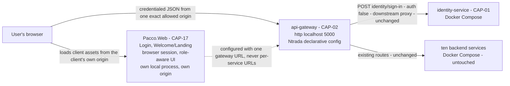
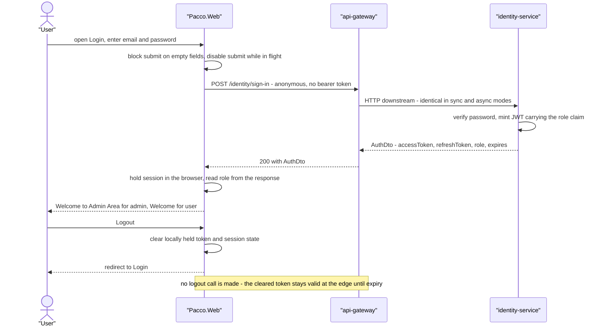

# Solution Design Report — Work item 13652

| Field | Value |
|-------|-------|
| Work item | **13652** — Common Pacco Login Experience and Role-Aware Landing Page |
| Platform | Pacco |
| Stage | `architecture_evolution_generation` |
| Date | 2026-09-22 |
| Branch | `feature/13652/architecture-evolution-generation` |
| Base ref of all cited source | `feature/13652/aidlc` |
| Delivery outcomes | `DO1` Common Pacco Login Experience (wave 1, priority 1, complexity high) · `DO2` Role-Aware Landing Page with Session Protection and Logout (wave 2, priority 2, complexity medium) |
| Writable repository | `Pacco.Context` (this repository). The other thirteen clones are read-only context and none was modified |

## Contents

1. [Scope and summary](#1-scope-and-summary)
2. [Applicable ADRs](#2-applicable-adrs)
3. [Finalized design decisions](#3-finalized-design-decisions)
4. [Target design and solution shape](#4-target-design-and-solution-shape)
5. [Downstream design obligations](#5-downstream-design-obligations)
6. [Open items and escalations](#6-open-items-and-escalations)

---

## 1. Scope and summary

Work item 13652 gives Pacco its first authenticated end-user entry point: one common Login screen for
both administrators and normal users, and a deliberately simple role-aware Welcome/Landing screen
with session protection and logout.

**What makes this an architecture task rather than two screens.** The platform has never had a
client. Its capability inventory runs `CAP-01` through `CAP-16` with no presentation capability, no
frontend asset exists anywhere in the fourteen clones, and the ADR corpus explicitly excluded the
platform's client strategy because no decision had been made and none could be reconstructed. The
one browser-facing surface the platform owns is a developer SignalR test harness served from inside
`operations-service` and addressing port `5005` directly, bypassing the edge. Adding a login screen
therefore requires deciding where a client lives, how it reaches the platform, and what the edge must
allow a browser to do — none of which the platform has ever answered.

**What this stage produced.** One new architecture decision record, `ADR-021`, and the inventory
updates that follow from it. The design it records is deliberately the smallest one that works:

- `Pacco.Web` becomes the platform's standalone browser client and the sole owner of a new
  capability, **CAP-17 Web Presentation & Browser Session**.
- It runs as its own local process beside the Docker Compose backend — not inside a backend image,
  not served by Ntrada — and reaches the platform only through the local API Gateway at
  `http://localhost:5000`.
- The single platform change is one configuration value: the gateway's `allowedOrigins` goes from
  `'*'` to the exact `Pacco.Web` local origin, with `allowCredentials: true` retained.
- Logout is a client-side session discard, with the limitation stated plainly rather than implied.

**What is explicitly not in scope.** No new deployable service. No backend-for-frontend. No change to
`identity-service`, to `POST /identity/sign-in`, to the gateway's JWT validation, or to revocation
behaviour. No new gateway route of any kind. No Dev, QA, Staging or Production frontend
environments — none exist, and defining them now would be inventing architecture.

**Two dimensions arrived already settled.** The client topology with the CORS posture, and the logout
semantics, were both answered by reviewer decision before this stage began (`intents/13652.md`,
*Input required recap*, items 1 and 2, both `Status: Resolved`). They are carried into `ADR-021` §4 as
binding constraints, not re-explored as options.

**Artifacts written by this stage**, all in `Pacco.Context`:

| Path | Change |
|------|--------|
| `docs/adr/standalone-browser-client-and-browser-caller-edge-contract.md` | **New** — `ADR-021` |
| `docs/architecture-inventory/risk-constraint-gap-register.md` | **New** — the shared living risk/constraint/gap queue, carrying this stage's FMEA |
| `docs/specs/13652/solution-design.md` | **New** — this report |
| `docs/architecture-inventory/baselines/architecture-baseline.md` | §7 preamble corrected, §7.1 reframed, §7.4 added, §11.1 corrected, §11.4 added, X4 resolved, revision row |
| `docs/architecture-inventory/baselines/capability-baseline.md` | CAP-17 added with ownership and characteristics, CAP-02 and CAP-16 updated |
| `docs/architecture-inventory/baselines/ui-inventory.md` | §1.4, §10.4 and §12 updated, B1 and Q7 resolved |
| `docs/architecture-inventory/architecture-views.md` | §1.1 updated, §3.6 added, §4.6 added |
| `docs/architecture-inventory/adr-candidates.md` | Q2 resolved, exclusion item 8 updated, backlog note and ADR mapping extended |
| `docs/architecture-inventory/repo-summary/Pacco.Web.md` | Recorded purpose added, B1, Q1 and Q3 resolved |

---

## 2. Applicable ADRs

| ADR | Title | Relationship to this work | What it binds here |
|-----|-------|---------------------------|--------------------|
| **`ADR-021`** | Pacco.Web as the standalone browser client, and the browser-caller contract at the edge | **Authored by this stage** | The whole design. §5 rules 1–7 |
| `ADR-004` | A declarative configuration-driven gateway as the single north-south edge | Governs, unchanged | Obligation 1 — the CORS change is a public-contract change and is reviewed as one. Obligation 3 — no aggregation or per-client shaping is added to the edge, so no BFF is introduced. §4.1.3 — CORS is an extension configured once |
| `ADR-006` | Authentication enforced at the edge, with fail-open in-service authorization | Governs, unchanged | The client authenticates nothing itself and routes every call through the gateway. Obligation 3, the edge must be unavoidable, is honoured by configuring one gateway URL and no service URLs |
| `ADR-007` | Split JWT trust root between the gateway and the domain services | Governs, unchanged | Obligation 4 — revocation is not consulted at the edge. This is why logout cannot invalidate a token and why the limitation is stated rather than solved |
| `ADR-017` | Compose and process-manager deployment | Governs, unchanged | The client runs beside the Compose stack and changes no stack. A later Compose entry is a `CAP-16` change |
| `ADR-018` | Repository per service, independent release | Governs, extended in application | The client builds and releases from its own repository, on no backend's release path |
| `ADR-020` | .NET Core 3.1 as the platform runtime baseline | Governs the backend, deliberately not inherited | A browser client is not a .NET deployable. `ADR-021` §6.2 item 2 records that the platform acquires a second runtime technology family, with no CI, lockfile convention or dependency policy to inherit |
| `ADR-005` | Dual-mode edge writes selected by configuration | Not exercised | `DO1` and `DO2` make one call, `POST /identity/sign-in`, which is an identical anonymous HTTP downstream proxy in **both** the sync and the async configurations. The first browser surface that issues a domain write inherits this record |
| `ADR-014` | The operation-status contract for asynchronous writes | Not exercised | Same reason. Recorded so the next browser surface does not discover it late |

**No ADR was superseded, amended or contradicted by this work.**

---

## 3. Finalized design decisions

| # | Decision | Rationale | Alternatives rejected |
|---|----------|-----------|----------------------|
| **D1** | `Pacco.Web` is the standalone browser client and the sole owner of web presentation | No component on the platform owns a presentation boundary, and every candidate fails: `operations-service` static hosting and a gateway-served client both couple the client's lifecycle to a backend release and are forbidden by the reviewer-resolved answer, `identity-service` would gain a second unrelated reason to change, and the `Pacco` repository owns no application code | Embedding in a backend image · serving assets from Ntrada · hosting pages in `identity-service` · carrying the client in the orchestration repository |
| **D2** | A **new runtime component**, not a new bounded context and not a new deployable service | It owns no domain data and no business rule — it renders and holds a session. It has no deployment target, no Compose entry and no port in the `5000`–`5009` block, so it is not a deployable at this stage | Introducing it as a service in Compose now |
| **D3** | **No backend-for-frontend** | `ADR-004` obligation 3 admits a BFF only for response aggregation or per-client shaping. The client makes one call and consumes the response unchanged, so a BFF would add a deployable, a release and a contract for no delivered benefit | A BFF between the client and the services — preserved on `ADR-004`'s existing terms for the day aggregation is genuinely needed |
| **D4** | The browser reaches the platform **only** through `http://localhost:5000` | `ADR-006` obligation 3 requires the edge to be unavoidable. Configuring one gateway URL and no per-service URLs makes bypass impossible by configuration, unlike the SignalR harness which hard-codes `http://localhost:5005/pacco` | Direct-to-service addressing on port `5004` for `identity-service` |
| **D5** | `extensions.cors.allowedOrigins` becomes the exact `Pacco.Web` local origin, with `allowCredentials: true` retained, in **all four** `ntrada*.yml` files | The CORS protocol forbids a wildcard `Access-Control-Allow-Origin` together with credentials, and `DO1`'s browser path is credentialed. The four files carry an identical CORS block today and `ADR-004` obligation 2 requires them to stay consistent | Keeping the wildcard and dropping credentials · moving CORS out of YAML into gateway code |
| **D6** | `POST /identity/sign-in` is consumed **unchanged** | It is already an anonymous `auth: false` downstream route in all four configurations, and `AuthDto` already carries `AccessToken`, `RefreshToken`, `Role` and `Expires`. Both `DO1`'s authentication outcome and `DO2`'s role source exist today | Adding a route, changing the contract, or touching `identity-service` |
| **D7** | Logout is a **client-side session discard only** | Reviewer decision, consistent with `ADR-007` obligation 4. Exposing revocation at the edge would turn a login feature into a gateway and authentication architecture change | Adding a logout or revoke gateway route · changing the gateway's JWT validation |
| **D8** | The limitation is stated explicitly: **client-side logout does not invalidate the already-issued token at the platform level. It only ends the browser session, so the token stays acceptable to the gateway and the domain services until it expires** | A limitation that is not written down is a defect waiting to be discovered by a user on a shared machine | Leaving it implied |
| **D9** | Only the local runtime path is in scope | There are no Dev, QA, Staging or Production frontend environments. Environment origins, gateway URLs, DNS names and deployment targets are defined when those environments are introduced | Pre-defining per-environment origins now |
| **D10** | `STYLE_README.md` and `pacco-material-you.css` are absorbed into `Pacco.Web` as the platform's first authored stylesheet, **client-scoped, not a platform design system** | No authored stylesheet, component library or design token set exists anywhere — the one surface uses stock Bootstrap 4.0.0 from a CDN. A shared, versioned design system is a separate decision with a separate owner | Declaring a platform-wide design system now |
| **D11** | A new capability **CAP-17 Web Presentation & Browser Session** is recorded, owned by `Pacco.Web`, marked as established by decision rather than observed in code | The capability inventory is the platform's ownership map. A boundary with no capability entry has no owner, and CAP-01 and CAP-02 cannot absorb presentation without acquiring a second reason to change | Filing the client under CAP-01 or CAP-02 |

---

## 4. Target design and solution shape

### 4.1 Component shape



The dashed edge is configuration, not traffic. Everything to the right of `Pacco.Web` exists today
and is unchanged except for one CORS value on the gateway.

### 4.2 The cross-DO contract edge, resolved

`DO1` **produces-for** `DO2`: the authenticated session and the identity role claim. That edge is
fully resolved — one producer, one transport, one consumer, no unowned hop:

| Element | Resolution | Proven by |
|---------|-----------|-----------|
| **Producer** | `identity-service`, via `POST /identity/sign-in` | `ntrada.yml:264-270` and `ntrada-async.docker.yml:308-314` — `auth: false`, `use: downstream`, identical in both gateway modes |
| **Transport** | Synchronous HTTPS/JSON through `api-gateway`, returning `AuthDto` with `AccessToken`, `RefreshToken`, `Role`, `Expires` | `Identity.Application/DTO/AuthDto.cs:3-9`; `IdentityService.cs:49-79` |
| **Carrier** | The in-browser session held by `Pacco.Web` — the component introduced by D1 and D2 | `ADR-021` §5 rule 1 |
| **Consumer** | The Welcome/Landing page, inside the same component | `ADR-021` §5.2 |
| **Role vocabulary** | The closed, lower-cased set `user` and `admin`, validated case-insensitively | `Identity.Core/Entities/Role.cs` |

**No new transport, no new backbone and no new contract is required.** The producer, the route and
the response shape all exist today. The only new thing is the consumer.

### 4.3 Runtime flow



Two error paths share these hops and are client behaviour: an invalid credential and an
`identity-service` failure both return a non-success response, and both must render a **fixed
non-technical message**. This is necessary, not merely good practice: the gateway sets
`customErrors.includeExceptionMessage: true`, so the raw downstream exception message does reach the
browser. An already-expired token takes the logout path with a session-expired message.

### 4.4 The one platform change

```yaml
# ntrada.yml, ntrada.docker.yml, ntrada-async.yml, ntrada-async.docker.yml
# extensions.cors - lines 27-41 in each file, identical across all four today
extensions:
  cors:
    allowCredentials: true          # unchanged
    allowedOrigins:
      - '<the exact Pacco.Web local origin>'   # was: '*'
    allowedMethods:                 # unchanged - see R-04
      - post
      - put
      - delete
    allowedHeaders:                 # unchanged
      - '*'
    exposedHeaders:                 # unchanged
      - Request-ID
      - Resource-ID
      - Trace-ID
      - Total-Count
```

Nothing else in any gateway configuration changes. No route is added, removed or modified. The `jwt`
extension — `validIssuer: pacco`, `validateAudience: false`, `validateIssuer: true`,
`validateLifetime: true` — is untouched, which is what keeps `DO2`'s "zero changes to the gateway's
JWT validation or revocation behaviour" target satisfied by construction.

### 4.5 Deployment placement

`Pacco.Web` has **no entry in `compose/services.yml`**, no entry in either PM2 manifest, no port in
the `5000`–`5009` block and no gateway route. All four are decisions (`ADR-021` §5 rule 6), not
omissions. It runs as a local process on the developer's host and calls the gateway on the host port
Compose already publishes (`compose/services.yml:4-13`, `5000:80`). Adding it to Compose later, as
its own independent service and never inside a backend container, is a `CAP-16` change that leaves
this boundary intact.

### 4.6 Load-bearing assumptions ledger

Every behaviour this design depends on, proven from source before it was depended on.

| # | Depended-on behaviour | Proof (`file:function` or `file:lines`) | Fails loud or silent | Verdict |
|---|----------------------|------------------------------------------|----------------------|---------|
| L1 | `POST /identity/sign-in` is an anonymous downstream proxy in **both** gateway modes, so sign-in never becomes a fire-and-forget message | `ntrada.yml:264-270`; `ntrada-async.docker.yml:308-314` (`auth: false`, `use: downstream`, `downstream: identity-service/sign-in`) | Loud — a missing route returns 404 at the first call | **proven** |
| L2 | Sign-in returns the role in the response body, so the landing page has a role source without decoding a token | `Identity.Application/DTO/AuthDto.cs:3-9` (`Role` property); `IdentityService.cs:49-79` (`SignInAsync`) | Loud — an absent field is immediately visible | **proven** |
| L3 | The role vocabulary is closed and lower-cased, so "unknown role" is well defined | `Identity.Core/Entities/Role.cs` (`Role.User`, `Role.Admin`, `IsValid` lower-cases before comparing) | **Silent** — a permissive comparison shows the wrong message with no error. This is why `R-06` scores `D=5` | **proven** |
| L4 | The gateway is reachable at `http://localhost:5000` under Compose, and loads `ntrada-async.docker.yml` there | `Pacco/compose/services.yml:4-13` (`ports: 5000:80`, `NTRADA_CONFIG=ntrada-async.docker.yml`) | Loud — connection refused | **proven** |
| L5 | All four gateway configurations carry an identical CORS block, so a change must be applied four times | `ntrada.yml:27-41`, `ntrada.docker.yml:27-41`, `ntrada-async.yml:27-41`, `ntrada-async.docker.yml:27-41` | **Silent** — changing three of four works locally and breaks elsewhere. This is `R-05` | **proven** |
| L6 | The gateway returns downstream exception messages to the caller | `ntrada.yml:24-25` (`customErrors.includeExceptionMessage: true`) and the three siblings | **Silent** until a user sees it. This is `R-02`, and it is why `N2` is a requirement rather than a nicety | **proven** |
| L7 | The gateway validates token lifetime at the edge, so an expired token is rejected there | `ntrada.yml:43-48` (`jwt.validateLifetime: true`) and the three siblings | Loud — a 401 at the first authenticated call | **proven** |
| L8 | No gateway route reaches any token-management endpoint, so logout cannot revoke and the refresh token cannot be redeemed | All four `ntrada*.yml` `identity` modules declare only `/users/{userId}`, `/me`, `/sign-up`, `/sign-in` | **Silent by design** — nothing errors, the token simply stays valid. This is `R-03` and `R-10` | **proven** |
| L9 | `Pacco.Web` contains no code to extend or preserve | `git -C hianshul100_Pacco.Web ls-files` → `README.md`; one commit `b3bf026` | Loud | **proven** |
| L10 | Ntrada's actual CORS matching behaviour | **Not provable here** — Ntrada is a NuGet reference with no source in the workspace | Silent in the dangerous direction: the edge could stay permissive after the wildcard is removed | **Unproven — tracked as `R-14` and `ADR-021` A1/FA3, verified by observation when `R-01` is applied.** Not blocking: it does not change the design, only confirms the configuration means what it reads as |

Nine of ten are proven from source. The tenth is unprovable from this workspace and is carried as a
scored risk with a named verification step, rather than assumed.

---

## 5. Downstream design obligations

What each later stage must carry. These are obligations, not suggestions — each one is traceable to
an acceptance target or to a scored risk.

### 5.1 For High-Level Solution design (`DO1`, wave 1)

1. **Fix the exact local origin** (scheme, host, port) and apply it to `extensions.cors.allowedOrigins`
   in all four `ntrada*.yml` files, keeping `allowCredentials: true`. `R-01`, `R-05`, `ADR-021` FA1.
2. **Configure exactly one platform URL** in the client — `http://localhost:5000` — and no
   per-service URL. `ADR-021` §5 rule 3.
3. **Map every non-success response to a fixed non-technical message**, and never render a response
   body verbatim. This is required because the edge returns exception text. `R-02`, `N2`.
4. **Never persist, log or URL-encode a credential**, and compile no credential into the client.
   `R-08`, `N1`.
5. **Disable submission while a sign-in request is in flight** and show a processing state. `R-11`,
   `N7`.
6. **Block submission with visible validation when either field is empty.** `DO1` acceptance.
7. **Establish the client's own build**, independent of every backend project, solution and image.
   `ADR-018`, `ADR-021` §5 rule 2.
8. **Adopt `STYLE_README.md` and `pacco-material-you.css`** as the screens' visual foundation, scoped
   to this client. `D10`.

### 5.2 For High-Level Solution design (`DO2`, wave 2)

1. **Read the role only from the authenticated identity response**, compared against the closed
   lower-cased vocabulary `user` and `admin`. Unknown renders the non-admin message. Never infer a
   role from an email address or a username. `R-06`, `N4`.
2. **Guard every entry into the landing route** — navigation, direct load, reload, back-navigation
   after logout — redirecting to Login without a session. `R-07`, `N3`.
3. **Implement logout as a session discard only**: clear the locally held token and session state,
   redirect to Login, stop using the cleared token. Add **no** gateway route and change **no** gateway
   JWT or revocation behaviour. `D7`, `DO2` target.
4. **Handle an expired token on the same path**, with a session-expired message. `ADR-021` §5 rule 5.
5. **Surface the limitation in D8 wherever logout is documented for users or operators.** A
   limitation only in an ADR is a limitation nobody who needs it will read.
6. **Introduce no dashboard widget and no business functionality.** `DO2` scope.

### 5.3 For Low-Level Design and implementation

1. Keep all business rules out of the client. Anything the platform must stand behind belongs in a
   service. `ADR-021` §5 rule 1.
2. Write the four minimum frontend rules as the client is built — accessibility level,
   error-presentation rule, no-credential-logging rule, dependency policy — because none exists to
   inherit. `R-09`, `G-04`.
3. Do not add a client timeout or retry policy justified by a number nobody set. If one is needed,
   escalate `G-03` first. `N8`.

### 5.4 For testing

Every row of `ADR-021` §8 is a required verification, with `N1`–`N7` as pass/fail gates. `N6` is the
exception: it exists to **measure** the accepted residual risk in `R-03`, not to pass. Capture a
token, log out, replay it against an authenticated route — it will succeed, and that is the recorded
limitation being confirmed rather than a defect.

### 5.5 For the pattern catalog

`ADR-021` §9 proposes one addition: the shape this record establishes — one configured gateway URL,
no per-service URLs, no direct service addressing, one exact allowed origin — is worth catalogueing
as a candidate integration pattern so a second client inherits it rather than re-deciding it. Owner:
platform architect, when a second browser surface is planned.

---

## 6. Open items and escalations

### 6.1 Reviewer action required now

Four items need a human decision before or during `DO1`. Each says what it is, who must act, and what
breaks if it is ignored.

| # | Item | Who must act | What breaks if ignored | Reference |
|---|------|--------------|------------------------|-----------|
| **E1** | **The exact `Pacco.Web` local origin has not been chosen.** `http://localhost:3000` is the intent's example, not a committed value. It must be fixed and written into all four `ntrada*.yml` files | Platform owner, with the `Pacco.Web` implementer | Every credentialed browser call is refused cross-origin and `DO1` cannot complete a sign-in round trip. It fails loudly and immediately, but it blocks the wave-1 acceptance criterion outright | `R-01`, `ADR-021` B1/FA1 |
| **E2** | **Nobody has recorded which gateway configuration file each environment loads.** Compose loads `ntrada-async.docker.yml`, which settles the local case and not the others | Platform owner | The exact origin can land in a file the running gateway does not read. Under a wildcard this ambiguity was invisible — an exact origin makes it load-bearing | `R-05`, `G-02`, `ADR-004` B2 |
| **E3** | **No repository has a named owner**, so the gateway's public-contract change has no reviewer and `ADR-021` cannot leave `Proposed`. Two names — `Pacco.APIGateway` and `Pacco.Web` — unblock it | Platform owner | `ADR-004` §2 obligation 1 is unenforceable, and all twenty-one ADRs stay `Proposed` indefinitely | `R-12`, `G-01`, `adr-candidates.md` B4 |
| **E4** | **Confirm the accepted residual risk in D8** before `DO2` ships: a logged-out session's token stays valid at the gateway and at every domain service until it expires. This is a decision to reaffirm, not a defect to fix | Platform owner and Product | If it is not consciously accepted at the point of shipping, it will be discovered later as a security finding rather than recognised as a recorded trade-off. On a shared machine it is a real access-control gap | `R-03`, `ADR-021` §5 rule 5 / §6.2 item 1 |

**One item is an escalation rather than a blocker.** `G-03` — no availability target, latency budget
or error-rate objective is documented for any service, for the gateway, or for the platform. It does
not block `DO1`, and it does mean that whatever timeout the Login screen picks becomes the platform's
de facto target by accident. **Platform owner**: set one, or accept that the first value chosen
becomes the standard.

### 6.2 Delegated downstream — no action now

These are recorded, owned and scheduled. Nothing here needs a reviewer today.

| # | Item | Handled by | Why it can wait |
|---|------|-----------|-----------------|
| **X1** | `extensions.cors.allowedMethods` lists only `post`, `put` and `delete`, so no cross-origin `GET` is permitted | **[handled later by HLS]** — the platform architect, in the change that adds the first browser read surface | `DO1` and `DO2` make one call and it is a `POST`. Widening the edge's accepted surface speculatively buys nothing and enlarges it for no delivered need | 
| **X2** | The refresh token has no redeemable gateway route, so sessions end at access-token expiry rather than renewing | **[handled later by the platform owner, before the third browser surface]** | Acceptable for two screens. What is needed eventually is a stated position — route it, or declare that sessions end at expiry by design | 
| **X3** | Ntrada's actual CORS matching behaviour is unverified, because the library's source is not in the workspace | **[handled later by the platform owner, when E1 is applied]** | It does not change the design. It confirms the configuration means what it reads as, and the check is two requests | 
| **X4** | `STYLE_README.md` and `pacco-material-you.css` have no versioning, no distribution mechanism and no consumer contract | **[handled later by the design-system decision]** — platform architect, when a second client or surface appears | One consumer needs no distribution mechanism. A second one forces the decision, and forcing it early would be inventing a design system nobody has asked for | 
| **X5** | The committed JWT `issuerSigningKey` must leave source control | **[handled later by the platform owner]** — `ADR-006` obligation 4, which predates this work | Not introduced by this work and not discharged by it. It is not a blocker for local development, and it is a blocker for any non-local environment | 
| **X6** | `ADR-005` dual-mode edge writes and `ADR-014` the operation-status contract both change what a browser caller must handle | **[handled later by HLS]** — whoever designs the first browser surface that issues a domain write | Neither is exercised by `DO1` or `DO2`. Recorded here so that surface does not discover them late | 
| **X7** | The message path into `identity-service` has no evidenced producer — `SubscribeCommand<SignUp>()` is registered but nothing publishes `sign_up` | **[handled later by HLS]** — pre-existing gap GAP-4 | Sign-up is not in this work item's scope. Flagged because a client team working near identity will meet it | 

### 6.3 What this stage deliberately did not do

Stated so a reviewer can check the scope rather than infer it: no new deployable service was
introduced, no backend-for-frontend was added, no gateway route was created or changed, no ADR was
superseded or amended, no read-only repository was modified, no per-environment configuration was
invented, and no availability, latency or error-rate number was asserted where the platform has never
set one.
